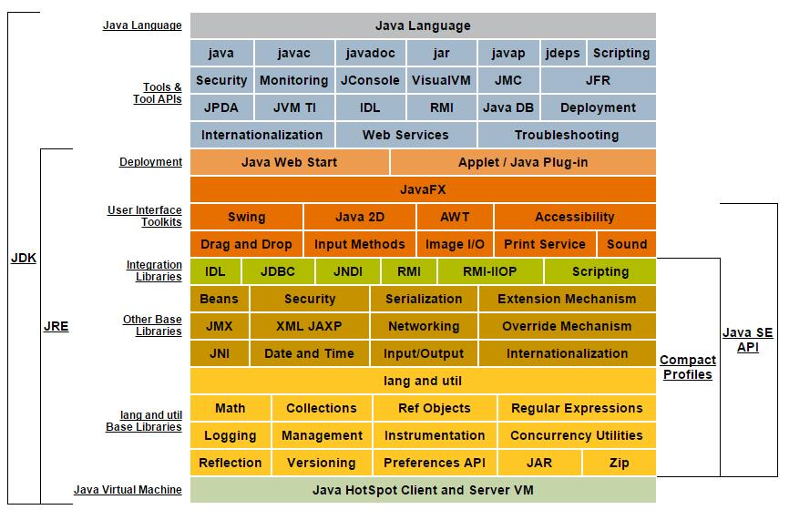
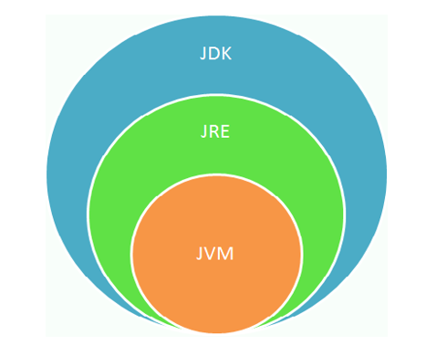
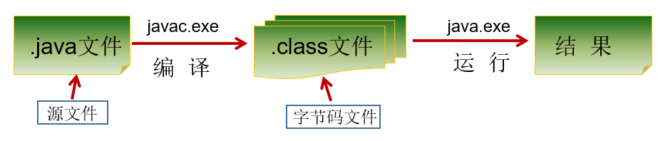

# 1. 什么是 JDK、JRE、JVM

JDK（Java Development Kit）：是 Java 程序的开发工具包，包含 JRE 和开发人员使用的工具。

JRE（Java Runtime Environment）：是 Java 程序的运行时环境，包含 JVM 和运行时所需要的核心类库。

JVM（Java Virtual Machine）：是 Java 虚拟机，使用 JVM 来实现跨平台。



 

> 小结：
>
> JDK = JRE + 开发工具集（例如Javac编译工具等）
>
> JRE = JVM + Java SE 标准类库

# 2. JDK安装

[Oracle官网](https://www.oracle.com/cn/java/technologies/downloads/)

Windows 环境变量

```
//添加系统变量
JAVA_HOME D:\develop\jdk\jdk1.8\jdk1.8.0_131
//系统变量追加
Path %JAVA_HOME%\bin
```

Linux 环境变量

```
vim /etc/profile.d/my_env.sh
//追加路径
export JAVA_HOME=/usr/lib/jdk/jdk1.8.0_171
export PATH=${JAVA_HOME}/bin:$PATH
//刷新环境变量
source /etc/profile
```

# 3. 开发体验

Java 程序开发三步骤：**编写**、**编译**、**运行**。

- 将 Java 代码**编写**到扩展名为 .java 的源文件中
- 通过 javac.exe 命令对该 java 文件进行**编译**，生成一个或多个字节码文件
- 通过 java.exe 命令对生成的 class 文件进行**运行**



**编写**

新建文件文件名称为：HelloWorld.java，main 方法是 java 程序的入口

```
class HelloChina {
  	public static void main(String[] args) {
    	System.out.println("HelloWorld!!");
  	}
}
```

**编译**

在 DOS 命令行中，使用 javac 命令进行编译，生成 HelloWorld.class 字节码文件

```
javac HelloWorld.java
```

**运行**

在 DOS 命令行中，使用 java 命令进行运行

```
java HelloWorld
```

# 4. 源文件与类名

一个 java 源文件中可以包含多个类名，但是只能包含有一个 public 类名，并且该 public 类名要与源文件保持保持一致。

建议一个源文件中尽量只写一个类，便于维护。

# 5. 注释

**单行注释**

```
//注释文字
```

**多行注释**

```
/* 
注释文字1 
注释文字2
注释文字3
*/
```

**文档注释**

```
/**
 * @author 指定java程序的作者
 * @version 指定源文件的版本
 */
```

