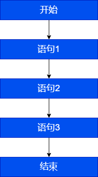
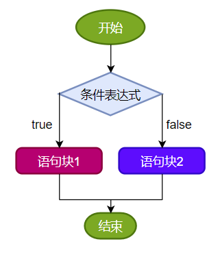
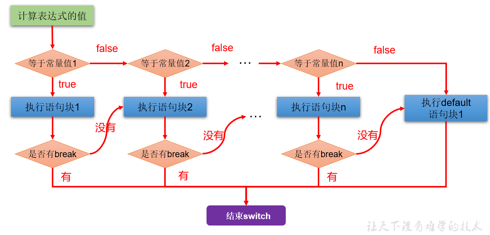
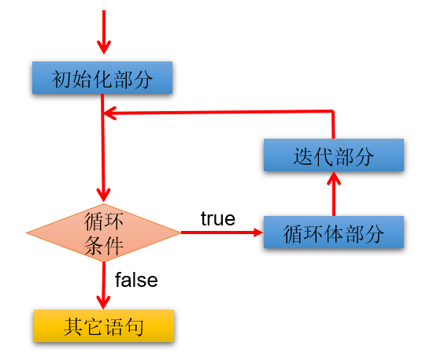
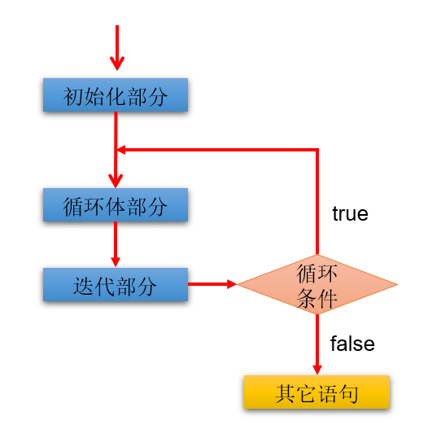

# 1. 顺序结构

顺序结构就是程序**从上到下逐行**地执行。表达式语句都是顺序执行的。并且上一行对某个变量的修改对下一行会产生影响。



```java
public static void main(String[] args){
    int x = 1;
    int y = 2;
    System.out.println("x = " + x);		
    System.out.println("y = " + y);	
    //对x、y的值进行修改
    x++;
    y = 2 * x + y;
    x = x * 10;	
    System.out.println("x = " + x);
    System.out.println("y = " + y);
}

//错误形式
public static void main(String[] args) {
	int num2 = num1 + 2;
	int num1 = 12;
}
```

# 2. 分支语句

## 2.1 if-else 条件判断结构

**单分支条件判断：if**


```java
if(条件表达式)｛
  	语句块;
｝
```

**双分支条件判断：if...else**



```java
if(条件表达式) { 
  	语句块1;
}else {
  	语句块2;
}
```

**多分支条件判断：if...else if...else**


```java
if (条件表达式1) {
  	语句块1;
} else if (条件表达式2) {
  	语句块2;
}
...
}else if (条件表达式n) {
 	语句块n;
} else {
  	语句块n+1;
}
```

## 2.2 switch-case 选择结构

**语法**



```java
switch(表达式){
    case 常量值1:
        语句块1;
        //break;
    case 常量值2:
        语句块2;
        //break; 
    // ...
   [default:
        语句块n+1;
        break;]
}
```

**注意事项**

1、表达式的值必须是下述几种类型之一：byte，short，char，int，枚举 （jdk 5.0），String （jdk 7.0）。

2、case 子句中的值必须是常量，不能是变量名或不确定的表达式值或范围。

3、同一个 switch 语句，所有 case 子句中的常量值互不相同。

4、break 语句用来在执行完一个 case 分支后使程序跳出 switch 语句块，如果没有 break，程序会顺序执行到 switch 结尾（case 穿透）。

5、default 子句是可选的。同时，位置也是灵活的。当没有匹配的 case 时，执行 default 语句。

```java
//正确示例
int num = 1;
switch(num){
    case 0:
        System.out.println("zero");
        break;
    case 1:
        System.out.println("one");
        break;
    case 2:
        System.out.println("two");
        break;
    case 3:
        System.out.println("three");
        break;
    default:
        System.out.println("other");
        //break;
}

//错误示例
int key = 10;
switch(key){
	case key > 0 :
        System.out.println("正数");
        break;
    case key < 0:
        System.out.println("负数");
        break;
    default:
        System.out.println("零");
        break;
}
```

## 2.3 if-else 与 switch-case 比较

凡是使用 switch-case 的结构都可以转换为 if-else 结构。反之，不成立。

如果既可以使用 switch-case，又可以使用 if-else，建议使用 switch-case。因为效率稍高。

**if-else 语句优势**

1、if 语句的条件是一个布尔类型值，if 条件表达式为 true 则进入分支，**可以用于范围的判断**，也可以用于等值的判断，使用范围更广。

2、switch 语句的条件是一个常量值，只能判断某个变量或表达式的结果是否等于某个常量值，使用场景较狭窄。

**switch 语句优势**

1、当条件是判断某个变量或表达式是否等于某个固定的常量值时，使用 if 和 switch 都可以，习惯上使用 switch 更多。因为**效率稍高**。当条件是区间范围的判断时，只能使用if语句。

2、使用 switch 可以利用**穿透性**，同时执行多个分支，而 if...else 没有穿透性。

# 3. 循环语句

**概述**：循环语句具有在**某些条件**满足的情况下，**反复执行**特定代码的功能。

**循环结构的四要素**：①初始化部分、②循环条件部分、③循环体部分、④迭代部分

## 3.1 for 循环



```java
for (1初始化部分; 2循环条件部分; 4迭代部分)｛
    3循环体部分;
｝
```

**执行顺序：**①-②-③-④-②-③-④-②-③-④.....-②

**说明：**

1、for( ; ; )中的两个`；`不能多也不能少

2、①初始化部分可以声明多个变量，但必须是同一个类型，用逗号分隔

3、②循环条件部分为boolean类型表达式，当值为false时，退出循环

4、④可以有多个变量更新，用逗号分隔

## 3.2 while 循环


```
1初始化部分
while(2循环条件部分)｛
    3循环体部分;
    4迭代部分;
}
```

**执行顺序：**①-②-③-④-②-③-④-②-③-④.....-②

**说明：**

1、while(循环条件)中循环条件必须是 boolean 类型。

2、注意不要忘记声明④迭代部分。否则，循环将不能结束，变成死循环。

3、for 循环和 while 循环可以相互转换。二者没有性能上的差别。实际开发中，根据具体结构的情况，选择哪个格式更合适、美观。

4、for 循环与 while 循环的区别：初始化条件部分的作用域不同。

## 3.3 do-while 循环



```
1初始化部分;
do{
	3循环体部分
	4迭代部分
}while(2循环条件部分); 
```

**执行过程：**①-③-④-②-③-④-②-③-④.....-②

**说明：**

1、结尾 while(循环条件)中循环条件必须是 boolean 类型

2、do{ }while( ); 最后有一个分号

3、do-while 结构的循环体语句是至少会执行一次，这个和 for 和 while 是不一样的

4、循环的三个结构 for、while、do-while 三者是可以相互转换的。

## 3.4 对比三种循环结构

**从循环次数角度分析**

do-while循环至少执行一次循环体语句。

for和while循环先判断循环条件语句是否成立，然后决定是否执行循环体。

**如何选择**

遍历有明显的循环次数（范围）的需求，选择for循环。

遍历没有明显的循环次数（范围）的需求，选择while循环。

如果循环体语句块至少执行一次，可以考虑使用do-while循环。

本质上：三种循环之间完全可以互相转换，都能实现循环的功能

## 3.5 死循环

```java
//使用for
for(;;){
    
}

//使用 while
while(true){

}

//使用 do-while
do{
    
}while(true);
```

# 4.break 和 continue 的使用

## 4.1 break 和 continue 说明

|          | 适用范围              | 在循环结构中使用的作用                   | 相同点                 |
| -------- | --------------------- | ---------------------------------------- | ---------------------- |
| break    | switch-case、循环结构 | 一旦执行，就结束(或跳出)**当前**循环结构 | 关键字的后面，不能声明 |
| continue | 循环结构              | 一旦执行，就结束(或跳出)**当次**循环结构 | 关键字的后面，不能声明 |

```java
for(int i = 1;i <= 10;i++){

    if(i % 4 == 0){
        //break;//123
        continue;//123567910
        //System.out.println("后面声明关键字");
    }

    System.out.print(i);
}
```

## 4.2 带标签的使用

标签语句必须紧接在循环的头部。标签语句不能用在非循环语句的前面。

```java
l:for(int i = 1;i <= 4;i++){

    for(int j = 1;j <= 10;j++){
        if(j % 4 == 0){
            //break l;//123
            continue l;//123123123123
        }
        System.out.print(j);
    }
    System.out.println();
}
```

# 5. Scanner：键盘输入功能的实现

```java
import java.util.Scanner;//导包

public class Test {
    public static void main(String[] args) {
        Scanner scanner = new Scanner(System.in);//创建 Scanner 类对象
        while (true) {
            String next = scanner.next();//调用 next()|nextXxx() 获取指定类型变量
            System.out.println(next);
            if ("down".equals(next)) {
                break;
            }
        }
        scanner.close();//关闭资源
    }
}
```

# 6. 随机数

Math类的 random() 的调用，会返回一个[0,1)范围的一个 double 型值。

```java
Math.random() * 100  =>  [0,100)

(int)(Math.random() * 100)  =>  [0,99]

(int)(Math.random() * 100) + 5  =>  [5,104]

//获取 [a,b] 范围内的随机整数
(int)(Math.random() * (b - a + 1)) + a
```

