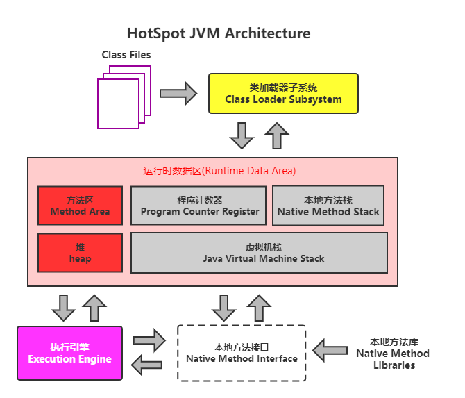
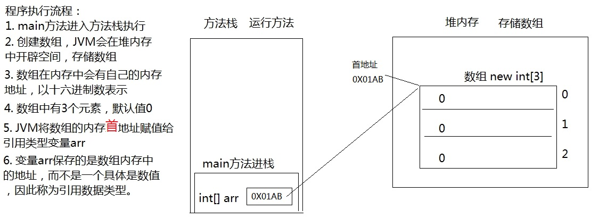
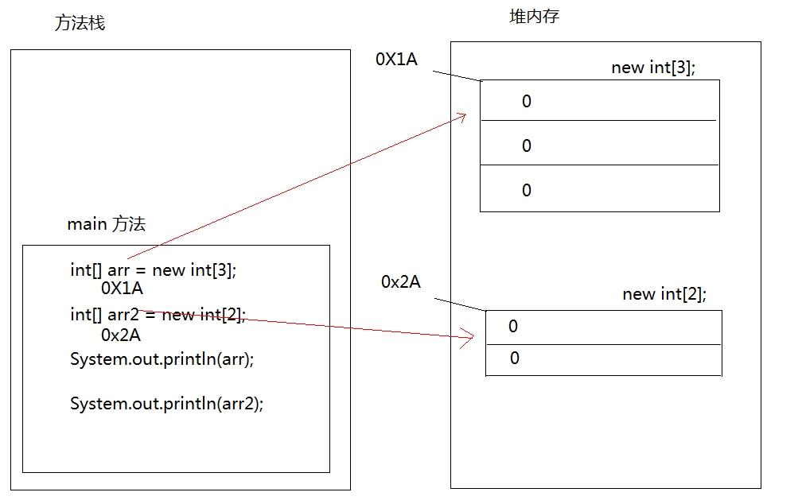
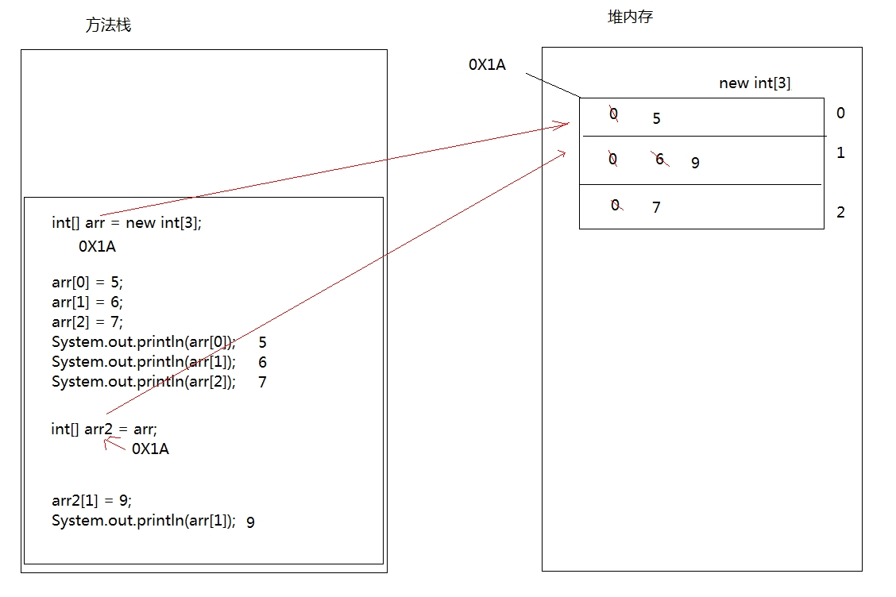
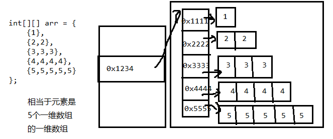

# 1. 数组概述

## 1.1 数组概述

数组（Array），是多个相同类型数据按一定顺序排列的集合，并使用一个名字命名，并通过编号的方式对这些数据进行统一管理。

**数组中的概念：**数组名、下标（或索引）、元素、数组长度


**数组的特点：**

1、数组本身是**引用数据类型**，而数组中的元素可以是**任何数据类型**，包括基本数据类型和引用数据类型。

2、创建数组对象会在内存中开辟一整块**连续的空间**。占据的空间的大小，取决于数组的长度和数组中元素的类型。

3、数组中的元素在内存中是依次紧密排列的，有序的。

4、数组，一旦初始化完成，其长度就是确定的。数组的**长度一旦确定，就不能修改**。

5、我们可以直接通过下标(或索引)的方式调用指定位置的元素，速度很快。

6、数组名中引用的是这块连续空间的首地址。

## 1.2 数组分类

**按照元素类型分：**

基本数据类型元素的数组：每个元素位置存储基本数据类型的值。

引用数据类型元素的数组：每个元素位置存储对象（本质是存储对象的首地址）。

**按照维度分：**

一维数组：存储一组数据。

二维数组：存储多组数据，相当于二维表，一行代表一组数据，只是这里的二维表每一行长度不要求一样。

# 2. 一维数组的使用

## 2.1 一维数组声明

```java
//推荐
元素的数据类型[] 一维数组的名称;

//不推荐
元素的数据类型  一维数组名[];

int[] arr;
int arr1[];
double[] arr2;
String[] arr3;  //引用类型变量数组
```

**数组的声明：**

1、数组的维度：在Java中数组的符号是[]，[]表示一维，\[]\[]表示二维。

2、数组的元素类型：即创建的数组容器可以存储什么数据类型的数据。元素的类型可以是任意的 Java 的数据类型。例如：int、String、Student 等。

3、数组名：就是代表某个数组的标识符，数组名其实也是变量名，按照变量的命名规范来命名。数组名是个引用数据类型的变量，因为它代表一组数据。

## 2.2 一维数组初始化

**静态初始化**

如果数组变量的初始化和数组元素的赋值操作同时进行，那就称为静态初始化。

静态初始化，本质是用静态数据（编译时已知）为数组初始化。此时数组的长度由静态数据的个数决定。

```java
//语法一
数据类型[] 数组名 = new 数据类型[]{元素1,元素2,元素3,...};
int[] arr = new int[]{1,2,3,4,5};

//语法二
数据类型[] 数组名;
数组名 = new 数据类型[]{元素1,元素2,元素3,...};
int[] arr;
arr = new int[]{1,2,3,4,5};

//语法三
数据类型[] 数组名 = {元素1,元素2,元素3...};//必须在一个语句中完成，不能分成两个语句写
int[] arr = {1,2,3,4,5};
```

**动态初始化**

数组变量的初始化和数组元素的赋值操作分开进行，即为动态初始化。

动态初始化中，只确定了元素的个数（即数组的长度），而元素值此时只是默认值，还并未真正赋自己期望的值。真正期望的数据需要后续单独一个一个赋值。

[长度]：数组的长度，表示数组容器中可以最多存储多少个元素。

```java
//语法一
数组存储的元素的数据类型[] 数组名字 = new 数组存储的元素的数据类型[长度];
int[] arr = new int[5];

//语法二
数组存储的数据类型[] 数组名字;
数组名字 = new 数组存储的数据类型[长度];
int[] arr;
arr = new int[5];
```

## 2.3 一维数组使用

**数组的长度**

每个数组都有一个属性 length 指明它的长度。

语法：`数组名.length`

```java
int[] arr = new int[]{1, 2, 3, 4, 5};
System.out.println(arr.length);//5
```

**数组中的一个元素**

每一个存储到数组的元素，都会自动的拥有一个编号，从0开始，这个自动编号称为**数组索引(index)或下标**，可以通过数组的索引/下标访问到数组中的元素。

语法：`数组名[index]`

```java
int[] arr = new int[]{1, 2, 3, 4, 5};
System.out.println(arr[0]);//1
System.out.println(arr[4]);//8
```

**数组的下标范围**

数组的下标从0开始，下标范围是 `[0,数组名.length-1]`。

```java
int[] arr = new int[]{1, 2, 3, 4, 5};
System.out.println("arr数组的第1个元素：" + arr[0]);//1
System.out.println("arr数组的第2个元素：" + arr[1]);//2
System.out.println("arr数组的第3个元素：" + arr[2]);//3
System.out.println("arr数组的第4个元素：" + arr[3]);//4
System.out.println("arr数组的第5个元素：" + arr[4]);//5
```

**数组元素赋值**

语法：`数组名[index] = 变量值`

```java
int[] arr = new int[]{1, 2, 3, 4, 5};
arr[0] = 9;
System.out.println(arr[0]);//9
```

## 2.4 一维数组遍历

将数组中的每个元素分别获取出来，就是`遍历`。for循环与数组的遍历是绝配

```java
//普通for循环
int[] arr = new int[]{1, 2, 3, 4, 5};
for (int i = 0; i < arr.length; i++) {
    System.out.print(arr[i]);
}

//增强for循环
int[] arr = new int[]{1, 2, 3, 4, 5};
for (int i : arr) {
    System.out.print(i);
}
```

## 2.5 数组元素的默认值

对于基本数据类型而言，默认初始化值各有不同。

对于引用数据类型而言，默认初始化值为 null。

| 元素类型 | 默认初始值  |
| -------- | ----------- |
| byte     | 0           |
| short    | 0           |
| int      | 0           |
| long     | 0L          |
| float    | 0.0F        |
| double   | 0.0         |
| char     | 0 或 \u0000 |
| boolean  | false       |
| 引用类型 | null        |

# 3. 一维数组内存分析

## 3.1 Java虚拟机内存划分

为了提高运算效率，就对空间进行了不同区域的划分，因为每一片区域都有特定的处理数据方式和内存管理方式。



| 区域名称   | 作用                                                         |
| ---------- | ------------------------------------------------------------ |
| 虚拟机栈   | 用于存储正在执行的每个Java方法的局部变量表等。局部变量表存放了编译期可知长度<br/>的各种基本数据类型、对象引用，方法执行完，自动释放。 |
| 堆内存     | 存储对象（包括数组对象），new来创建的，都存储在堆内存。      |
| 方法区     | 存储已被虚拟机加载的类信息、常量、（静态变量）、即时编译器编译后的代码等数据。 |
| 本地方法栈 | 当程序中调用了native的本地方法时，本地方法执行期间的内存区域 |
| 程序计数器 | 程序计数器是CPU中的寄存器，它包含每一个线程下一条要执行的指令的地址 |

## 3.2 一维数组在内存中的存储

**一个一维数组内存图**

```java
public static void main(String[] args) {
  	int[] arr = new int[3];
  	System.out.println(arr);//[I@5f150435
}
```



**两个一维数组内存图**

```java
public static void main(String[] args) {
    int[] arr = new int[3];
    int[] arr2 = new int[2];
    System.out.println(arr);
    System.out.println(arr2);
}
```



**两个变量指向一个一维数组**

```java
public static void main(String[] args) {
    // 定义数组，存储3个元素
    int[] arr = new int[3];
    //数组索引进行赋值
    arr[0] = 5;
    arr[1] = 6;
    arr[2] = 7;
    //输出3个索引上的元素值
    System.out.println(arr[0]);
    System.out.println(arr[1]);
    System.out.println(arr[2]);
    //定义数组变量arr2，将arr的地址赋值给arr2
    int[] arr2 = arr;
    arr2[1] = 9;
    System.out.println(arr[1]);
}
```



# 4. 多维数组的使用

## 4.1 多维数组声明

```java
//推荐
元素的数据类型[][] 二维数组的名称;

//不推荐
元素的数据类型  二维数组名[][];
//不推荐
元素的数据类型[]  二维数组名[];


int[][] grades;
String[][] names;
```

## 4.2 多维数组初始化

**静态初始化**

```java
数据类型[][] 数组名 = new 数据类型[][]{{元素1,元素2,元素3,...},{元素1,元素2}};
int[][] arr = new int[][]{{3, 8, 2}, {2, 7}, {9, 0, 1, 6}};
```

**动态初始化**

```java
元素的数据类型[][] 二维数组名 = new 元素的数据类型[m][n];
二维数组名[行下标][列下标] = 值;

int[][] arr = new int[3][2];
arr[0][0] = 1;
```

## 4.3 多维数组使用

**数组长度**

语法：`数组名.length`

```java
int[][] arr = {
    {96, 85, 75},
    {52, 42, 56, 75},
    {99, 96, 74, 72, 75},
};

System.out.println("二维数组：" + arr.length);//3
System.out.println("第一组：" + arr[0].length);//3
System.out.println("第二组：" + arr[1].length);//4
System.out.println("第三组：" + arr[2].length);//5
```

**数组中的一个元素**

语法：`数组名[index][index]`

```java
int[][] arr = {
    {96, 85, 75},
    {52, 42, 56, 75},
    {99, 96, 74, 72, 75},
};

System.out.println("第一行第一个：" + arr[0][0]);//96
System.out.println("第二行第二个：" + arr[1][1]);//42
System.out.println("第三行第三个：" + arr[2][2]);//74
```

**数组元素赋值**

语法：`数组名[index][index] = 变量值`

```java
int[][] arr = {
    {96, 85, 75},
    {52, 42, 56, 75},
    {99, 96, 74, 72, 75},
};
arr[0][0] = 20;
System.out.println("第一行第一个：" + arr[0][0]);//20
```

## 4.4 二维数组遍历

```java
int[][] arr = {
    {96, 85, 75},
    {52, 42, 56, 75},
    {99, 96, 74, 72, 75},
};

for (int i = 0; i < arr.length; i++) {
    System.out.println("第" + i + "行");
    for (int j = 0; j < arr[i].length; j++) {
        System.out.println(arr[i][j]);
    }
}
```

## 4.5 二维数组内存解析

```java
int[][] arr = {
    {1},
    {2,2},
    {3,3,3},
    {4,4,4,4},
    {5,5,5,5,5}
};
```



# 5. Arrays工具类使用

**数组元素拼接**

以[元素1,元素2,元素3...]的形式进行拼接。

1、static String toString(int[] a)

2、static String toString(Object[] a)

**数组排序**

1、static void sort(int[] a) ：将a数组按照从小到大进行排序

2、static void sort(int[] a, int fromIndex, int toIndex) ：将a数组的[fromIndex, toIndex)部分按照升序排列

3、static void sort(Object[] a) ：根据元素的自然顺序对指定对象数组按升序进行排序。

4、static <T> void sort(T[] a, Comparator<? super T> c) ：根据指定比较器产生的顺序对指定对象数组进行排序。

**数组元素的二分查找**

要求数组有序，在数组中查找key是否存在，如果存在返回第一次找到的下标，不存在返回负数。

1、static int binarySearch(int[] a, int key)  

2、static int binarySearch(Object[] a, Object key) 

**数组的复制**

1、static int[] copyOf(int[] original, int newLength)  ：根据original原数组复制一个长度为newLength的新数组，并返回新数组

2、static int[] copyOfRange(int[] original, int from, int to) ：复制original原数组的[from,to)构成新数组，并返回新数组

**比较两个数组是否相等**

1、static boolean equals(int[] a, int[] a2) ：比较两个数组的长度、元素是否完全相同

2、static boolean equals(Object[] a,Object[] a2)：比较两个数组的长度、元素是否完全相同

**填充数组**

1、static void fill(int[] a, int val) ：用val值填充整个a数组

2、static void fill(Object[] a,Object val)：用val对象填充整个a数组

3、static void fill(int[] a, int fromIndex, int toIndex, int val)：将a数组[fromIndex,toIndex)部分填充为val值

4、static void fill(Object[] a, int fromIndex, int toIndex, Object val) ：将a数组[fromIndex,toIndex)部分填充为val对象

