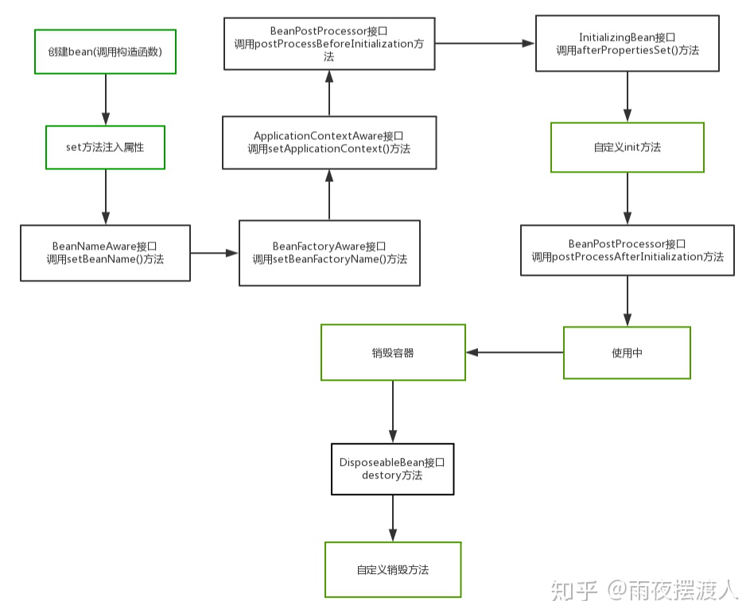

# 4、Bean 生命周期与作用域

## 1、Bean 生命周期（单例，Spring 容器）



整体流程：

```
实例化（构造器）
  → 属性填充（依赖注入 / setter）
  → Aware 回调
  → BeanPostProcessor.postProcessBeforeInitialization
  → 初始化（@PostConstruct / InitializingBean / init-method）
  → BeanPostProcessor.postProcessAfterInitialization（AOP 代理常在此产生）
  → 使用中
  → 销毁（@PreDestroy / DisposableBean / destroy-method）
```

### 详细步骤

| 顺序 | 阶段 | 说明 |
| ---- | ---- | ---- |
| 1 | **实例化** | 调用构造方法，`new` 出 Bean 对象（或工厂方法） |
| 2 | **属性填充** | IoC 注入：@Autowired、setter、XML property 等 |
| 3 | **Aware** | 若实现则依次回调：`BeanNameAware#setBeanName`（bean 的 id/name）、`BeanFactoryAware#setBeanFactory`、`ApplicationContextAware#setApplicationContext`（比 BeanFactory 信息更全） |
| 4 | **BPP 前置** | 容器中 **BeanPostProcessor** 对该 Bean 调用 `postProcessBeforeInitialization`（不是 Bean 自己实现 BPP） |
| 5 | **初始化** | `@PostConstruct` → `InitializingBean#afterPropertiesSet` → 自定义 `init-method` |
| 6 | **BPP 后置** | `BeanPostProcessor#postProcessAfterInitialization`；**AOP 代理对象多在此返回** |
| 7 | **使用** | 单例 Bean 留在容器中直到上下文销毁；同 id 默认同一实例 |
| 8 | **销毁** | 上下文关闭时：`@PreDestroy` → `DisposableBean#destroy` → 自定义 `destroy-method` |

> **常见误区**：`BeanPostProcessor` 是**容器级扩展**，单独注册为 Bean，由容器对每个 Bean 回调；**不是**业务 Bean 去实现 BPP 接口。

### 示例

```java
@Component
public class DemoBean implements BeanNameAware, InitializingBean, DisposableBean {

    @PostConstruct
    public void postConstruct() {
        System.out.println("@PostConstruct");
    }

    @Override
    public void afterPropertiesSet() {
        System.out.println("InitializingBean.afterPropertiesSet");
    }

    @Override
    public void setBeanName(String name) {
        System.out.println("BeanNameAware: " + name);
    }

    @PreDestroy
    public void preDestroy() {
        System.out.println("@PreDestroy");
    }

    @Override
    public void destroy() {
        System.out.println("DisposableBean.destroy");
    }
}
```

XML 或 `@Bean(initMethod = "init", destroyMethod = "cleanup")` 可额外指定 init/destroy 方法。

**BeanPostProcessor**：可对任意 Bean 前后处理；AOP、@Autowired 解析等依赖它。

Boot 启动全链路、扩展点顺序表见 [SpringBoot 实践/15、Bean生命周期与启动扩展](../../SpringBoot/实践/15、Bean生命周期与启动扩展.md)。

## 2、作用域（Scope）

| Scope | 说明 |
| ----- | ---- |
| **singleton**（默认） | 容器内唯一 |
| **prototype** | 每次 getBean 新建 |
| **request / session / application** | Web 环境 |
| **@Scope("prototype")** | 常用于有状态 Bean |

## 3、@Configuration 与 @Component

| | @Configuration | @Component |
| - | -------------- | ---------- |
| @Bean 方法 | **Full 模式**：方法调用走代理，单例 | **Lite 模式**：直接调用 =  new 多次 |
| CGLIB | 类被增强 | 无 |

Boot 中 `@Configuration` 类内 `@Bean` 互相调用仍返回同一实例。

## 4、条件装配

| 注解 | 作用 |
| ---- | ---- |
| `@ConditionalOnClass` | classpath 有类才生效 |
| `@ConditionalOnMissingBean` | 无该 Bean 才注册 |
| `@ConditionalOnProperty` | 配置项匹配 |
| `@Profile("dev")` | 环境 profile |

Boot 自动配置大量依赖 `@Conditional*`。

## 5、Environment 与 PropertySource

配置优先级（Boot 2.4+）：命令行 > `application-{profile}.yml` > `application.yml` > 默认。

`@Value("${key}")`、`@ConfigurationProperties` 绑定。

## 6、常见面试题

**1. BeanFactory 和 ApplicationContext 区别？**

ApplicationContext 是 BeanFactory 子接口，提供事件、国际化、自动 BeanPostProcessor 注册等。

**2. 单例 Bean 线程安全吗？**

Bean 本身无状态则安全；有状态需 prototype 或加锁/ThreadLocal。

**3. @PostConstruct 和 InitializingBean 选哪个？**

优先 `@PostConstruct`（JSR-250），与 Spring 耦合低。
