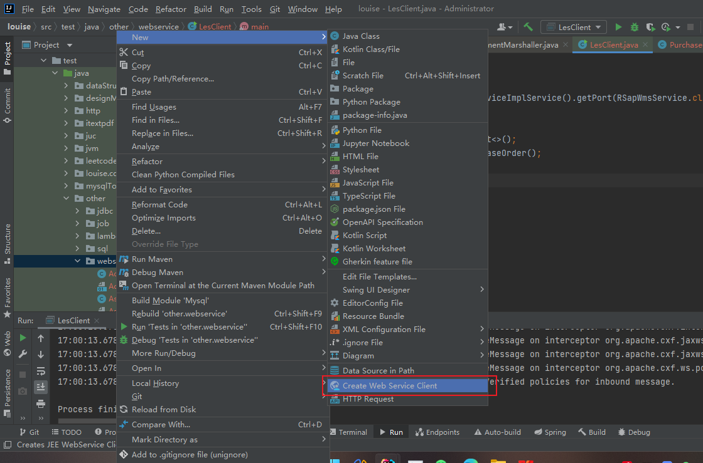

Spring Boot 集成 **Apache CXF** 发布 SOAP **WebService**（HTTP + XML / WSDL），常用于对接 ERP、MES、WMS 等仍使用 SOAP 的系统。

当前使用版本：**CXF 3.1.18**（JAX-WS，适用于 Spring Boot 2.x + `javax.jws`）。

---

# 1、依赖

```xml
<dependency>
    <groupId>org.springframework.boot</groupId>
    <artifactId>spring-boot-starter-web-services</artifactId>
</dependency>
<dependency>
    <groupId>org.apache.cxf</groupId>
    <artifactId>cxf-rt-frontend-jaxws</artifactId>
    <version>3.1.18</version>
</dependency>
<dependency>
    <groupId>org.apache.cxf</groupId>
    <artifactId>cxf-rt-transports-http</artifactId>
    <version>3.1.18</version>
</dependency>
```

---

# 2、实体与接口

```java
@Data
public class Code {
    Long id;
    String name;
}
```

```java
public interface CodeService {

    /**
     * 获取编码
     *
     * @param code 入参
     * @return Code
     */
    Code getCode(Code code);
}
```

```java
public interface StockService {

    /**
     * 查询库存编码（第二个 WebService，字段与 CodeService 相同，方便联调）
     */
    Code getStock(Code code);
}
```

---

# 3、实现类（@WebService 在实现类）

```java
@Service
@WebService
public class CodeServiceImpl implements CodeService {

    @Override
    public Code getCode(Code code) {
        return code;
    }
}
```

```java
@Service
@WebService
public class StockServiceImpl implements StockService {

    @Override
    public Code getStock(Code code) {
        if (code != null && code.getName() != null) {
            code.setName("stock-" + code.getName());
        }
        return code;
    }
}
```

`@WebService` 常用属性（对接外部 WSDL 时建议写全）：

| 属性 | 对应 WSDL | 说明 |
| ---- | --------- | ---- |
| `name` | `wsdl:portType` | 默认 Java 类/接口名 |
| `targetNamespace` | `definitions:targetNamespace` | 一般写接口包名倒序 |
| `serviceName` | `wsdl:service` | 默认「实现类名 + Service」 |
| `portName` | `wsdl:port` | 默认「实现类名 + Port」 |
| `endpointInterface` | — | SEI 接口全路径（接口也 `@WebService` 时用） |

内部简单服务可以只在实现类加 `@WebService`；对接 SAP/MES 等外部系统时，更推荐 **SEI 接口 + `targetNamespace` + `endpointInterface`**。

---

# 4、CXF 配置（一个 Servlet + 一个 Bus + 多个 Endpoint）

```java
@Configuration
public class WebServiceConfig {

    /**
     * Bean 名不能叫 dispatcherServlet，否则会覆盖 Spring MVC 的 DispatcherServlet
     */
    @Bean("cxfServlet")
    public ServletRegistrationBean<CXFServlet> cxfServlet() {
        return new ServletRegistrationBean<>(new CXFServlet(), "/webservice/*");
    }

    @Bean(Bus.DEFAULT_BUS_ID)
    public SpringBus springBus() {
        return new SpringBus();
    }

    // ---------- 服务 1：编码 ----------
    @Bean
    public CodeService codeService() {
        return new CodeServiceImpl();
    }

    @Bean
    public Endpoint codeEndpoint() {
        EndpointImpl endpoint = new EndpointImpl(springBus(), codeService());
        endpoint.publish("/codeService");
        return endpoint;
    }

    // ---------- 服务 2：库存（示例：同 Code 字段，方便测试） ----------
    @Bean
    public StockService stockService() {
        return new StockServiceImpl();
    }

    @Bean
    public Endpoint stockEndpoint() {
        EndpointImpl endpoint = new EndpointImpl(springBus(), stockService());
        endpoint.publish("/stockService");
        return endpoint;
    }
}
```

路径结构：

```
/webservice/*              ← CXFServlet（只注册一次）
    ├── /codeService       ← WSDL: .../webservice/codeService?wsdl
    └── /stockService      ← WSDL: .../webservice/stockService?wsdl
```

WSDL 地址（端口按 `application.yml` 为准，示例 7777）：

```
http://localhost:7777/webservice/codeService?wsdl
http://localhost:7777/webservice/stockService?wsdl
```

---

# 5、application.yml

```yaml
server:
  port: 7777
```

---

# 6、快速验证

## 浏览器

直接访问 WSDL 地址，能打开 XML 即发布成功。

## curl 调 getCode（字段与实体一致：id、name）

```bash
curl -X POST 'http://localhost:7777/webservice/codeService' \
  -H 'Content-Type: text/xml;charset=UTF-8' \
  -H 'SOAPAction: ""' \
  -d '<soapenv:Envelope xmlns:soapenv="http://schemas.xmlsoap.org/soap/envelope/" xmlns:ws="http://impl.ws.example.com/">
  <soapenv:Header/>
  <soapenv:Body>
    <ws:getCode>
      <code>
        <id>1</id>
        <name>ABC</name>
      </code>
    </ws:getCode>
  </soapenv:Body>
</soapenv:Envelope>'
```

> `xmlns:ws` 以 WSDL 里 `targetNamespace` 为准；本地简单服务未指定时，看 WSDL 里 `getCode` 所属命名空间再改。

---

# 7、客户端调用



## 方式一：wsimport 生成 stub（对接外部 WSDL，生产首选）

```bash
# 根据对方 WSDL 生成客户端（-p 指定包名）
wsimport -keep -p com.example.client http://localhost:7777/webservice/codeService?wsdl
```

生成 `CodeServiceImplService` + SEI 接口（`@WebService` 在实现类时，接口名多为 **`CodeServiceImpl`**，以 WSDL / 生成代码为准）：

```java
public class CodeClient {

    public static void main(String[] argv) {
        // 类名来自 wsimport，不要手写服务端 CodeService 接口
        CodeServiceImpl service = new CodeServiceImplService().getPort(CodeServiceImpl.class);

        Code code = new Code();
        code.setId(1L);
        code.setName("ABC");

        Code result = service.getCode(code);
        System.out.println(result.getId() + " -> " + result.getName());
    }
}
```

对接 SAP/WMS 等同理（真实项目示例）：

```java
public class LesClient {

    public static void main(String[] argv) {
        RSapWmsService service = new RSapWmsServiceImplService().getPort(RSapWmsService.class);

        List<PurchaseOrder> list = new ArrayList<>();
        PurchaseOrder purchaseOrder = new PurchaseOrder();
        purchaseOrder.setEBELN("213213");
        list.add(purchaseOrder);

        service.sapWmsPurchaseOrder(list);
    }
}
```

## 方式二：JaxWsProxyFactoryBean（调自己的服务、快速联调）

不生成代码，适合本地临时测试；字段仍用 `Code` 的 `id`、`name`：

```java
JaxWsProxyFactoryBean factory = new JaxWsProxyFactoryBean();
factory.setServiceClass(CodeServiceImpl.class);   // 与 WSDL portType 一致
factory.setAddress("http://localhost:7777/webservice/codeService");
CodeServiceImpl client = (CodeServiceImpl) factory.create();

Code req = new Code();
req.setId(1L);
req.setName("ABC");
Code resp = client.getCode(req);
```

第二个服务：地址改为 `/webservice/stockService`，`setServiceClass(StockServiceImpl.class)`。

---

# 8、注意

| 点 | 说明 |
| -- | ---- |
| Servlet Bean 名 | 必须避开 `dispatcherServlet`，建议 `cxfServlet` |
| 多服务 | 一个 `CXFServlet` + 一个 `SpringBus`，每个服务一个 `@Bean Endpoint`，`publish` 路径不能重复 |
| 与 REST 共存 | CXF 走 `/webservice/*`，Controller 走 `/api/*`，互不影响 |
| 复杂对象 | SOAP 传 `Code` 这类 POJO 时，对接外部建议在字段或类上加 JAXB 注解（`@XmlType`、`@XmlElement`） |
| Boot 3 | CXF 3.1.x 基于 `javax.*`；Boot 3 需升级 CXF 4.x + `jakarta.jws` |
| 客户端选型 | 对接固定 WSDL → **wsimport**；本地快速试 → **JaxWsProxyFactoryBean** 或 curl |
