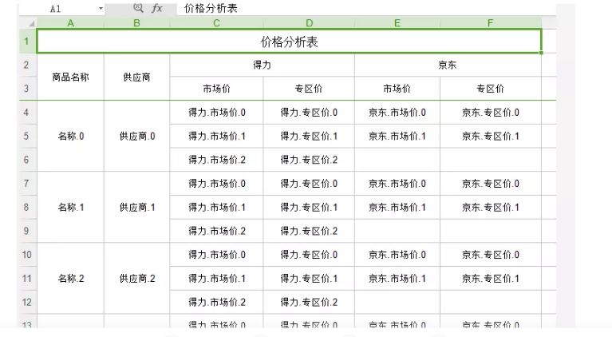
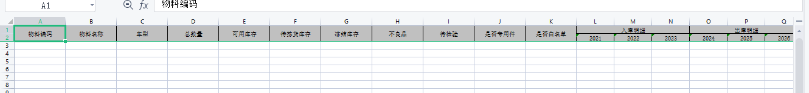

# EasyExcel 2.2.6

添加依赖

```
<dependency>
    <groupId>com.alibaba</groupId>
    <artifactId>easyexcel</artifactId>
    <version>${easy.excel.version}</version>
</dependency>
```

## 导入导出工具类

```java
import cn.hutool.core.util.StrUtil;
import cn.stylefeng.roses.kernel.office.api.exception.OfficeException;
import cn.stylefeng.roses.kernel.office.api.exception.enums.OfficeExceptionEnum;
import cn.stylefeng.roses.kernel.rule.exception.base.ServiceException;
import com.alibaba.excel.EasyExcel;
import com.alibaba.excel.ExcelWriter;
import com.alibaba.excel.support.ExcelTypeEnum;
import com.alibaba.excel.write.metadata.WriteSheet;
import com.baiccl.cermp.carbon.reduction.common.enums.EasyExcelExceptionEnum;
import lombok.extern.slf4j.Slf4j;
import org.springframework.web.multipart.MultipartFile;

import javax.servlet.http.HttpServletResponse;
import java.net.URLEncoder;
import java.util.Collections;
import java.util.List;
import java.util.Locale;

/**
 * easyExcel 工具类
 *
 * @author louise
 * @since 2025/5/16
 */
@Slf4j
public class EasyExcelUtil {
    /**
     * 默认sheet名
     */
    private static final String OFFICE_EXCEL_DEFAULT_SHEET_NAME = "Sheet";

    /**
     * 每个sheet页的条数
     */
    private static final Integer SHEET_SIZE = 50000;


    /**
     * 导出
     *
     * @param list     集合
     * @param clazz    实体类
     * @param fileName 文件名
     * @param response 响应
     */
    public static void export(List<?> list, Class<?> clazz, String fileName, HttpServletResponse response) {
        try {
            if (response == null) {
                throw new OfficeException(OfficeExceptionEnum.OFFICE_EXCEL_EXPORT_RESPONSE_ISNULL);
            }

            if (clazz == null) {
                throw new OfficeException(OfficeExceptionEnum.OFFICE_EXCEL_EXPORT_ENTITY_CLASS_ISNULL);
            }

            response.setContentType("application/vnd.ms-excel");
            response.setCharacterEncoding("utf-8");
            String realFileName = URLEncoder
                    .encode(fileName + ExcelTypeEnum.XLSX.getValue(), "UTF-8")
                    .replaceAll("\\+", "%20");
            response.setHeader("Content-disposition",
                    String.format("%s%s", "attachment;filename*=utf-8''", realFileName));

            ExcelWriter excelWriter = EasyExcel.write(response.getOutputStream(), clazz)
                    .excelType(ExcelTypeEnum.XLSX)
                    .registerWriteHandler(new DictSelectSheetWriteHandler())
                    .build();

            int sheetSize = SHEET_SIZE;
            int total = list.size();
            int sheetCount = (total + sheetSize - 1) / sheetSize;

            for (int i = 0; i < sheetCount; i++) {
                int fromIndex = i * sheetSize;
                int toIndex = Math.min(fromIndex + sheetSize, total);
                List<?> subList = list.subList(fromIndex, toIndex);
                WriteSheet sheet = EasyExcel.writerSheet(i, OFFICE_EXCEL_DEFAULT_SHEET_NAME + (i + 1)).build();
                excelWriter.write(subList, sheet);
            }

            excelWriter.finish();

        } catch (Exception e) {
            log.error(e.getMessage());

            // 组装提示信息
            String userTip = OfficeExceptionEnum.OFFICE_ERROR.getUserTip();
            String finalUserTip = StrUtil.format(userTip, e.getMessage());
            throw new OfficeException(OfficeExceptionEnum.OFFICE_ERROR.getErrorCode(), finalUserTip);
        }
    }

    /**
     * 导入文件
     *
     * @param file  文件
     * @param clazz 类型
     * @return 集合
     */
    public static <T> List<T> upload(MultipartFile file, Class<T> clazz) {
        if (file == null) {
            return Collections.emptyList();
        }

        if (!isExcelFile(file)) {
            throw new ServiceException(EasyExcelExceptionEnum.NOT_EXCEL_FILE);
        }

        SimpleDataListener<T> readListener = new SimpleDataListener<>();

        ExcelReader excelReader = null;
        try {
            excelReader = EasyExcel.read(file.getInputStream(), clazz, readListener).build();
            
            // 获取所有 sheet（也可以手动指定索引）
            List<ReadSheet> readSheets = excelReader.excelExecutor().sheetList();
            
            for (ReadSheet readSheet : readSheets) {
                excelReader.read(readSheet);
            }
        } catch (Exception e) {
            log.error(e.getMessage());

            // 组装提示信息
            String userTip = OfficeExceptionEnum.OFFICE_ERROR.getUserTip();
            String finalUserTip = StrUtil.format(userTip, e.getMessage());
            throw new OfficeException(OfficeExceptionEnum.OFFICE_ERROR.getErrorCode(), finalUserTip);
        }
        finally {
            if (excelReader != null) {
                excelReader.finish();
            }
        }

        return readListener.getDataList();
    }

    /**
     * 是否 excel 文件
     *
     * @param file file
     * @return 是否
     */
    public static boolean isExcelFile(MultipartFile file) {
        if (file == null || file.isEmpty()) {
            return false;
        }
        String filename = file.getOriginalFilename();
        if (filename == null) {
            return false;
        }

        String lowerName = filename.toLowerCase(Locale.ROOT);
        return lowerName.endsWith(".xls") || lowerName.endsWith(".xlsx");
    }
}
```

## 数据监听器

```java
import com.alibaba.excel.context.AnalysisContext;
import com.alibaba.excel.event.AnalysisEventListener;

import java.util.ArrayList;
import java.util.List;

/**
 * 简单的数据监听器
 *
 * @author louise
 * @since 2025/5/16
 */
public class SimpleDataListener<T> extends AnalysisEventListener<T> {
    /**
     * 实体类List集合
     */
    private final List<T> dataList = new ArrayList<>();

    /**
     * 获取实体类List集合
     *
     * @return 实体类List集合
     */
    public List<T> getDataList() {
        return dataList;
    }

    /**
     * 这个每一条数据解析都会来调用
     *
     * @param data    Excel每行数据转换成的对象类
     * @param context EasyExcel分析上下文
     */
    @Override
    public void invoke(T data, AnalysisContext context) {
        // 添加到集合中
        dataList.add(data);
    }

    /**
     * 所有数据解析完成了 都会来调用
     *
     * @param context EasyExcel分析上下文
     */
    @Override
    public void doAfterAllAnalysed(AnalysisContext context) {
    }
}
```

## 数据字典转换

注解

```javascript
import java.lang.annotation.ElementType;
import java.lang.annotation.Retention;
import java.lang.annotation.RetentionPolicy;
import java.lang.annotation.Target;

@Target(ElementType.FIELD)
@Retention(RetentionPolicy.RUNTIME)
public @interface DictFormat {
    /**
     * 数据字典数组，格式：{"是_1", "否_0"}
     */
    String[] value();
}
```

自定义 converter

```java
import cn.hutool.core.util.StrUtil;
import com.alibaba.excel.converters.Converter;
import com.alibaba.excel.enums.CellDataTypeEnum;
import com.alibaba.excel.metadata.CellData;
import com.alibaba.excel.metadata.GlobalConfiguration;
import com.alibaba.excel.metadata.property.ExcelContentProperty;

import java.lang.reflect.Field;
import java.util.HashMap;
import java.util.Map;
import java.util.concurrent.ConcurrentHashMap;

/**
 * 利用 ExcelProperty 中的 format 来做通用字段类型的字典转换
 *
 * @author Louise
 * @since 2025/05/18
 */
public class CachedUniversalDictConverter implements Converter<Object> {
    /**
     * 字典缓存
     */
    private static final Map<String, DictMapping> CACHE = new ConcurrentHashMap<>();

    /**
     * 支持的 java 类型
     *
     * @return {@code Class<Object> }
     */
    @Override
    public Class<Object> supportJavaTypeKey() {
        return Object.class;
    }

    /**
     * 支持的 excel 类型
     *
     * @return {@code CellDataTypeEnum }
     */
    @Override
    public CellDataTypeEnum supportExcelTypeKey() {
        return CellDataTypeEnum.STRING;
    }

    /**
     * excel to java
     *
     * @param cellData            excel内容
     * @param contentProperty     contentProperty
     * @param globalConfiguration globalConfiguration
     * @return java内容
     */
    @Override
    public Object convertToJavaData(CellData cellData,
                                    ExcelContentProperty contentProperty,
                                    GlobalConfiguration globalConfiguration) {
        if (contentProperty == null) {
            return null;
        }

        String stringValue = cellData.getStringValue();
        if (StrUtil.isBlank(stringValue)) {
            return null;
        }
        stringValue = stringValue.trim();

        String[] dictArray = getDictFormatFromField(contentProperty);
        if (dictArray == null || dictArray.length == 0) {
            return convertToTargetType(stringValue, contentProperty.getField().getType());
        }

        String key = buildCacheKey(contentProperty);
        DictMapping mapping = CACHE.computeIfAbsent(key, k -> parseDictMapping(dictArray));

        String mappedValue = mapping.labelToValue.getOrDefault(stringValue, stringValue);

        return convertToTargetType(mappedValue, contentProperty.getField().getType());
    }

    /**
     * excel to java
     *
     * @param value               java内容
     * @param contentProperty     contentProperty
     * @param globalConfiguration globalConfiguration
     * @return excel 内容
     */
    @Override
    public CellData<String> convertToExcelData(Object value,
                                               ExcelContentProperty contentProperty,
                                               GlobalConfiguration globalConfiguration) {
        if (value == null) {
            return new CellData<>("");
        }

        if (contentProperty == null) {
            return new CellData<>(String.valueOf(value));
        }

        String[] dictArray = getDictFormatFromField(contentProperty);
        if (dictArray == null || dictArray.length == 0) {
            return new CellData<>(String.valueOf(value));
        }

        String key = buildCacheKey(contentProperty);
        DictMapping mapping = CACHE.computeIfAbsent(key, k -> parseDictMapping(dictArray));

        String valueStr = String.valueOf(value);
        String label = mapping.valueToLabel.getOrDefault(valueStr, valueStr);

        return new CellData<>(label);
    }

    /**
     * 从字段上获取自定义注解的字典数组
     *
     * @param property property
     * @return {@code String[] }
     */
    private String[] getDictFormatFromField(ExcelContentProperty property) {
        if (property == null || property.getField() == null) {
            return null;
        }
        DictFormat dictFormat = property.getField().getAnnotation(DictFormat.class);
        return dictFormat != null ? dictFormat.value() : null;
    }

    /**
     * 构建缓存 key
     *
     * @param property property
     * @return {@code String }
     */
    private String buildCacheKey(ExcelContentProperty property) {
        Field field = property.getField();
        return field.getDeclaringClass().getName() + "#" + field.getName();
    }

    /**
     * 转换至目标类型
     *
     * @param value      excel内容
     * @param targetType 转换类型
     * @return {@code Object }
     */
    private Object convertToTargetType(String value, Class<?> targetType) {
        try {
            if (targetType == Integer.class || targetType == int.class) {
                return Integer.valueOf(value);
            } else if (targetType == Long.class || targetType == long.class) {
                return Long.valueOf(value);
            } else if (targetType == Boolean.class || targetType == boolean.class) {
                return "1".equals(value) || "true".equalsIgnoreCase(value);
            } else if (targetType == String.class) {
                return value;
            } else {
                // 其他类型默认直接返回 null 或抛异常
                return null;
            }
        } catch (Exception e) {
            // 可以记录日志方便排查
            return null;
        }
    }

    /**
     * 转换字典映射
     *
     * @param dictArray 字典数组
     * @return {@code DictMapping }
     */
    private DictMapping parseDictMapping(String[] dictArray) {
        Map<String, String> labelToValue = new HashMap<>();
        Map<String, String> valueToLabel = new HashMap<>();

        for (String pair : dictArray) {
            String[] parts = pair.split("_");
            if (parts.length == 2) {
                String label = parts[0].trim();
                String value = parts[1].trim();
                labelToValue.put(label, value);
                valueToLabel.put(value, label);
            }
        }
        return new DictMapping(labelToValue, valueToLabel);
    }

    private static class DictMapping {
        final Map<String, String> labelToValue;
        final Map<String, String> valueToLabel;

        DictMapping(Map<String, String> labelToValue, Map<String, String> valueToLabel) {
            this.labelToValue = labelToValue;
            this.valueToLabel = valueToLabel;
        }
    }
}
```

excel 下拉选

```java
/**
 * 用于 excel 字典下拉选
 *
 * @author louise
 * @since 2025/5/16
 */
public class DictSelectSheetWriteHandler implements SheetWriteHandler {
    @Override
    public void beforeSheetCreate(WriteWorkbookHolder writeWorkbookHolder, WriteSheetHolder writeSheetHolder) {}

    @Override
    public void afterSheetCreate(WriteWorkbookHolder writeWorkbookHolder, WriteSheetHolder writeSheetHolder) {
        Sheet sheet = writeSheetHolder.getSheet();

        Map<Integer, ExcelContentProperty> headMap = writeSheetHolder.getExcelWriteHeadProperty().getContentPropertyMap();
        for (Map.Entry<Integer, ExcelContentProperty> entry : headMap.entrySet()) {
            int columnIndex = entry.getKey();
            Field field = entry.getValue().getField();
            if (field == null) {
                continue;
            }

            DictFormat dictFormat = field.getAnnotation(DictFormat.class);
            if (dictFormat != null) {
                String[] values = Arrays.stream(dictFormat.value())
                        .map(s -> s.split("_")[0])
                        .toArray(String[]::new);

                DataValidationHelper helper = sheet.getDataValidationHelper();
                DataValidationConstraint constraint = helper.createExplicitListConstraint(values);

                // 应用于整列（除表头）
                CellRangeAddressList addressList = new CellRangeAddressList(
                        1, SpreadsheetVersion.EXCEL2007.getLastRowIndex(), columnIndex, columnIndex
                );
                DataValidation validation = helper.createValidation(constraint, addressList);
                validation.setSuppressDropDownArrow(true);
                sheet.addValidationData(validation);
            }
        }
    }
}
```

实践

```java
@DictFormat({"生效_1", "失效_0"})
@ExcelProperty(value = "状态", converter = CachedUniversalDictConverter.class)
private String status;
```


# EasyPoi

## 复杂表头导出



```java
List<ExcelExportEntity> colList = new ArrayList<>();
ExcelExportEntity colEntity = new ExcelExportEntity("商品名称", "title");
colEntity.setNeedMerge(true);
colList.add(colEntity);

colEntity = new ExcelExportEntity("供应商", "supplier");
colEntity.setNeedMerge(true);
colList.add(colEntity);


ExcelExportEntity deliColGroup = new ExcelExportEntity("得力", "deli");
List<ExcelExportEntity> deliColList = new ArrayList<ExcelExportEntity>();
deliColList.add(new ExcelExportEntity("市场价", "orgPrice"));
deliColList.add(new ExcelExportEntity("专区价", "salePrice"));
deliColGroup.setList(deliColList);
colList.add(deliColGroup);

ExcelExportEntity jdColGroup = new ExcelExportEntity("京东", "jd");
List<ExcelExportEntity> jdColList = new ArrayList<ExcelExportEntity>();
jdColList.add(new ExcelExportEntity("市场价", "orgPrice"));
jdColList.add(new ExcelExportEntity("专区价", "salePrice"));
jdColGroup.setList(jdColList);
colList.add(jdColGroup);

List<Map<String, Object>> list = new ArrayList<>();

for (int i = 0; i < 10; i++) {
    Map<String, Object> valMap = new HashMap<>();
    valMap.put("title", "名称." + i);
    valMap.put("supplier", "供应商." + i);

    List<Map<String, Object>> deliDetailList = new ArrayList<>();
    for (int j = 0; j < 3; j++) {
        Map<String, Object> deliValMap = new HashMap<>();
        deliValMap.put("orgPrice", "得力.市场价." + j);
        deliValMap.put("salePrice", "得力.专区价." + j);
        deliDetailList.add(deliValMap);
    }
    valMap.put("deli", deliDetailList);

    List<Map<String, Object>> jdDetailList = new ArrayList<>();
    for (int j = 0; j < 2; j++) {
        Map<String, Object> jdValMap = new HashMap<>();
        jdValMap.put("orgPrice", "京东.市场价." + j);
        jdValMap.put("salePrice", "京东.专区价." + j);
        jdDetailList.add(jdValMap);
    }
    valMap.put("jd", jdDetailList);

    list.add(valMap);
}

Workbook workbook = ExcelExportUtil.exportExcel(new ExportParams("价格分析表", "数据"), colList,
        list);

workbook.write(response.getOutputStream());
```


# 原生 poi

## 复杂表头



```java
package other.excel;

import org.apache.poi.ss.usermodel.*;
import org.apache.poi.ss.util.CellRangeAddress;
import org.apache.poi.xssf.streaming.SXSSFCell;
import org.apache.poi.xssf.streaming.SXSSFRow;
import org.apache.poi.xssf.streaming.SXSSFSheet;
import org.apache.poi.xssf.streaming.SXSSFWorkbook;

import java.io.FileOutputStream;
import java.io.IOException;

/**
 * ExcelExport
 *
 * @author louise
 * @date 2023/9/15
 */
public class ExcelExport {
    public static void main(String[] args) throws IOException {
        SXSSFWorkbook wb = new SXSSFWorkbook();

        CellStyle cellStyle = wb.createCellStyle();
        //水平居中
        cellStyle.setAlignment(HorizontalAlignment.CENTER);
        //垂直居中
        cellStyle.setVerticalAlignment(VerticalAlignment.CENTER);
        //设置边框
        cellStyle.setBorderBottom(BorderStyle.THIN);
        cellStyle.setBorderLeft(BorderStyle.THIN);
        cellStyle.setBorderTop(BorderStyle.THIN);
        cellStyle.setBorderRight(BorderStyle.THIN);
        //设置背景色
        cellStyle.setFillForegroundColor(IndexedColors.GREY_25_PERCENT.getIndex());
        cellStyle.setFillPattern(FillPatternType.SOLID_FOREGROUND);


        SXSSFSheet sheet = wb.createSheet("首页报表");

        //合并第一行第一列-第二列
//        sheet.addMergedRegion(new CellRangeAddress(0,0,0,1));
        //合并第三列第一行-第二行
//        sheet.addMergedRegion(new CellRangeAddress(0,1,2,2));

        //冻结首行
        //sheet.createFreezePane(0,1,0,1);
        //冻结前两行
        sheet.createFreezePane(0, 2, 0, 1);
        SXSSFRow row = sheet.createRow(0);
        SXSSFRow row1 = sheet.createRow(1);

        String[] titleArr = {"物料编码", "物料名称", "车型", "总数量", "可用库存", "待拣货库存", "冻结库存", "不良品", "待检验", "是否专用件", "是否白名单"};
        for (int i = 0; i < titleArr.length; i++) {
            SXSSFCell cell = row.createCell(i);
            SXSSFCell cell1 = row1.createCell(i);
            cell.setCellValue(titleArr[i]);
            sheet.setColumnWidth(i, 15 * 256);
            cell1.setCellStyle(cellStyle);
            sheet.addMergedRegion(new CellRangeAddress(0, 1, i, i));
            cell.setCellStyle(cellStyle);
        }

        String[] inArr = {"2021", "2022", "2023"};
        int start = titleArr.length;
        SXSSFCell inCell = row.createCell(start);
        inCell.setCellValue("入库明细");
        inCell.setCellStyle(cellStyle);
        sheet.addMergedRegion(new CellRangeAddress(0, 0, start, start + inArr.length - 1));
        for (int i = 0; i < inArr.length; i++, start++) {
            SXSSFCell cell = row1.createCell(start);
            cell.setCellValue(inArr[i]);
            sheet.setColumnWidth(start, 11 * 256);
            cell.setCellStyle(cellStyle);
        }

        String[] outArr = {"2024", "2025", "2026"};
        SXSSFCell outCell = row.createCell(start);
        outCell.setCellValue("出库明细");
        outCell.setCellStyle(cellStyle);
        sheet.addMergedRegion(new CellRangeAddress(0, 0, start, start + outArr.length - 1));
        for (int i = 0; i < inArr.length; i++, start++) {
            SXSSFCell cell = row1.createCell(start);
            cell.setCellValue(outArr[i]);
            sheet.setColumnWidth(start, 11 * 256);
            cell.setCellStyle(cellStyle);
        }

        wb.write(new FileOutputStream("C:\\Users\\Louise\\Desktop\\ces.xls"));
    }
}
```

