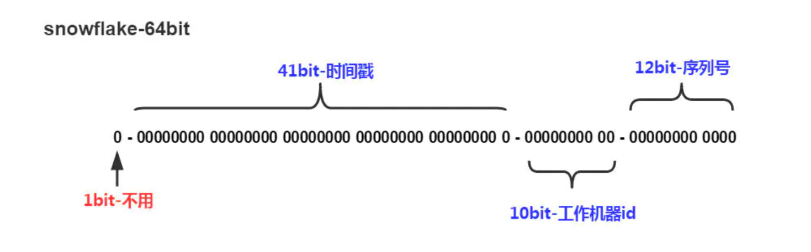

# 算法原理

SnowFlake 算法生成id的结果是一个64bit大小的整数，它的结构如下图：

1、**1bit**，不用，因为二进制中最高位是符号位，1表示负数，0表示正数。生成的id一般都是用整数，所以最高位固定为0。

2、**41bit-时间戳**，用来记录时间戳，毫秒级。

- 41位可以表示2^{41}-1个数字
- 如果只用来表示正整数（计算机中正数包含0），可以表示的数值范围是：0 至 2^{41}-1，减1是因为可表示的数值范围是从0开始算的，而不是1。
- 也就是说41位可以表示2^{41}-1个毫秒的值，转化成单位年则是(2^{41}-1) / (1000 * 60 * 60 * 24 *365) = 69年

3、**10bit-工作机器id**，用来记录工作机器id。

- 可以部署在2^{10} = 1024个节点，包括5位datacenterId和5位workerId
- 5位（bit）可以表示的最大正整数是2^{5}-1 = 31，即可以用0、1、2、3、....31这32个数字，来表示不同的 **datecenterId 机房Id** 或 **workerId 服务器Id**

4、**12bit-序列号**，序列号，用来记录同毫秒内产生的不同id。

12位（bit）可以表示的最大正整数是2^{12}-1 = 4095，即可以用0、1、2、3、....4094这4095个数字，来表示同一机器同一时间截（毫秒)内产生的4095个ID序号。

5、SnowFlake可以保证

- 所有生成的id按时间趋势递增
- 整个分布式系统内不会产生重复id（因为有datacenterId和workerId来做区分）