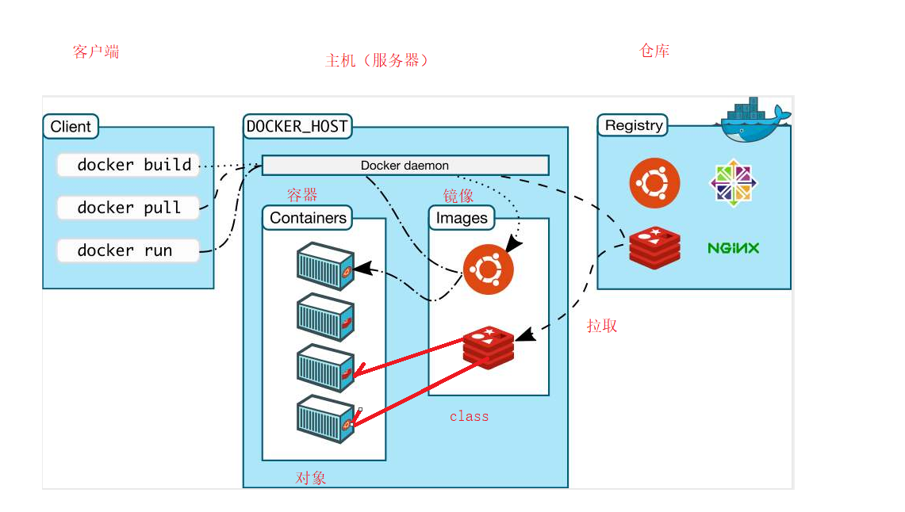

# 1、Docker 介绍

官网：https://www.docker.com

Docker 将应用及其依赖打包到轻量、可移植的**容器**中，在任意支持 Docker 的 Linux 主机上运行。容器之间通过内核隔离机制相互独立。



## 1.1、核心概念

| 概念 | 说明 |
| ---- | ---- |
| 镜像 Image | 只读模板，类似「类」。例如 `mysql:8.0` 包含 MySQL 运行环境 |
| 容器 Container | 镜像的运行实例，类似「对象」。可启动、停止、删除 |
| 仓库 Registry | 存放镜像的场所，默认 [Docker Hub](https://hub.docker.com) |
| 数据卷 Volume | 持久化数据，容器删除后数据仍保留在宿主机 |
| 网络 Network | 容器间通信，同一网络内可通过服务名互访 |

## 1.2、与虚拟机的区别

| | 虚拟机 | 容器 |
| --- | --- | --- |
| 隔离级别 | 硬件级，完整 OS | 进程级，共享宿主机内核 |
| 启动速度 | 分钟级 | 秒级 |
| 资源占用 | 大（每 VM 一套 OS） | 小（只跑应用进程） |
| 镜像大小 | GB 级 | MB 级 |

# 2、安装与配置

## 2.1、CentOS 安装

```bash
# 安装依赖
sudo yum install -y yum-utils device-mapper-persistent-data lvm2

# 添加仓库（任选其一）
sudo yum-config-manager --add-repo https://download.docker.com/linux/centos/docker-ce.repo
# sudo yum-config-manager --add-repo http://mirrors.aliyun.com/docker-ce/linux/centos/docker-ce.repo

# 安装（建议带上 compose 插件）
sudo yum install -y docker-ce docker-ce-cli containerd.io docker-compose-plugin

# 启动并设置开机自启
sudo systemctl start docker
sudo systemctl enable docker

# 验证
docker -v
docker compose version
```

## 2.2、配置镜像加速

配置后 `docker pull mysql:8.0` 会自动走加速器，**不需要**在 pull 时手动写镜像站地址。

```bash
sudo mkdir -p /etc/docker
sudo tee /etc/docker/daemon.json > /dev/null <<'EOF'
{
  "registry-mirrors": [
    "https://docker.1ms.run",
    "https://mirror.ccs.tencentyun.com",
    "https://docker.mirrors.ustc.edu.cn"
  ]
}
EOF

sudo systemctl daemon-reload
sudo systemctl restart docker
docker info | grep -A 5 "Registry Mirrors"
```

## 2.3、启停与卸载

```bash
# 启停 Docker 守护进程（管理所有容器的服务）
sudo systemctl start docker
sudo systemctl stop docker
sudo systemctl restart docker
sudo systemctl status docker
```

```bash
# 卸载
sudo systemctl stop docker
sudo systemctl disable docker
sudo yum remove -y docker-ce docker-ce-cli containerd.io docker-compose-plugin

# 删除数据（会清除所有镜像、容器、卷）
sudo rm -rf /var/lib/docker /var/lib/containerd /etc/docker
sudo rm -f /etc/yum.repos.d/docker-ce.repo
```

> 各中间件的 Docker 部署（目录规划、compose 文件）见 [Deploy/docker](../../05-运维和部署/Deploy/docker/0、目录规划.md)。

# 3、常用命令

## 3.1、镜像

```bash
docker images                          # 查看本地镜像
docker search mysql                    # 搜索 Docker Hub（不能搜第三方仓库）

# 拉取镜像（不指定架构，默认本机架构）
docker pull mysql:8.0                  # 无 tag 默认 latest
docker pull redis:7.2

# 拉取镜像（指定架构）
docker pull --platform linux/amd64 mysql:8.0
docker pull --platform linux/arm64 nginx:1.26
docker inspect mysql:8.0 --format '{{.Os}}/{{.Architecture}}'   # 查看镜像架构

docker tag mysql:8.0 my-mysql:8.0      # 给镜像打新标签
docker inspect mysql:8.0               # 查看镜像详情

# 离线传输
docker save -o mysql-8.0.tar mysql:8.0
docker load -i mysql-8.0.tar

# 删除镜像
docker rmi mysql:8.0                   # 按名称:标签删除
docker rmi IMAGE_ID                    # 按镜像 ID 删除
docker rmi -f mysql:8.0                # 强制删除
docker image prune                     # 删除悬空镜像
docker image prune -a                  # 删除所有未使用的镜像
docker system df                       # 查看镜像占用空间
```

## 3.2、容器

```bash
docker ps              # 运行中的容器
docker ps -a           # 所有容器
docker ps -q           # 只显示容器 ID

# 创建并运行
docker run -d --name mysql -p 3306:3306 mysql:8.0          # 后台运行
docker run -it --name test redis:7.2 /bin/bash              # 交互式（退出后容器停止）

# 生命周期
docker start mysql
docker stop mysql
docker restart mysql
docker rm mysql                    # 删除已停止的容器
docker rm -f mysql                 # 强制删除（运行中也删）

# 进入容器 / 查看信息
docker exec -it mysql bash         # 进入运行中的容器
docker logs -f mysql               # 跟踪日志
docker inspect mysql               # 查看容器详情（IP、挂载、环境变量等）

# 重启策略
docker update --restart=unless-stopped mysql
```

### docker run 常用参数

| 参数 | 说明 | 示例 |
| ---- | ---- | ---- |
| `-d` | 后台运行 | `docker run -d ...` |
| `--name` | 容器名称 | `--name mysql` |
| `-p` | 端口映射 宿主机:容器 | `-p 3306:3306` |
| `-v` | 目录挂载 宿主机:容器 | `-v /data/docker/mysql/data:/var/lib/mysql` |
| `-e` | 环境变量 | `-e MYSQL_ROOT_PASSWORD=xxx` |
| `--network` | 指定网络 | `--network host` |
| `--restart` | 重启策略 | `--restart unless-stopped` |
| `-m` / `--memory` | 内存限制 | `--memory 512m` |

## 3.3、数据卷与网络

```bash
# 数据卷
docker volume ls
docker volume create my-vol
docker volume rm my-vol

# 网络
docker network ls
docker network create my-net
docker network inspect bridge
```

挂载方式对比：

| 方式 | 写法 | 特点 |
| ---- | ---- | ---- |
| 绑定挂载 | `-v /data/docker/mysql/data:/var/lib/mysql` | 直接映射宿主机目录，**最常用** |
| 命名卷 | `-v mysql-data:/var/lib/mysql` | Docker 管理存储路径，适合不关心具体路径的场景 |
| 只读挂载 | `-v /path/conf:/etc/conf:ro` | 容器内不可写 |

# 4、Docker Compose

Compose 用 YAML 文件定义多容器应用，适合一键启停整套服务。

> 新版命令是 `docker compose`（空格），不是旧版的 `docker-compose`（连字符）。两者功能相同，本文统一用 `docker compose`。

## 4.1、常用命令

```bash
docker compose -f mysql.yml up -d       # 后台启动
docker compose -f mysql.yml down        # 停止并删除容器
docker compose -f mysql.yml ps          # 查看状态
docker compose -f mysql.yml logs -f     # 查看日志
docker compose -f mysql.yml restart     # 重启所有服务
docker compose -f mysql.yml pull       # 拉取镜像
```

### 与 docker 命令的对应关系

当 compose 文件中指定了 `container_name: mysql` 时：

| compose 命令 | 等价的 docker 命令 | 是否完全等价 |
| --- | --- | --- |
| `docker compose logs -f mysql` | `docker logs -f mysql` | ✅ 看日志一样 |
| `docker compose ps` | `docker ps` | 大致相同 |
| `docker compose stop` | `docker stop mysql` | 停止效果一样 |
| `docker compose down` | `docker stop` + `docker rm` | ❌ down 会**删除容器** |

日常查日志、进容器用 `docker logs` / `docker exec` 更简短；启停整套环境用 `docker compose`。

## 4.2、compose 文件模板

```yml
services:
  app:
    image: nginx:1.26
    container_name: my-nginx
    ports:
      - "80:80"
    environment:
      TZ: Asia/Shanghai
    volumes:
      - /data/docker/nginx/html:/usr/share/nginx/html    # 绑定挂载
      - nginx-logs:/var/log/nginx                         # 命名卷
    networks:
      - app-net
    depends_on:
      - mysql
    restart: unless-stopped
    healthcheck:
      test: ["CMD", "curl", "-f", "http://localhost"]
      interval: 30s
      timeout: 5s
      retries: 3

  mysql:
    image: mysql:8.0
    container_name: mysql
    ports:
      - "3306:3306"
    environment:
      MYSQL_ROOT_PASSWORD: "Aa123456..!"
    volumes:
      - /data/docker/mysql/data:/var/lib/mysql
    networks:
      - app-net
    restart: unless-stopped

networks:
  app-net:
    driver: bridge

volumes:
  nginx-logs:
```

### 关键字段说明

| 字段 | 说明 |
| ---- | ---- |
| `image` | 使用的镜像 |
| `build` | 从 Dockerfile 本地构建（与 `image` 二选一） |
| `ports` | 端口映射，格式 `宿主机:容器` |
| `environment` | 环境变量 |
| `volumes` | 数据挂载 |
| `networks` | 加入的网络，同网络容器可通过**服务名**互访 |
| `depends_on` | 控制启动顺序（不保证对方已就绪） |
| `restart` | `no` / `always` / `on-failure` / `unless-stopped` |
| `healthcheck` | 健康检查，配合 `depends_on: condition: service_healthy` 使用 |
| `network_mode: host` | 共享宿主机网络，不需要 `ports` 映射 |

### 常见误区

1. **`version` 字段已废弃**：Compose V2 不再需要写 `version: "3.9"`。
2. **`deploy.resources` 在单机 compose 中不生效**：这是 Swarm 模式用的。单机限制资源用 `docker run -m 512m`，或在 compose 中用 `mem_limit: 512m`（部分版本支持）。
3. **`depends_on` 只保证启动顺序**：MySQL 容器启动了不代表已 accept 连接，应用侧需要重试或配合 `healthcheck`。
4. **同一 compose 网络内用服务名通信**：例如 `mysql` 服务可被 `app` 通过 `mysql:3306` 访问，不要用 `localhost`。

# 5、Dockerfile 镜像构建

## 5.1、基本结构

```dockerfile
# 基础镜像
FROM openjdk:17-jdk-slim

# 维护者信息（可选）
LABEL maintainer="your@email.com"

# 工作目录
WORKDIR /app

# 复制文件到镜像
COPY target/app.jar app.jar

# 暴露端口（文档作用，实际映射靠 -p）
EXPOSE 8080

# 启动命令
ENTRYPOINT ["java", "-jar", "app.jar"]
```

## 5.2、常用指令

| 指令 | 说明 |
| ---- | ---- |
| `FROM` | 基础镜像，必须是第一条有效指令 |
| `RUN` | 构建时执行命令（如 `RUN yum install -y xxx`） |
| `COPY` | 复制宿主机文件到镜像 |
| `ADD` | 类似 COPY，还支持解压 tar、下载 URL（推荐优先用 COPY） |
| `WORKDIR` | 设置工作目录 |
| `EXPOSE` | 声明端口 |
| `ENV` | 设置环境变量 |
| `CMD` | 默认启动命令，可被 `docker run` 参数覆盖 |
| `ENTRYPOINT` | 入口命令，不易被覆盖 |

`CMD` 与 `ENTRYPOINT` 区别：

- `CMD`：默认行为，容易被 `docker run` 后面的命令替换
- `ENTRYPOINT`：容器的主命令，适合固定启动方式

## 5.3、构建与运行

```bash
# 构建镜像（-t 指定名称和标签，. 为构建上下文目录）
docker build -t my-app:1.0 .

# 查看构建历史
docker history my-app:1.0

# 运行
docker run -d --name my-app -p 8080:8080 my-app:1.0
```

## 5.4、多阶段构建（减小镜像体积）

```dockerfile
# 阶段1：编译
FROM maven:3.9-eclipse-temurin-17 AS builder
WORKDIR /build
COPY pom.xml .
COPY src ./src
RUN mvn package -DskipTests

# 阶段2：运行（只保留 jar，不含 Maven 和源码）
FROM eclipse-temurin:17-jre
WORKDIR /app
COPY --from=builder /build/target/*.jar app.jar
ENTRYPOINT ["java", "-jar", "app.jar"]
```

# 6、应用部署示例

挂载目录统一使用 `/data/docker/<服务名>/`，与 yum/二进制安装的 `/data/<服务名>/<版本>/` 区分。

完整 compose 文件见 [Deploy/docker](../../05-运维和部署/Deploy/docker/0、目录规划.md)。

## 6.1、Redis

```bash
mkdir -p /data/docker/redis/{conf,data}

# 拷贝默认配置后修改
docker run --rm redis:7.2 cat /usr/local/etc/redis/redis.conf > /data/docker/redis/conf/redis.conf

docker run -d \
  --name redis \
  -p 6379:6379 \
  -v /data/docker/redis/conf/redis.conf:/usr/local/etc/redis/redis.conf \
  -v /data/docker/redis/data:/data \
  --restart unless-stopped \
  redis:7.2 \
  redis-server /usr/local/etc/redis/redis.conf
```

或使用 compose：`docker compose -f docker/redis.yml up -d`

## 6.2、MySQL

```bash
mkdir -p /data/docker/mysql/{conf,data,logs}

docker run -d \
  --name mysql \
  -p 3306:3306 \
  -v /data/docker/mysql/conf:/etc/mysql/conf.d \
  -v /data/docker/mysql/data:/var/lib/mysql \
  -e MYSQL_ROOT_PASSWORD="Aa123456..!" \
  -e TZ=Asia/Shanghai \
  --restart unless-stopped \
  mysql:8.0 \
  --character-set-server=utf8mb4 \
  --collation-server=utf8mb4_general_ci
```

或使用 compose：`docker compose -f docker/mysql.yml up -d`

## 6.3、Nacos

```bash
mkdir -p /data/docker/nacos/{logs,data}
docker compose -f docker/nacos.yml up -d
```

访问 `http://宿主机IP:8848/nacos`，默认账号 `nacos/nacos`。详细配置见 [13、nacos.md](../../05-运维和部署/Deploy/13、nacos.md)。

# 7、常见问题

## 7.1、容器启动后立即退出

```bash
docker logs 容器名    # 先看日志
docker inspect 容器名  # 查看 ExitCode 和 Error
```

常见原因：前台进程结束（如没加 `-d` 时的交互式命令跑完）、启动命令错误、配置文件挂载路径不对。

## 7.2、端口被占用

```bash
# 查看端口占用
ss -tlnp | grep 3306
# 或换宿主机端口
-p 3307:3306
```

## 7.3、权限问题（挂载目录）

容器内进程无权写宿主机目录时：

```bash
# 查看容器内运行用户
docker exec mysql id

# 调整宿主机目录权限
sudo chown -R 999:999 /data/docker/mysql/data   # MySQL 容器内通常是 uid 999
sudo chmod -R 755 /data/docker
```

## 7.4、磁盘空间不足

```bash
# 查看 Docker 占用
docker system df

# 清理未使用的镜像、容器、网络、构建缓存
docker system prune -a       # 慎用，会删除所有未使用的镜像
docker image prune         # 只清理悬空镜像
```

## 7.5、查看容器 IP

```bash
docker inspect -f '{{range .NetworkSettings.Networks}}{{.IPAddress}}{{end}}' 容器名
```

同一 compose 网络内，推荐直接用**服务名**访问，不要硬编码 IP。
