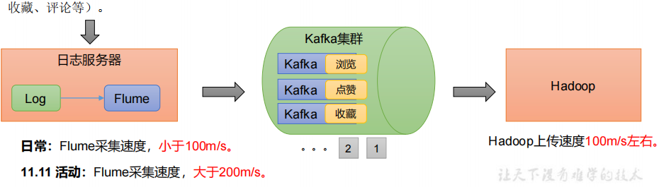
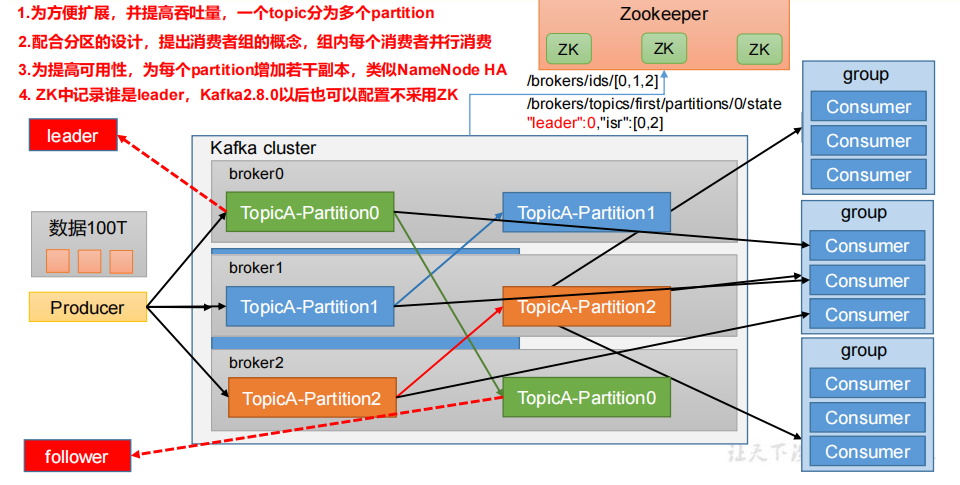
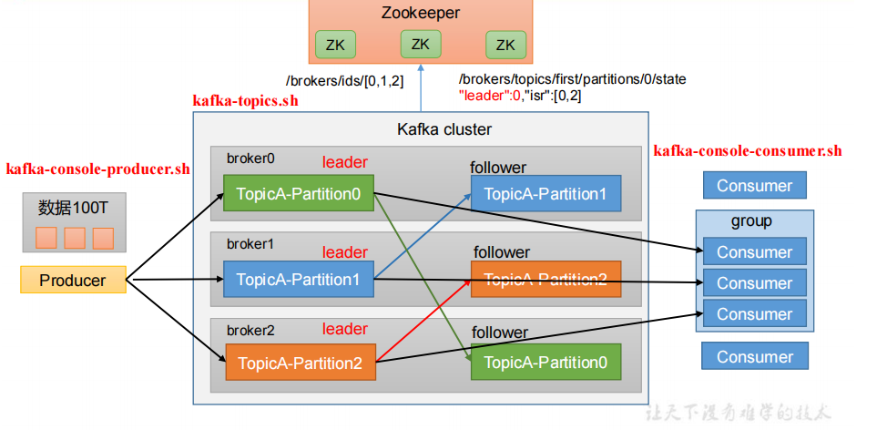

# 1、Kafka 概述

## 1、简介

https://kafka.apache.org/

**Kafka传统定义**：Kafka是一个**分布式**的**基于发布/订阅模式的消息队列**（MessageQueue），主要应用于大数据实时处理领域。

**发布/订阅**：消息的发布者**不会将消息直接发送给特定的订阅者**，而是将发布的消息**分为不同的类别**，**订阅者只接收感兴趣的消息**。

**Kafka最新定义** ： Kafka是 一个开源的**分布式事件流平台**（Event StreamingPlatform），被数千家公司用于高性能**数据管道、流分析、数据集成和关键任务应用**。



## 2、传统消息队列的应用场景

缓存/消峰、解耦和异步通信。

**缓冲/消峰**：有助于控制和优化数据流经过系统的速度，解决生产消息和消费消息的处理速度不一致的情况。

**解耦**：允许你独立的扩展或修改两边的处理过程，只要确保它们遵守同样的接口约束。

**异步通信**：允许用户把一个消息放入队列，但并不立即处理它，然后在需要的时候再去处理它们。

## 3、消息队列的两种模式

**点对点模式**

消费者主动拉取数据，消息收到后清除消息


**发布/订阅模式**

可以有多个topic主题（浏览、点赞、收藏、评论等）

消费者消费数据之后，不删除数据

每个消费者相互独立，都可以消费到数据

## 4、基本架构



**Producer**：消息生产者，就是向 Kafka broker 发消息的客户端。

**Consumer**：消息消费者，向 Kafka broker 取消息的客户端。

**Consumer Group（CG）**：消费者组，由多个 consumer 组成。**消费者组内每个消费者负责消费不同分区的数据，一个分区只能由一个组内消费者消费；消费者组之间互不影响**。所有的消费者都属于某个消费者组，即消费者组是逻辑上的一个订阅者。

**Broker**：一台 Kafka 服务器就是一个 broker。一个集群由多个 broker 组成。一个broker 可以容纳多个 topic。

**Topic**：可以理解为一个队列，**生产者和消费者面向的都是一个topic**。

**Partition**：分区为了实现扩展性，一个非常大的 topic 可以分布到多个 broker（即服务器）上，**一个 topic 可以分为多个 partition**，每个 partition 是一个**有序的队列**。

**Replica**：副本。一个 topic 的每个分区都有若干个副本，一个 Leader 和若干个Follower。

**Leader**：每个分区多个**副本的“主”**，生产者发送数据的对象，以及消费者消费数据的对象都是 Leader。

**Follower**：每个分区多个**副本中的“从”**，实时从 Leader 中同步数据，保持和Leader 数据的同步。Leader 发生故障时，某个 Follower 会成为新的 Leader。


# 2、Kafka 快速入门

## 1、集群部署

```bash
# 规划为三台机器 hadoop000 hadoop001 hadoop002
# 解压安装包
tar -zxvf kafka_2.12-3.0.0.tgz -C /opt/module/
# 修改解压后的文件名称
mv kafka_2.12-3.0.0/ kafka
```

## 2、Kafka 配置文件

```bash
vim server.properties

#broker 的全局唯一编号，不能重复，只能是数字。每台机器不一样
broker.id=0
#处理网络请求的线程数量
num.network.threads=3
#用来处理磁盘 IO 的线程数量
num.io.threads=8
#发送套接字的缓冲区大小
socket.send.buffer.bytes=102400
#接收套接字的缓冲区大小
socket.receive.buffer.bytes=102400
#请求套接字的缓冲区大小
socket.request.max.bytes=104857600
#kafka 运行日志(数据)存放的路径，路径不需要提前创建，kafka 自动帮你创建，可以
配置多个磁盘路径，路径与路径之间可以用"，"分隔
log.dirs=/opt/module/kafka/datas
#topic 在当前 broker 上的分区个数
num.partitions=1
#用来恢复和清理 data 下数据的线程数量
num.recovery.threads.per.data.dir=1
# 每个 topic 创建时的副本数，默认时 1 个副本
offsets.topic.replication.factor=1
#segment 文件保留的最长时间，超时将被删除
log.retention.hours=168
#每个 segment 文件的大小，默认最大 1G
log.segment.bytes=1073741824
# 检查过期数据的时间，默认 5 分钟检查一次是否数据过期
log.retention.check.interval.ms=300000
# 监听地址
listeners=PLAINTEXT://0.0.0.0:9092
# 对外公布的地址
advertised.listeners=PLAINTEXT://ip:9092
#配置连接 Zookeeper 集群地址（在 zk 根目录下创建/kafka，方便管理）
zookeeper.connect=hadoop102:2181,hadoop103:2181,hadoop104:2181/kafka
```

## 3、zookeeper 配置文件

```bash
# 修改zookeeper.properties
# 数据地址
dataDir=/opt/datas/kafka/zookeeper
maxClientCnxns=100
tickTime=20
initLimit=10
syncLimit=5
# 集群配置
server.1=hadoop001:2888:3888
server.2=hadoop002:2888:3888
server.3=hadoop003:2888:3888

# 在dataDir下创建myid文件 添加 1 2 3
```

## 4、集群分发脚本

```bash
xsync kafka/

#!/bin/bash

#1. 判断参数个数
if [ $# -lt 1 ]
then
    echo Not Enough Arguement!
    exit;
fi

#2. 遍历集群所有机器
for host in hadoop000 hadoop001 hadoop002
do
    echo ====================  $host  ====================
    #3. 遍历所有目录，挨个发送

    for file in $@
    do
        #4. 判断文件是否存在
        if [ -e $file ]
            then
                #5. 获取父目录
                pdir=$(cd -P $(dirname $file); pwd)

                #6. 获取当前文件的名称
                fname=$(basename $file)
                ssh $host "mkdir -p $pdir"
                rsync -av $pdir/$fname $host:$pdir
            else
                echo $file does not exists!
        fi
    done
done
```

## 5、配置环境变量

```bash
# 在/etc/profile.d/my_env.sh 文件中增加 kafka 环境变量配置
vim /etc/profile.d/my_env.sh

#KAFKA_HOME
export KAFKA_HOME=/opt/module/kafka
export PATH=$PATH:$KAFKA_HOME/bin

# 刷新环境变量
source /etc/profile
```

## 6、启动集群

**启动 zookeeper**

```bash
# 在bin下启动
cd /opt/module/kafka/bin/
./zookeeper-server-start.sh -daemon ../config/zookeeper.properties
正常启动后 2181 3888 三台机器都通
其中一台2888通 是leader
```

**启动 kafka**

```bash
# 启动kafka
bin/kafka-server-start.sh -daemon config/server.properties
# 关闭kafka
bin/kafka-server-stop.sh
```

**关闭注意**

停止 Kafka 集群时，一定要等 Kafka 所有节点进程全部停止后再停止 Zookeeper 集群。因为 Zookeeper 集群当中记录着 Kafka 集群相关信息，Zookeeper 集群一旦先停止，Kafka 集群就没有办法再获取停止进程的信息，只能手动杀死 Kafka 进程了。

## 7、常见问题

```bash
# 问题1
The Cluster ID VB7m6OM6SwS5oNJXn20XUA doesn't match stored clusterId
# 解决1
删除server.properties中log.dirs 的所有文件

# 问题2
Cannot open channel to 2 at election address
# 解决2
检查各节点的防火墙有没有关闭||检查各节点/etc/hosts内容是否一致
```


# 3、Kafka 命令行操作



## 1、topic 主题命令

```bash
# 查看操作主题命令参数
bin/kafka-topics.sh
# 参数 描述
--bootstrap-server <String: server toconnect to> 连接的 Kafka Broker 主机名称和端口号。
--topic <String: topic> 操作的 topic 名称。
--create 创建主题。
--delete 删除主题。
--alter 修改主题。
--list 查看所有主题。
--describe 查看主题详细描述。
--partitions <Integer: # of partitions> 设置分区数。
--replication-factor<Integer: replication factor> 设置分区副本。
--config <String: name=value> 更新系统默认的配置。

# 查看当前服务器中的所有 topic
bin/kafka-topics.sh --bootstrap-server hadoop000:9092 --list
# 创建 first topic
bin/kafka-topics.sh --bootstrap-server hadoop000:9092 --create
--partitions 1 --replication-factor 3 --topic first
# 查看 first 主题的详情
bin/kafka-topics.sh --bootstrap-server hadoop000:9092 --describe --topic first
# 修改分区数（注意：分区数只能增加，不能减少）
bin/kafka-topics.sh --bootstrap-server hadoop000:9092 --alter --topic first --partitions 3
# 删除 topic
bin/kafka-topics.sh --bootstrap-server hadoop000:9092 --delete --topic first
```

## 2、producer 生产者命令

```bash
# 查看操作消费者命令参数
bin/kafka-console-producer.sh
# 参数 描述
--bootstrap-server <String: server toconnect to> 连接的 Kafka Broker 主机名称和端口号。
--topic <String: topic> 操作的 topic 名称。
# 发送消息
bin/kafka-console-producer.sh --bootstrap-server hadoop000:9092  --topic first
```

## 3、consumer 消费者命令

```bash
# 查看操作消费者命令参数
bin/kafka-console-consumer.sh
# 参数 描述
--bootstrap-server <String: server toconnect to> 连接的 Kafka Broker 主机名称和端口号。
--topic <String: topic> 操作的 topic 名称。
--from-beginning 从头开始消费。
--group <String: consumer group id> 指定消费者组名称。
# 消费 first 主题中的数据
bin/kafka-console-consumer.sh --bootstrap-server hadoop000:9092 --topic first
# 把主题中所有的数据都读取出来（包括历史数据）。
bin/kafka-console-consumer.sh --bootstrap-server hadoop000:9092 --from-beginning --topic first
```

