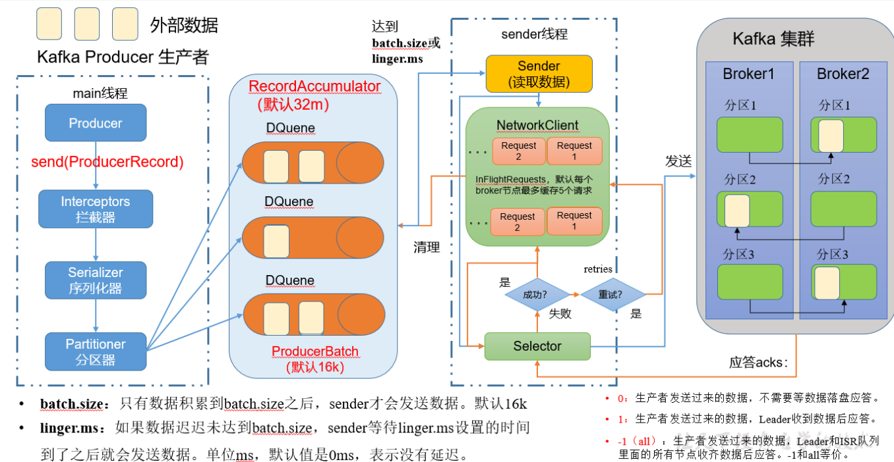
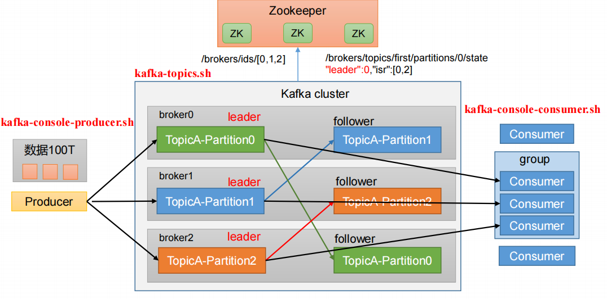
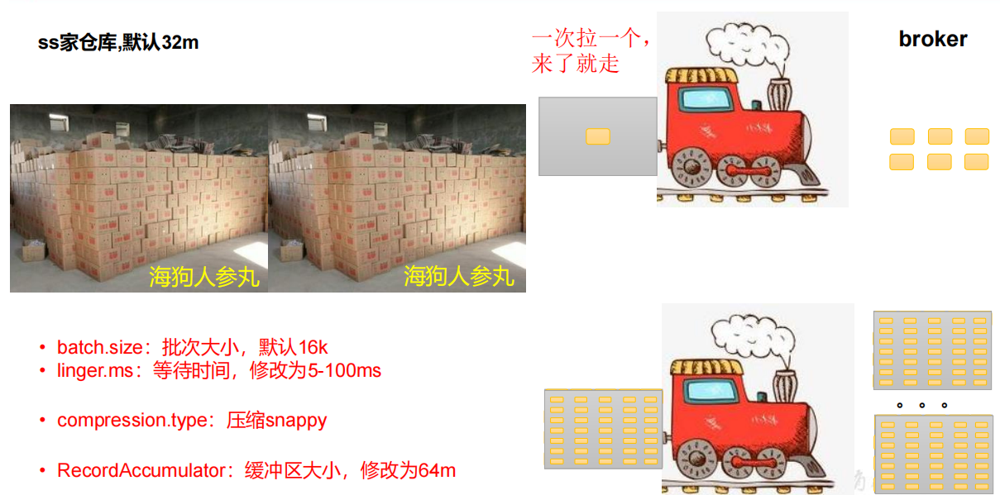
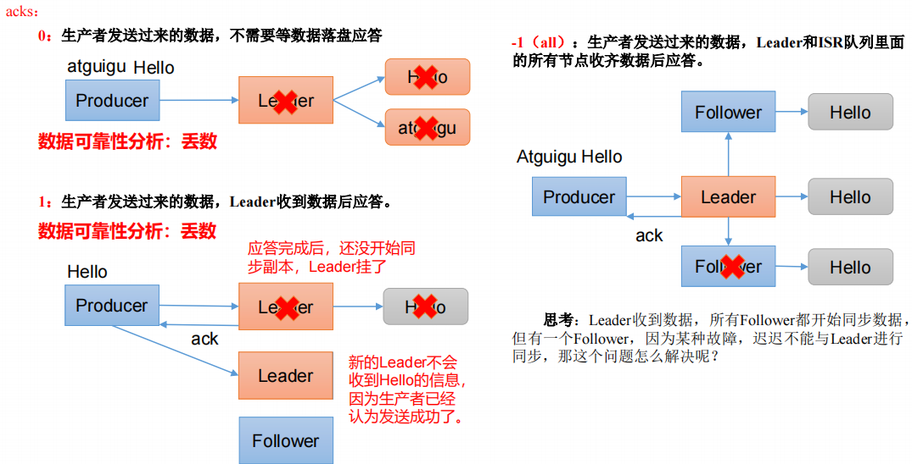
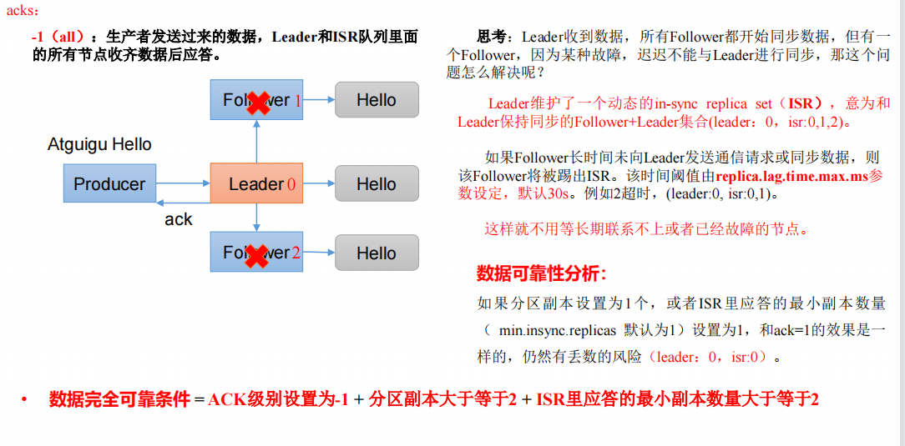
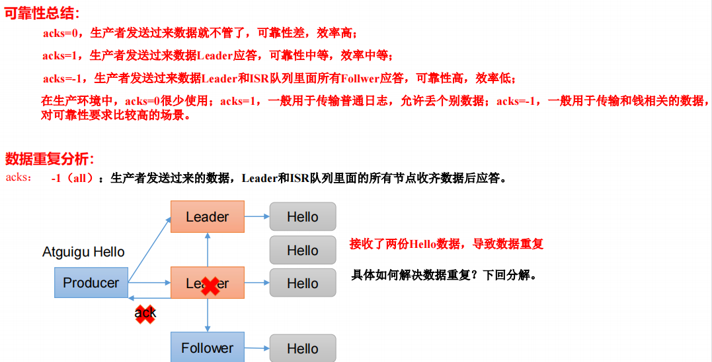
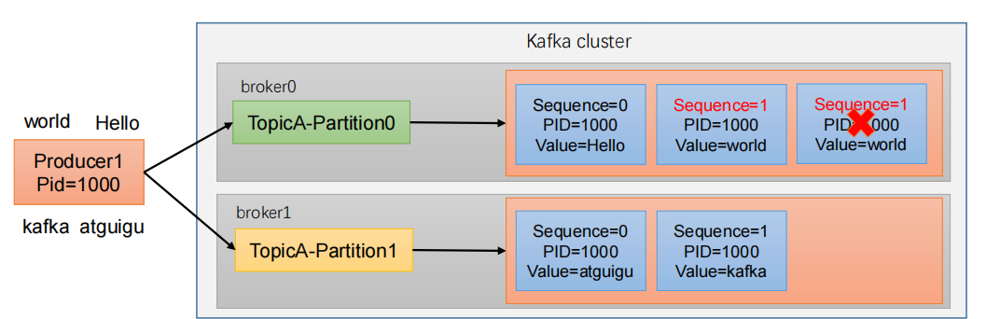
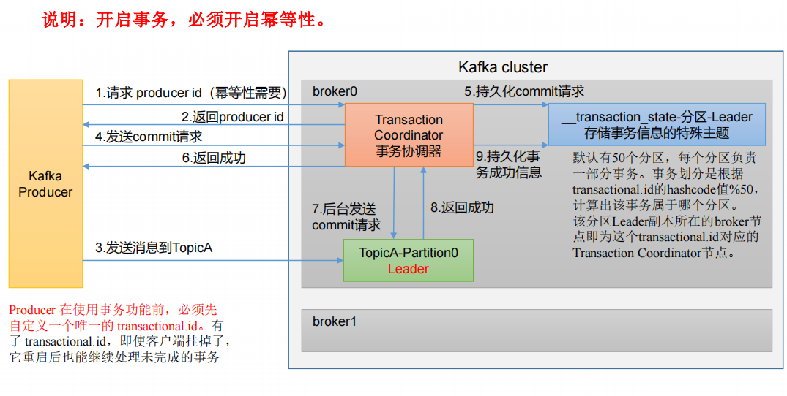
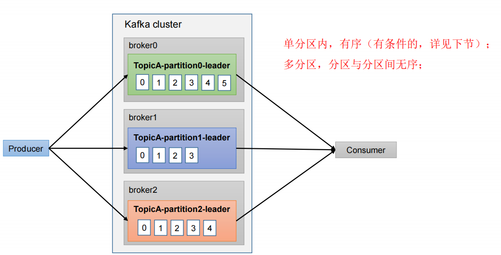
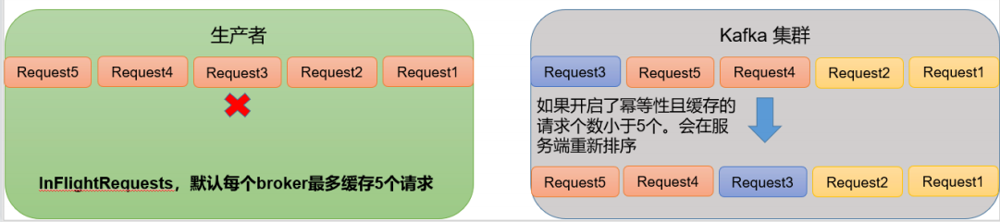

# 1、生产者消息发送流程

## 1、发送原理

在消息发送的过程中，涉及到了**两个线程 main 线程和 Sender 线程**。在 main 线程中创建了一个**双端队列 RecordAccumulator**。main 线程将消息发送给 RecordAccumulator，Sender 线程不断从 RecordAccumulator 中拉取消息发送到 Kafka Broker。



**自己实现序列化的原因**：java 的序列化过重

**RecordAccumulator**：每个分区会创建一个队列

**requests**：可以最多缓存五个请求

**应答**：发送给同一个 broker 超过5次返回失败后会重新选择其他 broker

## 2、生产者重要参数列表

**bootstrap.servers**

生产者连接集群所需的 broker 地址。例如 hadoop102:9092,hadoop103:9092,hadoop104:9092，可以设置1个或者多个，中间用逗号隔开。注意这里并非需要所有的 broker 地址，因为生产者从给定的 broker 里查找到其他 broker 信息。

**key.serializer 和 value.serializer**

指定发送消息的 key 和 value 的序列化类型。一定要写全类名。

**buffer.memory**

RecordAccumulator 缓冲区总大小，默认 32m。

**batch.size**

缓冲区一批数据最大值，默认 16k。适当增加该值，可以提高吞吐量，但是如果该值设置太大，会导致数据传输延迟增加。

**linger.ms**

如果数据迟迟未达到 batch.size，sender 等待 linger.time之后就会发送数据。单位 ms，默认值是 0ms，表示没有延迟。生产环境建议该值大小为 5-100ms 之间。

**acks**

0：生产者发送过来的数据，不需要等数据落盘应答。

1：生产者发送过来的数据，Leader 收到数据后应答。

-1（all）：生产者发送过来的数据，Leader+和 isr 队列里面的所有节点收齐数据后应答。默认值是-1，-1 和all 是等价的。

**max.in.flight.requests.per.connection**

允许最多没有返回 ack 的次数，默认为 5，开启幂等性要保证该值是 1-5 的数字。

**retries**

当消息发送出现错误的时候，系统会重发消息。retries 表示重试次数。默认是 int 最大值。如果设置了重试，还想保证消息的有序性，需要设置MAX_IN_FLIGHT_REQUESTS_PER_CONNECTION=1否则在重试此失败消息的时候，其他的消息可能发送成功了。

**retry.backoff.ms**

两次重试之间的时间间隔，默认是 100ms。

**enable.idempotence**

是否开启幂等性，默认 true，开启幂等性。

**compression.type**

生产者发送的所有数据的压缩方式。默认是 none，也就是不压缩。支持压缩类型：none、gzip、snappy、lz4 和 zstd。


# 2、异步发送Api

## 1、普通异步发送

导入依赖

```xml
<dependency>
    <groupId>org.apache.kafka</groupId>
    <artifactId>kafka-clients</artifactId>
    <version>3.0.0</version>
</dependency>
```

代码

```java
public static void main(String[] args) {
    Properties properties = new Properties();
    properties.put(ProducerConfig.BOOTSTRAP_SERVERS_CONFIG,"hadoop000:9092");
    properties.put(ProducerConfig.KEY_SERIALIZER_CLASS_CONFIG,"org.apache.kafka.common.serialization.StringSerializer");
    properties.put(ProducerConfig.VALUE_SERIALIZER_CLASS_CONFIG,"org.apache.kafka.common.serialization.StringSerializer");
    KafkaProducer<String, String> producer = new KafkaProducer<>(properties);
    producer.send(new ProducerRecord<>("first1","testNice"));
    producer.close();
}
```

## 2、带回调函数的异步发送

回调函数会在 producer 收到 ack 时调用，为异步调用，该方法有两个参数，分别是元数据信息（RecordMetadata）和异常信息（Exception），如果 Exception 为 null，说明消息发送成功，如果 Exception 不为 null，说明消息发送失败。

```java
public static void main(String[] args) throws InterruptedException {
    Properties properties = new Properties();
    properties.put(ProducerConfig.BOOTSTRAP_SERVERS_CONFIG,"hadoop000:9092");
    properties.put(ProducerConfig.KEY_SERIALIZER_CLASS_CONFIG,"org.apache.kafka.common.serialization.StringSerializer");
    properties.put(ProducerConfig.VALUE_SERIALIZER_CLASS_CONFIG,"org.apache.kafka.common.serialization.StringSerializer");
    KafkaProducer<String, String> producer = new KafkaProducer<>(properties);
    for (int i = 0; i < 5; i++) {
        producer.send(new ProducerRecord<>("first1" , "testNice" + i), new Callback() {
            @Override
            public void onCompletion(RecordMetadata metadata, Exception exception) {
                //分区
                System.out.println(metadata.partition());
            }
        });
        Thread.sleep(10);
    }
    producer.close();
}
```

## 3、同步发送

只需在异步发送的基础上，再调用一下 get() 方法即可

```java
public static void main(String[] args) throws InterruptedException, ExecutionException {
    Properties properties = new Properties();
    properties.put(ProducerConfig.BOOTSTRAP_SERVERS_CONFIG,"hadoop000:9092");
    properties.put(ProducerConfig.KEY_SERIALIZER_CLASS_CONFIG,"org.apache.kafka.common.serialization.StringSerializer");
    properties.put(ProducerConfig.VALUE_SERIALIZER_CLASS_CONFIG,"org.apache.kafka.common.serialization.StringSerializer");
    KafkaProducer<String, String> producer = new KafkaProducer<>(properties);
    for (int i = 0; i < 5; i++) {
        producer.send(new ProducerRecord<>("first1" , "testNice" + i), new Callback() {
            @Override
            public void onCompletion(RecordMetadata metadata, Exception exception) {
                //分区
                System.err.println(metadata.partition());
            }
        }).get();
        Thread.sleep(10);
    }
    producer.close();
}
```


# 3、生产者分区

## 1、分区好处



**便于合理使用存储资源**，每个Partition在一个Broker上存储，可以把海量的数据按照分区切割成一块一块数据存储在多台Broker上。合理控制分区的任务，可以实现**负载均衡**的效果。

**提高并行度**，生产者可以以分区为单位发送数据；消费者可以**以分区为单位进行消费数据**。

## 2、生产者发送消息的分区策略

producerRecord

```java
//指明partition的情况下，直接将指明的值作为partition值；
//例如partition=0，所有数据写入分区0
public ProducerRecord(String topic, Integer partition, K key, V value) {}
//没有指明partition值但有key的情况下，将key的hash值与topic的partition数进行取余得到partition值；
//例如：key1的hash值=5， key2的hash值=6 ，topic的partition数=2，那么key1 对应的value1写入1号分区，key2对应的value2写入0号分区。
public ProducerRecord(String topic, K key, V value) {}
//既没有partition值又没有key值的情况下，Kafka采用Sticky Partition（黏性分区器），
//会随机选择一个分区，并尽可能一直使用该分区，待该分区的batch已满或者已完成，Kafka再随机一个分区进行使用（和上一次的分区不同）。
public ProducerRecord(String topic, V value) {}
```

自定义分区器

```java
public class MyPartition implements Partitioner {
    /**
     * 分区
     *
     * @param topic      主题
     * @param key        消息的key
     * @param keyBytes   消息的 key 序列化后的字节数组
     * @param value      消息的 value
     * @param valueBytes 消息的 value 序列化后的字节数组
     * @param cluster    集群元数据可以查看分区信息
     * @return int
     */
    @Override
    public int partition(String topic, Object key, byte[] keyBytes, Object value, byte[] valueBytes, Cluster cluster) {
        String val = value.toString();
        if (val.contains("2")){
            return 2;
        }
        return 0;
    }

    /**
     *  关闭资源
     */
    @Override
    public void close() {

    }

    /**
     * 配置方法
     *
     * @param configs 配置
     */
    @Override
    public void configure(Map<String, ?> configs) {

    }
}
```

主方法

```java
properties.put(ProducerConfig.PARTITIONER_CLASS_CONFIG,"kafka.MyPartition");
```


# 4、生产经验 生产者如何提高吞吐量



```java
public static void main(String[] args) {

    Properties properties = new Properties();
    properties.put(ProducerConfig.BOOTSTRAP_SERVERS_CONFIG, "hadoop000:9092");
    properties.put(ProducerConfig.VALUE_SERIALIZER_CLASS_CONFIG, StringSerializer.class.getName());
    properties.put(ProducerConfig.KEY_SERIALIZER_CLASS_CONFIG, StringSerializer.class.getName());

    // RecordAccumulator：缓冲区大小，默认 32M：buffer.memory
    properties.put(ProducerConfig.BUFFER_MEMORY_CONFIG, 32 * 1024 * 1024);
    // batch.size：批次大小，默认 16K
    properties.put(ProducerConfig.BATCH_SIZE_CONFIG, 16 * 1024);
    // linger.ms：等待时间，默认 0
    properties.put(ProducerConfig.LINGER_MS_CONFIG, 5);
    // compression.type：压缩，默认 none，可配置值 gzip、snappy、lz4 和 zstd
    properties.put(ProducerConfig.COMPRESSION_TYPE_CONFIG, Compression.SNAPPY.getCodec());

    KafkaProducer<String, String> producer = new KafkaProducer<>(properties);

    for (int i = 0; i < 5; i++) {
        producer.send(new ProducerRecord<>("first1", "test" + i), new Callback() {
            @Override
            public void onCompletion(RecordMetadata metadata, Exception exception) {
                System.err.println(metadata.partition());
            }
        });
    }

    producer.close();
}
```


# 5、生产经验 数据可靠性

## 1、ACK 应答原理



0(会丢失)

生产者发送过来的数据，不需要等数据落盘应答

1(会丢失)

生产者发送过来的数据，**Leader收到数据后应答**。

-1（all）

生产者发送过来的数据，**Leader和ISR队列里面的所有节点收齐数据后应答**。

## 2、-1模式出现的问题



**Leader收到数据，所有Follower都开始同步数据，但有一个Follower，因为某种故障，迟迟不能与Leader进行同步，那这个问题怎么解决呢？**

Leader维护了一个动态的in-sync replica set（ISR），意为和Leader保持同步的Follower+Leader集合(leader：0，isr:0,1,2)。

如果Follower长时间未向Leader发送通信请求或同步数据，则该Follower将被踢出ISR。**该时间阈值由replica.lag.time.max.ms参数设定，默认30s**。例如2超时，(leader:0, isr:0,1)。

这样就不用等长期联系不上或者已经故障的节点。

---

**数据可靠性分析**

如果分区副本设置为1个，或者ISR里应答的最小副本数量（ min.insync.replicas 默认为1）设置为1，和ack=1的效果是一样的，仍然有丢数的风险（leader：0，isr:0）。

---

**数据完全可靠条件**

ACK级别设置为-1 + 分区副本大于等于2 + ISR里应答的最小副本数量大于等于2

## 3、可靠性总结



**可靠性总结**

acks=0，生产者发送过来数据就不管了，可靠性差，效率高；

acks=1，生产者发送过来数据Leader应答，可靠性中等，效率中等；

acks=-1，生产者发送过来数据Leader和ISR队列里面所有Follwer应答，可靠性高，效率低；

在生产环境中，acks=0很少使用；**acks=1，一般用于传输普通日志**，**允许丢个别数据**；**acks=-1，一般用于传输和钱相关的数据**，对可靠性要求比较高的场景。

---

**数据重复分析**

如果Leader在接受完一条数据之后同步给Follower的时候，数据同步完成但是没有返回信息，这个时候就会出现数据重复问题

```java
// 设置 acks
properties.put(ProducerConfig.ACKS_CONFIG, "all");
// 重试次数 retries，默认是 int 最大值，2147483647
properties.put(ProducerConfig.RETRIES_CONFIG, 3);
```


# 6、生产经验 数据去重

## 1、数据传递语义

**至少一次（At Least Once）**

ACK级别设置为-1 + 分区副本大于等于2 + ISR里应答的最小副本数量大于等于2

**最多一次（At Most Once）**

ACK级别设置为0

**总结**

At Least Once可以保证数据不丢失，但是**不能保证数据不重复**

At Most Once可以保证数据不重复，但是**不能保证数据不丢失**

**精确一次（Exactly Once）**

对于一些非常重要的信息，比如和钱相关的数据，要求数据既不能重复也不丢失。Kafka 0.11版本以后，引入了一项重大特性：**幂等性和事务**。

## 2、幂等性

**幂等性原理**

幂等性就是指 Producer 不论向 Broker 发送多少次重复数据，Broker 端都只会持久化一条，保证了不重复。

精确一次（Exactly Once） = 幂等性 + 至少一次（ ack=-1 + 分区副本数>=2 + ISR最小副本数量>=2） 。

重复数据的判断标准：具有<**PID, Partition, SeqNumber**>相同主键的消息提交时，Broker只会持久化一条。其中**PID是Kafka每次重启都会分配一个新的**；**Partition 表示分区号**；**Sequence Number是单调自增的**。

所以**幂等性只能保证的是在单分区单会话内不重复**。



**幂等性使用**

开启参数 **enable.idempotence** 默认为 true，false 关闭。

## 3、生产者事务

**事务原理**



**事务API**

```java
// 1 初始化事务
void initTransactions();
// 2 开启事务
void beginTransaction() throws ProducerFencedException;
// 3 在事务内提交已经消费的偏移量（主要用于消费者）
void sendOffsetsToTransaction
// 4 提交事务
void commitTransaction() throws ProducerFencedException;
// 5 放弃事务（类似于回滚事务的操作）
void abortTransaction() throws ProducerFencedException;
```

**代码**

```java
// 设置事务 id（必须），事务 id 任意起名
properties.put(ProducerConfig.TRANSACTIONAL_ID_CONFIG,"transaction_id_0");

// 初始化事务
kafkaProducer.initTransactions();
// 开启事务
kafkaProducer.beginTransaction();
// 提交事务
kafkaProducer.commitTransaction();
// 终止事务
kafkaProducer.abortTransaction();
```


# 7、生产经验 数据有序




# 8、生产经验 数据乱序

**kafka在1.x版本之前保证数据单分区有序，条件如下**

max.in.flight.requests.per.connection=1（不需要考虑是否开启幂等性）

---

**kafka在1.x及以后版本保证数据单分区有序，条件如下**

**未开启幂等性** max.in.flight.requests.per.connection 需要设置为1

**开启幂等性** **max.in.flight.requests.per.connection** 需要设置小于等于5



原因说明：因为在kafka1.x以后，启用幂等后，kafka服务端会缓存producer发来的最近5个request的元数据，故无论如何，都可以保证最近5个request的数据都是有序的。