# 1、Kafka Broker 工作流程

## 1、Zookeeper 存储的 Kafka 信息

查看 zk 信息

```bash
# 自带zk
bin/zookeeper-shell.sh  hadoop000:2181
# 独立zk
bin/zkCli.sh
# zk可视化工具
prettyZoo
```

节点数据

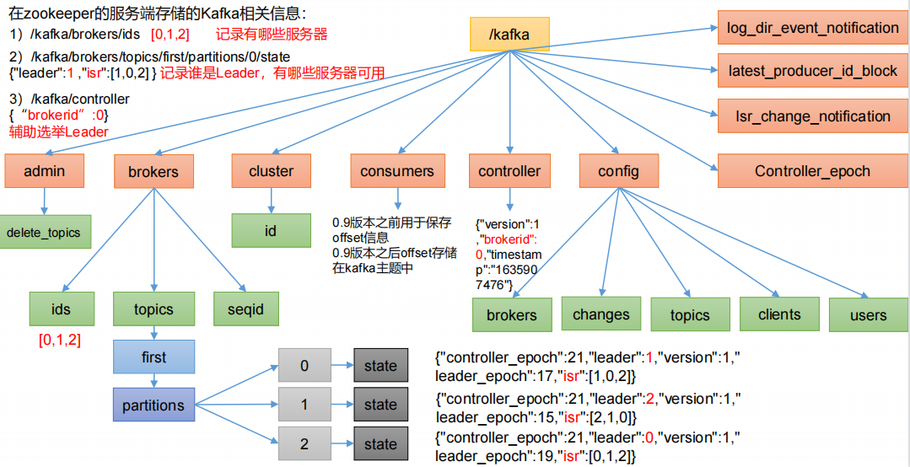

**ids**: 当前存活节点

**controller**: 每个broker都有controller,抢占式,先抢到的来辅助选举

## 2、Kafka Broker 总体工作流程

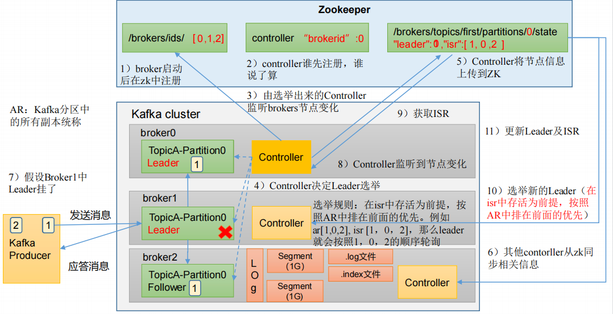

.index 文件是索引文件

.log 文件是数据文件

```bash
# 原始节点
Topic: first1   Partition: 0    Leader: 2       Replicas: 2,1,3 Isr: 1,2,3
Topic: first1   Partition: 1    Leader: 3       Replicas: 3,2,1 Isr: 1,2,3
Topic: first1   Partition: 2    Leader: 1       Replicas: 1,3,2 Isr: 1,2,3
# 当broker3宕机时
Topic: first1   Partition: 0    Leader: 2       Replicas: 2,1,3 Isr: 1,2
Topic: first1   Partition: 1    Leader: 2       Replicas: 3,2,1 Isr: 1,2
Topic: first1   Partition: 2    Leader: 1       Replicas: 1,3,2 Isr: 1,2
```

## 3、Broker 重要参数

```bash
// ========== 可靠性（server.properties / 建 topic，见 6、丢消息与重复消费.md）==========

//default.replication.factor
新建 topic 时的默认副本数，默认 1。生产常用 3。

//min.insync.replicas
配合 Producer acks=all：ISR 中至少几个副本写入，Producer 才收到成功应答，默认 1。
生产常用 2（RF=3 时允许 1 副本滞后）；若 ISR 存活数 < 此值，写入会报 NOT_ENOUGH_REPLICAS。

//unclean.leader.election.enable
Leader 故障时是否允许从非 ISR（落后过多）的 Follower 中选新 Leader，默认 false（Kafka 2.4+）。
false：只从 ISR 选举，极端情况下分区暂时不可写，但不丢已 ack 数据；true：可能丢数据。

//message.max.bytes
Broker 接受的单条消息最大字节数，默认 1MB。Producer 的 max.request.size 不能超过它。

//replica.fetch.max.bytes
Follower 从 Leader 拉取数据时，单次 fetch 的最大字节数，默认 1MB。应 ≥ message.max.bytes。

//offsets.topic.replication.factor
内部主题 __consumer_offsets 的副本数，默认 1。生产建议 ≥ 3，否则 Broker 宕机可能丢 offset 元数据。

//transaction.state.log.replication.factor
事务相关内部 topic 的副本数，使用 Kafka 事务时建议 ≥ 3。

// ========== ISR 与 Leader 平衡 ==========

//replica.lag.time.max.ms
ISR 中，如果 Follower 长时间未向 Leader 发送通信请求或同步数据，
则该 Follower 将被踢出 ISR。该时间阈值，默认 30s。

//auto.leader.rebalance.enable
默认是 true。 自动 Leader Partition 平衡。

//leader.imbalance.per.broker.percentage
默认是 10%。每个 broker 允许的不平衡的 leader的比率。
如果每个 broker 超过了这个值，控制器会触发 leader 的平衡。

//leader.imbalance.check.interval.seconds
默认值 300 秒。检查 leader 负载是否平衡的间隔时间。

//log.segment.bytes
Kafka 中 log 日志是分成一块块存储的，此配置是指 log 日志划分 成块的大小，默认值 1G。

//log.index.interval.bytes
默认 4kb，kafka 里面每当写入了 4kb 大小的日志（.log），然后就往 index 文件里面记录一个索引。

//log.retention.hours
Kafka 中数据保存的时间，默认 7 天。

//log.retention.minutes
Kafka 中数据保存的时间，分钟级别，默认关闭。

//log.retention.ms
Kafka 中数据保存的时间，毫秒级别，默认关闭。

//log.retention.check.interval.ms
检查数据是否保存超时的间隔，默认是 5 分钟。

//log.retention.bytes
默认等于-1，表示无穷大。超过设置的所有日志总大小，删除最早的 segment。

//log.cleanup.policy
默认是 delete，表示所有数据启用删除策略；如果设置值为 compact，表示所有数据启用压缩策略。

//num.io.threads
默认是 8。负责写磁盘的线程数。整个参数值要占总核数的 50%。

//num.replica.fetchers
副本拉取线程数，这个参数占总核数的 50%的 1/3

//num.network.threads
默认是 3。数据传输线程数，这个参数占总核数的50%的 2/3 。

//log.flush.interval.messages
强制页缓存刷写到磁盘的条数，默认是 long 的最大值，9223372036854775807。
一般不建议修改，交给系统自己管理。

//log.flush.interval.ms
每隔多久，刷数据到磁盘，默认是 null。一般不建议修改，交给系统自己管理。
```


# 2、生产经验 | 节点服役和退役

## 1、服役新节点

新节点准备

```
//关闭 hadoop104，并右键执行克隆操作
//开启 hadoop105，并修改 IP 地址
//在 hadoop105 上，修改主机名称为 hadoop105。
//重新启动 hadoop104、hadoop105。
//修改 haodoop105 中 kafka 的 broker.id 为 3。
//删除 hadoop105 中 kafka 下的 datas 和 logs
rm -rf datas/* logs/*
//修改zk集群并启动
```

执行负载均衡操作

```bash
//1.创建一个要均衡的主题
vim topics-to-move.json
{
    "topics": [
        {"topic": "first"}
    ],
    "version": 1
} 
//2.生成一个负载均衡的计划
bin/kafka-reassign-partitions.sh  --bootstrap-server  hadoop102:9092
--topics-to-move-json-file  topics-to-move.json 
--broker-list  "0,1,2,3"  --generate

//3.执行后命令行会出现
Current partition replica assignment
{"version":1,"partitions":[{"topic":"first","partition":0,"replic
as":[0,2,1],"log_dirs":["any","any","any"]},{"topic":"first","par
tition":1,"replicas":[2,1,0],"log_dirs":["any","any","any"]},{"to
pic":"first","partition":2,"replicas":[1,0,2],"log_dirs":["any","
any","any"]}]}
Proposed partition reassignment configuration
{"version":1,"partitions":[{"topic":"first","partition":0,"replic
as":[2,3,0],"log_dirs":["any","any","any"]},{"topic":"first","par
tition":1,"replicas":[3,0,1],"log_dirs":["any","any","any"]},{"to
pic":"first","partition":2,"replicas":[0,1,2],"log_dirs":["any","
any","any"]}]}

//4.创建副本存储计划（所有副本存储在 broker0、broker1、broker2、broker3 中）。
vim increase-replication-factor.json
{"version":1,"partitions":[{"topic":"first","partition":0,"replic
as":[2,3,0],"log_dirs":["any","any","any"]},{"topic":"first","par
tition":1,"replicas":[3,0,1],"log_dirs":["any","any","any"]},{"to
pic":"first","partition":2,"replicas":[0,1,2],"log_dirs":["any","
any","any"]}]}

//5.执行副本存储计划
bin/kafka-reassign-partitions.sh  --bootstrap-server hadoop102:9092
--reassignment-json-file increase-replication-factor.json  --execute

//6.验证副本存储计划
bin/kafka-reassign-partitions.sh  --bootstrap-server hadoop102:9092
--reassignment-json-file increase-replication-factor.json  --verify
```

## 2、退役旧节点

```bash
//1.创建一个要均衡的主题
vim topics-to-move.json
{
     "topics": [
         {"topic": "first"}
     ],
     "version": 1
}

//2.创建执行计划
bin/kafka-reassign-partitions.sh --bootstrap-server hadoop102:9092
--topics-to-move-json-file  topics-to-move.json 
--broker-list "0,1,2" --generate

//3.执行命令后会出现
Current partition replica assignment
{"version":1,"partitions":[{"topic":"first","partition":0,"replic
as":[2,0,1],"log_dirs":["any","any","any"]},{"topic":"first","par
tition":1,"replicas":[3,1,2],"log_dirs":["any","any","any"]},{"to
pic":"first","partition":2,"replicas":[0,2,3],"log_dirs":["any","
any","any"]}]}
Proposed partition reassignment configuration
{"version":1,"partitions":[{"topic":"first","partition":0,"replic
as":[2,0,1],"log_dirs":["any","any","any"]},{"topic":"first","par
tition":1,"replicas":[0,1,2],"log_dirs":["any","any","any"]},{"to
pic":"first","partition":2,"replicas":[1,2,0],"log_dirs":["any","
any","any"]}]}


//4.创建副本存储计划（所有副本存储在 broker0、broker1、broker2 中）。
vim increase-replication-factor.json
{"version":1,"partitions":[{"topic":"first","partition":0,"replic
as":[2,0,1],"log_dirs":["any","any","any"]},{"topic":"first","par
tition":1,"replicas":[0,1,2],"log_dirs":["any","any","any"]},{"to
pic":"first","partition":2,"replicas":[1,2,0],"log_dirs":["any","
any","any"]}]}

//5.执行副本存储计划
bin/kafka-reassign-partitions.sh  --bootstrap-server hadoop102:9092
--reassignment-json-file increase-replication-factor.json --execute

//6.验证副本存储计划
bin/kafka-reassign-partitions.sh  --bootstrap-server hadoop102:9092
--reassignment-json-file increase-replication-factor.json --verify
```


# 3、Kafka 副本

## 1、副本基本信息

Kafka 副本作用：提高数据可靠性。

Kafka 默认副本 1 个，**生产环境一般 replication-factor=3，min.insync.replicas=2**，保证数据可靠性；太多副本会增加磁盘存储空间，增加网络上数据传输，降低效率。

Kafka 中副本分为：Leader 和 Follower。Kafka 生产者只会把数据发往 Leader，然后 Follower 找 Leader 进行同步数据。

Kafka 分区中的所有副本统称为 **AR（Assigned Repllicas）**。

**AR = ISR + OSR**

**ISR**，表示和 Leader 保持同步的 Follower 集合。如果 Follower 长时间未向 Leader 发送通信请求或同步数据，则该 Follower 将被踢出 ISR。该时间阈值由 **replica.lag.time.max.ms**参数设定，默认 30s。Leader 发生故障之后，就会从 ISR 中选举新的 Leader。

**OSR**，表示 Follower 与 Leader 副本同步时，延迟过多的副本。

## 2、Leader 选举流程

Kafka 集群中有一个 broker 的 Controller 会被选举为 Controller Leader，负责**管理集群broker 的上下线**，所有 topic 的**分区副本分配**和 **Leader 选举**等工作。

Controller 的信息同步工作是依赖于 Zookeeper 的。

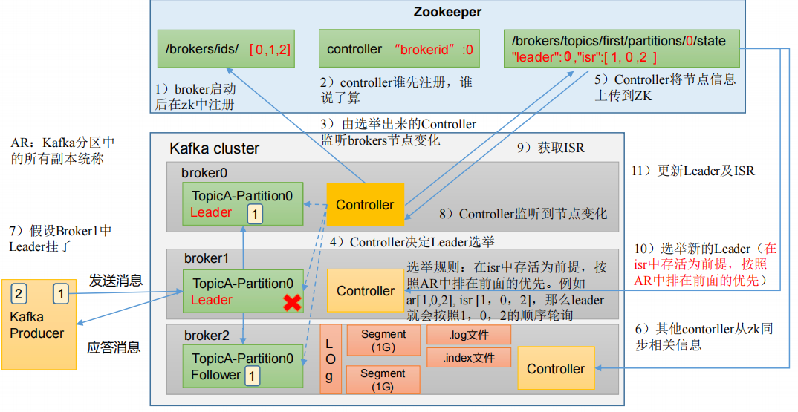

broker启动之后会在zk的ids中进行注册。

controller每个broker都有一个,抢占式,先注册的负责。

选举出来的controller监听brokers节点变化。

controller决定副本Leader的选举，选举规则: 在isr中存活的,按照AR中排在前面的优先。

controller将节点信息上传到zk。

其他controller从zk同步相关信息。

假设Broker中Leader挂了。

controller监听到节点变化。

获取ISR。

选举新的Leader。

更新Leader及ISR。

## 3、Leader 和 Follower 故障处理细节

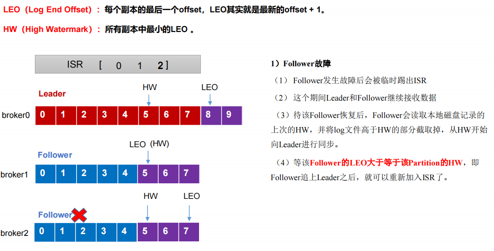

**LEO（Log End Offset）**：每个副本的最后一个offset，LEO其实就是最新的offset + 1。

**HW（High Watermark）**：所有副本中最小的LEO 。

---

**Follower故障**

Follower 发生故障后会被临时踢出 ISR。

这个期间 Leader 和 Follower 继续接收数据。

待该 Follower 恢复后，Follower 会读取本地磁盘记录的上次的 HW，并将 log 文件高于 HW 的部分截取掉，从 HW 开始向 Leader 进行同步。

等该 **Follower 的 LEO 大于等于该 Partition 的 HW**，即 Follower 追上 Leader 之后，就可以重新加入 ISR 了。

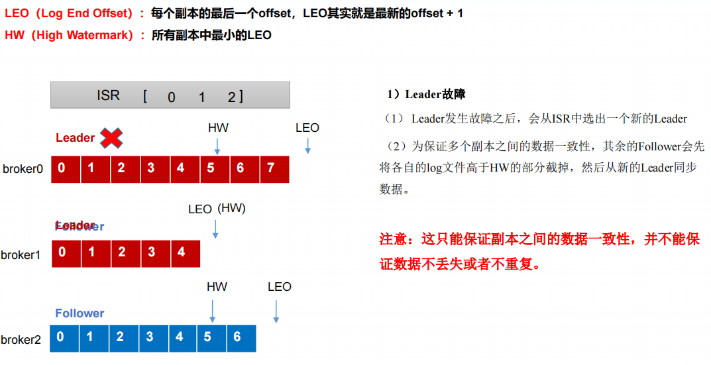

**Leader故障**

Leader发生故障之后，会从ISR中选出一个新的Leader。

为保证多个副本之间的数据一致性，其余的Follower会先将各自的log文件高于HW的部分截掉，然后从新的Leader同步数据。

注意：这只能保证副本之间的数据一致性，并不能保证数据不丢失或者不重复。

## 4、分区副本分配

```bash
//创建 16 分区，3 个副本
bin/kafka-topics.sh --bootstrap-server hadoop102:9092 --create
 --partitions 16 --replication-factor 3 --topic second
 //查看分区和副本情况
 bin/kafka-topics.sh --bootstrap-server hadoop102:9092 
 --describe --topic second
 
Topic: second4 Partition: 0 Leader: 0 Replicas: 0,1,2 Isr: 0,1,2
Topic: second4 Partition: 1 Leader: 1 Replicas: 1,2,3 Isr: 1,2,3
Topic: second4 Partition: 2 Leader: 2 Replicas: 2,3,0 Isr: 2,3,0
Topic: second4 Partition: 3 Leader: 3 Replicas: 3,0,1 Isr: 3,0,1
Topic: second4 Partition: 4 Leader: 0 Replicas: 0,2,3 Isr: 0,2,3
Topic: second4 Partition: 5 Leader: 1 Replicas: 1,3,0 Isr: 1,3,0
Topic: second4 Partition: 6 Leader: 2 Replicas: 2,0,1 Isr: 2,0,1
Topic: second4 Partition: 7 Leader: 3 Replicas: 3,1,2 Isr: 3,1,2
Topic: second4 Partition: 8 Leader: 0 Replicas: 0,3,1 Isr: 0,3,1
Topic: second4 Partition: 9 Leader: 1 Replicas: 1,0,2 Isr: 1,0,2
Topic: second4 Partition: 10 Leader: 2 Replicas: 2,1,3 Isr: 2,1,3
Topic: second4 Partition: 11 Leader: 3 Replicas: 3,2,0 Isr: 3,2,0
Topic: second4 Partition: 12 Leader: 0 Replicas: 0,1,2 Isr: 0,1,2
Topic: second4 Partition: 13 Leader: 1 Replicas: 1,2,3 Isr: 1,2,3
Topic: second4 Partition: 14 Leader: 2 Replicas: 2,3,0 Isr: 2,3,0
Topic: second4 Partition: 15 Leader: 3 Replicas: 3,0,1 Isr: 3,0,1
```

## 5、生产经验 | 手动调整分区副本存储

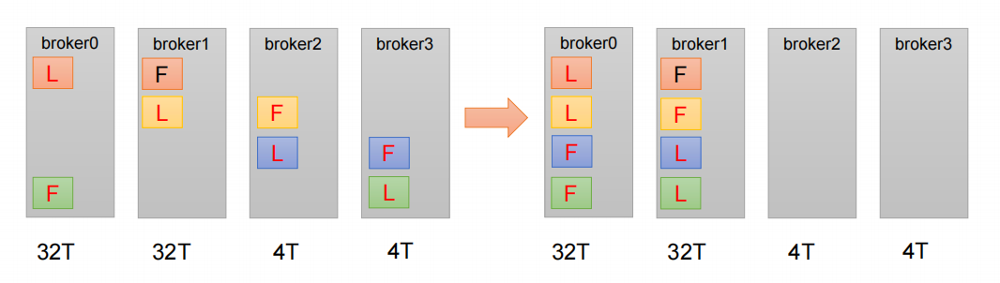

```bash
//在生产环境中，每台服务器的配置和性能不一致
//需求：创建一个新的topic，4个分区，两个副本，名称为three。
//将该topic的所有副本都存储到broker0和broker1两台服务器上。

//1.创建一个新的 topic，名称为 three
bin/kafka-topics.sh --bootstrap-server hadoop102:9092 --create
 --partitions 4 --replication-factor 2 --topic three
//2.查看分区副本存储情况
bin/kafka-topics.sh --bootstrap-server hadoop102:9092
--describe --topic three
//3.创建副本存储计划（所有副本都指定存储在 broker0、broker1 中）
vim increase-replication-factor.json
{
    "version":1,
    "partitions":[{"topic":"three","partition":0,"replicas":[0,1]},
                {"topic":"three","partition":1,"replicas":[0,1]},
                {"topic":"three","partition":2,"replicas":[1,0]},
                {"topic":"three","partition":3,"replicas":[1,0]}]
}
//4.执行副本存储计划
bin/kafka-reassign-partitions.sh --bootstrap-server hadoop102:9092
--reassignment-json-file increase-replication-factor.json --execute
//5.验证副本存储计划
bin/kafka-reassign-partitions.sh --bootstrap-server hadoop102:9092
--reassignment-json-file increase-replication-factor.json --verify
//6.查看分区副本存储情况
bin/kafka-topics.sh --bootstrap-server hadoop102:9092
--describe --topic three
```

## 6、生产经验 | Leader Partition 负载平衡

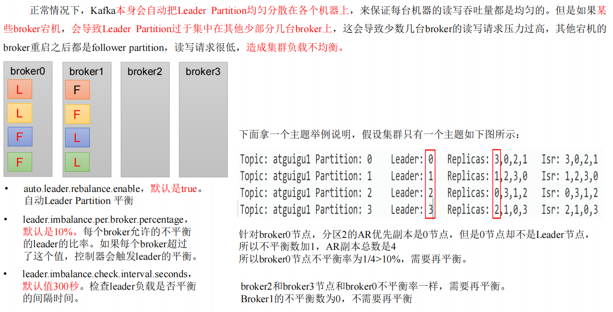

**auto.leader.rebalance.enable**

默认是 true。自动Leader Partition平衡。生产环境中，leader 重选举的代价比较大，可能会带来性能影响，**建议设置为 false 关闭**。

**leader.imbalance.per.broker.percentage**

默认是 10%。每个 broker 允许的不平衡的 leader的比率。如果每个 broker 超过了这个值，控制器会触发 leader 的平衡。

**leader.imbalance.check.interval.seconds**

默认值 300 秒。检查 leader 负载是否平衡的间隔时间。

## 7、生产经验 | 增加副本因子

```bash
//1.创建 topic
bin/kafka-topics.sh --bootstrap-server hadoop102:9092 --create 
--partitions 3 --replication-factor 1  --topic four
//2.手动增加副本存储
vim increase-replication-factor.json
{"version":1,"partitions":[{"topic":"four","partition":0,"replica
s":[0,1,2]},{"topic":"four","partition":1,"replicas":[0,1,2]},{"t
opic":"four","partition":2,"replicas":[0,1,2]}]}
//3.执行副本存储计划
bin/kafka-reassign-partitions.sh  --bootstrap-server hadoop102:9092
--reassignment-json-file increase-replication-factor.json --execute
```


# 4、文件存储

## 1、文件存储机制

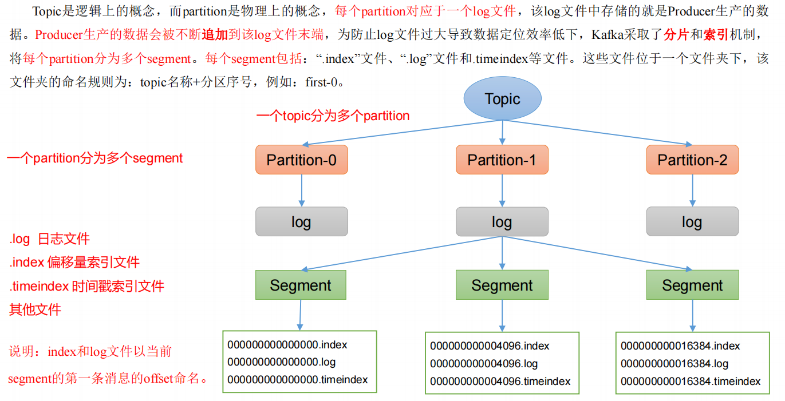

Topic是逻辑上的概念，而partition是物理上的概念，**每个partition对应于一个log文件**，该log文件中存储的就是Producer生产的数据。**Producer生产的数据会被不断追加到该log文件末端**，为防止log文件过大导致数据定位效率低下，Kafka采取了**分片**和**索引**机制，将**每个partition分为多个segment**。每个segment包括：“.index”文件、“.log”文件和.timeindex等文件。这些文件位于一个文件夹下。

文件夹的命名规则为：**topic名称+分区序号**，例如：first-0。

.log 日志文件

.index 偏移量索引文件

.timeindex 时间戳索引文件

```bash
//Topic 数据到底存储在什么位置？
//1./opt/module/kafka/datas/ first-1 first-0、first-2
00000000000000000092.index
00000000000000000092.log
00000000000000000092.snapshot
00000000000000000092.timeindex
//2.直接查看 log 日志，发现是乱码
//3.通过工具查看 index 和 log 信息
kafka-run-class.sh  kafka.tools.DumpLogSegments  
--files ./00000000000000000000.index
```

## 2、index 文件和 log 文件详解

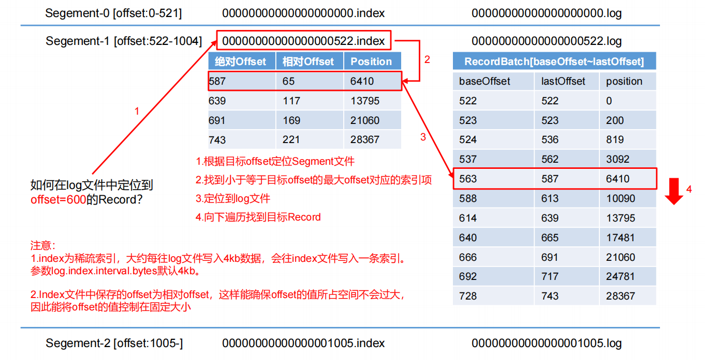

**log.segment.bytes**

Kafka 中 log 日志是分成一块块存储的，此配置是指 log 日志划分成块的大小，**默认值 1G**。

**log.index.interval.bytes**

**默认 4kb**，kafka 里面每当写入了 4kb 大小的日志（.log），然后就往 index 文件里面记录一个索引。 稀疏索引。

## 3、文件清理策略

Kafka 中**默认的日志保存时间为 7 天**，可以通过调整如下参数修改保存时间。

log.retention.hours，最低优先级小时，默认 7 天。

log.retention.minutes，分钟。

log.retention.ms，最高优先级毫秒。

log.retention.check.interval.ms，负责设置检查周期，默认 5 分钟。

Kafka 中提供的日志清理策略有 **delete** 和 **compact** 两种。

---

delete 日志删除：将过期数据删除

log.cleanup.policy = delete 所有数据启用删除策略

**基于时间**：默认打开。以 segment 中**所有记录中的最大时间戳作为该文件时间戳**。

**基于大小**：默认关闭。超过设置的所有日志总大小，删除最早的 segment。

log.retention.bytes，默认等于-1，表示无穷大。

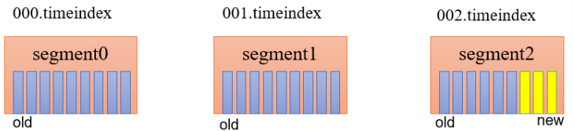

compact 日志压缩

compact日志压缩：对于相同key的不同value值，只保留最后一个版本。

log.cleanup.policy = compact 所有数据启用压缩策略

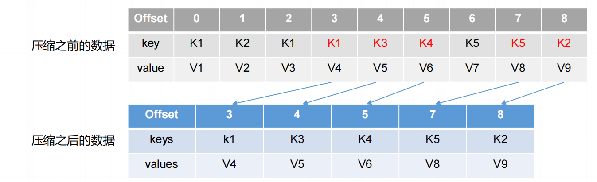

压缩后的offset可能是不连续的，比如上图中没有6，当从这些offset消费消息时，将会拿到比这个offset大的offset对应的消息，实际上会拿到offset为7的消息，并从这个位置开始消费。

这种策略只适合特殊场景，比如消息的key是用户ID，value是用户的资料，通过这种压缩策略，整个消息集里就保存了所有用户最新的资料。


# 5、高效读写数据

## 1、Kafka 本身是分布式集群，可以采用分区技术，并行度高

## 2、读数据采用稀疏索引，可以快速定位要消费的数据

## 3、顺序写磁盘

Kafka 的 producer 生产数据，要写入到 log 文件中，写的过程是一直追加到文件末端，为顺序写。官网有数据表明，同样的磁盘，顺序写能到 600M/s，而随机写只有 100K/s。这与磁盘的机械机构有关，顺序写之所以快，是因为其省去了大量磁头寻址的时间。

## 4、页缓存 + 零拷贝技术

**零拷贝**：Kafka的数据加工处理操作交由Kafka生产者和Kafka消费者处理。**Kafka Broker应用层不关心存储的数据，所以就不用走应用层，传输效率高**。

**PageCache页缓存**：Kafka重度依赖底层操作系统提供的PageCache功 能。当上层有写操作时，操作系统只是将数据写入PageCache。当读操作发生时，先从PageCache中查找，如果找不到，再去磁盘中读取。实际上PageCache是把尽可能多的空闲内存都当做了磁盘缓存来使用。

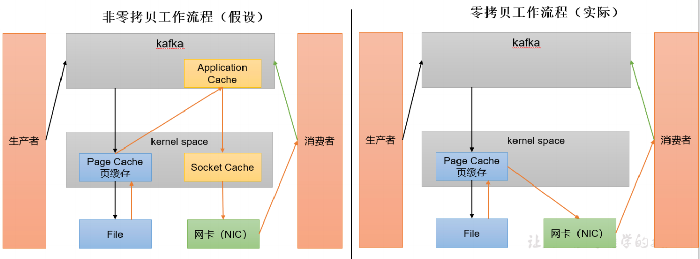

**log.flush.interval.messages**

强制页缓存刷写到磁盘的条数，默认是 long 的最大值，9223372036854775807。一般不建议修改，交给系统自己管理。

**log.flush.interval.ms**

每隔多久，刷数据到磁盘，默认是 null。一般不建议修改，交给系统自己管理。