# 1、Kafka 消费方式

## 1、消费方式

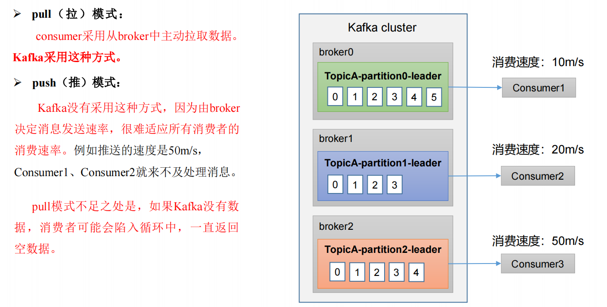

**pull（拉）模式**

consumer采用从broker中主动拉取数据。Kafka采用这种方式。

pull模式不足之处是，如 果Kafka没有数据，消费者可能会陷入循环中，一直返回空数据。


**push（推）模式**

Kafka没有采用这种方式，因为由broker决定消息发送速率，很难适应所有消费者的消费速率。例如推送的速度是50m/s，Consumer1、Consumer2就来不及处理消息。


# 2、Kafka 消费者工作流程

## 1、消费者总体工作流程

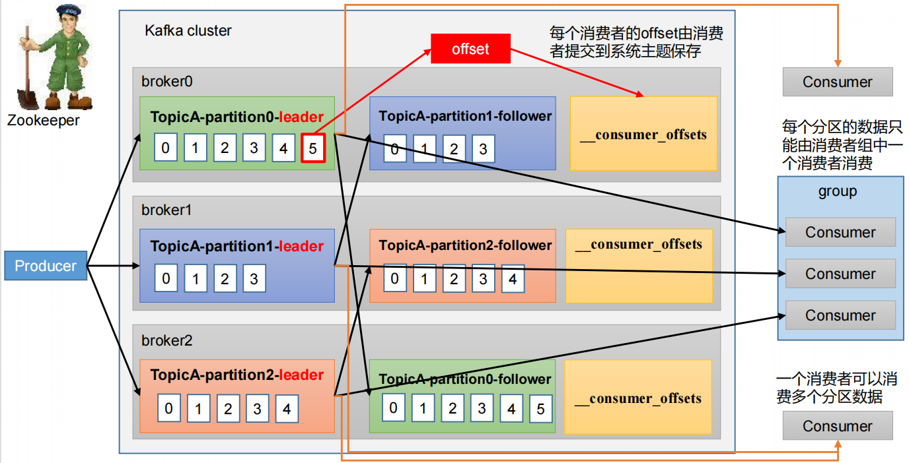

一个消费者可以消费多个分区数据。

消费者组可以看做是一个消费者，每个分区的数据只能由消费者组中一个消费者消费。

每个消费者消费的记录，即offset保存在系统主题中保存_consumer_offsets。


## 2、消费者

Consumer Group（CG）：消费者组，由多个consumer组成。形成一个消费者组的条件，是所有消费者的 groupid 相同。

消费者组内每个消费者负责消费不同分区的数据，一个分区只能由一个组内消费者消费。

消费者组之间互不影响。所有的消费者都属于某个消费者组，即消费者组是逻辑上的一个订阅者。

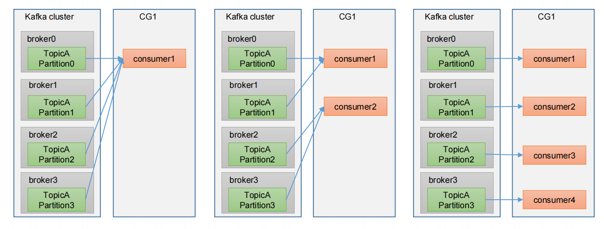

如果向消费组中添加更多的消费者，超过主题分区数量，则有一部分消费者就会闲置，不会接收任何消息。

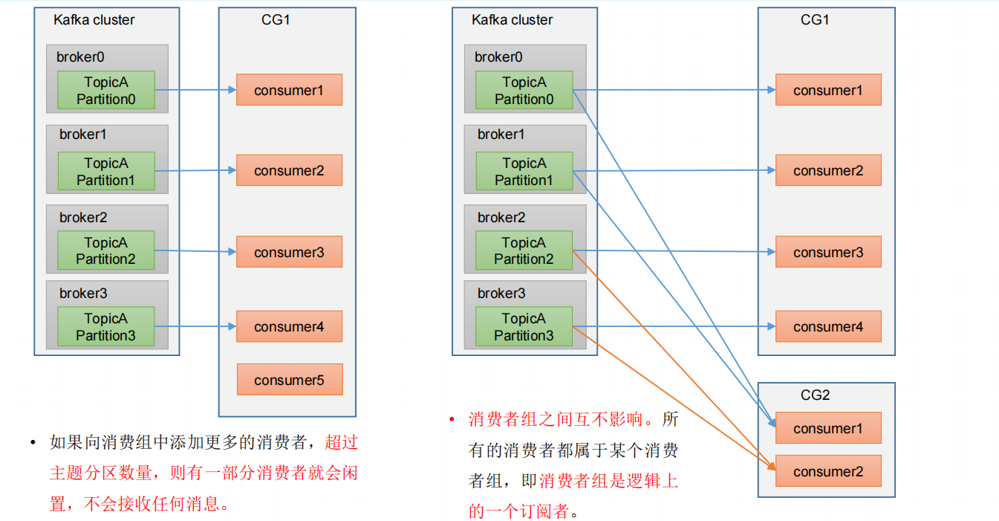

## 3、消费者组初始化流程

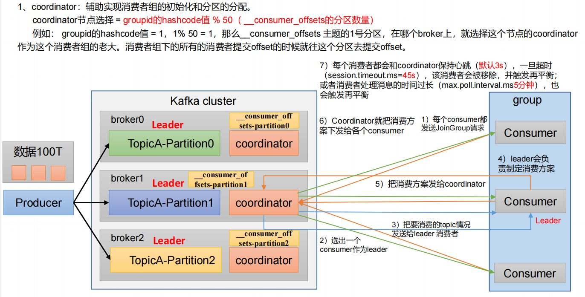

1、coordinator(groupId的hashcode值%50(__consumer_offsets的分区数)),辅助实现消费者组的初始化和分区的分配

2、选出一个consumer作为Leader

3、把要消费的topic情况发送给Leader消费者

4、Leader负责制定消费方案

5、把消费计划发给coordinator

6、coordinator把消费方案下发给各个consumer

7、每个消费者都会和coordinator保持心跳(默认3s)，一旦超时(session.timeout.ms=45s),该消费者会被移除,并触发再平衡;或者消费者处理消息的时间过长(max.pool.interval.ms=5min),也会触发再平衡


## 4、消费者组详细消费流程

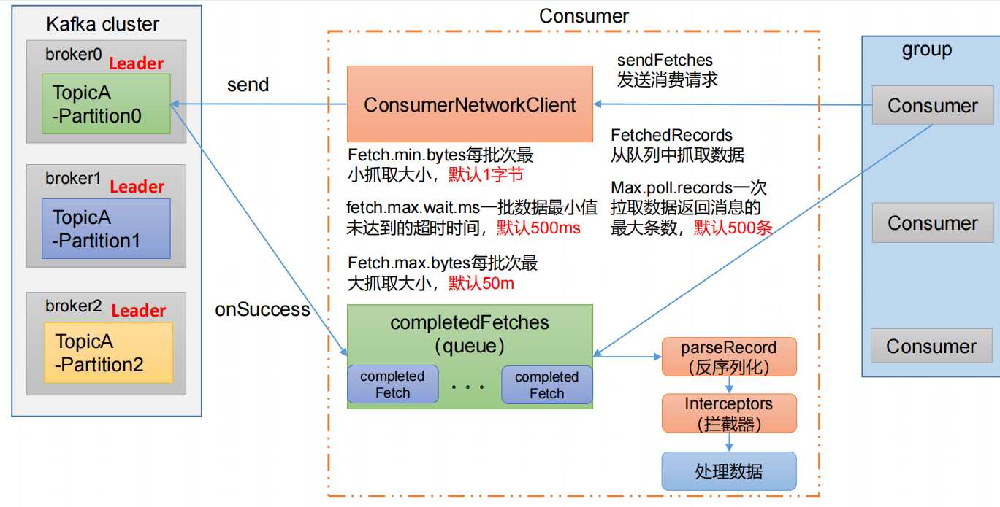

## 5、消费者重要参数

```bash
# bootstrap.servers
向 Kafka 集群建立初始连接用到的 host/port 列表。

# key.deserializer   value.deserializer
指定接收消息的 key 和 value 的反序列化类型。一定要写全类名。

# group.id
标记消费者所属的消费者组。

# enable.auto.commit
默认值为 true，消费者会自动周期性地向服务器提交偏移量。

# auto.commit.interval.ms
如果enable.auto.commit的值为true，则该值定义了消费者偏移量向 Kafka 提交的频率，默认 5s。

# auto.offset.reset
当 Kafka 中没有初始偏移量或当前偏移量在服务器中不存在（如数据被删除了），如何处理？
earliest：自动重置偏移量到最早的偏移量。
latest：默认，自动重置偏移量为最新的偏移量。
none：如果消费组原来的（previous）偏移量不存在，则向消费者抛异常。
anything：向消费者抛异常。

# offsets.topic.num.partitions
__consumer_offsets 的分区数，默认是 50 个分区。

# heartbeat.interval.ms
Kafka 消费者和 coordinator 之间的心跳时间，默认 3s。
该条目的值必须小于 session.timeout.ms ，也不应该高于session.timeout.ms 的 1/3。

# session.timeout.ms
Kafka 消费者和 coordinator 之间连接超时时间，默认 45s。
超过该值，该消费者被移除，消费者组执行再平衡。

# max.poll.interval.ms
消费者处理消息的最大时长，默认是 5 分钟。
超过该值，该消费者被移除，消费者组执行再平衡。

# fetch.min.bytes
默认 1 个字节。消费者获取服务器端一批消息最小的字节数。

# fetch.max.wait.ms
默认 500ms。如果没有从服务器端获取到一批数据的最小字节数。该时间到，仍然会返回数据。

# fetch.max.bytes
消费者获取服务器端一批消息最大的字节数。如果服务器端一批次的数据大于该值（50m）
仍然可以拉取回来这批数据，因此，这不是一个绝对最大值。
一批次的大小受 message.max.bytes （brokerconfig）or max.message.bytes （topic config）影响。
默认 Default: 52428800（50 m）。

# max.poll.records
一次 poll 拉取数据返回消息的最大条数，默认是 500 条。

# max.partition.fetch.bytes
单个分区在一次 fetch 响应中返回的最大字节数，默认 1MB。消息体大或 batch 消费时需调大，避免 OOM。

# isolation.level
事务隔离级别。read_uncommitted（默认）：可读到未提交事务的消息；read_committed：只读已提交事务的消息（消费事务 Producer 写入的 topic 时用）。

# allow.auto.create.topics
消费者订阅不存在的 topic 时是否自动创建，默认 true。生产环境建议 false，避免误订阅拼写错误导致建脏 topic。

# partition.assignment.strategy
消 费 者 分 区 分 配 策 略 ， 默 认 策 略 是 Range +CooperativeSticky。
Kafka 可以同时使用多个分区分配策略。可 以 选 择 的 策 略 包 括 ：
Range 、 RoundRobin 、Sticky 、CooperativeSticky
```


# 3、消费者 API

## 1、独立消费者案例（订阅主题）

```java
import org.slf4j.LoggerFactory;
import ch.qos.logback.classic.Level;
import ch.qos.logback.classic.Logger;
import ch.qos.logback.classic.LoggerContext;

public class Consumer {
    //将日志级别设置为INFO
    static {
        LoggerContext iLoggerFactory = (LoggerContext) LoggerFactory.getILoggerFactory();
        for (Logger logger : iLoggerFactory.getLoggerList()) {
            logger.setLevel(Level.INFO);
        }
    }

    public static void main(String[] args) {
        Properties properties = new Properties();
        properties.put(ConsumerConfig.BOOTSTRAP_SERVERS_CONFIG, "hadoop000:9092");
        //必须定义groupId
        properties.put(ConsumerConfig.GROUP_ID_CONFIG, "CONSUMER_TEST1");
        properties.put(ConsumerConfig.KEY_DESERIALIZER_CLASS_CONFIG, StringDeserializer.class);
        properties.put(ConsumerConfig.VALUE_DESERIALIZER_CLASS_CONFIG, StringDeserializer.class);
        KafkaConsumer<String, String> consumer = new KafkaConsumer<String, String>(properties);
        //订阅主题
        consumer.subscribe(Collections.singleton("first1"));

        while (true){
            //设置 1s 中消费一批数据
            ConsumerRecords<String, String> poll = consumer.poll(1);
            for (ConsumerRecord<String, String> record : poll) {
                System.out.println(record);
            }
        }
    }
}
```

## 2、独立消费者案例（订阅分区）

```java
consumer.assign(Stream.of(new TopicPartition("first1", 0),
        new TopicPartition("first1", 1),
        new TopicPartition("first1", 2)).collect(Collectors.toList()));
```


# 4、生产经验 - 分区的分配以及再平衡

## 1、简介

1、一个consumer group中有多个consumer组成，一个 topic有多个partition组成，现在的问题是，到底由哪个consumer来消费哪个partition的数据。

2、Kafka有四种主流的分区分配策略： **Range**、**RoundRobin**、**Sticky**、**CooperativeSticky**。可以通过配置参数partition.assignment.strategy，修改分区的分配策略。默认策略是Range + CooperativeSticky。Kafka可以同时使用多个分区分配策略。

## 2、Range 以及再平衡

**Range 分区策略原理**

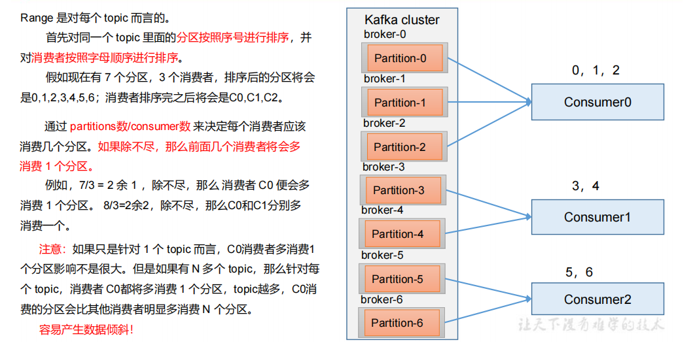

partition/consumer 除不尽的话前面几个消费者会多分担

---

**Range 分区分配策略案例**

7个分区,三个消费者

consumer0   0 1 2

consumer1   3 4

consumer2   5 6

---

**Range 分区分配再平衡案例**

干掉消费者consumer0(45s内)

consumer1   3 4

consumer2   5 6

consumer0的任务在45s之后会被分配到consumer1或consumer2

再次查看(45s之后)触发再平衡

consumer1   0 1 2 3

consumer2   4 5 6

## 3、RoundRobin 以及再平衡

**RoundRobin 分区策略原理**

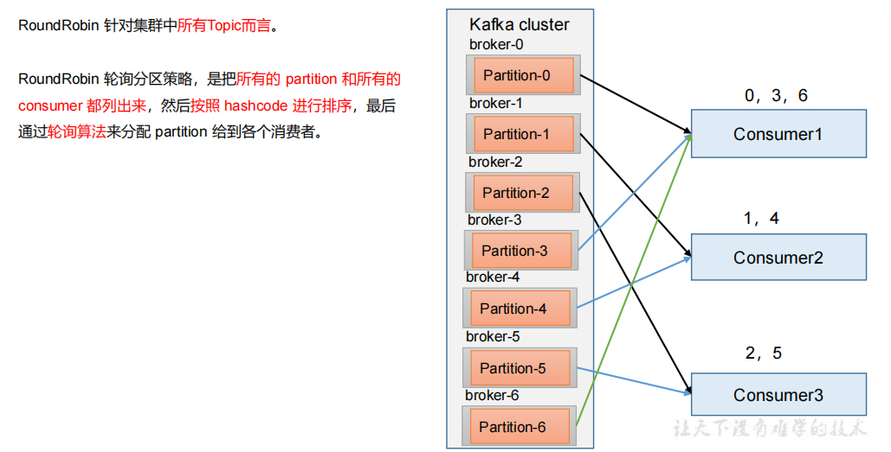

RoundRobin 针对集群中所有Topic而言。

RoundRobin 轮询分区策略，是把所有的 partition 和所有的consumer 都列出来，然后按照 hashcode 进行排序，最后通过轮询算法来分配 partition 给到各个消费者。

```java
// 修改分区分配策略
properties.put(ConsumerConfig.PARTITION_ASSIGNMENT_STRATEGY_CONFIG, "org.apache.kafka.clients.consumer.RoundRobinAssignor");
```

---

**RoundRobin 分区分配策略案例**

7个分区,三个消费者

consumer0   0 3 6

consumer1   1 4

consumer2   2 5

---

**RoundRobin 分区分配再平衡案例**

干掉消费者consumer0(45s内)

consumer1   1 4

consumer2   2 5

consumer0的任务0 3 6会在45s之后进行轮询分给consumer1和consumer2

再次查看(45s之后)触发再平衡

consumer1   0 2 4 6

consumer2   1 3 5

## 4、Sticky 以及再平衡

**策略原理**

粘性分区定义：可以理解为分配的结果带有“粘性的”。即在执行一次新的分配之前，考虑上一次分配的结果，尽量少的调整分配的变动，可以节省大量的开销。

会尽量均衡的放置分区到消费者上面(跟Range不同的是这个是随机的)，在出现同一消费者组内消费者出现问题的时候，会尽量保持原有分配的分区不变化。

```java
// 修改分区分配策略
properties.put(ConsumerConfig.PARTITION_ASSIGNMENT_STRATEGY_CONFIG, "org.apache.kafka.clients.consumer.StickyAssignor");
```

---

**Sticky 分区分配策略案例**

consumer0   1 4

consumer1   0 3 6

consumer2   2 5

---

**Sticky 分区分配再平衡案例**

干掉consumer1(45s内)

consumer0   1 4

consumer2   2 5

consumer1的3由consumer2消费,0 6由consumer0消费

再次查看(45s之后)触发再平衡

consumer0   0 1 4 6

consumer2   2 3 5


# 5、offset 位移

## 1、offset 的默认维护位置

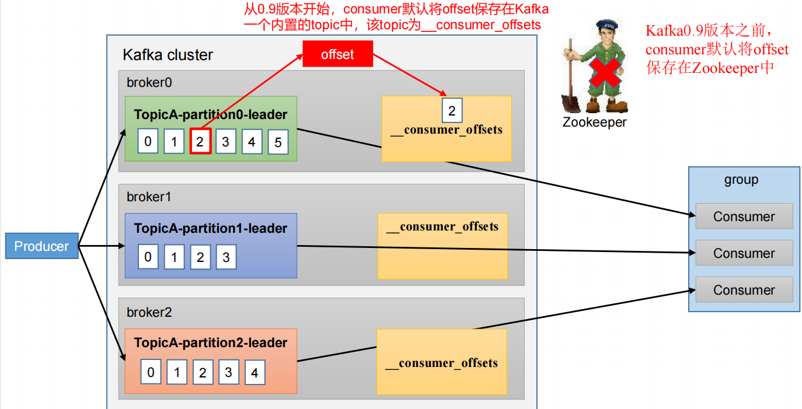

1、在0.9版本之前是存放在zookeeper中,考虑到过多的网络通讯在0.9版本后将offset存放在_consumer_offsets的topic中。

2、__consumer_offsets主题里面采用 key 和 value 的方式存储数据。key 是 **group.id + topic + 分区号**，value 就是当前 offset 的值。每隔一段时间，kafka 内部会对这个 topic 进行compact，也就是每个 group.id+topic+分区号就保留最新数据


## 2、查看__consumer_offsets文件

在配置文件 config/consumer.properties 中添加配置 exclude.internal.topics=false，默认是 true，表示不能消费系统主题。为了查看该系统主题数据，所以该参数修改为 false。

```bash
bin/kafka-console-consumer.sh --topic  __consumer_offsets --bootstrap-server hadoop102:9092 --consumer.config  config/consumer.properties  --formatter  "kafka.coordinator.group.GroupMetadataManager\$OffsetsMessageFormatter" --from-beginning
```


## 3、自动提交 offset

为了使我们能够专注于自己的业务逻辑，Kafka 提供了自动提交offset的功能。

**enable.auto.commit**：是否开启自动提交offset功能，默认是true。

**auto.commit.interval.ms**：自动提交offset的时间间隔，默认是5s。

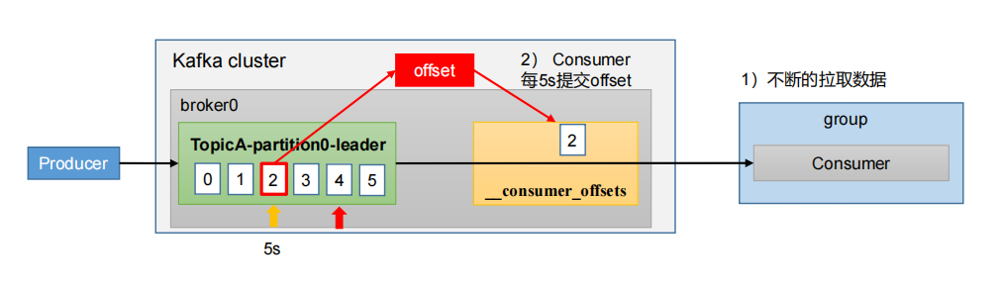

## 4、手动提交 offset

虽然自动提交offset十分简单便利，但由于其是基于时间提交的，开发人员难以把握offset提交的时机。因此Kafka还提供了手动提交offset的API。

手动提交offset的方法有两种：分别是**commitSync（同步提交）**和**commitAsync（异步提交）**。两者的相同点是，都会将**本次提交的一批数据最高的偏移量提交**；不同点是，**同步提交阻塞当前线程**，一直到提交成功，并且会自动失败重试（由不可控因素导致，也会出现提交失败）；而**异步提交则没有失败重试机制，故有可能提交失败**。

commitSync（同步提交）：必须等待offset提交完毕，再去消费下一批数据。

commitAsync（异步提交） ：发送完提交offset请求后，就开始消费下一批数据了。

---

**同步提交offset**

由于同步提交 offset 有失败重试机制，故更加可靠，但是由于一直等待提交结果，提交的效率比较低。

```java
public class ConsumerCommit {
    static {
        LoggerContext iLoggerFactory = (LoggerContext) LoggerFactory.getILoggerFactory();
        for (Logger logger : iLoggerFactory.getLoggerList()) {
            logger.setLevel(Level.INFO);
        }
    }

    public static void main(String[] args) {
        Properties properties = new Properties();
        properties.put(ConsumerConfig.BOOTSTRAP_SERVERS_CONFIG, "hadoop000:9092");
        properties.put(ConsumerConfig.GROUP_ID_CONFIG, "CONSUMER_TEST1");
        properties.put(ConsumerConfig.KEY_DESERIALIZER_CLASS_CONFIG, StringDeserializer.class);
        properties.put(ConsumerConfig.VALUE_DESERIALIZER_CLASS_CONFIG, StringDeserializer.class);
        //关闭自动提交
        properties.put(ConsumerConfig.ENABLE_AUTO_COMMIT_CONFIG, false);
        KafkaConsumer<String, String> consumer = new KafkaConsumer<String, String>(properties);

        consumer.subscribe(Collections.singleton("first1"));

        while (true){
            ConsumerRecords<String, String> poll = consumer.poll(1);
            for (ConsumerRecord<String, String> record : poll) {
                System.out.println(record);
            }
            //同步提交
            consumer.commitSync();
        }
    }
}
```

---

**异步提交offset**

虽然同步提交 offset 更可靠一些，但是由于其会阻塞当前线程，直到提交成功。因此吞吐量会受到很大的影响。因此更多的情况下，会选用异步提交 offset 的方式。

```java
consumer.commitAsync();
```

## 5、指定offset消费

**auto.offset.reset** = earliest | latest | none 默认是 latest。

**earliest**：自动将偏移量重置为最早的偏移量，--from-beginning。

**latest**（默认值）：自动将偏移量重置为最新偏移量。

**none**：如果未找到消费者组的先前偏移量，则向消费者抛出异常。

```java
public class ConsumerOffset {
    static {
        LoggerContext iLoggerFactory = (LoggerContext) LoggerFactory.getILoggerFactory();
        for (Logger logger : iLoggerFactory.getLoggerList()) {
            logger.setLevel(Level.INFO);
        }
    }

    public static void main(String[] args) {
        Properties properties = new Properties();
        properties.put(ConsumerConfig.BOOTSTRAP_SERVERS_CONFIG, "hadoop000:9092");
        //offset每次执行完需要修改组名称
        properties.put(ConsumerConfig.GROUP_ID_CONFIG, "CONSUMER_TEST9");
        properties.put(ConsumerConfig.KEY_DESERIALIZER_CLASS_CONFIG, StringDeserializer.class);
        properties.put(ConsumerConfig.VALUE_DESERIALIZER_CLASS_CONFIG, StringDeserializer.class);
        KafkaConsumer<String, String> consumer = new KafkaConsumer<String, String>(properties);

        //订阅主题
        consumer.subscribe(Collections.singleton("first1"));

        Set<TopicPartition> assignment = new HashSet<>();
        //获取消费分区的信息
        while (assignment.isEmpty()){
            consumer.poll(Duration.ofSeconds(1));
            assignment = consumer.assignment();
        }

        for (TopicPartition topicPartition : assignment) {
            //重新指定消费计划 从200offset开始消费
            consumer.seek(topicPartition,200);
        }

        while (true){
            ConsumerRecords<String, String> poll = consumer.poll(1);
            for (ConsumerRecord<String, String> record : poll) {
                System.out.println(record);
            }
        }
    }
}
```

## 6、指定时间offset消费

```java
public class ConsumerOffsetTime {
    static {
        LoggerContext iLoggerFactory = (LoggerContext) LoggerFactory.getILoggerFactory();
        for (Logger logger : iLoggerFactory.getLoggerList()) {
            logger.setLevel(Level.INFO);
        }
    }

    public static void main(String[] args) {
        Properties properties = new Properties();
        properties.put(ConsumerConfig.BOOTSTRAP_SERVERS_CONFIG, "hadoop000:9092");
        properties.put(ConsumerConfig.GROUP_ID_CONFIG, "CONSUMER_TEST10");
        properties.put(ConsumerConfig.KEY_DESERIALIZER_CLASS_CONFIG, StringDeserializer.class);
        properties.put(ConsumerConfig.VALUE_DESERIALIZER_CLASS_CONFIG, StringDeserializer.class);
        KafkaConsumer<String, String> consumer = new KafkaConsumer<String, String>(properties);

        //订阅主题
        consumer.subscribe(Collections.singleton("first1"));

        Set<TopicPartition> assignment = new HashSet<>();
        //获取消费分区的信息
        while (assignment.isEmpty()) {
            consumer.poll(Duration.ofSeconds(1));
            assignment = consumer.assignment();
        }
        //创建一天前offsetMap
        Map<TopicPartition, Long> map = new HashMap<>();
        for (TopicPartition topicPartition : assignment) {
            map.put(topicPartition, System.currentTimeMillis() - 24 * 60 * 60 * 1000);
        }
        //通过map获取分区和offsetTimeStampMap
        Map<TopicPartition, OffsetAndTimestamp> offsetTimeMap = consumer.offsetsForTimes(map);
        //遍历进行seek
        for (TopicPartition topicPartition : assignment) {
            OffsetAndTimestamp offsetAndTimestamp = offsetTimeMap.get(topicPartition);
            if (offsetAndTimestamp != null){
                consumer.seek(topicPartition,offsetAndTimestamp.offset());
            }
        }

        while (true) {
            ConsumerRecords<String, String> poll = consumer.poll(1);
            for (ConsumerRecord<String, String> record : poll) {
                System.out.println(record);
            }
        }
    }
}
```

## 7、漏消费和重复消费

**重复消费**

发生在自动提交

Consumer每5s进行自动提交offset

在消费后如果在5s内consumer挂掉,再次启动consumer,则从上次提交的offset处继续消费,导致重复消费。

---

**漏消费**

发生在手动提交

当offset被提交时,数据还在内存中为落盘,此时刚好消费者线程被kill掉,那么offset已经提交,但是数据未处理,导致这部分内存中的数据丢失。

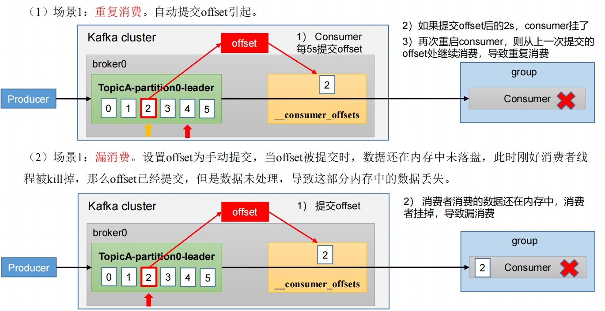

> 三层防丢/防重配置与落地实现见 **6、丢消息与重复消费.md**。


# 6、生产经验 - 消费者事务

## 1、消费者事务

如果想完成**Consumer端的精准一次性消费**，那么**需要Kafka消费端将消费过程和提交offset过程做原子绑定**。此时我们需要将Kafka的offset保存到支持事务的自定义介质（比如MySQL）

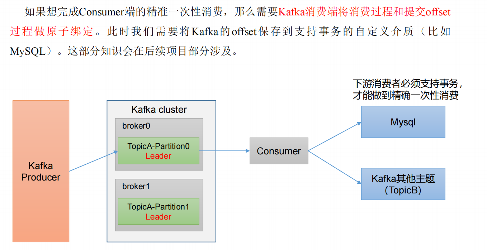


# 7、生产经验 - 数据积压（消费者如何提高吞吐量）

## 1、数据挤压

1、如果是Kafka消费能力不足，则可以考虑增加Topic的分区数，并且同时提升消费组的消费者数量，消费者数 = 分区数。（两者缺一不可）

2、如果是下游的数据处理不及时：提高每批次拉取的数量。批次拉取数据过少（拉取数据/处理时间 < 生产速度），使处理的数据小于生产的数据，也会造成数据积压。

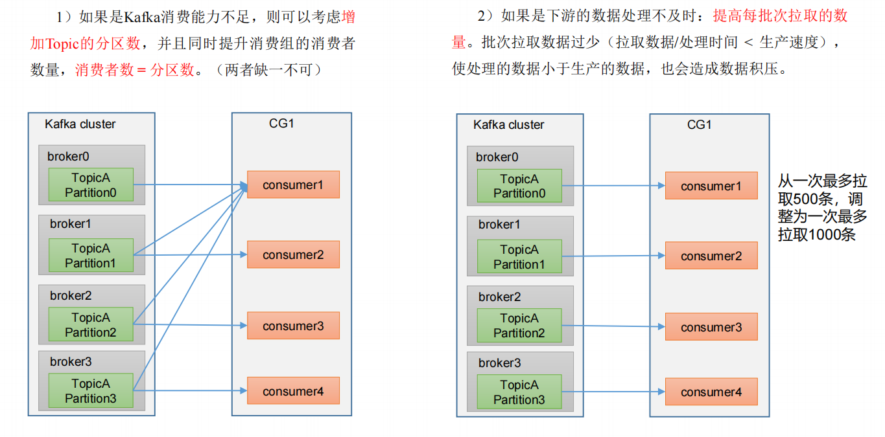