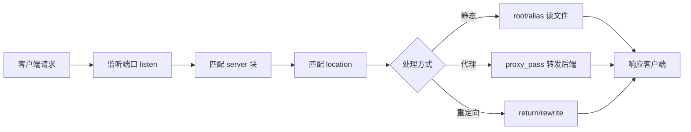

# 1、Nginx 简介与架构

## 1、简介

https://nginx.org/

Nginx（engine x）由 Igor Sysoev 开发，以**高并发、低内存占用、配置简洁**著称。常见角色：

| 角色 | 说明 | 典型场景 |
|------|------|----------|
| **Web 服务器** | 直接响应 HTTP 请求，返回静态文件 | 前端 dist、图片、下载 |
| **反向代理** | 客户端只访问 Nginx，Nginx 转发到后端 | `/api` → Spring Boot |
| **负载均衡** | 将请求分发到多台后端 | upstream 多节点 |
| **API 网关入口** | TLS 终结、限流、统一域名 | 公网入口层 |

---

## 2、核心概念

| 概念 | 说明 |
|------|------|
| **Master 进程** | 读配置、绑定端口、管理 Worker；**不处理业务请求** |
| **Worker 进程** | 实际处理连接与请求；数量由 `worker_processes` 控制 |
| **事件驱动** | 基于 epoll/kqueue 等 IO 多路复用，少量进程支撑大量连接 |
| **server 块** | 虚拟主机，按 `server_name` / 端口区分站点 |
| **location 块** | 按 URI 路径匹配，决定如何处理请求 |
| **upstream** | 后端服务器组，用于负载均衡 |

---

## 3、Master-Worker 架构

```text
                    ┌─────────────┐
                    │   Master    │  读配置、启停 Worker、reload
                    └──────┬──────┘
           ┌───────────────┼───────────────┐
           ▼               ▼               ▼
    ┌────────────┐  ┌────────────┐  ┌────────────┐
    │  Worker 1  │  │  Worker 2  │  │  Worker N  │  处理连接
    └────────────┘  └────────────┘  └────────────┘
```

**特点**

- Worker 之间**互不干扰**，一个 Worker 阻塞不影响其他 Worker
- **热部署**：`nginx -s reload` 由 Master 重新加载配置，Worker 优雅退出
- Worker 以普通用户（如 `nginx`）运行，Master 以 root 启动后降权

---

## 4、请求处理流程



**匹配顺序（简化）**

1. 先按 `listen` + `server_name` 选中 **server**
2. 再在该 server 内按 **location 规则** 选中最优匹配
3. 执行对应指令（`root`、`proxy_pass`、`rewrite` 等）

---

## 5、与 Apache 对比

| | Nginx | Apache |
|---|-------|--------|
| 架构 | 事件驱动、异步非阻塞 | 多进程/多线程（传统 prefork） |
| 静态资源 | 极快，sendfile 零拷贝 | 较快 |
| 动态内容 | 需反向代理到应用（Tomcat 等） | mod_php 等可内嵌 |
| 配置 | 简洁，reload 热加载 | .htaccess 灵活但性能差 |
| 并发模型 | 少量 Worker + epoll | 每连接一线程/进程（传统模式） |
| 适用 | 高并发、反向代理、静态 | 传统 LAMP、模块生态 |

---

## 6、常见应用场景

**前后端分离**

```text
浏览器 → Nginx:80
           ├─ /          → 静态 html/js/css（Vue/React dist）
           └─ /api/      → proxy_pass 到 Spring Boot:8080
```

**多服务统一入口**

```text
api.example.com    → 网关 / 业务 A
admin.example.com  → 管理后台
static.example.com → CDN / 对象存储回源
```

**HTTPS 终结**

```text
客户端 --HTTPS--> Nginx:443 --HTTP--> 内网后端
```

Nginx 持有证书，后端无需处理 TLS，降低应用复杂度。

---

## 7、配置文件层次预览

```text
nginx.conf
├── 全局块          user、worker_processes、error_log
├── events 块       worker_connections、use epoll
└── http 块
    ├── 全局 http 参数   gzip、keepalive、log_format
    ├── upstream 块      后端服务器组
    └── server 块
        └── location 块  路径匹配与处理
```

下一篇：[2、安装与目录规划.md](./2、安装与目录规划.md)
