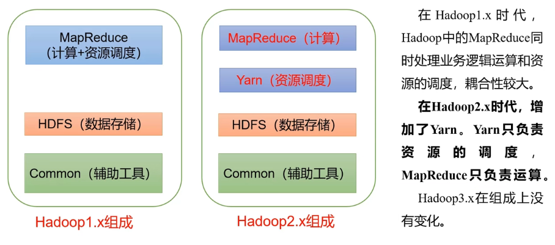
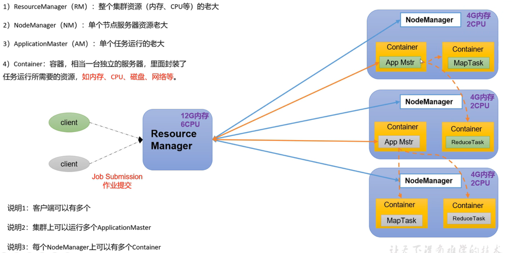
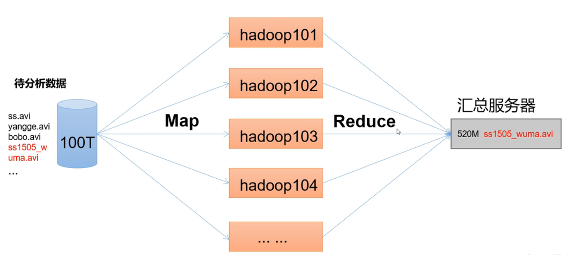
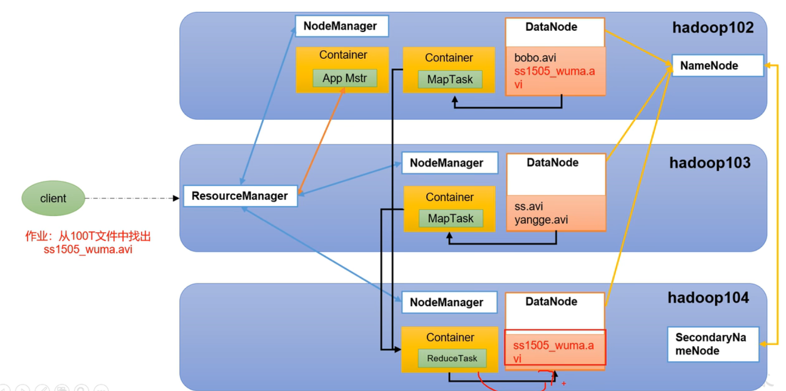
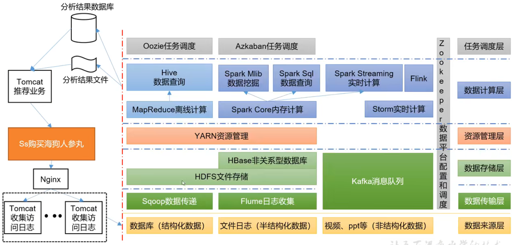

# 1、Hadoop 简介

## Hadoop 是什么

Apache 基金会开发的**分布式系统基础架构**。

主要解决: 海量数据的**存储**和海量数据的**分析计算**。

## Hadoop 优势

- 高可靠性

  底层维护多个数据副本

- 高扩展性

  在集群间分配任务数据,可动态的扩展节点

- 高效性

  在MapReduce的思想下,Hadoop是并行工作的,以加快任务处理速度

- 高容错性

  能够自动将失败的任务重新分配

## Hadoop 组成




## HDFS

Hadoop Distributed File System 分布式文件系统
- NameNode(nn)

  存储文件的元数据,如文件名,文件目录结构,文件属性(生成时间,副本数,文件权限),以及每个文件的块列表和块所在的DataNode

- DataNode(dn)

  在本地文件系统存储文件块数据,以及块数据的检验和(保证数据是正确的)

- Secondary NameNode(2nn)

  每隔一段时间对NameNode源数据备份


## Yarn

Yet Another Resource Negotiator
- ResourceManager(RM)

  整个集群资源(内存,cpu等)的老大

- NodeManager(NM)

  单个节点服务器的老大

- ApplicationMaster

  单个任务运行的老大

- Container

  相当于一台独立的服务器,里面封装了任务运行所需的资源,如内存,cpu,磁盘,网络等




## MapReduce

MapReduce 将计算分为 Map 和 Reduce 两个阶段
- Map

  并行处理输入数据

- Reduct

  对 Map 结果进行汇总



## HDFS、Yarn、MapReduce 三者关系



# 2、大数据生态体系



数据源：业务系统、埋点、爬虫

**PG**：PostgreSQL,一种关系型数据库。

**Sqoop**：是一个在结构化数据(mysql/oracle)和Hadoop(Hive)之间进行批量数据迁移的工具。

**Flume**：是一个分布式、可靠、高可用的海量日志采集、聚合和传输的系统。支持在日志系统中定制各类数据发送方，用于收集数据；提供对数据进行简单处理，并写到各种数据接受方（HDFS\Hbase）的能力。

**Kafka**：是一个分布式、支持分区的、多副本的，基于zookeeper协调的分布式消息系统。

**Flink**：一个流式的数据流执行引擎。针对数据流的分布式计算提供了数据分布、数据通信以及容错机制等功能。

**Kylin**：是一个开源的分布式分析引擎，提供Hadoop/Spark之上的SQL查询接口及多维分析（OLAP）能力一直吃超大规模数据。能在亚秒内查询巨大的Hive表。

**ES：elasticsSearch**,是一个高扩展、开源的全文检索和分析引擎，可准实时地快速存储、搜索、分析海量的数据。

**Hadoop**：是一个分布式系统基础架构，可使用户在不了解分布式底层细节的情况下开发分布式程序，充分利用集群的威力进行高速运算和存储。两大核心：HDFS\MapReduce。

**HDFS**：是可扩展、容错、高性能的分布式文件系统，异步复制，一次写入多次读取，主要负责存储。

**MapReduce**：分布式计算框架。

**Spark**：是一个专为大规模数据处理而设计的快速通用的计算引擎。


# 3、5V

**Volume** 

据量大，即采集、存储和计算的数据量都非常大。真正大数据的起始计量单位往往是TB（1024GB）、PB（1024TB）

**Velocity**

数据增长速度快，处理速度也快，时效性要求高

**Variety**

种类和来源多样化。种类上包括结构化、半结构化和非结构化数据，具体表现为网络日志、音频、视频、图片、地理位置信息等，数据的多类型对数据处理能力提出了更高的要求。数据可以由传感器等自动收集，也可以由人类手工记录

**Value**

数据价值密度相对较低。随着互联网及物联网的广泛应用，信息感知无处不在，信息量大，但价值密度较低。如何结合业务逻辑并通过强大的机器算法来挖掘数据的价值，是大数据时代最需要解决的问题

**Veracity**

数据的准确性和可信赖度高，即数据的质量高。数据本身如果是虚假的，那么它就失去了存在的意义，因为任何通过虚假数据得出的结论都可能是错误的，甚至是相反的

# 4、Hadoop 安装

**安装**

```bash
# 官网 http://hadoop.apache.org/
# 环境变量配置
vi /etc/profile.d/my_env.sh
# HADOOP_HOME
export HADOOP_HOME=/opt/module/hadoop-3.1.3
export PATH=$PATH:$HADOOP_HOME/bin
export PATH=$PATH:$HADOOP_HOME/sbin

source /etc/profile
```

**目录结构**

```bash
drwxr-xr-x. 2 atguigu atguigu  4096 5月  22 2017 bin
drwxr-xr-x. 3 atguigu atguigu  4096 5月  22 2017 etc
drwxr-xr-x. 2 atguigu atguigu  4096 5月  22 2017 include
drwxr-xr-x. 3 atguigu atguigu  4096 5月  22 2017 lib
drwxr-xr-x. 2 atguigu atguigu  4096 5月  22 2017 libexec
-rw-r--r--. 1 atguigu atguigu 15429 5月  22 2017 LICENSE.txt
-rw-r--r--. 1 atguigu atguigu   101 5月  22 2017 NOTICE.txt
-rw-r--r--. 1 atguigu atguigu  1366 5月  22 2017 README.txt
drwxr-xr-x. 2 atguigu atguigu  4096 5月  22 2017 sbin
drwxr-xr-x. 4 atguigu atguigu  4096 5月  22 2017 share

bin目录：存放对Hadoop相关服务（hdfs，yarn，mapred）进行操作的脚本
etc目录：Hadoop的配置文件目录，存放Hadoop的配置文件
lib目录：存放Hadoop的本地库（对数据进行压缩解压缩功能）
sbin目录：存放启动或停止Hadoop相关服务的脚本
share目录：存放Hadoop的依赖jar包、文档、和官方案例
```

