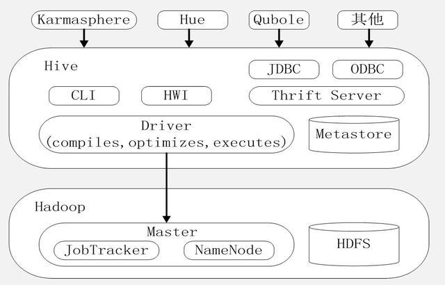

# 1、Hive 简介

Hive 是基于 Hadoop 平台的数仓工具，具有海量数据存储,水平可扩展，离线批处理的优点。依赖 HDFS 和 MapReduce。因此在进行离线批处理时，需要将查询语句转换为 MR 任务，由 MR 批量处理结果返回，所以 Hive 没法满足数据实时查询分析的需求。



**CLI**

是 Hive 提供的命令行工具

**HWI**

是 Hive 的 web 访问接口

**JDBC/ODBC**

是两种的标准的应用程序编程访问接口

**Thrift Server**

提供异构语言，进行远程 RPC 调用 Hive 的能力

**Driver**

是 Hive 比较核心的驱动模块，包含编译器、优化器、执行器，职责为把用户输入的 Hivesql 转换成 MR 数据处理任务

**Metastore**

是 Hive 的元数据存储模块，数据的访问和查找，必须要先访问元数据。Hive中的元数据一般使用单独的关系型数据库存储，常用的是Mysql，为了确保高可用，Mysql 元数据库还需主备部署。

# 2、数据分层

**ODS Operation Data Store**

原始数据层,存放原始数据,直接加载原始日志、数据,数据保持原貌不做处理

**DWD Data Warehouse Detail**

对ODS层进行清洗(去除空值,脏数据,超过极限范围的数据)、维度退化、脱敏等

**DWS Data Warehouse Service**

以DWD为基础,按天进行轻度汇总

**DWT Data Warehouse Topic**

以DWS为基础,按主题进行汇总

**ADS Application Data Store**

为报表统计提供数据

# 3、JDBC

依赖

```xml
<!-- 添加hadoop依赖 -->
<dependency>
    <groupId>org.apache.hadoop</groupId>
    <artifactId>hadoop-common</artifactId>
    <version>2.6.0</version>
</dependency>

<dependency>
    <groupId>org.apache.hadoop</groupId>
    <artifactId>hadoop-mapreduce-client-core</artifactId>
    <version>2.6.0</version>
</dependency>

<dependency>
    <groupId>org.apache.hadoop</groupId>
    <artifactId>hadoop-mapreduce-client-common</artifactId>
    <version>2.6.0</version>
</dependency>

<dependency>
    <groupId>org.apache.hadoop</groupId>
    <artifactId>hadoop-hdfs</artifactId>
    <version>2.6.0</version>
</dependency>
```

yml

```yml
spring:
  datasource:
    hive:
      url: jdbc:hive2://10.22.10.150:10000/ods_langu_test
      type: com.alibaba.druid.pool.DruidDataSource
      username: langutest
      password: Langutest.123!
      driver-class-name: org.apache.hive.jdbc.HiveDriver
    commonConfig: #连接池统一配置，应用到所有的数据源
      initialSize: 1
      minIdle: 1
      maxIdle: 5
      maxActive: 50
      maxWait: 10000
      timeBetweenEvictionRunsMillis: 10000
      minEvictableIdleTimeMillis: 300000
      validationQuery: select 'x'
      testWhileIdle: true
      testOnBorrow: false
      testOnReturn: false
      poolPreparedStatements: true
      maxOpenPreparedStatements: 20
      filters: stat
```

配置文件

```java
import com.alibaba.druid.pool.DruidDataSource;
import org.springframework.beans.factory.annotation.Value;
import org.springframework.context.annotation.Bean;
import org.springframework.context.annotation.Configuration;
import org.springframework.jdbc.core.JdbcTemplate;

import javax.sql.DataSource;
import java.sql.SQLException;


/**
 * HiveJdbc配置
 *
 * @author louise
 * @date 2022/03/07
 */
@Configuration
public class HiveJdbcConfig {


    @Value("${spring.datasource.hive.url}")
    private String url;

    @Value("${spring.datasource.hive.driver-class-name}")
    private String driver;

    @Value("${spring.datasource.hive.username}")
    private String user;

    @Value("${spring.datasource.hive.password}")
    private String password;

    @Value("${spring.datasource.commonConfig.initialSize}")
    private int initialSize;

    @Value("${spring.datasource.commonConfig.minIdle}")
    private int minIdle;

    @Value("${spring.datasource.commonConfig.maxActive}")
    private int maxActive;

    @Value("${spring.datasource.commonConfig.maxWait}")
    private int maxWait;

    @Value("${spring.datasource.commonConfig.timeBetweenEvictionRunsMillis}")
    private int timeBetweenEvictionRunsMillis;

    @Value("${spring.datasource.commonConfig.minEvictableIdleTimeMillis}")
    private int minEvictableIdleTimeMillis;

    @Value("${spring.datasource.commonConfig.validationQuery}")
    private String validationQuery;

    @Value("${spring.datasource.commonConfig.testWhileIdle}")
    private boolean testWhileIdle;

    @Value("${spring.datasource.commonConfig.testOnBorrow}")
    private boolean testOnBorrow;

    @Value("${spring.datasource.commonConfig.testOnReturn}")
    private boolean testOnReturn;

    @Value("${spring.datasource.commonConfig.poolPreparedStatements}")
    private boolean poolPreparedStatements;

    @Value("${spring.datasource.commonConfig.maxOpenPreparedStatements}")
    private int maxOpenPreparedStatements;

    @Value("${spring.datasource.commonConfig.filters}")
    private String filters;

    @Bean
    public DataSource dataSource(){
        DruidDataSource datasource = new DruidDataSource();
        //配置数据源属性
        datasource.setUrl(url);
        datasource.setDriverClassName(driver);
        datasource.setUsername(user);
        datasource.setPassword(password);
        //配置统一属性
        datasource.setInitialSize(initialSize);
        datasource.setMinIdle(minIdle);
        datasource.setMaxActive(maxActive);
        datasource.setMaxWait(maxWait);
        datasource.setTimeBetweenEvictionRunsMillis(timeBetweenEvictionRunsMillis);
        datasource.setMinEvictableIdleTimeMillis(minEvictableIdleTimeMillis);
        datasource.setValidationQuery(validationQuery);
        datasource.setTestWhileIdle(testWhileIdle);
        datasource.setTestOnBorrow(testOnBorrow);
        datasource.setTestOnReturn(testOnReturn);
        datasource.setPoolPreparedStatements(poolPreparedStatements);
        datasource.setMaxOpenPreparedStatements(maxOpenPreparedStatements);
        try {
            datasource.setFilters(filters);
        } catch (SQLException e) {
            throw new RuntimeException(e.getMessage());
        }
        return datasource;
    }

    @Bean
    public JdbcTemplate jdbcTemplate(DataSource dataSource){
        return new JdbcTemplate(dataSource);
    }
}
```

# 4、数据类型

```
//基本类型
tinyint
smallint
int
bigint
float
double
boolean
string
timestamp
binary

//复杂类型
array
map
struct
```

# 5、常用函数

## 日期函数

```sql
# 当前日期
SELECT CURRENT_DATE;    --2022-07-08
SELECT CURRENT_TIMESTAMP;  --2022-07-08 14:26:28.2
Select current_timestamp;  --2022-07-08 14:26:53.609

# 日期差值
select datediff('2016-08-16','2016-08-11') 

# 日期加/减
select date_add('2016-08-16',10)
select date_sub('2016-08-16',10)

# 返回当月的第一天
select trunc('2016-08-16','MM')  --2016-08-01
# 返回当年的第一天
select trunc('2016-08-16','YEAR') --2016-01-01

# 日期转换  yyyy-MM-dd HH:mm:ss
select date_format(CURRENT_DATE,'yyyy/MM/dd')   --2022/07/08
```

## 系统函数

```sql
//查看表结构
desc table_name
//查看表详细属性
desc formatted table_name
//显示所有的可用函数，包括运算符、内置函数、自定义函数
show functions
//显示指定函数的描述信息
desc function trim
//显示指定函数的详细信息
desc function extended trim
```

# 6、常用 sql

## 建库

```sql
# 建库  库位置hdfs地址/user/hive/warehouse
create database db_order   # hdfs地址/user/hive/warehouse/db_order.db
```

## 建表

```sql
# 建表
create table t_order(id string comment '主键',
create_time string,amount float) comment '学生表'
row format delimited
fields terminated by ',';

# 复杂类型建表
create table sanguo(
  name string,
  friends array<string>,
  children map<string, int>,
  address struct<street:string, city:string>
)
row format delimited
fields terminated by ',';

# 分区表
create table t_access(ip string,url string,access_time string)
partitioned by(dt string)
row format delimited
fields terminated by ',';

# 删除表
drop table t_order;
```

## 字段修改

```sql
# 修改字段
ALTER TABLE 数据库名.表名 CHANGE COLUMN 字段名 新的字段名(如果不变就保持原字段) 字段类型(若不变就采用原来的字段) COMMENT '新的字段备注';
# 添加在最后
alter table 表名 add columns (列名 string comment '当前时间');
# 移动到指定位置,address字段的后面
alter table 表名 change 旧列名 新列名 string after 指定位置的列名;
```

## 抽取数据

```sql
# 复制表结构
create table mytest_tmp like FDM_SOR.mytest_deptaddr;
# 蠕虫复制
create table mytest_tmp1 
    as   
   select *  from FDM_SOR.mytest_deptaddr where statis_date='20180229';

# 向分区表导入数据
load data local inpath '/root/access.log.2017-08-04.log' into table t_access
partition(dt=‘20190527’);
load data local inpath '/root/access.log.2017-08-05.log' into table t_access
partition(dt=‘20190528’);

# 覆盖保存
INSERT OVERWRITE TABLE ods_qa_line.ods_qa_line_collect
  SELECT
    vacuo_filling.vin,
    CURRENT_DATE,
    vacuo_filling.result,
    tighten.result
FROM
    vacuo_filling
    JOIN tighten ON vacuo_filling.vin = tighten.vin;
```

## 修改表分隔符

```sql
# 查询当前分隔符
desc formatted tablename;    --field.delim  serialization.format
# 修改分隔符
ALTER TABLE table_name SET SERDEPROPERTIES ('field.delim' = '\t' , 'serialization.format'='\t');
ALTER TABLE table_name SET SERDEPROPERTIES ('field.delim' = '\001' , 'serialization.format'='\001');
```

## 空格替换

```sql
# sqoop 导数据字符串出现  \u000 空格解决
select regexp_replace(vin,'\\x00','')
```

# 7、命令行

```bash
# hive --help

# beeline --help
-u 	数据库地址
-n 	用户名
-p 	密码
-d 	驱动 (可选)
-e 	执行 SQL 命令
-f 	执行 SQL 脚本

# 上传文件到hdfs
hdfs dfs -put 'FILE_PATH\FILE_NAME' HDFS_PATH
# 导入数据 没有local是从hdfs导入
load data [local] inpath 'HDFS_PATH' [overwrite] into table  TABLE_NAME
# hive cli命令窗口中查看hdfs文件系统
hive
dfs -ls /;
```

