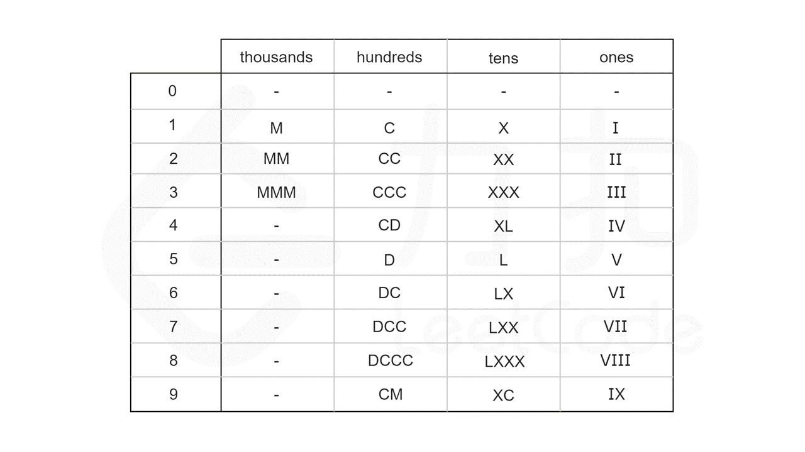

# 1. [两数之和](https://leetcode.cn/problems/two-sum/description/)『数组 哈希表』!

## **1、暴力解**

时间复杂度：O(N^2)

空间复杂度：O(1)

```java
public int[] twoSum(int[] nums, int target) {
    for (int i = 0; i < nums.length; i++) {
        for (int j = i + 1; j < nums.length; j++) {
            if (nums[i] + nums[j] == target) {
                return new int[]{i, j};
            }
        }
    }
    return null;
}
```

## **2、哈希表**

时间复杂度：O(N)

空间复杂度：O(N)

```java
public int[] twoSum1(int[] nums, int target) {
    HashMap<Integer, Integer> diffIndexMap = new HashMap<>();
    for (int i = 0; i < nums.length; i++) {
        Integer index = diffIndexMap.get(nums[i]);
        if (index != null) {
            return new int[]{index, i};
        }
        diffIndexMap.put(target - nums[i], i);
    }
    return null;
}
```

# 2. [两数相加](https://leetcode.cn/problems/add-two-numbers/description/)『链表 迭代 递归』!!

```java
/**
 * Definition for singly-linked list.
 * public class ListNode {
 *     int val;
 *     ListNode next;
 *     ListNode() {}
 *     ListNode(int val) { this.val = val; }
 *     ListNode(int val, ListNode next) { this.val = val; this.next = next; }
 * }
 */
```

## **1、迭代**

```java
public ListNode addTwoNumbers(ListNode l1, ListNode l2) {
    ListNode first = new ListNode();
    ListNode temp = first;
    int up = 0;
    while (l1 != null || l2 != null) {
        int n1 = 0, n2 = 0;
        if (l1 != null) {
            n1 = l1.val;
            l1 = l1.next;
        }
        if (l2 != null) {
            n2 = l2.val;
            l2 = l2.next;
        }
        temp.val = (n1 + n2 + up) % 10;
        up = (n1 + n2 + up) / 10;
        if (l1 != null || l2 != null) {
            temp.next = new ListNode();
            temp = temp.next;
        }
    }
    if (up == 1) {
        temp.next = new ListNode(1);
    }
    return first;
}
```

## **2、递归**

```java
public ListNode addTwoNumbers(ListNode l1, ListNode l2) {
	return addTwoNumbers1(l1, l2, 0);
}


public ListNode addTwoNumbers1(ListNode l1, ListNode l2, int up) {
    if (l1 == null && l2 == null) {
        return up == 0 ? null : new ListNode(up);
    }
    int sum = (l1 == null ? 0 : l1.val) + (l2 == null ? 0 : l2.val) + up;
    int val = sum % 10;
    up = sum / 10;
    ListNode listNode = new ListNode(val);
    listNode.next = addTwoNumbers1(l1 == null ? null : l1.next, l2 == null ? null : l2.next, up);
    return listNode;
}
```

# 3. [无重复字符的最长子串](https://leetcode.cn/problems/longest-substring-without-repeating-characters/description/)『字符串 滑动窗口』!!

## **1、滑动窗口**

定义左右指针，右指针在添加的时候如何发现有重复内容就去掉左指针所在位置的字符。

```java
public int lengthOfLongestSubstring(String s) {
    if (s == null) {
        return 0;
    }

    HashSet<Character> set = new HashSet<>();

    char[] chars = s.toCharArray();

    int left = 0, maxLength = 0;

    for (int i = 0; i < chars.length; i++) {
        while (!set.add(chars[i])) {
            set.remove(chars[left++]);
        }
        maxLength = Math.max(maxLength,i - left + 1);
    }

    return maxLength;
}
```

# 4. [寻找两个正序数组的中位数](https://leetcode.cn/problems/median-of-two-sorted-arrays/)『数组 二分』!!!

## **1、合并数组**

时间复杂度：O(m+n)

## **2、模拟合并数组**

时间复杂度：O(m+n)

合并后数组长度为 len，如果合并后为奇数，那就取第 len/2 即可，如果是偶数，那就取第 len/2 和前一位数。

模拟两个数组已经合并过，分别从两个数组的左边往后遍历，取中位数。

```java
public double findMedianSortedArrays(int[] nums1, int[] nums2) {
    //用来记录两个数组左索引
    int n1l = 0, n2l = 0;

    int mid = (nums1.length + nums2.length) / 2;

    //定义最终取到的中位数，奇数取 r，偶数取 (l+r)/2
    int l = 0, r = 0;

    for (int i = 0; i <= mid; i++) {
        l = r;
        if (n1l < nums1.length && n2l < nums2.length) {
            if (nums1[n1l] < nums2[n2l]) {
                r = nums1[n1l++];
            } else {
                r = nums2[n2l++];
            }
        } else if (n1l >= nums1.length) {
            r = nums2[n2l++];
        } else {
            r = nums1[n1l++];
        }
    }

    if ((nums1.length + nums2.length) % 2 == 0) {
        return (l + r) / 2.0;
    } else {
        return r;
    }
}
```

## **3、二分法**（待写）

# 5. [最长回文子串](https://leetcode.cn/problems/longest-palindromic-substring/solutions/255195/zui-chang-hui-wen-zi-chuan-by-leetcode-solution/)『字符串 动态规划』!!

## 1、中心扩展算法

偏向于暴力解，从字符串左端开始进行向外扩展，同时需要考虑一个字符串的扩展和两个字符串的扩展。

时间复杂度：O(n^2)

```java
public String longestPalindrome(String s) {
    if (s == null || s.length() < 1) {
        return "";
    }

    int start = 0, end = 0;

    for (int i = 0; i < s.length(); i++) {
        int len1 = expandAroundCenter(s, i, i);
        int len2 = expandAroundCenter(s, i, i + 1);
        int len = Math.max(len1, len2);
        if (len > (end - start)) {
            start = i - (len - 1) / 2;
            end = i + len / 2;
        }
    }
    return s.substring(start, end + 1);
}

private int expandAroundCenter(String s, int left, int right) {
    while (left >= 0 && right < s.length() && s.charAt(left) == s.charAt(right)) {
        left--;
        right++;
    }
    return right - left - 1;
}
```

## 2、动态规划（待写）

## 3、Manacher 算法（待写）

# 6、[Z 字形变换](https://leetcode.cn/problems/zigzag-conversion/)『字符串』!!

## 1、数组

```java
public String convert(String s, int numRows) {
    if (numRows == 1) {
        return s;
    }
    //初始化 numRows 个 StringBuilder
    List<StringBuilder> list = new ArrayList<>(numRows);
    for (int i = 0; i < numRows; i++) {
        list.add(new StringBuilder());
    }

    //index 为用的 StringBuilder 的索引
    int index = 0, flg = -1;

    for (int i = 0; i < s.length(); i++) {
        list.get(index).append(s.charAt(i));

        if (index == 0 || index == numRows - 1) {
            flg = -flg;
        }
        index += flg;
    }

    StringBuilder builder = new StringBuilder();
    for (StringBuilder b : list) {
        builder.append(b);
    }

    return builder.toString();
}
```

# 7、[整数反转](https://leetcode.cn/problems/reverse-integer/description/)『数学』!!

## 1、不考虑环境不允许64位

```java
public int reverse(int x) {
    long temp = 0;
    while (x != 0) {
        temp = temp * 10 + x % 10;
        x /= 10;
    }
    return temp == (int) temp ? (int) temp : 0;
}
```

## 2、考虑环境不允许64位

[-2147483648,2147483647]，在处理最后一位数的时候进行溢出判断

```java
public int reverse(int x) {
    int res = 0;
    while (x != 0) {
        int temp = x % 10;
        //正数情况
        if (res > 214748364 || (res == 214748364 && temp > 7)) {
            return 0;
        }
        //负数情况
        if (res < -214748364 || (res == -214748364 && temp < -8)) {
            return 0;
        }
        res = res * 10 + temp;
        x /= 10;
    }

    return res;
}
```

# 8、[字符串转整数](https://leetcode.cn/problems/string-to-integer-atoi/description/)『字符串』!!

## 1、普通写法

```java
public int myAtoi(String s) {
    if (s == null || s.length() == 0) {
        return 0;
    }
    int index = 0, sign = 1, temp = 0;

    //处理空格
    while (index < s.length() && s.charAt(index) == ' ') {
        index++;
    }

    //处理正负号
    if (index < s.length() && (s.charAt(index) == '-' || s.charAt(index) == '+')) {
        if (s.charAt(index) == '-') {
            sign = -1;
        }
        index++;
    }

    //处理数字
    while (index < s.length()) {
        //处理结束
        char c = s.charAt(index);
        if (c < '0' || c > '9') {
            return temp * sign;
        }
        int num = c - '0';

        //处理溢出 -2147483648 2147483647
        //用正数判断的原因是2147483647正负都是符合的,如果num是8 其实也就是Integer.MIN_VALUE
        if (temp > (Integer.MAX_VALUE - num) / 10) {
            return sign == 1 ? Integer.MAX_VALUE : Integer.MIN_VALUE;
        }

        temp = temp * 10 + num;
        index++;
    }

    return sign * temp;
}
```

## 2、自动机

```java
Map<String, String[]> table = new HashMap<String, String[]>() {
    {
        put("start", new String[]{"start", "signed", "in_number", "end"});
        put("signed", new String[]{"end", "end", "in_number", "end"});
        put("in_number", new String[]{"end", "end", "in_number", "end"});
        put("end", new String[]{"end", "end", "end", "end"});
    }
};

public int myAtoi(String s) {
    //状态
    String state = "start";
    //正负号
    int sign = 1;
    long num = 0;
    label:
    for (char c : s.toCharArray()) {
        state = table.get(state)[index(c)];
        switch (state) {
            case "signed":
                sign = c == '+' ? sign : -sign;
                break;
            case "in_number":
                num = num * 10 + (c - '0');
                num = sign == 1 ? Math.min(num, Integer.MAX_VALUE) : Math.min(num, -(long) Integer.MIN_VALUE);
                break;
            case "end":
                break label;
        }
    }
    return (int) (sign * num);
}

public int index(char c) {
    if (c == ' ') {
        return 0;
    }
    if (c == '+' || c == '-') {
        return 1;
    }
    if (c >= '0' && c <= '9') {
        return 2;
    }
    return 3;
}
```

# 9、[回文数](https://leetcode.cn/problems/palindrome-number/description/)『数学』!

## 1、反转一半数字

```java
public boolean isPalindrome(int x) {
    if (x < 0) {
        return false;
    }
    if (x == 0) {
        return true;
    }
    if (x % 10 == 0) {
        return false;
    }

    int num = 0;
    while (x > num) {
        int temp = x % 10;
        num = num * 10 + temp;
        //奇数位数
        if (num == x) {
            return true;
        }
        x /= 10;
        //偶数位数
        if (num == x) {
            return true;
        }
    }

    return false;
}
```

# 10、[正则表达式匹配](https://leetcode.cn/problems/regular-expression-matching/description/)『』（待写）!!!

# 11、[盛最多水的容器](https://leetcode.cn/problems/container-with-most-water/)『数组 双指针』!!

## 1、双指针

```java
public int maxArea(int[] height) {
    int maxArea = 0;
    int l = 0;
    int r = height.length - 1;

    while (l < r) {
        maxArea = Math.max(maxArea, Math.min(height[l], height[r]) * (r - l));
        if (height[l] > height[r]) {
            r--;
        } else {
            l++;
        }
    }

    return maxArea;
}
```

# 12、[整数转罗马数字](https://leetcode.cn/problems/integer-to-roman/)『字符串 哈希表』!!

## 1、模拟

```java
public String intToRoman(int num) {
    LinkedHashMap<Integer, String> map = new LinkedHashMap<>();
    map.put(1000, "M");
    map.put(900, "CM");
    map.put(500, "D");
    map.put(400, "CD");
    map.put(100, "C");
    map.put(90, "XC");
    map.put(50, "L");
    map.put(40, "XL");
    map.put(10, "X");
    map.put(9, "IX");
    map.put(5, "V");
    map.put(4, "IV");
    map.put(1, "I");

    StringBuilder str = new StringBuilder();
    for (Map.Entry<Integer, String> entry : map.entrySet()) {
        Integer key = entry.getKey();
        String value = entry.getValue();
        while (num - key >= 0) {
            str.append(value);
            num -= key;
        }
    }

    return str.toString();
}
```

## 2、硬编码表



```java
public String intToRoman(int num) {
    String[] thousands = {"", "M", "MM", "MMM"};
    String[] hundreds = {"", "C", "CC", "CCC", "CD", "D", "DC", "DCC", "DCCC", "CM"};
    String[] tens = {"", "X", "XX", "XXX", "XL", "L", "LX", "LXX", "LXXX", "XC"};
    String[] ones = {"", "I", "II", "III", "IV", "V", "VI", "VII", "VIII", "IX"};


    return thousands[num / 1000] +
            hundreds[num % 1000 / 100] +
            tens[num % 100 / 10] +
            ones[num % 10];
}
```

# 13、[罗马数字转整数](https://leetcode.cn/problems/roman-to-integer/)『字符串 哈希表』!

## 1、模拟

```java
Map<Character, Integer> symbolValues = new HashMap<Character, Integer>() {{
    put('I', 1);
    put('V', 5);
    put('X', 10);
    put('L', 50);
    put('C', 100);
    put('D', 500);
    put('M', 1000);
}};

public int romanToInt(String s) {
    int ans = 0;
    int n = s.length();
    for (int i = 0; i < n; ++i) {
        int value = symbolValues.get(s.charAt(i));
        //如果前小于后,说明需要先减前再加后
        if (i < n - 1 && value < symbolValues.get(s.charAt(i + 1))) {
            ans -= value;
        } else {
            ans += value;
        }
    }
    return ans;
}
```

# 14、[最长公共前缀](https://leetcode.cn/problems/longest-common-prefix/)『字符串』!

## 1、横向比较

时间复杂度：O(mn)

```java
public String longestCommonPrefix(String[] strArr) {
    if (strArr == null || strArr.length == 0) {
        return "";
    }

    String prefix = strArr[0];

    for (int i = 1; i < strArr.length; i++) {
        prefix = commonPrefix(prefix,strArr[i]);
        if(prefix.length() == 0){
            break;
        }
    }

    return prefix;
}

private String commonPrefix(String prefix, String str) {
    int length = Math.min(prefix.length(),str.length());

    int index = 0;

    while(index < length && prefix.charAt(index) == str.charAt(index)){
        index++;
    }

    return prefix.substring(0,index);
}
```

# 15、[三数之和](https://leetcode.cn/problems/3sum/)『数组 双指针』!!

## 1、排序+双指针

时间复杂度：O(n^2)

主索引从左往右，left 指针从主索引+1开始，right 指针从数组最右边开始。

相加小于0，左指针往右。

相加大于0，右指针往左。

```java
public List<List<Integer>> threeSum(int[] nums) {
    if (nums == null || nums.length < 3) {
        return null;
    }

    Arrays.sort(nums);

    List<List<Integer>> list = new ArrayList<>();

    for (int i = 0; i < nums.length - 2; i++) {
        int left = i + 1;
        int right = nums.length - 1;

        //与前一个数作比较,一样的话不进行操作
        if (i - 1 >= 0 && nums[i] == nums[i - 1]) {
            continue;
        }

        while (left < right) {
            int num = nums[i] + nums[left] + nums[right];

            if (num > 0) {
                right--;
            } else if (num < 0) {
                left++;
            } else {
                List<Integer> list1 = new ArrayList<>();
                list1.add(nums[i]);
                list1.add(nums[left]);
                list1.add(nums[right]);
                list.add(list1);
                //对后续 left 和 right 的重复内容进行处理
                while (left < right && nums[left] == nums[left + 1]) {
                    left++;
                }
                while (right > left && nums[right] == nums[right - 1]) {
                    right--;
                }
                left++;
                right--;
            }
        }
    }

    return list;
}
```

# 16、[最接近的三数之和](https://leetcode.cn/problems/3sum-closest/)『数组 双指针』!!

## 1、排序+双指针

时间复杂度：O(n^2)

与上一题思路一样

```java
public int threeSumClosest(int[] nums, int target) {
    Arrays.sort(nums);

    int num = 0;
    int abs = Integer.MAX_VALUE;
    for (int i = 0; i < nums.length - 2; i++) {
        int first = nums[i];

        int l = i + 1;
        int r = nums.length - 1;

        while (l < r) {
            int temp = first + nums[l] + nums[r];
            int tempAbs = Math.abs(target - temp);
            if (tempAbs < abs) {
                abs = tempAbs;
                num = temp;
            }
            if (temp < target) {
                l++;
            } else if (temp > target) {
                r--;
            } else {
                return target;
            }
        }
    }
    return num;
}
```

# 17、[电话号码的字母组合](https://leetcode.cn/problems/letter-combinations-of-a-phone-number/)『字符串 递归回溯』!!

## 1、回溯

```java
Map<Character, Character[]> map = new HashMap<Character, Character[]>() {
    {
        put('2', new Character[]{'a', 'b', 'c'});
        put('3', new Character[]{'d', 'e', 'f'});
        put('4', new Character[]{'g', 'h', 'i'});
        put('5', new Character[]{'j', 'k', 'l'});
        put('6', new Character[]{'m', 'n', 'o'});
        put('7', new Character[]{'p', 'q', 'r', 's'});
        put('8', new Character[]{'t', 'u', 'v'});
        put('9', new Character[]{'w', 'x', 'y', 'z'});
    }
};

List<String> list = new ArrayList<>();

StringBuilder builder = new StringBuilder();

public List<String> letterCombinations(String digits) {
    if (digits == null || digits.equals("")) {
        return list;
    }
    int index = 0;
    doIt(index, digits);
    return list;
}

private void doIt(int index, String digits) {
    Character[] charList = map.get(digits.charAt(index));
    for (Character c : charList) {
        builder.append(c);
        if (index == digits.length() - 1) {
            list.add(builder.toString());
        } else {
            doIt(index + 1, digits);
        }
        builder.deleteCharAt(index);
    }
}
```

# 18、[四数之和](https://leetcode.cn/problems/4sum/)『数组 双指针』!!

```java
public List<List<Integer>> fourSum(int[] nums, int target) {
    if (nums == null || nums.length < 4) {
        return new ArrayList<>();
    }

    Arrays.sort(nums);

    List<List<Integer>> list = new ArrayList<>();

    for (int i = 0; i < nums.length - 3; i++) {
        int first = nums[i];

        //如果从 i 开始的后三个数之和大于 target,就没必要继续循环
        if ((long) nums[i] + nums[i + 1] + nums[i + 2] + nums[i + 3] > target) {
            break;
        }

        //如果从 i 开始与最后的三个数之和仍小于 target,则 i 向后移动
        if ((long) nums[i] + nums[nums.length - 3] + nums[nums.length - 2] + nums[nums.length - 1] < target) {
            continue;
        }

        if (i - 1 >= 0 && nums[i] == nums[i - 1]) {
            continue;
        }

        for (int j = i + 1; j < nums.length - 2; j++) {
            int second = nums[j];

            //如果从 i 开始与 j 后三个数之和大于 target,就没必要继续循环
            if ((long) nums[i] + nums[j] + nums[j + 1] + nums[j + 2] > target) {
                break;
            }

            //如果从 i j 开始与最后的三个数之和仍小于 target,则 j 向后移动
            if ((long) nums[i] + nums[nums.length - 2] + nums[nums.length - 1] + nums[j] < target) {
                continue;
            }


            if (j - 1 >= i + 1 && nums[j] == nums[j - 1]) {
                continue;
            }

            int l = j + 1;
            int r = nums.length - 1;

            while (l < r) {
                //使用 long 类型来避免溢出,示例中有 [1000000000, 1000000000, 1000000000, 1000000000] 的数据
                long temp = (long) first + second + nums[l] + nums[r];
                if (temp < target) {
                    l++;
                } else if (temp > target) {
                    r--;
                } else {
                    List<Integer> list1 = new ArrayList<>();
                    list1.add(first);
                    list1.add(second);
                    list1.add(nums[l]);
                    list1.add(nums[r]);
                    list.add(list1);

                    while (l < r && nums[l] == nums[l + 1]) {
                        l++;
                    }
                    while (r > l && nums[r] == nums[r - 1]) {
                        r--;
                    }
                    l++;
                    r--;
                }
            }
        }
    }

    return list;
}
```

# 19、[删除链表的倒数第 N 个结点](https://leetcode.cn/problems/remove-nth-node-from-end-of-list/)『链表 双指针 递归回溯』!!

## 1、计算长度

先扫一遍计算长度，然后第二遍删除。

写法简单，略。

## 2、栈

先依次放进栈中，取的时候进行删除。

写法简单，略。

## 3、递归回溯

借助一个临时节点，在回溯中进行删除

```java
public ListNode removeNthFromEnd(ListNode head, int n) {
    if (head == null) {
        return null;
    }

    ListNode temp = new ListNode();
    temp.next = head;

    doIt(temp, n);

    return temp.next;
}

private int doIt(ListNode head, int n) {

    if (head.next == null) {
        return 1;
    }
    int index = doIt(head.next, n);

    if (index == n) {
        head.next = head.next.next;
    }

    return index + 1;
}
```

## 4、双指针

```java
public ListNode removeNthFromEnd(ListNode head, int n) {
    ListNode second = new ListNode();
    ListNode r = second;
    second.next = head;

    ListNode first = head;

    for (int i = 0; i < n; i++) {
        first = first.next;
    }

    while (first != null) {
        first = first.next;
        second = second.next;
    }

    second.next = second.next.next;

    return r.next;
}
```

# 20、[有效的括号](https://leetcode.cn/problems/valid-parentheses/)『字符串 栈』!

## 1、栈

```java
public boolean isValid(String s) {
    Stack<Character> stack = new Stack<>();

    for (int i = 0; i < s.length(); i++) {
        char c = s.charAt(i);

        if (c == '(' || c == '[' || c == '{') {
            stack.push(c);
        } else {
            if (stack.isEmpty()) {
                return false;
            }

            Character pop = stack.pop();
            if (c == ')' && pop != '(') {
                return false;
            }
            if (c == ']' && pop != '[') {
                return false;
            }
            if (c == '}' && pop != '{') {
                return false;
            }
        }
    }

    if (!stack.isEmpty()) {
        return false;
    }

    return true;
}
```

# 21、[合并两个有序链表](https://leetcode.cn/problems/merge-two-sorted-lists/)『链表 递归』!

## 1、递归

```java
public ListNode mergeTwoLists(ListNode list1, ListNode list2) {
    if(list1 == null){
        return list2;
    }
    if(list2 == null){
        return list1;
    }

    if(list1.val < list2.val){
        list1.next = mergeTwoLists(list1.next,list2);
        return list1;
    }else{
        list2.next = mergeTwoLists(list1,list2.next);
        return list2;
    }
}
```

# 22、[括号生成](https://leetcode.cn/problems/generate-parentheses/)『字符串 递归回溯』!!

## 1、递归回溯

```java
List<String> list = new ArrayList<>();

StringBuilder builder = new StringBuilder();

int l = 0;

int r = 0;

public List<String> generateParenthesis(int n) {

    recursion(1, n * 2, n);

    return list;
}

private void recursion(int index, int num, int n) {
    if (builder.length() == num) {
        list.add(builder.toString());
        return;
    }

    if (l < n) {
        builder.append("(");
        l++;
        recursion(index + 1, num, n);
        builder.deleteCharAt(index - 1);
        l--;
    }
    if (r < l) {
        builder.append(")");
        r++;
        recursion(index + 1, num, n);
        builder.deleteCharAt(index - 1);
        r--;
    }
}
```

# 23、[合并 K 个升序链表](https://leetcode.cn/problems/merge-k-sorted-lists/)『』!!!

# 24、[两两交换链表中的节点](https://leetcode.cn/problems/swap-nodes-in-pairs/)『链表 递归』!!

## 1、迭代

使用临时节点迭代

```java
public ListNode swapPairs(ListNode head) {

    if (head == null || head.next == null) {
        return head;
    }

    ListNode temp = new ListNode(0, head);

    ListNode node = temp;

    while (node.next != null && node.next.next != null) {
        ListNode n1 = node.next;
        ListNode n2 = node.next.next;
        ListNode n3 = node.next.next.next;

        node.next = n2;
        n2.next = n1;
        n1.next = n3;
        node = n1;
    }

    return temp.next;
}
```

## 2、递归

```java
public ListNode swapPairs(ListNode head) {
    if (head == null || head.next == null) {
        return head;
    }

    ListNode n1 = head;
    ListNode n2 = head.next;
    ListNode n3 = head.next.next;
    n2.next = n1;
    n1.next = swapPairs(n3);

    return n2;
}
```

