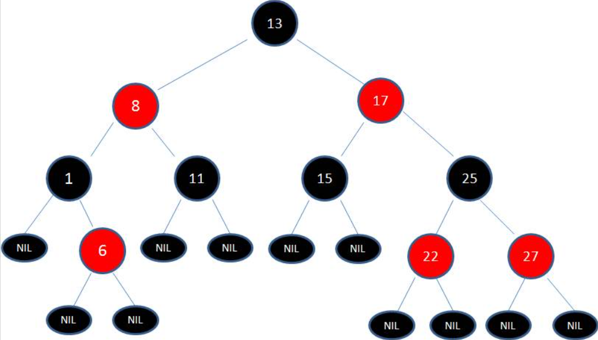
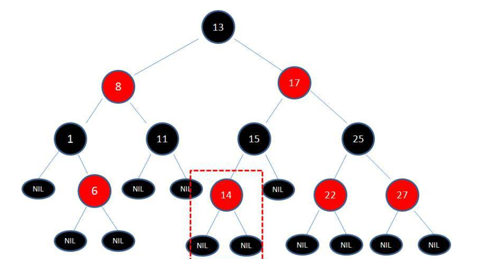
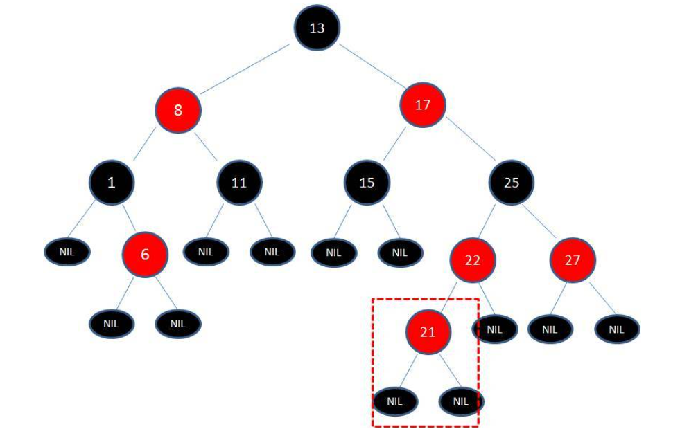
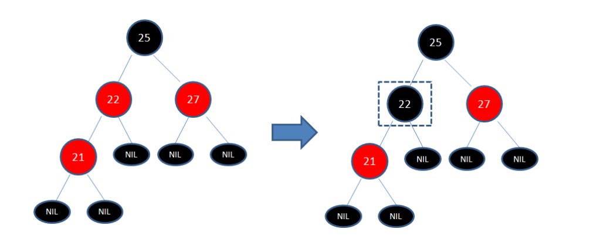
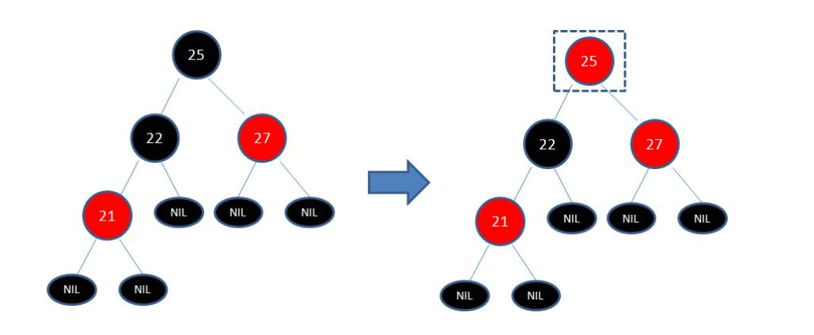
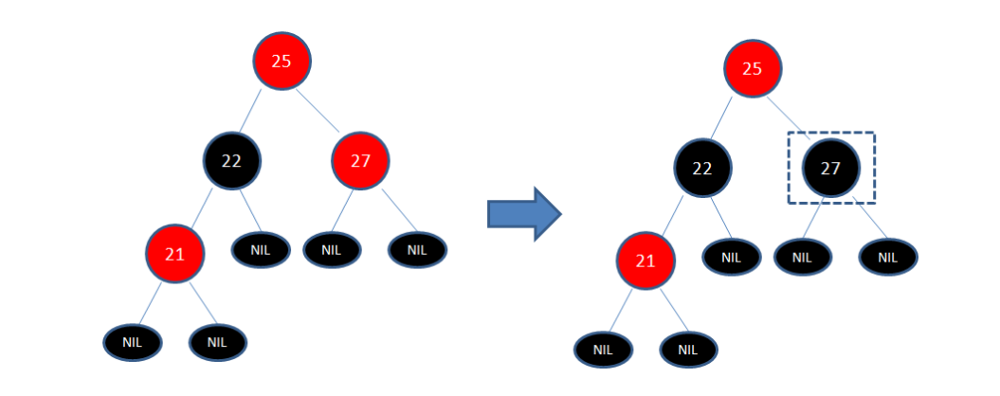
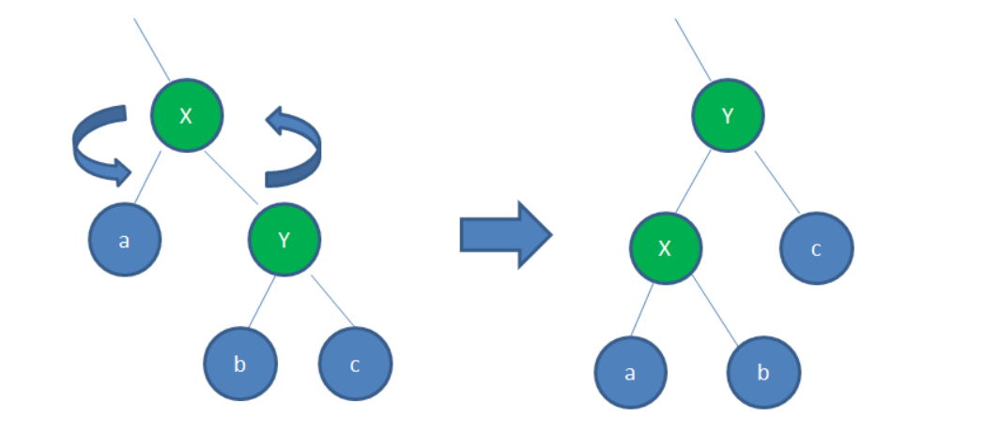
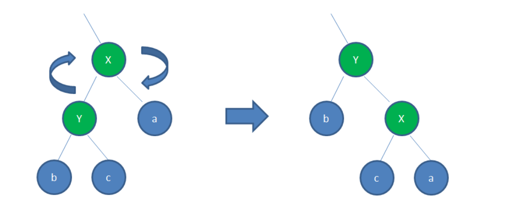

# 1、简单规则

1、节点是红色或黑色。

2、根节点是黑色。

3、每个叶子节点都是黑色的空节点（NIL节点）。

4、每个红色节点的两个子节点都是黑色。(从每个叶子到根的所有路径上不能有两个连续的红色节点)

5、从任一节点到其每个叶子的所有路径都包含相同数目的黑色节点。

6、新加入到红黑树的节点为红色节点。

# 2、应用

TreeSet,TreeMap 底层都是红黑树

HashMap 底层是红黑树

## 什么情况下会破坏红黑树的规则，什么情况下不会破坏规则呢？

1、向原红黑树插入值为14的新节点

由于父节点15是黑色节点，因此这种情况并不会破坏红黑树的规则，无需做任何调整。

2、向原红黑树插入值为21的新节点

由于父节点22是红色节点，因此这种情况打破了红黑树的规则4（每个红色节点的两个子节点都是黑色），必须进行调整，使之重新符合红黑树的规则。

## 调整有两种方式: 变色和旋转  旋转分为左旋转和右旋转

1、变色

为了重新符合红黑树的规则，尝试把红色节点变为黑色，或者把黑色节点变为红色。

下图所表示的是红黑树的一部分，需要注意节点25并非根节点。因为节点21和节点22连续出现了红色，不符合规则4，所以把节点22从红色变成黑色：

但这样并不算完，因为凭空多出的黑色节点打破了规则5，所以发生连锁反应，需要继续把节点25从黑色变成红色：

此时仍然没有结束，因为节点25和节点27又形成了两个连续的红色节点，需要继续把节点27从红色变成黑色：

2、左旋转

逆时针旋转红黑树的两个节点，使得父节点被自己的右孩子取代，而自己成为自己的左孩子。

3、右旋转

顺时针旋转红黑树的两个节点，使得父节点被自己的左孩子取代，而自己成为自己的右孩子。

