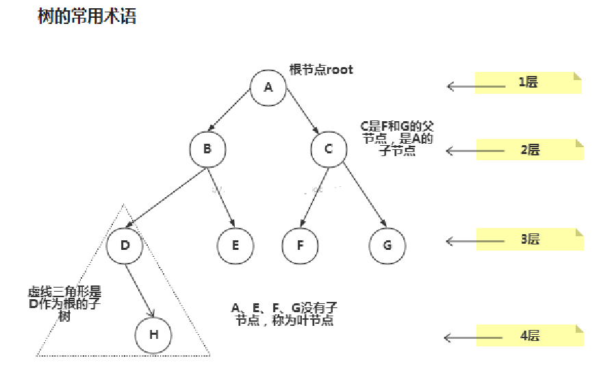
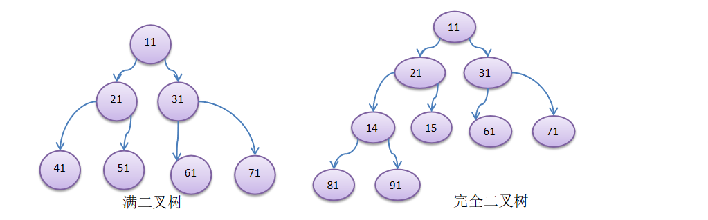
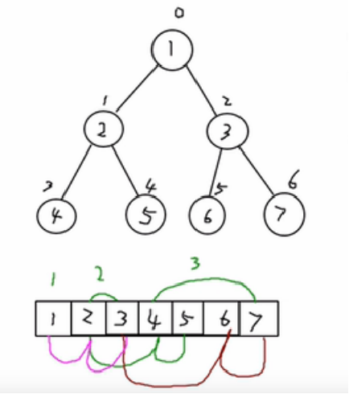
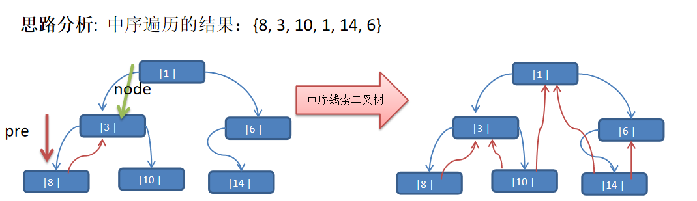
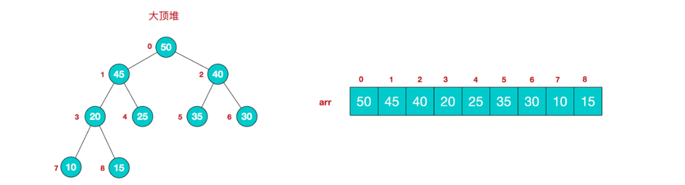

# 1、优势

- 数组 增删慢 查找快
- 链表 增删快 查找慢
- 树 来提供存储和读取效率

# 2、树相关概念



```
节点
根节点
父节点
子节点
叶子节点 (没有子节点的节点)
节点的权(节点值)
路径(从root节点找到该节点的路线)
层
子树  (D H构成的树 为A或B的子树)
树的高度(最大层数)
森林 :多颗子树构成森林
节点的度  结点拥有的子树数目
树的度  树内各结点最大的度
```

# 3、二叉树

- 树有很多种，每个节点最多只能有两个子节点的一种形式称为二叉树

- 二叉树的子节点分为左节点和右节点

- 如果该二叉树的所有叶子节点都在最后一层，并且结点总数= 2^n -1 , n 为层数，则我们称为满二叉树

- 如果该二叉树的所有叶子节点都在最后一层或者倒数第二层，而且最后一层的叶子节点在左边连续，倒数第二层的叶子节点在右边连续，我们称为完全二叉树。



# 4、遍历

1、前序遍历：先输出父节点，再遍历左子树和右子树

2、中序遍历：先遍历左子树，再输出父节点，再遍历右子树

3、后序遍历：先遍历左子树，再遍历右子树，最后输出父节点

```java
class Node {
    int id;
    String name;
    Node left;
    Node right;
    //前序遍历
    public void print(){
    System.out.println(this);
    if (this.left != null){
        this.left.print();
    }
    if (this.right != null){
        this.right.print();
    }
}
}
```

# 5、查找

```java
//前序查找
public Node findById(int id) {
    if (this.id == id){
        return this;
    }
    Node temp = null;
    if (this.left != null){
        temp = this.left.findById(id);
    }
    if (temp != null){
        return temp;
    }
    if (this.right != null){
        temp = this.right.findById(id);
    }
    return temp;
}
```

# 6、删除

1、删除后子树为空

```java
public boolean deleteById(int id) {
    boolean flag = false;
    if (this.left != null && this.left.id == id) {
        this.left = null;
        flag = true;
    }
    if (this.right != null && this.right.id == id) {
        this.right = null;
        flag = true;
    }
    if (this.left != null && !flag){
        flag = this.left.deleteById(id);
    }
    
    if (this.right != null && !flag){
        flag = this.right.deleteById(id);
    }
    return flag;
}
```

2、删除后子树不为空

```java
public void deleteByIds(int id){
    if (this.left != null && this.left.id == id){
        doDelete(this,true);
    }
    if (this.right != null && this.right.id == id){
        doDelete(this,false);
    }
    if (this.left != null){
        this.left.deleteByIds(id);
    }
    if (this.right != null){
        this.right.deleteByIds(id);
    }
}

private void doDelete(Node node, boolean isLeft) {
    if (isLeft){
        node.left.deleteLeft(null);
        node.left = node.left.left;
    }
    if (!isLeft){
        node.right.deleteRight(null);
        node.right = node.right.right;
    }
}

private void deleteRight(Node node) {
    Node left = this.left;
    if (this.right != null){
        this.left = node;
        this.right.deleteRight(left);
    }else {
        this.right = node;
    }
}

private void deleteLeft(Node node) {
    Node right = this.right;
    if (this.left != null){
        this.right = node;
        this.left.deleteLeft(right);
    }else {
        this.left = node;
    }
}
```

# 7、顺序存储二叉树

- 从数据存储来看，数组存储方式和树的存储方式可以相互转换，即数组可以转换成树，树也可以转换成数组
- 顺序二叉树通常只考虑完全二叉树
- 第n个元素的左子节点为  2 * n + 1
- 第n个元素的右子节点为  2 * n + 2
- 第n个元素的父节点为  (n-1) / 2



```java
//前序遍历
private static void arrayToTree(int[] arr) {
    arrayToTree(arr, 0);
}

private static void arrayToTree(int[] arr, int position) {
    System.out.println(arr[position]);
    if (position * 2 + 1 < arr.length) {
        arrayToTree(arr, position * 2 + 1);
    }
    if (position * 2 + 2 < arr.length) {
        arrayToTree(arr, position * 2 + 2);
    }
}
```

# 8、线索化二叉树



- n个结点的二叉链表中含有n+1  【公式 2n-(n-1)=n+1】 个空指针域。利用二叉链表中的空指针域，存放指向该结点在某种遍历次序下的前驱和后继结点的指针
- 这种加上了线索的二叉链表称为线索链表，相应的二叉树称为线索二叉树(Threaded BinaryTree)。根据线索性质的不同，线索二叉树可分为前序线索二叉树、中序线索二叉树和后序线索二叉树三种
- 一个结点的前一个结点，称为前驱结点
- 一个结点的后一个结点，称为后继结点


线索化

```java
class Node {
    int id;
    String name;
    Node left;
    Node right;
    boolean isLeftThread;
    boolean isRightThread;
}

public void thread() {
    Node root = this.root;
    thread(root);
}

private void thread(Node node) {
    if (node == null) {
        return;
    }
    //递归左边
    thread(node.left);
    //初始化最左边节点
    if (node.left == null) {
        node.left = threadLeft;
        node.isLeftThread = true;
    }
    //如果右节点为空 让前一节点指向现在的
    if (threadLeft != null && threadLeft.right == null) {
        threadLeft.right = node;
        threadLeft.isRightThread = true;
    }
    //让前面节点指向现在节点
    threadLeft = node;
    //递归右边
    thread(node.right);
}
```


遍历

```java
private void threadPrint() {
    if (root == null) {
        return;
    }
    Node node = this.root;
    while (!node.isLeftThread) {
        node = node.left;
    }
    while (node != null) {
        System.out.println(node);
        node = node.right;
    }
}
```


# 9、堆排序

- 堆是具有以下性质的完全二叉树：每个结点的值都大于或等于其左右孩子结点的值，称为大顶堆
- 每个结点的值都小于或等于其左右孩子结点的值，称为小顶堆



```java
//排序思想
//1.将待排序序列构造成一个大顶堆
//2.此时，整个序列的最大值就是堆顶的根节点
//3.将其与末尾元素进行交换，此时末尾就为最大值
//4.然后将剩余n-1个元素重新构造成一个堆，这样会得到n个元素的次小值。如此反复执行，便能得到一个有序序列了

public class HeapSort {
    public static void main(String[] args) {
        int[] arr = {6, 4, 2, 5, 6, 9};
        doHeap(arr);
        System.out.println(Arrays.toString(arr));
    }

    public static void doHeap(int[] arr) {
        //从小到大排序 构建一个大顶堆 arr.length / 2 - 1 表示第一个非叶子节点索引
        for (int i = arr.length / 2 - 1; i >= 0; i--) {
            heapSort(arr, i, arr.length);
        }
        //把第一个元素与最后一个元素交换  再进行操作
        for (int i = arr.length - 1; i > 0; i--) {
            int temp = arr[0];
            arr[0] = arr[i];
            arr[i] = temp;
            heapSort(arr, 0, i);
        }
    }

    public static void heapSort(int[] arr, int i, int length) {
        int temp = arr[i];
        for (int j = 2 * i + 1; j < length; j = 2 * j + 1) {
            if (j + 1 < length && arr[j] < arr[j + 1]) {
                j++;
            }
            if (arr[i] < arr[j]) {
                arr[i] = arr[j];
                i = j;
            } else {
                break;
            }
        }
        arr[i] = temp;
    }
}
```

# 10、赫夫曼树

- 路径和路径长度：在一棵树中，从一个结点往下可以达到的孩子或孙子结点之间的通路，称为路径。通路中分支的数目称为路径长度。若规定根结点的层数为1，则从根结点到第L层结点的路径长度为L-1
- 结点的权及带权路径长度：若将树中结点赋给一个有着某种含义的数值，则这个数值称为该结点的权。结点的带权路径长度为：从根结点到该结点之间的路径长度与该结点的权的乘积
- 树的带权路径长度：树的带权路径长度规定为所有叶子结点的带权路径长度之和，记为WPL(weighted path length) ,权值越大的结点离根结点越近的二叉树才是最优二叉树


WPL最小的就是赫夫曼树

```java
public class HuffmanTree {
    public static void main(String[] args) {
        int[] arr = {9, 23, 43, 122, 48, 21};
        List<HuffmanNode> huffmanNodes = buildHuffman(arr);
        System.out.println(huffmanNodes);
    }

    private static List<HuffmanNode>  buildHuffman(int[] arr) {
        List<HuffmanNode> nodes = new ArrayList<HuffmanNode>();
        for (int num : arr) {
            nodes.add(new HuffmanNode(num));
        }

        while (nodes.size() >= 2){
            Collections.sort(nodes);
            HuffmanNode nodeOne = nodes.get(0);
            HuffmanNode nodeTwo = nodes.get(1);
            nodes.remove(nodeOne);
            nodes.remove(nodeTwo);

            HuffmanNode headNode = new HuffmanNode(nodeOne, nodeTwo);
            nodes.add(headNode);
        }

        return nodes;
    }
}

class HuffmanNode implements Comparable<HuffmanNode> {
    int val;
    HuffmanNode left;
    HuffmanNode right;

    public HuffmanNode(int val) {
        this.val = val;
    }

    @Override
    public int compareTo(HuffmanNode o) {
        return this.val - o.val;
    }

    public HuffmanNode(HuffmanNode left, HuffmanNode right) {
        this.val = left.val + right.val;
        this.left = left;
        this.right = right;
    }

    @Override
    public String toString() {
        return "HuffmanNode{" +
                "val=" + val +
                '}';
    }
}
```


# 11、赫夫曼编码 压缩 解压

- 把byte数组转换为哈夫曼树

- 根据左节点0右节点1得到哈夫曼编码
- 将原字节数组转换为1001二进制,并根据编码重新创建新的字节数组
- 将数组和编码方式写入压缩文件中
- 根据字节数组和编码进行解码(末尾补0还未优化)

```java
public class HuffmanCode {
    public static Map<Byte, String> huffmanMap;

    //        public static void main(String[] args) {
//        String str = "i like like like java do you like a java";
//        System.out.println(Arrays.toString(str.getBytes()));
//        //获取头结点
//        List<HuffmanCodeNode> list = buildList(str.getBytes());
//        System.out.println(list);
//        //获取编码表
//        Map<Byte, String> map = buildHuffmanCode(list.get(0));
//        System.out.println(map);
//        //进行编码
//        byte[] code = encode(str.getBytes(), map);
//        System.out.println(Arrays.toString(code));
//        //进行解码
//        byte[] decode = decode(code,map);
//        System.out.println(Arrays.toString(decode));
//        System.out.println(new String(decode));
//    }
    public static byte[] encode(byte[] bytes) {
        Map<Byte, String> byteStringMap = buildHuffmanCode(buildList(bytes).get(0));
        huffmanMap = byteStringMap;
        return encode(bytes, byteStringMap);
    }

    public static byte[] decode(byte[] bytes) {
        return decode(bytes, huffmanMap);
    }

    public static void main(String[] args) throws IOException, ClassNotFoundException {
        encode("C:\\Users\\Administrator\\Desktop\\新建文本文档.txt", "C:\\Users\\Administrator\\Desktop\\mm.zip");
        decode("C:\\Users\\Administrator\\Desktop\\mm.zip", "C:\\Users\\Administrator\\Desktop\\mm.txt");
    }

    @SuppressWarnings("all")
    private static void decode(String in, String out) throws IOException, ClassNotFoundException {
        InputStream inputStream = new FileInputStream(in);
        ObjectInputStream objectInputStream = new ObjectInputStream(inputStream);
        byte[] bytes = (byte[]) objectInputStream.readObject();
        Map<Byte, String> map = (Map<Byte, String>) objectInputStream.readObject();
        byte[] decode = decode(bytes, map);
        System.out.println(decode.length);
        OutputStream outputStream = new FileOutputStream(out);
        outputStream.write(decode);
        outputStream.close();
        objectInputStream.close();
        inputStream.close();
    }

    private static void encode(String in, String out) throws IOException {
        InputStream inputStream = new FileInputStream(in);
        OutputStream outputStream = new FileOutputStream(out);
        byte[] bytes = new byte[inputStream.available()];
        System.out.println(bytes.length);
        int read = inputStream.read(bytes);

        byte[] encode = encode(bytes);
        ObjectOutputStream objectOutputStream = new ObjectOutputStream(outputStream);
        objectOutputStream.writeObject(encode);
        objectOutputStream.writeObject(huffmanMap);
        objectOutputStream.close();
        outputStream.close();
        inputStream.close();
    }

    private static byte[] decode(byte[] code, Map<Byte, String> map) {
        Map<String, Byte> stringByteHashMap = new HashMap<>();
        for (Map.Entry<Byte, String> entry : map.entrySet()) {
            stringByteHashMap.put(entry.getValue(), entry.getKey());
        }

        StringBuilder builder = new StringBuilder();
        for (int i = 0; i < code.length; i++) {
            if (i == code.length - 1) {
                String str = Integer.toBinaryString(code[i]);
                builder.append(str);
                break;
            }
            int by = 256 | code[i];
            String s = Integer.toBinaryString(by);
            builder.append(s.substring(s.length() - 8));
        }

        String str = builder.toString();

        List<Byte> byteArr = new ArrayList<>();
        //把010101 字符串转为 byte
        int left = 0;
        int right = 1;
        while (right < str.length() + 1) {
            Byte aByte = stringByteHashMap.get(str.substring(left, right));
            if (aByte != null) {
                byteArr.add(aByte);
                left = right;
            }
            right++;
        }
        System.out.println(byteArr.size());

        byte[] bytes = new byte[byteArr.size()];

        for (int i = 0; i < byteArr.size(); i++) {
            bytes[i] = byteArr.get(i);
        }

        return bytes;
    }

    private static byte[] encode(byte[] arr, Map<Byte, String> map) {
        StringBuilder builder = new StringBuilder();
        for (byte b : arr) {
            builder.append(map.get(b));
        }
        String str = builder.toString();

        List<Byte> byteArr = new ArrayList<>();
        for (int i = 0; i < str.length(); i += 8) {
            if (i + 8 > str.length()) {
                byteArr.add((byte) Integer.parseInt(str.substring(i), 2));
            } else {
                byteArr.add((byte) Integer.parseInt(str.substring(i, i + 8), 2));
            }
        }

        byte[] bytes = new byte[byteArr.size()];

        for (int i = 0; i < byteArr.size(); i++) {
            bytes[i] = byteArr.get(i);
        }

        return bytes;
    }

    private static Map<Byte, String> buildHuffmanCode(HuffmanCodeNode huffmanCodeNode) {
        if (huffmanCodeNode == null) {
            return null;
        }
        StringBuilder builder = new StringBuilder();
        HashMap<Byte, String> hashMap = new HashMap<>();
        buildHuffmanCode(huffmanCodeNode, "", builder, hashMap);
        return hashMap;
    }

    private static void buildHuffmanCode(HuffmanCodeNode huffmanCodeNode, String s, StringBuilder builder, HashMap<Byte, String> hashMap) {
        builder = new StringBuilder(builder.toString() + s);
        if (huffmanCodeNode == null) {
            return;
        }
        if (huffmanCodeNode.b == null) {
            buildHuffmanCode(huffmanCodeNode.left, "0", builder, hashMap);
            buildHuffmanCode(huffmanCodeNode.right, "1", builder, hashMap);
        } else {
            hashMap.put(huffmanCodeNode.b, builder.toString());
        }
    }

    private static List<HuffmanCodeNode> buildList(byte[] bytes) {
        List<HuffmanCodeNode> huffmanCodeNodes = new ArrayList<>();

        HashMap<Byte, Integer> byteIntegerHashMap = new HashMap<>();
        for (byte aByte : bytes) {
            byteIntegerHashMap.merge(aByte, 1, Integer::sum);
        }

        for (Map.Entry<Byte, Integer> entry : byteIntegerHashMap.entrySet()) {
            huffmanCodeNodes.add(new HuffmanCodeNode(entry.getValue(), entry.getKey()));
        }

        while (huffmanCodeNodes.size() > 1) {
            Collections.sort(huffmanCodeNodes);

            HuffmanCodeNode node1 = huffmanCodeNodes.get(0);
            HuffmanCodeNode node2 = huffmanCodeNodes.get(1);
            huffmanCodeNodes.remove(node1);
            huffmanCodeNodes.remove(node2);

            HuffmanCodeNode huffmanCodeNode = new HuffmanCodeNode(node1, node2);
            huffmanCodeNodes.add(huffmanCodeNode);
        }
        return huffmanCodeNodes;
    }
}

class HuffmanCodeNode implements Comparable<HuffmanCodeNode> {
    int val;
    Byte b;
    HuffmanCodeNode left;
    HuffmanCodeNode right;

    @Override
    public int compareTo(HuffmanCodeNode o) {
        return this.val - o.val;
    }

    public HuffmanCodeNode(int val, byte b) {
        this.val = val;
        this.b = b;
    }

    public HuffmanCodeNode(HuffmanCodeNode left, HuffmanCodeNode right) {
        this.val = left.val + right.val;
        this.left = left;
        this.right = right;
    }

    @Override
    public String toString() {
        return "HuffmanCodeNode{" +
                "val=" + val +
                ", b=" + b +
                '}';
    }
}
```


# 12、二叉搜索树

BST: (Binary Sort(Search) Tree), 对于二叉排序树的任何一个非叶子节点，要求左子节点的值比当前节点的值小，右子节点的值比当前节点的值大

```java
public class BinarySearchTree {
    static BinarySearchNode root;

    public static void main(String[] args) {
        int[] arr = {7, 3, 10, 12, 5, 1, 9, 8, 13};
        for (int i = 0; i < arr.length; i++) {
            if (i == 0) {
                root = new BinarySearchNode(arr[i]);
            } else {
                root.add(new BinarySearchNode(arr[i]));
            }
        }

        delete(7);
        root.list();
    }

    public static void delete(int value) {
        if (root.val == value) {
            if (root.isTwoSideNode()) {
                root.deleteTwoSideNode(root);
            } else if (root.isOneSideNode()) {
                root = root.left == null ? root.right : root.left;
            } else {
                root = null;
            }
        } else {
            root.delete(value);
        }
    }
}

class BinarySearchNode {
    int val;
    BinarySearchNode left;
    BinarySearchNode right;

    public void add(BinarySearchNode node) {
        if (node == null) {
            return;
        }
        //如果大 右边
        if (node.val > this.val) {
            if (this.right == null) {
                this.right = node;
            } else {
                this.right.add(node);
            }
        } else {
            if (this.left == null) {
                this.left = node;
            } else {
                this.left.add(node);
            }
        }
    }

    public boolean delete(int value) {
        boolean left = false;
        boolean right = false;
        if (value == this.val) {
            return true;
        }
        if (value > this.val && this.right != null) {
            right = this.right.delete(value);
        }
        if (value < this.val && this.left != null) {
            left = this.left.delete(value);
        }

        BinarySearchNode node;
        node = left ? this.left : right ? this.right : null;
        if (node == null) {
            return false;
        }
        //删除的是不是叶子节点
        if (node.isSingleNode()) {
            if (right) {
                this.right = null;
            } else {
                this.left = null;
            }
            return false;
        }
        //删除的是不是只有一个子节点
        if (node.isOneSideNode()) {
            if (right) {
                this.right = this.right.left == null ? this.right.right : this.right.left;
            } else {
                this.left = this.left.left == null ? this.left.right : this.left.left;
            }
            return false;
        }
        //删除的是不是含有两个节点
        if (node.isTwoSideNode()) {
            deleteTwoSideNode(node);
        }
        return false;
    }

    public void deleteTwoSideNode(BinarySearchNode node) {
        //从左子树中找到最大的  或  从右子树找到最小的
        BinarySearchNode leftNode = node.left;
        BinarySearchNode biggestPre = leftNode.getBiggestPre();
        if (biggestPre == null) {
            node.val = leftNode.val;
            node.left = node.left.left;
        } else {
            node.val = biggestPre.right.val;
            biggestPre.right = null;
        }
    }

    public BinarySearchNode getBiggestPre() {
        BinarySearchNode biggest = null;
        if (this.right == null) {
            return null;
        }
        if (this.right.right != null) {
            biggest = this.right.getBiggestPre();
        }
        if (this.right.right == null) {
            return this;
        }
        return biggest;
    }

    public boolean isSingleNode() {
        return this.left == null && this.right == null;
    }

    public boolean isOneSideNode() {
        return (this.left == null && this.right != null) || (this.right == null && this.left != null);
    }

    public boolean isTwoSideNode() {
        return this.left != null && this.right != null;
    }

    public void list() {
        if (this.left != null) {
            this.left.list();
        }
        System.out.println(this);
        if (this.right != null) {
            this.right.list();
        }
    }

    @Override
    public String toString() {
        return "BinarySearchNode{" +
                "val=" + val +
                '}';
    }

    public BinarySearchNode(int val) {
        this.val = val;
    }
}
```


# 13、二叉平衡树AVL树

- 它是一棵空树或它的左右两个子树的高度差的绝对值不超过1，并且左右两个子树都是一棵平衡二叉树
- 平衡二叉树的常用实现方法有红黑树、AVL、替罪羊树、Treap、伸展树等


左旋转

```java
//以{4, 3, 6, 5, 7, 8}数组为例
//在插入8 之后发现左右树的高度差大于1 进行左旋
//新建一个首节点4 4左指向3 4右指向原右节点的左节点
//再把原右节点的值赋给原节点 删除原右节点 原节点指向新建的4节点

//获取左右树的高度差
private static int leftRightDiff(AvlNode root) {
    if (root == null) {
        return 0;
    }
    return Math.abs(getDeep(root.left) - getDeep(root.right));
}

private static int getDeep(AvlNode root) {
    if (root == null) {
        return 0;
    }
    return Math.max(getDeep(root.left), getDeep(root.right)) + 1;
}
//左旋
private static void turnLeft() {
    //新建节点 值为根节点的值
    AvlNode avlNode = new AvlNode(root.val);
    //新建节点的左节点指向根节点的左节点
    avlNode.left = root.left;
    //新建节点的右节点指向原root节点的右节点的左节点
    avlNode.right = root.right.left;
    //把原root节点的右节点的值赋值给root
    root.val = root.right.val;
    //原root节点的右节点指向原root节点的右节点的右节点
    root.right = root.right.right;
    //root节点的左节点指向新建节点
    root.left = avlNode;
}
```


右旋转

```java
private static void turnRight() {
    //新建节点 值为根节点的值
    AvlNode avlNode = new AvlNode(root.val);
    //新节点的左节点指向原root节点的左节点的右节点
    avlNode.left = root.left.right;
    //新节点的右节点指向原root的右节点
    avlNode.right = root.right;
    //把root左节点的值赋值给root
    root.val = root.left.val;
    //把root的左节点指向左节点的左节点
    root.left = root.left.left;
    //把原root节点的右节点指向新建节点
    root.right = avlNode;
}
```


双旋转

```java
//有可能会遇到旋转后还是不平衡的
//如{10,11,7,6,8,9}  {2,1,6,5,7,3}

//左旋
if (leftRightDiff(root) > 1) {
    //左旋前判断右节点的左侧深度是不是大于右侧深度 如果是的话进行右旋
    if (root.right != null && leftRightDiff(root.right) < 0) {
        root.right.turnRight();
    }
    root.turnLeft();
}
//右旋
if (leftRightDiff(root) < -1) {
    //判断左节点的高度差是否大于一
    if (root.left != null && leftRightDiff(root.left) > 0) {
        root.left.turnLeft();
    }
    root.turnRight();
}
```

