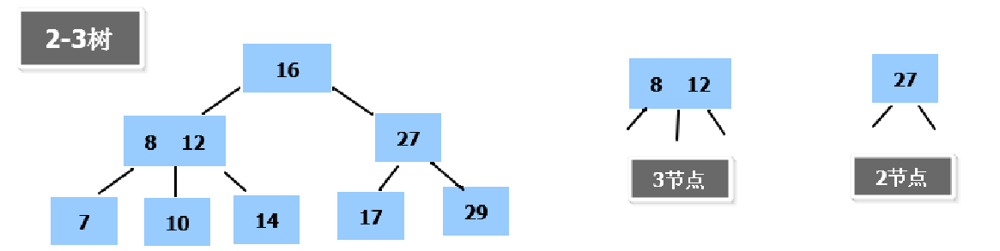
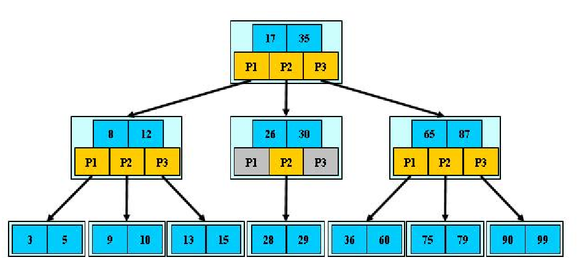
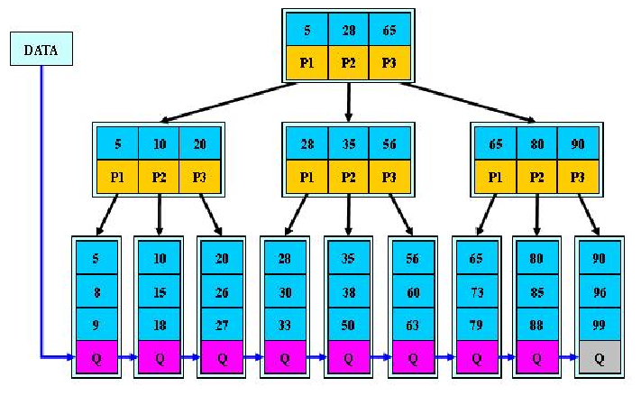
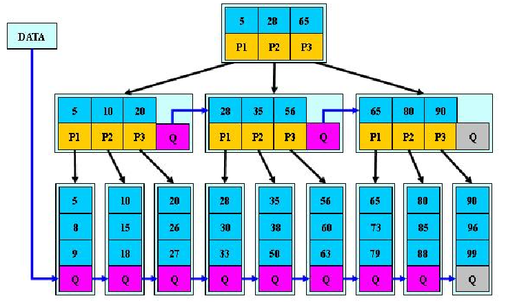

# 1、二叉树的问题分析

- 在构建二叉树时，需要多次进行i/o操作(海量数据存在数据库或文件中)，节点海量，构建二叉树时，速度有影响
- 节点海量，也会造成二叉树的高度很大，会降低操作速度

# 2、多叉树

- 在二叉树中，每个节点有数据项，最多有两个子节点。如果允许每个节点可以有更多的数据项和更多的子节点，就是多叉树（multiway tree）

# 3、2-3树

- 2-3树的所有叶子节点都在同一层.(只要是B树都满足这个条件)
- 有两个子节点的节点叫二节点，二节点要么没有子节点，要么有两个子节点
- 有三个子节点的节点叫三节点，三节点要么没有子节点，要么有三个子节点

# 4、B树

- B树通过重新组织节点，降低树的高度，并且减少i/o读写次数来提升效率。

- 文件系统及数据库系统的设计者利用了磁盘预读原理，将一个节点的大小设为等于一个页(页得大小通常为4k)，这样每个节点只需要一次I/O就可以完全载入

- 将树的度M设置为1024，在600亿个元素中最多只需要4次I/O操作就可以读取到想要的元素, B树(B+)广泛应用于文件存储系统以及数据库系统中

- 说明

  B树的阶：节点的最多子节点个数。比如2-3树的阶是3，2-3-4树的阶是4。

  B-树的搜索，从根结点开始，对结点内的关键字（有序）序列进行二分查找，如果命中则结束，否则进入查询关键字所属范围的儿子结点；重复，直到所对应的儿子指针为空，或已经是叶子结点。

  关键字集合分布在整颗树中, 即叶子节点和非叶子节点都存放数据。

  搜索有可能在非叶子结点结束。

  其搜索性能等价于在关键字全集内做一次二分查找。

# 5、B+树

- 说明

  B+树的搜索与B树也基本相同，区别是B+树只有达到叶子结点才命中（B树可以在非叶子结点命中），其性能也等价于在关键字全集做一次二分查找。

  所有关键字都出现在叶子结点的链表中（即数据只能在叶子节点【也叫稠密索引】），且链表中的关键字(数据)恰好是有序的。

  不可能在非叶子结点命中

  非叶子结点相当于是叶子结点的索引（稀疏索引），叶子结点相当于是存储（关键字）数据的数据层

  更适合文件索引系统

# 6、B*树

B*树是B+树的变体，在B+树的非根和非叶子结点再增加指向兄弟的指针。
- 说明

  B*树定义了非叶子结点关键字个数至少为(2/3)*M，即块的最低使用率为2/3，而B+树的块的最低使用率为B+树的1/2。

  从第1个特点我们可以看出，B*树分配新结点的概率比B+树要低，空间使用率更高