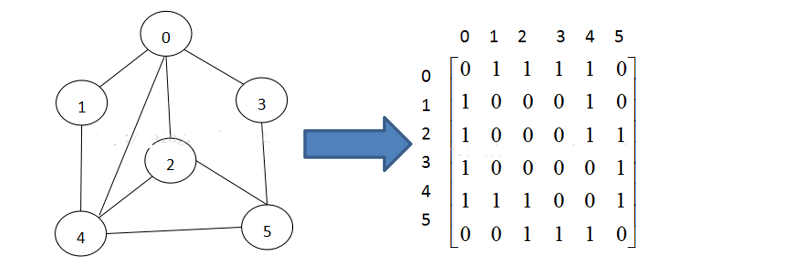
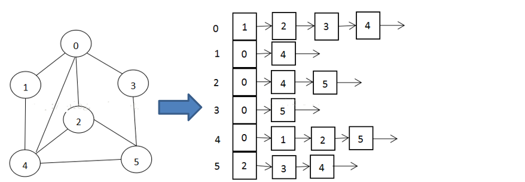
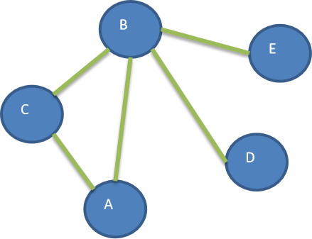

# 1、 简介

- 图是一种数据结构，其中结点可以具有零个或多个相邻元素。两个结点之间的连接称为边。 结点也可以称为顶点


# 2、常用概念

- 顶点(vertex)
- 边(edge)
- 路径
- 无向图(顶点之间连接没有方向)
- 有向图(顶点之间连接有方向)
- 带权图(边带有权值的图) 


# 3、表达方式

二维数组(邻接矩阵)



链表(邻接表 数组+链表实现)




# 4、深度优先遍历DFS

深度优先遍历，从初始访问结点出发，初始访问结点可能有多个邻接结点，深度优先遍历的策略就是首先访问第一个邻接结点，然后再以这个被访问的邻接结点作为初始结点，访问它的第一个邻接结点， 可以这样理解：每次都在访问完当前结点后首先访问当前结点的第一个邻接结点。

这样的访问策略是优先往纵向挖掘深入，而不是对一个结点的所有邻接结点进行横向访问。

- 遍历步骤

  1、访问初始结点v，并标记结点v为已访问。

  2、查找结点v的第一个邻接结点w。

  3、若w存在，则继续执行4，如果w不存在，则回到第1步，将从v的下一个结点继续。

  4、若w未被访问，对w进行深度优先遍历递归（即把w当做另一个v，然后进行步骤123）。

  5、查找结点v的w邻接结点的下一个邻接结点，转到步骤3。



```java
public class Matrix {
    int[][] matrix;
    List<String> topList;

    public static void main(String[] args) {
        String[] arr = {"a", "b", "c", "d", "e"};
        Matrix matrix = new Matrix(arr);
        matrix.put("a", "b", 1);
        matrix.put("a", "c", 1);
        matrix.put("c", "b", 1);
        matrix.put("b", "d", 1);
        matrix.put("b", "e", 1);
        for (int[] ints : matrix.matrix) {
            System.out.println(Arrays.toString(ints));
        }
//        matrix.search("a", "d");
        matrix.printDfs();
    }

    /**
     * DFS
     */
    public void printDfs() {
        Boolean[] boolArr = new Boolean[matrix.length];
        Arrays.fill(boolArr, false);
        printDfs(1, boolArr);
    }

    private void printDfs(int index, Boolean[] boolArr) {
        boolean allMatch = Stream.of(boolArr).allMatch(aBoolean -> aBoolean);
        int[] ints = this.matrix[index];
        if (allMatch) {
            return;
        }
        System.out.print(topList.get(index));
        boolArr[index] = true;
        for (int i = 0; i < ints.length; i++) {
            if (i == index) {
                continue;
            }
            if (ints[i] == 1 && !boolArr[i]) {
                printDfs(i, boolArr);
            }
        }
    }

    public void search(String a, String b) {
        int i1 = topList.indexOf(a);
        int i2 = topList.indexOf(b);
        if (i1 == -1 || i2 == -1) {
            throw new RuntimeException("");
        }
        List<Integer> list = new ArrayList<>();
        search(i1, i2, list);
    }

    private void search(int i1, int i2, List<Integer> list) {
        if (i1 == i2) {
            list.add(i1);
            System.out.println(list);
            return;
        }
        int[] arr = this.matrix[i1];
        for (int i = 0; i < arr.length; i++) {
            if (i == i1 || list.contains(i)) {
                continue;
            }
            if (arr[i] == 1) {
                List<Integer> integerList = new ArrayList<>(list);
                integerList.add(i1);
                search(i, i2, integerList);
            }
        }
    }

    public void put(String one, String two, int status) {
        int indexOne = topList.indexOf(one);
        int indexTwo = topList.indexOf(two);
        if (indexOne == -1 || indexTwo == -1) {
            throw new RuntimeException("含有不存在的节点");
        }
        matrix[indexOne][indexTwo] = status;
        matrix[indexTwo][indexOne] = status;
    }

    public Matrix(String[] arr) {
        this.matrix = new int[arr.length][arr.length];
        this.topList = Stream.of(arr).collect(Collectors.toList());
    }
}
```


# 5、广度优先遍历BFS

类似于一个分层搜索的过程，广度优先遍历需要使用一个队列以保持访问过的结点的顺序，以便按这个顺序来访问这些结点的邻接结点


- 遍历步骤

  1、访问初始结点v并标记结点v为已访问。

  2、结点v入队列。

  3、当队列非空时，继续执行，否则算法结束。

  4、出队列，取得队头结点u。

  5、查找结点u的第一个邻接结点w。

  6、若结点u的邻接结点w不存在，则转到步骤3；否则循环执行以下三个步骤：

  - 若结点w尚未被访问，则访问结点w并标记为已访问。 
  - 结点w入队列。
  - 查找结点u的继w邻接结点后的下一个邻接结点w，转到步骤6。


```java
/**
 * BFS
 */
public void printBfs() {
    Boolean[] boolArr = new Boolean[matrix.length];
    Arrays.fill(boolArr, false);
    //一个队列  也可以用LinkedList实现 removeFirst
    QueuePlus queuePlus = new QueuePlus(matrix.length + 1);
    printBfs(boolArr, queuePlus);
}

private void printBfs(Boolean[] boolArr, QueuePlus queuePlus) {
    boolArr[0] = true;
    queuePlus.add(0);
    if (queuePlus.isEmpty()) {
        return;
    }
    int num;
    while ((num = queuePlus.get()) != -1) {
        System.out.println(topList.get(num));
        int find = findFirst(num, boolArr);
        while (find != -1) {
            boolArr[find] = true;
            queuePlus.add(find);
            find = findFirst(num, boolArr);
        }
    }
}

private int findFirst(int num, Boolean[] boolArr) {
    int[] ints = this.matrix[num];
    for (int i = 0; i < ints.length; i++) {
        if (this.matrix[num][i] == 1 && !boolArr[i]) {
            return i;
        }
    }
    return -1;
}
```


# 6、一个节点到另一个节点方式

```java
public class Dijkstra {
    int[][] arr;

    @Test
    public void test() {
        arr =
                new int[][]{{0, 1, 1, 1, 0},
                        {1, 0, 1, 0, 1},
                        {1, 1, 0, 1, 0},
                        {1, 0, 1, 0, 1},
                        {0, 1, 0, 1, 0}};
        List<Integer> list = new ArrayList<>();
        list.add(0);
        search(0, 4, list);
    }

    private void search(int x, int y, List<Integer> list) {
        if (x == y) {
            System.out.println(new ArrayList<>(list));
        }

        for (int i = 0; i < arr[x].length; i++) {
            if (i != x && arr[x][i] == 1 && !list.contains(i)) {
                list.add(i);
                search(i, y, list);
                list.remove(list.size() - 1);
            }
        }
    }
}
```

