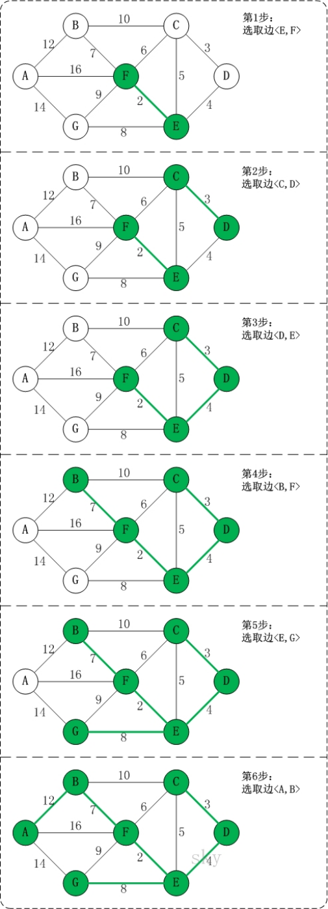
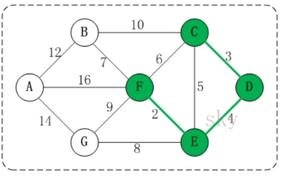

# 1、算法介绍

- 克鲁斯卡尔(Kruskal)算法，是用来求加权连通图的最小生成树的算法。
- 基本思想：按照权值从小到大的顺序选择n-1条边，并保证这n-1条边不构成回路
- 具体做法：首先构造一个只含n个顶点的森林，然后依权值从小到大从连通网中选择边加入到森林中，并使森林中不产生回路，直至森林变成一棵树为止


# 2、图解



- 问题一 对图的所有边按照权值大小进行排序。

  采用排序算法进行排序即可。

- 问题二 将边添加到最小生成树中时，怎么样判断是否形成了回路。

  记录顶点在"最小生成树"中的终点，顶点的终点是"在最小生成树中与它连通的最大顶点"。然后每次需要将一条边添加到最小生存树时，判断该边的两个顶点的终点是否重合，重合的话则会构成回路。


# 3、构成回路分析



C的终点是F。

D的终点是F。

E的终点是F。

F的终点是F。


**实现方法**

将所有顶点按照从小到大的顺序排列好之后；某个顶点的终点就是"与它连通的最大顶点"。 

虽然<C,E>是权值最小的边。但是C和E的终点都是F，即它们的终点相同，因此，将<C,E>加入最小生成树的话，会形成回路。这就是判断回路的方式。也就是说，我们加入的边的两个顶点不能都指向同一个终点，否则将构成回路。


# 4、代码实现

```java
public class Kruskal {
    int count = 7;
    int[][] arr = new int[count][count];
    char[] letter = {'A', 'B', 'C', 'D', 'E', 'F', 'G'};
    List<Edge> edgeList = new ArrayList<>();
    int defaultVal = 999;
    //各个数字的顶点
    int[] ends = new int[count];

    @Test
    public void test() {
        kruskal();
    }

    private void kruskal() {
        init();
        initEdgeList();
        int num = 0;
        for (Edge edge : edgeList) {
            int endX = getEnd(getIndex(edge.x));
            int endY = getEnd(getIndex(edge.y));
            if (endX == endY) {
                continue;
            }
            if (endX < endY) {
                ends[getIndex(edge.x)] = endY;
            } else {
                ends[getIndex(edge.y)] = endX;
            }
            System.out.println(edge.x + "->" + edge.y + ": " + edge.weight);
            num++;
            if (num == count){
                break;
            }
        }
    }

    private void initEdgeList() {
        for (int i = 0; i < arr.length; i++) {
            for (int j = i + 1; j < arr.length; j++) {
                if (arr[i][j] != defaultVal) {
                    edgeList.add(new Edge(getChar(i), getChar(j), arr[i][j]));
                }
            }
        }
        edgeList = edgeList.stream().sorted(Comparator.comparing(Edge::getWeight)).collect(Collectors.toList());
    }


    public void init() {
        for (int i = 0; i < arr.length; i++) {
            for (int j = 0; j < arr.length; j++) {
                arr[i][j] = defaultVal;
            }
        }
        putValue('A', 'B', 5);
        putValue('A', 'C', 7);
        putValue('A', 'G', 2);
        putValue('B', 'D', 9);
        putValue('B', 'G', 3);
        putValue('C', 'E', 8);
        putValue('D', 'F', 4);
        putValue('E', 'F', 5);
        putValue('G', 'E', 4);
        putValue('G', 'F', 6);
    }

    private void putValue(char a, char b, int i) {
        int i1 = getIndex(a);
        int i2 = getIndex(b);
        arr[i1][i2] = i;
        arr[i2][i1] = i;
    }

    public char getChar(int index) {
        return letter[index];
    }

    public int getEnd(int index) {
        while (ends[index] != 0) {
            index = ends[index];
        }
        return index;
    }

    public int getIndex(char c) {
        for (int i = 0; i < letter.length; i++) {
            if (c == letter[i]) {
                return i;
            }
        }
        throw new RuntimeException();
    }
}

@Data
class Edge {
    char x;
    char y;
    int weight;

    public Edge(char x, char y, int weight) {
        this.x = x;
        this.y = y;
        this.weight = weight;
    }
}
```

