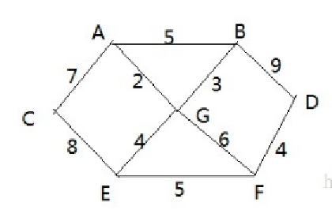
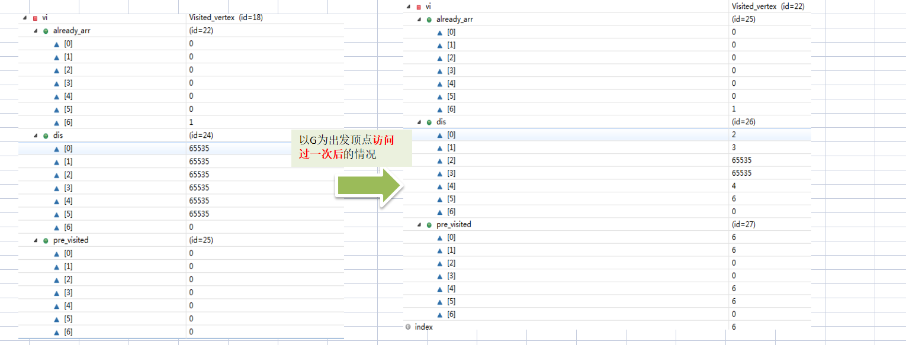

# 1、算法介绍

迪杰斯特拉(Dijkstra)算法是典型最短路径算法，用于计算一个结点到其他结点的最短路径。 它的主要特点是以起始点为中心向外层层扩展(广度优先搜索思想)，直到扩展到终点为止。


# 2、应用场景

最短路径问题



战争时期，胜利乡有7个村庄(A, B, C, D, E, F, G) ，现在有六个邮差，从G点出发，需要分别把邮件分别送到 A, B, C , D, E, F 六个村庄

各个村庄的距离用边线表示(权) ，比如 A – B 距离 5公里

问：如何计算出G村庄到 其它各个村庄的最短距离?


# 3、算法过程

设置出发顶点为v，顶点集合V{v1,v2,vi...}，v到V中各顶点的距离构成距离集合Dis，Dis{d1,d2,di...}，Dis集合记录着v到图中各顶点的距离(到自身可以看作0，v到vi距离对应为di)

- 从Dis中选择值最小的di并移出Dis集合，同时移出V集合中对应的顶点vi，此时的v到vi即为最短路径
- 更新Dis集合，更新规则为：比较v到V集合中顶点的距离值，与v通过vi到V集合中顶点的距离值，保留值较小的一个(同时也应该更新顶点的前驱节点为vi，表明是通过vi到达的)
- 重复执行两步骤，直到最短路径顶点为目标顶点即可结束


# 4、代码实现



```java
public class Dijkstra {
    int count = 7;
    int[][] arr = new int[count][count];
    int[] visited = new int[count];
    //前驱节点
    String[] pre = new String[count];
    //选择节点到该节点距离
    int[] dis = new int[count];
    char[] letter = {'A', 'B', 'C', 'D', 'E', 'F', 'G'};
    int defaultNum = 999;


    @Test
    public void test() {
        int startIndex = getIndex('G');
        dijkstra(startIndex);
    }

    private void dijkstra(int startIndex) {
        init(startIndex);
        update(startIndex);

        System.out.println(Arrays.toString(visited));
        System.out.println(Arrays.toString(pre));
        System.out.println(Arrays.toString(dis));
    }

    private void update(int startIndex) {
        for (int i = 0; i < arr[startIndex].length; i++) {
            //假定现在为 A  G->A + A->C < 其他路径距离
            if (arr[startIndex][i] != defaultNum && dis[startIndex] + arr[startIndex][i] < dis[i]) {
                dis[i] = dis[startIndex] + arr[startIndex][i];
                pre[i] = pre[startIndex] + "->" +getChar(i);
            }
        }
        for (int i = 0; i < visited.length; i++) {
            if (visited[i] == 0) {
                visited[i] = 1;
                update(i);
            }
        }
    }

    public void init(int startIndex) {
        for (int i = 0; i < arr.length; i++) {
            for (int j = 0; j < arr.length; j++) {
                arr[i][j] = defaultNum;
            }
        }
        Arrays.fill(dis, defaultNum);
        Arrays.fill(pre, getChar(startIndex) + "");
        dis[startIndex] = 0;
        visited[startIndex] = 1;
        putValue('A', 'B', 5);
        putValue('A', 'C', 7);
        putValue('A', 'G', 2);
        putValue('B', 'D', 9);
        putValue('B', 'G', 3);
        putValue('C', 'E', 8);
        putValue('D', 'F', 4);
        putValue('E', 'F', 5);
        putValue('G', 'E', 4);
        putValue('G', 'F', 6);
    }

    private void putValue(char a, char b, int i) {
        int i1 = getIndex(a);
        int i2 = getIndex(b);
        arr[i1][i2] = i;
        arr[i2][i1] = i;
    }

    public int getIndex(char c) {
        for (int i = 0; i < letter.length; i++) {
            if (c == letter[i]) {
                return i;
            }
        }
        throw new RuntimeException();
    }

    public char getChar(int index){
        return letter[index];
    }
}
```

