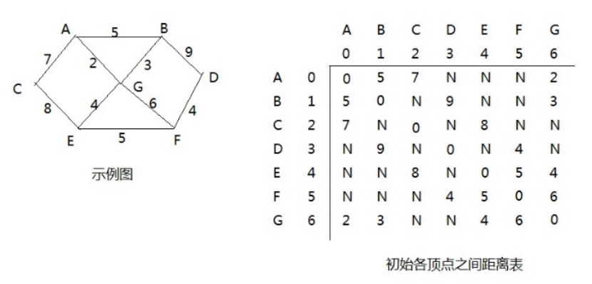
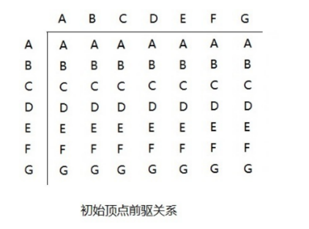
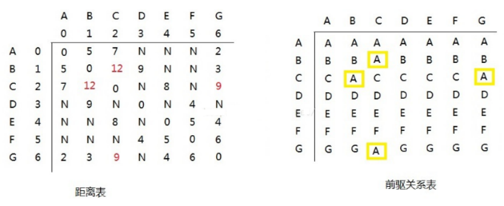

# 1、算法介绍

- 和Dijkstra算法一样，弗洛伊德(Floyd)算法也是一种用于寻找给定的加权图中顶点间最短路径的算法。该算法名称以创始人之一、1978年图灵奖获得者、斯坦福大学计算机科学系教授罗伯特·弗洛伊德命名
- 弗洛伊德算法(Floyd)计算图中各个顶点之间的最短路径
- 迪杰斯特拉算法用于计算图中某一个顶点到其他顶点的最短路径。
- 弗洛伊德算法 VS 迪杰斯特拉算法：迪杰斯特拉算法通过选定的被访问顶点，求出从出发访问顶点到其他顶点的最短路径；弗洛伊德算法中每一个顶点都是出发访问点，所以需要将每一个顶点看做被访问顶点，求出从每一个顶点到其他顶点的最短路径。


# 2、算法过程

- 设置顶点vi到顶点vk的最短路径已知为Lik，顶点vk到vj的最短路径已知为Lkj，顶点vi到vj的路径为Lij，则vi到vj的最短路径为：min((Lik+Lkj),Lij)，vk的取值为图中所有顶点，则可获得vi到vj的最短路径
- 至于vi到vk的最短路径Lik或者vk到vj的最短路径Lkj，是以同样的方式获得








第一轮循环中，以A(下标为：0)作为中间顶点，距离表和前驱关系更新为：





# 3、代码实现

```java
public class Floyd {
    int count = 7;
    int[][] arr = new int[count][count];
    String[][] pre = new String[count][count];
    char[] letter = {'A', 'B', 'C', 'D', 'E', 'F', 'G'};
    int defaultNum = 999;

    @Test
    public void test() {
        init();
        floyd();
        for (int[] ints : arr) {
            System.out.println(Arrays.toString(ints));
        }
        for (String[] ints : pre) {
            System.out.println(Arrays.toString(ints));
        }
    }

    private void floyd() {
        for (int i = 0; i < arr.length; i++) {
            for (int j = 0; j < arr[i].length; j++) {
                if (i == j || arr[i][j] == defaultNum) {
                    continue;
                }
                for (int k = j + 1; k < arr[i].length; k++) {
                    if (arr[i][k] == defaultNum) {
                        continue;
                    }
                    int temp = arr[i][j] + arr[i][k];
                    String tempStr = !Objects.equals(pre[i][j], pre[i][k]) ? pre[i][j] + pre[i][k] : pre[i][j];
                    if (arr[j][k] > temp) {
                        arr[j][k] = temp;
                        pre[j][k] = tempStr;
                    }
                    if (arr[k][j] > temp) {
                        arr[k][j] = temp;
                        pre[k][j] = tempStr;
                    }
                }
            }
        }
    }

    public void init() {
        for (int i = 0; i < arr.length; i++) {
            for (int j = 0; j < arr.length; j++) {
                arr[i][j] = defaultNum;
            }
        }
        for (int i = 0; i < pre.length; i++) {
            String temp = letter[i] + "";
            Arrays.fill(pre[i], temp);
        }
        putValue('A', 'B', 5);
        putValue('A', 'C', 7);
        putValue('A', 'G', 2);
        putValue('B', 'D', 9);
        putValue('B', 'G', 3);
        putValue('C', 'E', 8);
        putValue('D', 'F', 4);
        putValue('E', 'F', 5);
        putValue('G', 'E', 4);
        putValue('G', 'F', 6);
    }

    private void putValue(char a, char b, int i) {
        int i1 = getIndex(a);
        int i2 = getIndex(b);
        arr[i1][i2] = i;
        arr[i2][i1] = i;
    }

    public int getIndex(char c) {
        for (int i = 0; i < letter.length; i++) {
            if (c == letter[i]) {
                return i;
            }
        }
        throw new RuntimeException();
    }
}
```

