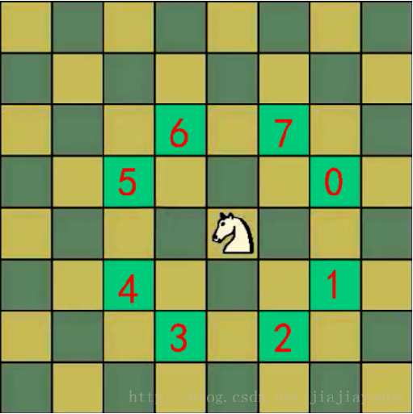

# 1、介绍



将马随机放在国际象棋的8×8棋盘Board[0～7][0～7]的某个方格中，马按走棋规则(马走日字)进行移动。要求每个方格只进入一次，走遍棋盘上全部64个方格


# 2、代码实现

```java
public class HorseStepBoard {

    private static final int row = 8;
    private static final int col = 8;
    private static final int[][] chessboard = new int[row][col];  // 棋盘
    private static final int[][] visited = new int[row][col];    // 标识某个点是否已经被访问。0-未访问，1-已访问
    private static boolean finished = false;    // 标识是否全部走完

    public static void main(String[] args) {

        traversalChessboard(4,4,1);

        for (int[] item : chessboard){
            System.out.println(Arrays.toString(item));
        }
    }

    /**
     * 从 (x,y) 开始执行马踏棋盘算法
     * @param x 当前点的行坐标
     * @param y 当前点的列坐标
     * @param step 当前的步数
     */
    public static void traversalChessboard(int x, int y, int step){

        chessboard[x][y] = step;    // 记录当前点为第几步到达的
        visited[x][y] = 1; // 标记当前点已经被访问

        ArrayList<Point> nextPoints = next(new Point(x, y));    // 获取当前点的下一步移动可选项集合
        //使用贪心算法进行优化
        sort(nextPoints);   // 将下一步移动的可选项集合按照它们的再下一步的可选项个数升序排序，此处体现了贪心

        /* 只要下一步可移动的选项个数大于 0，就继续往下走 */
        while (nextPoints.size() > 0){
            Point nextPoint = nextPoints.remove(0); // 排序后，移动到的下一个点的下一步的可选项个数时最小的
            if (visited[nextPoint.x][nextPoint.y] == 0){
                traversalChessboard(nextPoint.x, nextPoint.y, step+1);
            }
        }

        /*
            因为中途可能会走错，所以会有一个回溯的过程
        */
        if (step < row*col && !finished){   // 如果还未走完
            chessboard[x][y] = 0;   // 回溯时，要把走错的棋盘坐标置 0
            visited[x][y] = 0;  // 访问标志置为 0
        }else{
            finished = true;    // 如果步数达到了最大步数，说明走完了，就把标志位置为 true
        }
    }


    /**
     * 获取当前点下一步可以走的点的集合
     * @param curPoint  当前点
     */
    public static ArrayList<Point> next(Point curPoint){
        ArrayList<Point> points = new ArrayList<>();    // 当前点下一步可选的点集合
        Point point = new Point();

        /* 针对 8 种情况的判断 */
        if ((point.x=curPoint.x-2)>=0 && (point.y=curPoint.y-1)>=0){    // 左 2 上 1
            points.add(new Point(point));
        }
        if ((point.x=curPoint.x-1)>=0 && (point.y=curPoint.y-2)>=0){    // 左 1 上 2
            points.add(new Point(point));
        }
        if ((point.x=curPoint.x+1)<col && (point.y=curPoint.y-2)>=0){   // 右 1 上 2
            points.add(new Point(point));
        }
        if ((point.x=curPoint.x+2)<col && (point.y=curPoint.y-1)>=0){
            points.add(new Point(point));
        }
        if ((point.x=curPoint.x-2)>=0 && (point.y=curPoint.y+1)<row){
            points.add(new Point(point));
        }
        if ((point.x=curPoint.x-1)>=0 && (point.y=curPoint.y+2)<row){
            points.add(new Point(point));
        }
        if ((point.x=curPoint.x+1)<col && (point.y=curPoint.y+2)<row){
            points.add(new Point(point));
        }
        if ((point.x=curPoint.x+2)<col && (point.y=curPoint.y+1)<row){
            points.add(new Point(point));
        }
        return points;
    }

    /**
     * 将集合中的 Point 对象根据其下一步可移动选项的个数升序排序
     * @param points Point 对象集合
     */
    public static void sort(ArrayList<Point> points){
        points.sort(new Comparator<Point>() {
            @Override
            public int compare(Point o1, Point o2) {
                return next(o1).size() - next(o2).size();
            }
        });
    }
}
```

