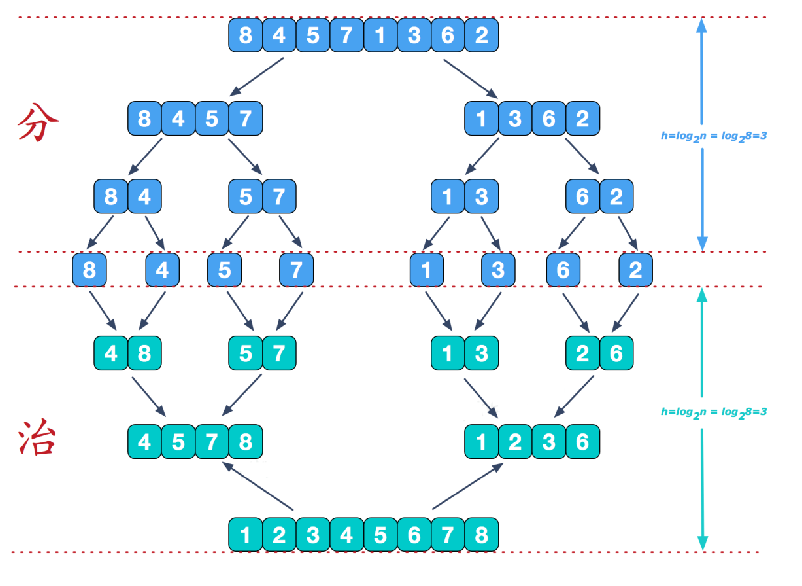
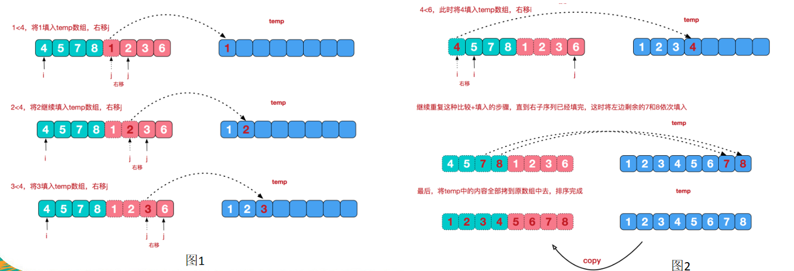
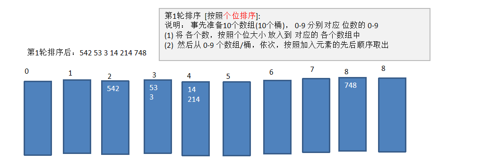

# 1、相关概念

排序是将一组数据，依指定的顺序进行排序的过程。

# 2、排序的分类

## 内部排序

指将需要处理的数据加载到内存中进行排序。

- 插入排序
  - 直接插入排序
  - 希尔排序
- 选择排序
  - 简单选择排序
  - 堆排序
- 交换排序
  - 冒泡排序
  - 快速排序
- 归并排序
- 基数排序

## 外部排序

数据量过大，无法全部加载到内存中，需要借助外部存储进行排序。

# 3、时间频度

一个算法花费的时间与算法中语句的执行次数成正比，哪个算法中语句执行次数多，它花费时间就多。一个算法中语句执行次数成为语句频度或时间频度。记为T(n)。

# 4、时间复杂度

**时间复杂度**

一般情况下，算法中的基本操作语句的重复执行次数是问题规模n的某个函数，用T(n)表述，若有某个辅助函数f(n)，使得当n趋近于无穷大时，T(n)/f(n)的极限值为不等于零的常数，则称f(n)是T(n)的同数量级函数。记作T(n)=O(f(n))，称O(f(n))为算法的渐进时间复杂度，简称时间复杂度。

T(n)不同，但时间复杂度可能相同。如：T(n)=n²+7n+6 与 T(n)=3n²+2n+2 他们的T(n)不同但是时间复杂度都是O(n²)。

**计算时间复杂度的方法**

1、忽略常数项

2、忽略低次项

3、忽略系数(成系数倍)

4、用常数1代替运行时间中所有加法常数

5、修改后的运行次数函数中，只保留最高阶项

6、取出最高阶项的系数

**稳定和不稳定**

含有相同的数的时候前后顺序不变称为稳定

**n k**

n 为数据规模，k 为桶的个数

| 排序算法 | 平均时间复杂度 | 最好情况    | 最坏情况    | 空间复杂度 | 排序方式  | 稳定性 |
| :------- | :------------- | :---------- | :---------- | :--------- | :-------- | :----- |
| 冒泡排序 | O(n²)          | O(n)        | O(n²)       | O(1)       | In-place  | 稳定   |
| 选择排序 | O(n²)          | O(n²)       | O(n²)       | O(1)       | In-place  | 不稳定 |
| 插入排序 | O(n²)          | O(n)        | O(n²)       | O(1)       | In-place  | 稳定   |
| 希尔排序 | O(n log n)     | O(n log² n) | O(n log² n) | O(1)       | In-place  | 不稳定 |
| 归并排序 | O(n log n)     | O(n log n)  | O(n log n)  | O(n)       | Out-place | 稳定   |
| 快速排序 | O(n log n)     | O(n log n)  | O(n²)       | O(log n)   | In-place  | 不稳定 |
| 堆排序   | O(n log n)     | O(n log n)  | O(n log n)  | O(1)       | In-place  | 不稳定 |
| 计数排序 | O(n + k)       | O(n + k)    | O(n + k)    | O(k)       | Out-place | 稳定   |
| 桶排序   | O(n + k)       | O(n + k)    | O(n²)       | O(n + k)   | Out-place | 稳定   |
| 基数排序 | O(n × k)       | O(n × k)    | O(n × k)    | O(n + k)   | Out-place | 稳定   |

> **n**：指代需要排序的数据规模，也就是有多少个元素。
>
> **k**：指代数据范围，比如在计数排序中，代表待排序数据的最大值与最小值的差。
>
> **In-place**：表示**原地排序**，指在排序过程中，基本上只占用常数级别的额外内存空间。
>
> **Out-place**：表示**非原地排序**，指排序过程中需要借助额外的、大小与原始数据相关的数组来辅助完

# 5、空间复杂度

一个算法的空间复杂度定义为该算法所消耗的存储空间，它也是问题规模n的函数。

空间复杂度是对一个算法在运行过程中临时占用存储空间大小的度量。有的算法需要占用的临时工作单元数与解决问题的规模n有关，它随着n的增大二增大，当n较大时，将占用较多的存储单元，例如快速排序和归并排序算法。

在做算法分析时，主要讨论的是时间复杂度。从用户使用体验上看，更看重执行的速度。一些缓存产品和算法(基数排序)本质是用**空间换时间**。

# 6、常见的时间复杂度

## 常数阶O(1)

```java
int i = 1;
int j = 2;
++i; j++;
int m = i + j;
```

## 对数阶O(log2n)

```java
int i = 1;
while(i<n){
    i = i * 2;
}
```

## 线性阶O(n)

```java
for(i = 1; i<= n; ++i){
    j = i;
    j++;
}
```

## 线性对数阶O(nlog2n)

```java
for(m =1;m<n;m++){
    i = 1;
    while(i<n){
        i = i * 2;
    }
}
```

## 平方阶O(n²)

```java
for(x=1;i<=n;x++){
    for(i=1;i<=n;i++){
        j = 1;
        j ++;
    }
}
```

## 立方阶O(n³)

## K次方阶O(n^K)

## 指数阶O(2^n)

# 7、冒泡排序

```java
//从左往右 左边大的话交换 小的话不变
public static void doBubblePlus(int[] arr){
    for (int i = 0; i < arr.length; i++) {
        boolean flag = false;
        for (int j = 0; j < arr.length - i - 1; j++) {
            if (arr[j] > arr[j + 1]){
                int temp = arr[j];
                arr[j] = arr[j + 1];
                arr[j + 1] = temp;
                flag = true;
            }
        }
        if (!flag){
            break;
        }
        flag = false;
}
```

# 8、选择排序

```java
//一趟遍历完记录最小的数，放到第一个位置；在一趟遍历记录剩余列表中的最小的数，继续放置
private static void doSelect(int[] arr) {
    for (int i = 0; i < arr.length; i++) {
        int position = i;
        for (int j = i + 1; j < arr.length; j++) {
            if (arr[position] > arr[j]){
                position = j;
            }
        }
        if (position != i){
            int temp = arr[i];
            arr[i] = arr[position];
            arr[position] = temp;
        }
    }
}
```

# 9、插入排序

把 n 个待排序的元素看成为一个有序表和一个无序表，开始时有序表中只包含一个元素，无序表中包含有n-1个元素，排序过程中每次从无序表中取出第一个元素，把它的排序码依次与有序表元素的排序码进行比较，将它插入到有序表中的适当位置，使之成为新的有序表。

```java
//将数据分为 左边分配好的数据 右边未分配的数据 往左边进行插入
private static void doInsert(int[] arr) {
    for (int i = 1; i < arr.length; i++) {
        int num = arr[i];
        int position = i - 1;
        while (position >= 0 && num < arr[position]){
            arr[position + 1] = arr[position];
            position -= 1;
        }
        arr[position + 1] = num;
    }
}
```

# 10、希尔排序

```java
//交换法 慢
private static void doShell(int[] arr) {
    for (int grep = arr.length / 2; grep > 0; grep /= 2) {
        for (int i = grep; i < arr.length; i++) {
            for (int j = i - grep; j >= 0; j -= grep) {
                if (arr[j] > arr[j + grep]) {
                    int temp = arr[j];
                    arr[j] = arr[j + grep];
                    arr[j + grep] = temp;
                }
            }
        }
    }
}

//移位法 是对插入排序的改良 快
private static void doShell2(int[] arr) {
    for (int grep = arr.length / 2; grep > 0; grep /= 2) {
        for (int i = grep; i < arr.length; i++) {
            int j = i;
            int value = arr[j];
            if (arr[j] < arr[j - grep]) {
                while (j - grep >= 0 && arr[j] < arr[j - grep]) {
                    arr[j] = arr[j - grep];
                    j -= grep;
                }
                arr[j] = value;
            }
        }
    }
}
```

# 11、快速排序

是对冒泡排序的一种改进，通过一趟排序将要排序的数据分割成独立的两部分，其中一部分的所有数据都比另外一部分的所有数据都要小，然后再按此方法对这两部分数据分别进行快速排序，整个排序过程可以递归进行，以此达到整个数据变成有序序列。

```java
//取中间的数 从左边取小于等于中间值的 从右边取大于等于中间值的进行交换
//如果交换后的右边数等于中间值 左边坐标+1 反之 右边坐标-1
//最后再递归 将左边和右边区域的数据进行排序
private static void doQuick(int[] arr, int left, int right) {
    int middle = arr[(right + left) / 2];
    int l = left;
    int r = right;

    while (l < r) {
        while (arr[l] < middle) {
            l += 1;
        }

        while (arr[r] > middle) {
            r -= 1;
        }

        if (l >= r) {
            break;
        }

        int temp = arr[l];
        arr[l] = arr[r];
        arr[r] = temp;

        if (arr[l] == middle) {
            r -= 1;
        }

        if (arr[r] == middle) {
            l += 1;
        }
    }

    if (l == r) {
        l += 1;
        r -= 1;
    }

    if (left < r) {
        doQuick2(arr, left, r);
    }

    if (right > l) {
        doQuick(arr, l, right);
    }
}
```

# 12、归并排序





```java
//利用归并的思想 采用经典的分治策略(将问题分为小的问题递归求解)
public class Merge {
    public static void main(String[] args) {
        int[] arr = new int[]{31, 22, 45, 11, 22, 32, 43, 54, 76};
        doMerge(arr, 0, arr.length - 1);
        System.out.println(Arrays.toString(arr));
    }

    private static void doMerge(int[] arr, int left, int right) {
        if (left < right) {
            int middlePosition = (left + right) / 2;
            //向左递归
            doMerge(arr, left, middlePosition);
            //向右递归
            doMerge(arr, middlePosition + 1, right);
            //合并
            merge(arr, left, middlePosition, right);
        }
    }

    private static void merge(int[] arr, int left, int middlePosition, int right) {
        int l = left;
        int j = middlePosition + 1;

        int temp = 0;
        int[] newArr = new int[arr.length];
        while (l <= middlePosition && j <= right) {
            if (arr[l] > arr[j]) {
                newArr[temp] = arr[j];
                temp += 1;
                j += 1;
            } else {
                newArr[temp] = arr[l];
                temp += 1;
                l += 1;
            }
        }

        while (l <= middlePosition) {
            newArr[temp] = arr[l];
            temp += 1;
            l += 1;
        }

        while (j <= right) {
            newArr[temp] = arr[j];
            temp += 1;
            j += 1;
        }

        temp = 0;
        int tempLeft = left;
        while (tempLeft <= right) {
            arr[tempLeft] = newArr[temp];
            temp += 1;
            tempLeft += 1;
        }
    }
}
```

# 13、基排序(桶排序的扩展)

将所有待比较数值统一为同样的数位长度，数位较短的数前面补零。然后从最低位开始，依次进行一次排序。这样从最低位排序一直到最高位排序完成以后， 数列就变成一个有序序列。

基数排序是经典的空间换时间的方式占用内存很大，当对海量数据排序时，容易造成 OutOfMemoryError。



```java
public class Cardinal {
    public static void main(String[] args) {
        int[] arr = new int[]{31, 22, 45, 1, 2, 32, 43, 54, 76};
        int[][] bucket = new int[10][arr.length];
        int[] numArr = new int[10];
        doCardinal(arr, 1, bucket, numArr);
        System.out.println(Arrays.toString(arr));
    }

    /**
     * 将所有数字初始化为同样的位数
     * 创建 10 个数组 分别是
     *
     * @param arr 数组
     */
    private static void doCardinal(int[] arr, int index, int[][] bucket, int[] numArr) {
        //把数字放入桶中
        for (int num : arr) {
            int indexNum = getIndexNum(num, index);
            bucket[indexNum][numArr[indexNum]] = num;
            numArr[indexNum] = numArr[indexNum] + 1;
        }
        //从桶中拿数据
        int tmp = 0;
        for (int i = 0; i < numArr.length; i++) {
            //个数
            if (numArr[i] > 0) {
                for (int j = 0; j < numArr[i]; j++) {
                    arr[tmp] = bucket[i][j];
                    tmp++;
                }
            }
        }
        if (numArr[0] == arr.length) {
            return;
        }
        //清空numArr
        numArr = new int[10];
        index++;
        //桶0中为全部数字的时候判定为已排序好
        doCardinal(arr, index, bucket, numArr);
    }

    private static int getIndexNum(int num, int index) {
        //个位数
        return num % ((int) Math.pow(10, index)) / ((int) Math.pow(10, index - 1));
    }
}
```

