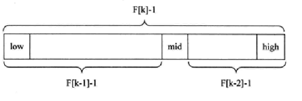

# 1、常用算法

顺序查找

二分查找

插值查找

斐波那契查找

# 2、二分查找

 需要是有序的

```java
private static int doDichotomy(int[] arr, int num) {
    int left = 0;
    int right = arr.length - 1;
    if (num < arr[left] || num > arr[right]) {
        return -1;
    }

    while (left <= right) {
        int mid = (left + right) / 2;
        if (arr[mid] == num) {
            return mid;
        }
        if (arr[mid] < num) {
            left = mid + 1;
            continue;
        }
        if (arr[mid] > num) {
            right = mid - 1;
        }
    }
    return -1;
}
```

# 3、插值查找

类似于二分查找，每次自适应 mid。

int mid = left + (right – left) * (findVal – arr[left]) / (arr[right] – arr[left])

```java
private static int doInterpolation(int[] arr, int num) {
    int left = 0;
    int right = arr.length - 1;

    if (num < arr[left] || num > arr[right]) {
        return -1;
    }

    while (left <= right) {
        int mid = left + (right - left) * (num - arr[left]) / (arr[right] - arr[left]);
        if (arr[mid] == num) {
            return mid;
        }
        if (arr[mid] < num) {
            left = mid + 1;
            continue;
        }
        if (arr[mid] > num) {
            right = mid - 1;
        }
    }
    return -1;
}
```

# 4、斐波那契查找

斐波那契数列:{1,1,2,3,5,8,13,21,34,55...}两数相邻比无限接近0.618。

斐波那契查找原理与前两种相似，仅仅改变了中间结点（mid）的位置，mid不再是中间或插值得到，而是位于黄金分割点附近，即mid=low+F(k-1)-1（F代表斐波那契数列）。

由斐波那契数列 F[k]=F[k-1]+F[k-2] 的性质，可以得到 （F[k]-1）=（F[k-1]-1）+（F[k-2]-1）+1 。该式说明：只要顺序表的长度为F[k]-1，则可以将该表分成长度为F[k-1]-1和F[k-2]-1的两段，即如上图所示。从而中间位置为mid=low+F(k-1)-1。

但顺序表长度n不一定刚好等于F[k]-1，所以需要将原来的顺序表长度n增加至F[k]-1。这里的k值只要能使得F[k]-1恰好大于或等于n即可，由以下代码得到,顺序表长度增加后，新增的位置（从n+1到F[k]-1位置），都赋为n位置的值即可。



```java
public class Fibonacci {
    public static void main(String[] args) {
        int[] arr = new int[]{1, 3, 4, 5, 11, 32, 45, 65, 99};
        int i = doFibonacci(arr, 11);
        System.out.println(i);
    }

    private static int doFibonacci(int[] arr, int num) {
        int low = 0;
        int high = arr.length - 1;
        //fibonacci k值
        int k = 0;
        int[] fibonacci = getFibonacci();
        //看数组的长度与f的大小
        while (high > fibonacci[k] - 1) {
            k++;
        }
        int[] temp = Arrays.copyOf(arr, fibonacci[k]);
        //扩充数组后 超出部分的元素 改为原本数组最后一个元素
        for (int i = arr.length; i < temp.length; i++) {
            temp[i] = arr[high];
        }

        while (low <= high) {
            System.out.println("do");
            int mid = low + fibonacci[k - 1] - 1;
            if (num > temp[mid]){
                low = mid + 1;
                k -=2;
            }
            if (num < temp[mid]){
                high = mid -1;
                k -= 1;
            }
            if (num == temp[mid]){
                return Math.min(mid, high);
            }
        }
        return -1;
    }

    private static int[] getFibonacci() {
        int[] fibonacci = new int[20];
        fibonacci[0] = 1;
        fibonacci[1] = 1;
        for (int i = 2; i < fibonacci.length; i++) {
            fibonacci[i] = fibonacci[i - 1] + fibonacci[i - 2];
        }
        return fibonacci;
    }

}
```

