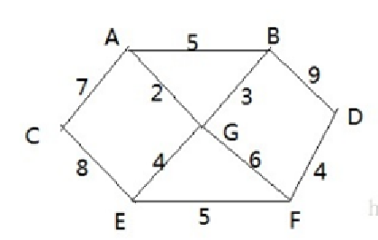
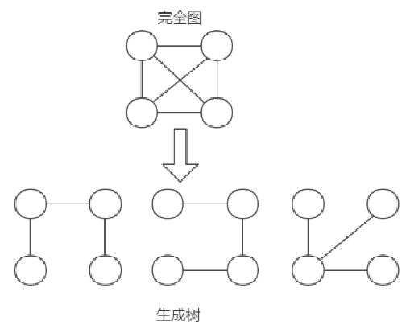
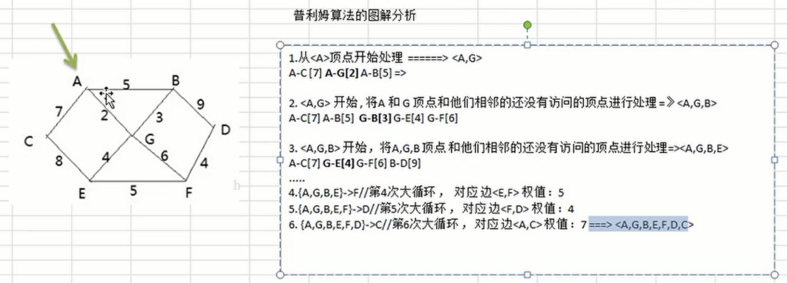

# 1、应用场景

修路问题



有胜利乡有7个村庄(A, B, C, D, E, F, G) ，现在需要修路把7个村庄连通

各个村庄的距离用边线表示(权) ，比如 A – B 距离 5公里

问：如何修路保证各个村庄都能连通，并且总的修建公路总里程最短?


# 2、最小生成树

修路问题本质就是就是最小生成树问题， 先介绍一下最小生成树(Minimum Cost Spanning Tree)，简称MST。
- 给定一个带权的无向连通图,如何选取一棵生成树,使树上所有边上权的总和为最小,这叫最小生成树
- N个顶点，一定有N-1条边
- 包含全部顶点
- N-1条边都在图中
- 求最小生成树的算法主要是普里姆算法和克鲁斯卡尔算法





# 3、普利姆算法介绍

普利姆(Prim)算法求最小生成树，也就是在包含n个顶点的连通图中，找出只有(n-1)条边包含所有n个顶点的连通子图，也就是所谓的极小连通子图
- 设G=(V,E)是连通网，T=(U,D)是最小生成树，V,U是顶点集合，E,D是边的集合 
- 若从顶点u开始构造最小生成树，则从集合V中取出顶点u放入集合U中，标记顶点v的visited[u]=1
- 若集合U中顶点ui与集合V-U中的顶点vj之间存在边，则寻找这些边中权值最小的边，但不能构成回路，将顶点vj加入集合U中，将边（ui,vj）加入集合D中，标记visited[vj]=1
- 重复步骤②，直到U与V相等，即所有顶点都被标记为访问过，此时D中有n-1条边


# 4、代码实现



```java
public class Prim {
    int count = 7;
    int[][] arr = new int[count][count];
    int[] visited = new int[count];
    char[] letter = {'A', 'B', 'C', 'D', 'E', 'F', 'G'};

    @Test
    public void test() {
        init();
        for (int[] ints : arr) {
            System.out.println(Arrays.toString(ints));
        }

        List<Integer> visitedList = new ArrayList<>();
        visitedList.add(0);
        visited[0] = 1;
        int min = 999;
        int sideOne = -1;
        int sideTwo = -1;
        while (visitedList.size() < count) {
            for (Integer integer : visitedList) {
                for (int i = 0; i < count; i++) {
                    if (i != integer && visited[i] == 0 && arr[integer][i] < min) {
                        sideOne = integer;
                        sideTwo = i;
                        min = arr[sideOne][sideTwo];
                    }
                }
            }
            System.out.println(letter[sideOne] + "->" + letter[sideTwo] + ": " + min);
            visited[sideTwo] = 1;
            visitedList.add(sideTwo);
            min = 999;
        }
    }

    public void init() {
        for (int i = 0; i < arr.length; i++) {
            for (int j = 0; j < arr.length; j++) {
                arr[i][j] = 999;
            }
        }
        putValue('A','B',5);
        putValue('A','C',7);
        putValue('A','G',2);
        putValue('B','D',9);
        putValue('B','G',3);
        putValue('C','E',8);
        putValue('D','F',4);
        putValue('E','F',5);
        putValue('G','E',4);
        putValue('G','F',6);
    }

    private void putValue(char a, char b, int i) {
        int i1 = getIndex(a);
        int i2 = getIndex(b);
        arr[i1][i2] = i;
        arr[i2][i1] = i;
    }

    public int getIndex(char c) {
        for (int i = 0; i < letter.length; i++) {
            if (c == letter[i]) {
                return i;
            }
        }
        throw new RuntimeException();
    }
}
```

