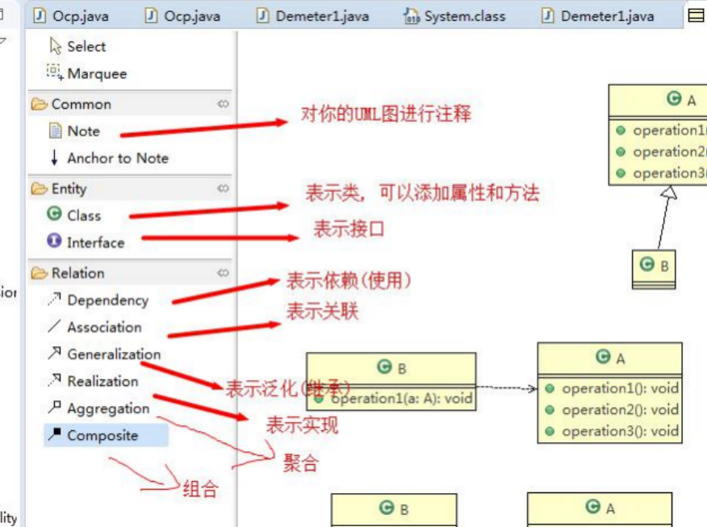
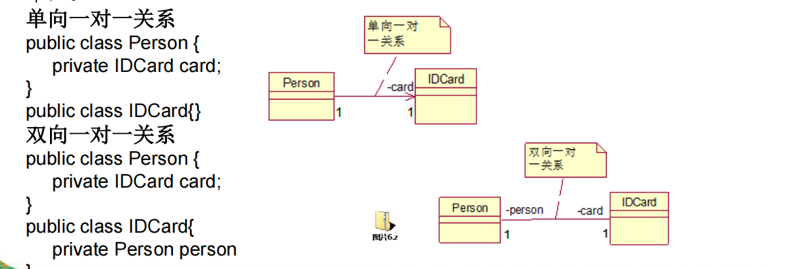
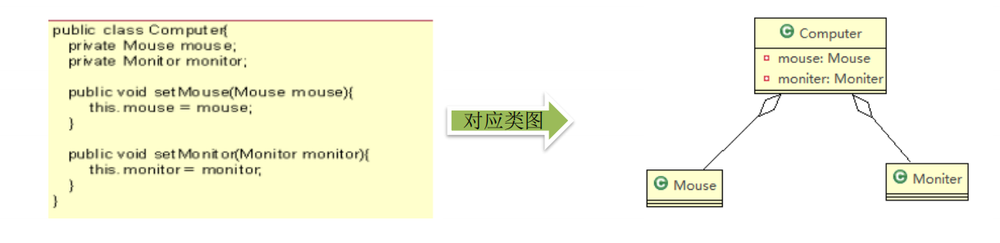
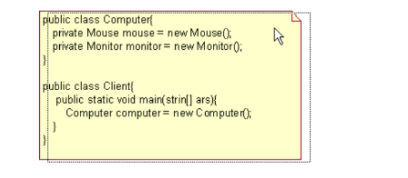

# 设计模式目的

## 1、简介

编写软件过程中,程序员面临来耦合性、内聚性、以及可维护性、可扩展性、重用性、灵活性等多方面的挑战

- 代码重用性(相同功能的代码,不用多次编写)
- 可读性(编程规范性,便于其他程序员的阅读和理解)
- 可扩展性(当需要增加新的功能时,非常方便)
- 可靠性(当我们增加新功能后,对原来的功能没有影响)
- 使程序呈现高内聚,低耦合的特性

## 2、设计原则核心思想

- 找出应用中可能需要变化之处，把它们独立出来，不要和那些不需要变化的代码混在一起。
- 针对接口编程，而不是针对实现编程。
- 为了交互对象之间的松耦合设计而努力。

## 3、常用词汇

**SOLID 五大原则**

| **简称** | **全称**                        | **核心意思**           | **关键词**       |
| -------- | ------------------------------- | ---------------------- | ---------------- |
| SRP      | Single Responsibility Principle | 一个类只负责一类职责   | **变化原因**     |
| OCP      | Open Closed Principle           | 对扩展开放，对修改关闭 | **新增，不改旧** |
| LSP      | Liskov Substitution Principle   | 子类可替换父类         | **不破坏语义**   |
| ISP      | Interface Segregation Principle | 接口要小而专           | **最小接口**     |
| DIP      | Dependency Inversion Principle  | 依赖抽象，不依赖实现   | **面向接口**     |


**耦合（Coupling）**

模块之间相互依赖的程度

- 高耦合 ❌：一改全崩
- 低耦合 ✅：改动可控


**内聚（Cohesion）**

一个模块内部功能是否集中

- 高内聚 ✅：只干一类事
- 低内聚 ❌：啥都往里塞

👉 SRP = 提高内聚，降低耦合


**依赖（Dependency）**

一个类使用了另一个类


**依赖注入（DI）**

依赖从外部传入，而不是自己 new

三种常见方式：

- 构造器注入
- Setter 注入
- 方法参数注入

⚠️ DI 是手段，不是原则


# 设计模式七大原则

## 1、单一职责原则（SRP）

**基本介绍**

对类来说的，即一个类应该只负责一项职责。如类A负责两个不同职责：职责1，职责2。当职责1需求变更而改变A时，可能造成职责2执行错误，所以需要将类A的粒度分解为 A1，A2。

**注意事项和细节**

- 降低类的复杂度，一个类只负责一项职责。

- 提高类的可读性，可维护性。

- 降低变更引起的风险。

- 通常情况下，我们应当遵守单一职责原则，只有逻辑足够简单，才可以在代码级违反单一职责原则；只有类中方法数量足够少，可以在方法级别保持单一职责原则。

**示例**

```java
单一职责 ≠ 只能有一个方法
正确理解是：一个类可以有多个方法，但这些方法都围绕同一类职责展开

class UserService {
    void createUser() {}
    void updateUser() {}
    void deleteUser() {}
}
这是单一职责的：它的职责是「用户业务操作」

但下面这样就不行：
class UserService {
    void createUser() {}
    void sendEmail() {}
    void writeLogToFile() {}
}
这里至少有三种职责：用户业务、通知（邮件）、日志
```

## 2、接口隔离原则（ISP）

**基本介绍**

客户端不应该依赖它不需要的接口，即一个类对另一个类的依赖应该建立在最小的接口上。

**注意事项和细节**

- 最小接口：只包含调用方真正需要的方法

- 隔离：把臃肿接口拆成多个专用接口

**示例**

```java
❌ 一个“胖接口”
interface Animal {
    void eat();
    void fly();
    void swim();
}

实现类：
class Dog implements Animal {
    public void eat() {}
    public void fly() {}   // ❌ 狗不会飞，但被迫实现
    public void swim() {}
}


问题：
	•	Dog 被迫实现不需要的方法
	•	方法可能是空实现或抛异常
	•	接口一变，所有实现类都得改

👉 这正是 ISP 要反对的

  
正确示例 接口拆分（隔离）
interface Eatable {
    void eat();
}

interface Flyable {
    void fly();
}

interface Swimmable {
    void swim();
}

class Dog implements Eatable, Swimmable {
    public void eat() {}
    public void swim() {}
}

class Bird implements Eatable, Flyable {
    public void eat() {}
    public void fly() {}
}
```

## 3、依赖倒转(倒置)原则（DIP）

**基本介绍**

- 高层模块不应该依赖低层模块，二者都应该依赖其抽象。

- 抽象不应该依赖细节，细节应该依赖抽象。

- 依赖倒转(倒置)的中心思想是面向接口编程。

- 依赖倒转原则是基于这样的设计理念：相对于细节的多变性，抽象的东西要稳定的多。以抽象为基础搭建的架构比以细节为基础的架构要稳定的多。在java中，抽象指的是接口或抽象类，细节就是具体的实现类。

- 使用接口或抽象类的目的是**制定好规范**，而不涉及任何具体的操作，把展现细节的任务交给他们的实现类去完成。

**注意事项和细节**

- 低层模块尽量都要有抽象类或接口，或者两者都有，程序稳定性更好。
- 变量的声明类型尽量是抽象类或接口, 这样我们的变量引用和实际对象间，就存在一个缓冲层，利于程序扩展和优化。
- 继承时遵循里氏替换原则。

**依赖关系传递的三种方式**

```java
// ============================================================================
// 方式1: 方法参数传递
// ============================================================================

// 开关的接口
interface IOpenAndClose {
    public void open(ITV tv); //抽象方法,接收接口
}

interface ITV { //ITV接口
    public void play();
}

// 实现接口
class OpenAndClose implements IOpenAndClose {
    public void open(ITV tv) {
        tv.play();
    }
}


// ============================================================================
// 方式2: 构造器注入
// ============================================================================

interface IOpenAndClose {
    public void open(); //抽象方法
}

interface ITV { //ITV接口
    public void play();
}

class OpenAndClose implements IOpenAndClose {
    public ITV tv;

    public OpenAndClose(ITV tv) {
        this.tv = tv;
    }

    public void open() {
        this.tv.play();
    }
}


// ============================================================================
// 方式3: Setter 注入
// ============================================================================

interface IOpenAndClose {
    public void open(); // 抽象方法

    public void setTv(ITV tv);
}

interface ITV { // ITV接口
    public void play();
}

class OpenAndClose implements IOpenAndClose {
    private ITV tv;

    public void setTv(ITV tv) {
        this.tv = tv;
    }

    public void open() {
        this.tv.play();
    }
}
```

## 4、里氏替换原则（LSP）

**继承性的思考和说明**

- 继承包含这样一层含义：父类中凡是已经实现好的方法，实际上是在设定规范和契约，虽然它不强制要求所有的子类必须遵循这些契约，但是如果子类对这些已经实现的方法任意修改，就会对整个继承体系造成破坏。
- 继承在给程序设计带来便利的同时，也带来了弊端。比如使用继承会给程序带来侵入性，程序的可移植性降低，**增加对象间的耦合性**，如果一个类被其他的类所继承，则当这个类需要修改时，必须考虑到所有的子类，并且父类修改后，所有涉及到子类的功能都有可能产生故障。

**基本介绍**

- 如果对每一个父类对象 p，都可以用其子类对象 s 替换，并且程序行为不发生变化，那么继承关系就是合法的。
- 在使用继承时，遵循里氏替换原则，在子类中**尽量不要重写**父类的方法。
- 里氏替换原则告诉我们，继承实际上让两个类耦合性增强了，在适当的情况下，可以通过**聚合，组合，依赖**来解决问题。

**解决方法**

原来的父类和子类都继承一个更通俗的基类，原有的继承关系去掉，采用依赖，聚合，组合等关系代替。

**示例**

```java
// ============================================================================
// 一个“正确遵守 LSP”的简单例子
// 场景：鸟都会飞
// ============================================================================
// 父类
class Bird {
    public void fly() {
        System.out.println("Bird is flying");
    }
}

// 子类
class Sparrow extends Bird {
}

// 使用方
public class Test {
    public static void main(String[] args) {
        Bird bird = new Sparrow(); // 子类替换父类
        bird.fly();                // 行为完全正常
    }
}

// ============================================================================
// 一个“违反 LSP”的经典反例
// 场景：矩形 & 正方形
// ============================================================================
// 父类：矩形
class Rectangle {
    protected int width;
    protected int height;

    public void setWidth(int width) {
        this.width = width;
    }

    public void setHeight(int height) {
        this.height = height;
    }

    public int area() {
        return width * height;
    }
}
// 子类：正方形
class Square extends Rectangle {

    @Override
    public void setWidth(int width) {
        this.width = width;
        this.height = width;
    }

    @Override
    public void setHeight(int height) {
        this.width = height;
        this.height = height;
    }
}
// 使用方代码
public class Test {
    public static void resize(Rectangle r) {
        r.setWidth(4);
        r.setHeight(5);
        System.out.println(r.area()); // 期望 20
    }

    public static void main(String[] args) {
        Rectangle r = new Square();
        resize(r); // 输出 25 ❌
    }
}
```

## 5、开闭原则（OCP）

**基本介绍**

- 开闭原则（Open Closed Principle）是编程中最基础、最重要的设计原则。
- 一个软件实体如类，模块和函数应该**对扩展开放(对提供方)，对修改关闭(对使用方)**。用抽象构建框架，用实现扩展细节。
- 当软件需要变化时，**尽量通过扩展软件实体的行为来实现变化**，而不是通过修改已有的代码来实现变化。
- 编程中遵循其它原则，以及使用设计模式的目的就是遵循开闭原则。

**示例**

```java
// ============================================================================
// 一个违反开闭原则的经典案例
// 场景：计算不同图形的面积
// ============================================================================
class AreaCalculator {

    public double calculate(String shapeType, double... params) {
        if ("circle".equals(shapeType)) {
            double r = params[0];
            return Math.PI * r * r;
        } else if ("rectangle".equals(shapeType)) {
            return params[0] * params[1];
        }
        return 0;
    }
}

// ============================================================================
// 符合经典案例
// ============================================================================
// 抽象一个“图形”接口
interface Shape {
    double area();
}
// 各种图形自己实现
class Circle implements Shape {
    private double r;

    public Circle(double r) {
        this.r = r;
    }

    public double area() {
        return Math.PI * r * r;
    }
}

class Rectangle implements Shape {
    private double width;
    private double height;

    public Rectangle(double width, double height) {
        this.width = width;
        this.height = height;
    }

    public double area() {
        return width * height;
    }
}
// 计算器只依赖抽象
class AreaCalculator {

    public double calculate(Shape shape) {
        return shape.area();
    }
}
```

## 6、迪米特法则（LoD）

**基本介绍**

- 一个对象应该对其他对象保持最少的了解。
- 类与类关系越密切，耦合度越大。
- 迪米特法则(Demeter Principle)又叫**最少知道原则**，即一个类对自己依赖的类知道的越少越好。也就是说，对于被依赖的类不管多么复杂，都尽量将逻辑封装在类的内部。对外除了提供的public 方法，不对外泄露任何信息。
- 迪米特法则还有个更简单的定义：只与直接的朋友通信。直接的朋友：每个对象都会与其他对象有耦合关系，只要两个对象之间有耦合关系，我们就说这两个对象之间是朋友关系。耦合的方式很多，依赖，关联，组合，聚合等。其中，我们称出现成员变量，方法参数，方法返回值中的类为直接的朋友，而出现在局部变量中的类不是直接的朋友。也就是说，陌生的类最好不要以局部变量的形式出现在类的内部。

**注意事项和细节**

- 迪米特法则的核心是**降低类之间的耦合**。
- 但是注意：由于每个类都减少了不必要的依赖，因此迪米特法则只是要求降低类间(对象间)耦合关系， 并不是要求完全没有依赖关系。

**示例**

```java
// ============================================================================
// 违反经典案例
// 场景：老板让员工统计学院员工数
// ============================================================================
class Employee {
}

class CollegeEmployee {
}

class CollegeManager {
    public List<CollegeEmployee> getAllCollegeEmployees() {
        return new ArrayList<>();
    }
}

class SchoolManager {

    public void printAllEmployee(CollegeManager collegeManager) {
        // 直接操作“陌生人” CollegeEmployee
        List<CollegeEmployee> list = collegeManager.getAllCollegeEmployees();
        for (CollegeEmployee e : list) {
            System.out.println(e);
        }
    }
}

// ============================================================================
// 符合经典案例
// 场景：老板让员工统计学院员工数
// ============================================================================
// 把细节“关”在 CollegeManager 里
class CollegeManager {

    public void printAllCollegeEmployees() {
        List<CollegeEmployee> list = new ArrayList<>();
        for (CollegeEmployee e : list) {
            System.out.println(e);
        }
    }
}
// SchoolManager 只和直接朋友说话
class SchoolManager {

    public void printAllEmployee(CollegeManager collegeManager) {
        collegeManager.printAllCollegeEmployees();
    }
}
```

## 7、合成复用原则（CRP）

**基本介绍**

尽量使用组合（has-a）/聚合，而不是继承（is-a）来实现复用。

**示例**

```java
// ============================================================================
// 违反经典案例
// 场景：汽车 + 引擎
// ============================================================================
class Engine {
    public void start() {
        System.out.println("engine start");
    }
}

class Car extends Engine {
    public void drive() {
        System.out.println("car is driving");
    }
}

// ============================================================================
// 符合经典案例
// 场景：汽车 + 引擎
// ============================================================================
class Engine {
    public void start() {
        System.out.println("engine start");
    }
}

class Car {
    private Engine engine;

    public Car(Engine engine) {
        this.engine = engine;
    }

    public void drive() {
        engine.start();
        System.out.println("car is driving");
    }
}
```


# Uml类图

## 1、基本介绍

- UML—Unified modeling language UML(统一建模语言)，是一种用于软件系统分析和设计的语言工具，它用于帮助软件开发人员进行思考和记录思路的结果。
- UML本身是一套符号的规定，就像数学符号和化学符号一样，这些符号用于描述软件模型中的各个元素和他们之间的关系，比如类、接口、实现、泛化、依赖、组合、聚合等。
- 使用UML来建模，常用的工具有 Rational Rose , 也可以使用一些插件来建模。

## 2、Uml图

画UML图与写文章差不多，都是把自己的思想描述给别人看，关键在于思路和条理，UML图分类：

1、用例图(use case)

2、静态结构图：类图、对象图、包图、组件图、部署图

3、动态行为图：交互图（时序图与协作图）、状态图、活动图

## 3、Uml类图

- 用于描述系统中的类(对象)本身的组成和类(对象)之间的各种静态关系。
- 类之间的关系：**依赖、泛化（继承）、实现、关联、聚合与组合**。



## 4、依赖关系（Dependence）

只要是在类中用到了对方，那么他们之间就存在依赖关系。

- 类中用到了对方
- 如果是类的成员属性
- 如果是方法的返回类型
- 是方法接收的参数类型
- 方法中使用到

## 5、泛化关系(generalization）

泛化关系实际上就是**继承关系**，他是依赖关系的特例。

## 6、实现关系（Implementation）

实现关系实际上就是**A类实现B接口**，他是依赖关系的特例。

## 7、关联关系（Association）

关联关系实际上就是类与类之间的联系，他是依赖关系的特例。

关联具有导航性：即双向关系或单向关系。

关系具有多重性：如“1”（表示有且仅有一个），“0...”（表示0个或者多个），“0，1”（表示0个或者一个），“n...m”(表示n到 m个都可以),“m...*”（表示至少m个）。



## 8、聚合关系（Aggregation）

整体和部分的关系，整体与部分可以分开。聚合关系是关联关系的特例，所以他具有关联的导航性与多重性。

聚合关系，可以独立创建，可以独立销毁。



## 9、组合关系（Composition）

整体与部分的关系，但是整体与部分不可以分开。

组合关系，不可独立创建，不可独立销毁。




# 设计模式概述

## 1、掌握设计模式的层次

1、第1层：刚开始学编程不久，听说过什么是设计模式

2、第2层：有很长时间的编程经验，自己写了很多代码，其中用到了设计模式，但是自己却不知道

3、第3层：学习过了设计模式，发现自己已经在使用了，并且发现了一些新的模式挺好用的

4、第4层：阅读了很多别人写的源码和框架，在其中看到别人设计模式，并且能够领会设计模式的精妙和带来的好处。

5、第5层：代码写着写着，自己都没有意识到使用了设计模式，并且熟练的写了出来

## 2、设计模式介绍

1、设计模式是程序员在面对同类软件工程设计问题所总结出来的有用的经验，模式不是代码，而是某类问题的通用解决方案，设计模式（Design pattern）代表了最佳的实践。这些解决方案是众多软件开发人员经过相当长的一段时间的试验和错误总结出来的。

2、设计模式的本质提高 软件的维护性，通用性和扩展性，并降低软件的复杂度。

3、设计模式并不局限于某种语言，java，php，c++ 都有设计模式。

## 3、设计模式三种类型，共 23 种

GoF 经典 23 种，按 **学习顺序** 排列。「工厂模式」指 **工厂方法模式（Factory Method）**；**简单工厂**常用但不在 GoF 23 内，写在 `2、工厂模式.md` 里一并说明。

### 创建型模式（5）

| 序号 | 模式 | 英文 | 一句话 |
| :--: | :--- | :--- | :--- |
| 1 | 单例模式 | Singleton | 全局只保留一个实例 |
| 2 | 工厂模式 | Factory Method | 把实例化延迟到子类/工厂 |
| 3 | 抽象工厂模式 | Abstract Factory | 生产一族相关产品 |
| 4 | 原型模式 | Prototype | 通过克隆复制对象 |
| 5 | 建造者模式 | Builder | 分步组装复杂对象 |

### 结构型模式（7）

| 序号 | 模式 | 英文 | 一句话 |
| :--: | :--- | :--- | :--- |
| 6 | 适配器模式 | Adapter | 让不兼容接口能协同工作 |
| 7 | 桥接模式 | Bridge | 抽象与实现分离，独立变化 |
| 8 | 装饰模式 | Decorator | 动态叠加职责，替代子类爆炸 |
| 9 | 外观模式 | Facade | 对子系统提供统一入口 |
| 10 | 组合模式 | Composite | 树形结构，统一对待部分与整体 |
| 11 | 享元模式 | Flyweight | 共享细粒度对象，省内存 |
| 12 | 代理模式 | Proxy | 为对象加一层访问控制 |

### 行为型模式（11）

| 序号 | 模式 | 英文 | 一句话 |
| :--: | :--- | :--- | :--- |
| 13 | 模板方法模式 | Template Method | 固定流程骨架，子步骤可变 |
| 14 | 策略模式 | Strategy | 算法/规则可整体替换 |
| 15 | 观察者模式 | Observer | 一对多，状态变化自动通知 |
| 16 | 责任链模式 | Chain of Responsibility | 请求沿链传递，直到有人处理 |
| 17 | 命令模式 | Command | 把请求封装成对象，可撤销/排队 |
| 18 | 迭代器模式 | Iterator | 统一遍历集合，不暴露内部结构 |
| 19 | 备忘录模式 | Memento | 保存/恢复对象历史状态 |
| 20 | 状态模式 | State | 行为随内部状态切换 |
| 21 | 访问者模式 | Visitor | 在不改类结构下增加新操作 |
| 22 | 中介者模式 | Mediator | 对象经中介通信，降低网状依赖 |
| 23 | 解释器模式 | Interpreter | 用类表示语法规则并解释执行 |