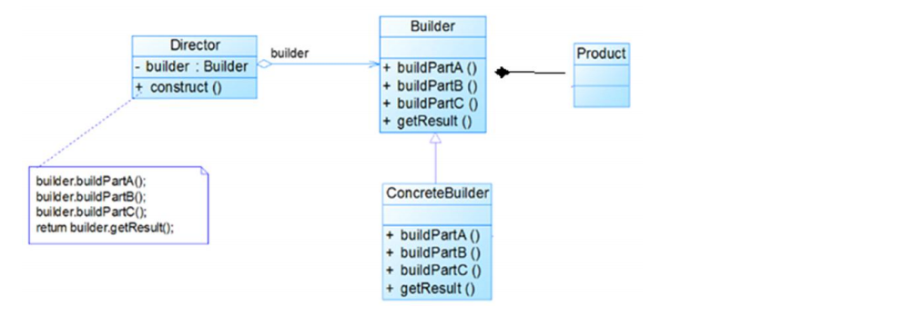
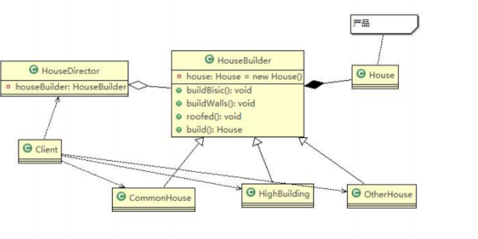

# 1、需求引入

盖房项目需求

1、需要建房子：这一过程为打桩、砌墙、封顶

2、房子有各种各样的，比如普通房，高楼，别墅，各种房子的过程虽然一样，但是要求不要相同的


## 原始方法

house

```java
public abstract class AbstractHouse {
    //地基
    public abstract void buildBasic();
    //建墙
    public abstract void buildWalls();
    //建顶
    public abstract void roofed();

    public void build(){
        buildBasic();
        buildWalls();
        roofed();
    }
}

public class CommonHouse extends AbstractHouse {
    @Override
    public void buildBasic() {
        System.out.println("普通房子建造地基");
    }

    @Override
    public void buildWalls() {
        System.out.println("普通房子建造墙");
    }

    @Override
    public void roofed() {
        System.out.println("普通房子建顶");
    }
}
```

client

```java
public class Client {
    public static void main(String[] args) {
        CommonHouse commonHouse = new CommonHouse();
        commonHouse.build();
    }
}
```

## 问题分析

1、优点是比较好理解，简单易操作。

2、设计的程序结构，过于简单，没有设计缓存层对象，程序的扩展和维护不好. 也就是说，这种设计方案，把产品(即：房子) 和 创建产品的过程(即：建房子流程) 封装在一起，耦合性增强了。

3、解决方案：将产品和产品建造过程解耦 => 建造者模式


# 2、建造者模式

## 介绍

建造者模式（Builder Pattern） 又叫生成器模式，是一种对象构建模式。它可以将复杂对象的建造过程抽象出来（抽象类别），使这个抽象过程的不同实现方法可以构造出不同表现（属性）的对象。

建造者模式 是一步一步创建一个复杂的对象，它允许用户只**通过指定复杂对象的类型和内容就可以构建它们**，用户不需要知道内部的具体构建细节。

## 四种角色



**Product（产品角色）**：一个具体的产品对象。

**Builder（抽象建造者）**：创建一个Product对象的各个部件指定的 接口/抽象类。

**ConcreteBuilder（具体建造者）**：实现接口，构建和装配各个部件。

**Director（指挥者）**：构建一个使用Builder接口的对象。它主要是用于创建一个复杂的对象。它主要有两个作用，一是：隔离了客户与对象的生产过程，二是：负责控制产品对象的生产过程。

## 代码实现



builder

```java
public abstract class HouseBuilder {
    House house = new House();
    //地基
    public abstract void buildBasic();
    //建墙
    public abstract void buildWalls();
    //建顶
    public abstract void roofed();

    public House getHouse(){
        return house;
    }
}

public class CommonHouseBuilder extends HouseBuilder {

    @Override
    public void buildBasic() {
        house.setBasic("普通地基");
    }

    @Override
    public void buildWalls() {
        house.setWalls("普通墙壁");
    }

    @Override
    public void roofed() {
        house.setRoofed("普通顶");
    }
}
```

house

```java
@Data
public class House {
    String name;
    String basic;
    String walls;
    String roofed;
}
```

director

```java
public class HouseDirector {

    HouseBuilder houseBuilder;

    public HouseDirector(HouseBuilder houseBuilder){
        this.houseBuilder = houseBuilder;
    }

    public House createHouse(){
        houseBuilder.buildBasic();
        houseBuilder.buildWalls();
        houseBuilder.roofed();
        return houseBuilder.getHouse();
    }
}
```

client

```java
public class Client {
    public static void main(String[] args) {
        HouseDirector houseDirector = new HouseDirector(new CommonHouseBuilder());
        House house = houseDirector.createHouse();
        System.out.println(house);
    }
}
```

## 注意事项和细节

1、客户端(使用程序)**不必知道产品内部组成的细节**，**将产品本身与产品的创建过程解耦**，**使得相同的创建过程可以创建不同的产品对象**。

2、每一个具体建造者都相对独立，而与其他的具体建造者无关，因此可以很方便地替换具体建造者或增加新的具体建造者，**用户使用不同的具体建造者即可得到不同的产品对象**。

3、**可以更加精细地控制产品的创建过程** 。将复杂产品的创建步骤分解在不同的方法中，使得创建过程更加清晰，也更方便使用程序来控制创建过程。

4、 **增加新的具体建造者无须修改原有类库的代码**，指挥者类针对抽象建造者类编程，系统扩展方便，符合 “**开闭原则**”。

5、建造者模式所创建的产品一般具有较多的共同点，其组成部分相似，**如果产品之间的差异性很大，则不适合使用建造者模式**，因此其使用范围受到一定的限制。

6、如果产品的内部变化复杂，可能会导致需要定义很多具体建造者类来实现这种变化，导致系统变得很庞大，因此在这种情况下，要考虑是否选择建造者模式。

7、抽象工厂模式VS建造者模式  抽象工厂模式实现对产品家族的创建，一个产品家族是这样的一系列产品：具有不同分类维度的产品组合，采用抽象工厂模式不需要关心构建过程，只关心什么产品由什么工厂生产即可。而建造者模式则是要求按照指定的蓝图建造产品，它的主要目的是通过组装零配件而产生一个新产品。


# 3、源码分析

## StringBuilder

Appendable 接口定义了多个 append 方法(抽象方法), 即 Appendable 为抽象建造者 定义了抽象方法。

AbstractStringBuilder 实现了 Appendable 接口方法，这里的 AbstractStringBuilder 已经是建造者，只是不能实例化。

StringBuilder 即充当了指挥者角色，同时充当了具体的建造者，建造方法的实现是由 AbstractStringBuilder 完成, 而 StringBuilder 继承了AbstractStringBuilder。
