# 1、CentOS 安装

## 1.1、新建虚拟机

选择典型

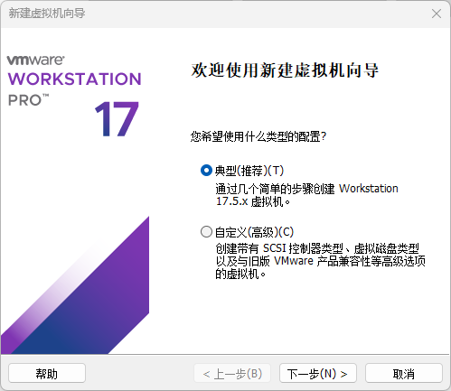

选择稍后安装操作系统

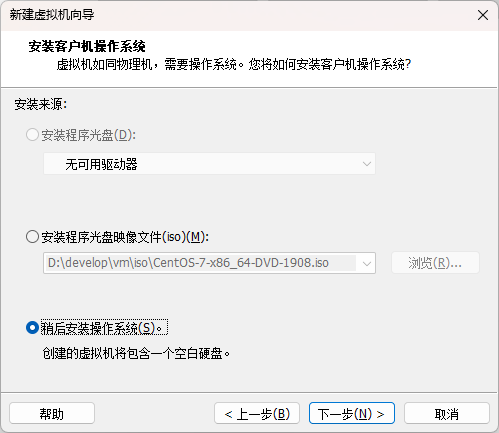

选择 Linux CentOS7

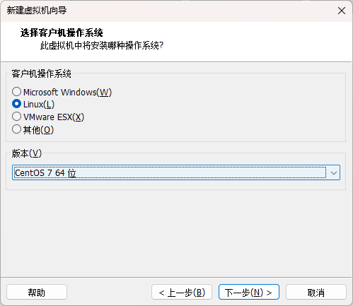

输入虚拟机名称，选择保存位置

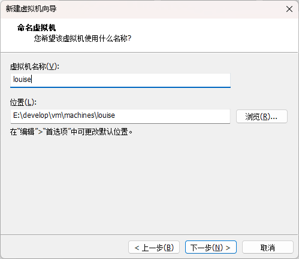

选择将虚拟磁盘存储为单个文件，多个也可以

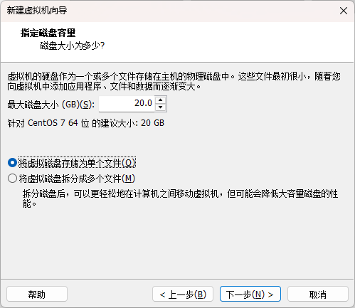

自定义硬件中进行 ISO 映像文件选择

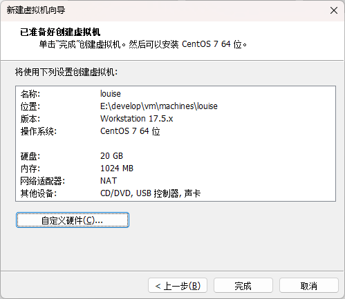

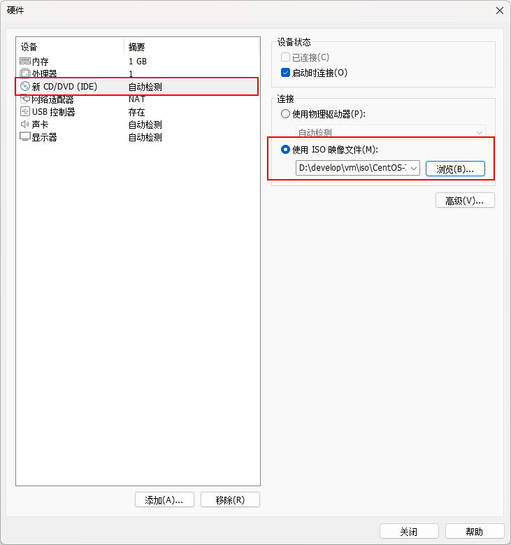

打开虚拟机，选择安装系统

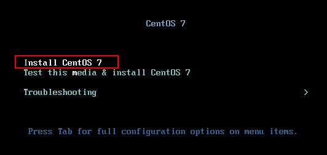

选择安装语言

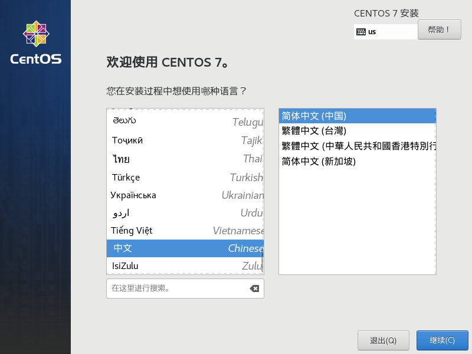

## 1.2、磁盘分区

定义磁盘分区

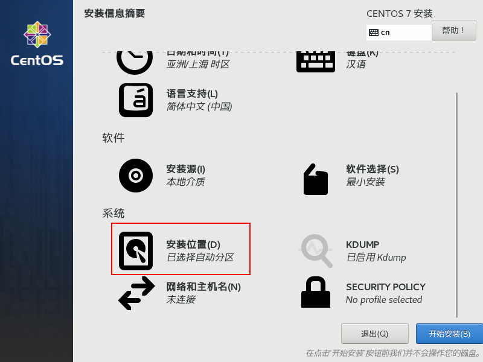

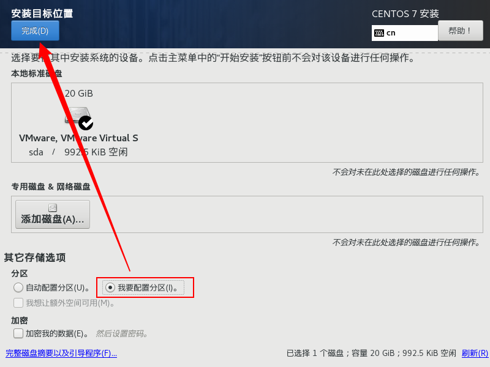

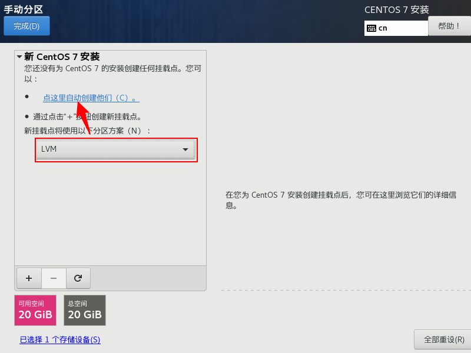

1. **根分区（/）：** 这是 Linux 系统的根目录，包含操作系统的所有文件。建议将根分区分配给足够大小的空间，通常建议至少 20GB，文件类型选择 xfs。
2. **交换分区（swap）：** 这是用于虚拟内存的分区，通常大小为物理内存的 1 到 2 倍。如果你的系统有 8GB 的物理内存，可以考虑设置 8GB 到 16GB 的交换分区，文件类型选择 swap。
3. **/home 分区（可选）：** 这是用户的主目录，建议将用户数据单独分区，这样在系统损坏或需要重装时可以保留用户数据，文件类型选择 ext4。
4. **/boot 分区（可选）：** 一些情况下，会将 /boot 分区独立出来，特别是在使用 UEFI 引导或者硬盘容量较大时。建议分配大约 500MB 到 1GB 的空间。这个大小足够存放 Linux 内核和引导所需的文件，文件类型选择 ext4。
5. **其他分区（可选）：** 还可以根据需要设置其他分区，比如用于存放应用程序或数据的分区。

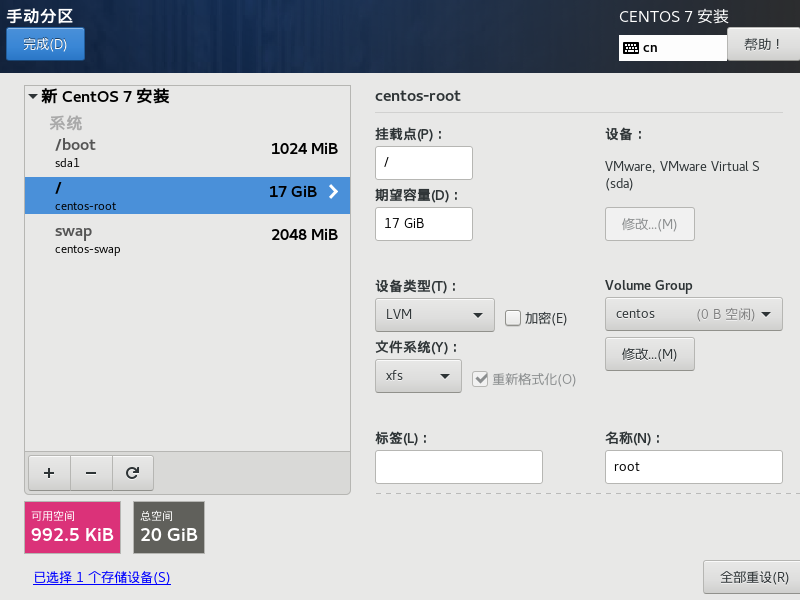

## 1.3、网络配置

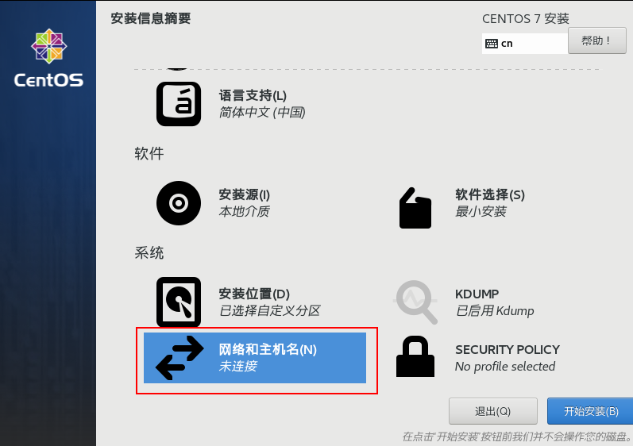

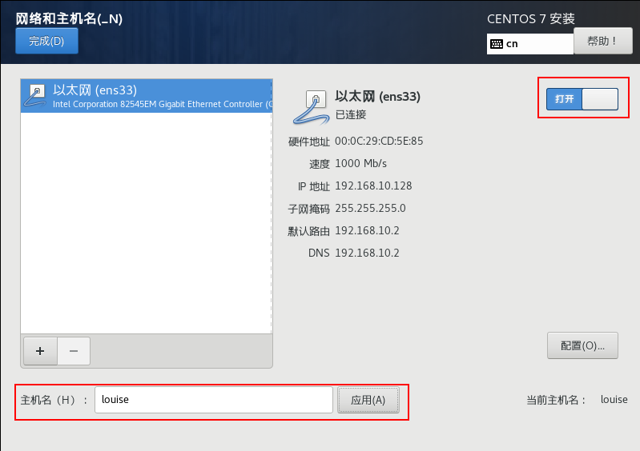

## 1.4、用户设置

配置 ROOT 用户的密码，也可以新建用户

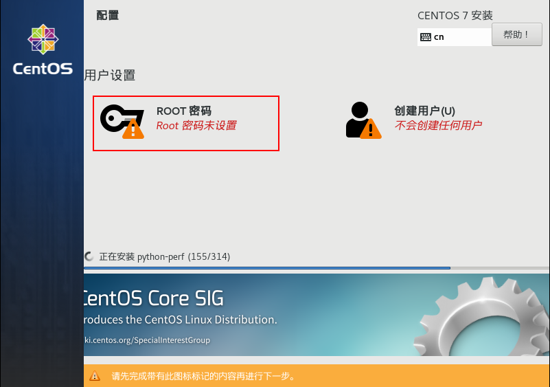

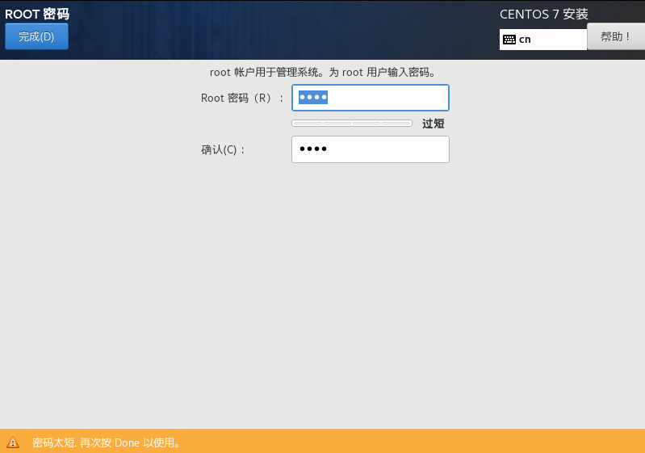

# 2、网络配置

## 2.1、vmware 网络配置

编辑 -> 虚拟网络编辑器，配置 VMnet8 为 NAT模式。

子网IP配置为：192.168.10.0

子网掩码为：255.255.255.0

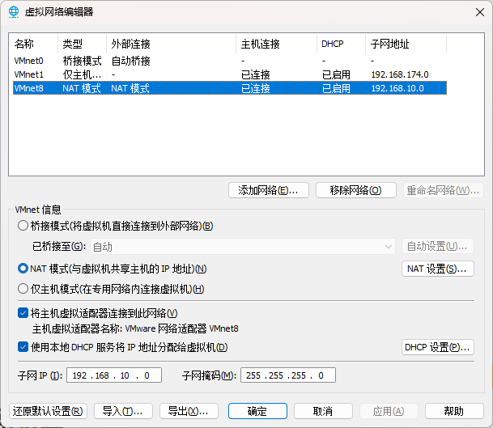

NAT设置中，配置网关IP为：192.168.10.2

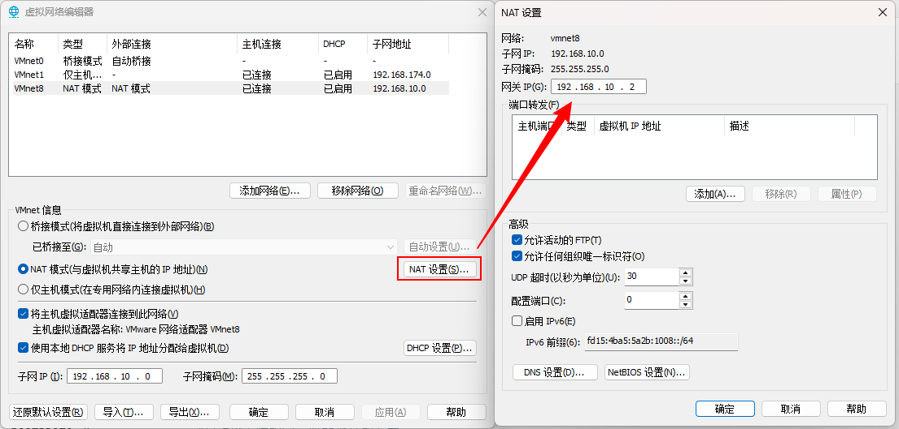

## 2.2、虚拟机网络配置

修改网络配置

```bash
vi /etc/sysconfig/network-scripts/ifcfg-xxx

DEVICE=xxx				#网卡名称
TYPE=Ethernet			#网卡类型以太网
ONBOOT=yes				#是否开机就使用此网卡在我们安装的时候都已经配置好
BOOTPROTO=dhcp			#启动网卡时指定获取IP地址的方式
    常用取值:dhcp（自动获取ip地址,ip地址,网关,子网掩码等信息无需设置）
    常用取值：static（静态ip,如需要访问网络,需要自己设置ip地址等信息）
    其他取值：none（不指定,如需要访问网络,,需要自己设置ip地址等信息）
IPADDR=192.168.10.101 	#ip地址xx请通过虚拟机查看自己的网段,不要随意修改
GATEWAY=192.168.10.2 	#网关
NETMASK=255.255.255.0 	#子网掩码
DNS1=8.8.8.8			#主要dns服务器
DNS2=10.22.0.11
```

修改完成后重启网卡

```bash
service network restart
```

修改主机名称

```bash
vi /etc/hostname
```

如需配置集群，修改hosts

```bash
vim /etc/hosts

192.168.10.100 hadoop100
192.168.10.101 hadoop101
192.168.10.102 hadoop102
192.168.10.103 hadoop103
```

# 3、常用软件安装

## 3.1、修改 yum 源

备份官方源

```bash
cd /etc/yum.repos.d/
mv CentOS-Base.repo CentOS-Base.repo.bak
```

下载阿里云源

```bash
wget -O /etc/yum.repos.d/CentOS-Base.repo http://mirrors.aliyun.com/repo/Centos-7.repo
```

重建源数据缓存

```bash
yum makecache
```

## 3.2、net-tools

net-tools 中包含常用的网络命令，诸如：netstat 、route、 ifconfig 等。

```bash
yum install -y net-tools
```

## 3.3、vim

```bash
yum install -y vim-enhanced
```

## 3.4、wget

```bash
yum -y install wget
```