# Linux基础

## 系统安装

**Centos下载**

[Centos官网](https://centos.org/download/)

架构选择

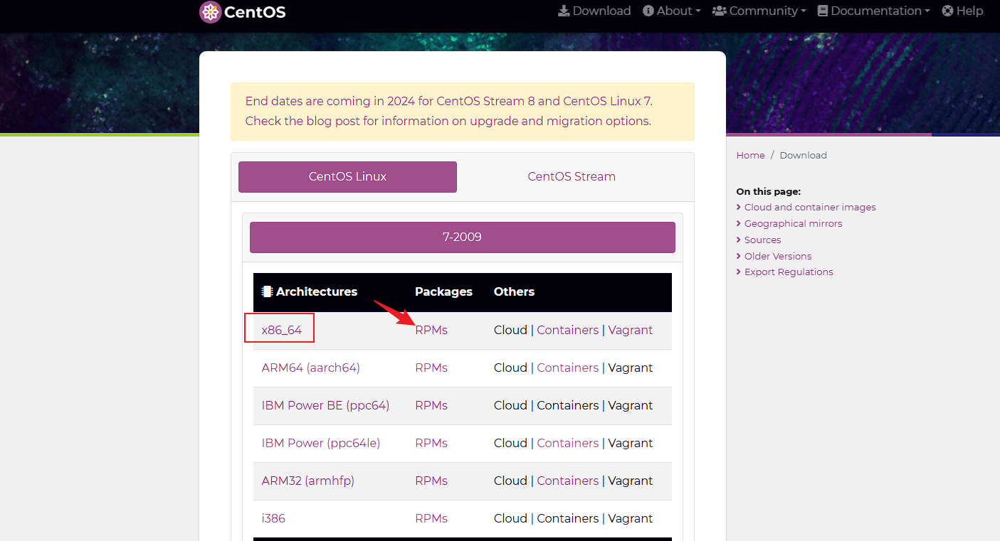

选择isos

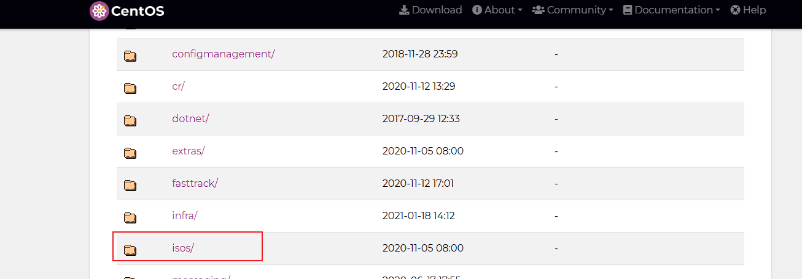

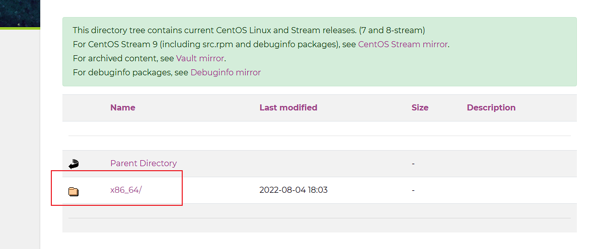

选择代理地址下载

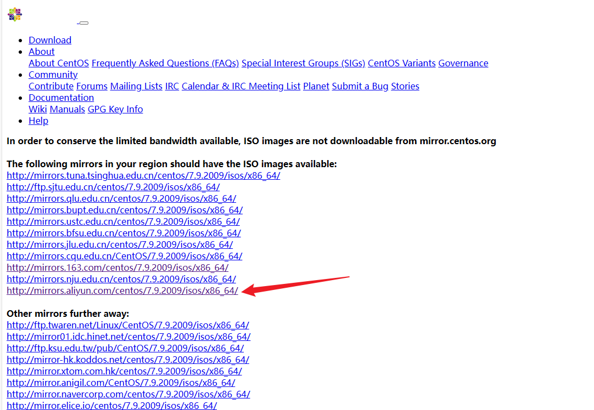

选择镜像并下载

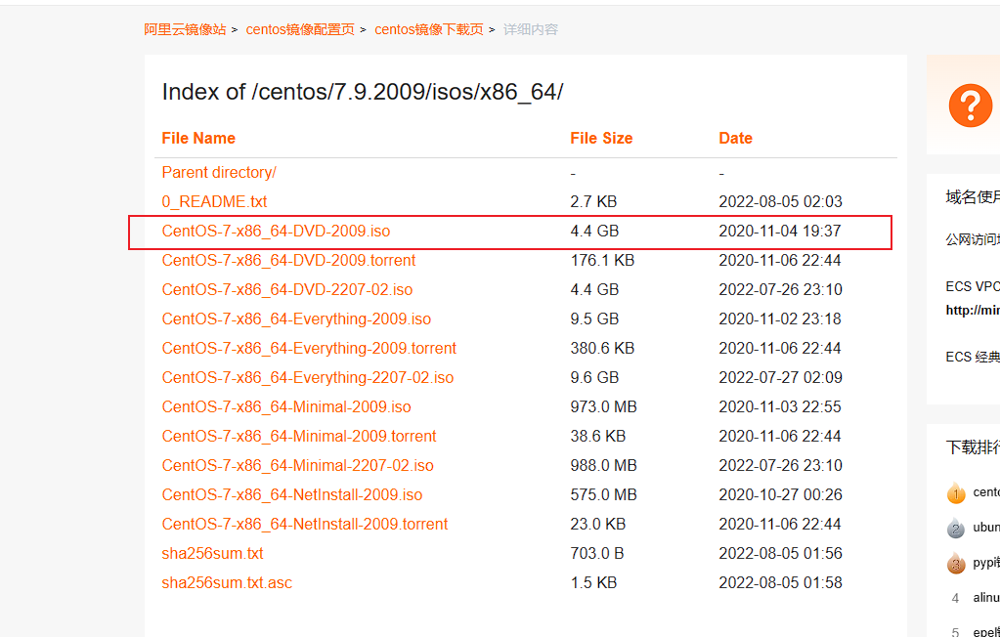

**Ubuntu Server 下载**

[Ubuntu Server 官网](https://ubuntu.com/download/server)

- 生产环境优先选 **LTS**（如 22.04 / 24.04）。
- 与 CentOS 常见差异：默认文件系统 **ext4**（非 xfs）、sudo 组（非 wheel）、防火墙 **ufw**（非 firewalld）、网络 **Netplan**（见下文「静态 IP（Ubuntu / Debian）」）。

**VM安装**

[VM官网](https://www.vmware.com/cn/products/workstation-pro/workstation-pro-evaluation.html)

新建虚拟机


选择稍后安装，不然可能会在Centos安装时直接跳过设置

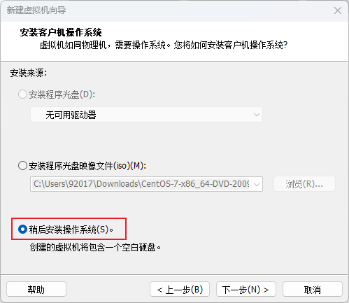

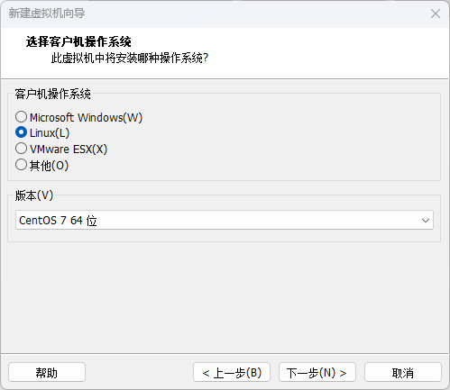

定义名称以及存储位置

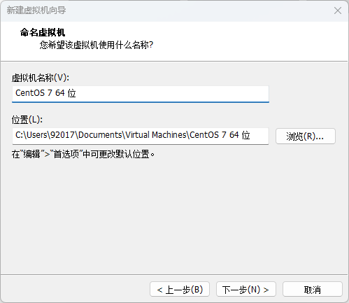

定义最大磁盘大小，单个文件或多个文件都可以


选择ISO文件，并选择NAT网络模式，开启虚拟机并进入

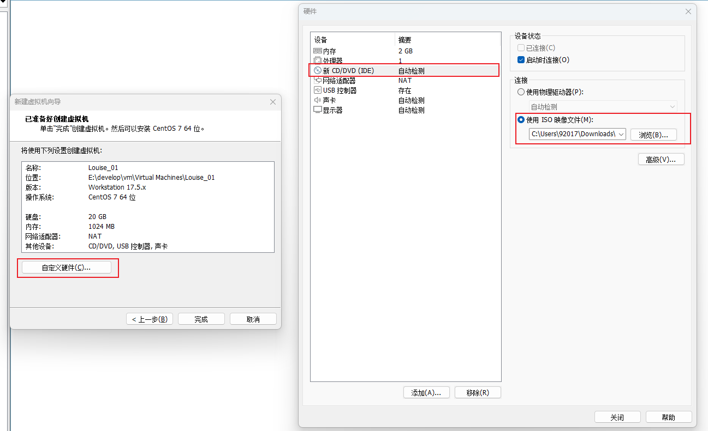

选择语言，一般生产环境为英语，本地可以中文

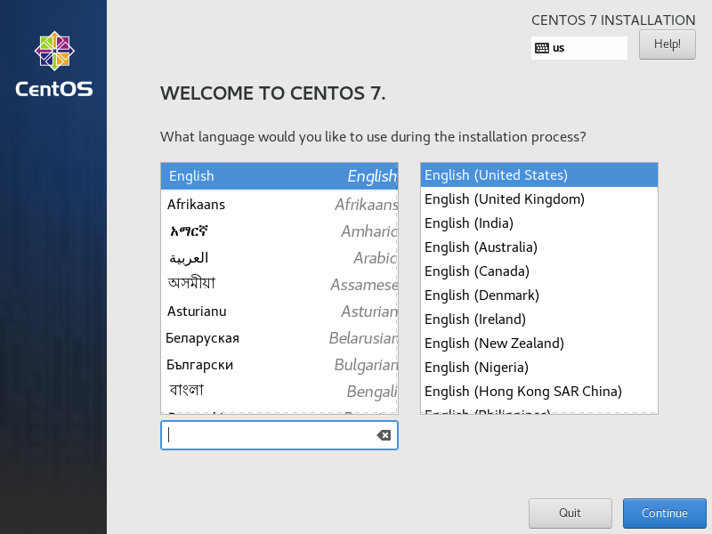

定义磁盘分区

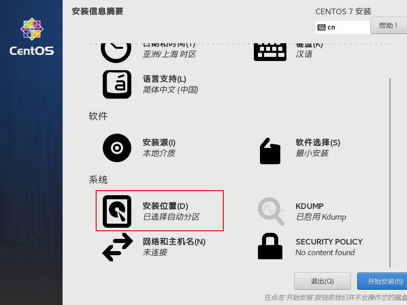


1. **根分区（/）：** 这是 Linux 系统的根目录，包含操作系统的所有文件。建议将根分区分配给足够大小的空间，通常建议至少 20GB。
2. **交换分区（swap）：** 这是用于虚拟内存的分区，通常大小为物理内存的 1 到 2 倍。如果你的系统有 8GB 的物理内存，可以考虑设置 8GB 到 16GB 的交换分区。
3. **/home 分区（可选）：** 这是用户的主目录，建议将用户数据单独分区，这样在系统损坏或需要重装时可以保留用户数据。
4. **/boot 分区（可选）：** 一些情况下，会将 /boot 分区独立出来，特别是在使用 UEFI 引导或者硬盘容量较大时。建议分配大约 500MB 到 1GB 的空间。这个大小足够存放 Linux 内核和引导所需的文件。
5. **其他分区（可选）：** 你还可以根据需要设置其他分区，比如用于存放应用程序或数据的分区。
6. swap文件系统为swap，其他皆为xfs

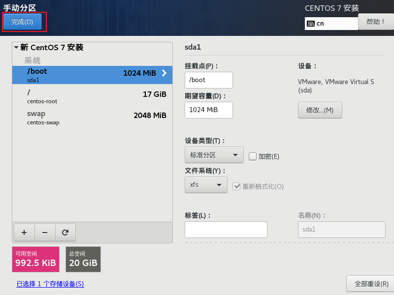

定义网络与主机名，配置完后点击开始安装

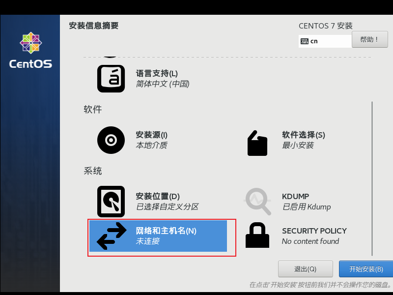

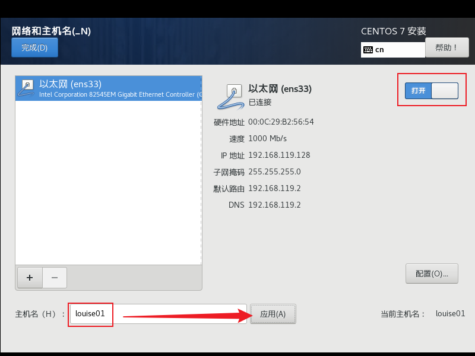

设置root密码，随后等待安装完成

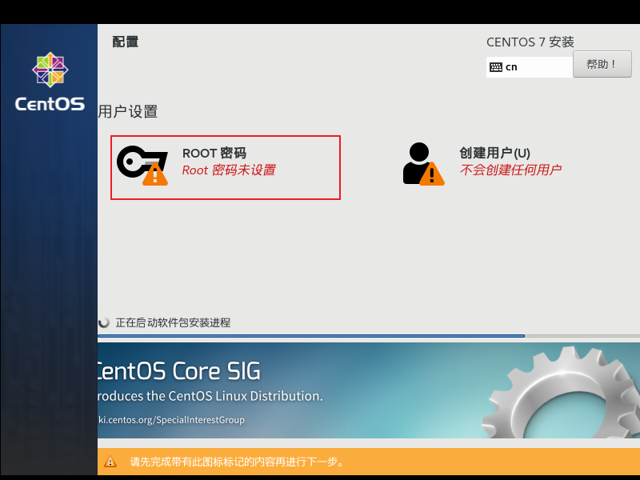

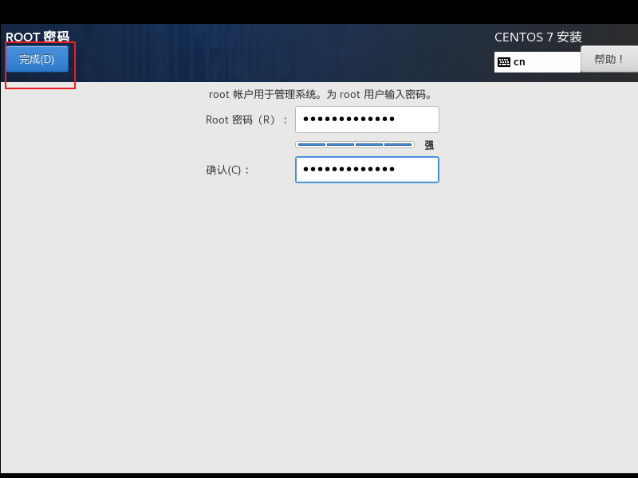

输入账号密码登录


## 目录结构

1. **/bin**：存放系统的基本命令，如ls、cp等。
2. **/boot**：包含启动 Linux 操作系统时所需的文件，如内核文件和引导加载程序。
3. **/dev**：用于存放设备文件（device files），这些设备文件包括硬件设备（比如磁盘、终端、打印机等）和虚拟设备（比如随机数生成器、空设备等）。
4. **/etc**：包含系统的配置文件，如网络配置、用户账号配置等。
5. **/home**：存放普通用户的家目录。
6. **/lib**：存放系统所需的共享库文件。
7. **/media**：用于挂载可移动介质，如光盘、U 盘等。
8. **/mnt**：用于挂载临时文件系统，一般用于挂载其他文件系统的临时挂载点。
9. **/opt**：一般用于存放可选的应用程序软件包。
10. **/proc**：包含系统和进程的信息，以及内核模块的信息。
11. **/root**：root 用户的家目录。
12. **/sbin**：存放系统管理员使用的系统管理程序。
13. **/srv**：存放服务相关的数据。
14. **/sys**：Linux 内核提供的一个虚拟文件系统，用于反映内核的运行状态、设备、驱动程序和内核参数等信息。
15. **/tmp**：用于存放临时文件。
16. **/usr**：包含用户级的应用程序和文件。
17. **/var**：存放经常变化的文件，如日志文件、缓存文件等。

## 硬链接与软链接

**硬链接**

硬链接是指多个文件名指向同一个物理文件的链接。在使用硬链接时，文件系统会为每个链接分配一个索引节点（inode），并将它们都指向同一个数据块。不同的文件名都可以用来访问和修改同一个文件的内容，因为它们指向同一个数据块。删除任何一个链接都不会影响其他链接或原始文件。

**软链接**

软链接是一个特殊的文件，它包含指向另一个文件或目录的路径。它类似于一个快捷方式或符号链接。软链接创建的是一个新的文件，它包含了指向原始文件或目录的路径信息。删除原始文件或目录不会影响软链接的存在，但如果删除软链接本身，则无法再访问原始文件或目录。

**总结**

- 硬链接是多个文件名指向同一个物理文件，它们共享相同的数据块。
- 软链接是一个特殊的文件，它包含了指向另一个文件或目录的路径。
- 在使用时，硬链接只能在同一个文件系统中创建，而软链接可以跨越不同的文件系统。

# 常用操作

> **发行版说明**：下文带 **（CentOS / RHEL）** / **（Ubuntu / Debian）** 的小节仅适用于对应系统；未标注的多为两系通用（如 `systemctl`、`chmod`、`tar`）。

## 环境变量配置

```bash
# 查看所有环境变量
export
# 查看JAVA_HOME
echo $JAVA_HOME

# 方式1
sudo vim /etc/profile
# 添加路径
export JAVA_HOME=/usr/lib/jdk/jdk1.8.0_171
export PATH=${JAVA_HOME}/bin:$PATH
# 执行命令使其生效
source /etc/profile

# 方式2
sudo vim /etc/profile.d/my_env.sh
export JAVA_HOME=/opt/module/jdk1.8.0_212
export PATH=$PATH:$JAVA_HOME/bin
source /etc/profile
```

## 虚拟机 IP 配置

```bash
# VM 中修改 虚拟网络编辑器  NAT 模式 VMnet8 192.168.10.0
# NAT 模式下 网关 192.168.10.2
# Windows 下 VMnet8

IP 192.168.10.1
子网掩码 255.255.255.0
默认网关 192.168.10.2
DNS / 备用 DNS 192.168.10.2、8.8.8.8
```

### 静态 IP（CentOS / RHEL）

```bash
vi /etc/sysconfig/network-scripts/ifcfg-xxx

DEVICE=xxx          # 网卡名称
TYPE=Ethernet
ONBOOT=yes
BOOTPROTO=static    # static 静态；dhcp 自动获取
IPADDR=192.168.10.100
GATEWAY=192.168.10.2
NETMASK=255.255.255.0
DNS1=8.8.8.8
DNS2=10.22.0.11

# 修改完后重启网络（RHEL 8+ 也可用 nmcli）
sudo systemctl restart NetworkManager
# 旧版 CentOS 6/7 可能仍用：
# service network restart

# 若无 ifconfig，安装 net-tools
sudo yum install -y net-tools

# 修改主机名（推荐 hostnamectl，见下文）
sudo hostnamectl set-hostname hadoop100
# 或旧写法：vim /etc/hostname
```

### 静态 IP（Ubuntu / Debian）

Ubuntu 18.04+ 默认用 **Netplan**（配置文件可能在 `/etc/netplan/50-cloud-init.yaml` 或 `01-netcfg.yaml`）。

```bash
# 查看网卡名
ip link

sudo vim /etc/netplan/01-netcfg.yaml
```

```yaml
network:
  version: 2
  ethernets:
    ens33:                    # 改成实际网卡名
      dhcp4: no
      addresses:
        - 192.168.10.100/24
      routes:
        - to: default
          via: 192.168.10.2
      nameservers:
        addresses: [8.8.8.8, 114.114.114.114]
```

```bash
# 校验并生效
sudo netplan try
sudo netplan apply

# 若无 ifconfig
sudo apt update && sudo apt install -y net-tools

# 修改主机名
sudo hostnamectl set-hostname hadoop100
```

### hosts 映射（通用）

```bash
sudo vim /etc/hosts
192.168.10.100 hadoop100
192.168.10.101 hadoop101
192.168.10.102 hadoop102
192.168.10.103 hadoop103
192.168.10.104 hadoop104
```

## 用户管理

```bash
# 创建用户（-m 自动创建家目录）
useradd -m username
# 设置密码
passwd username

# 创建用户并指定主组、附加组（-g 主组，-G 附加组，多个用逗号分隔）
# CentOS / RHEL：sudo 权限用 wheel 组
useradd -m -g dev -G wheel,docker username
# Ubuntu / Debian：sudo 权限用 sudo 组（不用 wheel）
# useradd -m -g dev -G sudo,docker username
passwd username

# 创建用户组
groupadd dev

# 查看用户信息
id username
cat /etc/passwd | grep username
groups username

# 修改用户所属主组（-g 修改主组）
usermod -g dev username

# 追加附加组（-aG 追加，不加 -a 会覆盖原有附加组）
usermod -aG wheel username      # CentOS / RHEL
# usermod -aG sudo username     # Ubuntu / Debian

# 修改用户家目录或登录 Shell
usermod -d /home/newhome username
usermod -s /bin/bash username

# 修改文件/目录所属用户和所属组
chown user:group file.txt
chown user file.txt          # 只改所属用户
chown :group file.txt        # 只改所属组
chown -R user:group /path/   # 递归修改目录

# 修改文件/目录所属组
chgrp group file.txt
chgrp -R group /path/

# 修改文件权限
chmod 755 script.sh          # 数字方式：rwxr-xr-x
chmod u+x script.sh          # 给所属用户添加执行权限
chmod -R 644 /path/          # 递归修改

# 锁定/解锁用户
usermod -L username          # 锁定
usermod -U username          # 解锁

# 删除用户（-r 同时删除家目录和邮件）
userdel -r username
```

## SSH 无密码登录配置

```bash
# 1. 本地生成密钥对（一路回车即可，也可设置 passphrase）
ssh-keygen -t rsa -b 4096 -C "your_email@example.com"
# 默认生成 ~/.ssh/id_rsa（私钥）和 ~/.ssh/id_rsa.pub（公钥）

# 2. 将公钥复制到远程主机（推荐）
ssh-copy-id user@192.168.1.100
# 指定端口
ssh-copy-id -p 2222 user@192.168.1.100

# 3. 手动复制公钥（ssh-copy-id 不可用时）
cat ~/.ssh/id_rsa.pub | ssh user@192.168.1.100 "mkdir -p ~/.ssh && cat >> ~/.ssh/authorized_keys"
# 或在远程主机执行
mkdir -p ~/.ssh
chmod 700 ~/.ssh
echo "公钥内容" >> ~/.ssh/authorized_keys
chmod 600 ~/.ssh/authorized_keys

# 4. 远程主机 SSH 服务配置（/etc/ssh/sshd_config）
PubkeyAuthentication yes
AuthorizedKeysFile .ssh/authorized_keys
# 修改后重启 SSH 服务
sudo systemctl restart sshd       # CentOS / RHEL 常见
# sudo systemctl restart ssh    # Ubuntu 部分版本服务名为 ssh

# 5. 测试无密码登录
ssh user@192.168.1.100
ssh -p 2222 -i ~/.ssh/id_rsa user@192.168.1.100
```

## 创建 Swap

云服务器或安装时未划分 Swap 分区时，常用 **Swap 文件** 方式补充虚拟内存。

**容量建议**

| 物理内存 | Swap 建议 |
| :------- | :-------- |
| ≤ 2G     | 2G        |
| 2G ~ 8G  | 与内存相同 |
| ≥ 8G     | 4G ~ 8G（Java 服务一般够用） |

```bash
# 1. 查看当前 Swap 状态
free -h
swapon --show

# 2. 创建 Swap 文件（示例 4G，按上表调整 count 数值）
# count=4096 表示 4096MB = 4G
sudo dd if=/dev/zero of=/swapfile bs=1M count=4096 status=progress
# 或使用 fallocate（部分文件系统更快）
# sudo fallocate -l 4G /swapfile

# 3. 设置权限（必须为 600，否则存在安全风险）
sudo chmod 600 /swapfile

# 4. 格式化为 Swap 分区
sudo mkswap /swapfile

# 5. 立即启用
sudo swapon /swapfile

# 6. 验证是否生效
free -h
swapon --show

# 7. 写入 /etc/fstab，开机自动挂载
echo '/swapfile none swap defaults 0 0' | sudo tee -a /etc/fstab

# 8. 可选：调整 swappiness（0~100，默认 30，值越大越倾向使用 Swap）
# Java 服务建议 10~30，减少不必要的磁盘换页
cat /proc/sys/vm/swappiness
sudo sysctl vm.swappiness=10
echo 'vm.swappiness=10' | sudo tee -a /etc/sysctl.conf
```

**关闭或删除 Swap（如需重建）**

```bash
# 关闭 Swap
sudo swapoff /swapfile

# 删除 fstab 中对应行后，删除文件
sudo rm -f /swapfile
sudo vim /etc/fstab   # 删除 /swapfile 那一行
```

## 集群分发脚本

```bash
# 在环境变量下创建脚本
vim xsync

# 编写脚本内容
#!/bin/bash
#1. 判断参数个数
if [ $# -lt 1 ]
then
    echo Not Enough Arguement!
    exit;
fi
#2. 遍历集群所有机器
for host in hadoop102 hadoop103 hadoop104
do
    echo ====================  $host  ====================
    #3. 遍历所有目录，挨个发送
    for file in $@
    do
        #4. 判断文件是否存在
        if [ -e $file ]
            then
                #5. 获取父目录
                pdir=$(cd -P $(dirname $file); pwd)
 
                #6. 获取当前文件的名称
                fname=$(basename $file)
                ssh $host "mkdir -p $pdir"
                rsync -av $pdir/$fname $host:$pdir
            else
                echo $file does not exists!
        fi
    done
done

# 修改执行权限
chmod +x xsync
# 执行脚本
sudo ./xsync /etc/profile.d/my_env.sh
```

## 部署 java 服务

```bash
nohup：后台运行
> logs/xxx.log：输出重定向到文件
>>：追加到文件
>：覆盖到文件
> /dev/null：丢弃日志
2>&1：将标准出错重定向到标准输出
&：后台运行

# 部署服务并追加输出日志
nohup java -jar xxx.jar > logs/baic-hgz.log 2>&1 &

# 部署服务并覆盖输出日志
nohup java -jar xxx.jar > logs/baic-hgz.log 2>&1 &

# 丢弃日志 一般配置 logback 丢弃
nohup java -jar xxx.jar > /dev/null 2>&1 &


# 重启脚本
ps -ef | grep xxx.jar | grep -v grep  | awk '{print $2;}' | xargs kill -9
mv /usr/local/xxx/logs/xxx.log /usr/local/xxx/logs/xxx$(date +'%Y-%m-%d_%H-%M-%S').log
nohup java -jar xxx.jar > /usr/local/xxx/logs/xxx.log 2>&1 &
```

## 查找正在运行的 Nginx

```bash
# 查看nginx的PID，以常用的80端口为例
netstat -lntup|grep 80
tcp 0 0 0.0.0.0:80 0.0.0.0:* LISTEN 13309/nginx
# 可以知道nginx进程是13309

# 通过相应的进程ID(比如：13309)查询当前运行的nginx路径
ll /proc/13309/exe

# 获取到nginx的执行路径后，使用-t参数即可获取该进程对应的配置文件路径
/usr/local/nginx/sbin/nginx -t
nginx: the configuration file /usr/local/nginx/conf/nginx.conf syntax is ok
nginx: configuration file /usr/local/nginx/conf/nginx.conf test is successful

# 查看位置
whereis nginx
```

## Java 服务注册 systemd

比 `nohup` 更规范：支持开机自启、异常自动重启、统一用 `systemctl` 管理。

**方式一：专用 app 用户运行（生产推荐）**

权限最小化，进程不以 root 运行，更安全。

```bash
# 1. 创建专用用户和应用目录
sudo useradd -r -s /sbin/nologin app    # -r 系统用户，不可登录
sudo mkdir -p /opt/app/logs
sudo chown -R app:app /opt/app

# 2. 上传 jar 包并授权
sudo cp app.jar /opt/app/
sudo chown app:app /opt/app/app.jar

# 3. 编写 systemd 服务文件
sudo vim /etc/systemd/system/app.service
```

```ini
[Unit]
Description=Java Application
After=network.target

[Service]
Type=simple
User=app
Group=app
WorkingDirectory=/opt/app
ExecStart=/usr/lib/jdk/bin/java -jar /opt/app/app.jar
Restart=on-failure
RestartSec=10
Environment=JAVA_HOME=/usr/lib/jdk
Environment=SPRING_PROFILES_ACTIVE=prod

[Install]
WantedBy=multi-user.target
```

**方式二：root 用户运行（测试/内网简单部署）**

无需创建用户，配置更简单，但**不建议生产环境**使用。

```bash
# 1. 创建应用目录
sudo mkdir -p /opt/app/logs

# 2. 上传 jar 包
sudo cp app.jar /opt/app/

# 3. 编写 systemd 服务文件（不写 User/Group，默认 root 运行）
sudo vim /etc/systemd/system/app.service
```

```ini
[Unit]
Description=Java Application
After=network.target

[Service]
Type=simple
WorkingDirectory=/opt/app
ExecStart=/usr/lib/jdk/bin/java -jar /opt/app/app.jar
Restart=on-failure
RestartSec=10
Environment=JAVA_HOME=/usr/lib/jdk
Environment=SPRING_PROFILES_ACTIVE=prod

[Install]
WantedBy=multi-user.target
```

| 对比 | app 用户 | root 用户 |
| :--- | :------- | :-------- |
| 安全性 | 高，权限隔离 | 低，进程被攻破影响整台机器 |
| 配置复杂度 | 需建用户、chown | 简单，直接部署 |
| 适用场景 | 生产环境 | 本地测试、临时内网部署 |
| service 文件 | 需写 `User=app` `Group=app` | 省略 User/Group 即可 |

**启动与管理（两种方式通用）**

```bash
# 重载配置并启动
sudo systemctl daemon-reload
sudo systemctl start app
sudo systemctl enable app        # 开机自启

# 常用管理命令
sudo systemctl status app        # 查看状态
sudo systemctl stop app          # 停止
sudo systemctl restart app       # 重启
sudo journalctl -u app -f        # 查看日志（实时）
sudo journalctl -u app -n 200    # 查看最近 200 行
```

## 磁盘扩容 / 挂载数据盘

云服务器新购数据盘或扩容后，常见操作流程如下。

**场景一：挂载新数据盘（最常见）**

```bash
# 1. 查看磁盘
lsblk
fdisk -l

# 2. 分区（以 /dev/vdb 为例，GPT 分区）
sudo fdisk /dev/vdb
# 输入 n 新建分区 → 回车默认 → w 保存

# 3. 格式化
# CentOS / RHEL 常用 xfs：
sudo mkfs.xfs /dev/vdb1
# Ubuntu / Debian 常用 ext4：
# sudo mkfs.ext4 /dev/vdb1

# 4. 创建挂载点并挂载
sudo mkdir -p /data
sudo mount /dev/vdb1 /data

# 5. 写入 /etc/fstab 开机自动挂载（先 UUID 更稳妥）
sudo blkid /dev/vdb1
# CentOS / RHEL（xfs）：
# echo 'UUID=xxxx-xxxx /data xfs defaults 0 0' | sudo tee -a /etc/fstab
# Ubuntu / Debian（ext4）：
# echo 'UUID=xxxx-xxxx /data ext4 defaults 0 0' | sudo tee -a /etc/fstab

# 6. 验证
df -h /data
mount -a    # 测试 fstab 配置是否正确
```

**场景二：云盘在线扩容（已有分区扩大）**

```bash
# 1. 控制台扩容磁盘后，让内核重新识别
echo 1 | sudo tee /sys/class/block/vdb/device/rescan
lsblk    # 确认磁盘容量已变大

# 2. 扩展分区
# CentOS：yum install -y cloud-utils-growpart
# Ubuntu：apt install -y cloud-guest-utils
sudo growpart /dev/vdb 1

# 3. 扩展文件系统
# CentOS / RHEL（xfs）：
sudo xfs_growfs /data
# Ubuntu / Debian（ext4，分区设备或挂载点均可）：
# sudo resize2fs /dev/vdb1

# 4. 验证
df -h /data
```

## 端口占用排查与释放

```bash
# 1. 查看端口占用（三选一）
lsof -i :8080
ss -lntup | grep :8080
netstat -lntup | grep :8080    # 需 root 才显示 PID

# 2. 根据 PID 终止进程
kill -9 PID

# 3. 一行命令查并杀（推荐）
kill -9 $(lsof -t -i:8080)

# 4. 直接释放端口
fuser -k 8080/tcp

# 5. 先预览会杀哪些进程（不真正执行）
fuser -v 8080/tcp
```

**注意**

- `grep 8080` 可能误匹配 18080 等端口，建议用 `grep ':8080'`
- `netstat -an` 只能看连接状态，**看不到 PID**，排查占用需加 `-p` 或用 `lsof`/`ss`

## 日志清理与轮转

**手动清理**

```bash
# 1. 查看日志占用
du -sh /var/log/*
du -sh /opt/app/logs/*

# 2. 查找大文件
find /var/log -type f -size +100M
find /opt/app/logs -name "*.log" -mtime +7    # 7 天前的日志

# 3. 删除旧日志（确认后再删）
find /opt/app/logs -name "*.log" -mtime +30 -delete
find /opt/app/logs -name "*.log.gz" -mtime +90 -delete

# 4. 清空当前日志（不删文件，避免进程句柄丢失）
> /opt/app/logs/app.log
# 或
truncate -s 0 /opt/app/logs/app.log
```

**logrotate 自动轮转（系统日志 / 应用日志）**

```bash
# 查看 logrotate 配置
cat /etc/logrotate.conf
ls /etc/logrotate.d/

# 为 Java 应用添加轮转配置
sudo vim /etc/logrotate.d/app
```

```
/opt/app/logs/*.log {
    daily
    rotate 30
    compress
    delaycompress
    missingok
    notifempty
    copytruncate
}
```

```bash
# 测试配置是否正确
sudo logrotate -d /etc/logrotate.d/app

# 手动执行一次轮转
sudo logrotate -f /etc/logrotate.d/app
```

| 参数 | 说明 |
| :--- | :--- |
| `daily/weekly` | 轮转周期 |
| `rotate 30` | 保留 30 份 |
| `compress` | 压缩旧日志 |
| `copytruncate` | 复制后清空原文件（适合 Java 进程持续写同一日志文件） |

## hosts 与域名解析

`/etc/hosts` 优先级高于 DNS，常用于内网集群、测试环境域名映射。

```bash
# 1. 编辑 hosts
sudo vim /etc/hosts

# 2. 添加映射（IP  域名，一个 IP 可对应多个域名）
192.168.10.100  hadoop100
192.168.10.101  hadoop101
192.168.1.10    api.test.com
192.168.1.10    db.test.com

# 3. 验证
ping hadoop100
ping api.test.com
getent hosts api.test.com
```

**常见用途**

| 场景 | 示例 |
| :--- | :--- |
| 集群节点互通 | Hadoop/K8s 节点 hostname 映射 |
| 内网服务调用 | 微服务联调，绕过 DNS |
| 本地测试 | 将域名指向测试服务器 IP |

**注意**

- hosts 修改立即生效，无需重启
- 生产环境长期域名应走 DNS，hosts 适合临时/内网场景
- 若用了 Nginx 反向代理，hosts 里填的是**后端真实 IP**，不是 Nginx 地址

# 故障排查

## CPU/内存飙高排查

通用排查流程，适用于 Nginx、MySQL、Redis 及各类进程。

```bash
# 1. 快速查看系统负载和内存
uptime                       # 1/5/15 分钟 load average
free -h                      # 关注 available，不只看 free
top                          # 按 P 按 CPU 排序，按 M 按内存排序

# 2. 定位高占用进程
ps aux --sort=-%cpu | head -20
ps aux --sort=-%mem | head -20
top -c                       # 显示完整命令，便于识别进程

# 3. 查看某进程详情（假设 PID 为 12345）
top -Hp 12345                # 查看进程下各线程 CPU 占用
cat /proc/12345/status       # 进程内存详情（VmRSS 等）
ls -l /proc/12345/fd | wc -l # 打开的文件描述符数量

# 4. load 高但 CPU 不高 → 可能是 I/O 或内存问题
vmstat 1 5                   # 看 wa（I/O 等待）、si/so（swap）
iostat -x 1 5                # 看磁盘 %util 是否打满
```

**按进程类型处理**

| 进程类型 | 进一步排查 |
| :------- | :--------- |
| Nginx | `top -Hp PID` 看 worker 线程；查 access/error 日志是否有异常流量 |
| MySQL | `show processlist;` 看慢 SQL；`top -Hp PID` 看是否单线程飙高 |
| Redis | `redis-cli info` 看内存；`redis-cli --bigkeys` 查大 key |
| 未知进程 | `ls -l /proc/PID/exe` 查可执行文件路径；`cat /proc/PID/cmdline` 看启动命令 |
| 僵尸/异常 | `ps aux | grep defunct` 查僵尸进程；必要时 `kill -9 PID` |

**排查思路**

1. `top` / `ps` 找到高占用 PID 和进程名
2. CPU 高 → `top -Hp PID` 定位具体线程，结合业务日志
3. 内存高 → `free -h` 看 available；`top` 看 RES 列确认是哪个进程
4. load 高、CPU 不高 → 查 I/O（`iostat`）或内存不足导致 swap（`vmstat` 的 si/so）
5. 确认问题进程后，重启服务或扩容，再查根因

## Java 服务 CPU/内存飙高排查

在通用排查定位到 Java 进程后，使用 JDK 工具进一步分析（假设 PID 为 12345）。

**CPU 飙高**

```bash
jps -l                                    # 确认 Java 进程及 jar 包
top -Hp 12345                             # 找到 CPU 最高的线程 ID
printf "%x\n" 线程ID                      # 线程 ID 转 16 进制
jstack 12345 | grep -A 30 16进制线程ID    # 定位具体代码栈

# 若 jstack 多次输出相同栈 → 可能死循环或频繁 Full GC
jstack 12345 > jstack1.txt
sleep 5
jstack 12345 > jstack2.txt
diff jstack1.txt jstack2.txt
```

**内存飙高 / OOM**

```bash
free -h                                   # 系统内存概况
jmap -heap 12345                          # 堆内存配置与使用情况
jmap -histo:live 12345 | head -30         # 存活对象数量 Top 30

# OOM 后若生成了 dump 文件
jhat dump.hprof                           # 分析堆转储（或用 MAT 工具）
```

**频繁 GC**

```bash
jstat -gcutil 12345 1000 10               # 每 1 秒输出 GC 统计，共 10 次
# 关注 YGC、FGC 频率，FGC 频繁说明老年代压力大
```

**排查思路**

| 现象 | 可能原因 | 处理方向 |
| :--- | :------- | :------- |
| 某线程 CPU 100% | 死循环、正则回溯、无限递归 | jstack 定位代码修复 |
| CPU 不高但 load 高 | Full GC 频繁 | jstat 确认，调堆大小或查内存泄漏 |
| 内存持续增长 | 内存泄漏、缓存无上限 | jmap -histo 找大对象，dump 分析 |
| 突然 OOM 退出 | 堆太小、大对象、连接泄漏 | 看 `-Xmx` 配置和 dump 文件 |

## 磁盘满排查

```bash
# 1. 查看各分区使用率
df -h

# 2. 定位哪个目录占用大（从根目录逐层查）
du -sh /* 2>/dev/null | sort -hr | head -20
du -sh /var/* 2>/dev/null | sort -hr | head -20
du -sh /opt/* 2>/dev/null | sort -hr | head -20

# 3. 查找大文件
find / -type f -size +500M 2>/dev/null
find /var/log -type f -size +100M

# 4. 常见占用来源
du -sh /var/log/*            # 系统/应用日志
du -sh /tmp/*                # 临时文件
docker system df             # Docker 镜像/容器（若使用 Docker）

# 5. 清理后确认 inode（文件数满了也会报 No space left）
df -i
```

**常见原因**

| 目录 | 原因 |
| :--- | :--- |
| `/var/log` | 日志未轮转，疯狂增长 |
| `/opt/app/logs` | Java 应用日志未清理 |
| `/tmp` | 临时文件未删 |
| 已删除但未释放 | 进程仍占用已删文件，`lsof | grep deleted` 查 PID 后重启进程 |

## 服务启动失败排查

```bash
# 1. 查看服务状态和最近报错
sudo systemctl status app
sudo journalctl -u app -xe
sudo journalctl -u app -n 100 --no-pager

# 2. 检查配置文件语法
# Nginx
sudo nginx -t
# Java 应用配置
java -jar app.jar --spring.config.location=...   # 本地试跑

# 3. 检查端口是否被占用
ss -lntup | grep :8080
lsof -i :8080

# 4. 检查权限与目录
ls -la /opt/app/
ls -la /opt/app/logs/
id app                       # systemd User= 指定的用户是否有权限

# 5. 手动前台启动（看完整报错）
cd /opt/app
java -jar app.jar

# 6. 检查依赖服务是否就绪
systemctl status mysql
systemctl status redis
ping db-host
telnet db-host 3306
```

**排查顺序**

1. `systemctl status` → 看 Failed 原因和最后几行日志
2. `journalctl -u xxx -xe` → 详细错误栈
3. 端口冲突 / 权限不足 / 配置文件错误 → 逐项排除
4. 前台 `java -jar` 启动 → 最直接看报错

## Too many open files

Java 高并发或连接泄漏时常见，表现为 `Too many open files`。

```bash
# 1. 查看当前进程限制
ulimit -n
cat /proc/PID/limits | grep "open files"

# 2. 查看系统级已打开文件数
cat /proc/sys/fs/file-nr
lsof | wc -l

# 3. 查看某进程打开了哪些文件
lsof -p PID | wc -l
lsof -p PID | head -50

# 4. 临时调大当前会话限制
ulimit -n 65535

# 5. 永久修改（/etc/security/limits.conf）
sudo vim /etc/security/limits.conf
```

```
* soft nofile 65535
* hard nofile 65535
app soft nofile 65535
app hard nofile 65535
```

```bash
# 6. systemd 服务单独配置（/etc/systemd/system/app.service）
# 在 [Service] 段添加：
# LimitNOFILE=65535
sudo systemctl daemon-reload
sudo systemctl restart app

# 7. 系统级上限（/etc/sysctl.conf）
fs.file-max = 655350
# 生效
sudo sysctl -p
```

**排查思路**

1. 先确认是**单进程限制**还是**系统总限制**触顶
2. `lsof -p PID` 看是否连接未关闭（Java 连接池泄漏）
3. 临时 `ulimit -n` 应急，生产用 `limits.conf` + systemd `LimitNOFILE` 永久生效
4. 重新登录或重启服务后验证：`ulimit -n`

# Linux命令

## 磁盘管理

### cd 目录操作

**语法**

`cd [目录路径]`

**目录路径**

| 参数     | 说明                 |
| :------- | :------------------- |
| (无参数) | 切换到用户主目录     |
| `-`      | 切换到上一个工作目录 |
| `~`      | 代表用户主目录       |

**示例**

| 场景       | 命令                | 说明                 |
| :--------- | :------------------ | :------------------- |
| 回家目录   | `cd` 或 `cd ~`      | 返回当前用户的主目录 |
| 上一级目录 | `cd ..`             | 切换到上级目录       |
| 上上次目录 | `cd -`              | 在两个目录间切换     |
| 绝对路径   | `cd /usr/local/bin` | 使用绝对路径切换     |
| 相对路径   | `cd project/src`    | 使用相对路径切换     |

### mkdir 创建目录

**语法**

`mkdir [选项] <目录名>`

**选项**

| 参数 | 说明               |
| :--- | :----------------- |
| `-p` | 递归创建目录       |
| `-m` | 设置目录的权限模式 |
| `-v` | 显示创建的目录信息 |

**示例**

| 场景           | 命令                     | 说明                        |
| :------------- | :----------------------- | :-------------------------- |
| 创建单个目录   | `mkdir project`          | 在当前目录创建project文件夹 |
| 递归创建目录   | `mkdir -p src/main/java` | 创建多级目录结构            |
| 创建带权限目录 | `mkdir -m 755 config`    | 创建权限为755的目录         |
| 创建多个目录   | `mkdir dir1 dir2 dir3`   | 一次性创建多个目录          |
| 显示创建信息   | `mkdir -v new_dir`       | 创建并显示操作信息          |

### rm 删除文件或目录

**语法**

`rm [选项] <文件或目录>`

**选项**

| 参数         | 说明                   |
| :----------- | :--------------------- |
| `-r` 或 `-R` | 递归删除目录及其内容   |
| `-f`         | 强制删除，不提示       |
| `-i`         | 交互式删除，删除前确认 |
| `-v`         | 显示删除过程           |

**示例**

| 场景     | 命令               | 说明                   |
| :------- | :----------------- | :--------------------- |
| 删除文件 | `rm file.txt`      | 删除单个文件           |
| 递归删除 | `rm -r directory/` | 删除目录及其内容       |
| 强制删除 | `rm -rf temp/`     | 强制删除，不提示       |
| 交互删除 | `rm -i *.log`      | 删除每个文件前确认     |
| 安全删除 | `rm -I *.tmp`      | 删除多个文件前确认一次 |

### rmdir 删除空目录

**功能描述**：删除空的目录。

**语法**

`rmdir [选项] <目录名>`

**选项**

| 参数                         | 说明                       |
| :--------------------------- | :------------------------- |
| `-p`                         | 递归删除空目录             |
| `-v`                         | 显示删除过程的详细信息     |
| `--ignore-fail-on-non-empty` | 忽略因目录非空而产生的错误 |

**示例**

| 场景       | 命令                   | 说明               |
| :--------- | :--------------------- | :----------------- |
| 删除空目录 | `rmdir empty_dir`      | 删除一个空目录     |
| 递归删除   | `rmdir -p a/b/c`       | 递归删除空目录结构 |
| 显示详情   | `rmdir -v temp_dir`    | 显示删除的详细信息 |
| 删除多个   | `rmdir dir1 dir2 dir3` | 删除多个空目录     |

### pwd 显示工作目录

**功能描述**： 显示当前所在目录。

**语法**

`pwd`

### ls 展示目录

**语法**

` ls [选项] [文件或目录]` 

ll 是 ls -l 命令的别名

**选项**

| 参数 | 说明                                                         |
| :--- | :----------------------------------------------------------- |
| `-a` | 显示所有文件，包括隐藏文件                                   |
| `-d` | 只列出目录（不递归列出目录内的文件）                         |
| `-l` | 以长格式显示文件和目录信息，包括权限、所有者、大小、创建时间等 |
| `-h` | 与 `-l` 一起使用，以人类易读格式显示大小                     |
| `-t` | 按修改时间排序                                               |
| `-r` | 倒序显示文件和目录                                           |
| `-S` | 按文件大小排序                                               |
| `-R` | 递归显示目录中的所有文件和子目录                             |

**示例**

| 场景         | 命令       | 说明                                         |
| :----------- | :--------- | :------------------------------------------- |
| 详细列表     | `ls -l`    | 显示文件权限、大小、时间等详细信息           |
| 显示隐藏文件 | `ls -a`    | 显示当前目录中的所有文件和目录，包括隐藏文件 |
| 人性化显示   | `ls -lh`   | 文件大小显示为 K, M, G 单位                  |
| 按时间排序   | `ls -lt`   | 最新修改的文件排在最前                       |
| 递归显示     | `ls -R`    | 递归显示子目录内容                           |
| 模糊匹配     | `ls *.txt` | 列出所有扩展名为.txt的文件                   |

### df 磁盘空间检查

**功能描述**：显示文件系统的磁盘空间使用情况。

**语法**

`df [选项] [文件或目录]`

**选项**

| 参数 | 说明               |
| :--- | :----------------- |
| `-h` | 以人类易读格式显示 |
| `-T` | 显示文件系统类型   |
| `-i` | 显示inode使用情况  |
| `-l` | 只显示本地文件系统 |
| `-a` | 显示所有文件系统   |

**示例**

| 场景       | 命令          | 说明                 |
| :--------- | :------------ | :------------------- |
| 基本查看   | `df`          | 显示磁盘使用情况     |
| 人性化显示 | `df -h`       | 以G、M单位显示       |
| 显示类型   | `df -Th`      | 显示文件系统类型     |
| inode信息  | `df -i`       | 查看inode使用情况    |
| 指定目录   | `df -h /home` | 查看指定目录所在分区 |

### du 目录空间检查

**功能描述**：显示目录或文件的磁盘使用情况。

**语法**

`du [选项] [文件或目录]`

**选项**

| 参数                    | 说明                       |
| :---------------------- | :------------------------- |
| `-h`                    | 以人类易读格式显示         |
| `-s`                    | 只显示总用量，不显示子目录 |
| `-c`                    | 显示总计                   |
| `-d` 或 `--max-depth=N` | 设置显示目录深度           |
| `-a`                    | 显示所有文件，包括普通文件 |

**示例**

| 场景     | 命令               | 说明                       |
| :------- | :----------------- | :------------------------- |
| 查看目录 | `du -sh /var/log`  | 显示目录总大小             |
| 查看大小 | `du -sh *`         | 显示当前目录下所有文件大小 |
| 深度限制 | `du -h -d 1 /usr`  | 显示一级子目录大小         |
| 显示总计 | `du -ch *.log`     | 显示每个文件大小和总计     |
| 所有文件 | `du -ah /tmp`      | 显示所有文件和目录大小     |
| 排序查看 | `du -h | sort -hr` | 按大小排序显示             |

### lsblk 块设备信息

**功能描述**：列出所有块设备（磁盘、分区）及其挂载点信息。

**语法**

`lsblk [选项] [设备]`

**选项**

| 参数 | 说明                       |
| :--- | :------------------------- |
| `-f` | 显示文件系统类型和 UUID    |
| `-m` | 显示权限信息               |
| `-d` | 只显示磁盘，不显示分区     |
| `-p` | 显示完整设备路径           |
| `-h` | 以人类易读格式显示容量     |

**示例**

| 场景         | 命令           | 说明                     |
| :----------- | :------------- | :----------------------- |
| 查看磁盘     | `lsblk`        | 列出所有块设备及挂载点   |
| 显示文件系统 | `lsblk -f`     | 显示文件系统类型和 UUID  |
| 查看指定磁盘 | `lsblk /dev/sda` | 查看 sda 及其分区      |

### mount 挂载文件系统

**功能描述**：将文件系统挂载到指定目录。

**语法**

`mount [选项] <设备> <挂载点>`

**选项**

| 参数          | 说明                       |
| :------------ | :------------------------- |
| `-a`          | 挂载 /etc/fstab 中所有条目 |
| `-t <类型>`   | 指定文件系统类型           |
| `-o <选项>`   | 指定挂载选项（如 rw,ro）   |
| `-r`          | 只读挂载                   |
| `-l`          | 显示已挂载的文件系统标签   |

**示例**

| 场景         | 命令                                  | 说明                     |
| :----------- | :------------------------------------ | :----------------------- |
| 查看挂载     | `mount` 或 `mount -l`                 | 查看当前所有挂载         |
| 挂载分区     | `mount /dev/sdb1 /mnt/data`           | 挂载分区到指定目录       |
| 挂载 ISO     | `mount -o loop file.iso /mnt/iso`     | 挂载 ISO 镜像文件        |
| 挂载所有     | `mount -a`                            | 挂载 fstab 中配置的分区  |
| 只读挂载     | `mount -o ro /dev/sdb1 /mnt/backup`   | 以只读方式挂载           |

### umount 卸载文件系统

**功能描述**：卸载已挂载的文件系统。

**语法**

`umount [选项] <挂载点或设备>`

**选项**

| 参数 | 说明                       |
| :--- | :------------------------- |
| `-f` | 强制卸载（慎用）           |
| `-l` | 懒卸载，等设备不再 busy    |
| `-a` | 卸载 /etc/fstab 中所有条目 |

**示例**

| 场景         | 命令                  | 说明                     |
| :----------- | :-------------------- | :----------------------- |
| 按挂载点卸载 | `umount /mnt/data`    | 卸载指定挂载点           |
| 按设备卸载   | `umount /dev/sdb1`    | 卸载指定设备             |
| 强制卸载     | `umount -l /mnt/data` | 懒卸载（设备 busy 时用） |

## 文件管理

### touch 创建文件

**功能描述**：创建空文件或更改文件的访问和修改时间。

**语法**

`touch [选项] <文件名>`

**选项**

| 参数                    | 说明                                           |
| :---------------------- | :--------------------------------------------- |
| `-a`                    | 只更改访问时间，用`ll`命令看到的时间为修改时间 |
| `-m`                    | 只更改修改时间                                 |
| `-c`                    | 不创建新文件，只更新时间                       |
| `-d` 或 `--date=字符串` | 使用指定字符串表示时间而非当前时间             |
| `-t <时间>`             | 使用指定时间而不是当前时间                     |
| `-r <参考文件>`         | 使用参考文件的时间                             |

**示例**

| 场景         | 命令                              | 说明               |
| :----------- | :-------------------------------- | :----------------- |
| 创建文件     | `touch newfile.txt`               | 创建一个新的空文件 |
| 批量创建     | `touch file{1..5}.txt`            | 创建多个文件       |
| 只改访问时间 | `touch -a document.txt`           | 只更新访问时间     |
| 指定时间     | `touch -d '2023-12-17' deploy.sh` | 设置指定日期       |
| 指定时间     | `touch -t 202312251200 file.txt`  | 设置指定时间戳     |
| 同步时间     | `touch -r source.txt target.txt`  | 同步文件时间戳     |

`touch testfile` 修改testfile的修改时间和访问时间为当前系统时间，如果文件不存在，在当前目录下创建该文件

`touch -d '2023-12-17' deploy.sh` 修改deploy.sh的修改时间为2023-12-17

`touch -r reference_file.txt target_file.txt` 参考reference_file的时间戳修改target_file

### stat 文件详情

**功能描述**：显示文件或文件系统的详细状态信息。

**语法**

`stat [选项] <文件或目录>`

**选项**

| 参数        | 说明                           |
| :---------- | :----------------------------- |
| `-c <格式>` | 使用指定格式输出               |
| `-f`        | 显示文件系统状态而不是文件状态 |
| `-L`        | 跟随符号链接                   |
| `-t`        | 以简洁格式显示                 |

**格式符号**

| 符号 | 说明             |
| :--- | :--------------- |
| `%n` | 文件名           |
| `%s` | 文件大小（字节） |
| `%U` | 文件所有者       |
| `%A` | 访问权限         |
| `%X` | 最后访问时间     |

**示例**

| 场景       | 命令                       | 说明                     |
| :--------- | :------------------------- | :----------------------- |
| 基本查看   | `stat file.txt`            | 显示文件的详细信息       |
| 简洁格式   | `stat -t /etc/passwd`      | 以简洁格式显示           |
| 文件系统   | `stat -f /home`            | 显示文件系统信息         |
| 自定义格式 | `stat -c "%n %s %U" *.txt` | 显示文件名、大小和所有者 |
| 权限信息   | `stat -c "%A %n" /bin/ls`  | 显示权限和文件名         |

### cp 复制文件

**语法**

`cp [选项] <源文件> <目标文件>`

**选项**

| 参数         | 说明                                                         |
| :----------- | :----------------------------------------------------------- |
| `-a`         | 此选项通常在复制目录时使用，它保留链接、文件属性，并复制目录下的所有内容 |
| `-r` 或 `-R` | 递归复制目录及其内容，如果目标文件已存在，则会询问是否覆盖，回答 y 时目标文件将被覆盖 |
| `-i`         | 覆盖前提示确认                                               |
| `-v`         | 显示复制进度                                                 |
| `-p`         | 保留文件属性（权限、时间戳等）                               |
| `-u`         | 只复制比目标新的文件                                         |
| `-f`         | 强制复制，即使目标文件已存在也会覆盖，而且不给出提示         |

**示例**

| 场景       | 命令                            | 说明             |
| :--------- | :------------------------------ | :--------------- |
| 复制文件   | `cp file1.txt file2.txt`        | 复制文件并重命名 |
| 复制目录   | `cp -r dir1 dir2`               | 递归复制整个目录 |
| 交互式复制 | `cp -i *.txt backup/`           | 覆盖前确认       |
| 保留属性   | `cp -p important.conf backup/`  | 复制并保留原属性 |
| 详细复制   | `cp -v source.txt destination/` | 显示复制过程     |

### mv 移动文件

**功能描述**：移动文件或目录，也可用于重命名。

**语法**

`mv [选项] <源> <目标>`

**选项**

| 参数 | 说明                                                   |
| :--- | :----------------------------------------------------- |
| `-b` | 目标文件或目录存在时，在执行覆盖前，会为其创建一个备份 |
| `-i` | 交互模式，覆盖前确认                                   |
| `-f` | 强制移动，不提示                                       |
| `-v` | 显示移动的详细信息                                     |
| `-n` | 不覆盖已存在文件                                       |
| `-u` | 只移动比目标新的文件                                   |

**示例**

| 场景       | 命令                                | 说明           |
| :--------- | :---------------------------------- | :------------- |
| 重命名文件 | `mv oldname.txt newname.txt`        | 重命名文件     |
| 移动文件   | `mv file.txt /target/directory/`    | 移动文件到目录 |
| 交互移动   | `mv -i *.txt backup/`               | 覆盖前确认     |
| 批量移动   | `mv file1 file2 file3 destination/` | 移动多个文件   |
| 显示详情   | `mv -v source.txt dest/`            | 显示移动过程   |

### cat 连接文件并打印

**语法**

`cat [选项] [文件...]`

**选项**

| 参数 | 说明                               |
| :--- | :--------------------------------- |
| `-n` | 显示行号                           |
| `-b` | 显示非空行行号                     |
| `-s` | 压缩连续空行                       |
| `-A` | 显示所有字符（包括换行符、制表符） |

**实例**

| 场景     | 命令                                        | 说明                                          |
| :------- | :------------------------------------------ | :-------------------------------------------- |
| 查看文件 | `cat file.txt`                              | 显示文件内容                                  |
| 显示行号 | `cat -n script.sh`                          | 显示带行号的内容                              |
| 创建文件 | `cat > newfile.txt`                         | 从键盘输入创建文件                            |
| 合并文件 | `cat file1 file2 > merged`                  | 合并多个文件                                  |
| 追加内容 | `cat >> log.txt`                            | 向文件末尾追加内容                            |
| 清空文件 | `cat /dev/null > /etc/test.txt`             | 清空 /etc/test.txt 文档内容                   |
| 输出日志 | `cat filename |tail -n +3000 |head -n 1000` | 从第3000行开始，显示1000行。即显示3000~3999行 |
| 输出日志 | `cat filename |head -n 3999 |tail -n +3000` | 显示3000~3999行                               |

### find 查找文件和目录

**功能描述**：在目录树中查找文件并执行相应操作。

**语法**

`find [路径] [匹配条件] [动作]`

**路径**

是要查找的目录路径，可以是一个目录或文件名，也可以是多个路径，多个路径之间用空格分隔，如果未指定路径，则默认为当前目录。

**匹配条件**

| 条件               | 说明                                                         |
| :----------------- | :----------------------------------------------------------- |
| `-name "模式"`     | 按文件名查找，支持使用通配符 * 和 ?                          |
| `-type f/d`        | 按文件类型查找，可以是 f（普通文件）、d（目录）、l（符号链接） |
| `-mtime +/-n`      | 按修改时间查找，支持使用 + 或 - 表示在指定天数前或后         |
| `-size +/-n`       | 按文件大小查找，支持使用 + 或 - 表示大于或小于指定大小，单位可以是 c（字节）、w（字数）、k（KB）、M（MB）或 G（GB） |
| `-user <用户>`     | 按所有者查找                                                 |
| `-perm <模式>`     | 按权限查找                                                   |
| `-group groupname` | 按文件所属组查找                                             |

- `-name pattern`：按文件名查找，支持使用通配符 * 和 ?。
- `-type type`：按文件类型查找，可以是 f（普通文件）、d（目录）、l（符号链接）等。
- `-size [+-]size[cwbkMG]`：按文件大小查找，支持使用 + 或 - 表示大于或小于指定大小，单位可以是 c（字节）、w（字数）、b（块数）、k（KB）、M（MB）或 G（GB）。
- `-mtime days`：按修改时间查找，支持使用 + 或 - 表示在指定天数前或后，days 是一个整数表示天数。
- `-user username`：按文件所有者查找。
- `-group groupname`：按文件所属组查找。

**动作**

可选的，用于对匹配到的文件执行操作，比如删除、复制等。

| 动作           | 说明                   |
| :------------- | :--------------------- |
| `-print`       | 打印文件路径（默认）   |
| `-ls`          | 以ls格式显示           |
| `-delete`      | 删除匹配文件           |
| `-exec <命令>` | 对匹配文件执行命令     |
| `-ok <命令>`   | 对匹配文件执行交互命令 |

**时间参数**

`+n`：查找比 n 天前更早的文件或目录。`-n`：查找在 n 天内更改过属性的文件或目录。`n`：查找在 n 天前（指定那一天）更改过属性的文件或目录。

- `-amin n`：查找在 n 分钟内被访问过的文件。
- `-atime n`：查找在 n*24 小时内被访问过的文件。
- `-cmin n`：查找在 n 分钟内状态发生变化的文件（例如权限）。
- `-ctime n`：查找在 n*24 小时内状态发生变化的文件（例如权限）。
- `-mmin n`：查找在 n 分钟内被修改过的文件。
- `-mtime n`：查找在 n*24 小时内被修改过的文件。

**实例**

| 场景           | 命令                                           | 说明                                                        |
| :------------- | :--------------------------------------------- | :---------------------------------------------------------- |
| 按名称查找     | `find /home -name "*.txt"`                     | 查找所有txt文件                                             |
| 按类型查找     | `find . -type d -name ".*"`                    | 查找隐藏目录                                                |
| 按时间查找     | `find /var/log -mtime -7`                      | 查找7天内修改的文件                                         |
| 按大小查找     | `find /var/log -size +10M`                     | 查找大于10MB的文件                                          |
| 查找并删除     | `find /tmp -name "*.tmp" -delete`              | 查找并删除临时文件                                          |
| 查找并确认删除 | `find /var/log -type f -mtime +7 -ok rm {} \;` | 查找7天以前的普通文件，并在删除之前询问它们                 |
| 查找并执行     | `find . -name "*.jpg" -exec cp {} /backup/ \;` | 查找并复制                                                  |
| 查找并展示     | `find / -type f -size 0 -exec ls -l {} \;`     | 查找系统中所有文件长度为 0 的普通文件，并列出它们的完整路径 |

>`{}`将会被匹配到的文件名替代  
>
>`\;` 表示命令结束

### tail  显示文件末尾

**功能描述**：显示文件的末尾内容，常用于查看日志文件。

**语法**

`tail [选项] <文件>`

**选项**

| 参数        | 说明                               |
| :---------- | :--------------------------------- |
| `-n <行数>` | 显示最后n行内容                    |
| `-f`        | 实时跟踪文件变化                   |
| `-F`        | 类似-f，但文件被删除重建后继续跟踪 |
| `-q`        | 不显示文件名头                     |
| `-s <秒>`   | 与`-f`合用，指定监视间隔           |

**示例**

| 场景       | 命令                                                   | 说明                      |
| :--------- | :----------------------------------------------------- | :------------------------ |
| 查看末尾   | `tail file.log`                                        | 显示文件最后10行          |
| 指定行数   | `tail -n 20 access.log`                                | 显示最后20行              |
| 指定行数   | `tail -n +20 notes.log`                                | 显示从第20行至文件末尾    |
| 实时监控   | `tail -f /var/log/syslog`                              | 实时监控日志文件          |
| 实时监控行 | `tail -n 100 -f access.log` 或 `tail -100f access.log` | 实时监控日志文件最后100行 |
| 监控多个   | `tail -f log1.log log2.log`                            | 监控多个日志文件          |
| 指定间隔   | `tail -f -s 5 app.log`                                 | 每5秒检查一次文件变化     |

### head 显示文件开头

**功能描述**：显示文件的开头部分内容。

**语法**

`head [选项] <文件>`

**选项**

| 参数        | 说明             |
| :---------- | :--------------- |
| `-n <行数>` | 显示前n行内容    |
| `-c <字节>` | 显示前n个字节    |
| `-q`        | 不显示文件名头   |
| `-v`        | 总是显示文件名头 |

**示例**

| 场景     | 命令                            | 说明                |
| :------- | :------------------------------ | :------------------ |
| 查看开头 | `head file.log`                 | 显示文件前10行      |
| 指定行数 | `head -n 20 access.log`         | 显示前20行          |
| 字节显示 | `head -c 100 data.bin`          | 显示前100字节       |
| 多个文件 | `head -n 5 file1.txt file2.txt` | 显示多个文件的前5行 |
| 管道配合 | `ps aux | head -10`             | 显示进程列表前10行  |

### wc 字数统计

**功能描述**：统计文件中的字节数、字数、行数。

**语法**

`wc [选项] <文件>`

**选项**

| 参数 | 说明             |
| :--- | :--------------- |
| `-l` | 统计行数         |
| `-w` | 统计单词数       |
| `-c` | 统计字节数       |
| `-m` | 统计字符数       |
| `-L` | 显示最长行的长度 |

**示例**

| 场景     | 命令                 | 说明                     |
| :------- | :------------------- | :----------------------- |
| 完整统计 | `wc file.txt`        | 显示行数、单词数、字节数 |
| 统计行数 | `wc -l *.log`        | 统计所有日志文件行数     |
| 统计单词 | `wc -w document.txt` | 统计文件单词数           |
| 最长行   | `wc -L script.py`    | 显示最长行的长度         |
| 管道统计 | `ls -l | wc -l`      | 统计文件数量             |

### grep 文本搜索

**语法**

`grep [选项] '搜索内容' [文件...]`

**选项**

| 参数         | 说明                       |
| :----------- | :------------------------- |
| `-i`         | 忽略大小写                 |
| `-r` 或 `-R` | 递归搜索子目录             |
| `-n`         | 显示匹配行的行号           |
| `-v`         | 反向选择，显示不匹配的行   |
| `-l`         | 只显示包含匹配文本的文件名 |
| `-c`         | 显示匹配的行数             |

**示例**

| 场景       | 命令                           | 说明                           |
| :--------- | :----------------------------- | :----------------------------- |
| 搜索文本   | `grep 'error' log.txt`         | 在文件中搜索error              |
| 忽略大小写 | `grep -i 'warning' *.log`      | 搜索 warning（不区分大小写）   |
| 递归搜索   | `grep -r 'TODO' .`             | 递归搜索 TODO 当前目录所有文件 |
| 显示行号   | `grep -n 'function' script.js` | 显示匹配行及行号               |
| 管道搜索   | `ps aux | grep ssh`            | 结合管道过滤进程               |

### tar 压缩解压

**功能描述**：将多个文件或目录打包成一个文件，并可选择压缩。

**语法**

`tar [选项] <文件名> <文件或目录>`

**选项**

| 参数 | 说明                          |
| :--- | :---------------------------- |
| `-c` | 创建新的归档文件              |
| `-x` | 从归档文件中提取文件          |
| `-z` | 通过gzip过滤归档（.tar.gz）   |
| `-j` | 通过bzip2过滤归档（.tar.bz2） |
| `-v` | 显示处理过程                  |
| `-f` | 指定归档文件名                |
| `-t` | 列出归档内容                  |

**示例**

| 场景       | 命令                                  | 说明                                        |
| :--------- | :------------------------------------ | :------------------------------------------ |
| 打包压缩   | `tar -czvf archive.tar.gz dir/`       | 创建gzip压缩包，压缩包含dir目录下的所有文件 |
| 解压文件   | `tar -zxvf archive.tar.gz`            | 解压gzip压缩包                              |
| 列出内容   | `tar -tzf archive.tar.gz`             | 查看压缩包内容                              |
| bzip2压缩  | `tar -cjvf archive.tar.bz2 dir/`      | 创建bzip2压缩包                             |
| 解压到目录 | `tar -xzf archive.tar.gz -C /target/` | 解压到指定目录                              |

### zip 压缩解压

**功能描述**：使用ZIP格式压缩或解压文件和目录。

安装：

| CentOS / RHEL | Ubuntu / Debian |
| ------------- | --------------- |
| `yum -y install zip unzip` | `apt install -y zip unzip` |

**语法**

`zip [选项] <压缩包名> <文件或目录>`

`unzip [选项] <压缩包名>`

**选项**

| 参数 | 说明                           |
| :--- | :----------------------------- |
| `-r` | 递归压缩目录                   |
| `-q` | 静默模式，不显示输出           |
| `-9` | 最大压缩率                     |
| `-d` | 解压到指定目录（unzip）        |
| `-l` | 列出压缩包内容（unzip）        |
| `-o` | 解压时覆盖已有文件（unzip）    |

**示例**

| 场景       | 命令                                  | 说明                     |
| :--------- | :------------------------------------ | :----------------------- |
| 压缩文件   | `zip archive.zip file1.txt file2.txt` | 压缩多个文件             |
| 压缩目录   | `zip -r archive.zip dir/`             | 递归压缩整个目录         |
| 解压文件   | `unzip archive.zip`                   | 解压到当前目录           |
| 解压到目录 | `unzip archive.zip -d /target/`       | 解压到指定目录           |
| 查看内容   | `unzip -l archive.zip`                | 列出压缩包内文件         |
| 最大压缩   | `zip -r -9 backup.zip /data/`         | 高压缩率打包             |

### rar 压缩解压

**功能描述**：使用RAR格式压缩或解压文件和目录。

安装：

| CentOS / RHEL | Ubuntu / Debian |
| ------------- | --------------- |
| `yum -y install epel-release && yum -y install unrar` | `apt install -y unrar` |

**语法**

`rar [选项] <压缩包名> <文件或目录>`

`unrar [选项] <压缩包名>`

**选项**

| 参数 | 说明                           |
| :--- | :----------------------------- |
| `a`  | 添加文件到压缩包               |
| `x`  | 解压并保持目录结构（unrar）    |
| `e`  | 解压到当前目录，不含路径（unrar）|
| `l`  | 列出压缩包内容                 |
| `r`  | 递归处理子目录                 |
| `t`  | 测试压缩包完整性               |

**示例**

| 场景       | 命令                              | 说明                     |
| :--------- | :-------------------------------- | :----------------------- |
| 压缩文件   | `rar a archive.rar file1.txt`     | 创建RAR压缩包            |
| 压缩目录   | `rar a -r archive.rar dir/`       | 递归压缩整个目录         |
| 解压文件   | `unrar x archive.rar`             | 解压并保持目录结构       |
| 解压到目录 | `unrar x archive.rar /target/`    | 解压到指定目录           |
| 查看内容   | `unrar l archive.rar`             | 列出压缩包内文件         |
| 测试完整性 | `unrar t archive.rar`             | 检查压缩包是否损坏       |

### ln 创建链接

**功能描述**：创建硬链接或软链接（符号链接）。

**语法**

`ln [选项] <源文件> <链接名>`

**选项**

| 参数 | 说明                       |
| :--- | :------------------------- |
| `-s` | 创建软链接（符号链接）     |
| `-f` | 强制创建，覆盖已有链接     |
| `-n` | 将链接名视为普通文件处理   |

**示例**

| 场景         | 命令                              | 说明                     |
| :----------- | :-------------------------------- | :----------------------- |
| 硬链接       | `ln source.txt hardlink.txt`      | 创建硬链接               |
| 软链接       | `ln -s /path/to/source link`      | 创建软链接               |
| 目录软链接   | `ln -s /var/log/nginx /tmp/nginx-log` | 为目录创建软链接     |
| 强制覆盖     | `ln -sf /new/path link`           | 强制更新软链接指向       |

### less 分页查看文件

**功能描述**：分页查看文件内容，支持前后翻页和搜索。

**语法**

`less [选项] <文件>`

**选项**

| 参数 | 说明               |
| :--- | :----------------- |
| `-N` | 显示行号           |
| `-S` | 长行不换行         |
| `+F` | 实时跟踪文件末尾   |

**交互命令**

| 按键   | 功能             |
| :----- | :--------------- |
| `空格` | 向下翻一页       |
| `b`    | 向上翻一页       |
| `/关键词` | 向下搜索      |
| `n`    | 下一个匹配       |
| `g`    | 跳到文件开头     |
| `G`    | 跳到文件末尾     |
| `q`    | 退出             |

**示例**

| 场景         | 命令                      | 说明                     |
| :----------- | :------------------------ | :----------------------- |
| 查看文件     | `less /var/log/messages`  | 分页查看日志             |
| 显示行号     | `less -N app.log`         | 带行号查看               |
| 实时跟踪     | `less +F app.log`         | 类似 tail -f             |
| 管道查看     | `cat large.txt | less`    | 配合管道分页查看         |

### sed 流编辑器

**功能描述**：对文本进行查找、替换、删除等批量编辑操作。

**语法**

`sed [选项] '命令' <文件>`

**选项**

| 参数 | 说明                       |
| :--- | :------------------------- |
| `-i` | 直接修改文件（建议加备份后缀如 `-i.bak`）|
| `-n` | 只输出匹配行               |
| `-e` | 执行多条命令               |
| `-r` | 使用扩展正则表达式         |

**常用命令**

| 命令              | 说明                     |
| :---------------- | :----------------------- |
| `s/old/new/g`     | 全局替换                 |
| `s/old/new/2`     | 替换每行第 2 处匹配      |
| `/pattern/d`      | 删除匹配行               |
| `-n '1,10p'`      | 打印第 1-10 行           |

**示例**

| 场景         | 命令                                      | 说明                     |
| :----------- | :---------------------------------------- | :----------------------- |
| 替换文本     | `sed 's/error/ERROR/g' log.txt`           | 全局替换 error           |
| 直接修改     | `sed -i 's/debug/info/g' config.conf`    | 原地修改文件             |
| 删除空行     | `sed '/^$/d' file.txt`                    | 删除所有空行             |
| 打印指定行   | `sed -n '10,20p' file.txt`                | 打印第 10-20 行          |
| 配合管道     | `cat file | sed 's/foo/bar/g'`            | 管道中替换               |

### awk 文本处理

**功能描述**：按列处理和格式化输出文本，适合日志分析和数据提取。

**语法**

`awk '模式 {动作}' <文件>`

**内置变量**

| 变量 | 说明           |
| :--- | :------------- |
| `$0` | 整行内容       |
| `$1` | 第一列         |
| `$NF` | 最后一列      |
| `NR` | 当前行号       |
| `FS` | 字段分隔符     |

**示例**

| 场景         | 命令                                              | 说明                     |
| :----------- | :------------------------------------------------ | :----------------------- |
| 打印列       | `awk '{print $1, $3}' file.txt`                   | 打印第 1、3 列           |
| 指定分隔符   | `awk -F: '{print $1}' /etc/passwd`                | 以冒号分隔，打印用户名   |
| 条件过滤     | `awk '$3 > 100 {print $0}' data.txt`              | 第 3 列大于 100 的行     |
| 统计行数     | `awk 'END {print NR}' file.txt`                   | 统计文件总行数           |
| 求和         | `awk '{sum+=$1} END {print sum}' data.txt`        | 对第一列求和             |
| 日志分析     | `awk '/error/ {print $1, $2}' app.log`            | 过滤含 error 的行        |

### sort 排序

**功能描述**：对文本行进行排序。

**语法**

`sort [选项] [文件]`

**选项**

| 参数 | 说明                       |
| :--- | :------------------------- |
| `-r` | 逆序排序                   |
| `-n` | 按数值排序                 |
| `-k <列>` | 按指定列排序          |
| `-u` | 去重（相同行只保留一行）   |
| `-h` | 按人类可读大小排序（K/M/G）|
| `-t <分隔符>` | 指定字段分隔符    |

**示例**

| 场景         | 命令                          | 说明                     |
| :----------- | :---------------------------- | :----------------------- |
| 基本排序     | `sort file.txt`               | 按字母顺序排序           |
| 数值排序     | `sort -n numbers.txt`         | 按数字大小排序           |
| 逆序         | `sort -rn data.txt`           | 数值逆序                 |
| 按列排序     | `sort -t: -k3 -n /etc/passwd` | 按 UID 排序              |
| 配合 du      | `du -sh * | sort -hr`         | 按目录大小降序           |

### uniq 去重

**功能描述**：去除相邻的重复行（通常配合 sort 使用）。

**语法**

`uniq [选项] [文件]`

**选项**

| 参数 | 说明               |
| :--- | :----------------- |
| `-c` | 显示重复次数       |
| `-d` | 只显示重复的行     |
| `-u` | 只显示不重复的行   |

**示例**

| 场景         | 命令                          | 说明                     |
| :----------- | :---------------------------- | :----------------------- |
| 去重         | `sort file | uniq`            | 排序后去重               |
| 统计次数     | `sort file | uniq -c`         | 统计每行出现次数         |
| 查重复行     | `sort file | uniq -d`         | 只显示重复的行           |
| 日志统计     | `awk '{print $1}' access.log | sort | uniq -c | sort -rn` | 统计 IP 访问次数 |

### xargs 构建命令

**功能描述**：将标准输入转换为命令参数，常用于批量操作。

**语法**

`xargs [选项] <命令>`

**选项**

| 参数          | 说明                       |
| :------------ | :------------------------- |
| `-I {}`       | 用 `{}` 作为替换字符串     |
| `-n <数量>`   | 每次传递 N 个参数          |
| `-P <数量>`   | 并行执行 N 个进程          |
| `-0`          | 以 null 字符分隔输入       |
| `-r`          | 空输入时不执行命令         |

**示例**

| 场景         | 命令                                              | 说明                     |
| :----------- | :------------------------------------------------ | :----------------------- |
| 批量删除     | `find . -name "*.tmp" | xargs rm -f`              | 删除所有 .tmp 文件       |
| 批量杀进程   | `ps -ef | grep xxx | awk '{print $2}' | xargs kill -9` | 批量终止进程       |
| 替换占位符   | `find . -name "*.log" | xargs -I {} mv {} {}.bak` | 批量重命名           |
| 并行执行     | `cat urls.txt | xargs -P 4 -I {} curl -O {}`     | 4 线程并行下载           |

### tee 输出到文件和屏幕

**功能描述**：同时将输出写入文件和标准输出。

**语法**

`tee [选项] <文件>`

**选项**

| 参数 | 说明               |
| :--- | :----------------- |
| `-a` | 追加到文件         |
| `-i` | 忽略中断信号       |

**示例**

| 场景         | 命令                                  | 说明                     |
| :----------- | :------------------------------------ | :----------------------- |
| 保存输出     | `ls -la | tee output.txt`             | 屏幕显示并写入文件       |
| 追加写入     | `echo "log" | tee -a app.log`        | 追加到日志文件           |
| 写入 sudo 文件 | `echo "content" | sudo tee /etc/hosts` | 写入需 root 权限的文件 |

### md5sum 文件校验

**功能描述**：计算文件的 MD5 校验值，用于验证文件完整性。

**语法**

`md5sum [选项] <文件>`

**选项**

| 参数 | 说明               |
| :--- | :----------------- |
| `-c` | 校验 checksum 文件 |
| `-b` | 二进制模式         |

**示例**

| 场景         | 命令                              | 说明                     |
| :----------- | :-------------------------------- | :----------------------- |
| 计算校验值   | `md5sum file.zip`                 | 生成 MD5 值              |
| 批量计算     | `md5sum *.jar > checksums.txt`    | 批量生成校验文件         |
| 校验文件     | `md5sum -c checksums.txt`         | 验证文件是否被修改       |

## 软件安装

### yum 在线安装（CentOS / RHEL）

**语法**

`yum [选项] [command] [package ...]`

**选项**

| 参数 | 说明                           |
| :--- | :----------------------------- |
| `-h` | 帮助                           |
| `-y` | 当安装过程提示选择全部为 "yes" |
| `-q` | 不显示安装的过程               |

**示例**

| 场景                         | 命令                             | 说明                     |
| :--------------------------- | :------------------------------- | :----------------------- |
| 列出所有可更新的软件清单命令 | `yum check-update`               |                          |
| 更新所有软件命令             | `yum update`                     |                          |
| 仅安装指定的软件命令         | `yum install <package_name>`     |                          |
| 仅更新指定的软件命令         | `yum update <package_name>`      |                          |
| 列出所有可安裝的软件清单命令 | `yum list [installed/available]` | 已安装或可安装包         |
| 删除软件包命令               | `yum remove <package_name>`      |                          |
| 查找软件包命令               | `yum search <keyword>`           | 模糊搜索查询可安装的软件 |
| 清除缓存目录下的软件包       | `yum clean packages`             |                          |
| 安装本地 rpm 包              | `yum localinstall -y *.rpm`      |                          |

**yum 源配置**

```bash
# 备份
mv /etc/yum.repos.d/CentOS-Base.repo /etc/yum.repos.d/CentOS-Base.repo.backup
wget http://mirrors.163.com/.help/CentOS6-Base-163.repo
mv CentOS6-Base-163.repo CentOS-Base.repo

yum clean all
yum makecache
```

### apt 在线安装（Ubuntu / Debian）

**语法**

`apt [选项] <command> [package ...]`（常用前先 `sudo apt update`）

**选项**

| 参数 | 说明 |
| :--- | :--- |
| `-y` | 安装过程默认 yes |
| `--no-install-recommends` | 不装推荐依赖（精简镜像） |

**示例**

| 场景 | 命令 | 说明 |
| :--- | :--- | :--- |
| 更新软件索引 | `sudo apt update` | 刷新可用包列表 |
| 升级已安装包 | `sudo apt upgrade -y` | 升级系统包 |
| 安装软件 | `sudo apt install -y <package>` | 安装指定包 |
| 卸载软件 | `sudo apt remove <package>` | 卸载（保留配置） |
| 彻底卸载 | `sudo apt purge <package>` | 卸载并删配置 |
| 搜索软件 | `apt search <keyword>` | 模糊搜索 |
| 查看已安装 | `apt list --installed` | 列出已装包 |
| 清理缓存 | `sudo apt autoremove -y && sudo apt clean` | 删无用依赖与缓存 |
| 安装本地 deb | `sudo apt install ./xxx.deb` | 安装当前目录 deb 包 |

### rpm 离线安装（CentOS / RHEL）

**语法**

`rpm [选项] [command] [package ...]`

**选项**

| 参数       | 说明         |
| :--------- | :----------- |
| `-i`       | 安装         |
| `-v`       | 显示详情     |
| `-h`       | 显示进度条   |
| `-U`       | 升级         |
| `-e`       | 卸载         |
| `-q`       | 查询         |
| `-l`       | 列出包内文件 |
| `--nodeps` | 忽略依赖     |
| `--force`  | 强制操作     |

**示例**

| 场景               | 命令                  | 说明 |
| :----------------- | :-------------------- | :--- |
| 离线安装           | `rpm -ivh xxx.rpm...` |      |
| 升级安装           | `rpm -Uvh xxx.rpm`    |      |
| 卸载软件           | `rpm -e 软件名`       |      |
| 查询是否已安装     | `rpm -q 软件名`       |      |
| 查询本机所有已装包 | `rpm -qa`             |      |

### dpkg 离线安装（Ubuntu / Debian）

**语法**

`dpkg [选项] <package.deb>`

**示例**

| 场景 | 命令 | 说明 |
| :--- | :--- | :--- |
| 安装 deb | `sudo dpkg -i xxx.deb` | 可能缺依赖 |
| 修复依赖 | `sudo apt install -f` | dpkg 失败后补依赖 |
| 卸载 | `sudo dpkg -r 软件名` | 按包名卸载 |
| 查询是否安装 | `dpkg -l \| grep 软件名` |  |
| 列出包内文件 | `dpkg -L 软件名` |  |

## 系统信息与进程管理

### ps 显示进程状态

**语法**

`ps [选项]`

**选项**

| 参数        | 说明                   |
| :---------- | :--------------------- |
| `aux`       | 显示所有用户的所有进程 |
| `-ef`       | 以完整格式显示所有进程 |
| `-u <用户>` | 显示指定用户的进程     |
| `-p <PID>`  | 显示指定PID的进程      |
| `--forest`  | 显示进程树状结构       |

**示例**

| 场景         | 命令                  | 说明                     |
| :----------- | :-------------------- | :----------------------- |
| 查看所有进程 | `ps aux`              | 显示系统所有进程详细信息 |
| 完整格式     | `ps -ef`              | 以完整格式列表显示进程   |
| 查看用户进程 | `ps -u root`          | 显示root用户的进程       |
| 进程树       | `ps aux --forest`     | 以树状结构显示进程关系   |
| 查找进程     | `ps aux | grep nginx` | 查找nginx相关进程        |

### top 动态显示进程

**功能描述**：动态实时显示系统进程和资源占用情况。

**语法**

`top [选项]`

**选项**

| 参数        | 说明               |
| :---------- | :----------------- |
| `-d <秒>`   | 设置刷新间隔时间   |
| `-p <PID>`  | 监控指定PID的进程  |
| `-u <用户>` | 监控指定用户的进程 |
| `-n <次数>` | 刷新指定次数后退出 |

**交互命令**

| 按键 | 功能             |
| :--- | :--------------- |
| `q`  | 退出top          |
| `k`  | 杀死进程         |
| `r`  | 更改进程优先级   |
| `P`  | 按CPU使用率排序  |
| `M`  | 按内存使用率排序 |

**示例**

| 场景     | 命令           | 说明                  |
| :------- | :------------- | :-------------------- |
| 默认启动 | `top`          | 启动top监控           |
| 设置刷新 | `top -d 5`     | 每5秒刷新一次         |
| 监控用户 | `top -u mysql` | 只显示mysql用户的进程 |
| 监控进程 | `top -p 1234`  | 监控PID为1234的进程   |

### kill 终止进程

**功能描述**：向进程发送信号，用于终止或控制进程。

**语法**

`kill [选项] <PID>`

**选项**

| 参数   | 说明                          |
| :----- | :---------------------------- |
| `-9`   | 强制终止进程（SIGKILL）       |
| `-15`  | 正常终止进程（SIGTERM，默认） |
| `-l`   | 列出所有信号名称              |
| `-HUP` | 挂起信号，常用于重启进程      |

**示例**

| 场景     | 命令                  | 说明                    |
| :------- | :-------------------- | :---------------------- |
| 正常终止 | `kill 1234`           | 正常终止PID为1234的进程 |
| 强制终止 | `kill -9 1234`        | 强制终止进程            |
| 重启进程 | `kill -HUP 5678`      | 发送HUP信号重启进程     |
| 列出信号 | `kill -l`             | 查看所有可用信号        |
| 终止多个 | `kill 1111 2222 3333` | 终止多个进程            |

### free 内存使用情况

**功能描述**：显示系统物理内存和交换空间的使用情况。

**语法**

`free [选项]`

**选项**

| 参数  | 说明               |
| :---- | :----------------- |
| `-h`  | 以人类易读格式显示 |
| `-m`  | 以MB为单位显示     |
| `-g`  | 以GB为单位显示     |
| `-s`  | 持续显示，间隔秒数 |
| `-t`  | 显示内存和交换总计 |

**输出示例**

```bash
$ free -h
              total        used        free      shared  buff/cache   available
Mem:           15Gi       4.8Gi       1.2Gi       120Mi       9.5Gi        10Gi
Swap:         8.0Gi          0B       8.0Gi
```

**输出字段含义**

| 字段 | 说明 |
| :--- | :--- |
| `total` | 总容量。Mem 为物理内存总量，Swap 为交换分区总量 |
| `used` | 已使用容量。Mem 的 used ≈ total - free - buff/cache，包含进程实际占用 |
| `free` | 完全空闲、未被使用的内存。数值小不一定代表内存不够 |
| `shared` | 共享内存（tmpfs/shmem）占用，多进程共享同一块物理内存 |
| `buff/cache` | 缓冲区（buffers）和页缓存（cached）占用，用于加速磁盘读写，需要时可被回收 |
| `available` | **可供新程序使用的估算内存**（含可回收的 cache），排查内存问题应优先看这一列 |

Swap 行字段：

| 字段 | 说明 |
| :--- | :--- |
| `total` | 交换分区总大小 |
| `used` | 已使用的交换空间。used > 0 说明物理内存曾不足，部分数据被换出到磁盘 |
| `free` | 剩余可用的交换空间 |

**如何理解 Mem 各行数据**

- **free 小 ≠ 内存不够**：Linux 会尽量用空闲内存做 cache，提高性能，所以 free 经常很小。
- **重点看 available**：表示在不触发 swap 的前提下，还能给新进程分配多少内存。
- **buff/cache 可回收**：属于缓存，内存紧张时系统会释放给应用程序使用。
- **Swap used 持续偏高**：说明物理内存长期不足，可能影响 Java 等服务性能，需结合 `top`/`ps` 排查。

**示例**

| 场景       | 命令           | 说明                       |
| :--------- | :------------- | :------------------------- |
| 基本查看   | `free`         | 显示内存和swap使用情况     |
| 人性化显示 | `free -h`      | 以G、M单位显示             |
| 持续监控   | `free -h -s 3` | 每3秒刷新一次              |
| 显示总计   | `free -ht`     | 显示内存和swap总计         |
| 查看可用   | `free -h`      | 关注available列（可用内存）|

### mkswap 格式化 Swap

**功能描述**：将分区或文件格式化为 Swap 交换空间（创建 Swap 文件的第 4 步）。

**语法**

`mkswap [选项] <设备或文件>`

**选项**

| 参数   | 说明               |
| :----- | :----------------- |
| `-L <标签>` | 设置 Swap 标签 |
| `-U <UUID>` | 指定 UUID      |

**示例**

| 场景         | 命令                  | 说明                     |
| :----------- | :-------------------- | :----------------------- |
| 格式化文件   | `mkswap /swapfile`    | 将 swap 文件格式化为 Swap |
| 格式化分区   | `mkswap /dev/sdb2`    | 将分区格式化为 Swap      |
| 查看结果     | `mkswap /swapfile`    | 输出 UUID，写入 fstab 可用 |

### swapon 启用 Swap

**功能描述**：启用 Swap 分区或 Swap 文件。

**语法**

`swapon [选项] <设备或文件>`

**选项**

| 参数   | 说明               |
| :----- | :----------------- |
| `-a`   | 启用 /etc/fstab 中所有 Swap |
| `-s`   | 显示 Swap 使用摘要（旧版）  |
| `--show` | 显示 Swap 详细信息      |

**示例**

| 场景         | 命令                  | 说明                     |
| :----------- | :-------------------- | :----------------------- |
| 启用文件     | `swapon /swapfile`    | 启用指定 Swap 文件       |
| 启用所有     | `swapon -a`           | 启用 fstab 中配置的 Swap |
| 查看状态     | `swapon --show`       | 查看已启用的 Swap 信息   |

### swapoff 关闭 Swap

**功能描述**：关闭 Swap 分区或 Swap 文件。

**语法**

`swapoff [选项] <设备或文件>`

**选项**

| 参数 | 说明                       |
| :--- | :------------------------- |
| `-a` | 关闭所有 Swap              |

**示例**

| 场景         | 命令                  | 说明                     |
| :----------- | :-------------------- | :----------------------- |
| 关闭文件     | `swapoff /swapfile`   | 关闭指定 Swap 文件       |
| 关闭所有     | `swapoff -a`          | 关闭所有 Swap            |
| 重建前关闭   | `swapoff /swapfile`   | 调整大小或删除前先关闭   |

### pgrep 查找进程

**功能描述**：按名称查找进程 ID。

**语法**

`pgrep [选项] <进程名>`

**选项**

| 参数        | 说明               |
| :---------- | :----------------- |
| `-f`        | 匹配完整命令行     |
| `-u <用户>` | 指定用户的进程     |
| `-l`        | 显示进程名和 PID   |
| `-x`        | 精确匹配进程名     |

**示例**

| 场景         | 命令                  | 说明                     |
| :----------- | :-------------------- | :----------------------- |
| 查找 PID     | `pgrep nginx`         | 查找 nginx 进程 PID      |
| 显示名称     | `pgrep -l java`       | 显示 java 进程名和 PID   |
| 匹配命令行   | `pgrep -f "xxx.jar"`  | 按完整命令行匹配         |

### pkill 按名称杀进程

**功能描述**：按进程名称发送信号终止进程。

**语法**

`pkill [选项] <进程名>`

**选项**

| 参数   | 说明               |
| :----- | :----------------- |
| `-9`   | 发送 SIGKILL 信号  |
| `-f`   | 匹配完整命令行     |
| `-u <用户>` | 指定用户的进程 |

**示例**

| 场景         | 命令                  | 说明                     |
| :----------- | :-------------------- | :----------------------- |
| 终止进程     | `pkill nginx`         | 终止所有 nginx 进程      |
| 强制终止     | `pkill -9 java`       | 强制终止 java 进程       |
| 匹配命令行   | `pkill -f "xxx.jar"`  | 按 jar 包名终止进程      |

### nohup 后台运行

**功能描述**：忽略挂断信号（SIGHUP），使命令在退出终端后继续运行。

**语法**

`nohup <命令> [参数] &`

**示例**

| 场景         | 命令                                      | 说明                     |
| :----------- | :---------------------------------------- | :----------------------- |
| 后台运行     | `nohup java -jar app.jar &`               | 后台启动 Java 服务       |
| 重定向日志   | `nohup ./start.sh > app.log 2>&1 &`       | 输出写入日志文件         |
| 丢弃输出     | `nohup ./task.sh > /dev/null 2>&1 &`      | 丢弃所有输出             |

### watch 周期性执行

**功能描述**：周期性执行命令并全屏显示结果。

**语法**

`watch [选项] <命令>`

**选项**

| 参数        | 说明               |
| :---------- | :----------------- |
| `-n <秒>`   | 刷新间隔（默认 2 秒）|
| `-d`        | 高亮显示变化部分   |
| `-t`        | 不显示标题         |

**示例**

| 场景         | 命令                          | 说明                     |
| :----------- | :---------------------------- | :----------------------- |
| 监控内存     | `watch -n 1 free -h`          | 每秒刷新内存使用         |
| 监控进程     | `watch -n 2 'ps aux | head -20'` | 每 2 秒刷新进程列表  |
| 高亮变化     | `watch -d netstat -an`        | 高亮网络连接变化         |

### uptime 系统运行时间

**功能描述**：显示系统运行时间、当前用户数及平均负载。

**语法**

`uptime [选项]`

**示例**

| 场景         | 命令      | 说明                                   |
| :----------- | :-------- | :------------------------------------- |
| 查看负载     | `uptime`  | 显示运行时间及 1/5/15 分钟平均负载     |

输出示例：`10:30:00 up 30 days,  2:15,  3 users,  load average: 0.15, 0.10, 0.05`

### vmstat 系统性能

**功能描述**：报告虚拟内存、进程、CPU 活动等系统性能信息。

**语法**

`vmstat [选项] [间隔] [次数]`

**选项**

| 参数 | 说明               |
| :--- | :----------------- |
| `-a` | 显示活跃和非活跃内存 |
| `-d` | 显示磁盘统计       |
| `-s` | 显示内存统计摘要   |

**示例**

| 场景         | 命令              | 说明                     |
| :----------- | :---------------- | :----------------------- |
| 单次查看     | `vmstat`          | 显示当前系统状态         |
| 持续监控     | `vmstat 2 5`      | 每 2 秒刷新，共 5 次     |
| 磁盘统计     | `vmstat -d`       | 显示磁盘 I/O 统计        |

### nproc  CPU 核心数

**功能描述**：显示可用的处理器核心数。

**语法**

`nproc [选项]`

**选项**

| 参数        | 说明               |
| :---------- | :----------------- |
| `--all`     | 显示所有核心数     |

**示例**

| 场景         | 命令      | 说明                     |
| :----------- | :-------- | :----------------------- |
| 查看核心数   | `nproc`   | 显示可用 CPU 核心数      |
| 所有核心     | `nproc --all` | 显示全部核心数       |

## 权限管理

### chmod 改变文件权限

**功能描述**：修改文件或目录的权限。

**语法**

`chmod [选项] <权限模式> <文件或目录>`

**选项**

| 参数 | 说明                 |
| :--- | :------------------- |
| `-R` | 递归修改目录及其内容 |
| `-v` | 显示修改的权限信息   |
| `-c` | 只在有变更时显示信息 |

**权限模式**

```bash
-rw-r--r--

分解：
所有者：rw- (读写)
所属组：r-- (只读)
其他用户：r-- (只读)

权限：
r = read (读权限)
w = write (写权限)
x = execute (执行权限)

组：
u = user (文件所有者)
g = group (文件所属组)
o = others (其他用户)
a = all (所有用户，即 u+g+o)
```

| 符号   | 数字  | 说明               |
| :----- | :---- | :----------------- |
| `u+x`  | `755` | 用户可执行         |
| `go-w` | `644` | 组和其他用户不可写 |
| `a+r`  | `+r`  | 所有用户可读       |

**示例**

| 场景         | 命令                        | 说明                   |
| :----------- | :-------------------------- | :--------------------- |
| 添加执行权限 | `chmod +x script.sh`        | 给所有用户添加执行权限 |
| 递归修改     | `chmod -R 755 directory/`   | 递归修改目录权限       |
| 精确设置     | `chmod u=rw,go=r file.conf` | 精确设置不同用户权限   |
| 数字设置     | `chmod 644 important.txt`   | 使用数字设置权限       |

### chown 修改所属用户和组

**功能描述**：修改文件或目录的所属用户和所属组。

**语法**

`chown [选项] <用户>:<组> <文件或目录>`

**选项**

| 参数 | 说明                 |
| :--- | :------------------- |
| `-R` | 递归修改目录及其内容 |
| `-v` | 显示修改详情         |
| `-c` | 只在有变更时显示信息 |

**示例**

| 场景         | 命令                          | 说明                     |
| :----------- | :---------------------------- | :----------------------- |
| 修改用户     | `chown user file.txt`         | 只修改所属用户           |
| 修改用户和组 | `chown user:group file.txt`   | 同时修改用户和组         |
| 只修改组     | `chown :group file.txt`       | 只修改所属组             |
| 递归修改     | `chown -R user:group /data/`  | 递归修改目录下所有文件   |
| 参考文件     | `chown --reference=ref.txt target.txt` | 同步 ref 的所有者和组 |

### chgrp 修改所属组

**功能描述**：修改文件或目录的所属组。

**语法**

`chgrp [选项] <组> <文件或目录>`

**选项**

| 参数 | 说明                 |
| :--- | :------------------- |
| `-R` | 递归修改目录及其内容 |
| `-v` | 显示修改详情         |

**示例**

| 场景     | 命令                     | 说明                   |
| :------- | :----------------------- | :--------------------- |
| 修改组   | `chgrp dev file.txt`     | 修改文件所属组         |
| 递归修改 | `chgrp -R dev /project/` | 递归修改目录所属组     |
| 参考文件 | `chgrp --reference=ref.txt target.txt` | 同步 ref 的所属组 |

### useradd 创建用户

**功能描述**：创建新用户账号。

**语法**

`useradd [选项] <用户名>`

**选项**

| 参数          | 说明                           |
| :------------ | :----------------------------- |
| `-m`          | 创建用户家目录                 |
| `-d <目录>`   | 指定家目录路径                 |
| `-s <shell>`  | 指定登录 Shell                 |
| `-g <组>`     | 指定用户主组                   |
| `-G <组列表>` | 指定附加组，多个用逗号分隔     |
| `-u <UID>`    | 指定用户 ID                    |
| `-c <注释>`   | 用户备注信息                   |

**示例**

| 场景         | 命令                                    | 说明                     |
| :----------- | :-------------------------------------- | :----------------------- |
| 基本创建     | `useradd -m username`                   | 创建用户并生成家目录     |
| 指定主组     | `useradd -m -g dev username`            | 指定主组为 dev           |
| 附加 sudo 组 | `useradd -m -G wheel username`（CentOS） / `-G sudo username`（Ubuntu） | sudo 权限 |
| 指定 Shell   | `useradd -m -s /bin/bash username`      | 指定 bash 为登录 Shell   |
| 完整创建     | `useradd -m -g dev -G wheel -s /bin/bash -c "Dev User" username`（CentOS） | 组合选项；Ubuntu 将 wheel 改为 sudo |

创建用户后需执行 `passwd username` 设置密码。

### usermod 修改用户

**功能描述**：修改已有用户的属性。

**语法**

`usermod [选项] <用户名>`

**选项**

| 参数          | 说明                               |
| :------------ | :--------------------------------- |
| `-g <组>`     | 修改用户主组                       |
| `-G <组列表>` | 修改附加组（会覆盖，需配合 -a 使用）|
| `-aG <组>`    | 追加附加组，不覆盖原有附加组       |
| `-d <目录>`   | 修改家目录                         |
| `-s <shell>`  | 修改登录 Shell                     |
| `-L`          | 锁定用户                           |
| `-U`          | 解锁用户                           |
| `-l <新名>`   | 修改用户名                         |

**示例**

| 场景         | 命令                              | 说明                     |
| :----------- | :-------------------------------- | :----------------------- |
| 追加附加组   | `usermod -aG docker username`     | 追加 docker 组           |
| 修改主组     | `usermod -g dev username`         | 修改用户主组             |
| 修改家目录   | `usermod -d /home/newhome username` | 修改家目录路径         |
| 锁定用户     | `usermod -L username`             | 禁止用户登录             |
| 解锁用户     | `usermod -U username`             | 恢复用户登录             |

### userdel 删除用户

**功能描述**：删除用户账号。

**语法**

`userdel [选项] <用户名>`

**选项**

| 参数 | 说明                       |
| :--- | :------------------------- |
| `-r` | 同时删除家目录和邮件 spool |
| `-f` | 强制删除，即使用户已登录   |

**示例**

| 场景         | 命令                  | 说明                     |
| :----------- | :-------------------- | :----------------------- |
| 删除用户     | `userdel username`    | 只删除用户，保留家目录   |
| 删除及家目录 | `userdel -r username` | 删除用户及其家目录       |

### groupadd 创建用户组

**功能描述**：创建新的用户组。

**语法**

`groupadd [选项] <组名>`

**选项**

| 参数       | 说明         |
| :--------- | :----------- |
| `-g <GID>` | 指定组 ID    |

**示例**

| 场景     | 命令              | 说明         |
| :------- | :---------------- | :----------- |
| 创建组   | `groupadd dev`    | 创建 dev 组  |
| 指定 GID | `groupadd -g 1001 dev` | 指定组 ID |

### id 查看用户身份信息

**功能描述**：显示用户 UID、GID 及所属组信息。

**语法**

`id [选项] [用户名]`

**选项**

| 参数 | 说明           |
| :--- | :------------- |
| `-u` | 只显示 UID     |
| `-g` | 只显示 GID     |
| `-G` | 显示所有附加组 |
| `-n` | 显示名称而非数字 |

**示例**

| 场景         | 命令           | 说明                 |
| :----------- | :------------- | :------------------- |
| 当前用户     | `id`           | 显示当前用户信息     |
| 指定用户     | `id username`  | 显示指定用户信息     |
| 只显示 UID   | `id -u`        | 显示当前用户 UID     |
| 显示附加组   | `id -Gn`       | 显示附加组名称       |

### passwd 修改密码

**功能描述**：修改用户密码。

**语法**

`passwd [选项] [用户名]`

**选项**

| 参数        | 说明               |
| :---------- | :----------------- |
| `-l`        | 锁定用户密码       |
| `-u`        | 解锁用户密码       |
| `-d`        | 删除密码（无密码登录，不安全）|
| `--stdin`   | 从标准输入读取密码 |

**示例**

| 场景         | 命令                              | 说明                     |
| :----------- | :-------------------------------- | :----------------------- |
| 修改自己密码 | `passwd`                          | 修改当前用户密码         |
| 修改他人密码 | `passwd username`                 | root 修改指定用户密码    |
| 锁定密码     | `passwd -l username`              | 锁定用户，禁止登录       |
| 批量设密码   | `echo "newpass" | passwd --stdin username` | 非交互设置密码   |

### whoami 当前用户

**功能描述**：显示当前有效用户名。

**语法**

`whoami`

**示例**

| 场景         | 命令      | 说明                 |
| :----------- | :-------- | :------------------- |
| 查看当前用户 | `whoami`  | 显示当前登录用户名   |

### who 登录用户

**功能描述**：显示当前登录系统的用户信息。

**语法**

`who [选项]`

**选项**

| 参数 | 说明               |
| :--- | :----------------- |
| `-a` | 显示所有信息       |
| `-b` | 显示上次系统启动时间 |
| `-q` | 只显示用户数和用户名 |

**示例**

| 场景         | 命令      | 说明                     |
| :----------- | :-------- | :----------------------- |
| 查看登录用户 | `who`     | 显示当前登录用户及终端   |
| 启动时间     | `who -b`  | 显示系统上次启动时间     |

### w 用户活动

**功能描述**：显示当前登录用户及其正在执行的命令。

**语法**

`w [选项] [用户]`

**示例**

| 场景         | 命令  | 说明                               |
| :----------- | :---- | :--------------------------------- |
| 查看活动     | `w`   | 显示登录用户、负载及当前执行的命令   |

### sudo 以超级用户权限执行

**功能描述**：以其他用户（通常是root）身份执行命令。

**语法**

`sudo [选项] <命令>`

**选项**

| 参数        | 说明                     |
| :---------- | :----------------------- |
| `-i`        | 切换到root用户环境       |
| `-u <用户>` | 以指定用户身份执行       |
| `-l`        | 列出当前用户可执行的命令 |
| `-v`        | 更新用户认证时间戳       |

**示例**

| 场景         | 命令                      | 说明                   |
| :----------- | :------------------------ | :--------------------- |
| 安装软件     | `sudo apt update`         | 以root权限更新软件列表 |
| 切换root     | `sudo -i`                 | 切换到root用户         |
| 指定用户     | `sudo -u www-data whoami` | 以www-data用户执行命令 |
| 编辑系统文件 | `sudo vim /etc/hosts`     | 编辑需要root权限的文件 |

### su 切换用户

**功能描述**：切换用户身份。

**语法**

`su [选项] [用户名]`

**选项**

| 参数         | 说明                     |
| :----------- | :----------------------- |
| `-` 或 `-l`  | 完全登录，加载用户环境   |
| `-c <命令>`  | 以指定用户执行命令后返回 |
| `-s <shell>` | 指定使用的shell          |
| `-m`         | 保留当前环境变量         |

**示例**

| 场景     | 命令                  | 说明                     |
| :------- | :-------------------- | :----------------------- |
| 切换root | `su`                  | 切换到root用户           |
| 完全登录 | `su -`                | 完全切换到root并加载环境 |
| 指定用户 | `su - username`       | 切换到指定用户           |
| 执行命令 | `su -c "whoami" root` | 以root执行命令后返回     |
| 保留环境 | `su -m oracle`        | 切换用户但保留当前环境   |

## 网络管理

### ping 测试网络连通性

**功能描述**：测试与目标主机的网络连接。

**语法**

`ping [选项] <目标主机>`

**选项**

| 参数        | 说明                 |
| :---------- | :------------------- |
| `-c <次数>` | 指定发送包的数量     |
| `-i <间隔>` | 设置包发送间隔（秒） |
| `-s <大小>` | 指定发送数据包大小   |
| `-W <超时>` | 设置等待响应超时时间 |

**示例**

| 场景     | 命令                       | 说明                 |
| :------- | :------------------------- | :------------------- |
| 基本测试 | `ping google.com`          | 测试与Google的连接   |
| 指定次数 | `ping -c 5 192.168.1.1`    | 发送5个包后停止      |
| 设置间隔 | `ping -i 2 baidu.com`      | 每2秒发送一个包      |
| 大数据包 | `ping -s 1000 example.com` | 发送1000字节的数据包 |

### curl 数据传输工具

**功能描述**：使用URL语法传输数据的命令行工具。

**语法**

`curl [选项] <URL>`

**选项**

| 参数        | 说明                       |
| :---------- | :------------------------- |
| `-o <文件>` | 将输出保存到文件           |
| `-O`        | 使用远程文件名保存         |
| `-I`        | 只显示HTTP头信息           |
| `-L`        | 跟随重定向                 |
| `-X <方法>` | 指定请求方法（GET/POST等） |
| `-d <数据>` | 发送POST数据               |

**示例**

| 场景       | 命令                                         | 说明           |
| :--------- | :------------------------------------------- | :------------- |
| 下载文件   | `curl -O http://example.com/file.zip`        | 下载文件       |
| 保存文件   | `curl -o local.html http://example.com`      | 下载并重命名   |
| 查看头信息 | `curl -I https://www.baidu.com`              | 查看HTTP头信息 |
| POST请求   | `curl -X POST -d "data=test" http://api.com` | 发送POST请求   |
| 测试API    | `curl https://api.github.com/users/octocat`  | 测试API接口    |

### netstat 网络统计

**功能描述**：显示网络连接、路由表、接口统计等信息。

安装：

| CentOS / RHEL | Ubuntu / Debian |
| ------------- | --------------- |
| `yum -y install net-tools` | `apt install -y net-tools` |

> 两系均推荐优先用 `ss -lntup`、`ip addr`，不必强依赖 net-tools。

**语法**

`netstat [选项]`

**选项**

| 参数 | 说明                     |
| :--- | :----------------------- |
| `-a` | 显示所有连接和监听端口   |
| `-t` | 显示TCP连接              |
| `-u` | 显示UDP连接              |
| `-l` | 仅显示监听端口           |
| `-p` | 显示进程ID和程序名       |
| `-n` | 以数字形式显示地址和端口 |
| `-r` | 显示路由表               |

**示例**

| 场景       | 命令                        | 说明                 |
| :--------- | :-------------------------- | :------------------- |
| 所有连接   | `netstat -a`                | 显示所有网络连接     |
| 监听端口   | `netstat -lntu`             | 显示TCP/UDP监听端口  |
| 带进程信息 | `netstat -lntup`            | 显示监听端口及进程   |
| 路由表     | `netstat -r`                | 显示内核路由表       |
| 统计信息   | `netstat -s`                | 显示网络协议统计     |
| 查找端口   | `netstat -lntup | grep :80` | 查找80端口的使用情况 |

### wget 网络下载工具

**功能描述**：从网络上下载文件的非交互式工具。

**语法**

`wget [选项] <URL>`

**选项**

| 参数                | 说明                 |
| :------------------ | :------------------- |
| `-O <文件名>`       | 指定下载文件名       |
| `-c`                | 断点续传             |
| `-r`                | 递归下载             |
| `-P <目录>`         | 指定下载目录         |
| `-q`                | 安静模式，不输出信息 |
| `--limit-rate=速率` | 限制下载速度         |

**示例**

| 场景       | 命令                                             | 说明                |
| :--------- | :----------------------------------------------- | :------------------ |
| 下载文件   | `wget http://example.com/file.zip`               | 下载文件            |
| 指定文件名 | `wget -O backup.tar.gz http://example.com/file`  | 下载并重命名        |
| 断点续传   | `wget -c http://example.com/large.iso`           | 继续未完成的下载    |
| 限速下载   | `wget --limit-rate=200k http://example.com/file` | 限制下载速度200KB/s |
| 递归下载   | `wget -r http://example.com/site/`               | 递归下载整个网站    |

### telnet 远程登录工具

**功能描述**：使用TELNET协议进行远程登录和端口测试。

**语法**

`telnet [主机] [端口]`

**选项**

| 参数        | 说明           |
| :---------- | :------------- |
| `-l <用户>` | 指定登录用户名 |
| `-a`        | 自动登录       |

**示例**

| 场景       | 命令                          | 说明             |
| :--------- | :---------------------------- | :--------------- |
| 远程登录   | `telnet 192.168.1.100`        | 登录到远程主机   |
| 端口测试   | `telnet google.com 80`        | 测试80端口连通性 |
| 指定用户   | `telnet -l username hostname` | 指定用户名登录   |
| 邮件测试   | `telnet smtp.example.com 25`  | 测试SMTP服务     |
| 数据库测试 | `telnet mysql-server 3306`    | 测试MySQL端口    |

### ssh 远程登录

**功能描述**：通过SSH协议安全登录远程主机并执行命令。

**语法**

`ssh [选项] <用户>@<主机> [命令]`

**选项**

| 参数          | 说明                       |
| :------------ | :------------------------- |
| `-p <端口>`   | 指定SSH端口（默认22）      |
| `-i <密钥>`   | 指定私钥文件               |
| `-L <转发>`   | 本地端口转发               |
| `-o <选项>`   | 指定连接选项               |
| `-v`          | 显示详细调试信息           |

**示例**

| 场景       | 命令                                      | 说明                     |
| :--------- | :---------------------------------------- | :----------------------- |
| 远程登录   | `ssh root@192.168.1.100`                  | 登录远程主机             |
| 指定端口   | `ssh -p 2222 user@host`                   | 使用非默认端口连接       |
| 密钥登录   | `ssh -i ~/.ssh/id_rsa user@host`          | 使用私钥认证             |
| 执行命令   | `ssh user@host "ls -la /var/log"`         | 远程执行命令后退出       |
| 端口转发   | `ssh -L 8080:localhost:80 user@host`      | 本地8080转发到远程80端口 |

### scp 远程文件复制

**功能描述**：基于SSH协议在本地与远程主机之间安全复制文件。

**语法**

`scp [选项] <源路径> <目标路径>`

**选项**

| 参数          | 说明                       |
| :------------ | :------------------------- |
| `-r`          | 递归复制整个目录           |
| `-P <端口>`   | 指定SSH端口（注意大写P）   |
| `-i <密钥>`   | 指定私钥文件               |
| `-p`          | 保留文件的修改时间和权限   |
| `-C`          | 启用压缩传输               |

**示例**

| 场景         | 命令                                              | 说明                     |
| :----------- | :------------------------------------------------ | :----------------------- |
| 上传文件     | `scp file.txt user@host:/home/user/`              | 本地文件上传到远程       |
| 下载文件     | `scp user@host:/var/log/app.log ./`               | 远程文件下载到本地       |
| 复制目录     | `scp -r /local/dir user@host:/remote/dir`         | 递归复制整个目录         |
| 指定端口     | `scp -P 2222 file.txt user@host:/tmp/`            | 使用非默认端口           |
| 密钥认证     | `scp -i ~/.ssh/id_rsa file.txt user@host:/tmp/`   | 使用私钥认证传输         |

### rsync 远程同步

**功能描述**：高效同步本地与远程文件，支持增量传输和断点续传。

**语法**

`rsync [选项] <源路径> <目标路径>`

**选项**

| 参数            | 说明                           |
| :-------------- | :----------------------------- |
| `-a`            | 归档模式，保留权限、时间等属性 |
| `-v`            | 显示详细传输过程               |
| `-z`            | 传输时压缩数据                 |
| `-h`            | 以人类易读格式显示             |
| `-r`            | 递归同步目录                   |
| `--delete`      | 删除目标端多余文件             |
| `--progress`    | 显示传输进度                   |
| `--exclude`     | 排除指定文件或目录             |

**示例**

| 场景         | 命令                                                    | 说明                     |
| :----------- | :------------------------------------------------------ | :----------------------- |
| 本地同步     | `rsync -av /src/ /dest/`                                | 同步本地目录             |
| 远程上传     | `rsync -avz /local/dir/ user@host:/remote/dir/`         | 同步到远程主机           |
| 远程下载     | `rsync -avz user@host:/remote/dir/ /local/dir/`         | 从远程同步到本地         |
| 显示进度     | `rsync -avz --progress file.txt user@host:/tmp/`       | 显示传输进度             |
| 排除文件     | `rsync -av --exclude '*.log' /src/ /dest/`              | 排除.log文件             |
| 镜像同步     | `rsync -av --delete /src/ /dest/`                       | 保持目标与源完全一致     |

### ip 网络配置

**功能描述**：现代 Linux 网络配置工具，替代 ifconfig，用于查看和配置网络接口、路由等。

**语法**

`ip [选项] <对象> <命令>`

**常用对象**

| 对象    | 说明           |
| :------ | :------------- |
| `addr`  | IP 地址管理    |
| `link`  | 网络接口管理   |
| `route` | 路由表管理     |

**示例**

| 场景         | 命令                          | 说明                     |
| :----------- | :---------------------------- | :----------------------- |
| 查看 IP      | `ip addr` 或 `ip a`           | 查看所有网卡 IP 地址     |
| 查看路由     | `ip route` 或 `ip r`          | 查看路由表               |
| 查看网卡     | `ip link show`                | 查看网络接口状态         |
| 启用网卡     | `ip link set eth0 up`         | 启用 eth0 网卡           |
| 添加 IP      | `ip addr add 192.168.1.10/24 dev eth0` | 添加 IP 地址    |

### ss 套接字统计

**功能描述**：查看网络连接、监听端口等信息，是 netstat 的现代替代。

**语法**

`ss [选项]`

**选项**

| 参数 | 说明                     |
| :--- | :----------------------- |
| `-a` | 显示所有连接和监听端口   |
| `-t` | 显示 TCP 连接            |
| `-u` | 显示 UDP 连接            |
| `-l` | 只显示监听端口           |
| `-n` | 以数字形式显示地址和端口 |
| `-p` | 显示进程信息             |

**示例**

| 场景         | 命令                  | 说明                     |
| :----------- | :-------------------- | :----------------------- |
| 监听端口     | `ss -lntu`            | 查看 TCP/UDP 监听端口    |
| 带进程信息   | `ss -lntup`           | 显示监听端口及进程       |
| 查找端口     | `ss -lntup | grep :8080` | 查找 8080 端口占用    |
| 所有连接     | `ss -ant`             | 显示所有 TCP 连接        |

### dig DNS 查询

**功能描述**：DNS 域名解析查询工具，信息比 nslookup 更详细。

**语法**

`dig [选项] <域名> [记录类型]`

**选项**

| 参数        | 说明               |
| :---------- | :----------------- |
| `@<DNS服务器>` | 指定 DNS 服务器 |
| `+short`    | 只显示简短结果     |
| `+trace`    | 追踪 DNS 解析过程  |

**示例**

| 场景         | 命令                              | 说明                     |
| :----------- | :-------------------------------- | :----------------------- |
| 解析域名     | `dig baidu.com`                   | 查询域名 A 记录          |
| 指定 DNS     | `dig @8.8.8.8 google.com`         | 使用 Google DNS 查询     |
| 查 MX 记录   | `dig baidu.com MX`                | 查询邮件服务器记录       |
| 简短结果     | `dig +short baidu.com`            | 只显示 IP 地址           |

### traceroute 路由追踪

**功能描述**：追踪数据包到达目标主机经过的路由节点。

**语法**

`traceroute [选项] <目标主机>`

**选项**

| 参数        | 说明               |
| :---------- | :----------------- |
| `-n`        | 不解析主机名       |
| `-I`        | 使用 ICMP 协议     |
| `-m <跳数>` | 最大跳数（默认 30）|

**示例**

| 场景         | 命令                          | 说明                     |
| :----------- | :---------------------------- | :----------------------- |
| 追踪路由     | `traceroute baidu.com`        | 追踪到目标的路由路径     |
| 不解析域名   | `traceroute -n 8.8.8.8`       | 只显示 IP，加快速度      |
| 限制跳数     | `traceroute -m 15 google.com` | 最多追踪 15 跳           |

### firewall-cmd 防火墙管理（CentOS / RHEL）

**功能描述**：firewalld 防火墙管理工具（CentOS 7+ / RHEL 默认防火墙）。

**语法**

`firewall-cmd [选项]`

**选项**

| 参数              | 说明                       |
| :---------------- | :------------------------- |
| `--state`         | 查看防火墙状态             |
| `--list-all`      | 列出所有规则               |
| `--add-port`      | 开放端口                   |
| `--remove-port`   | 关闭端口                   |
| `--add-service`   | 开放服务                   |
| `--permanent`     | 永久生效（需 reload）      |
| `--reload`        | 重新加载配置               |

**示例**

| 场景         | 命令                                              | 说明                     |
| :----------- | :------------------------------------------------ | :----------------------- |
| 查看状态     | `firewall-cmd --state`                            | 查看防火墙是否运行       |
| 开放端口     | `firewall-cmd --add-port=8080/tcp --permanent`      | 永久开放 8080 端口       |
| 开放服务     | `firewall-cmd --add-service=http --permanent`     | 永久开放 http 服务       |
| 重载配置     | `firewall-cmd --reload`                           | 使永久规则生效           |
| 查看规则     | `firewall-cmd --list-all`                         | 查看当前所有规则         |
| 关闭端口     | `firewall-cmd --remove-port=8080/tcp --permanent` | 永久关闭 8080 端口       |

### ufw 防火墙管理（Ubuntu / Debian）

**功能描述**：Uncomplicated Firewall，Ubuntu 桌面/服务器常用。

**语法**

`sudo ufw [选项] <命令>`

**示例**

| 场景 | 命令 | 说明 |
| :--- | :--- | :--- |
| 查看状态 | `sudo ufw status verbose` | 查看规则与状态 |
| 开放端口 | `sudo ufw allow 8080/tcp` | 允许 8080 |
| 开放服务 | `sudo ufw allow http` | 允许 HTTP |
| 删除规则 | `sudo ufw delete allow 8080/tcp` | 删除规则 |
| 启用防火墙 | `sudo ufw enable` | 开机默认启用 |
| 禁用防火墙 | `sudo ufw disable` | 关闭 ufw |
| 重载 | `sudo ufw reload` | 重新加载规则 |

### socat 多功能网络中继

**功能描述**：在两个数据流之间建立双向通道，支持多种协议和数据类型。

**语法**

`socat [选项] <地址1> <地址2>`

**选项**

| 参数        | 说明                     |
| :---------- | :----------------------- |
| `-d`        | 增加调试信息级别         |
| `-d -d`     | 更详细的调试信息         |
| `-v`        | 将传输的数据打印到stderr |
| `-x`        | 以16进制显示传输的数据   |
| `-t <超时>` | 设置超时时间（秒）       |
| `-T <超时>` | 设置总超时时间           |
| `-u`        | 单向模式（地址1到地址2） |
| `-U`        | 单向模式（地址2到地址1   |

**地址选项**（在地址描述中使用的关键参数）：

| 选项        | 说明                                             |
| :---------- | :----------------------------------------------- |
| `fork`      | 为每个新连接创建子进程                           |
| `reuseaddr` | 允许立即重用地址（解决"Address already in use"） |
| `bind`      | 绑定到指定本地地址                               |
| `crnl`      | 将CR转换为CRLF                                   |
| `ignoreeof` | 忽略EOF，保持连接开放                            |
| `nodelay`   | 设置TCP_NODELAY选项                              |
| `keepalive` | 启用TCP keepalive                                |

**地址类型**

| 类型         | 格式                | 说明          |
| :----------- | :------------------ | :------------ |
| `TCP`        | `TCP:<主机>:<端口>` | TCP客户端连接 |
| `TCP-LISTEN` | `TCP-LISTEN:<端口>` | TCP服务端监听 |
| `UDP`        | `UDP:<主机>:<端口>` | UDP客户端     |
| `UDP-LISTEN` | `UDP-LISTEN:<端口>` | UDP服务端     |
| `FILE`       | `FILE:<文件名>`     | 文件读写      |
| `EXEC`       | `EXEC:<命令>`       | 执行命令      |
| `STDIO`      | `STDIO`             | 标准输入输出  |

**示例**

| 场景          | 命令                                                         | 说明                                       |
| :------------ | :----------------------------------------------------------- | :----------------------------------------- |
| TCP多连接服务 | `socat TCP-LISTEN:8080,fork,reuseaddr TCP:192.168.1.100:80`  | 支持多客户端的端口转发，本地8080代理远程80 |
| UDP服务       | `socat UDP-LISTEN:53,fork,reuseaddr TCP:8.8.8.8:53`          | UDP转TCP DNS查询                           |
| 串口转发      | `socat FILE:/dev/ttyS0,b9600 TCP:192.168.1.10:23`            | 串口转TCP连接                              |
| SSL加密隧道   | `socat TCP-LISTEN:443,fork,reuseaddr OPENSSL:example.com:443` | SSL加密代理                                |
| 远程Shell     | `socat TCP-LISTEN:4444,fork,reuseaddr EXEC:/bin/bash`        | 多客户端远程shell                          |
| 文件传输服务  | `socat TCP-LISTEN:9999,fork,reuseaddr FILE:data.txt`         | 多客户端文件服务                           |
| 数据库代理    | `socat TCP-LISTEN:3307,fork,reuseaddr TCP:db-server:3306`    | 本地3307代理远程数据库3306                 |

## 系统相关

### date 显示设置系统时间

**功能描述**：显示或设置系统日期和时间。

**语法**

`date [选项] [+格式]`

**选项**

| 参数        | 说明               |
| :---------- | :----------------- |
| `-s <时间>` | 设置系统时间       |
| `-u`        | 显示或设置UTC时间  |
| `-R`        | 以RFC 2822格式显示 |

**格式符号**

| 符号 | 说明          |
| :--- | :------------ |
| `%Y` | 四位年份      |
| `%m` | 月份（01-12） |
| `%d` | 日（01-31）   |
| `%H` | 小时（00-23） |
| `%M` | 分钟（00-59） |
| `%S` | 秒（00-60）   |

**示例**

| 场景       | 命令                            | 说明                 |
| :--------- | :------------------------------ | :------------------- |
| 显示时间   | `date`                          | 显示当前系统时间     |
| 自定义格式 | `date "+%Y-%m-%d %H:%M:%S"`     | 按指定格式显示时间   |
| 设置时间   | `date -s "2023-12-25 10:30:00"` | 设置系统时间         |
| 时间戳转换 | `date -d @1640995200`           | 将时间戳转换为日期   |
| 生成文件名 | `date +"backup-%Y%m%d.tar.gz"`  | 生成带时间戳的文件名 |

### timedatectl 时间与时区管理

**功能描述**：Systemd 的时间管理工具，用于查看和设置系统时间、时区、NTP 同步等。

**语法**

`timedatectl [选项] [命令]`

**常用命令**

| 命令                    | 说明                       |
| :---------------------- | :------------------------- |
| `status`                | 查看当前时间、时区、NTP 状态 |
| `set-time "YYYY-MM-DD HH:MM:SS"` | 设置系统时间       |
| `set-timezone <时区>`   | 设置时区                   |
| `list-timezones`        | 列出所有可用时区           |
| `set-ntp true/false`    | 开启/关闭 NTP 自动同步     |

**示例**

| 场景         | 命令                                          | 说明                     |
| :----------- | :-------------------------------------------- | :----------------------- |
| 查看状态     | `timedatectl status`                          | 查看时间、时区、NTP 状态 |
| 设置时区     | `timedatectl set-timezone Asia/Shanghai`      | 设置为上海时区           |
| 设置时间     | `timedatectl set-time "2024-01-01 12:00:00"`  | 手动设置系统时间         |
| 开启 NTP     | `timedatectl set-ntp true`                    | 开启网络时间自动同步     |
| 关闭 NTP     | `timedatectl set-ntp false`                   | 关闭 NTP（手动设时间前） |
| 查找时区     | `timedatectl list-timezones | grep Shanghai` | 搜索可用时区             |

### hwclock 硬件时钟

**功能描述**：查看或设置硬件时钟（BIOS 时钟）。

**语法**

`hwclock [选项]`

**选项**

| 参数   | 说明                           |
| :----- | :----------------------------- |
| `-r`   | 读取并显示硬件时钟             |
| `-w`   | 将系统时间写入硬件时钟         |
| `-s`   | 将硬件时钟时间同步到系统时间   |
| `--show` | 显示硬件时钟时间             |

**示例**

| 场景           | 命令              | 说明                       |
| :------------- | :---------------- | :------------------------- |
| 查看硬件时钟   | `hwclock -r`      | 读取 BIOS 时钟             |
| 同步到硬件     | `hwclock -w`      | 系统时间写入硬件时钟       |
| 从硬件同步     | `hwclock -s`      | 用硬件时钟校准系统时间     |

### hostname 主机名

**功能描述**：查看或设置系统主机名。

**语法**

`hostname [选项] [主机名]`

**选项**

| 参数 | 说明               |
| :--- | :----------------- |
| `-i` | 显示主机 IP 地址   |
| `-f` | 显示 FQDN 完整域名 |
| `-s` | 显示短主机名       |

**示例**

| 场景       | 命令                    | 说明               |
| :--------- | :---------------------- | :----------------- |
| 查看主机名 | `hostname`              | 显示当前主机名     |
| 临时修改   | `hostname new-hostname` | 临时修改（重启失效）|
| 查看 IP    | `hostname -i`           | 显示主机 IP        |

### hostnamectl 主机名管理

**功能描述**：Systemd 的主机名管理工具，支持永久修改主机名。

**语法**

`hostnamectl [选项]`

**常用命令**

| 命令                        | 说明               |
| :-------------------------- | :----------------- |
| `status`                    | 查看主机名详细信息 |
| `set-hostname <名称>`       | 永久设置主机名     |
| `set-hostname --static <名称>` | 设置静态主机名  |
| `set-hostname --pretty <名称>` | 设置友好名称    |

**示例**

| 场景         | 命令                                    | 说明                 |
| :----------- | :-------------------------------------- | :------------------- |
| 查看信息     | `hostnamectl status`                    | 查看主机名及系统信息 |
| 永久修改     | `hostnamectl set-hostname my-server`    | 永久设置主机名       |
| 修改后生效   | 修改后无需重启，立即生效                |                      |

### uname 系统信息

**功能描述**：显示系统内核及硬件相关信息。

**语法**

`uname [选项]`

**选项**

| 参数 | 说明               |
| :--- | :----------------- |
| `-a` | 显示所有信息       |
| `-s` | 显示内核名称       |
| `-r` | 显示内核版本       |
| `-m` | 显示机器硬件架构   |
| `-n` | 显示网络节点主机名 |
| `-p` | 显示处理器类型     |

**示例**

| 场景         | 命令        | 说明                     |
| :----------- | :---------- | :----------------------- |
| 全部信息     | `uname -a`  | 显示系统完整信息         |
| 系统架构     | `uname -m`  | 查看 x86_64 / aarch64 等 |
| 内核版本     | `uname -r`  | 查看内核版本号           |
| 系统位数     | `getconf LONG_BIT` | 查看 32/64 位系统 |

### lsof 查看打开的文件

**功能描述**：列出进程打开的文件、网络连接、端口占用等信息。

**语法**

`lsof [选项]`

**选项**

| 参数          | 说明                       |
| :------------ | :------------------------- |
| `-i :<端口>`  | 查看指定端口占用           |
| `-p <PID>`    | 查看指定进程打开的文件     |
| `-u <用户>`   | 查看指定用户打开的文件     |
| `-c <进程名>` | 查看指定命令打开的文件     |
| `-n`          | 不解析主机名，加快显示     |

**示例**

| 场景         | 命令                  | 说明                     |
| :----------- | :-------------------- | :----------------------- |
| 查看端口     | `lsof -i :8080`       | 查看 8080 端口占用       |
| 查看进程     | `lsof -p 1234`        | 查看 PID 1234 打开的文件 |
| 查看用户     | `lsof -u root`        | 查看 root 用户打开的文件 |
| 查看命令     | `lsof -c nginx`       | 查看 nginx 进程打开的文件|
| 所有网络连接 | `lsof -i`             | 查看所有网络连接         |

### journalctl 系统日志

**功能描述**：Systemd 的日志查看工具，用于查询 systemd 管理的服务和内核日志。

**语法**

`journalctl [选项]`

**选项**

| 参数              | 说明                       |
| :---------------- | :------------------------- |
| `-u <服务>`       | 查看指定服务的日志         |
| `-f`              | 实时跟踪日志（类似 tail -f）|
| `-n <行数>`       | 显示最后 N 行              |
| `-p <级别>`       | 按优先级过滤（err/warning/info）|
| `--since`         | 指定起始时间               |
| `--until`         | 指定结束时间               |
| `-b`              | 查看本次启动以来的日志     |
| `-xe`             | 查看最近日志及解释         |

**示例**

| 场景         | 命令                                              | 说明                     |
| :----------- | :------------------------------------------------ | :----------------------- |
| 实时跟踪     | `journalctl -f`                                   | 实时查看系统日志         |
| 服务日志     | `journalctl -u nginx`                             | 查看 nginx 服务日志      |
| 最近100行    | `journalctl -n 100`                               | 显示最近 100 条日志      |
| 错误日志     | `journalctl -p err`                               | 只显示错误级别日志       |
| 时间范围     | `journalctl --since "2024-01-01" --until "2024-01-02"` | 按时间范围查询   |
| 本次启动     | `journalctl -b`                                   | 查看本次启动以来的日志   |
| 排查问题     | `journalctl -xe`                                  | 查看最近日志及详细说明   |

### which 查找命令路径

**功能描述**：查找并显示命令的可执行文件路径。

**语法**

`which [选项] <命令>`

**示例**

| 场景       | 命令              | 说明                 |
| :--------- | :---------------- | :------------------- |
| 查找命令   | `which java`      | 查找 java 命令路径   |
| 查找多个   | `which java nginx`| 查找多个命令路径     |

### whereis 查找程序文件

**功能描述**：查找命令的二进制文件、源码和帮助文档位置。

**语法**

`whereis [选项] <命令>`

**选项**

| 参数 | 说明           |
| :--- | :------------- |
| `-b` | 只查找二进制文件 |
| `-m` | 只查找帮助文档 |

**示例**

| 场景       | 命令              | 说明                       |
| :--------- | :---------------- | :------------------------- |
| 查找位置   | `whereis nginx`   | 查找 nginx 相关文件位置    |
| 只查二进制 | `whereis -b java` | 只查找 java 二进制路径     |

### reboot 重启系统

**功能描述**：重启操作系统。

**语法**

`reboot` 或 `shutdown -r now`

**示例**

| 场景         | 命令                  | 说明                     |
| :----------- | :-------------------- | :----------------------- |
| 立即重启     | `reboot`              | 立即重启系统             |
| 定时重启     | `shutdown -r +10`     | 10 分钟后重启            |
| 指定时间重启 | `shutdown -r 23:00`   | 23:00 重启               |

### shutdown 关机

**功能描述**：安全关闭系统。

**语法**

`shutdown [选项] [时间] [消息]`

**选项**

| 参数   | 说明           |
| :----- | :------------- |
| `-h`   | 关机           |
| `-r`   | 重启           |
| `-c`   | 取消定时关机   |
| `now`  | 立即执行       |
| `+m`   | m 分钟后执行   |

**示例**

| 场景         | 命令                  | 说明                     |
| :----------- | :-------------------- | :----------------------- |
| 立即关机     | `shutdown -h now`     | 立即关机                 |
| 立即关机     | `poweroff`            | 立即关机（等价命令）     |
| 定时关机     | `shutdown -h +30`     | 30 分钟后关机            |
| 取消关机     | `shutdown -c`         | 取消已计划的关机/重启    |
| 广播消息     | `shutdown -h +5 "系统维护"` | 5 分钟后关机并通知用户 |

### dmesg 内核日志

**功能描述**：显示内核环形缓冲区中的消息，用于排查硬件和驱动问题。

**语法**

`dmesg [选项]`

**选项**

| 参数        | 说明               |
| :---------- | :----------------- |
| `-T`        | 显示人类可读的时间戳 |
| `-l <级别>` | 按级别过滤         |
| `-w`        | 实时跟踪新消息     |
| `--level=err` | 只显示错误级别   |

**示例**

| 场景         | 命令                  | 说明                     |
| :----------- | :-------------------- | :----------------------- |
| 查看内核日志 | `dmesg`               | 显示内核消息             |
| 带时间戳     | `dmesg -T`            | 显示可读时间戳           |
| 查看错误     | `dmesg --level=err`   | 只显示错误信息           |
| 实时跟踪     | `dmesg -w`            | 实时查看新内核消息       |
| 磁盘相关     | `dmesg | grep -i sda` | 过滤磁盘相关日志         |

### history 命令历史

**功能描述**：显示或管理已执行的命令历史记录。

**语法**

`history [选项]`

**示例**

| 场景         | 命令                  | 说明                     |
| :----------- | :-------------------- | :----------------------- |
| 查看历史     | `history`             | 显示命令历史列表         |
| 最近 N 条    | `history 20`          | 显示最近 20 条命令       |
| 执行历史命令 | `!100`                | 执行历史中第 100 条命令  |
| 搜索历史     | `history | grep nginx`| 搜索含 nginx 的历史命令  |
| 清空历史     | `history -c`          | 清空当前会话历史         |

### alias 命令别名

**功能描述**：为常用命令创建简短别名。

**语法**

`alias [名称='命令']`

**示例**

| 场景         | 命令                              | 说明                     |
| :----------- | :-------------------------------- | :----------------------- |
| 查看别名     | `alias`                           | 显示所有已定义别名       |
| 创建别名     | `alias ll='ls -la'`               | 创建 ll 别名             |
| 创建别名     | `alias grep='grep --color=auto'`  | grep 高亮显示            |
| 删除别名     | `unalias ll`                      | 删除 ll 别名             |
| 永久生效     | 写入 `~/.bashrc` 后 `source ~/.bashrc` | 重启终端后仍有效   |

### env 环境变量

**功能描述**：显示或设置环境变量。

**语法**

`env [选项] [变量=值] [命令]`

**示例**

| 场景         | 命令                          | 说明                     |
| :----------- | :---------------------------- | :----------------------- |
| 查看所有变量 | `env`                         | 显示当前环境变量         |
| 查看单个变量 | `echo $PATH`                  | 查看 PATH 变量           |
| 临时设置     | `export JAVA_HOME=/opt/jdk`   | 设置环境变量             |
| 带变量执行   | `env VAR=value ./script.sh`   | 临时变量执行命令         |

### systemctl 服务管理

**功能描述**：Systemd 的服务管理工具，用于启动、停止、查看和管理系统服务。

**语法**

`systemctl [选项] <命令> [服务名]`

**常用命令**

| 命令              | 说明                       |
| :---------------- | :------------------------- |
| `start <服务>`    | 启动服务                   |
| `stop <服务>`     | 停止服务                   |
| `restart <服务>`  | 重启服务                   |
| `reload <服务>`   | 重新加载配置（不中断服务） |
| `status <服务>`   | 查看服务状态               |
| `enable <服务>`   | 设置开机自启               |
| `disable <服务>`  | 取消开机自启               |
| `is-active <服务>`| 检查服务是否运行中         |
| `list-units`      | 列出所有单元               |
| `daemon-reload`   | 重新加载systemd配置        |

**示例**

| 场景         | 命令                              | 说明                     |
| :----------- | :-------------------------------- | :----------------------- |
| 启动服务     | `systemctl start nginx`           | 启动Nginx服务            |
| 停止服务     | `systemctl stop nginx`            | 停止Nginx服务            |
| 重启服务     | `systemctl restart nginx`           | 重启Nginx服务            |
| 查看状态     | `systemctl status nginx`          | 查看服务运行状态         |
| 开机自启     | `systemctl enable nginx`          | 设置Nginx开机自启        |
| 取消自启     | `systemctl disable nginx`         | 取消Nginx开机自启        |
| 重载配置     | `systemctl daemon-reload`         | 修改unit文件后重载配置   |
| 查看所有服务 | `systemctl list-units --type=service` | 列出所有服务单元     |

### crontab 定时任务

**功能描述**：管理用户的定时任务，按指定时间周期自动执行命令或脚本。

**语法**

`crontab [选项]`

**选项**

| 参数          | 说明                       |
| :------------ | :------------------------- |
| `-e`          | 编辑当前用户的定时任务     |
| `-l`          | 列出当前用户的定时任务     |
| `-r`          | 删除当前用户的所有定时任务 |
| `-u <用户>`   | 指定操作用户（需root权限） |

**时间格式**

```
* * * * * 命令
│ │ │ │ │
│ │ │ │ └── 星期几（0-7，0和7均表示周日）
│ │ │ └──── 月份（1-12）
│ │ └────── 日期（1-31）
│ └──────── 小时（0-23）
└────────── 分钟（0-59）
```

**示例**

| 场景         | 命令                              | 说明                           |
| :----------- | :-------------------------------- | :----------------------------- |
| 编辑任务     | `crontab -e`                      | 编辑当前用户定时任务           |
| 查看任务     | `crontab -l`                      | 列出当前用户定时任务           |
| 删除任务     | `crontab -r`                      | 删除当前用户所有定时任务       |
| 每分钟执行   | `* * * * * /script.sh`            | 每分钟执行一次脚本             |
| 每天凌晨执行 | `0 0 * * * /backup.sh`            | 每天0点执行备份脚本            |
| 每5分钟执行  | `*/5 * * * * /check.sh`           | 每5分钟执行一次                |
| 工作日9点    | `0 9 * * 1-5 /report.sh`          | 周一至周五9点执行              |
| 查看系统任务 | `cat /etc/crontab`                | 查看系统级定时任务             |
| 查看执行日志 | CentOS：`grep CRON /var/log/cron`；Ubuntu：`grep CRON /var/log/syslog` | cron 执行记录 |

### **查看系统位数**

```bash
uname -m
uname -a
getconf LONG_BIT
```

### 查看系统版本

**CentOS / RHEL**

```bash
cat /etc/redhat-release
cat /etc/system-release
```

**Ubuntu / Debian**

```bash
cat /etc/os-release
lsb_release -a          # 需 apt install lsb-release
```

### cpu 信息

 cpu 详细信息

```
lscpu

Architecture:          x86_64
CPU op-mode(s):        32-bit, 64-bit
Byte Order:            Little Endian
CPU(s):                4		--cpu核心数
On-line CPU(s) list:   0-3
Thread(s) per core:    2
Core(s) per socket:    2
Socket(s)：                 1	--cpu个数
NUMA 节点：         1
厂商 ID：           GenuineIntel
CPU 系列：          6
型号：              85
型号名称：        Intel(R) Xeon(R) Gold 6240R CPU @ 2.40GHz	 --cpu型号
步进：              7
CPU MHz：             2399.998
BogoMIPS：            4799.99
超管理器厂商：  KVM
虚拟化类型：     完全
L1d 缓存：          32K
L1i 缓存：          32K
L2 缓存：           4096K
L3 缓存：           16384K
NUMA 节点0 CPU：    0-3
```

cpu 核心数

```
nproc
```

