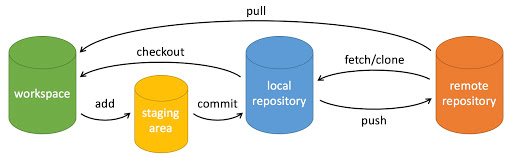

# 简介



```
workspace：工作区
staging area：暂存区/缓存区
local repository：版本库或本地仓库
remote repository：远程仓库
```

- **工作区：**就是你在电脑里能看到的目录。
- **暂存区：**英文叫 stage 或 index。一般存放在 **.git** 目录下的 index 文件（.git/index）中，所以我们把暂存区有时也叫作索引（index）。
- **版本库：**工作区有一个隐藏目录 **.git**，这个不算工作区，而是 Git 的版本库。

## 一些名词说明

- untrack 追踪：表示是新文件，没有被add过，是为跟踪的意思。
- not staged：表示add过的文件，即跟踪文件，再次修改没有add，就是没有暂存的意思。

# 创建仓库命令

## git init 初始化仓库

```
# 在当前目录新建一个Git代码库
git init

# 新建一个目录，将其初始化为Git代码库
git init [project-name]
```

## git clone 拷贝一份远程仓库

```
# 下载一个项目和它的整个代码历史
git clone [url]
```

# 配置

## git config

```
# 显示当前的Git配置
git config --list [--global]

# 编辑Git配置文件
git config -e [--global]

# 设置提交代码时的用户信息
git config [--global] user.name "[name]"
git config [--global] user.email "[email address]"
```

# 提交与修改

## git add 添加文件到暂存区

```
# 添加指定文件到暂存区
git add [file1] [file2] ...

# 添加指定目录到暂存区，包括子目录
git add [dir]

# 添加当前目录的所有文件到暂存区
git add .

# 在交互式终端中，添加每个变化前，都会要求确认
git add -p
```

## git rm

```
# 删除工作区文件，并且将这次删除放入暂存区
git rm [file1] [file2] ...

# 停止追踪指定文件，但该文件会保留在工作区 将add后的文件回退
git rm --cached [file]
```

## git mv

```
# 改名文件，并且将这个改名放入暂存区
git mv [file-original] [file-renamed]
```

## git commit

```
# 提交暂存区到仓库区 message为备注信息
git commit -m [message]

# 提交暂存区的指定文件到仓库区
git commit [file1] [file2] ... -m [message]

# 提交工作区自上次commit之后的变化，直接到仓库区 省略一次git add
git commit -a

# 提交时显示所有diff信息
git commit -v

# 使用一次新的commit，替代上一次提交
# 如果代码没有任何新变化，则用来改写上一次commit的提交信息
git commit --amend -m [message]

# 重做上一次commit，并包括指定文件的新变化
git commit --amend [file1] [file2] ...
```

# 标签

## git tag

```
# 列出所有tag
git tag

# 新建一个tag在当前commit
git tag [tag]

# 新建一个tag在指定commit
git tag [tag] [commit]

# 删除本地tag
git tag -d [tag]

# 删除远程tag
git push origin :refs/tags/[tagName]

# 查看tag信息
git show [tag]

```

# 分支

## git branch

```
# 列出所有本地分支
git branch

# 列出所有远程分支
git branch -r

# 列出所有本地分支和远程分支
git branch -a

# 新建一个分支，但依然停留在当前分支
git branch [branch-name]

# 新建一个分支，指向指定commit
git branch [branch] [commit]

# 新建一个分支，与指定的远程分支建立追踪关系
git branch --track [branch] [remote-branch]

# 建立追踪关系，在现有分支与指定的远程分支之间
git branch --set-upstream-to=[remote]/[remote-branch] [branch]

# 删除分支
git branch -d [branch-name]

# 删除远程分支
git branch -dr [remote/branch]
```

## git checkout

```
# 新建一个分支，并切换到该分支
git checkout -b [branch]

# 切换到指定分支，并更新工作区
git checkout [branch-name]

# 切换到上一个分支
git checkout -

# 新建一个分支，指向某个tag
git checkout -b [branch] [tag]
```

## git merge

```
# 合并指定分支到当前分支
git merge [branch]
```

## git cherry-pick

```
# 选择一个commit，合并进当前分支
git cherry-pick [commit]

# 选择多个commit，合并进当前分支

git cherry-pick [commit1]...[commit3]
```

# 查看信息

## git status  显示有变更的文件

```
# 显示有变更的文件
git status
```

## git log

```
# 显示当前分支的版本历史
git log

# 显示commit历史，以及每次commit发生变更的文件
git log --stat

# 搜索提交历史，根据关键词
git log -S [keyword]

# 显示某个commit之后的所有变动，每个commit占据一行
git log [tag] HEAD --pretty=format:%s

# 显示某个commit之后的所有变动，其"提交说明"必须符合搜索条件
git log [tag] HEAD --grep feature

# 显示某个文件的版本历史，包括文件改名
git log --follow [file]
git whatchanged [file]

# 显示指定文件相关的每一次diff
git log -p [file]

# 显示过去5次提交
git log -5 --pretty --oneline
```

## git shortlog

```
# 显示所有提交过的用户，按提交次数排序
git shortlog -sn
```

## git blame

```
用于逐行显示指定文件的每一行代码是由谁在什么时候引入或修改的。

# 显示指定文件是什么人在什么时间修改过
git blame [file]
```

## git diff

```
# 显示暂存区和工作区的差异
git diff [file]

# 显示暂存区和上一个commit的差异
git diff --cached [file]
git diff --staged [file]

# 比较远程与本地差异
git diff --stat master origin/master

# 显示工作区与当前分支最新commit之间的差异
git diff HEAD

# 显示两者差异
git diff [first-branch]...[second-branch]

# 显示今天你写了多少行代码
git diff --shortstat "@{0 day ago}"
```

## git show

```
# 显示某次提交的元数据和内容变化
git show [commit]

# 显示某次提交发生变化的文件
git show --name-only [commit]

# 显示某次提交时，某个文件的内容
git show [commit]:[filename]
```

## git reflog

```
# 显示当前分支的最近几次提交
git reflog
```

# 远程同步

## git fetch

```
# 下载远程仓库的所有变动
git fetch [remote]
```

## git remote

```
# 显示所有远程仓库
git remote -v

# 显示某个远程仓库的信息
git remote show [remote]

# 增加一个新的远程仓库，并命名
git remote add [shortname] [url]

# 删除一个远程仓库
git remote remove [remote]
```

## git pull

```
# 取回远程仓库的变化，并与本地分支合并
git pull [remote] [branch]

# 上传本地指定分支到远程仓库
git push [remote] [branch]
```

## git push

```
# 上传本地指定分支到远程仓库
git push [remote] [branch]

# 强行推送当前分支到远程仓库，即使有冲突
git push [remote] --force

# 推送所有分支到远程仓库
git push [remote] --all

# 删除远程分支
git push origin --delete [branch-name]

# 提交指定tag
git push [remote] [tag]

# 提交所有tag
git push [remote] --tags
```

# 撤销

## git reset

```
# 重置暂存区的指定文件，与上一次commit保持一致，但工作区不变
git reset [file]

# 重置暂存区与工作区，与上一次commit保持一致
git reset --hard

# 重置当前分支的指针为指定commit，同时重置暂存区，但工作区不变
git reset [commit]

# 重置当前分支的HEAD为指定commit，同时重置暂存区和工作区，与指定commit一致
git reset --hard [commit]

# 重置当前HEAD为指定commit，但保持暂存区和工作区不变
git reset --keep [commit]
```

## git clean

```
删除没有add的文件

# 显示将要删除的文件和目录
git clean -dn

# 删除文件
git clean -f

# 删除所有文件
git clean -f .

# 删除文件和目录
git clean -df
```

## git checkout

```
回退没有commit的文件

# 恢复暂存区的指定文件到工作区
git checkout [file]

# 恢复某个commit的指定文件到暂存区和工作区
git checkout [commit] [file]

# 恢复暂存区的所有文件到工作区
git checkout .

```

## git revert

```
# 新建一个commit，用来撤销指定commit
# 后者的所有变化都将被前者抵消，并且应用到当前分支
git revert [commit]
```

# 暂存

## git stash

```
# 暂存当前修改，将所有至为HEAD状态
git stash

# 查看所有暂存
git stash list

# 弹出上次暂存
git stash pop
```

# git pull 和 git fetch 有什么区别

git pull 命令从中央存储库中提取特定分支的新更改或提交，并更新本地存储库中的目标分支。

