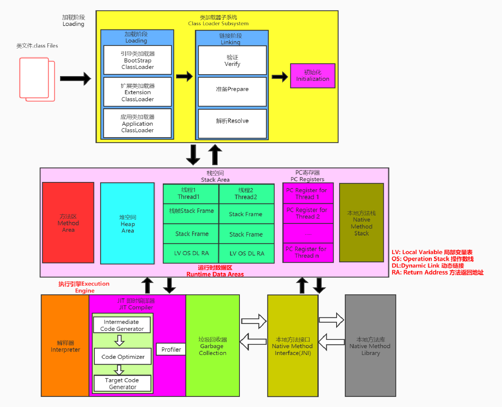
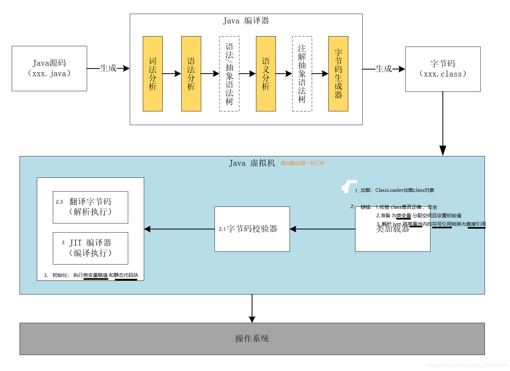
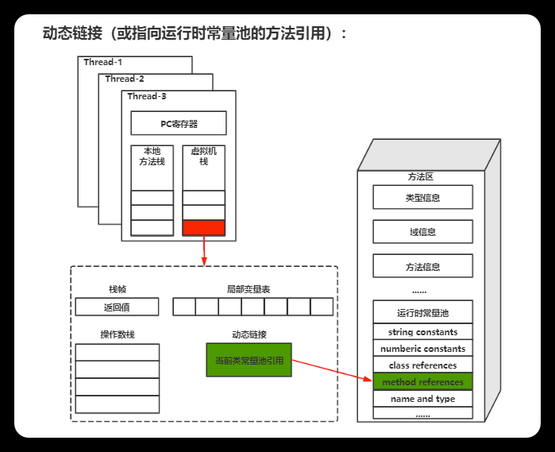
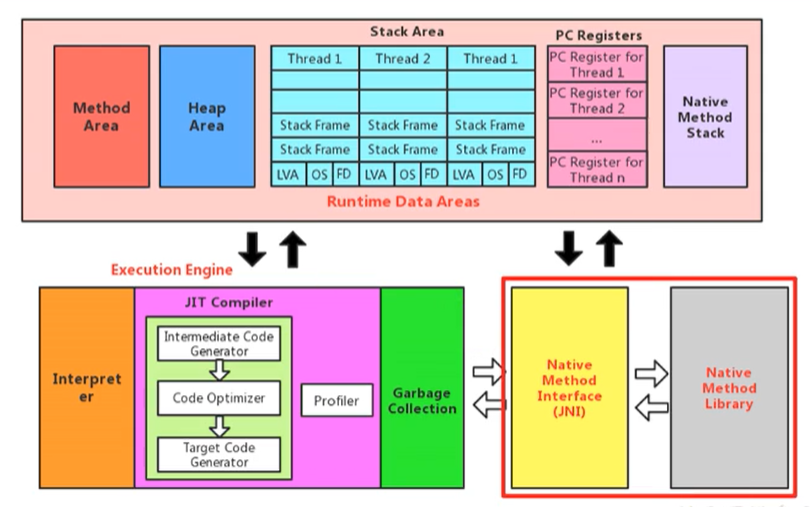

# Java基础题

## Java语言的三大特性


# JVM

https://docs.oracle.com/javase/specs/jvms/se8/html/jvms-2.html



## JVM整体架构


**Java编译器输入的指令流基本上是一种基于栈的指令集架构**

## Java代码执行流程



## 类加载子系统


ClassLoader只负责class文件的加载，至于它是否可以运行，则由**Execution Engine**决定。

加载的类信息存放于一块称为**方法区**的内存空间。除了类的信息外，方法区中还会存放**运行时常量池**信息，可能还包括字符串字面量和数字常量（这部分常量信息是Class文件中常量池部分的内存映射）

### 加载

将类的.class文件加载到内存中，并生成对应的 Class 对象。

在加载阶段，类加载器会根据**类的全限定名**去查找和读取类的二进制数据，然后将其转换成**方法区中的运行时数据结构**，如 Class 对象。

### 链接

**验证（Verify）**

Java 虚拟机会确保加载的类符合 Java 语言规范，比如**验证类的格式是否正确、类的字节码是否合法等**。验证阶段主要是为了**保证类的正确性**，**防止恶意代码的注入**。

主要包括四种验证，**文件格式验证，元数据验证，字节码验证，符号引用验证**。

**准备（Prepare）**

为**类变量分配内存**并且**设置该类变量的默认初始值，即零值**。这里设置的默认值通常是数值类型为 0，布尔类型为 false，对象类型为 null。

这里不包含用final修饰的static，因为**final在编译的时候就会分配**，**准备阶段会显式初始化**。

这里不会为实例变量(没有被static修饰的)分配初始化，类变量会分配在方法区中，而实例变量是会随着对象一起分配到Java堆中。

**解析（Resolve）**

解析阶段是将类、接口、字段和方法的**符号引用解析为内存地址中的直接引用的过程**。在 Java 中，符号引用指的是类或接口的全限定名、字段的名称和描述符、方法的名称和描述符等。

### 初始化

执行类构造器`<clinit>()`方法，按照静态变量的顺序依次执行静态变量的赋值语句和静态代码块。

若该类具有父类，JVM会保证子类的`<clinit>()`执行前，父类的`<clinit>()`已经执行完毕。

### 类加载器的分类


**启动类加载器（引导类加载器，Bootstrap ClassLoader）**

这个类加载使用C/C++语言实现的，嵌套在JVM内部。

它用来加载Java的核心库（JAVA_HOME/jre/lib/rt.jar、resources.jar或sun.boot.class.path路径下的内容），用于**提供JVM自身需要的类**。

并不继承自ava.lang.ClassLoader，没有父加载器。

出于安全考虑，Bootstrap启动类加载器只加载包名为java、javax、sun等开头的类。

---

**扩展类加载器（Extension ClassLoader）**

Java语言编写，由sun.misc.Launcher$ExtClassLoader实现。

派生于ClassLoader类。

父类加载器为启动类加载器。

用于**加载Java的扩展类库**，位于 jre/lib/ext 目录下。

---

**应用程序类加载器（系统类加载器，AppClassLoader）**

java语言编写，由sun.misc.LaunchersAppClassLoader实现。

派生于ClassLoader类。

父类加载器为扩展类加载器。

它负责加载环境变量classpath或系统属性java.class.path指定路径下的类库。

该类加载是程序中默认的类加载器，一般来说，Java应用的类都是由它来完成加载。

---

**自定义类加载器（CustomClassLoader）**

开发人员自定义的类加载器，继承自java.lang.ClassLoader类，并重写加载类的方法，如findClass()。

主要用于**隔离加载类、扩展加载源、防止源码泄露**等。

### 双亲委派机制

Java虚拟机对class文件采用的是按需加载的方式，也就是说当需要使用该类时才会将它的class文件加载到内存生成class对象。而且加载某个类的class文件时，Java虚拟机采用的是双亲委派模式，即把请求交由父类处理，它是一种任务委派模式。

**执行原理**

如果一个类加载器收到了类加载请求，它并不会自己先去加载，而是把这个请求委托给父类的加载器去执行。

如果父类加载器还存在其父类加载器，则进一步向上委托，依次递归，请求最终将到达顶层的启动类加载器。

如果父类加载器可以完成类加载任务，就成功返回，倘若父类加载器无法完成此加载任务，子加载器才会尝试自己去加载，这就是双亲委派模式。

父类加载器一层一层往下分配任务，如果子类加载器能加载，则加载此类，如果将加载任务分配至系统类加载器也无法加载此类，则抛出异常。


**优势**

**避免类的重复加载**。

**保护核心类库**，防止核心API被随意篡改：例如自定义类java.lang.String 没有被加载、自定义java.lang.ShkStart（报错：阻止创建 java.lang开头的类）。

**隔离类加载器的命名空间**：每个类加载器都有自己的命名空间，通过双亲委派机制，可以确保不同的类加载器加载的类位于不同的命名空间


**沙箱安全机制**

自定义String类时：在加载自定义String类的时候会率先使用引导类加载器加载，而引导类加载器在加载的过程中会先加载jdk自带的文件（rt.jar包中java.lang.String.class），报错信息说没有main方法，就是因为加载的是rt.jar包中的String类。

这样可以保证对java核心源代码的保护，这就是沙箱安全机制。

```
package java.lang;

public class String {
    public static void main(String[] args) {
        System.out.println(1);
    }
}

错误: 在类 java.lang.String 中找不到 main 方法, 请将 main 方法定义为:
   public static void main(String[] args)
否则 JavaFX 应用程序类必须扩展javafx.application.Application
```

## 运行时数据区


线程独有：程序计数器，虚拟机栈，本地方法栈

线程共享：堆，方法区/元空间，代码缓存

Runtime类：每个Jvm只有一个Runtime实例，即运行时环境。

## 程序计数器(PC寄存器)

程序计数器是一块较小的内存区域，是**线程私有**的。

用于**存储当前线程正在执行的字节码指令地址**。**字节码解释器**工作时通过改变这个计数器的值来选取下一条需要执行的字节码指令，分支、循环、跳转、异常处理、线程恢复等功能都需要依赖这个计数器来完成。

主要用于线程切换时恢复现场，以确保线程能够从正确的位置继续执行。

它是唯一一个在Java虚拟机规范中没有规定任何`OutofMemoryError`情况的区域。

它的生命周期随着线程的创建而创建，随着线程的结束而死亡。


## 虚拟机栈


Java 虚拟机栈也是线程私有的。它的生命周期和线程相同，随着线程的创建而创建，随着线程的死亡而死亡。

方法调用的数据需要通过栈进行传递，每一次方法调用都会有一个对应的栈帧被压入栈中，每一个方法调用结束后，都会有一个栈帧被弹出。

栈中的数据都是以**栈帧**（Stack Frame）的格式存在，在这个线程上正在执行的**每个方法都各自对应一个栈帧**，而每个栈帧中都拥有：**局部变量表**、**操作数栈**、**动态链接**、**方法返回地址**。

### 局部变量表

定义为一个数字数组，主要用于**存储方法参数**和**定义在方法体内的局部变量**，这些数据类型包括各类基本数据类型、对象引用（reference），以及returnAddress返回值类型。

局部变量表所需的容量大小是在**编译期**确定下来的，并保存在方法的Code属性的maximum local variables数据项中。在方法运行期间是不会改变局部变量表的大小的。

当方法调用结束后，随着方法栈帧的销毁，局部变量表也会随之销毁。

```
public static void calculateSum(int a, int b) {
    int sum; // 在方法中定义一个局部变量sum
    sum = a + b;
    System.out.println("Sum: " + sum);
}

Method: calculateSum
----------------------------------
| Index | Variable | Value      |
----------------------------------
| 0     | a        | (parameter)|
| 1     | b        | (parameter)|
| 2     | sum      |           |
----------------------------------
```

### 操作数栈

操作数栈，**主要用于保存计算过程的中间结果，同时作为计算过程中变量临时的存储空间**。

操作数栈就是**JVM执行引擎的一个工作区**，当一个方法刚开始执行的时候，一个新的栈帧也会随之被创建出来，这时方法的操作数栈是空的。

栈中的任何一个元素都是可以任意的Java数据类型，32bit的类型占用一个栈单位深度，64bit的类型占用两个栈单位深度。

**Java虚拟机的解释引擎是基于栈的执行引擎，其中的栈指的就是操作数栈**。

```
public static int add(int a, int b) {
    return a + b;
}

0: iload_0        // 将局部变量表中索引为0的整型值加载到操作数栈中。
1: iload_1        // 将局部变量表中索引为1的整型值加载到操作数栈中。
2: iadd           // 从操作数栈中弹出两个整数相加，并将结果压入操作数栈
3: ireturn        // 从操作数栈中弹出结果返回
```

### 动态链接



每一个栈帧内部都包含**一个指向运行时常量池中该栈帧所属方法的引用**。包含这个引用的目的就是**为了支持当前方法的代码能够实现动态链接**。

主要服务一个方法需要调用其他方法的场景。Class 文件的常量池里保存有大量的符号引用比如方法引用的符号引用。当一个方法要调用其他方法，需要**将常量池中指向方法的符号引用转化为其在内存地址中的直接引用**。动态链接的作用就是为了将符号引用转换为调用方法的直接引用，这个过程也被称为**动态连接** 。

### 方法返回地址

方法返回地址是指在方法执行完毕后，程序需要返回到哪里继续执行的地址。

## 本地方法栈

Java虚拟机栈于管理Java方法的调用，而本地方法栈用于管理本地方法的调用。

本地方法栈，也是线程私有的。

本地方法一般是使用C语言或C++语言实现的。

它的具体做法是Native Method Stack中登记native方法，在Execution Engine 执行时加载本地方法库。

## 本地方法接口



本地方法是一个非Java的方法，它的具体实现是非Java代码的实现。

本地接口的作用是融合不同的编程语言为Java所用，它的初衷是融合C/C++程序。

用于与Java环境外交互、与操作系统交互。