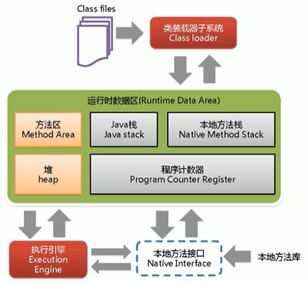

# JVM


## JVM整体架构



**Java编译器输入的指令流基本上是一种基于栈的指令集架构**

## Java代码执行流程


## 类加载子系统


ClassLoader只负责class文件的加载，至于它是否可以运行，则由**Execution Engine**决定。

加载的类信息存放于一块称为**方法区**的内存空间。除了类的信息外，方法区中还会存放**运行时常量池**信息，可能还包括字符串字面量和数字常量（这部分常量信息是Class文件中常量池部分的内存映射）

### 加载

将类的.class文件加载到内存中，并生成对应的 Class 对象。

在加载阶段，类加载器会根据**类的全限定名**去查找和读取类的二进制数据，然后将其转换成**方法区中的运行时数据结构**，如 Class 对象。

### 链接

**验证（Verify）**

Java 虚拟机会确保加载的类符合 Java 语言规范，比如**验证类的格式是否正确、类的字节码是否合法等**。验证阶段主要是为了**保证类的正确性**，**防止恶意代码的注入**。

主要包括四种验证，**文件格式验证，元数据验证，字节码验证，符号引用验证**。

**准备（Prepare）**

为**类变量分配内存**并且**设置该类变量的默认初始值，即零值**。这里设置的默认值通常是数值类型为 0，布尔类型为 false，对象类型为 null。

这里不包含用final修饰的static，因为**final在编译的时候就会分配**，**准备阶段会显式初始化**。

这里不会为实例变量(没有被static修饰的)分配初始化，类变量会分配在方法区中，而实例变量是会随着对象一起分配到Java堆中。

**解析（Resolve）**

解析阶段是将类、接口、字段和方法的**符号引用解析为直接引用的过程**。在 Java 中，符号引用指的是类或接口的全限定名、字段的名称和描述符、方法的名称和描述符等。

### 初始化

执行类构造器`<clinit>()`方法，按照静态变量的顺序依次执行静态变量的赋值语句和静态代码块。

若该类具有父类，JVM会保证子类的`<clinit>()`执行前，父类的`<clinit>()`已经执行完毕。

### 类加载器的分类


**启动类加载器（引导类加载器，Bootstrap ClassLoader）**

这个类加载使用C/C++语言实现的，嵌套在JVM内部。

它用来加载Java的核心库（JAVA_HOME/jre/lib/rt.jar、resources.jar或sun.boot.class.path路径下的内容），用于**提供JVM自身需要的类**。

并不继承自ava.lang.ClassLoader，没有父加载器。

出于安全考虑，Bootstrap启动类加载器只加载包名为java、javax、sun等开头的类。

---

**扩展类加载器（Extension ClassLoader）**

Java语言编写，由sun.misc.Launcher$ExtClassLoader实现。

派生于ClassLoader类。

父类加载器为启动类加载器。

用于**加载Java的扩展类库**，位于 jre/lib/ext 目录下。

---

**应用程序类加载器（系统类加载器，AppClassLoader）**

java语言编写，由sun.misc.LaunchersAppClassLoader实现。

派生于ClassLoader类。

父类加载器为扩展类加载器。

它负责加载环境变量classpath或系统属性java.class.path指定路径下的类库。

该类加载是程序中默认的类加载器，一般来说，Java应用的类都是由它来完成加载。

---

**自定义类加载器（CustomClassLoader）**

开发人员自定义的类加载器，继承自java.lang.ClassLoader类，并重写加载类的方法，如findClass()。

主要用于**隔离加载类、扩展加载源、防止源码泄露**等。

### 双亲委派机制

Java虚拟机对class文件采用的是按需加载的方式，也就是说当需要使用该类时才会将它的class文件加载到内存生成class对象。而且加载某个类的class文件时，Java虚拟机采用的是双亲委派模式，即把请求交由父类处理，它是一种任务委派模式。

**执行原理**

如果一个类加载器收到了类加载请求，它并不会自己先去加载，而是把这个请求委托给父类的加载器去执行。

如果父类加载器还存在其父类加载器，则进一步向上委托，依次递归，请求最终将到达顶层的启动类加载器。

如果父类加载器可以完成类加载任务，就成功返回，倘若父类加载器无法完成此加载任务，子加载器才会尝试自己去加载，这就是双亲委派模式。

父类加载器一层一层往下分配任务，如果子类加载器能加载，则加载此类，如果将加载任务分配至系统类加载器也无法加载此类，则抛出异常。

**优势**

避免类的重复加载。

保护程序安全，防止核心API被随意篡改。例如自定义类java.lang.String 没有被加载、自定义java.lang.ShkStart（报错：阻止创建 java.lang开头的类）。

**沙箱安全机制**

自定义String类时：在加载自定义String类的时候会率先使用引导类加载器加载，而引导类加载器在加载的过程中会先加载jdk自带的文件（rt.jar包中java.lang.String.class），报错信息说没有main方法，就是因为加载的是rt.jar包中的String类。

这样可以保证对java核心源代码的保护，这就是沙箱安全机制。

```
package java.lang;

public class String {
    public static void main(String[] args) {
        System.out.println(1);
    }
}

错误: 在类 java.lang.String 中找不到 main 方法, 请将 main 方法定义为:
   public static void main(String[] args)
否则 JavaFX 应用程序类必须扩展javafx.application.Application
```

