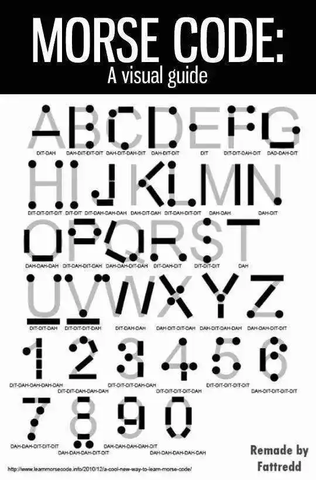

# 第一章 Java开发环境搭建

## 1. 什么是 JDK、JRE、JVM

JDK（Java Development Kit）：是 Java 程序的开发工具包，包含 JRE 和开发人员使用的工具。

JRE（Java Runtime Environment）：是 Java 程序的运行时环境，包含 JVM 和运行时所需要的核心类库。

JVM（Java Virtual Machine）：是 Java 虚拟机，使用 JVM 来实现跨平台。


 

> 小结：
>
> JDK = JRE + 开发工具集（例如Javac编译工具等）
>
> JRE = JVM + Java SE 标准类库

## 2. JDK安装

[Oracle官网](https://www.oracle.com/cn/java/technologies/downloads/)

Windows 环境变量

```
//添加系统变量
JAVA_HOME D:\develop\jdk\jdk1.8\jdk1.8.0_131
//系统变量追加
Path %JAVA_HOME%\bin
```

Linux 环境变量

```
vim /etc/profile.d/my_env.sh
//追加路径
export JAVA_HOME=/usr/lib/jdk/jdk1.8.0_171
export PATH=${JAVA_HOME}/bin:$PATH
//刷新环境变量
source /etc/profile
```

## 3. 开发体验

Java 程序开发三步骤：**编写**、**编译**、**运行**。

- 将 Java 代码**编写**到扩展名为 .java 的源文件中
- 通过 javac.exe 命令对该 java 文件进行**编译**，生成一个或多个字节码文件
- 通过 java.exe 命令对生成的 class 文件进行**运行**


**编写**

新建文件文件名称为：HelloWorld.java，main 方法是 java 程序的入口

```
class HelloChina {
  	public static void main(String[] args) {
    	System.out.println("HelloWorld!!");
  	}
}
```

**编译**

在 DOS 命令行中，使用 javac 命令进行编译，生成 HelloWorld.class 字节码文件

```
javac HelloWorld.java
```

**运行**

在 DOS 命令行中，使用 java 命令进行运行

```
java HelloWorld
```

## 4. 源文件与类名

一个 java 源文件中可以包含多个类名，但是只能包含有一个 public 类名，并且该 public 类名要与源文件保持保持一致。

建议一个源文件中尽量只写一个类，便于维护。

## 5. 注释

**单行注释**

```
//注释文字
```

**多行注释**

```
/* 
注释文字1 
注释文字2
注释文字3
*/
```

**文档注释**

```
/**
 * @author 指定java程序的作者
 * @version 指定源文件的版本
 */
```

# 第二章 变量与运算符

## 1. 关键字（keyword）

定义：**被Java语言赋予了特殊含义，用做专门用途的字符串（或单词）**

特点：全部关键字都是**小写字母**。

官网地址：https://docs.oracle.com/javase/tutorial/java/nutsandbolts/_keywords.html

> 说明：
>
> 1. 关键字一共`50个`，其中`const`和`goto`是`保留字`(reserved word)。
> 2. `true`，`false`，`null`不在其中，它们看起来像关键字，其实是字面量，表示特殊的布尔值和空值。


## 2. 标识符( identifier)

Java 中变量、方法、类等要素命名时使用的字符序列，称为标识符。

凡是自己可以起名字的地方都叫标识符。

**标识符的命名规则**（必须遵守的硬性规定）

```
1. 只能包含字母(汉字)，数字，$，_
2. 不能以数字开头
3. 不能与关键字同名
4. 不能包含空格
```

**标识符的命名规范**（建议遵守的软性要求）

```
变量、方法命名规范

1. 变量名应该以小写字母开头，后续单词首字母大写（驼峰命名法）。
2. 命名应该具有描述性，能清晰地表达变量的用途。
3. 常量通常使用全大写，单词间用下划线分隔。
例：name age getName getAge MAX_VALUE

包名命名规范

1. 包名应该全部使用小写字母。
2. 包名应该采用逆域名的格式，以确保唯一性（例如：com.example.mypackage）。
3. 包名应该具有描述性，能够清晰地表达所包含的类的用途。
例：java.lang

类名命名规范

1. 类名应该以大写字母开头，后续单词首字母大写（驼峰命名法）。
2. 类名应该具有描述性，能清晰地表达类的用途。
3. 类名应该避免使用与Java标准库中的类重名，以免造成混淆。
例：HelloWorld，Test
```

## 3. 变量

### 3.1 初识变量

**变量的概念**

内存中的一个存储区域，该区域的数据可以在同一类型范围内不断变化。

变量的构成包含三个要素：数据类型、变量名、存储的值.

变量的声明格式：`数据类型 变量名 = 变量值`

---

**变量的作用**

用于在内存中保存数据。

---

**使用变量的注意事项**

Java 中每个变量必须先声明，后使用。

变量的作用域：其定义所在的一对{ }内。

变量只有在其`作用域`内才有效。出了作用域，变量不可以再被调用。

同一个作用域内，不能定义重名的变量。

### 3.2 Java 中变量的数据类型

Java 中变量的数据类型分为两大类：

- **基本数据类型**：包括 整数类型、浮点数类型、字符类型、布尔类型。 四类八种。
- **引用数据类型**：包括 类、接口、数组、枚举、注解、记录。 


1. **类（Class）：** 定义对象的模板，包括类中的属性和方法。
2. **接口（Interface）：** 定义类应遵循的规范，包括方法的声明。
3. **数组（Array）：** 存储同一类型数据的集合。
4. **枚举类型（Enum Types）：** 枚举类型是一种特殊的数据类型，用于定义一组命名的常量。
5. **null**：一个特殊的值，它表示一个引用变量不引用任何对象。

### 3.3 变量的使用

变量声明

```
int age; 
double weight;

//声明多个同类型的变量
int a,b,c;
```

变量赋值

```
age = 18;
weight = 109;

boolean isBeauty = true;
String name = "名称";
```

## 4. 整数类型：byte、short、int、long


Java 的整型常量默认为 int 型。

定义 long 类型的变量，赋值时需要以 l 或 L 作为后缀。

**基础数据类型取值范围说明**

```java
//byte类型 1字节 8位
0000 0001 ~ 0111 1111 ==> 1 ~ 127
1000 0001 ~ 1111 1111 ==> -127 ~ -1
0000 0000 ==> 0
1000 0000 ==> -128（特殊规定 没有原码）
```

## 5. 浮点类型：float、double

浮点型常量有两种表示形式：

- 十进制数形式。如：5.12       512.0f        .512   (必须有小数点）
- 科学计数法形式。如：5.12e2      512E2     100E-2

Java 的浮点型常量默认为 double 型。

float：单精度，尾数可以精确到7位有效数字。很多情况下，精度很难满足需求。

double：双精度，精度是 float 的两倍。通常采用此类型。 

定义 float 类型的变量，赋值时需要以 f 或 F 作为后缀。

---

**浮点数精度说明**

浮点类型float、double的数据不适合在`不容许舍入误差`的金融计算领域。如果需要`精确`数字计算或保留指定位数的精度，需要使用`BigDecimal类`。

```
//测试1：（解释见章末企业真题：为什么0.1 + 0.2不等于0.3）
System.out.println(0.1 + 0.2);//0.30000000000000004

//测试2：
float ff1 = 123123123f;
float ff2 = ff1 + 1;
System.out.println(ff1);
System.out.println(ff2);
System.out.println(ff1 == ff2);//true
```

## 6. 字符类型：char

char 型数据用来表示通常意义上`字符`（占2字节）

Java 中的所有字符都使用 Unicode 编码，故一个字符可以存储一个字母，一个汉字，或其他书面语的一个字符。

char 类型是可以进行运算的。因为它都对应有 Unicode 码，可以看做是一个数值。

字符型变量的三种表现形式：

- **形式1：**使用单引号(' ')括起来的`单个字符`。

  例如：char c1 = 'a'; char c2 = '中'; char c3 =  '9';

- **形式2：**直接使用 `Unicode值`来表示字符型常量：‘`\uXXXX`’。其中，XXXX代表一个十六进制整数。

  例如：\u0023 表示 '#'。

- **形式3：**Java中还允许使用`转义字符‘\’`来将其后的字符转变为特殊字符型常量。

  例如：char c3 = '\n';  // '\n'表示换行符

  | 转义字符 |  说明  | Unicode表示方式 |
  | :------: | :----: | :-------------: |
  |   `\n`   | 换行符 |     \u000a      |
  |   `\t`   | 制表符 |     \u0009      |
  |   `\"`   | 双引号 |     \u0022      |
  |   `\'`   | 单引号 |     \u0027      |
  |   `\\`   | 反斜线 |     \u005c      |
  |   `\b`   | 退格符 |     \u0008      |
  |   `\r`   | 回车符 |     \u000d      |

## 7. 布尔类型：boolean

boolean 类型数据只有两个值（占1字节）：`true`、`false`，不可以用0或非0的整数替代 false 和 true。

## 8. 基本数据类型变量间运算规则

### 8.1 自动类型提升

规则：将取值范围小的类型自动提升为取值范围大的类型。


1、赋值

```java
//char自动升级为int，其实就是把字符的编码值赋值给i变量了
int i = 'A';
//int自动升级为double
double d = 10;
//右边的整数常量值如果超过int范围，必须加L，显式表示long类型。
long bigNum = 12345678912L;
```

2、运算

```java
int i = 1;
byte b = 1;
double d = 1.0;
//混合运算，升级为double
double sum = i + b + d;

byte b1 = 1;
byte b2 = 2;
byte b3 = b1 + b2;//编译报错，b1 + b2自动升级为int
```

### 8.2 强制类型转换

规则：将取值范围大的类型强制转换为取值范围小的类型，可能会损失精度或溢出。

转换格式：`数据类型1 变量名 = (数据类型1)被强转数据值;`

1、赋值

```java
//损失精度 3
int i = (int)3.14; 

//损失精度 1
double d = 1.2;
int num = (int)d;

//溢出 -48 11001000变成byte八位，第一位为符号位
int i = 2000; //0000 0000 0000 0000 0000 0111 1101 0000
byte b = (byte)i; //1101 0000
```

### 8.3 与 String 的运算

String 不是基本数据类型，属于引用数据类型。

使用一对`""`来表示一个字符串，内部可以包含0个、1个或多个字符。

1、任意八种基础类型与 String 进行拼接，结果一定是 String 类型

```java
int num = 10;
String str1 = "abc";
System.out.println(str1 + num);//abc10

//如果数字运算在前 优先运算数字
int num1 = 10;
int num2 = 20;
String str1 = "str1";
System.out.println(num1 + num2 + str1);//30str1
```

## 9. 计算机底层如何存储数据

计算机世界中只有二进制，所以计算机中存储和运算的`所有数据`都要转为`二进制`。包括数字、字符、图片、声音、视频等。

### 9.1 进制分类

1、**十进制（decimal）**

数字组成：0-9

进位规则：满十进一

2、**二进制（binary）**

数字组成：0-1

进位规则：满二进一，以`0b`或`0B`开头

3、**八进制（octal）**：很少使用

数字组成：0-7

进位规则：满八进一，以数字`0`开头表示

4、**十六进制**

数字组成：0-9，a-f

进位规则：满十六进一，以`0x`或`0X`开头表示。此处的 a-f 不区分大小写

```java
public static void main(String[] args) {

    int num1 = 123;		//十进制
    int num2 = 0b101;	//二进制
    int num3 = 0127;	//八进制
    int num4 = 0x12aF;	//十六进制

    System.out.println(num1); //123
    System.out.println(num2); //5
    System.out.println(num3); //87
    System.out.println(num4); //4783

}
```

### 9.2 进制换算举例

| 十进制 | 二进制 | 八进制 | 十六进制 |
| ------ | ------ | ------ | -------- |
| 0      | 0      | 0      | 0        |
| 1      | 1      | 1      | 1        |
| 2      | 10     | 2      | 2        |
| 3      | 11     | 3      | 3        |
| 4      | 100    | 4      | 4        |
| 5      | 101    | 5      | 5        |
| 6      | 110    | 6      | 6        |
| 7      | 111    | 7      | 7        |
| 8      | 1000   | 10     | 8        |
| 9      | 1001   | 11     | 9        |
| 10     | 1010   | 12     | a或A     |
| 11     | 1011   | 13     | b或B     |
| 12     | 1100   | 14     | c或C     |
| 13     | 1101   | 15     | d或D     |
| 14     | 1110   | 16     | e或E     |
| 15     | 1111   | 17     | f或F     |
| 16     | 10000  | 20     | 10       |

### 9.3 二进制的由来

二进制，是计算技术中广泛采用的一种数制，由德国数理哲学大师`莱布尼茨`于1679年发明。

二进制数据是用0和1两个数码来表示的数。它的基数为2，进位规则是`逢二进一`。

二进制广泛应用于我们生活的方方面面。比如，广泛使用的摩尔斯电码（Morse Code），它由两种基本信号组成：短促的点信号`·`，读`滴`；保持一定时间的长信号`—`，读`嗒`。然后，组成了26个字母，从而拼写出相应的单词。


记忆技巧：



### 9.4 二进制简介

计算机数据的存储使用二进制`补码`形式存储，并且`最高位是符号位`。正数：`最高位是0`，负数：`最高位是1`。

正数的补码与反码、原码一样，称为`三码合一`。

负数的补码与反码、原码不一样：

- 负数的`原码`：把十进制转为二进制，然后最高位设置为1
- 负数的`反码`：在原码的基础上，最高位不变，其余位取反（0变1,1变0）
- 负数的`补码`：反码+1

```java
//byte类型 1字节 8位 

25  ==> 原码  0001 1001 ==> 反码 0001 1001 ==> 补码 0001 1001

-25 ==> 原码  1001 1001 ==> 反码 1110 0110 ==> 补码 1110 0111
```

### 9.5 二进制转十进制

二进制转十进制：权相加法


### 9.6 十进制转二进制

十进制转二进制：除2取余的逆

```java
//以13为例
13/2 余 1
6/2  余 0
3/2  余 1
1/2  余 1
//从下往上取 1101
```


## 10. 运算符（Operator）

运算符是一种特殊的符号，用以表示数据的运算、赋值和比较等。

**按照功能分类**

算术运算符、赋值运算符、比较(或关系)运算符、逻辑运算符、位运算符、条件运算符、Lambda运算符

|           分类            |                        运算符                        |
| :-----------------------: | :--------------------------------------------------: |
|     算术运算符（7个）     |                +、-、*、/、%、++、--                 |
|    赋值运算符（12个）     | =、+=、-=、*=、/=、%=、>>=、<<=、>>>=、&=、\|=、^=等 |
| 比较(或关系)运算符（6个） |                 >、>=、<、<=、==、!=                 |
|     逻辑运算符（6个）     |                &、\|、^、!、&&、\|\|                 |
|      位运算符（7个）      |               &、\|、^、~、<<、>>、>>>               |
|     条件运算符（1个）     |              条件表达式 ? 结果1 : 结果2              |
|    Lambda运算符（1个）    |                      （）-> { }                      |

**按照操作数个数分类**

一元运算符（单目运算符）、二元运算符（双目运算符）、三元运算符 （三目运算符）

|           分类            |                  运算符                  |
| :-----------------------: | :--------------------------------------: |
| 一元运算符（单目运算符）  |    正号（+）、负号（-）、++、--、!、~    |
| 二元运算符（双目运算符）  | 除了一元和三元运算符剩下的都是二元运算符 |
| 三元运算符 （三目运算符） |        条件表达式 ? 结果1 : 结果2        |

### 10.1 算数运算符


**加减乘除**

```java
int a = 3;
int b = 4;

System.out.println(a + b); // 7
System.out.println(a - b); // -1
System.out.println(a * b); // 12
System.out.println(a / b); // 0 除法只取整数部分
System.out.println(a % b); // 3

//结果与被模数符号相同
System.out.println(5 % 2); //1
System.out.println(5 % -2); //1
System.out.println(-5 % 2); //-1
System.out.println(-5 % -2); //-1
```

**自增自减**

```java
int a = 3;
a++;
System.out.println(a); //4

//++在后：先赋值后累加
int x = 3;
int y = x++;
System.out.println(y);//3

//++在前：先累加再赋值
int m = 3;
int n = ++m;
System.out.println(n);//4


int z = 2;
z = z++; //1.先取得2的值当入操作数栈 2.z自增 3.再把操作数栈中的2赋值给z
System.out.println(z);//2

int i = 1;
int j = i++ + ++i * i++;//1+3*3
System.out.println(j);//10
```

**字符串拼接**

```java
int num = 10;
String str1 = "abc";
System.out.println(str1 + num);//abc10

//如果数字运算在前 优先运算数字
int num1 = 10;
int num2 = 20;
String str1 = "str1";
System.out.println(num1 + num2 + str1);//30str1
```

### 10.2 赋值运算符

当 = 两侧数据类型不一致时，可以使用自动类型转换或使用强制类型转换原则进行处理。

支持连续赋值。

| 赋值运算符 |                           符号解释                           |
| :--------: | :----------------------------------------------------------: |
|     =      |              将符号`右边的值`赋值给`左边的变量`              |
|     +=     | 将符号`左边的值`和`右边的值`进行`相加`操作，最后将结果`赋值给左边的变量` |
|     -=     | 将符号`左边的值`和`右边的值`进行`相减`操作，最后将结果`赋值给左边的变量` |
|     *=     | 将符号`左边的值`和`右边的值`进行`相乘`操作，最后将结果`赋值给左边的变量` |
|     /=     | 将符号`左边的值`和`右边的值`进行`相除`操作，最后将结果`赋值给左边的变量` |
|     %=     | 将符号`左边的值`和`右边的值`进行`取余`操作，最后将结果`赋值给左边的变量` |

```java
// =
int a = 10;

//连续赋值
int a1,a2;
a1 = a2 = 10;

int m1 = 10;
m1 += 5; //类似于 m1 = m1 + 5的操作，但不等同于。
System.out.println(m1);//15

int i = 1;
i *= 0.1;
System.out.println(i);//0

int m = 2;
int n = 3;
n *= m++; 	//n = n * m++;
System.out.println("m=" + m);//3
System.out.println("n=" + n);//6

int n = 10;
n += (n++) + (++n);  //n = n + (n++) + (++n)
System.out.println(n);//32
```

### 10.3 比较(关系)运算符

比较运算符的结果都是 boolean 型。

\>  <  >=  <= ：只适用于基本数据类型（除boolean类型之外）。

==   != ：适用于基本数据类型和引用数据类型。


```
int i1 = 10;
int i2 = 20;
System.out.println(i1 == i2);//false
System.out.println(i1 != i2);//true
System.out.println(i1 >= i2);//false

int m = 10;
int n = 20;
System.out.println(m == n);//false
System.out.println(m = n);//20

boolean b1 = false;
boolean b2 = true;
System.out.println(b1 == b2);//false
System.out.println(b1 = b2);//true
```

### 10.4 逻辑运算符

逻辑运算符：操作的都是 boolean 类型的变量或常量，而且运算得结果也是 boolean 类型的值。

& 和 &&：表示 且 关系，两边都是 true 时，结果为 true。否则为 false。

| 和 ||：表示 或 关系，有一边为 true 时，结果为 true。两边都为 false 时，结果为false。

! ：表示 非 关系，当变量为 true 时，结果为 false。当变量为 false 时，结果为 true。

^ ：表示 异或 关系，当两边不同时，结果为 true。当两边相同时，结果为 false。


**& 和 && 区别**

& ： 如果符号左边是 false，则继续执行符号右边的操作

&& ：如果符号左边是 false，则不再继续执行符号右边的操作，称为短路行为

**| 和 || 区别**

| ： 如果符号左边是 true，则继续执行符号右边的操作

|| ：如果符号左边是 true，则不再继续执行符号右边的操作，称为短路行为

### 10.5 位运算符

| 运算符 | 运算       | 范例                            |
| ------ | ---------- | ------------------------------- |
| <<     | 左移       | 3 << 2 = 12        3\*2\*2 = 12 |
| >>     | 右移       | 3 >> 1 = 1          3/2 = 1     |
| >>>    | 无符号右移 | 3 >>> 1 = 1        3/2 = 1      |
| &      | 与         | 6 & 3 = 2                       |
| \|     | 或         | 6 \| 3 = 7                      |
| ^      | 异或       | 6 ^ 3 = 5                       |
| ~      | 取反       | ~6 = -7                         |

位运算符的运算过程都是基于二进制的补码运算。


### 10.6 条件运算符

条件运算符格式：`条件表达式 ? 表达式1 : 表达式2`

说明：条件表达式是 boolean 类型，为 true 表达式1，为 false 表达式2。

如果运算后的结果赋给新的变量，要求表达式1和表达式2为同种或兼容的类型

```java
int i = (1==2 ? 100 : 200);
System.out.println(i);//200

//获取两个数的较大值
int m1 = 10;
int m2 = 20;
int max1 = (m1 > m2)? m1 : m2;
 System.out.println("m1和m2中的较大值为" + max1);
```

### 10.7 运算符优先级

> 开发建议：
>
> 1. 不要过多的依赖运算的优先级来控制表达式的执行顺序，这样可读性太差，尽量使用 ( ) 来控制表达式的执行顺序。
> 2. 不要把一个表达式写得过于复杂。

| 优先级 |    运算符说明    |             Java运算符             |
| ------ | :--------------: | :--------------------------------: |
| 1      |       括号       |          `()`、`[]`、`{}`          |
| 2      |      正负号      |              `+`、`-`              |
| 3      |    单元运算符    |       `++`、`--`、`~`、`！`        |
| 4      | 乘法、除法、求余 |           `*`、`/`、`%`            |
| 5      |    加法、减法    |              `+`、`-`              |
| 6      |    移位运算符    |         `<<`、`>>`、`>>>`          |
| 7      |    关系运算符    | `<`、`<=`、`>=`、`>`、`instanceof` |
| 8      |    等价运算符    |             `==`、`!=`             |
| 9      |      按位与      |                `&`                 |
| 10     |     按位异或     |                `^`                 |
| 11     |      按位或      |                `|`                 |
| 12     |      条件与      |                `&&`                |
| 13     |      条件或      |                `||`                |
| 14     |    三元运算符    |               `? :`                |
| 15     |    赋值运算符    | `=`、`+=`、`-=`、`*=`、`/=`、`%=`  |
| 16     |   位赋值运算符   |  `&=`、`|=`、`<<=`、`>>=`、`>>>=`  |


