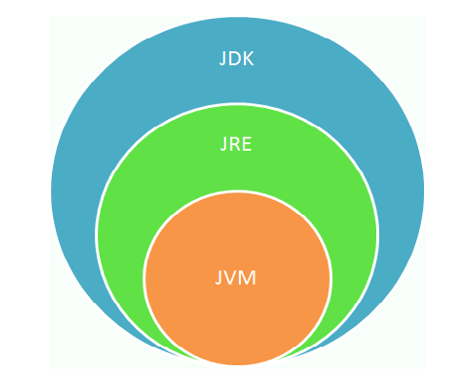
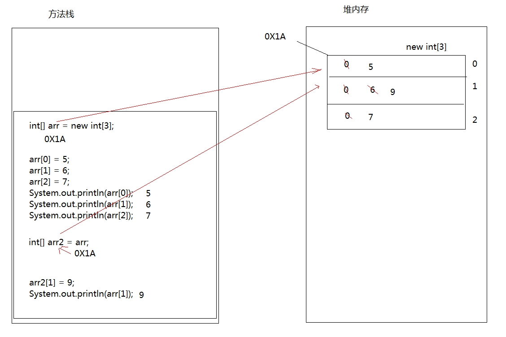
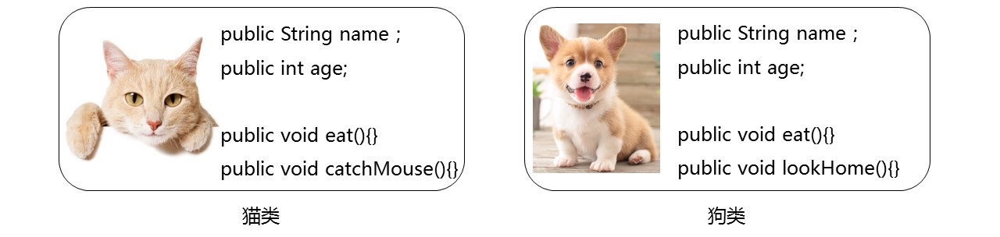
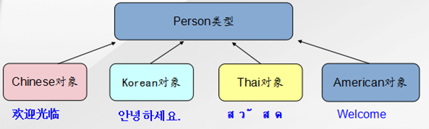
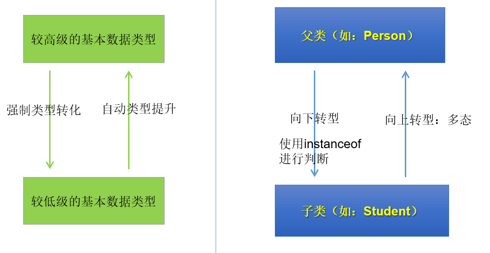

# 第一章 Java开发环境搭建

## 1. 什么是 JDK、JRE、JVM

JDK（Java Development Kit）：是 Java 程序的开发工具包，包含 JRE 和开发人员使用的工具。

JRE（Java Runtime Environment）：是 Java 程序的运行时环境，包含 JVM 和运行时所需要的核心类库。

JVM（Java Virtual Machine）：是 Java 虚拟机，使用 JVM 来实现跨平台。


 

> 小结：
>
> JDK = JRE + 开发工具集（例如Javac编译工具等）
>
> JRE = JVM + Java SE 标准类库

## 2. JDK安装

[Oracle官网](https://www.oracle.com/cn/java/technologies/downloads/)

Windows 环境变量

```
//添加系统变量
JAVA_HOME D:\develop\jdk\jdk1.8\jdk1.8.0_131
//系统变量追加
Path %JAVA_HOME%\bin
```

Linux 环境变量

```
vim /etc/profile.d/my_env.sh
//追加路径
export JAVA_HOME=/usr/lib/jdk/jdk1.8.0_171
export PATH=${JAVA_HOME}/bin:$PATH
//刷新环境变量
source /etc/profile
```

## 3. 开发体验

Java 程序开发三步骤：**编写**、**编译**、**运行**。

- 将 Java 代码**编写**到扩展名为 .java 的源文件中
- 通过 javac.exe 命令对该 java 文件进行**编译**，生成一个或多个字节码文件
- 通过 java.exe 命令对生成的 class 文件进行**运行**


**编写**

新建文件文件名称为：HelloWorld.java，main 方法是 java 程序的入口

```
class HelloChina {
  	public static void main(String[] args) {
    	System.out.println("HelloWorld!!");
  	}
}
```

**编译**

在 DOS 命令行中，使用 javac 命令进行编译，生成 HelloWorld.class 字节码文件

```
javac HelloWorld.java
```

**运行**

在 DOS 命令行中，使用 java 命令进行运行

```
java HelloWorld
```

## 4. 源文件与类名

一个 java 源文件中可以包含多个类名，但是只能包含有一个 public 类名，并且该 public 类名要与源文件保持保持一致。

建议一个源文件中尽量只写一个类，便于维护。

## 5. 注释

**单行注释**

```
//注释文字
```

**多行注释**

```
/* 
注释文字1 
注释文字2
注释文字3
*/
```

**文档注释**

```
/**
 * @author 指定java程序的作者
 * @version 指定源文件的版本
 */
```

# 第二章 变量与运算符

## 1. 关键字（keyword）

定义：**被Java语言赋予了特殊含义，用做专门用途的字符串（或单词）**

特点：全部关键字都是**小写字母**。

官网地址：https://docs.oracle.com/javase/tutorial/java/nutsandbolts/_keywords.html

> 说明：
>
> 1. 关键字一共`50个`，其中`const`和`goto`是`保留字`(reserved word)。
> 2. `true`，`false`，`null`不在其中，它们看起来像关键字，其实是字面量，表示特殊的布尔值和空值。


## 2. 标识符( identifier)

Java 中变量、方法、类等要素命名时使用的字符序列，称为标识符。

凡是自己可以起名字的地方都叫标识符。

**标识符的命名规则**（必须遵守的硬性规定）

```
1. 只能包含字母(汉字)，数字，$，_
2. 不能以数字开头
3. 不能与关键字同名
4. 不能包含空格
```

**标识符的命名规范**（建议遵守的软性要求）

```
变量、方法命名规范

1. 变量名应该以小写字母开头，后续单词首字母大写（驼峰命名法）。
2. 命名应该具有描述性，能清晰地表达变量的用途。
3. 常量通常使用全大写，单词间用下划线分隔。
例：name age getName getAge MAX_VALUE

包名命名规范

1. 包名应该全部使用小写字母。
2. 包名应该采用逆域名的格式，以确保唯一性（例如：com.example.mypackage）。
3. 包名应该具有描述性，能够清晰地表达所包含的类的用途。
例：java.lang

类名命名规范

1. 类名应该以大写字母开头，后续单词首字母大写（驼峰命名法）。
2. 类名应该具有描述性，能清晰地表达类的用途。
3. 类名应该避免使用与Java标准库中的类重名，以免造成混淆。
例：HelloWorld，Test
```

## 3. 变量

### 3.1 初识变量

**变量的概念**

内存中的一个存储区域，该区域的数据可以在同一类型范围内不断变化。

变量的构成包含三个要素：数据类型、变量名、存储的值.

变量的声明格式：`数据类型 变量名 = 变量值`

**变量的作用**

用于在内存中保存数据。

**使用变量的注意事项**

Java 中每个变量必须先声明，后使用。

变量的作用域：其定义所在的一对{ }内。

变量只有在其`作用域`内才有效。出了作用域，变量不可以再被调用。

同一个作用域内，不能定义重名的变量。

### 3.2 Java 中变量的数据类型

Java 中变量的数据类型分为两大类：

- **基本数据类型**：包括 整数类型、浮点数类型、字符类型、布尔类型。 四类八种。
- **引用数据类型**：包括 类、接口、数组、枚举、注解、记录。 


1. **类（Class）：** 定义对象的模板，包括类中的属性和方法。
2. **接口（Interface）：** 定义类应遵循的规范，包括方法的声明。
3. **数组（Array）：** 存储同一类型数据的集合。
4. **枚举类型（Enum Types）：** 枚举类型是一种特殊的数据类型，用于定义一组命名的常量。
5. **null**：一个特殊的值，它表示一个引用变量不引用任何对象。

### 3.3 变量的使用

变量声明

```
int age; 
double weight;

//声明多个同类型的变量
int a,b,c;
```

变量赋值

```
age = 18;
weight = 109;

boolean isBeauty = true;
String name = "名称";
```

## 4. 整数类型：byte、short、int、long


Java 的整型常量默认为 int 型。

定义 long 类型的变量，赋值时需要以 l 或 L 作为后缀。

**基础数据类型取值范围说明**

```java
//byte类型 1字节 8位
0000 0001 ~ 0111 1111 ==> 1 ~ 127
1000 0001 ~ 1111 1111 ==> -127 ~ -1
0000 0000 ==> 0
1000 0000 ==> -128（特殊规定 没有原码）
```

## 5. 浮点类型：float、double

浮点型常量有两种表示形式：

- 十进制数形式。如：5.12       512.0f        .512   (必须有小数点）
- 科学计数法形式。如：5.12e2      512E2     100E-2

Java 的浮点型常量默认为 double 型。

float：单精度，尾数可以精确到7位有效数字。很多情况下，精度很难满足需求。

double：双精度，精度是 float 的两倍。通常采用此类型。 

定义 float 类型的变量，赋值时需要以 f 或 F 作为后缀。

---

**浮点数精度说明**

浮点类型float、double的数据不适合在`不容许舍入误差`的金融计算领域。如果需要`精确`数字计算或保留指定位数的精度，需要使用`BigDecimal类`。

```
//测试1：（解释见章末企业真题：为什么0.1 + 0.2不等于0.3）
System.out.println(0.1 + 0.2);//0.30000000000000004

//测试2：
float ff1 = 123123123f;
float ff2 = ff1 + 1;
System.out.println(ff1);
System.out.println(ff2);
System.out.println(ff1 == ff2);//true
```

## 6. 字符类型：char

char 型数据用来表示通常意义上`字符`（占2字节）

Java 中的所有字符都使用 Unicode 编码，故一个字符可以存储一个字母，一个汉字，或其他书面语的一个字符。

char 类型是可以进行运算的。因为它都对应有 Unicode 码，可以看做是一个数值。

字符型变量的三种表现形式：

- **形式1：**使用单引号(' ')括起来的`单个字符`。

  例如：char c1 = 'a'; char c2 = '中'; char c3 =  '9';

- **形式2：**直接使用 `Unicode值`来表示字符型常量：‘`\uXXXX`’。其中，XXXX代表一个十六进制整数。

  例如：\u0023 表示 '#'。

- **形式3：**Java中还允许使用`转义字符‘\’`来将其后的字符转变为特殊字符型常量。

  例如：char c3 = '\n';  // '\n'表示换行符

  | 转义字符 |  说明  | Unicode表示方式 |
  | :------: | :----: | :-------------: |
  |   `\n`   | 换行符 |     \u000a      |
  |   `\t`   | 制表符 |     \u0009      |
  |   `\"`   | 双引号 |     \u0022      |
  |   `\'`   | 单引号 |     \u0027      |
  |   `\\`   | 反斜线 |     \u005c      |
  |   `\b`   | 退格符 |     \u0008      |
  |   `\r`   | 回车符 |     \u000d      |

## 7. 布尔类型：boolean

boolean 类型数据只有两个值（占1字节）：`true`、`false`，不可以用0或非0的整数替代 false 和 true。

## 8. 基本数据类型变量间运算规则

### 8.1 自动类型提升

规则：将取值范围小的类型自动提升为取值范围大的类型。


1、赋值

```java
//char自动升级为int，其实就是把字符的编码值赋值给i变量了
int i = 'A';
//int自动升级为double
double d = 10;
//右边的整数常量值如果超过int范围，必须加L，显式表示long类型。
long bigNum = 12345678912L;
```

2、运算

```java
int i = 1;
byte b = 1;
double d = 1.0;
//混合运算，升级为double
double sum = i + b + d;

byte b1 = 1;
byte b2 = 2;
byte b3 = b1 + b2;//编译报错，b1 + b2自动升级为int
```

### 8.2 强制类型转换

规则：将取值范围大的类型强制转换为取值范围小的类型，可能会损失精度或溢出。

转换格式：`数据类型1 变量名 = (数据类型1)被强转数据值;`

1、赋值

```java
//损失精度 3
int i = (int)3.14; 

//损失精度 1
double d = 1.2;
int num = (int)d;

//溢出 -48 11001000变成byte八位，第一位为符号位
int i = 2000; //0000 0000 0000 0000 0000 0111 1101 0000
byte b = (byte)i; //1101 0000
```

### 8.3 与 String 的运算

String 不是基本数据类型，属于引用数据类型。

使用一对`""`来表示一个字符串，内部可以包含0个、1个或多个字符。

1、任意八种基础类型与 String 进行拼接，结果一定是 String 类型

```java
int num = 10;
String str1 = "abc";
System.out.println(str1 + num);//abc10

//如果数字运算在前 优先运算数字
int num1 = 10;
int num2 = 20;
String str1 = "str1";
System.out.println(num1 + num2 + str1);//30str1
```

## 9. 计算机底层如何存储数据

计算机世界中只有二进制，所以计算机中存储和运算的`所有数据`都要转为`二进制`。包括数字、字符、图片、声音、视频等。

### 9.1 进制分类

**1、十进制（decimal）**

数字组成：0-9

进位规则：满十进一

**2、二进制（binary）**

数字组成：0-1

进位规则：满二进一，以`0b`或`0B`开头

**3、八进制（octal）**：很少使用

数字组成：0-7

进位规则：满八进一，以数字`0`开头表示

**4、十六进制**

数字组成：0-9，a-f

进位规则：满十六进一，以`0x`或`0X`开头表示。此处的 a-f 不区分大小写

```java
public static void main(String[] args) {

    int num1 = 123;		//十进制
    int num2 = 0b101;	//二进制
    int num3 = 0127;	//八进制
    int num4 = 0x12aF;	//十六进制

    System.out.println(num1); //123
    System.out.println(num2); //5
    System.out.println(num3); //87
    System.out.println(num4); //4783

}
```

### 9.2 进制换算举例

| 十进制 | 二进制 | 八进制 | 十六进制 |
| ------ | ------ | ------ | -------- |
| 0      | 0      | 0      | 0        |
| 1      | 1      | 1      | 1        |
| 2      | 10     | 2      | 2        |
| 3      | 11     | 3      | 3        |
| 4      | 100    | 4      | 4        |
| 5      | 101    | 5      | 5        |
| 6      | 110    | 6      | 6        |
| 7      | 111    | 7      | 7        |
| 8      | 1000   | 10     | 8        |
| 9      | 1001   | 11     | 9        |
| 10     | 1010   | 12     | a或A     |
| 11     | 1011   | 13     | b或B     |
| 12     | 1100   | 14     | c或C     |
| 13     | 1101   | 15     | d或D     |
| 14     | 1110   | 16     | e或E     |
| 15     | 1111   | 17     | f或F     |
| 16     | 10000  | 20     | 10       |

### 9.3 二进制的由来

二进制，是计算技术中广泛采用的一种数制，由德国数理哲学大师`莱布尼茨`于1679年发明。

二进制数据是用0和1两个数码来表示的数。它的基数为2，进位规则是`逢二进一`。

二进制广泛应用于我们生活的方方面面。比如，广泛使用的摩尔斯电码（Morse Code），它由两种基本信号组成：短促的点信号`·`，读`滴`；保持一定时间的长信号`—`，读`嗒`。然后，组成了26个字母，从而拼写出相应的单词。


记忆技巧：


### 9.4 二进制简介

计算机数据的存储使用二进制`补码`形式存储，并且`最高位是符号位`。正数：`最高位是0`，负数：`最高位是1`。

正数的补码与反码、原码一样，称为`三码合一`。

负数的补码与反码、原码不一样：

- 负数的`原码`：把十进制转为二进制，然后最高位设置为1
- 负数的`反码`：在原码的基础上，最高位不变，其余位取反（0变1,1变0）
- 负数的`补码`：反码+1

```java
//byte类型 1字节 8位 

25  ==> 原码  0001 1001 ==> 反码 0001 1001 ==> 补码 0001 1001

-25 ==> 原码  1001 1001 ==> 反码 1110 0110 ==> 补码 1110 0111
```

### 9.5 二进制转十进制

二进制转十进制：权相加法


### 9.6 十进制转二进制

十进制转二进制：除2取余的逆

```java
//以13为例
13/2 余 1
6/2  余 0
3/2  余 1
1/2  余 1
//从下往上取 1101
```


## 10. 运算符（Operator）

运算符是一种特殊的符号，用以表示数据的运算、赋值和比较等。

**按照功能分类**

算术运算符、赋值运算符、比较(或关系)运算符、逻辑运算符、位运算符、条件运算符、Lambda运算符

|           分类            |                        运算符                        |
| :-----------------------: | :--------------------------------------------------: |
|     算术运算符（7个）     |                +、-、*、/、%、++、--                 |
|    赋值运算符（12个）     | =、+=、-=、*=、/=、%=、>>=、<<=、>>>=、&=、\|=、^=等 |
| 比较(或关系)运算符（6个） |                 >、>=、<、<=、==、!=                 |
|     逻辑运算符（6个）     |                &、\|、^、!、&&、\|\|                 |
|      位运算符（7个）      |               &、\|、^、~、<<、>>、>>>               |
|     条件运算符（1个）     |              条件表达式 ? 结果1 : 结果2              |
|    Lambda运算符（1个）    |                      （）-> { }                      |

**按照操作数个数分类**

一元运算符（单目运算符）、二元运算符（双目运算符）、三元运算符 （三目运算符）

|           分类            |                  运算符                  |
| :-----------------------: | :--------------------------------------: |
| 一元运算符（单目运算符）  |    正号（+）、负号（-）、++、--、!、~    |
| 二元运算符（双目运算符）  | 除了一元和三元运算符剩下的都是二元运算符 |
| 三元运算符 （三目运算符） |        条件表达式 ? 结果1 : 结果2        |

### 10.1 算数运算符


**加减乘除**

```java
int a = 3;
int b = 4;

System.out.println(a + b); // 7
System.out.println(a - b); // -1
System.out.println(a * b); // 12
System.out.println(a / b); // 0 除法只取整数部分
System.out.println(a % b); // 3

//结果与被模数符号相同
System.out.println(5 % 2); //1
System.out.println(5 % -2); //1
System.out.println(-5 % 2); //-1
System.out.println(-5 % -2); //-1
```

**自增自减**

```java
int a = 3;
a++;
System.out.println(a); //4

//++在后：先赋值后累加
int x = 3;
int y = x++;
System.out.println(y);//3

//++在前：先累加再赋值
int m = 3;
int n = ++m;
System.out.println(n);//4


int z = 2;
z = z++; //1.先取得2的值当入操作数栈 2.z自增 3.再把操作数栈中的2赋值给z
System.out.println(z);//2

int i = 1;
int j = i++ + ++i * i++;//1+3*3
System.out.println(j);//10
```

**字符串拼接**

```java
int num = 10;
String str1 = "abc";
System.out.println(str1 + num);//abc10

//如果数字运算在前 优先运算数字
int num1 = 10;
int num2 = 20;
String str1 = "str1";
System.out.println(num1 + num2 + str1);//30str1
```

### 10.2 赋值运算符

当 = 两侧数据类型不一致时，可以使用自动类型转换或使用强制类型转换原则进行处理。

支持连续赋值。

| 赋值运算符 |                           符号解释                           |
| :--------: | :----------------------------------------------------------: |
|     =      |              将符号`右边的值`赋值给`左边的变量`              |
|     +=     | 将符号`左边的值`和`右边的值`进行`相加`操作，最后将结果`赋值给左边的变量` |
|     -=     | 将符号`左边的值`和`右边的值`进行`相减`操作，最后将结果`赋值给左边的变量` |
|     *=     | 将符号`左边的值`和`右边的值`进行`相乘`操作，最后将结果`赋值给左边的变量` |
|     /=     | 将符号`左边的值`和`右边的值`进行`相除`操作，最后将结果`赋值给左边的变量` |
|     %=     | 将符号`左边的值`和`右边的值`进行`取余`操作，最后将结果`赋值给左边的变量` |

```java
// =
int a = 10;

//连续赋值
int a1,a2;
a1 = a2 = 10;

int m1 = 10;
m1 += 5; //类似于 m1 = m1 + 5的操作，但不等同于。
System.out.println(m1);//15

int i = 1;
i *= 0.1;
System.out.println(i);//0

int m = 2;
int n = 3;
n *= m++; 	//n = n * m++;
System.out.println("m=" + m);//3
System.out.println("n=" + n);//6

int n = 10;
n += (n++) + (++n);  //n = n + (n++) + (++n)
System.out.println(n);//32
```

### 10.3 比较(关系)运算符

比较运算符的结果都是 boolean 型。

\>  <  >=  <= ：只适用于基本数据类型（除boolean类型之外）。

==   != ：适用于基本数据类型和引用数据类型。


```
int i1 = 10;
int i2 = 20;
System.out.println(i1 == i2);//false
System.out.println(i1 != i2);//true
System.out.println(i1 >= i2);//false

int m = 10;
int n = 20;
System.out.println(m == n);//false
System.out.println(m = n);//20

boolean b1 = false;
boolean b2 = true;
System.out.println(b1 == b2);//false
System.out.println(b1 = b2);//true
```

### 10.4 逻辑运算符

逻辑运算符：操作的都是 boolean 类型的变量或常量，而且运算得结果也是 boolean 类型的值。

& 和 &&：表示 且 关系，两边都是 true 时，结果为 true。否则为 false。

| 和 ||：表示 或 关系，有一边为 true 时，结果为 true。两边都为 false 时，结果为false。

! ：表示 非 关系，当变量为 true 时，结果为 false。当变量为 false 时，结果为 true。

^ ：表示 异或 关系，当两边不同时，结果为 true。当两边相同时，结果为 false。


**& 和 && 区别**

& ： 如果符号左边是 false，则继续执行符号右边的操作

&& ：如果符号左边是 false，则不再继续执行符号右边的操作，称为短路行为

**| 和 || 区别**

| ： 如果符号左边是 true，则继续执行符号右边的操作

|| ：如果符号左边是 true，则不再继续执行符号右边的操作，称为短路行为

### 10.5 位运算符

| 运算符 | 运算       | 范例                            | 细节                                       |
| ------ | ---------- | ------------------------------- | ------------------------------------------ |
| <<     | 左移       | 3 << 2 = 12        3\*2\*2 = 12 | 空位补0，被移除的高位丢弃                  |
| >>     | 右移       | 3 >> 1 = 1          3/2 = 1     | 最高位是0，空缺位补0；最高位是1，空缺位补1 |
| >>>    | 无符号右移 | 3 >>> 1 = 1        3/2 = 1      | 最高位无论是0还是1，空缺位都补0            |
| &      | 与         | 6 & 3 = 2                       | 只有1&1为1，其余为0                        |
| \|     | 或         | 6 \| 3 = 7                      | 只有0\|0为0，其余为1                       |
| ^      | 异或       | 6 ^ 3 = 5                       | 相同为0，不同为1                           |
| ~      | 取反       | ~6 = -7                         | 按补码各位取反                             |

位运算符的运算过程都是基于二进制的补码运算。

**左移：<<**

运算规则：在一定范围内，数据每向左移动一位，相当于原数据*2。（正数、负数都适用）。

```java
// 3<<4 类似于 3*16 48
3的二进制：0000 0000 0000 0000 0000 0000 0000 0011
3左移四位：0000 0000 0000 0000 0000 0000 0011 0000//其中，左边移除4位0，右边补4个0
    
// -3<<4 类似于 -3*16 -48
-3的源码为：0000 0000 0000 0000 0000 0000 0000 0011
-3的反码为：1111 1111 1111 1111 1111 1111 1111 1100
-3的补码为：1111 1111 1111 1111 1111 1111 1111 1101//反码+1
-3左移补码：1111 1111 1111 1111 1111 1111 1101 0000//其中，左移移除4位1，右边补4个0
-3左移反码：1111 1111 1111 1111 1111 1111 1100 1111//补码-1
-3左移原码：0000 0000 0000 0000 0000 0000 0011 0000
```

**右移：>>**

运算规则：在一定范围内，数据每向右移动一位，相当于原数据/2，不能整除向下取整。（正数、负数都适用）

```java
// 69>>4 类似于 69/16 4
69的二进制：0000 0000 0000 0000 0000 0000 0100 0101
69右移四位：0000 0000 0000 0000 0000 0000 0000 0100//其中，左边补4个0，右边四位移除

// -69>>4 类似于 -69/16 -5
-69的源码为：1000 0000 0000 0000 0000 0000 0100 0101
-69的反码为：1111 1111 1111 1111 1111 1111 1011 1010
-69的补码为：1111 1111 1111 1111 1111 1111 1011 1011//反码+1
-69左移补码：1111 1111 1111 1111 1111 1111 1111 1011//其中，左边补4个1，右边四位移除
-69左移反码：1111 1111 1111 1111 1111 1111 1111 1010//补码-1
-69左移原码：1000 0000 0000 0000 0000 0000 0000 0101
```

**无符号右移：>>>**

运算规则：往右移动后，左边空出来的位直接补0。（正数、负数都适用）

```java
// 69>>>4 类似于 69/16 4
69的二进制：0000 0000 0000 0000 0000 0000 0100 0101
69右移四位：0000 0000 0000 0000 0000 0000 0000 0100//其中，左边补4个0，右边四位移除

// -69>>4  268435451
-69的源码为：1000 0000 0000 0000 0000 0000 0100 0101
-69的反码为：1111 1111 1111 1111 1111 1111 1011 1010
-69的补码为：1111 1111 1111 1111 1111 1111 1011 1011//反码+1
-69左移补码：0000 1111 1111 1111 1111 1111 1111 1011//其中，左边补4个0，右边四位移除
-69左移反码：0000 1111 1111 1111 1111 1111 1111 1011//此时最高位为0，看作是正数
-69左移原码：0000 1111 1111 1111 1111 1111 1111 1011
```

**与：&**

运算规则：只有1&1为1，其余为0

```java
// 9 & 7 = 1
9的二进制：0000 0000 0000 0000 0000 0000 0000 1001
7的二进制：0000 0000 0000 0000 0000 0000 0000 0111
&的二进制：0000 0000 0000 0000 0000 0000 0000 0001
    
// -9 & 7 = 7
-9的原码为：1000 0000 0000 0000 0000 0000 0000 1001
-9的反码为：1111 1111 1111 1111 1111 1111 1111 0110
-9的补码为：1111 1111 1111 1111 1111 1111 1111 0111//反码+1
7的二进制： 0000 0000 0000 0000 0000 0000 0000 0111
&的补码为： 0000 0000 0000 0000 0000 0000 0000 0111//此时最高位为0，看作是正数
&的反码为： 0000 0000 0000 0000 0000 0000 0000 0111
&的原码为： 0000 0000 0000 0000 0000 0000 0000 0111
```

**或：|**

运算规则：只有0|0为0，其余为1

```java
// 9 | 7 = 15
9的二进制：0000 0000 0000 0000 0000 0000 0000 1001
7的二进制：0000 0000 0000 0000 0000 0000 0000 0111
|的二进制：0000 0000 0000 0000 0000 0000 0000 1111
    
// -9 | 7 = -9
-9的原码为：1000 0000 0000 0000 0000 0000 0000 1001
-9的反码为：1111 1111 1111 1111 1111 1111 1111 0110
-9的补码为：1111 1111 1111 1111 1111 1111 1111 0111//反码+1
7的二进制： 0000 0000 0000 0000 0000 0000 0000 0111
|的补码为： 1111 1111 1111 1111 1111 1111 1111 0111
|的反码为： 1111 1111 1111 1111 1111 1111 1111 0110//补码-1
|的原码为： 1000 0000 0000 0000 0000 0000 0000 1001
```

**异或：^**

运算规则：相同为0，不同为1

```java
// 9 ^ 7 = 14
9的二进制：0000 0000 0000 0000 0000 0000 0000 1001
7的二进制：0000 0000 0000 0000 0000 0000 0000 0111
^的二进制：0000 0000 0000 0000 0000 0000 0000 1110
    
// -9 ^ 7 = -16
-9的原码为：1000 0000 0000 0000 0000 0000 0000 1001
-9的反码为：1111 1111 1111 1111 1111 1111 1111 0110
-9的补码为：1111 1111 1111 1111 1111 1111 1111 0111//反码+1
7的二进制： 0000 0000 0000 0000 0000 0000 0000 0111
^的补码为： 1111 1111 1111 1111 1111 1111 1111 0000
^的反码为： 1111 1111 1111 1111 1111 1111 1110 1111//补码-1
^的原码为： 1000 0000 0000 0000 0000 0000 0001 0000
```

**取反：~**

运算规则：按补码各位取反

```java
// ~9 = -10
9的二进制：0000 0000 0000 0000 0000 0000 0000 1001
~的补码为：1111 1111 1111 1111 1111 1111 1111 0110
~的反码为：1111 1111 1111 1111 1111 1111 1111 0101//补码-1
~的原码为：1000 0000 0000 0000 0000 0000 0000 1010

// ~-9 = 8
-9的原码为：1000 0000 0000 0000 0000 0000 0000 1001
-9的反码为：1111 1111 1111 1111 1111 1111 1111 0110
-9的补码为：1111 1111 1111 1111 1111 1111 1111 0111//反码+1
~的补码为： 1111 1111 1111 1111 1111 1111 1111 0000
~的反码为： 1111 1111 1111 1111 1111 1111 1110 1111//补码-1
~的原码为： 1000 0000 0000 0000 0000 0000 0001 0000
```

### 10.6 条件运算符

条件运算符格式：`条件表达式 ? 表达式1 : 表达式2`

说明：条件表达式是 boolean 类型，为 true 表达式1，为 false 表达式2。

如果运算后的结果赋给新的变量，要求表达式1和表达式2为同种或兼容的类型

```java
int i = (1==2 ? 100 : 200);
System.out.println(i);//200

//获取两个数的较大值
int m1 = 10;
int m2 = 20;
int max1 = (m1 > m2)? m1 : m2;
 System.out.println("m1和m2中的较大值为" + max1);
```

### 10.7 运算符优先级

> 开发建议：
>
> 1. 不要过多的依赖运算的优先级来控制表达式的执行顺序，这样可读性太差，尽量使用 ( ) 来控制表达式的执行顺序。
> 2. 不要把一个表达式写得过于复杂。

| 优先级 |    运算符说明    |             Java运算符             |
| ------ | :--------------: | :--------------------------------: |
| 1      |       括号       |          `()`、`[]`、`{}`          |
| 2      |      正负号      |              `+`、`-`              |
| 3      |    单元运算符    |       `++`、`--`、`~`、`！`        |
| 4      | 乘法、除法、求余 |           `*`、`/`、`%`            |
| 5      |    加法、减法    |              `+`、`-`              |
| 6      |    移位运算符    |         `<<`、`>>`、`>>>`          |
| 7      |    关系运算符    | `<`、`<=`、`>=`、`>`、`instanceof` |
| 8      |    等价运算符    |             `==`、`!=`             |
| 9      |      按位与      |                `&`                 |
| 10     |     按位异或     |                `^`                 |
| 11     |      按位或      |                `|`                 |
| 12     |      条件与      |                `&&`                |
| 13     |      条件或      |                `||`                |
| 14     |    三元运算符    |               `? :`                |
| 15     |    赋值运算符    | `=`、`+=`、`-=`、`*=`、`/=`、`%=`  |
| 16     |   位赋值运算符   |  `&=`、`|=`、`<<=`、`>>=`、`>>>=`  |

## 11. 字符集

### 11.1 字符集

**编码与解码**

计算机中储存的信息都是用**二进制数**表示的，而我们在屏幕上看到的数字、英文、标点符号、汉字等字符是二进制数转换之后的结果。按照某种规则，将字符存储到计算机中，称为编码 。反之，将存储在计算机中的二进制数按照某种规则解析显示出来，称为**解码** 。

**字符编码（Character Encoding）**：就是一套自然语言的字符与二进制数之间的对应规则。

**字符集**：也叫编码表。是一个系统支持的所有字符的集合，包括各国家文字、标点符号、图形符号、数字等。

```java
System.out.println("Default Charset=" + Charset.defaultCharset());
System.out.println("file.encoding=" + System.getProperty("file.encoding"));
```

### 11.2 ASCII码

ASCII码（American Standard Code for Information Interchange，美国信息交换标准代码）：上个世纪60年代，美国制定了一套字符编码，对**英语字符**与二进制位之间的关系，做了统一规定。这被称为ASCII码。

ASCII码用于显示现代英语，主要包括控制字符（回车键、退格、换行键等）和可显示字符（英文大小写字符、阿拉伯数字和西文符号）。

基本的ASCII字符集，使用7位（bits）表示一个字符（最前面的1位统一规定为0），共**128个**字符。比如：空格SPACE是32（二进制00100000），大写的字母A是65（二进制01000001）。

**占用：1个字节。**

缺点：**不能表示所有字符**。


### 11.3 ISO-8859-1字符集

拉丁码表，别名Latin-1，用于显示欧洲使用的语言，包括荷兰语、德语、意大利语、葡萄牙语等。

ISO-8859-1使用单字节编码，兼容ASCII编码。

**占用：1个字节。**

### 11.4 GBxxx字符集

GB就是国标的意思，是为了**显示中文**而设计的一套字符集。

**GB2312**：简体中文码表。一个小于127的字符的意义与原来相同，即向下兼容ASCII码。但两个大于127的字符连在一起时，就表示一个汉字，这样大约可以组合了包含**7000多个**简体汉字，此外数学符号、罗马希腊的字母、日文的假名们都编进去了，这就是常说的"全角"字符，而原来在127号以下的那些符号就叫"半角"字符了。

占用：汉字和一些特殊字符都占用2个字节，英文字符和标点符号占用1个字节。

**GBK**：最常用的中文码表。是在GB2312标准基础上的扩展规范，使用了**双字节**编码方案，共收录了**21003个**汉字，完全兼容GB2312标准，同时支持繁体汉字以及日韩汉字等。

占用：汉字和一些特殊字符都占用2个字节，英文字符和标点符号占用1个字节。

**GB18030**：最新的中文码表。收录汉字**70244个**，采用**多字节**编码，每个字可以由1个、2个或4个字节组成。支持中国国内少数民族的文字，同时支持繁体汉字以及日韩汉字等。

占用：汉字字符通常占用2个字节或4个字节，英文字符和标点符号占用1个字节。

### 11.5 Unicode码

Unicode编码为表达**任意语言的任意字符**而设计，也称为统一码、标准万国码。Unicode 将世界上所有的文字用**2个字节**统一进行编码，为每个字符设定唯一的二进制编码，以满足跨语言、跨平台进行文本处理的要求。

Unicode在很长一段时间内无法推广，直到互联网的出现，为解决Unicode如何在网络上传输的问题，于是面向传输的众多 UTF（UCS Transfer Format）标准出现。具体来说，有三种编码方案，UTF-8、UTF-16和UTF-32。

**占用：2个字节。**

**缺点：**

1、英文字母只用一个字节表示就够了，如果用更多的字节存储是极大的浪费。

2、如何才能区别 Unicode 和 ASCII ？计算机怎么知道两个字节表示一个符号，而不是分别表示两个符号呢？

3、如果和 GBK 等双字节编码方式一样，用最高位是1或0表示两个字节和一个字节，就少了很多值无法用于表示字符，不够表示所有字符。

### 11.6 UTF-8

Unicode 是字符集，UTF-8、UTF-16、UTF-32是三种将**数字转换到程序数据**的编码方案。顾名思义，UTF-8 就是每次8个位传输数据，而 UTF-16 就是每次16个位。其中，UTF-8 是在互联网上使用最广的一种 Unicode 的实现方式。

互联网工程工作小组（IETF）要求所有互联网协议都必须支持UTF-8编码。所以，我们开发Web应用，也要使用UTF-8编码。UTF-8 是一种**变长的编码方式**。它可以使用 1-4 个字节表示一个符号它使用一至四个字节为每个字符编码。

**编码规则：**

1、128个US-ASCII字符，只需一个字节编码。

2、拉丁文等字符，需要二个字节编码。

3、大部分常用字（含中文），使用三个字节编码。

4、其他极少使用的 Unicode 辅助字符，使用四字节编码。

```
（二进制）

0xxxxxxx（兼容原来的ASCII）

110xxxxx 10xxxxxx

1110xxxx 10xxxxxx 10xxxxxx

11110xxx 10xxxxxx 10xxxxxx 10xxxxxx
```

# 第三章 流程控制语句

## 1. 顺序结构

顺序结构就是程序**从上到下逐行**地执行。表达式语句都是顺序执行的。并且上一行对某个变量的修改对下一行会产生影响。


```java
public static void main(String[] args){
    int x = 1;
    int y = 2;
    System.out.println("x = " + x);		
    System.out.println("y = " + y);	
    //对x、y的值进行修改
    x++;
    y = 2 * x + y;
    x = x * 10;	
    System.out.println("x = " + x);
    System.out.println("y = " + y);
}

//错误形式
public static void main(String[] args) {
	int num2 = num1 + 2;
	int num1 = 12;
}
```

## 2. 分支语句

### 2.1 if-else 条件判断结构

**单分支条件判断：if**


```java
if(条件表达式)｛
  	语句块;
｝
```

**双分支条件判断：if...else**


```java
if(条件表达式) { 
  	语句块1;
}else {
  	语句块2;
}
```

**多分支条件判断：if...else if...else**


```java
if (条件表达式1) {
  	语句块1;
} else if (条件表达式2) {
  	语句块2;
}
...
}else if (条件表达式n) {
 	语句块n;
} else {
  	语句块n+1;
}
```

### 2.2 switch-case 选择结构

**语法**


```java
switch(表达式){
    case 常量值1:
        语句块1;
        //break;
    case 常量值2:
        语句块2;
        //break; 
    // ...
   [default:
        语句块n+1;
        break;]
}
```

**注意事项**

1、表达式的值必须是下述几种类型之一：byte，short，char，int，枚举 （jdk 5.0），String （jdk 7.0）。

2、case 子句中的值必须是常量，不能是变量名或不确定的表达式值或范围。

3、同一个 switch 语句，所有 case 子句中的常量值互不相同。

4、break 语句用来在执行完一个 case 分支后使程序跳出 switch 语句块，如果没有 break，程序会顺序执行到 switch 结尾（case 穿透）。

5、default 子句是可选的。同时，位置也是灵活的。当没有匹配的 case 时，执行 default 语句。

```java
//正确示例
int num = 1;
switch(num){
    case 0:
        System.out.println("zero");
        break;
    case 1:
        System.out.println("one");
        break;
    case 2:
        System.out.println("two");
        break;
    case 3:
        System.out.println("three");
        break;
    default:
        System.out.println("other");
        //break;
}

//错误示例
int key = 10;
switch(key){
	case key > 0 :
        System.out.println("正数");
        break;
    case key < 0:
        System.out.println("负数");
        break;
    default:
        System.out.println("零");
        break;
}
```

### 2.3 if-else 与 switch-case 比较

凡是使用 switch-case 的结构都可以转换为 if-else 结构。反之，不成立。

如果既可以使用 switch-case，又可以使用 if-else，建议使用 switch-case。因为效率稍高。

**if-else 语句优势**

1、if 语句的条件是一个布尔类型值，if 条件表达式为 true 则进入分支，**可以用于范围的判断**，也可以用于等值的判断，使用范围更广。

2、switch 语句的条件是一个常量值，只能判断某个变量或表达式的结果是否等于某个常量值，使用场景较狭窄。

**switch 语句优势**

1、当条件是判断某个变量或表达式是否等于某个固定的常量值时，使用 if 和 switch 都可以，习惯上使用 switch 更多。因为**效率稍高**。当条件是区间范围的判断时，只能使用if语句。

2、使用 switch 可以利用**穿透性**，同时执行多个分支，而 if...else 没有穿透性。

## 3. 循环语句

**概述**：循环语句具有在**某些条件**满足的情况下，**反复执行**特定代码的功能。

**循环结构的四要素**：①初始化部分、②循环条件部分、③循环体部分、④迭代部分

### 3.1 for 循环


```java
for (1初始化部分; 2循环条件部分; 4迭代部分)｛
    3循环体部分;
｝
```

**执行顺序：**①-②-③-④-②-③-④-②-③-④.....-②

**说明：**

1、for( ; ; )中的两个`；`不能多也不能少

2、①初始化部分可以声明多个变量，但必须是同一个类型，用逗号分隔

3、②循环条件部分为boolean类型表达式，当值为false时，退出循环

4、④可以有多个变量更新，用逗号分隔

### 3.2 while 循环


```
1初始化部分
while(2循环条件部分)｛
    3循环体部分;
    4迭代部分;
}
```

**执行顺序：**①-②-③-④-②-③-④-②-③-④.....-②

**说明：**

1、while(循环条件)中循环条件必须是 boolean 类型。

2、注意不要忘记声明④迭代部分。否则，循环将不能结束，变成死循环。

3、for 循环和 while 循环可以相互转换。二者没有性能上的差别。实际开发中，根据具体结构的情况，选择哪个格式更合适、美观。

4、for 循环与 while 循环的区别：初始化条件部分的作用域不同。

### 3.3 do-while 循环


```
1初始化部分;
do{
	3循环体部分
	4迭代部分
}while(2循环条件部分); 
```

**执行过程：**①-③-④-②-③-④-②-③-④.....-②

**说明：**

1、结尾 while(循环条件)中循环条件必须是 boolean 类型

2、do{ }while( ); 最后有一个分号

3、do-while 结构的循环体语句是至少会执行一次，这个和 for 和 while 是不一样的

4、循环的三个结构 for、while、do-while 三者是可以相互转换的。

### 3.4 对比三种循环结构

**从循环次数角度分析**

do-while循环至少执行一次循环体语句。

for和while循环先判断循环条件语句是否成立，然后决定是否执行循环体。

**如何选择**

遍历有明显的循环次数（范围）的需求，选择for循环。

遍历没有明显的循环次数（范围）的需求，选择while循环。

如果循环体语句块至少执行一次，可以考虑使用do-while循环。

本质上：三种循环之间完全可以互相转换，都能实现循环的功能

### 3.5 死循环

```java
//使用for
for(;;){
    
}

//使用 while
while(true){

}

//使用 do-while
do{
    
}while(true);
```

## 4.break 和 continue 的使用

### 4.1 break 和 continue 说明

|          | 适用范围              | 在循环结构中使用的作用                   | 相同点                 |
| -------- | --------------------- | ---------------------------------------- | ---------------------- |
| break    | switch-case、循环结构 | 一旦执行，就结束(或跳出)**当前**循环结构 | 关键字的后面，不能声明 |
| continue | 循环结构              | 一旦执行，就结束(或跳出)**当次**循环结构 | 关键字的后面，不能声明 |

```java
for(int i = 1;i <= 10;i++){

    if(i % 4 == 0){
        //break;//123
        continue;//123567910
        //System.out.println("后面声明关键字");
    }

    System.out.print(i);
}
```

### 4.2 带标签的使用

标签语句必须紧接在循环的头部。标签语句不能用在非循环语句的前面。

```java
l:for(int i = 1;i <= 4;i++){

    for(int j = 1;j <= 10;j++){
        if(j % 4 == 0){
            //break l;//123
            continue l;//123123123123
        }
        System.out.print(j);
    }
    System.out.println();
}
```

## 5. Scanner：键盘输入功能的实现

```java
import java.util.Scanner;//导包

public class Test {
    public static void main(String[] args) {
        Scanner scanner = new Scanner(System.in);//创建 Scanner 类对象
        while (true) {
            String next = scanner.next();//调用 next()|nextXxx() 获取指定类型变量
            System.out.println(next);
            if ("down".equals(next)) {
                break;
            }
        }
        scanner.close();//关闭资源
    }
}
```

## 6. 随机数

Math类的 random() 的调用，会返回一个[0,1)范围的一个 double 型值。

```java
Math.random() * 100  =>  [0,100)

(int)(Math.random() * 100)  =>  [0,99]

(int)(Math.random() * 100) + 5  =>  [5,104]

//获取 [a,b] 范围内的随机整数
(int)(Math.random() * (b - a + 1)) + a
```

# 第四章 数组

## 1. 数组概述

### 1.1 数组概述

数组（Array），是多个相同类型数据按一定顺序排列的集合，并使用一个名字命名，并通过编号的方式对这些数据进行统一管理。

**数组中的概念：**数组名、下标（或索引）、元素、数组长度


**数组的特点：**

1、数组本身是**引用数据类型**，而数组中的元素可以是**任何数据类型**，包括基本数据类型和引用数据类型。

2、创建数组对象会在内存中开辟一整块**连续的空间**。占据的空间的大小，取决于数组的长度和数组中元素的类型。

3、数组中的元素在内存中是依次紧密排列的，有序的。

4、数组，一旦初始化完成，其长度就是确定的。数组的**长度一旦确定，就不能修改**。

5、我们可以直接通过下标(或索引)的方式调用指定位置的元素，速度很快。

6、数组名中引用的是这块连续空间的首地址。

### 1.2 数组分类

**按照元素类型分：**

基本数据类型元素的数组：每个元素位置存储基本数据类型的值。

引用数据类型元素的数组：每个元素位置存储对象（本质是存储对象的首地址）。

**按照维度分：**

一维数组：存储一组数据。

二维数组：存储多组数据，相当于二维表，一行代表一组数据，只是这里的二维表每一行长度不要求一样。

## 2. 一维数组的使用

### 2.1 一维数组声明

```java
//推荐
元素的数据类型[] 一维数组的名称;

//不推荐
元素的数据类型  一维数组名[];

int[] arr;
int arr1[];
double[] arr2;
String[] arr3;  //引用类型变量数组
```

**数组的声明：**

1、数组的维度：在Java中数组的符号是[]，[]表示一维，\[]\[]表示二维。

2、数组的元素类型：即创建的数组容器可以存储什么数据类型的数据。元素的类型可以是任意的 Java 的数据类型。例如：int、String、Student 等。

3、数组名：就是代表某个数组的标识符，数组名其实也是变量名，按照变量的命名规范来命名。数组名是个引用数据类型的变量，因为它代表一组数据。

### 2.2 一维数组初始化

**静态初始化**

如果数组变量的初始化和数组元素的赋值操作同时进行，那就称为静态初始化。

静态初始化，本质是用静态数据（编译时已知）为数组初始化。此时数组的长度由静态数据的个数决定。

```java
//语法一
数据类型[] 数组名 = new 数据类型[]{元素1,元素2,元素3,...};
int[] arr = new int[]{1,2,3,4,5};

//语法二
数据类型[] 数组名;
数组名 = new 数据类型[]{元素1,元素2,元素3,...};
int[] arr;
arr = new int[]{1,2,3,4,5};

//语法三
数据类型[] 数组名 = {元素1,元素2,元素3...};//必须在一个语句中完成，不能分成两个语句写
int[] arr = {1,2,3,4,5};
```

**动态初始化**

数组变量的初始化和数组元素的赋值操作分开进行，即为动态初始化。

动态初始化中，只确定了元素的个数（即数组的长度），而元素值此时只是默认值，还并未真正赋自己期望的值。真正期望的数据需要后续单独一个一个赋值。

[长度]：数组的长度，表示数组容器中可以最多存储多少个元素。

```java
//语法一
数组存储的元素的数据类型[] 数组名字 = new 数组存储的元素的数据类型[长度];
int[] arr = new int[5];

//语法二
数组存储的数据类型[] 数组名字;
数组名字 = new 数组存储的数据类型[长度];
int[] arr;
arr = new int[5];
```

### 2.3 一维数组使用

**数组的长度**

每个数组都有一个属性 length 指明它的长度。

语法：`数组名.length`

```java
int[] arr = new int[]{1, 2, 3, 4, 5};
System.out.println(arr.length);//5
```

**数组中的一个元素**

每一个存储到数组的元素，都会自动的拥有一个编号，从0开始，这个自动编号称为**数组索引(index)或下标**，可以通过数组的索引/下标访问到数组中的元素。

语法：`数组名[index]`

```java
int[] arr = new int[]{1, 2, 3, 4, 5};
System.out.println(arr[0]);//1
System.out.println(arr[4]);//8
```

**数组的下标范围**

数组的下标从0开始，下标范围是 `[0,数组名.length-1]`。

```java
int[] arr = new int[]{1, 2, 3, 4, 5};
System.out.println("arr数组的第1个元素：" + arr[0]);//1
System.out.println("arr数组的第2个元素：" + arr[1]);//2
System.out.println("arr数组的第3个元素：" + arr[2]);//3
System.out.println("arr数组的第4个元素：" + arr[3]);//4
System.out.println("arr数组的第5个元素：" + arr[4]);//5
```

**数组元素赋值**

语法：`数组名[index] = 变量值`

```java
int[] arr = new int[]{1, 2, 3, 4, 5};
arr[0] = 9;
System.out.println(arr[0]);//9
```

### 2.4 一维数组遍历

将数组中的每个元素分别获取出来，就是`遍历`。for循环与数组的遍历是绝配

```java
//普通for循环
int[] arr = new int[]{1, 2, 3, 4, 5};
for (int i = 0; i < arr.length; i++) {
    System.out.print(arr[i]);
}

//增强for循环
int[] arr = new int[]{1, 2, 3, 4, 5};
for (int i : arr) {
    System.out.print(i);
}
```

### 2.5 数组元素的默认值

对于基本数据类型而言，默认初始化值各有不同。

对于引用数据类型而言，默认初始化值为 null。

| 元素类型 | 默认初始值  |
| -------- | ----------- |
| byte     | 0           |
| short    | 0           |
| int      | 0           |
| long     | 0L          |
| float    | 0.0F        |
| double   | 0.0         |
| char     | 0 或 \u0000 |
| boolean  | false       |
| 引用类型 | null        |

## 3. 一维数组内存分析

### 3.1 Java虚拟机内存划分

为了提高运算效率，就对空间进行了不同区域的划分，因为每一片区域都有特定的处理数据方式和内存管理方式。


| 区域名称   | 作用                                                         |
| ---------- | ------------------------------------------------------------ |
| 虚拟机栈   | 用于存储正在执行的每个Java方法的局部变量表等。局部变量表存放了编译期可知长度<br/>的各种基本数据类型、对象引用，方法执行完，自动释放。 |
| 堆内存     | 存储对象（包括数组对象），new来创建的，都存储在堆内存。      |
| 方法区     | 存储已被虚拟机加载的类信息、常量、（静态变量）、即时编译器编译后的代码等数据。 |
| 本地方法栈 | 当程序中调用了native的本地方法时，本地方法执行期间的内存区域 |
| 程序计数器 | 程序计数器是CPU中的寄存器，它包含每一个线程下一条要执行的指令的地址 |

### 3.2 一维数组在内存中的存储

**一个一维数组内存图**

```java
public static void main(String[] args) {
  	int[] arr = new int[3];
  	System.out.println(arr);//[I@5f150435
}
```


**两个一维数组内存图**

```java
public static void main(String[] args) {
    int[] arr = new int[3];
    int[] arr2 = new int[2];
    System.out.println(arr);
    System.out.println(arr2);
}
```


**两个变量指向一个一维数组**

```java
public static void main(String[] args) {
    // 定义数组，存储3个元素
    int[] arr = new int[3];
    //数组索引进行赋值
    arr[0] = 5;
    arr[1] = 6;
    arr[2] = 7;
    //输出3个索引上的元素值
    System.out.println(arr[0]);
    System.out.println(arr[1]);
    System.out.println(arr[2]);
    //定义数组变量arr2，将arr的地址赋值给arr2
    int[] arr2 = arr;
    arr2[1] = 9;
    System.out.println(arr[1]);
}
```



## 4. 多维数组的使用

### 4.1 多维数组声明

```java
//推荐
元素的数据类型[][] 二维数组的名称;

//不推荐
元素的数据类型  二维数组名[][];
//不推荐
元素的数据类型[]  二维数组名[];


int[][] grades;
String[][] names;
```

### 4.2 多维数组初始化

**静态初始化**

```java
数据类型[][] 数组名 = new 数据类型[][]{{元素1,元素2,元素3,...},{元素1,元素2}};
int[][] arr = new int[][]{{3, 8, 2}, {2, 7}, {9, 0, 1, 6}};
```

**动态初始化**

```java
元素的数据类型[][] 二维数组名 = new 元素的数据类型[m][n];
二维数组名[行下标][列下标] = 值;

int[][] arr = new int[3][2];
arr[0][0] = 1;
```

### 4.3 多维数组使用

**数组长度**

语法：`数组名.length`

```java
int[][] arr = {
    {96, 85, 75},
    {52, 42, 56, 75},
    {99, 96, 74, 72, 75},
};

System.out.println("二维数组：" + arr.length);//3
System.out.println("第一组：" + arr[0].length);//3
System.out.println("第二组：" + arr[1].length);//4
System.out.println("第三组：" + arr[2].length);//5
```

**数组中的一个元素**

语法：`数组名[index][index]`

```java
int[][] arr = {
    {96, 85, 75},
    {52, 42, 56, 75},
    {99, 96, 74, 72, 75},
};

System.out.println("第一行第一个：" + arr[0][0]);//96
System.out.println("第二行第二个：" + arr[1][1]);//42
System.out.println("第三行第三个：" + arr[2][2]);//74
```

**数组元素赋值**

语法：`数组名[index][index] = 变量值`

```java
int[][] arr = {
    {96, 85, 75},
    {52, 42, 56, 75},
    {99, 96, 74, 72, 75},
};
arr[0][0] = 20;
System.out.println("第一行第一个：" + arr[0][0]);//20
```

### 4.4 二维数组遍历

```java
int[][] arr = {
    {96, 85, 75},
    {52, 42, 56, 75},
    {99, 96, 74, 72, 75},
};

for (int i = 0; i < arr.length; i++) {
    System.out.println("第" + i + "行");
    for (int j = 0; j < arr[i].length; j++) {
        System.out.println(arr[i][j]);
    }
}
```

### 4.5 二维数组内存解析

```java
int[][] arr = {
    {1},
    {2,2},
    {3,3,3},
    {4,4,4,4},
    {5,5,5,5,5}
};
```


## 5. Arrays工具类使用

**数组元素拼接**

以[元素1,元素2,元素3...]的形式进行拼接。

1、static String toString(int[] a)

2、static String toString(Object[] a)

**数组排序**

1、static void sort(int[] a) ：将a数组按照从小到大进行排序

2、static void sort(int[] a, int fromIndex, int toIndex) ：将a数组的[fromIndex, toIndex)部分按照升序排列

3、static void sort(Object[] a) ：根据元素的自然顺序对指定对象数组按升序进行排序。

4、static <T> void sort(T[] a, Comparator<? super T> c) ：根据指定比较器产生的顺序对指定对象数组进行排序。

**数组元素的二分查找**

要求数组有序，在数组中查找key是否存在，如果存在返回第一次找到的下标，不存在返回负数。

1、static int binarySearch(int[] a, int key)  

2、static int binarySearch(Object[] a, Object key) 

**数组的复制**

1、static int[] copyOf(int[] original, int newLength)  ：根据original原数组复制一个长度为newLength的新数组，并返回新数组

2、static int[] copyOfRange(int[] original, int from, int to) ：复制original原数组的[from,to)构成新数组，并返回新数组

**比较两个数组是否相等**

1、static boolean equals(int[] a, int[] a2) ：比较两个数组的长度、元素是否完全相同

2、static boolean equals(Object[] a,Object[] a2)：比较两个数组的长度、元素是否完全相同

**填充数组**

1、static void fill(int[] a, int val) ：用val值填充整个a数组

2、static void fill(Object[] a,Object val)：用val对象填充整个a数组

3、static void fill(int[] a, int fromIndex, int toIndex, int val)：将a数组[fromIndex,toIndex)部分填充为val值

4、static void fill(Object[] a, int fromIndex, int toIndex, Object val) ：将a数组[fromIndex,toIndex)部分填充为val对象

# 第五章 面向对象编程

## 1. 面向对象编程概述

面向对象，是软件开发中的一类编程风格、开发范式。除了 面向对象 ，还有`面向过程`、`指令式编程` 和 `函数式编程` 。在所有的编程范式中，我们接触最多的还是面向过程和面向对象两种。

早期先有面向过程思想，随着软件规模的扩大，问题复杂性的提高，面向过程的`弊端`越来越明显，出现
了面向对象思想并成为目前主流的方式。

**面向过程的程序设计思路（Process-Oriented Programming）**

关注的焦点是`过程`：过程就是操作数据的步骤。如果某个过程的实现代码重复出现，那么就可以把这个过程抽取成一个`函数`。

典型语言：C

**面向对象的程序设计思路（Object Oriented Programming）**

关注的焦点是`类`：在计算机程序设计过程中，参照现实中的事物，将事物的属性特征和行为特征抽象出来，用类来表示。

典型语言：Java、C#、C++、Python、PHP等

```java
举例说明：人把大象装进冰箱
//面向过程
1.打开冰箱
2.把大象装进冰箱
3.把冰箱门关住

//面向对象
人 {
    打开（冰箱）{
        冰箱.开门();
    }
    操作(大象) {
        大象.进入(冰箱);
    }
    关闭(冰箱) {
        冰箱.关门();
    }
}

冰箱 {
    开门() {
    }
    关门() {
    }
}

大象 {
    进入(冰箱) {
    }
}
```

## 2. 类与对象

### 2.1 类与对象概述

类（Class） 和 对象（Object） 是面向对象的核心概念。

**类**：具有相同特征的事物的抽象描述，是`抽象的`、概念上的定义。

**对象**：实际存在的该类事物的`每个个体`，是`具体的`，因而也称为`实例(instance)`。

例如：类 => 抽象概念的人，对象 => 实际意义上的某个人 

### 2.2 类的成员概述

面向对象程序设计的重点是`类的设计`。

类的设计，其实就是`类的成员的设计`。

Java 中使用类 class 来描述事物的。类是一组相关`属性`和`行为`的集合，这就是类最基本的两个成员。

**属性：**该类事物的状态信息，对应类中的`成员变量`。成员变量 <=> 属性 <=> Field

**行为：**该类事物要做什么操作，对应类中的`成员方法`。成员方法 <=> 函数 <=> Method

### 2.3 类的设计与使用

**类的定义**

类的定义使用关键字：`class`。

```java
[修饰符] class 类名{
	属性声明；
    方法声明
}

public class Person {
    //属性声明
    String name;

    int age;

    //方法声明
    public void show() {
        System.out.println("名字是：" + name);
        System.out.println("年龄是：" + age);
    }
}
```

**对象的创建**

创建对象，使用关键字：`new`

```java
//方式一
类名 对象名 = new 类名();

Person person = new Person();

//方式二
new 类名()//也称为匿名对象
```

**对象调用属性或方法**

对象是类的一个`实例`，必然具备该类事物的属性和行为。

使用`对象名.属性`或`对象名.方法`的方式来访问对象成员。

```java
Person person = new Person();
//访问属性
person.name = "Louise";
person.age = 18;
//访问方法
person.show();
```

### 2.4 匿名对象

也可以不定义对象的名称，而直接调用这个对象的方法。这样的对象叫做匿名对象。

例如：`new Person().show();`

如果一个对象只需要进行一次方法调用，那么就可以使用匿名对象。

我们经常将匿名对象作为实参传递给一个方法调用。

## 3. 对象的内存解析


**堆（Heap）**：此内存区域的唯一目的就是存放对象实例，几乎所有的对象实例都在这里分配内存。这一
点在Java虚拟机规范中的描述是：所有的对象实例以及数组都要在堆上分配。

**栈（Stack）**：是指虚拟机栈。虚拟机栈用于存储局部变量等。局部变量表存放了编译期可知长度的各
种基本数据类型（boolean、byte、char、short、int、float、long、double）、对象引用（reference类
型，它不等同于对象本身，是对象在堆内存的首地址）。 方法执行完，自动释放。

**方法区（Method Area）**：：用于存储已被虚拟机加载的类信息、常量、静态变量、即时编译器编译后的
代码等数据。

**对象的内存解析**

```java
public class Person {

    String name;
    int age;
    boolean isMale;

    public static void main(String[] args) {
        Person p1 = new Person();
        p1.name = "赵同学";
        p1.age = 20;
        p1.isMale = true;
        
        Person p2 = new Person();
        p2.age = 10;
        
        Person p3 = p1;
        p3.name = "郭同学";
    }
}
```


**说明**
1、堆：凡是new出来的结构(对象、数组)都放在堆空间中。
2、对象的属性存放在堆空间中。
3、创建一个类的多个对象（比如p1、p2），则每个对象都拥有当前类的一套"副本"（即属性）。当通过一个对象修改其属性时，不会影响其它对象此属性的值。
4、当声明一个新的变量使用现有的对象进行赋值时（比如p3 = p1），此时并没有在堆空间中创建新的对象。而是两个变量共同指向了堆空间中同一个对象。当通过一个对象修改属性时，会影响另外一个对象对此属性的调用。

**对象名存储的是什么？**

存储的是：对象地址

```java
public static void main(String[] args) {
    Person person1 = new Person();
    System.out.println(person1);//Person@776ec8df

    Person person2 = new Person();
    System.out.println(person2);//Person@4eec7777

    int[] arr = new int[5];
    System.out.println(arr);//[I@3b07d329
}
```

直接打印对象名和数组名都是显示`类型@对象的hashCode值`,所以说类、数组都是引用数据类型，引用数据类型的变量中存储的是对象的地址，或者说指向堆中对象的首地址。


## 4. 成员变量（Field）

### 4.1 声明成员变量

```java
[修饰符1] class 类名{
	[修饰符2] 数据类型 成员变量名 [= 初始化值]; 
}

public class Person{
    //声明private变量 age 
    private int age; 
    //声明public变量 name
    public String name = “Lila”; 
}
```

- 位置要求：必须在类中，方法外。
- 修饰符2
  - 常用的权限修饰符有：private、缺省、protected、public
  - 其他修饰符：static、final、volatile
- 数据类型：任何基本数据类型(如int、Boolean) 或 任何引用数据类型。
- 成员变量名：属于标识符，符合命名规则和规范即可。
- 初始化值：根据情况，可以显式赋值；也可以不赋值，使用默认值。

### 4.2 成员变量赋值

**可以在哪些地方对成员变量赋值？**

1、默认初始化

2、显式初始化

3、构造器中初始化

4、通过`对象.属性`或`对象.方法`的方式赋值

**这些位置执行的先后顺序**

1 -> 2 -> 3 -> 4

其中 1、2、3 在对象创建过程中，只执行一次。

4 在对象创建后执行的，可以根据需求执行多次。

### 4.3 成员变量与局部变量

在方法体外，类体内声明的变量称为成员变量。

在方法体内部等位置声明的变量称为局部变量。

```java
public class Student {
    //成员变量
    String name;
    int age;

    public void sayHello() {
        //局部变量
        String info = "hello!";
        System.out.println(info);
    }
}
```

**成员变量**

不以 static 修饰：实例变量

以 static 修饰：类变量

**局部变量**

形参（方法、构造器中定义的变量）

方法局部变量（在方法内定义）

代码块局部变量（在代码块中定义）

>其中，static 可以将成员变量分为两大类，静态变量和非静态变量。其中静态变量又称为类变量，非静态变量又称为实例变量或者属性。

**相同点**

1、变量声明的格式相同： 数据类型 变量名 = 初始化值

2、变量必须先声明、后初始化、再使用。

3、变量都有其对应的作用域。只在其作用域内是有效的。

**不同点**

1、声明位置和方式：实例变量在类中方法外，局部变量在方法体{}中或方法的形参列表、代码块中。

2、在内存中存储的位置：实例变量在堆，局部变量在栈（基础数据类型在栈，引用数据类型的引用在栈，对象本身存储在堆）。

3、生命周期：实例变量和对象的生命周期一样，随着对象的创建而存在，随着对象被GC回收而消亡， 而且每一个对象的实例变量是独立的。局部变量和方法调用的生命周期一样，每一次方法被调用而在存在，随着方法执行的结束而消亡， 而且每一次方法调用都是独立。

4、作用域：实例变量通过对象就可以使用，本类中直接调用，其他类中`对象.实例变量`。局部变量出了作用域就不能使用。

5、修饰符：实例变量可使用 public、protected、private、final、volatile、transient等。局部变量可使用final。

6、默认值：实例变量有默认值。局部变量没有默认值，必须手动初始化。其中的形参比较特殊，靠实参给它初始化。

## 5. 方法（Method）

`方法`是类或对象行为特征的抽象，用来完成某个功能操作。在某些语言中也称为`函数`或`过程`。

将功能封装为方法的目的是，可以实现代码重用，减少冗余，简化代码。

### 5.1 方法声明

```java
[修饰符] 返回值类型 方法名([形参列表])[throws 异常列表]{
    方法体的功能代码
}

public String concat(String name,int age){
    return name + age;
}
```

**方法头可能包含5个部分**

1、修饰符：可选的。方法的修饰符也有很多，例如：public、protected、private、static、abstract、 native、final、synchronized 等。根据是否有 static，可以将方法分为静态方法和非静态方法。其中静态方法又称为类方法，非静态方法又称为实例方法。

2、返回值类型：表示方法运行的结果的数据类型，方法执行后将结果返回到调用者。无返回值，则声明：void。有返回值，则声明出返回值类型（可以是任意类型）。方法体中使用`return 返回值`来返回值。

3、方法名：属于标识符，命名时遵循标识符命名规则和规范，见名知意。

4、形参列表：表示完成方法体功能时需要外部提供的数据列表。可以包含零个，一个或多个参数。无论是否有参数，()不能省略。多个参数之间使用逗号分隔。参数的类型可以是基本数据类型、引用数据类型。

5、throws 异常列表：可选

**关于方法体中return语句的说明**

1、return 语句的作用是结束方法的执行，并将方法的结果返回去

2、如果返回值类型不是 void，方法体中必须保证一定有 `return 返回值;` 语句，并且要求该返回值结果的类型与声明的返回值类型一致或兼容。

3、如果返回值类型为 void 时，方法体中可以没有 return 语句，如果要用 return 语句提前结束方法的执行，那么 return 后面不能跟返回值，直接写`return ;` 就可以。

4、return语句后面就不能再写其他代码了。

### 5.2 方法调用

```java
//语法格式
对象.方法名([实参列表])
    
public class Student {
    public String concat(String name,int age){
        return name + age;
    }

    public static void main(String[] args) {
        Student student = new Student();
        String concatStr = student.concat("Louise", 18);
        System.out.println(concatStr);//Louise18
    }
}
```

**注意事项**

1、方法中可以调用类中的方法或属性，不可以在方法内部定义方法。

2、必须先声明后使用，且方法必须定义在类的内部

### 5.3 关键词 return

**return 在方法中的作用**

1、结束一个方法

2、结束一个方法的同时，可以返回数据给方法的调用者

### 5.4 方法调用内存分析

方法`没有被调用`的时候，都在`方法区`中的字节码文件（.class）中存储。

方法`被调用`的时候，需要进入到`栈内存`中运行。方法每调用一次就会在栈中有一个`入栈`动作，即给当前方法开辟一块独立的内存区域，用于存储当前方法的局部变量的值。

当方法执行结束后，会释放该内存，称为`出栈`，如果方法有返回值，就会把结果返回调用处，如果没有返回值，就直接结束，回到调用处继续执行下一条指令。

栈结构：先进后出，后进先出。

```
public class Person {
    public static void main(String[] args) {
        Person p1 = new Person();
        p1.eat();
    }

    public static void eat() {
        sleep();
        System.out.println("人：吃饭");
    }

    public static void sleep() {
        System.out.println("人：睡觉");
        doSport();
    }

    public static void doSport() {

        System.out.println("人：运动");
    }
}
```


### 5.5 方法的重载（overload）

**方法重载**：在同一个类中，允许存在一个以上的同名方法，只要它们的参数列表不同即可，与返回值无关。参数列表不同，意味着参数个数或参数类型的不同。

**重载的特点**：与修饰符和返回值类型无关，只看参数列表，且参数列表必须不同。(参数个数或参数类型)。调用时，根据方法参数列表的不同来区别。

**重载方法调用**：JVM通过方法的参数列表，调用匹配的方法。先找个数、类型最匹配的。再找个数和类型可以兼容的，如果同时多个方法可以兼容将会报错。

```java
//返回两个整数的和 
public int add(int x,int y){ 
    return x+y; 
}

//返回三个整数的和 
public int add(int x,int y,int z){
    return x+y+z; 
}

//多个方法兼容报错示例
public interface I1 {
}
public interface I2 {
}
public class Student implements I1, I2 {

    public static void main(String[] args) {
        Student student = new Student();
        Student.test1(student);//编译报错
    }

    public static void test1(I1 i1){

    }

    public static void test1(I2 i2){

    }
}
```

### 5.6 可变个数形参

在 JDK 5.0 中提供了 Varargs（variable number of arguments）机制。即当定义一个方法时，形参的类型可以确定，但是形参的个数不确定，那么可以考虑使用可变个数的形参。

```java
//格式
方法名(参数的类型名 ...参数名)
    
//5.0之前
public static void test(int a ,String[] books);
//5.0之后
public static void test(int a ,String...books);
```

**特点**

1、可变参数：方法参数部分指定类型的参数个数是可变多个：0个，1个或多个

2、可变个数形参的方法与同名的方法之间，彼此构成重载

3、可变参数方法的使用与方法参数部分使用数组是一致的，二者不能同时声明，否则报错。

4、方法的参数部分有可变形参，需要放在形参声明的最后

5、在一个方法的形参中，最多只能声明一个可变个数的形参

### 5.7 方法的参数传递机制

**形参和实参**

形参（formal parameter）：在定义方法时，方法名后面括号()中声明的变量称为形式参数，简称形
参。

实参（actual parameter）：在调用方法时，方法名后面括号()中的使用的值/变量/表达式称为实际
参数，简称实参。

**参数传递机制：值传递**

Java里方法的参数传递方式只有一种： 值传递 。 即将实际参数值的副本（复制品）传入方法内，而参数
本身不受影响。

形参是基本数据类型：将实参基本数据类型变量的`数据值`传递给形参

形参是引用数据类型：将实参引用数据类型变量的`地址值`传递给形参

```java
//形参是基础数据类型
public class SwapTest {
    public static void main(String[] args) {
        int m = 10;
        int n = 20;

        SwapTest test = new SwapTest();

        test.swapBase(m, n);
        System.out.println("m = " + m + ", n = " + n);
    }

    public void swapBase(int m, int n) {
        int temp = m;
        m = n;
        n = temp;
        System.out.println("m = " + m + ", n = " + n);
    }
}

m = 20, n = 10
m = 10, n = 20
```


```java
//形参是引用数据类型
public class SwapTest {
    public static void main(String[] args) {
        Data data = new Data();
        data.m = 10;
        data.n = 20;

        SwapTest test = new SwapTest();

        test.swap(data);
        System.out.println("m = " + data.m + ", n = " + data.n);
    }

    public void swap(Data data) {
        int temp = data.m;
        data.m = data.n;
        data.n = temp;
        System.out.println("m = " + data.m + ", n = " + data.n);
    }
}

public class Data {

    int m;

    int n;
}

m = 20, n = 10
m = 20, n = 10
```


### 5.8 递归

**递归方法调用**：方法自己调用自己的现象就称为递归。

**递归的分类**：直接递归、间接递归。

**直接递归**：自己调用自己

```java
public void methodA(){ 
    methodA();
}
```

**间接递归**：A调用B，B调用C，C调用A

```java
public static void A(){ 
    B();
}
public static void B(){ 
    C();
}
public static void C(){ 
    A();
}
```

**说明**

1、递归方法包含了一种`隐式`的循环 。

2、递归方法会`重复执行`某段代码，但这种重复执行无须循环控制。

3、递归一定要向`已知方向`递归，否则这种递归就变成了无穷递归，停不下来，类似于`死循环` 。最终发生`栈内存溢出`。

**计算 1-n 的和**

```java
public class RecursionDemo {
    public static void main(String[] args) {
        RecursionDemo demo = new RecursionDemo();
        //计算1~num的和，使用递归完成
        int n = 5;
        // 调用求和的方法
        int sum = demo.getSum(n);
        // 输出结果
        System.out.println(sum);
    }

    public int getSum(int n) {
        //num为1时,方法返回1, 相当于是方法的出口,num总有是1的情况
        if (n == 1) {
            return 1;
        }
        //num不为1时,方法返回 num +(num-1)的累和 递归调用getSum方法
        return n + getSum(n - 1);
    }
}
```


## 6. 构造器（Constructor）

构造器用来 new 对象，并在 new 对象的时候为实例变量赋值。

```java
//语法
[修饰符] class 类名{
    
    [修饰符] 构造器名(){
        // 实例初始化代码 
    }
    [修饰符] 构造器名(参数列表){
        // 实例初始化代码
    }
}

//示例
public class Student { 
    private String name; 
    private int age; 
    // 无参构造 
    public Student() {}
	// 有参构造 
    public Student(String n,int a) { 
        name = n; 
        age = a; 
    }
    public String getInfo(){
        return "姓名：" + name +"，年龄：" + age; 
    }
}

public class TestStudent { 
    public static void main(String[] args) {
        //调用无参构造创建学生对象 
        Student s1 = new Student(); 
        //调用有参构造创建学生对象 
        Student s2 = new Student("张三",23); 
        System.out.println(s1.getInfo()); 
        System.out.println(s2.getInfo()); 
    } 
}
```

**说明**

1、构造器名必须与它所在的类名必须相同。

2、它没有返回值，所以不需要返回值类型，也不需要 void。

3、构造器的修饰符只能是权限修饰符，不能被其他任何修饰。比如，不能被 static、final、synchronized、abstract、native 修饰，不能有 return 语句返回值。

4、当没有显式的声明类中的构造器时，系统会默认提供一个无参的构造器并且该构造器的修饰符默认与类的修饰符相同。

5、当我们显式的定义类的构造器以后，系统就不再提供默认的无参的构造器了。

6、在类中，至少会存在一个构造器。

7、构造器是可以重载的。

## 7. 关键字 package

### 7.1 package 简介

package，称为包，用于指明该文件中定义的类、接口等结构所在的包。

```java
//语法
package 顶层包名.子包名 ;

//举例
package pack1.pack2; 
//指定类PackageTest属于包pack1.pack2 
public class PackageTest{ 
    public void display(){
    	System.out.println("in method display()"); 
    } 
}
```

**说明**

1、一个源文件只能有一个声明包的package语句

2、package 语句作为 Java 源文件的第一条语句出现。若缺省该语句，则指定为无名包。

3、包名，属于标识符，满足标识符命名的规则和规范（全部小写）、见名知意。包通常使用所在公司域名的倒置：com.louise.xxx。

4、包对应于文件系统的目录，package语句中用 `.` 来指明包(目录)的层次，每 `.` 一次就表示一层文件目录。

5、同一个包下可以声明多个结构（类、接口），但是不能定义同名的结构（类、接口）。不同的包下可以定义同名的结构（类、接口）

**包的作用**

1、包可以包含类和子包，划分`项目层次`，便于管理

2、帮助`管理大型软件`系统：将功能相近的类划分到同一个包中。比如：MVC的设计模式

3、解决`类命名冲突`的问题

4、控制`访问权限`

### 7.2 JDK 中主要的包介绍

**java.lang**

包含一些Java语言的核心类，如 String、Math、Integer、 System 和 Thread，提供常用功能。

**java.net**

包含执行与网络相关的操作的类和接口。

**java.io**

包含能提供多种输入/输出功能的类。

**java.util**

包含一些实用工具类，如定义系统特性、接口的集合框架类、使用与日期日历相关的函数。

**java.text**

包含了一些java格式化相关的类。

**java.sql**

包含了java进行JDBC数据库编程的相关类/接口。

**java.awt**

包含了构成抽象窗口工具集（abstract window toolkits）的多个类，这些类被用来构建和管理应用程序的图形用户界面(GUI)。 

## 8. 关键字 import

为了使用定义在其它包中的 Java 类，需用 import 语句来显式引入指定包下所需要的类。相当于 import 语句告诉编译器到哪里去寻找这个类 。

```java
//语法
import 包名.类名;

//举例
import pack1.pack2.Test; //import pack1.pack2.*;表示引入pack1.pack2包中的所有结构 

public class PackTest{ 
    public static void main(String args[]){ 
        Test t = new Test(); //Test类在pack1.pack2包中定义 
        t.display(); 
    } 
}
```

**注意事项**

1、import语句，声明在包的声明和类的声明之间。

2、如果需要导入多个类或接口，那么就并列显式多个import语句即可。

3、如果使用 `a.*` 导入结构，表示可以导入 a 包下的所有的结构。举例：可以使用`java.util.*`的方式，一次性导入 util 包下所有的类或接口。

4、如果导入的类或接口是 java.lang 包下的，或者是当前包下的，则可以省略此 import 语句。

5、如果已经导入 java.a 包下的类，那么如果需要使用 a 包的子包下的类的话，仍然需要导入。

6、如果在代码中使用不同包下的同名的类，那么就需要使用类的全类名的方式指明调用的是哪个类。

7、` import static` 组合的使用：调用指定类或接口下的静态的属性或方法

## 9. 面向对象特征一：封装性(encapsulation)

随着我们系统越来越复杂，类会越来越多，那么类之间的访问边界必须把握好，面向对象的开发原则要遵循 `高内聚、低耦合`。

高内聚、低耦合是软件工程中的概念，也是 UNIX 操作系统设计的经典原则。

**内聚**，指一个模块内各个元素彼此结合的紧密程度。

**耦合**，指一个软件结构内不同模块之间互连程度的度量。

内聚意味着重用和独立，耦合意味着多米诺效应牵一发动全身。

### 9.1 何为封装？

所谓封装，就是把客观事物封装成抽象概念的类，并且类可以把自己的数据和方法只向可信的类或者对象开放，向没必要开放的类或者对象隐藏信息。

通俗的讲，把该隐藏的隐藏起来，该暴露的暴露出来。这就是封装性的设计思想。

### 9.2 权限修饰符

实现封装就是控制类或成员的可见性范围。这就需要依赖访问控制修饰符，也称为权限修饰符来控制

**权限修饰符**： private、缺省、protected、public。

| 修饰符    | 本类内部 | 本包内 | 其他包的子类 | 其他包非子类 |
| --------- | -------- | ------ | ------------ | ------------ |
| private   | √        | ×      | ×            | ×            |
| 缺省      | √        | √      | ×            | ×            |
| protected | √        | √      | √            | ×            |
| public    | √        | √      | √            | √            |

**修饰外部类**：public、缺省。

**修饰成员变量、成员方法、构造器、成员内部类**：private、缺省、protected、public。

### 9.3 封装性的体现

**成员变量/属性私有化**

私有化类的成员变量，提供公共的 get 和 set 方法，对外暴露获取和修改属性的功能。

```java
//语法
private 数据类型 变量名;

//示例
public class Person { 
    private String name; 
    private int age; 
    private boolean marry; 
    
    public void setName(String n) { 
        name = n;
    }
    public String getName() { 
        return name;
    }
}
```

**成员变量封装的好处**

1、让使用者只能通过事先预定的方法来`访问数据`，从而可以在该方法里面加入控制逻辑，限制对成员变量的不合理访问。还可以进行数据检查，从而有利于保证对象信息的完整性。

2、`便于修改`，提高代码的可维护性。主要说的是隐藏的部分，在内部修改了，如果其对外可以的访问方式不变的话，外部根本感觉不到它的修改。例如：Java8 -> Java9，String 从 char[ ] 转为 byte[ ] 内部实现，而对外的方法不变，我们使用者根本感觉不到它内部的修改。

**私有化方法**

```java
private void swap(int[] arr,int i,int j){ 
    int temp = arr[i]; 
    arr[i] = arr[j]; 
    arr[j] = temp; 
}
```

**注意事项**

1、开发中，一般成员实例变量都习惯使用 private 修饰，再提供相应的 public 权限的 get/set 方法访问。

2、对于 final 的实例变量，不提供 set() 方法。

3、对于 static final 的成员变量，习惯上使用 public 修饰。

## 10. 关键字 this

### 10.1 this 是什么

在方法（准确的说是实例方法或非 static 的方法）内部使用，表示调用该方法的对象。

在构造器内部使用，表示该构造器正在初始化的对象。

this 可以调用的结构：成员变量、方法、构造器。

### 10.2 什么时候使用 this

**实例方法或构造器中使用当前对象的成员**

在实例方法或构造器中，如果使用当前类的成员变量或成员方法可以在其前面添加 this，增强程序的可读性。不过，通常我们都习惯省略 this。

但是，当形参与成员变量同名时，如果在方法内或构造器内需要使用成员变量，必须添加 this 来表明该变量是类的成员变量。即：我们可以用 this 来区分`成员变量`和`局部变量`。

另外，使用 this 访问属性和方法时，如果在本类中未找到，会从父类中查找。这个在继承中会讲到。

```java
public class Student {
    private String name;

    //name 为局部变量 this.name 为成员变量
    public Student(String name) {
        this.name = name;
    }

    public String getName() {
        return name;
    }

    public void setName(String name) {
        this.name = name;
    }
}
```

**同一个类中构造器互相调用**

this 可以作为一个类中构造器相互调用的特殊格式。

this() 和 this(实参列表) 只能声明在构造器首行。

```java
public class Student {
    private String name;

    private int age;

    public Student(String name) {
        this(name, 10);
    }

    public Student(String name, int age) {
        this.name = name;
        this.age = age;
    }
}
```

## 11. 面向对象特征二：继承(Inheritance)

### 11.1 继承概述

**角度一：从上而下**

为描述和处理**个人**信息，定义类 Person


为描述和处理**学生**信息，定义类 Student


通过继承，简化 Student 类的定义


> 说明：Student 类继承了父类 Person 的所有属性和方法，并增加了一个属性 school。Person 中的属性和方法，Student 都可以使用。

**角度二：从下而上**



多个类中存在相同属性和行为时，将这些内容抽取到单独一个类中，那么多个类中无需再定义这些属性和行为，只需要和抽取出来的类构成`继承关系`。如图所示：


### 11.2 继承的好处

1、继承的出现减少了代码冗余，提高了代码的复用性。

2、继承的出现，更有利于功能的扩展。

3、继承描述事物之间的所属关系，这种关系是：`is-a` 的关系。父类更通用、更一般，子类更具体。

4、继承的出现让类与类之间产生了`is-a`的关系，为多态的使用提供了前提。

### 11.3 继承语法

通过 `extends` 关键字，可以声明一个类 B 继承另外一个类 A。

```java
[修饰符] class 类A {
	...
}

[修饰符] class 类B extends 类A {
	...
}
```

类B，称为子类、派生类（derived class）、SubClass

类A，称为父类、超类、基类（base class）、SuperClass

**父类**

```java
public class Animal {
    String name;
    int age;

    public void eat() {
        System.out.println("名称：" + name + ",年龄：" + age + ",吃东西");
    }
}
```

子类

```java
public class Cat extends Animal{
    int count;

    public void catchMouse(){
        count++;
        System.out.println("抓老鼠,已经抓了" + count + "只");
    }
}
```

测试类

```java
public class Test {
    public static void main(String[] args) {
        Cat cat = new Cat();
        cat.name = "小白";
        cat.age = 2;

        cat.eat();
        cat.catchMouse();
        cat.catchMouse();
        cat.catchMouse();
    }
}
```

### 11.4 细节说明

**1、子类会继承父类所有的实例变量和实例方法**

从类的定义来看，类是一类具有相同特性的事物的抽象描述。父类是所有子类共同特征的抽象描述。而实例变量和实例方法就是事物的特征，那么父类中声明的实例变量和实例方法代表子类事物也有这个特征。

当子类对象被创建时，在堆中给对象申请内存时，就要看子类和父类都声明了什么实例变量，这些实例变量都要分配内存。

当子类对象调用方法时，编译器会先在子类模板中看该类是否有这个方法，如果没找到，会看它的父类甚至父类的父类是否声明了这个方法，遵循`从下往上`找的顺序，找到了就停止，一直到根父类都没有找到，就会报编译错误。

**2、子类不能直接访问父类中私有的（private）的成员变量和方法**

子类虽会继承父类私有（private）的成员变量，但子类不能对继承的私有成员变量直接进行访问，可通过继承的get/set 方法进行访问。

**3、在 Java 中，继承的关键字用的是 extends，即子类不是父类的子集，而是对父类的扩展**

子类在继承父类以后，还可以定义自己特有的方法，这就可以看做是对父类功能上的扩展。

**4、Java 支持多层继承**

子类和父类是一种相对的概念

顶层父类是 Object 类。所有的类默认继承 Object，作为父类。

```java
class A{}
class B extends A{}
class C extends B{}
```

**5、一个父类可以同时拥有多个子类**

```java
class A{}
class B extends A{}
class D extends A{}
class E extends A{}
```

**6、Java 只支持单继承，不支持多重继承**

```java
public class A{}
class B extends A{}

//一个类只能有一个父类，不可以有多个直接父类。
class C extends B{} 	//ok
class C extends A,B...	//error
```

## 12. 方法的重写（override/overwrite）

**重写简介**

父类的所有方法子类都会继承，但是当某个方法被继承到子类之后，子类觉得父类原来的实现不适合于自己当前的类，该怎么办呢？子类可以对从父类中继承来的方法进行改造，我们称为方法的`重写 (override、overwrite)`。也称为方法的`重置`、`覆盖`。

在子类中添加需要覆盖的方法并标注`@Override`实现。

```java
public class Animal {
    public void eat() {
        System.out.println("什么都吃");
    }
}

public class Cat extends Animal{
    @Override
    public void eat() {
        System.out.println("只吃猫罐头");
    }
}

public static void main(String[] args) {
    Cat cat = new Cat();
    cat.eat();//只吃猫罐头
}
```

`@Override`写在方法上面，用来检测是不是满足重写方法的要求。这个注解就算不写，只要满足要求，也是正确的方法覆盖重写。建议保留，这样编译器可以帮助我们检查格式，另外也可以让阅读源代码的程序员清晰的知道这是一个重写的方法。

**方法重写的要求**

1、子类重写的方法`必须`和父类被重写的方法具有相同的`方法名称`、`参数列表`。

2、子类重写的方法的返回值类型`不能大于`父类被重写的方法的返回值类型。（例如：Student < Person）。如果返回值类型是基本数据类型和 void，那么必须是相同。

3、子类重写的方法使用的访问权限`不能小于`父类被重写的方法的访问权限。（public > protected > 缺省 > private），父类私有方法不能重写，跨包的父类缺省的方法也不能重写。

4、子类方法抛出的异常不能大于父类被重写方法的异常。

5、父类中声明 static 的方法不能重写，因为 static 方法属于类级别的。

## 13. 关键词 super

### 13.1 super 的理解

**在 Java 类中使用 super 来调用父类中的指定操作**

1、可用于访问父类中定义的属性

2、可用于调用父类中定义的成员方法

3、可用于在子类构造器中调用父类的构造器

**注意事项**

1、尤其当子父类出现同名成员时，可以用 super 表明调用的是父类中的成员

2、super 的追溯不仅限于直接父类，可以向上追溯直到找到

3、super 和 this 的用法相像，this 代表本类对象的引用，super 代表父类的内存空间的标识

### 13.2 super 的使用场景

**1、子类中调用父类被重写的方法**

如果子类没有重写父类的方法，只要权限修饰符允许，在子类中完全可以直接调用父类的方法。

如果子类重写了父类的方法，在子类中需要通过`super.`才能调用父类被重写的方法，否则默认调用的子类重写的方法。

**方法前面没有super.和this.**：先从子类找匹配方法，如果没有，再从直接父类找，再没有，继续往上追溯。

**方法前面有this.**：先从子类找匹配方法，如果没有，再从直接父类找，再没有，继续往上追溯。

**方法前面有super.**：从当前子类的直接父类找，如果没有，继续往上追溯。

**2、子类中调用父类中同名的成员变量**

如果实例变量与局部变量重名，可以在实例变量前面加`this.`进行区别。

如果子类实例变量和父类实例变量重名，并且父类的该实例变量在子类仍然可见，在子类中要访问父类声明的实例变量需要在父类实例变量前加`super.`，否则默认访问的是子类自己声明的实例变量。

如果父子类实例变量没有重名，只要权限修饰符允许，在子类中完全可以直接访问父类中声明的实例变量，也可以用`this.`实例访问，也可以用`super.`实例变量访问

**变量前面没有super.和this.**

- 在构造器、代码块、方法中如果出现使用某个变量，先查看是否是当前块声明的`局部变量`
- 如果不是局部变量，先从当前执行代码的`本类去找成员变量`
- 如果从当前执行代码的本类中没有找到，会往上找`父类声明的成员变量`（权限修饰符允许在子类中访问的）

**变量前面有this.** 

- 通过 this 找成员变量时，先从当前执行代码的`本类去找成员变量`
- 如果从当前执行代码的本类中没有找到，会往上找`父类声明的成员变量`（权限修饰符允许在子类中访问的）

**变量前面super.** 

- 通过 super 找成员变量，直接从当前执行代码的直接父类去找成员变量（权限修饰符允许在子类中访问的）

- 如果直接父类没有，就去父类的父类中找（权限修饰符允许在子类中访问的）

**<font color='red'>特别说明：应该避免子类声明和父类重名的成员变量</font>**

**3、 子类构造器中调用父类构造器**

子类继承父类时，不会继承父类的构造器。只能通过`super(形参列表)`的方式调用父类指定的构造器。

规定`super(形参列表)`，必须声明在构造器的首行。

`this(形参列表)`和`super(形参列表)`在首行只能二选一。

如果在子类构造器的首行既没有显示调用`this(形参列表)`和`super(形参列表)`，则子类此构造器默认调用`super()`。

### 13.3 this 和 super 小结

**this 和 super 的意义**

this：当前对象

- 在构造器和非静态代码块中，表示正在new的对象
- 在实例方法中，表示调用当前方法的对象

super：引用父类声明的成员

**this 和 super 的使用格式**

this

- this.成员变量：表示当前对象的某个成员变量，而不是局部变量
- this.成员方法：表示当前对象的某个成员方法，完全可以省略 this.

- this() 或 this(实参列表)：调用另一个构造器协助当前对象的实例化，只能在构造器首行，只会找本类的构造器，找不到就报错

super

- super.成员变量：表示当前对象的某个成员变量，该成员变量在父类中声明的
- super.成员方法：表示当前对象的某个成员方法，该成员方法在父类中声明的
- super() 或 super(实参列表)：调用父类的构造器协助当前对象的实例化，只能在构造器首行，只会找直接父类的对应构造器，找不到就报错

## 14. 面向对象特征三：多态性

### 14.1 多态的形式和体现

**对象的多态性**

多态性，是面向对象中最重要的概念，在 Java 中的体现：**对象的多态性：父类的引用指向子类的对象**。

```java
//格式
父类类型 变量名 = 子类对象；

//示例
Person p = new Student();

Object o = new Person();//Object类型的变量o，指向Person类型的对象

o = new Student(); //Object类型的变量o，指向Student类型的对象
```

对象的多态：在Java中，子类的对象可以替代父类的对象使用。所以，一个引用类型变量可能指向(引用)多种不同类型的对象

**多态的理解**

Java 引用变量有两个类型：`编译时类型`和`运行时类型`。编译时类型由`声明`该变量时使用的类型决定，运行时类型由`实际赋给该变量的对象`决定。简称：**编译时，看左边；运行时，看右边。**

若编译时类型和运行时类型不一致，就出现了对象的多态性（Polymorphism）

多态的使用前提：① 类的继承关系  ② 方法的重写

**多态的使用场景**

现在创建父类 Pet，子类 Cat、Dog

```java
public class Pet {
    private String nickname; //昵称

    public String getNickname() {
        return nickname;
    }

    public void setNickname(String nickname) {
        this.nickname = nickname;
    }

    public void eat(){
        System.out.println(nickname + "吃东西");
    }
}
```

```java
public class Cat extends Pet {
    //子类重写父类的方法
    @Override
    public void eat() {
        System.out.println("猫咪" + getNickname() + "吃鱼仔");
    }

    //子类扩展的方法
    public void catchMouse() {
        System.out.println("抓老鼠");
    }
}
```

```java
public class Dog extends Pet {
    //子类重写父类的方法
    @Override
    public void eat() {
        System.out.println("狗子" + getNickname() + "啃骨头");
    }

    //子类扩展的方法
    public void watchHouse() {
        System.out.println("看家");
    }
}
```

1、方法内局部变量的赋值体现多态

```java
public class TestPet {
    public static void main(String[] args) {
        //多态引用
        Pet pet = new Dog();
        pet.setNickname("小白");

        /*
           编译时看父类：只能调用父类声明的方法，不能调用子类扩展的方法。
           运行时看子类：如果子类重写了方法，一定是执行子类重写的方法体。
         */
        pet.eat();//运行时执行子类Dog重写的方法
		//pet.watchHouse();//不能调用Dog子类扩展的方法

        pet = new Cat();
        pet.setNickname("雪球");
        pet.eat();//运行时执行子类Cat重写的方法
    }
}
```

2、方法的形参声明体现多态

```java
public class Person{
    private Pet pet;
    public void adopt(Pet pet) {//形参是父类类型，实参是子类对象
        this.pet = pet;
    }
    public void feed(){
        pet.eat();//pet实际引用的对象类型不同，执行的eat方法也不同
    }
}
```

```java
public class TestPerson {
    public static void main(String[] args) {
        Person person = new Person();

        Dog dog = new Dog();
        dog.setNickname("小白");
        person.adopt(dog);//实参是dog子类对象，形参是父类Pet类型
        person.feed();

        Cat cat = new Cat();
        cat.setNickname("雪球");
        person.adopt(cat);//实参是cat子类对象，形参是父类Pet类型
        person.feed();
    }
}
```

3、方法返回值类型体现多态

```java
public class PetShop {
    //返回值类型是父类类型，实际返回的是子类对象
    public Pet sale(String type){
        switch (type){
            case "Dog":
                return new Dog();
            case "Cat":
                return new Cat();
        }
        return null;
    }
}
```

```java
public class TestPetShop {
    public static void main(String[] args) {
        PetShop shop = new PetShop();

        Pet dog = shop.sale("Dog");
        dog.setNickname("小白");
        dog.eat();

        Pet cat = shop.sale("Cat");
        cat.setNickname("雪球");
        cat.eat();
    }
}
```

### 14.2 为什么需要多态性

开发中，有时在设计一个数组、或一个成员变量、或一个方法的形参、返回值类型时，无法确定它具体的类型，只能确定它是某个系列的类型。

例如：在 Person 类中，我们要定义一个 Pet 数组是宠物类型，这样就不用对单独的某一种宠物来创建数组。

### 14.3 多态的好处和坏处

**好处**

1、变量引用的子类对象不同，执行的方法就不同，实现动态绑定。代码编写更灵活、功能更强大，可维护性和扩展性更好了。

**坏处**

1、一个引用类型变量如果声明为父类的类型，但实际引用的是子类对象，那么该变量就不能再访问子类中添加的属性和方法。

```java
Student student = new Student();
student.school = "pku"; 	//合法,Student 类有 school 成员变量
Person person = new Student(); 
person.school = "pku";	//非法,Person 类没有 school 成员变量

//属性是在编译时确定的，编译时 person 为 Person 类型，没有 school 成员变量，因而编译错误。
```

**开闭原则OCP**

使用父类做方法的形参，是多态使用最多的场合。即使增加了新的子类，方法也无需改变，提高了扩展性，符合开闭原则。

1、对扩展开放，对修改关闭

2、通俗解释：软件系统中的各种组件，如模块（Modules）、类（Classes）以及功能（Functions）等，应该在不修改现有代码的基础上，引入新功能

### 14.4 虚方法调用

虚方法（Virtual Method Invocation），在 Java 中虚方法是指在编译阶段不能确定方法的调用入口地址，在运行阶段才能确定的方法，即可能被重写的方法。

```java
Person person = new Chinese();
person.welcome();	//调用 Chinese 类的 welcome() 方法
```

子类中定义了与父类同名同参数的方法，在多态情况下，将此时父类的方法称为虚方法，父类根据赋给它的不同子类对象，动态调用属于子类的该方法。这样的方法调用在编译期是无法确定的。



**扩展**

**静态链接（或早起绑定）**：当一个字节码文件被装载进 JVM 内部时，如果被调用的目标方法在编译期可知，且运行期保持不变时。这种情况下将调用方法的符号引用转换为直接引用的过程称之为静态链接。那么调用这样的方法，就称为非虚方法调用。比如调用静态方法、私有方法、final方法、父类构造器、本类重载构造器等。

**动态链接（或晚期绑定）**：如果被调用的方法在编译期无法被确定下来，也就是说，只能够在程序运行期将调用方法的符号引用转换为直接引用，由于这种引用转换过程具备动态性，因此也就被称之为动态链接。调用这样的方法，就称为虚方法调用。比如调用重写的方法（针对父类）、实现的方法（针对接口）。

### 14.5 成员变量没有多态性

若子类重写了父类方法，就意味着子类里定义的方法彻底覆盖了父类里的同名方法，系统将不可能把父类里的方法转移到子类中。

对于实例变量则不存在这样的现象，即使子类里定义了与父类完全相同的实例变量，这个实例变量依然不可能覆盖父类中定义的实例变量。

```java
public class TestVariable {
    public static void main(String[] args) {
        Base b = new Sub();
        System.out.println(b.a);//1
        System.out.println(((Sub)b).a);//2

        Sub s = new Sub();
        System.out.println(s.a);//2
        System.out.println(((Base)s).a);//1
    }
}
class Base{
    int a = 1;
}
class Sub extends Base{
    int a = 2;
}
```

### 14.6 向上转型与向下转型

首先，一个对象在 new 的时候创建是哪个类型的对象，它从头至尾都不会变。即这个对象的运行时类型，本质的类型用于不会变。但是把这个对象赋值给不同类型的变量时，这些变量的编译时类型却不同。

**为什么要类型转换？**

因为多态，就一定会有把子类对象赋值给父类变量的时候，这个时候，在`编译期间`，就会出现类型转换的现象。

但是，使用父类变量接收了子类对象之后，我们就`不能调用`子类拥有而父类没有的方法了。这也是多态给我们带来的一点小麻烦。所以，想要调用子类特有的方法，必须做类型转换，使得`编译通过`。



```java
public class Person {
    public void talk(){
        System.out.println("人说话");
    }
}
```

```java
public class Student extends Person {
    public void read(){
        System.out.println("在学校读书");
    }
}
```

**向上转型**

当左边的变量的类型（父类） > 右边对象/变量的类型（子类），我们就称为向上转型。

```java
Person person = new Student();
person.talk();
```

此时，编译时按照左边变量的类型处理，就只能调用父类中有的变量和方法，不能调用子类特有的变量和方法了。

但是，**运行时，仍然是对象本身的类型**，所以执行的方法是子类重写的方法体。

此时，一定是安全的，而且也是自动完成的。

**向下转型**

当左边的变量的类型（子类）< 右边对象/变量的编译时类型（父类），我们就称为向下转型。

```java
Person person = new Student();
if(person instanceof  Student){
    Student student = (Student)person;
    student.read();
}
```

此时，编译时按照左边变量的类型处理，就可以调用子类特有的变量和方法了。

但是，**运行时，仍然是对象本身的类型**。

不是所有通过编译的向下转型都是正确的，可能会发生 ClassCastException，为了安全，可以通过 instanceof 关键字进行判断

**instanceof 关键字**

为了避免 ClassCastException 的发生，Java 提供了 `instanceof` 关键字，给引用变量做类型的校验。

```java
//检验对象a是否是数据类型A的对象，返回值为boolean型
对象a instanceof 数据类型A 
```

1、只要用 instanceof 判断返回 true 的，那么强转为该类型就一定是安全的，不会报 ClassCastException 异常。

2、如果对象a属于类A的子类B，a instanceof A值也为true。

3、要求对象a所属的类与类A必须是子类和父类的关系，否则编译错误。

### 14.7 面试题

题目1：继承成员变量和继承方法的区别

```java
class Base {
    int count = 10;

    public void display() {
        System.out.println(this.count);
    }
}

class Sub extends Base {
    int count = 20;

    public void display() {
        System.out.println(this.count);
    }
}

public class FieldMethodTest {
    public static void main(String[] args) {
        Sub s = new Sub();
        System.out.println(s.count);//20
        s.display();//20
        Base b = s;
        System.out.println(b == s);//true
        System.out.println(b.count);//10
        b.display();//20
    }
}
```

题目2：考察多态的笔试题

```java
public class InterviewTest1 {

    public static void main(String[] args) {
        Base base = new Sub();
        base.add(1, 2, 3);//sub_1

        Sub s = (Sub) base;
        s.add(1, 2, 3);//sub_2
    }
}

class Base {
    public void add(int a, int... arr) {
        System.out.println("base");
    }
}

class Sub extends Base {

    public void add(int a, int[] arr) {
        System.out.println("sub_1");
    }

    public void add(int a, int b, int c) {
        System.out.println("sub_2");
    }

}
```

题目3：get set 方法

```java
public class InterviewTest2 {
    public static void main(String[] args) {
        Father f = new Father();
        Son s = new Son();

        System.out.println(f.getInfo());//Father
        System.out.println(s.getInfo());//Son
        s.test();//Son  Father
        System.out.println("-----------------");
        s.setInfo("Son2");
        System.out.println(f.getInfo());//Father
        System.out.println(s.getInfo());//Son2
        s.test();//Son2  Father
        System.out.println("-----------------");
    }
}

class Father {
    private String info = "Father";

    public void setInfo(String info) {
        this.info = info;
    }

    public String getInfo() {
        return info;
    }
}

class Son extends Father {
    private String info = "Son";

    public void setInfo(String info) {
        this.info = info;
    }

    public String getInfo() {
        return info;
    }

    public void test() {
        System.out.println(this.getInfo());
        System.out.println(super.getInfo());
    }
}
```

题目4：多态是编译时行为还是运行时行为？

```java
class Animal  {
	protected void eat() {
		System.out.println("animal eat food");
	}
}

class Cat  extends Animal  {
	protected void eat() {
		System.out.println("cat eat fish");
	}
}

class Dog  extends Animal  {
	public void eat() {
		System.out.println("Dog eat bone");
	}
}

class Sheep  extends Animal  {
	public void eat() {
		System.out.println("Sheep eat grass");
	}
}

public class InterviewTest {
	public static Animal  getInstance(int key) {
		switch (key) {
		case 0:
			return new Cat ();
		case 1:
			return new Dog ();
		default:
			return new Sheep ();
		}

	}

	public static void main(String[] args) {
		int key = new Random().nextInt(3);
		System.out.println(key);

		Animal  animal = getInstance(key);
		animal.eat(); 
	}
}
```

## 15. Object 类的使用

### 15.1 Object 类

类 `java.lang.Object`是类层次结构的根类，即所有其它类的父类。每个类都使用 `Object` 作为超类。


1、Object 类型的变量与除 Object 以外的任意引用数据类型的对象都存在多态引用。

```java
method(Object obj){…} //可以接收任何类作为其参数

Person o = new Person();  
method(o);
```

2、所有对象（包括数组）都实现这个类的方法。

3、如果一个类没有特别指定父类，那么默认则继承自 Object 类。

### 15.2 Object 类的方法

根据 JDK 源代码及 Object 类的 API 文档，Object 类当中包含的方法有11个。主要关注其中的6个。

**1、equals()**

**==：**

基本类型比较值：只要两个变量的值相等，即为true。

引用类型比较引用(是否指向同一个对象)：只有指向同一个对象时，== 才返回true。

**equals()：**

只能比较引用类型，Object 类源码中 equals() 的作用与 == 相同：比较是否指向同一个对象。

Object 类的子类可以对这个方法进行重写，从而比较内容。

```java
//例如 String 重写了该方法
public boolean equals(Object anObject) {
    if (this == anObject) {
        return true;
    }
    if (anObject instanceof String) {
        String anotherString = (String)anObject;
        int n = value.length;
        if (n == anotherString.value.length) {
            char v1[] = value;
            char v2[] = anotherString.value;
            int i = 0;
            while (n-- != 0) {
                if (v1[i] != v2[i])
                    return false;
                i++;
            }
            return true;
        }
    }
    return false;
}
```

**== 与 equals() 的区别**

== 既可以比较基础数据类型和引用数据类型，对于基本数据类型比较值，对于引用类型比较内存地址。

equals 是属于 java.lang.Object 类里面的方法，如果该方法没有被重写过默认也是 ==。

具体要看自定义类里有没有重写 Object 的 equals 方法来判断。

通常情况下，重写 equals 方法，会比较类中的相应属性是否都相等。

**2、toString()**

public String toString()：对象转字符串。

默认情况下，toString() 返回的是 `对象的运行时类型@对象的hashCode值的十六进制形式`。

在进行 String 与其它类型数据的连接操作时，自动调用 toString() 方法。

```java
Date now = new Date();
System.out.println(“now =” + now);  //相当于
System.out.println(“now =” + now.toString()); 
```

如果我们直接 System.out.println(对象)，默认会自动调用这个对象的 toString() 方法。

可以根据需要在用户自定义类型中重写 toString() 方法。

```java
public class Person {  
    private String name;
    private int age;

    @Override
    public String toString() {
        return "Person{" + "name='" + name + '\'' + ", age=" + age + '}';
    }
}
```

**3、clone()**

在内存中创建一个有相同属性的克隆对象。

```java
public class Person implements Cloneable {

    public static void main(String[] args) {
        Person person = new Person();
        person.name = "测试";
        System.out.println(person);//Person@776ec8df

        try {
            Person clone = (Person) person.clone();
            System.out.println(clone);//Person@4eec7777
            System.out.println(clone.name);//测试
        } catch (CloneNotSupportedException e) {
            e.printStackTrace();
        }
    }

    String name;

    @Override
    protected Object clone() throws CloneNotSupportedException {
        return super.clone();
    }
}
```

**4、finalize()**

当对象被回收时，系统自动调用该对象的 finalize() 方法（不是垃圾回收器调用的，是本类对象调用的）。

永远不要主动调用某个对象的 finalize 方法，应该交给垃圾回收机制调用。

什么时候被回收：当某个对象没有任何引用时，JVM 就认为这个对象是垃圾对象，就会在之后不确定的时间使用垃圾回收机制来销毁该对象，在销毁该对象前，会先调用 finalize() 方法。 

子类可以重写该方法，目的是在对象被清理之前执行必要的清理操作。比如，在方法内断开相关连接资源。如果重写该方法，让一个新的引用变量重新引用该对象，则会重新激活对象。

在 JDK9 中此方法已经被标记为过时的。

```java
public class FinalizeTest {
    public static void main(String[] args) {
        Person p = new Person("Peter", 12);
        System.out.println(p);
        p = null;//此时对象实体就是垃圾对象，等待被回收。但时间不确定。
        System.gc();//强制性释放空间
    }
}

class Person {
    private String name;
    private int age;

    public Person(String name, int age) {
        super();
        this.name = name;
        this.age = age;
    }

    //子类重写此方法，可在释放对象前进行某些操作
    @Override
    protected void finalize() throws Throwable {
        System.out.println("对象被释放--->" + this);
    }

    @Override
    public String toString() {
        return "Person [name=" + name + ", age=" + age + "]";
    }
}
```

**5、getClass()**

public final Class<?> getClass()：获取对象的运行时类型。

因为 Java 有多态现象，所以一个引用数据类型的变量的编译时类型与运行时类型可能不一致，因此如果需要查看这个变量实际指向的对象的类型，需要用 getClass() 方法。

```java
public static void main(String[] args) {
	Object obj = new Person();
	System.out.println(obj.getClass());//运行时类型 class com.Person
}
```

**6、hashCode()**

public int hashCode()：返回每个对象的hash值。

```java
public static void main(String[] args) {
	System.out.println("AA".hashCode());//2080
    System.out.println("BB".hashCode());//2112
}
```

### 15.3 native 关键字

使用 native 关键字说明这个方法是原生函数，也就是这个方法是用`C/C++`等非 Java 语言实现的，并且`被编译成了DLL`，由 Java 去调用。

本地方法是有方法体的，用c语言编写。由于本地方法的方法体源码没有对我们开源，所以我们看不到方法体。

在 Java 中定义一个native方法时，并不提供实现体。

**为什么要用 native 方法**

Java 使用起来非常方便，然而有些层次的任务用 java 实现起来不容易，或者我们对程序的效率很在意时，例如：Java 需要与一些底层操作系统或某些硬件交换信息时的情况。native 方法正是这样一种交流机制，它为我们提供了一个非常简洁的接口，而且我们无需去了解 Java 应用之外的繁琐的细节。

**native 声明的方法，对于调用者，可以当做和其他 Java 方法一样使用**

native method 的存在并不会对其他类调用这些本地方法产生任何影响，实际上调用这些方法的其他类甚至不知道它所调用的是一个本地方法。JVM 将控制调用本地方法的所有细节。

## 16. 关键字 static

回顾类中的实例变量（非 static 的成员变量）。

```java
class Circle{
	private double radius;
	
    public Circle(double radius){
        this.radius=radius;
	}
    
	public double findArea(){
        return Math.PI * radius * radius;
    }
}

Circle c1=new Circle(2.0);	//c1.radius=2.0
Circle c2=new Circle(3.0);	//c2.radius=3.0
```

Circle 类中的变量 radius 是一个实例变量，它属于类的每一个对象，c1中的 radius 变化不会影响c2的 radius。

如果想让一个成员变量被类的所有实例所共享，就用 static 修饰即可，称为类变量。

### 16.1 类属性、类方法的设计思想

当编写一个类时，其实就是在描述其对象的属性和行为，而并没有产生实质上的对象，只有通过 new 关键字才会产出对象，这时系统才会分配内存空间给对象，其方法才可以供外部调用。

有时候希望无论是否产生了对象或无论产生了多少对象的情况下，`某些特定的数据在内存空间里只有一份`。

用 static 修饰变量和方法，此时不需要创建对象就可以调用变量和方法，这个变量和方法称为类变量和类方法，也成为静态变量和静态方法。

### 16.2 static 关键字

**使用范围**

在 Java 类中，可用 static 修饰属性、方法、代码块、内部类。

**被修饰后的成员具备以下特点**

1、随着类的加载而加载

2、优先于对象存在

3、修饰的成员，被所有对象所共享

4、访问权限允许时，可不创建对象，直接被类调用

### 16.3 静态变量

**语法格式**

使用 static 修饰的成员变量就是静态变量（或类变量、类属性）

```
[修饰符] class 类{
	[其他修饰符] static 数据类型 变量名;
}
```

**静态变量的特点**

1、静态变量的默认值规则和实例变量一样。

2、静态变量值是所有对象共享。

3、静态变量在本类中，可以在任意方法、代码块、构造器中直接使用。

4、如果权限修饰符允许，在其他类中可以通过`类名.静态变量`直接访问，也可以通过`对象.静态变量`的方式访问。

5、静态变量的 get/set 方法也是静态的，当局部变量与静态变量重名时，使用`类名.静态变量`进行区分。

**内存解析**

```java
public class Employee {
    private static int total;//这里私有化，在类的外面必须使用get/set方法的方式来访问静态变量
    static String company; //这里缺省权限修饰符，是为了方便类外以“类名.静态变量”的方式访问
    private int id;
    private String name;

    public Employee() {
        total++;
        id = total;//这里使用total静态变量的值为id属性赋值
    }

    public Employee(String name) {
        this();
        this.name = name;
    }

    public static int getTotal() {
        return total;
    }

    @Override
    public String toString() {
        return "Employee{company = " + company + ",id = " + id + " ,name=" + name +"}";
    }
}
```

```java
public class TestStaticVariable {
    public static void main(String[] args) {
        //静态变量total的默认值是0
        System.out.println("Employee.total = " + Employee.getTotal());

        Employee e1 = new Employee("张三");
        Employee e2 = new Employee("李四");
        System.out.println(e1);//静态变量company的默认值是null
        System.out.println(e2);//静态变量company的默认值是null
        System.out.println("Employee.total = " + Employee.getTotal());//静态变量total值是2

        Employee.company = "尚硅谷";
        System.out.println(e1);//静态变量company的值是尚硅谷
        System.out.println(e2);//静态变量company的值是尚硅谷

        //只要权限修饰符允许,虽然不推荐，但是也可以通过“对象.静态变量”的形式来访问
        e1.company = "超级尚硅谷";

        System.out.println(e1);//静态变量company的值是超级尚硅谷
        System.out.println(e2);//静态变量company的值是超级尚硅谷
    }
}
```


### 16.4 静态方法

**语法格式**

用 static 修饰的成员方法就是静态方法（类方法）。

```
[修饰符] class 类{
	[其他修饰符] static 返回值类型 方法名(形参列表){
        方法体
    }
}
```

**静态方法的特点**

1、静态方法在本类的任意方法、代码块、构造器中都可以直接被调用。

2、只要权限修饰符允许，静态方法在其他类中可以通过`类名.静态方法`的方式调用。也可以通过`对象.静态方法`的方式调用（推荐使用`类名.静态方法`的方式）。

3、在 static 方法内部只能访问类的 static 修饰的属性或方法，不能访问类的非 static 的结构。

4、静态方法可以被子类继承，但不能被子类重写。

5、静态方法的调用都只看编译时类型。

6、因为不需要实例就可以访问 static 方法，因此 static 方法内部不能有 this，也不能有 super。如果有重名问题，使用`类名.`进行区别。

**示例**

```java
public class Father {
    public static void method(){
        System.out.println("Father.method");
    }

    public static void fun(){
        System.out.println("Father.fun");
    }
}
```

```java
public class Son extends Father{
//    @Override //尝试重写静态方法，加上@Override编译报错，去掉Override不报错，但是也不是重写
    public static void fun(){
        System.out.println("Son.fun");
    }
}
```

```java
public class TestStaticMethod {
    public static void main(String[] args) {
        Father.method();//Father.method
        Son.method();//继承静态方法 Father.method

        Father f = new Son();
        f.method();//执行Father类中的method Father.method
    }
}
```

## 17. 理解main方法的语法