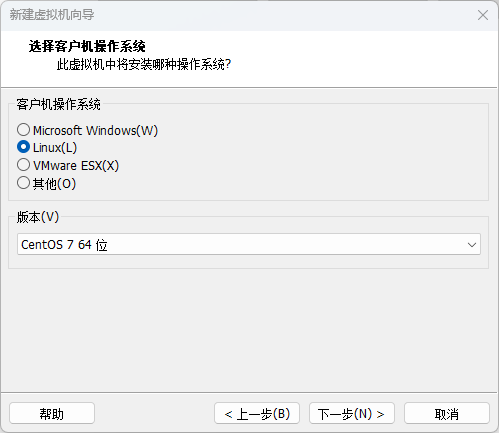

# Linux基础

## 系统安装

**Centos下载**

[Centos官网](https://centos.org/download/)

架构选择


选择isos


选择代理地址下载


选择镜像并下载


**VM安装**

[VM官网](https://www.vmware.com/cn/products/workstation-pro/workstation-pro-evaluation.html)

新建虚拟机


选择稍后安装，不然可能会在Centos安装时直接跳过设置




定义名称以及存储位置


## 目录结构

## 硬链接与软链接

**硬链接**

硬链接是指多个文件名指向同一个物理文件的链接。在使用硬链接时，文件系统会为每个链接分配一个索引节点（inode），并将它们都指向同一个数据块。不同的文件名都可以用来访问和修改同一个文件的内容，因为它们指向同一个数据块。删除任何一个链接都不会影响其他链接或原始文件。

**软链接**

软链接是一个特殊的文件，它包含指向另一个文件或目录的路径。它类似于一个快捷方式或符号链接。软链接创建的是一个新的文件，它包含了指向原始文件或目录的路径信息。删除原始文件或目录不会影响软链接的存在，但如果删除软链接本身，则无法再访问原始文件或目录。

**总结**

- 硬链接是多个文件名指向同一个物理文件，它们共享相同的数据块。
- 软链接是一个特殊的文件，它包含了指向另一个文件或目录的路径。
- 在使用时，硬链接只能在同一个文件系统中创建，而软链接可以跨越不同的文件系统。

# Linux命令

## 磁盘管理

### cd 目录操作

`cd a` 进入当前目录下的a目录

`cd a/b` 进入当前目录下的a目录下的b目录

`cd /a/b` 进入跟目录下的a目录下的b目录

`cd ..` 返回上一级目录

`cd ~` root回到/root目录 其他用户tom回到/home/tom

`cd -` 返回上次工作的目录

`cd /` 返回根目录

### mkdir 创建目录

**语法**

`mkdir [-p] dirName`

**参数**

- `-p`：确保目录名称存在，不存在的就建一个。

**实例**

`mkdir a` 在当前目录下创建a目录

`mkdir -p b/c` 创建多级目录 

### rmdir 删除空目录

**语法**

`rmdir [-p] dirName`

**参数**

- `-p`：是当子目录被删除后使它也成为空目录的话，则顺便一并删除。

**实例**

`rmdir aaa` 删除当前目录下的aaa目录

`rmdir -p bbb/test` 删除当前目录下的bbb目录下的test目录，如果test目录删除后bbb目录为空，则将bbb目录删除

### pwd 显示工作目录

`pwd` 显示当前所在目录

### ls 展示目录

**语法**

` ls [-alhrtAFR] [name...]` ll 是 ls -l 命令的别名

**参数**

- `-a`：显示所有文件及目录 (**.** 开头的隐藏文件也会列出)
- `-d`：只列出目录（不递归列出目录内的文件）。
- `-l`：以长格式显示文件和目录信息，包括权限、所有者、大小、创建时间等。
- `-h`：以人类可读的方式显示当前目录中的文件和目录大小
- `-r`：倒序显示文件和目录。
- `-t`：将按照修改时间排序，最新的文件在最前面。
- `-A`同 -a：但不列出 "." (目前目录) 及 ".." (父目录)
- `-F`：在列出的文件名称后加一符号；例如可执行档则加 "*", 目录则加 "/"
- `-R`：递归显示目录中的所有文件和子目录。

**实例**

`ls -l` 以长格式显示当前目录中的文件和目录

`ls -a` 显示当前目录中的所有文件和目录，包括隐藏文件

`ls -lh` 以人类可读的方式显示当前目录中的文件和目录大小

`ls -l /etc/passwd` 显示/etc/passwd文件的详细信息

`ls *.txt` 列出所有扩展名为.txt的文件

## 文件管理

### touch 创建文件

**语法**

`touch [参数] 文件...`

**参数**

- `-a`：只更改访问时间，用`ll`命令看到的时间为修改时间
- `-c`，`--no-create`：不创建任何文件
- `-d`，`--date=字符串`：使用指定字符串表示时间而非当前时间
- `-m`：只更改修改时间
- `-r`：参数允许你使用另一个文件的时间戳来更新目标文件的时间戳。

**实例**

`touch testfile` 修改testfile的修改时间和访问时间为当前系统时间，如果文件不存在，在当前目录下创建该文件

`touch -d '2023-12-17' deploy.sh` 修改deploy.sh的修改时间为2023-12-17

`touch -r reference_file.txt target_file.txt` 参考reference_file的时间戳修改target_file

### stat 文件详情

**语法**

`stat [文件或目录]`

**实例**

`stat testfile ` 显示文件的详细信息如下

```
# stat testfile                #输入命令
  File: `testfile'
  Size: 102             Blocks: 8          IO Block: 4096   regular file
Device: 807h/2055d      Inode: 1265161     Links: 1
Access: (0644/-rw-r--r--)  Uid: (    0/    root)   Gid: (    0/    root)
Access: 2014-08-13 14:07:20.000000000 +0800
Modify: 2014-08-13 14:07:07.000000000 +0800	指文件内容更改时间
Change: 2014-08-13 14:07:07.000000000 +0800 指文件元数据更改时间(权限,所有者等)
```

### cp 复制文件

**语法**

`cp [参数] 源文件 目标文件`

**参数**

- `-a`：此选项通常在复制目录时使用，它保留链接、文件属性，并复制目录下的所有内容。其作用等于 dpR 参数组合。
- `-d`：复制时保留链接。这里所说的链接相当于 Windows 系统中的快捷方式。
- `-r` ， `--recursive`：用于复制目录及其所有的子目录和文件，如果要复制目录，需要使用该选项。
- `-i` ， `--interactive`：在复制前提示确认，如果目标文件已存在，则会询问是否覆盖，回答 **y** 时目标文件将被覆盖。。
- `-u` ， `--update`：仅复制源文件中更新时间较新的文件。
- `-v` ， `--verbose`：显示详细的复制过程。
- `-p` ， `--preserve`：保留源文件的权限、所有者和时间戳信息。
- `-f` ， `--force`：强制复制，即使目标文件已存在也会覆盖，而且不给出提示。
- `-l`：不复制文件，只是生成硬链接文件。

**实例**

`cp file.txt /path/to/destination/` 将文件 file.txt 复制到目录 /path/to/destination/ 中

`cp –r test/ newtest` 将当前目录 test/ 下的所有文件复制到新目录 newtest 下

`cp file.txt /path/file1.txt` 将文件 file.txt 复制到目录 /path/中并重命名为file1.txt

### mv 移动文件

**语法**

`mv [参数] source dest`

`mv [参数] source... directory`

**参数**

- `-b`: 当目标文件或目录存在时，在执行覆盖前，会为其创建一个备份。
- `-i`: 如果指定移动的源目录或文件与目标的目录或文件同名，则会先询问是否覆盖旧文件，输入 y 表示直接覆盖，输入 n 表示取消该操作。
- `-f`: 如果指定移动的源目录或文件与目标的目录或文件同名，不会询问，直接覆盖旧文件。
- `-n`: 不要覆盖任何已存在的文件或目录。
- `-u`：当源文件比目标文件新或者目标文件不存在时，才执行移动操作。

**实例**

`mv aaa bbb` 将文件 aaa 改名为 bbb

`mv info/ logs ` 将 info 目录放入 logs 目录中。如果 logs 目录不存在，则该命令将 info 改名为 logs。

`mv /usr/runoob/* ` 将 /usr/runoob 下的所有文件和目录移到当前目录下

### cat 打印到标准输出

**语法**

`cat [-AbeEnstTuv] fileName`

**参数**

- `-n` ， `--number`：由 1 开始对所有输出的行数编号。

- `-b` ， `--number-nonblank`：和 -n 相似，只不过对于空白行不编号。

- `-s` ， `--squeeze-blank`：当遇到有连续两行以上的空白行，就代换为一行的空白行。

- `-v` ， `--show-nonprinting`：使用 ^ 和 M- 符号，除了 LFD 和 TAB 之外。

- `-E` ， `--show-ends` : 在每行结束处显示 $。

- `-T` ， `--show-tabs`: 将 TAB 字符显示为 ^I。

- `-A`，`--show-all`：等价于 -vET。

- `-e`：等价于"-vE"选项；

- `-t`：等价于"-vT"选项；

**实例**

`cat textfile1` 把textfile1的文档内容输出在屏幕中

`cat -n textfile1 > textfile2` 把 textfile1 的文档内容加上行号后输入 textfile2 这个文档里

`cat -b textfile1 textfile2 >> textfile3` 把 textfile1 和 textfile2 的文档内容加上行号（空白行不加）之后将内容附加到 textfile3 文档里

`cat /dev/null > /etc/test.txt` 清空 /etc/test.txt 文档内容

### find 查找文件和目录

**语法**

`find [路径] [匹配条件] [动作]`

**路径**

是要查找的目录路径，可以是一个目录或文件名，也可以是多个路径，多个路径之间用空格分隔，如果未指定路径，则默认为当前目录。

**匹配条件**

- `-name pattern`：按文件名查找，支持使用通配符 * 和 ?。
- `-type type`：按文件类型查找，可以是 f（普通文件）、d（目录）、l（符号链接）等。
- `-size [+-]size[cwbkMG]`：按文件大小查找，支持使用 + 或 - 表示大于或小于指定大小，单位可以是 c（字节）、w（字数）、b（块数）、k（KB）、M（MB）或 G（GB）。
- `-mtime days`：按修改时间查找，支持使用 + 或 - 表示在指定天数前或后，days 是一个整数表示天数。
- `-user username`：按文件所有者查找。
- `-group groupname`：按文件所属组查找。

**动作**

可选的，用于对匹配到的文件执行操作，比如删除、复制等。

**时间参数**

`+n`：查找比 n 天前更早的文件或目录。`-n`：查找在 n 天内更改过属性的文件或目录。`n`：查找在 n 天前（指定那一天）更改过属性的文件或目录。

- `-amin n`：查找在 n 分钟内被访问过的文件。
- `-atime n`：查找在 n*24 小时内被访问过的文件。
- `-cmin n`：查找在 n 分钟内状态发生变化的文件（例如权限）。
- `-ctime n`：查找在 n*24 小时内状态发生变化的文件（例如权限）。
- `-mmin n`：查找在 n 分钟内被修改过的文件。
- `-mtime n`：查找在 n*24 小时内被修改过的文件。

**实例**

`find . -name file.txt` 查找当前目录及其子目录下名为 file.txt 的文件

`find . -name "*.sh"` 将当前目录及其子目录下所有文件后缀为`.sh`的文件列出

`find /home -size +1M` 查找 /home 目录下大于 1MB 的文件

`find /var/log -mtime +7` 查找 /var/log 目录下在 7 天前修改过的文件

`find /var/log -type f -mtime +7 -ok rm {} \;` 查找 /var/log 目录中更改时间在 7 日以前的普通文件，并在删除之前询问它们

`find / -type f -size 0 -exec ls -l {} \;`  查找系统中所有文件长度为 0 的普通文件，并列出它们的完整路径

**实例说明**

`-ok`和`-exec` 是 find 命令中可以选择使用的选项，两者只需要选择其中一个使用即可。

`-ok`选项会在找到每个文件时询问用户是否执行特定操作。它需要用户手动确认执行命令，这样可以避免意外操作。

`-exec`选项会直接执行指定的命令，而不需要用户确认。它会将搜索到的文件作为参数传递给命令，并自动执行。

`{}`将会被匹配到的文件名替代  

`\;` 表示命令结束

### tail 查看日志

**语法**

`tail [参数] [文件]  `

**参数**

- `-f`：循环读取
- `-q`：不显示处理信息
- `-v`：显示详细的处理信息
- `-c<数目>`：显示的字节数
- `-n<行数>`：显示文件的尾部 n 行内容
- -`-pid=PID`：与`-f`合用在进程ID,PID死掉之后结束
- `-q`，`--quiet`， `--silent`：从不输出给出文件名的首部
- `-s`，`--sleep-interval=S`：与`-f`合用：表示在每次反复的间隔休眠S秒

**实例**

`tail notes.log` 显示 notes.log 文件的最后 10 行

`tail -f notes.log` 跟踪名为 notes.log 的文件的增长情况，当将某些行添加至 notes.log 文件时，tail 命令会继续显示这些行。 显示一直继续，直到您按下（Ctrl-C）组合键停止显示。

`tail -100f notes.log` 跟踪名为 notes.log 的文件的增长情况,显示100行

`tail -n +20 notes.log` 显示文件 notes.log 的内容，从第 20 行至文件末尾

`tail -n 20 notes.log` 显示文件 notes.log 的尾部20行内容

`tail -c 10 notes.log` 显示文件 notes.log 的最后 10 个字符

# 软件安装

## Nginx

**一、安装编译工具及库文件**

```
yum -y install make zlib zlib-devel gcc-c++ libtool  openssl openssl-devel
```

**二、安装 PCRE**

PCRE 作用是让 Nginx 支持 Rewrite 功能。

1、下载 PCRE 安装包，http://downloads.sourceforge.net/project/pcre/pcre/8.35/pcre-8.35.tar.gz

```
[root@bogon src]# cd /usr/local/src/
[root@bogon src]# wget http://downloads.sourceforge.net/project/pcre/pcre/8.35/pcre-8.35.tar.gz
```

2、解压安装包

```
[root@bogon src]# tar zxvf pcre-8.35.tar.gz
```

3、进入安装包目录

```
[root@bogon src]# cd pcre-8.35
```

4、编译安装 

```
[root@bogon pcre-8.35]# ./configure
[root@bogon pcre-8.35]# make && make install
```

5、查看pcre版本

```
[root@bogon pcre-8.35]# pcre-config --version
```

**三、安装Nginx**

1、下载 Nginx并解压，下载地址：https://nginx.org/en/download.html

```
[root@bogon src]# cd /usr/local/src/
[root@bogon src]# wget http://nginx.org/download/nginx-1.6.2.tar.gz
[root@bogon src]# tar zxvf nginx-1.6.2.tar.gz
```

2、进入安装包目录

```
[root@bogon src]# cd nginx-1.6.2
```

3、编译安装

- `--prefix=/usr/local/webserver/nginx`：指定 Nginx 的安装目录。
- `--with-http_stub_status_module`：启用 http_stub_status_module 模块，该模块提供了一个简单的状态页面，用于监控 Nginx 的运行状态和统计信息。
- `--with-http_ssl_module`：启用 http_ssl_module 模块，该模块提供了对 SSL/TLS 加密的支持，使 Nginx 能够处理 HTTPS 请求。
- `--with-pcre=/usr/local/src/pcre-8.35`：指定 PCRE（Perl Compatible Regular Expressions）库的路径。PCRE 是一个正则表达式库，用于处理正则表达式匹配。

```
[root@bogon nginx-1.6.2]# ./configure --prefix=/usr/local/webserver/nginx --with-http_stub_status_module --with-http_ssl_module --with-pcre=/usr/local/src/pcre-8.35
[root@bogon nginx-1.6.2]# make
[root@bogon nginx-1.6.2]# make install
```

4、查看nginx版本

```
[root@bogon nginx-1.6.2]# /usr/local/webserver/nginx/sbin/nginx -v
```

5、启动nginx

```
[root@bogon conf]# /usr/local/webserver/nginx/sbin/nginx
```

6、访问页面

`http://ip`

7、其他命令

```
/usr/local/webserver/nginx/sbin/nginx -s reload            # 重新载入配置文件
/usr/local/webserver/nginx/sbin/nginx -s reopen            # 重启 Nginx
/usr/local/webserver/nginx/sbin/nginx -s stop              # 停止 Nginx
```

