# 数据库三范式

1. **原子性**：

   列或者字段不能再分，要求属性具有原子性，不可再分解。

2. **唯一性**：

   一张表只说一件事，对记录的惟一性约束，要求记录有惟一标识，即实体的惟一性。

3. **直接性**：

   数据不能存在传递关系，即每个属性都跟主键有直接关系，而不是间接关系。

例如：考虑一个订单表【Order】（OrderId，OrderDate，CustomerID，CustomerName，CustomerAddr，CustomerCity）主键是（OrderID）。 CustomerName，CustomerAddr，CustomerCity 直接依赖的是 CustomerID，而不是直接依赖于主键，它是通过传递才依赖于主键，所以不符合 3NF。

# SQL几种连接

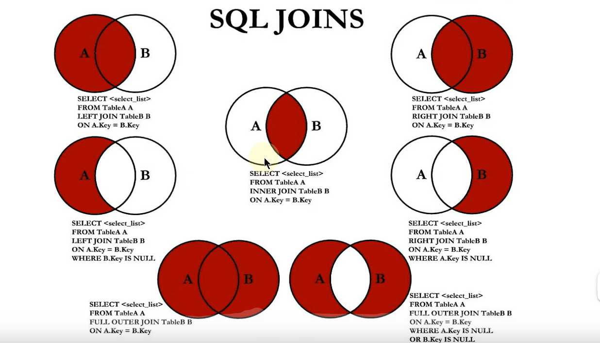

- **内连接**（Inner Join）：匹配2张表中相关联的记录。
- **左外连接**（Left Outer Join）：除了匹配2张表中相关联的记录外，还会匹配左表中剩余的记录，右表中未匹配到的字段用NULL表示。
- **右外连接**（Right Outer Join）：除了匹配2张表中相关联的记录外，还会匹配右表中剩余的记录，左表中未匹配到的字段用NULL表示。
- **全外连接**（Full Outer Join）：任意一个表的内容都将被查询出来，如果另一个表无对应的项，则显示为null。

# SQL执行顺序

```
select [distinct] 字段1,字段2 | [聚合函数]
from 表1
[join 表2 on 连接条件]
[join 表3 on 连接条件]
where 查询条件
	[group by 分组字段 having[分组后条件筛选]]
	[order by 排序字段 排序方式]
	[limit m,n]
```

1. 先走from,确定从那些表中查询数据

2. join操作

3. 执行where筛选

4. group by 分组  ,分组函数就执行,聚合函数就执行了
5. having 筛选

6. select 决定要显示那些字段

7. distinct操作

8. order by 排序操作

9. limit 分页

# 事务特性ACID

事务简介：多条sql语句，要么全部成功，要么全部失败。

- **原子性**（Atomicity）： 

  事务是最小单元,不可分隔.事务中的所有操作要么全部成功,要么全部失败。

- **一致性**（Consistency）：

   事务执行完毕之后,应该从一个一致性状态到另外一个一致性状态(如A转账100元给B，不管操作是否成功，A和B的账户总额是不变的)。

- **隔离性**（Isolation）：

  在事务正确提交之前，不允许把该事务对数据的任何改变提供给任何其他事务。

- **持久性**（Durability）：

  事务一旦提交，所做的操作终将要持久化到数据库中，即使在事务提交后有了其他故障， 事务的处理结果也会得到保存。

# 事务隔离级别

查看当前隔离级别`select @@global.tx_isolation;`

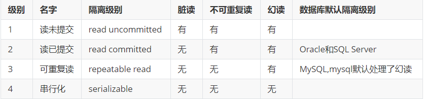

- **读未提交**（read Uncommited）

最低的隔离级别，允许读取尚未提交的数据变更，可能会导致**脏读**、**幻读**或**不可重复读**。

- **读已提交**（read commited）

允许读取并发事务已经提交的数据，可以阻止脏读，但是**幻读**或**不可重复读**仍有可能发生。

- **可重复读**（Repeatable read）

这是 MySQL 的默认隔离级别，它确保了一个事务中多个实例在并发读取数据的时候会读取到一样的数据；**幻读** 仍有可能发生。InnoDB 和 Falcon 存储引擎通过多版本并发控制（MVCC，Multiversion Concurrency Control）机制解决了该问题。

- **可串行化**（serializable）

事务的最高级别，它通过强制事务排序，使之不可能相互冲突，从而解决幻读问题。简言之，它是在每个读的数据行上加上共享锁，事务串行执行。在这个级别，可能导致大量的超时现象和锁竞争，一般为了提升程序的吞吐量不会采用这个。

# 并发事务带来哪些问题?

- **脏读**：

  **一个事务读取到另外一个事务未提交的数据。**当一个事务正在访问数据并且对数据进行了修改，而这种修改还没有提交到数据库中，这时另外一个事务也访问了这个数据，然后使用了这个数据。因为这个数据是还没有提交的数据，那么另外一个事务读到的这个数据是“脏数据”，依据“脏数据”所做的操作可能是不正确的。

- **不可重复读**：

  **在一个事务中,两次读取某些记录的结果不一致.是因为某些事务更新了这些数据导致的** 。指在一个事务内多次读同一数据。在这个事务还没有结束时，另一个事务也访问该数据。那么，在第一个事务中的两次读数据之间，由于第二个事务的修改导致第一个事务两次读取的数据可能不太一样。这就发生了在一个事务内两次读到的数据是不一样的情况，因此称为不可重复读。

- **幻读(虚读**)：

  在一个事务中,两次统计的结果不一致,是因为某些事务新增或者删除了这些数据导致的。指当用户读取某一范围的数据行时，**另一个事务又在该范围内插入了新行**，当用户再读取该范围的数据行时，会发现有新的“幻影” 行。

- **丢失修改**：

  指在一个事务读取一个数据时，另外一个事务也访问了该数据，那么在第一个事务中修改了这个数据后，第二个事务也修改了这个数据。这样第一个事务内的修改结果就被丢失，因此称为丢失修改。 例如：事务1读取某表中的数据A=20，事务2也读取A=20，事务1修改A=A-1，事务2也修改A=A-1，最终结果A=19，事务1的修改被丢失。

# Mysql的存储引擎有哪些？

MyISAM、InnoDB、BDB(Berkeley DB)、MEMORY(Heap)、MERGE、EXAMPLE、NDB CIuster、 ARCHIVE、CSV、BLACKHOLE、FEDERATED。

InnoDB和BDB提供事务安全表，其他存储引擎都是非事务安全表。

# 常用的存储引擎介绍（待补充）

- **Myisam**

MySQL5.5 版本之前的默认存储引擎，如果应用是以读写操作和插入操作为主，只有很少的更新和删除操作，并且对事务的完整性、并发性要求不是很高，那么可选用此种存储引擎。

每个Myisam在磁盘上存储成三个文件。文件名都和表名相同，扩展名分别为**.frm**（存储表定义）、**.MYD**（MYData，存储数据）、**.MYI**（MYIndex，存储索引）。

主要特点：支持表级锁，不支持事务，外键。

适用场景：对事务的完整性没有要求，或以 select、insert 为主的应用基本都可以选用MYISAM。在 Web、数据仓库中应用广泛。

- **InnoDB**

MySQL5.5 版本之后的默认存储引擎，用于事务处理应用程序，支持外键。如果应用对事务的完整性有比较高的要求，在并发条件下要求数据一致性，数据操作除了插入和查询以外，还包括很多的更新删除操作，则InnoDB比较合适。InnoDB存储引擎除了能有效地降低由于删除和更新操作导致的锁定，还可以确保事务的完整提交和回滚。

表结构放在**frm文件**，数据和索引放在**IBD文件**。

主要特点：支持事务，支持行级锁，支持聚集索引方式存储数据。

- **Memory(Heap)**

MEMORY存储引擎将表中的数据存储到内存中，未查询和引用其他表数据提供快速访问。每一个表实际上和一个磁盘文件关联，文件是frm。

- **Merge**

用于将一系列等同的MyISAM表以逻辑方式组合在一起，并作为一个对象引用它们。Merge表的优点在于可以突破对单个MyISAM表大小的限制，并且将不同的表分布在多个磁盘上，可以有效地改善Merge表的访问效率。

# InnoDB与MyISAM的区别

- InnoDB支持**事务**，MyISAM不支持，对于InnoDB每一条SQL语言都默认封装成事务，自动提交，这样会影响速度，所以最好把多条SQL语言放在begin和commit之间，组成一个事务。
- InnoDB支持**外键**，而MyISAM不支持。对一个包含外键的InnoDB表转为MYISAM会失败。
- InnoDB是**聚集索引**，数据文件是和索引绑在一起的，必须要有主键，通过主键索引效率很高。 但是辅助索引需要两次查询，先查询到主键，然后再通过主键查询到数据。因此，主键不应该过大，因为主键太大，其他索引也都会很大。而MyISAM是**非聚集索引**，数据文件是分离的， 索引保存的是数据文件的指针。主键索引和辅助索引是独立的。
- InnoDB不保存表的具体行数，执行select count(*) from table时需要全表扫描。而MyISAM用一个变量保存了整个表的行数，执行上述语句时只需要读出该变量即可，速度很快。
- InnoDB不支持全文索引，而MyISAM支持全文索引，查询效率上MyISAM要高。
- InnoDB支持到**行级锁**，MyISAM只支持到**表级锁**。

# 什么是索引?

官方介绍索引是帮助MySQL**高效获取数据**的**数据结构**。更通俗的说，数据库索引好比是一本书前面的目录，能加快数据库的查询速度。

我们通常所说的索引，包括聚集索引、覆盖索引、组合索引、前缀索引、唯一索引等，没有特别说明，默认都是使用B+树结构组织的索引。

# 索引设计原则

- 搜索的索引列，不一定是所要选择的列。最适合索引的列是出现在WHERE子句中的列，或连接子句中指定的列，而不是出现在SELECT关键字后的选择列表中的列。
- 使用唯一索引。考虑某列中值的分布。对于唯一值的列，索引的效果最好，而具有多个重复值的列，其索引效果最差。
- 在经常⽤在连接的列上，这些列主要是⼀些外键，可以加快连接的速度。
- 在经常需要排序的列上创建索引，因为索引已经排序，这样查询可以利⽤索引的排序，加快排序查询时间。
- 使用短索引。如果对串列进行索引，应该指定一个前缀长度，只要有可能就应该这做样。例如，如果有一个CHAR(200)列，如果在前10个或20个字符内，多数值是惟一的，那么就不要对整个列进行索引。
- 最左匹配原则
- 不要过度索引。每个额外的索引都要占用额外的磁盘空间，并降低写操作的性能。在修改表的内容时，索引必须进行更新，有时可能需要重构，因此，索引越多，所花的时间越长。
- 考虑在列上进行的比较类型。索引可用于”<”、”<=”、”=”、”>=”、">”和BETWEEN运算。索引也用于LIKE%运算。如果只将某个列用于其他类型的运算时（如STRCMP(),对其进行索引没有价值。

# Msql有哪些索引?

- 数据结构角度
  - BTREE
  - HASH
  - FULLTEXT
  - R-TREE
- 物理存储角度
  - 聚集索引
  - 非聚集索引
- 从逻辑角度
  - 普通索引：仅加速查询
  
  - 唯一索引：加速查询＋列值唯一（可以有null）
  
  - 主键索引：加速查询＋列值唯一（不可以有null）
  
  - 组合索引：多列值组成一个索引，专门用于组合搜索
  
  - 全文索引：对文本的内容进行分词，进行搜索
  
    查询操作在数据量⽐较少时，可以使⽤like模糊查询，但是对于⼤量的⽂本数据检索，效率很低。如果使⽤全⽂索引，查询速度会⽐like快很多倍。
  
    在MySQL 5.6 以前的版本，只有MyISAM存储引擎⽀持全⽂索引，从 MySQL 5.6开始MyISAM和InnoDB存储引擎均⽀持。
  
    全⽂索引⽅式有⾃然语⾔检索 IN NATURAL LANGUAGE MODE和布尔检索 IN BOOLEAN MODE两种和常⽤的like模糊查询不同，全⽂索引有⾃⼰的语法格式，使⽤ match 和 against 关键字，⽐如
  
    ```sql
    SELECT * FROM users3 WHERE MATCH(NAME) AGAINST('aabb');
    -- * 表示通配符,只能在词的后⾯
    SELECT * FROM users3 WHERE MATCH(NAME) AGAINST('aa*' IN BOOLEAN MODE);
    ```
  
    全⽂索引必须在字符串、⽂本字段上建⽴。
  
    全⽂索引字段值必须在最⼩字符和最⼤字符之间的才会有效（innodb：3-84；myisam：4-84）。
  
  - 前缀索引：在文本类型如CHAR,VARCHAR,TEXT类列上创建索引时，可以指定索引列的长度，但是数值类型不能指定。
  
  - 空间索引：MySQL在5.7之后的版本支持了空间索引，而且支持OpenGIS几何数据模型。MySQL在空间索引这方面遵循OpenGIS几何数据模型规则。

# 自适应哈希索引

⾃适应Hash索引（Adatptive Hash Index，内部简称AHI）是InnoDB的三 ⼤特性之⼀，还有两个是 Buffer Pool简称BP、双写缓冲区（Doublewrite Buffer）。

⾃适应即我们不需要⾃⼰处理，当InnoDB引擎根据查询统计发现某⼀ 查询满⾜hash索引的数据结构特点，就会给其建⽴⼀个hash索引。

hash索引底层的数据结构是散列表（Hash表），其数据特点就是⽐较适合在内存中使⽤，⾃适应Hash索引存在于InnoDB架构中的缓存中（不存在于磁盘架构中）。

⾃适应hash索引只适合搜索等值的查询，如select * from table where index_col='xxx'，⽽对于其他查找类型，如范围查找，是不能使⽤的。

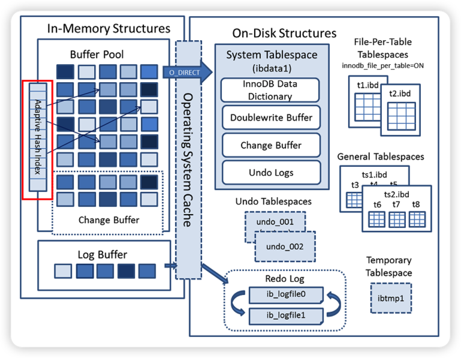

Adaptive Hash Index是针对B+树Search Path的优化，因此所有会涉及到 Search Path的操作，均可使⽤此Hash索引进⾏优化。

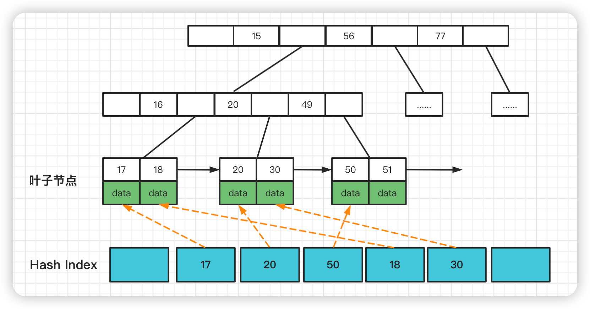

根据索引键值(前缀)快速定位到叶⼦节点满⾜条件记录的Offset，减少了 B+树Search Path的代价，将B+树从Root节点⾄Leaf节点的路径定位，优化为Hash Index的快速查询。

InnoDB的⾃适应Hash索引是默认开启的，可以通过配置下⾯的参数设置进⾏关闭。`innodb_adaptive_hash_index = off`

⾃适应Hash索引使⽤分⽚进⾏实现的，分⽚数可以使⽤配置参数设置：`innodb_adaptive_hash_index_parts = 8`

# Hash索引优缺点

Hash底层实现是由Hash表来实现的，是根据键值  存储数据的结构。⾮常适合根据key查找value值，也就是单个key查询，或者说等值查询。

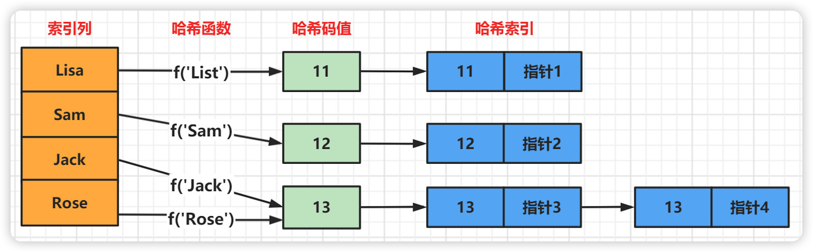

**优点**

- 快速查询：Hash索引采用哈希算法进行快速数据定位，因此查询速度非常快。
- 节省存储空间：Hash索引不需要存储指向具体数据位置的指针，因此相较于B+树索引，可以节省更多的存储空间。

**缺点**

- 哈希索引只⽀持等值⽐较查询。不⽀持任何范围查询和部分索引列匹配查找。
- 哈希索引数据并不是按照索引值顺序存储的，所以也就⽆法⽤于排序。
- 哈希索引能够使用的数据类型有限，仅适用于整数、数字和字符等简单类型的数据。

# B树和B+树

## B-Tree

**B-Tree简介**

B-Tree是⼀种平衡的多路查找树,B树允许⼀个节点存放多个数据. 这样可以 在尽可能减少树的深度的同时,存放更多的数据(把瘦⾼的树变的矮胖)。

B-Tree中所有节点的**⼦树个数的最⼤值**称为B-Tree的阶,⽤m表示.⼀颗m阶 的B树,如果不为空,就必须满⾜以下条件

- 每个节点最多拥有m-1个关键字(根节点除外)
- 根节点⾄少有两个⼦树(可以没有⼦树,有就必须是两个)
- 分⽀节点⾄少有(m/2)颗⼦树 (除去根节点和叶⼦节点其他都是分⽀节点)
- 所有叶⼦节点都在同⼀层,并且以升序排序

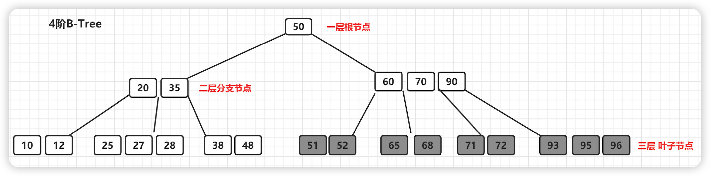

该图中节点【60,70,90】拥有的⼦节点数⽬最多，四个⼦节点（灰⾊节点），所以上⾯的B-Tree为4阶B树。

**B-Tree结构存储索引的特点**

为了描述B-Tree⾸先定义⼀条记录为⼀个键值对[key, data] ，key为记录的 键值，对应表中的主键值(聚簇索引)，data为⼀⾏记录中除主键外的数据。 对于不同的记录，key值互不相同

- 索引值和data数据分布在整棵树结构中
- ⽩⾊块部分是指针,存储着⼦节点的地址信息。
- 每个节点可以存放多个索引值及对应的data数据
- 树节点中的多个索引值从左到右升序排列

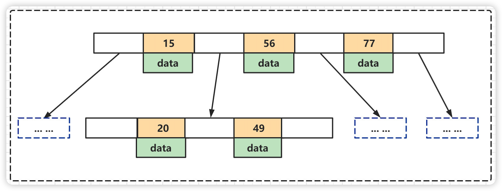

**B-Tree的查找操作**

B-Tree的每个节点的元素可以视为一次I/O读取，树的高度表示最多的I/O次数，在相同数量的总元素个数下，每个节点的元素个数越多，高度越低，查询所需的I/O次数越少。

**B-Tree总结**

* 优点：B树可以在内部节点存储键值和相关记录数据，因此把频繁访问的数据放在靠近根节点的位置将大大提高热点数据的查询效率。
* 缺点：B树中每个节点不仅包含数据的key值,还有data数据. 所以当data数据较大时,会导致每个节点存储的key值减少,并且导致B树的层数变高.增加查询时的IO次数。
* 使用场景：B树主要应用于文件系统以及部分数据库索引，如MongoDB，大部分关系型数据库索引则是使用B+树实现。

## B+Tree

B+Tree是在B-Tree基础上的一种优化，使其更适合实现存储索引结构，InnoDB存储引擎就是用B+Tree实现其索引结构。

**B+Tree的特征**

- 非叶子节点只存储键值信息
- 所有叶子节点之间都有一个链指针，方便做范围查找
- 数据记录都存放在叶子节点中

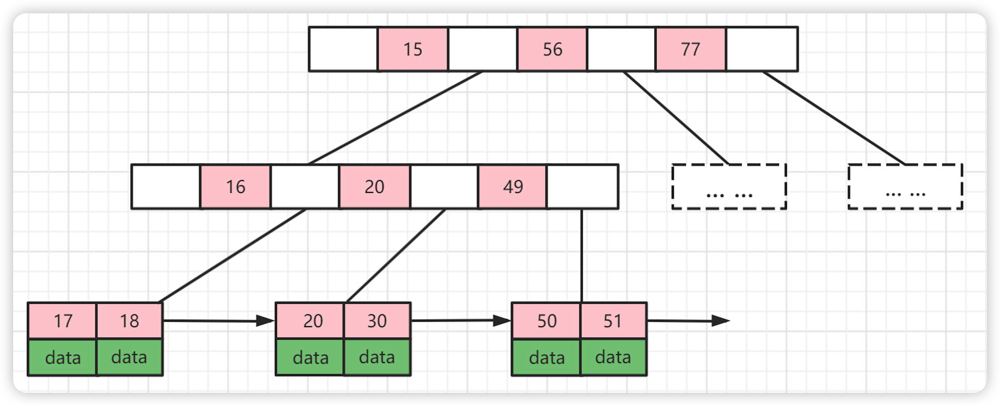

**B+Tree的优势**

1. B+Tree扫库和扫表能力更强，如果我们要根据索引去进行数据表的扫描，对B Tree进行扫描，需要把整棵树遍历一遍，而B+Tree只需要遍历他的所有叶子节点即可（叶子节点之间有引用）。
2. B+Tree磁盘读写能力更强，他的根节点和支节点不保存数据区，所有根节点和支节点同样大小的情况下，保存的关键字要比B Tree要多。而叶子节点不保存子节点引用。所以，B+Tree读写一次磁盘加载的关键字比B Tree更多。
3. B+Tree排序能力更强，如上面的图中可以看出，B+Tree天然具有排序功能。

# 聚集索引和非聚集索引

聚集索引与⾮聚集索引的区别是：叶节点是否存放⼀整⾏记录。

- **聚簇索引**：将数据存储与索引放到了⼀块,索引结构的叶⼦节点保存了行数据
- **⾮聚簇索引**：将数据与索引分开存储，索引结构的叶⼦节点指向了数据对应的位置

InnoDB 主键使⽤的是聚簇索引，MyISAM 不管是主键索引，还是⼆级索引使⽤的都是⾮聚簇索引。

在InnoDB引擎中，主键索引采⽤的就是聚簇索引结构存储。

## 聚簇索引（聚集索引）

- 聚簇索引是⼀种数据存储⽅式，InnoDB的聚簇索引就是按照主键顺序构建 B+Tree结构。B+Tree 的叶⼦节点就是⾏记录，⾏记录和主键值紧凑地存储在⼀起。 这也意味着 InnoDB 的主键索引就是数据表本身，它按主键顺序存放了整张表的数据，占⽤的空间就是整个表数据量的⼤⼩。通常说的主键索引就是聚集索引。

- InnoDB的表要求必须要有聚簇索引

  - 如果表定义了主键，则主键索引就是聚簇索引
  - 如果表没有定义主键，则第⼀个⾮空unique列作为聚簇索引
  - 否则InnoDB会从建⼀个隐藏的row-id作为聚簇索引
  - 一张表只有只能有一个聚集索引

- **辅助索引**：InnoDB辅助索引，也叫作⼆级索引，是根据索引列构建 B+Tree结构。 但在 B+Tree 的**叶⼦节点中只存了索引列和主键的信息**。⼆级索引占⽤的空间会⽐聚簇索引⼩很多， 通常创建辅助索引就是为了提升查询效率。⼀个表InnoDB只能创建⼀个聚簇索引，但可以创建多个辅助索引。

  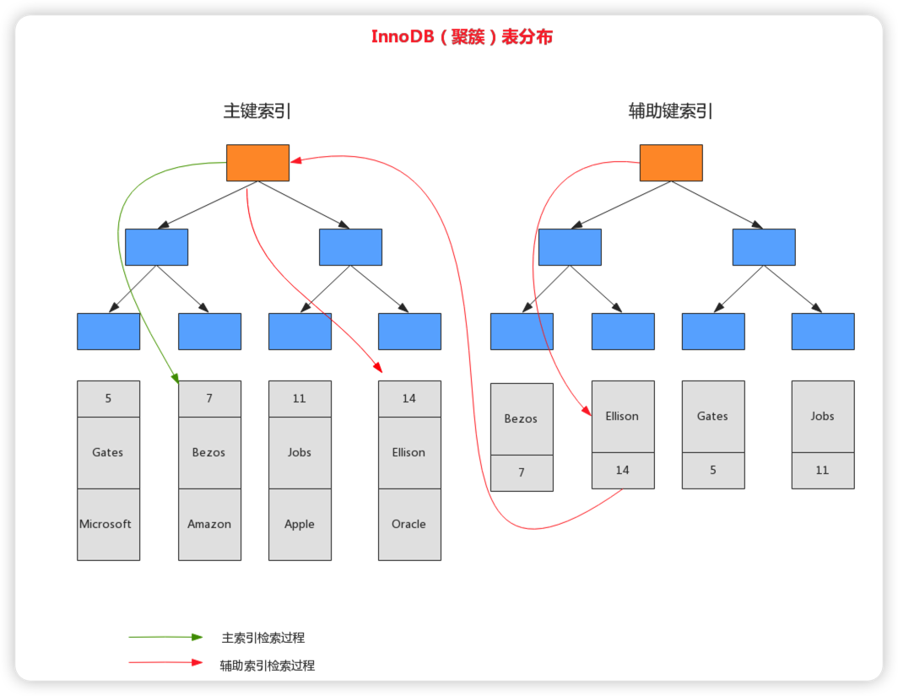

图中是一张字段为id、name、db的表，创建name为辅助索引，辅助索引中存储该字段与主键索引，通过name来检索数据的时候会先在辅助索引中找到主键，再通过主键来检索到整行。执行一次查询就是一次IO,如果辅助索引搜索深度为3，主键索引深度为3，那检索数据就要进行3+2次逻辑IO。

## 非聚簇索引

innodb中除聚集索引之外其他的索引都是非聚集索引,非聚集索引的值存放的聚集索引的值。

myisam中所有的索引都是非聚集索引,且每个索引中存放的都是数据的地址.查询的时候,先找到的数据的地址,然后通过地址定位到每条数据上。

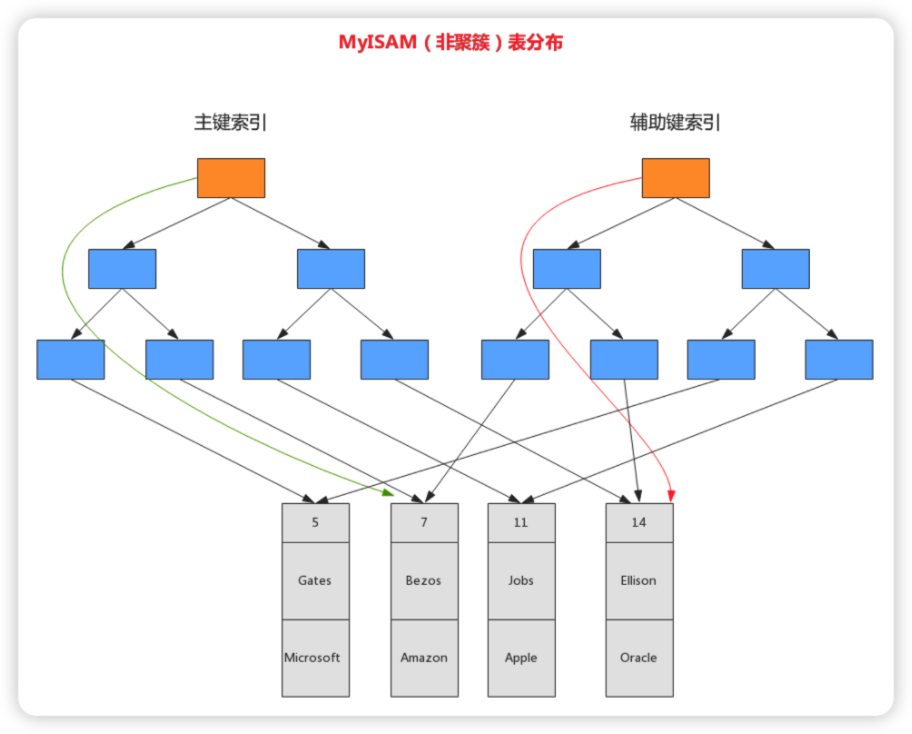

这两颗B+树的叶子节点都使用一个地址指向真正的表数据，对于表数据来说，这两个键没有任何差别。由于 索引树是独立的，通过辅助键检索无需访问主键的索引树 。

**聚簇索引的优点**

- 当你需要取出一定范围内的数据时，用聚簇索引也比用非聚簇索引好。
- 当通过聚簇索引查找目标数据时理论上比非聚簇索引要快，因为非聚簇索引定位到对应主键时还要多一次目标记录寻址,即多一次I/O。
- 可以使用覆盖索引进行查询优化。

**聚簇索引的缺点**

- 更新主键的代价很高，因为将会导致被更新的行移动。因此，对于InnoDB表，我们一般定义主键为不可更新。
- 插入速度严重依赖于插入顺序，按照主键的顺序插入是最快的方式，否则将会出现页分裂，严重影响性能。因此，对于InnoDB表，我们一般都会定义一个自增的ID列为主键

# 什么是回表

当通过辅助索引来寻找数据时，InnoDB存储引擎会遍历辅助索引并通过叶级别的指针获得指向主键索引的主键，然后再通过主键索引（聚集索引）来找到一个完整的行记录。这个过程也被称为 **回表** 。

# 如何避免回表

索引覆盖被查询的字段。

比如说user表（id,username,age,sex）创建索引（username,age）`select age from user where username = 'xxx'`。这个索引包含所有需要查询的字段的值，称为索引覆盖，可以避免回表。

# 什么是覆盖索引

既然多个列可以组合起来构建为联合索引，那么辅助索引自然也可以由多个列组成。

InnoDB存储引擎支持覆盖索引(covering index，或称索引覆盖)，即从辅助索引中就可以得到查询的记录，而不需要查询聚集索引中的记录(回表)。使用覆盖索引的一个好处是辅助索引不包含整行记录的所有信息，故其大小要远小于聚集索引，因此可以减少大量的IO操作。

# 索引下推

索引下推（index condition pushdown ）简称ICP，在Mysql5.6的版本上推出，⽤于优化查询。

需求: 查询users表中 "名字第⼀个字是张，年龄为10岁的所有记录"。

```sql
SELECT * FROM users WHERE user_name LIKE '张%' AND user_age = 10;
```

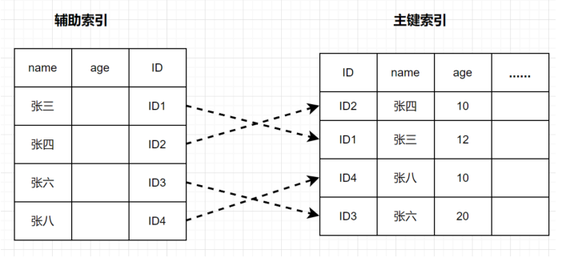

图中在 (name,age) 索引⾥⾯特意去掉了 age 的值，这个过程 InnoDB 并不会去看 age 的值，只是按顺序把“name 第⼀个字是’张’”的记录⼀条条取出来回表。因此，需要回表 4 次。

MySQL 5.6引⼊了索引下推优化，可以在索引遍历过程中，对索引中包含的字段先做判断，过滤掉不符合条件的记录，减少回表次数。

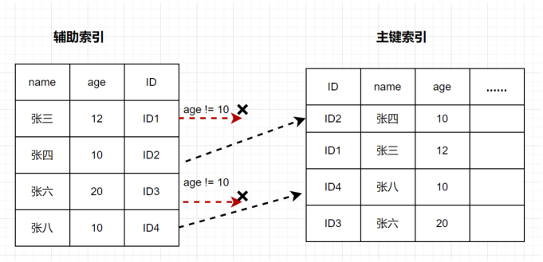

图中InnoDB 在 (name,age) 索引内部就判断了 age 是否等于 10，对于不等于 10 的记录，直接判断并跳过,减少回表次数。

在⽀持ICP优化后，MySQL会在取出索引的同时，判断是否可以进⾏where 条件过滤再进⾏索引查询，也就是说提前执⾏where的部分过滤操作，在某些场景下，可以⼤⼤减少回表次数，从⽽提升整体性能。

# SQL优化手段有哪些

- 查询语句中不要使用select *
- 尽量减少子查询，使用关联查询（left join,right join,inner join）替代。
- 减少使用IN或者NOT IN ,使用exists，not exists或者关联查询语句替代。
- or 的查询尽量用 union或者union all 代替(在确认没有重复数据或者不用剔除重复数据时， union all会更好， union all会把重复数据去掉)。
- 应尽量避免在 where 子句中使用!=或<>操作符，否则将引擎放弃使用索引而进行全表扫描。
- 应尽量避免在 where 子句中对字段进行 null 值判断，否则将导致引擎放弃使用索引而进行全表扫描，如： select id from t where num is null 可以在num上设置默认值0，确保表中num列没有 null值，然后这样查询： select id from t where num=0。
- 使用覆盖索引
- 复合索引遵循最左原则

# 最左前缀原则

给user表添加了组合索引 (id,name,email).就相当于添加了三个索引

alter table user add index(id,name,email);
- id

- id,name

- id,name,email

  ```sql
  select * from user where id = 1;-- 有效
  select * from user where id = 1 and name like 'jack%';-- 有效
  -- name和id前后顺序不会影响,因为查询时候mysql内部会进行优化
  select * from user where name like 'jack%' and id = 1 ;-- 有效
  select * from user where id = 1 and name like 'jack%' and email like 'jack%';-- 有效
  select * from user where name like 'jack%';-- 无效
  -- id字段会用到索引,email不会用到
  select * from user where id = 1 and email like 'jack%';-- 无效
  select * from user where name like 'jack%' and email like 'jack%';-- 无效
  ```

# 索引哪些情况下会失效？

- 索引字段上使用!=、<>、is null、is not null、not in、not操作符
- 查询条件包含 or，会导致索引失效。
- 应尽量避免在 where 子句中对字段进行函数、算数运算、表达式操作
- 列是字段类型，查询时一定要给值加引号，否则索引失效
- Like查询，避免左%xxx，否则索引失效
- 正确使用联合索引，遵循最左匹配原则，否则也会失效
- 相 join 的两个表的字符编码不同，不能命中索引，会导致笛卡尔积的循环计算

# MVCC

## 简介

​		多版本并发控制（MVCC=Multi-Version Concurrency Control），是一种用来解决读 - 写冲突的无锁并发控制。也就是为事务分配单向增长的时间戳，为每个修改保存一个版本。版本与事务时间戳关联，读操作只读该事务开始前的数据库的快照（复制了一份数据）。这样在读操作不用阻塞写操作，写操作不用阻塞读操作的同时，避免了脏读和不可重复读。

## 解决了什么问题

​		在并发读写数据库时，可以做到在读操作时不用阻塞写操作，写操作也不用阻塞读操作，提高了数据库并发读写的性能。同时还可以解决脏读、幻读、不可重复读等事务隔离问题，但不能解决更新丢失问题。

## 实现原理

​		MVCC 的目的就是多版本并发控制，在数据库中的实现，就是为了解决读写冲突，它的实现原理主要是依赖记录中的 3 个隐式字段、undo 日志、Read View 来实现的。

# 死锁

## 简介

是指两个或两个以上进程执行过程中，因竞争共享资源造成的相互等待现象。

## 如何处理死锁

- 设置超时时间。超时后自动释放。
- 发起死锁检测，主动回滚其中一条事务，让其他事务继续执行。

## 如何避免死锁

- 设置获取锁的超时时间，至少能保证最差情况下，可以退出程序，不至于一直等待导致死锁；
- 获取资源时，尽量一次获取所有资源避免互相等待