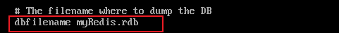
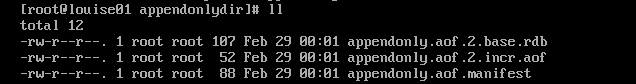

# Redis是什么？

[Redis](https://redis.io/)是一个基于 C 语言开发的开源数据库（遵守BSD协议），数据存储在**内存**中（内存数据库），读写速度非常快，被广泛应用于缓存方向。并且，Redis 存储的是 **KV 键值对数据**。

为了满足不同的业务场景，Redis 内置了多种数据类型实现（比如 **String、List、Hash、Set、Sorted Set、Bitmap、HyperLogLog、GEO**）。

它内置了**复制（Replication）**、**LUA 脚本（Lua scripting）**、**LRU 缓存淘汰（LRU eviction）**、**事务（Transactions）**、**发布/订阅**、**流技术**和不同级别的**磁盘持久化（persistence）**功能。

并提供了**主从模式**、 **Redis Sentinel（哨兵）**和 **Redis Cluster（集群）**保证缓存的高可用性（High availability）。

[英文官网 https://redis.io/](https://redis.io/)

[中文网站 https://redis.com.cn/documentation.html](https://redis.com.cn/documentation.html)

[官网下载地址 https://redis.io/download/](https://redis.io/download/)

[源码地址 https://github.com/redis/redis](https://github.com/redis/redis)

[在线测试 https://try.redis.io/](https://try.redis.io/)

[命令参考 http://doc.redisfans.com/](http://doc.redisfans.com/)

# Redis能干嘛？

## Redis用途

1. 分布式缓存，挡在mysql之前的带刀护卫。
2. 内存存储和持久化（RDB+AOF），redis支持异步将内存中的数据写到硬盘上，同时不影响继续服务
3. 高可用架构（单机、主从、哨兵、集群）
4. 缓存穿透、击穿、雪崩
5. 分布式锁
6. 队列
7. 排行榜+点赞
8. 。。。。。。

## Redis优势

1. 性能极高，redis读取速度110000次/秒，写的速度81000次/秒
2. redis数据类型丰富，不仅仅支持简单的key-value类型的数据，同时还提供list、set、zset、hash等数据结构
3. redis支持数据的持久化，可以将内存的数据持久化到磁盘中，重启的时候再次加载使用
4. redis支持数据的备份，即master-slave模式的数据备份

# Redis迭代演化


[历史版本源码 https://download.redis.io/releases/](https://download.redis.io/releases/) 版本号如果第二位是奇数，则为非稳定版本如2.7、2.9

[历史版本新特性 https://github.com/redis/redis/releases](https://github.com/redis/redis/releases)

## Redis7.0新特性todo


# Redis安装与卸载

**Redis安装**

```
0、gcc编译环境确认
gcc是linux下的一个编译程序，是C程序的编译工具。
查看gcc版本 gcc -v
安装gcc yum -y install gcc-c++


1、下载redis到/opt目录下
cd /opt
wget https://download.redis.io/releases/redis-7.0.0.tar.gz

2、解压
tar -zxvf redis-7.0.0.tar.gz

3、进入目录
cd redis-7.0.0

4、执行make命令
make && make install

5、查看默认安装目录 /usr/local/bin  /usr/local类似于windows系统中的C:\Program Files
redis-benchmark：性能测试工具
redis-check-aof：修复有问题的AOF文件
redis-check-dump：修复有问题的dump.rdb文件
redis-cli：客户端
redis-sentinel：redis集群使用
redis-server：redis服务启动命令

6、修改redis.conf配置文件
vim /opt/redis-7.0.0/redis.conf
默认daemonize no      改为  daemonize yes  通过后台启动
默认protected-mode  yes      改为  protected-mode no  安全模式，开启外部无法连接
默认bind 127.0.0.1      改为  直接注释掉或改成本机IP地址，否则影响远程IP连接
添加redis密码      改为 requirepass 你自己设置的密码

7、启动服务
cd /usr/local/bin
redis-server /opt/redis-7.0.0/redis.conf

8、连接服务
redis-cli -a password 或 redis-cli 登录后 auth password
如果出现中文乱码可以使用 redis-cli --raw

9、校验是否启动成功
127.0.0.1:6379> ping
PONG

10、关闭服务
redis-cli -a password shutdown
```

**Redis卸载**

```
1、关闭服务
redis-cli -a password shutdown

2、删除/usr/local/lib下关于redis的文件
ls -l /usr/local/bin/redis-*
rm -rf /usr/local/bin/redis-*
```

# Redis 为什么这么快？

1. Redis 基于内存，内存的访问速度是磁盘的上千倍。
2. Redis 基于 Reactor 模式设计开发了一套高效的事件处理模型，主要是**单线程事件循环**(单线程的话就能避免多线程的频繁上下文切换问题)和 **非阻塞的IO多路复用**。
3. Redis 内置了多种优化过后的数据结构实现，性能非常高。
4. Redis 是用C语言实现的


# 为什么要用 Redis/为什么要用缓存？

**1、高性能**
假如用户第一次访问数据库中的某些数据的话，这个过程是比较慢，毕竟是从硬盘中读取的。但是，如果说，用户访问的数据属于高频数据并且不会经常改变的话，那么我们就可以很放心地将该用户访问的数据存在缓存中。
这样有什么好处呢？ 那就是保证用户下一次再访问这些数据的时候就可以直接从缓存中获取了。操作缓存就是直接操作内存，所以速度相当快。

**2、高并发**

一般像 MySQL 这类的数据库的 QPS 大概都在 1w 左右（4 核 8g） ，但是使用 Redis 缓存之后很容易达到 10w+，甚至最高能达到 30w+（就单机 Redis 的情况，Redis 集群的话会更高）。

> QPS（Query Per Second）：服务器每秒可以执行的查询次数；

由此可见，直接操作缓存能够承受的数据库请求数量是远远大于直接访问数据库的，所以我们可以考虑把数据库中的部分数据转移到缓存中去，这样用户的一部分请求会直接到缓存这里而不用经过数据库。进而，我们也就提高了系统整体的并发。

# 基本数据结构

[Redis 数据类型](https://redis.io/docs/data-types/)

`help @数据类型` 查看帮助

Redis 共有 5 种基本数据结构：String（字符串）、List（列表）、Set（集合）、Hash（散列）、Zset（有序集合）。

这 5 种数据结构是直接提供给用户使用的，是数据的保存形式，其底层实现主要依赖这 8 种数据结构：简单动态字符串（SDS）、LinkedList（双向链表）、Dict（哈希表/字典）、SkipList（跳跃表）、Intset（整数集合）、ZipList（压缩列表）、QuickList（快速列表）。

| String | List                         | Hash          | Set          | Zset              |
| :----- | :--------------------------- | :------------ | :----------- | :---------------- |
| SDS    | LinkedList/ZipList/QuickList | Dict、ZipList | Dict、Intset | ZipList、SkipList |

Redis 3.2 之前，List 底层实现是 LinkedList 或者 ZipList。 Redis 3.2 之后，引入了 LinkedList 和 ZipList 的结合 QuickList，List 的底层实现变为 QuickList。从 Redis 7.0 开始， ZipList 被 ListPack 取代。

可以在 Redis 官网上找到 Redis 数据结构非常详细的介绍：

- [Redis Data Structures](https://redis.com/redis-enterprise/data-structures/)
- [Redis Data types tutorial](https://redis.io/docs/manual/data-types/data-types-tutorial/)

## String（字符串）

String 是 Redis 中最简单同时也是最常用的一个数据结构。

String 是一种二进制安全的数据结构，可以用来存储任何类型的数据比如字符串、整数、浮点数、图片（图片的 base64 编码或者解码或者图片的路径）、序列化后的对象。Redis中字符串value最多可以是**512M**。

虽然 Redis 是用 C 语言写的，但是 Redis 并没有使用 C 的字符串表示，而是自己构建了一种 **简单动态字符串**（Simple Dynamic String，**SDS**）。相比于 C 的原生字符串，Redis 的 SDS 不光可以保存文本数据还可以保存二进制数据，并且获取字符串长度复杂度为 O(1)（C 字符串为 O(N)）,除此之外，Redis 的 SDS API 是安全的，不会造成缓冲区溢出。

### **常用命令**

https://redis.io/commands/?group=string

| 命令                             | 介绍                                              |
| :------------------------------- | :------------------------------------------------ |
| SET key value                    | 设置指定 key 的值                                 |
| SETNX key value                  | 只有在 key 不存在时设置 key 的值 set if not exist |
| SETEX key seconds value          | 设置指定 key 的值并设置过期时间 set with expire   |
| GET key                          | 获取指定 key 的值                                 |
| MSET key1 value1 key2 value2 …   | 设置一个或多个指定 key 的值                       |
| MSETNX key1 value1 key2 value2 … | 只有在都不存在时，设置一个或多个指定 key 的值     |
| MGET key1 key2 ...               | 获取一个或多个指定 key 的值                       |
| STRLEN key                       | 返回 key 所储存的字符串值的长度                   |
| APPEND key str                   | 在指定key后追加str                                |
| INCR key                         | 将 key 中储存的数字值增一                         |
| INCRBY key increment             | 将 key 所储存的值加上给定的增量值（increment）    |
| DECR key                         | 将 key 中储存的数字值减一                         |
| DECRBY key decrement             | key 所储存的值减去给定的减量值（decrement）       |
| GETSET key value                 | 设置指定 key 的值，并返回之前的值                 |
| EXISTS key（通用）               | 判断指定 key 是否存在                             |
| DEL key（通用）                  | 删除指定的 key                                    |
| EXPIRE key seconds（通用）       | 给指定 key 设置过期时间                           |

### 命令详解

**SET**

SET key value [NX | XX] [GET] [EX seconds | PX milliseconds | EXAT unix-time-seconds | PXAT unix-time-milliseconds | KEEPTTL]

- `EX` *seconds*：设置指定过期时间，单位为秒
- `PX` *milliseconds*：设置指定过期时间，单位为毫秒
- `EXAT` *timestamp-seconds*：设置指定unix时间戳作为过期时间，单位为秒 `System.currentTimeMillis()/1000`
- `PXAT` timestamp-milliseconds：设置指定unix时间戳作为过期时间，单位为毫秒
- `NX`：仅在key不存在的情况下设置value
- `XX`：仅在key存在的情况下设置value
- `KEEPTTL`：保留设置前指定的生存时间
- `GET`：返回以 key 存储的旧字符串，如果 key 不存在，返回 nil。如果键上存储的值不是字符串，则返回错误并中止 SET。

### **应用场景**

**需要存储常规数据的场景**

- 举例：缓存 session、token、图片地址、序列化后的对象(相比较于 Hash 存储更节省内存)。
- 相关命令：`SET`、`GET`。

**需要计数的场景**

- 举例：用户单位时间的请求数（简单限流可以用到）、页面单位时间的访问数。
- 相关命令：`SET`、`GET`、 `INCR`、`DECR` 。

**分布式锁**

利用 `SETNX key value` 命令可以实现一个最简易的分布式锁（存在一些缺陷，通常不建议这样实现分布式锁）。

## List（列表）

Redis 的 List 的实现为一个 **双向链表**，容量是**2的32次方-1**，即可以支持反向查找和遍历，更方便操作，不过带来了部分额外的内存开销。

### **常用命令**

https://redis.io/commands/?group=list

| **命令**                                   | **介绍**                                        |
| :----------------------------------------- | ----------------------------------------------- |
| RPUSH key value1 value2 ...                | 在指定列表的尾部（右边）添加一个或多个元素      |
| LPUSH key value1 value2 ...                | 在指定列表的头部（左边）添加一个或多个元素      |
| LSET key index value                       | 将指定列表索引 index 位置的值设置为 value       |
| LPOP key                                   | 移除并获取指定列表的第一个元素(最左边)          |
| RPOP key                                   | 移除并获取指定列表的最后一个元素(最右边)        |
| LINDEX key index                           | 按照索引下标获取元素                            |
| LLEN key                                   | 获取列表元素数量                                |
| LRANGE key start end                       | 获取列表 start 和 end 之间 的元素 0到-1代表所有 |
| LREM key num value                         | 删除指定key中num个value值                       |
| LTRIM key sindex eindex                    | 截取指定范围key并赋值给该key                    |
| RPOPLPUSH key1 key2                        | 从key1右端弹出插入到key2左端                    |
| LINSERT key before/after 已有值 插入的新值 | 在指定key的已有值的前/后插入新值                |


### 应用场景

**信息流展示**

- 举例：最新文章、最新动态。
- 相关命令：`LPUSH`、`LRANGE`。

将文章/动态id存入redis，可以利用`LRANGE`进行分页查询

**消息队列**

Redis List 数据结构可以用来做消息队列，只是功能过于简单且存在很多缺陷，不建议这样做。

相对来说，Redis 5.0 新增加的一个数据结构 `Stream` 更适合做消息队列一些，只是功能依然非常简陋。和专业的消息队列相比，还是有很多欠缺的地方比如消息丢失和堆积问题不好解决。

**流量削峰**

## Hash（哈希）

Redis 中的 Hash 是一个 String 类型的 field-value（键值对） 的映射表，特别适合用于存储对象，后续操作的时候，你可以直接修改这个对象中的某些字段的值。

Hash 类似于 JDK1.8 前的 `HashMap`，内部实现也差不多(数组 + 链表)。不过，Redis 的 Hash 做了更多优化。

### 常用命令

https://redis.io/commands/?group=hash

| 命令                                      | 介绍                                                         |
| ----------------------------------------- | ------------------------------------------------------------ |
| HSET key field value                      | 设置指定哈希表中指定字段的值                                 |
| HGET key field                            | 获取指定哈希表中指定字段的值                                 |
| HSETNX key field value                    | 只有指定字段不存在时设置指定字段的值                         |
| HMSET key field1 value1 field2 value2 ... | 同时将一个或多个 field-value (域-值)对设置到指定哈希表中     |
| HMGET key field1 field2 ...               | 获取指定哈希表中一个或者多个指定字段的值                     |
| HGETALL key                               | 获取指定哈希表中所有的键值对                                 |
| HDEL key field1 field2 ...                | 删除一个或多个哈希表字段                                     |
| HEXISTS key field                         | 查看指定哈希表中指定的字段是否存在                           |
| HKEYS key                                 | 获取指定哈希表所有field                                      |
| HVALS key                                 | 获取指定哈希表所有value                                      |
| HLEN key                                  | 获取指定哈希表中字段的数量                                   |
| HINCRBY key field increment               | 对指定哈希中的指定字段做运算操作（正数为加，负数为减）       |
| HINCRBYFLOAT key field increment          | 对指定哈希中的指定字段做浮点数运算操作（正数为加，负数为减） |

**HINCRBY**

```
> HSET key n1 100
(integer) 1
> HINCRBY key n1 200
(integer) 300
> HGET key n1
"300"
```

### 应用场景

**对象数据存储场景**

- 举例：用户信息、商品信息、文章信息、购物车信息。
- 相关命令：`HSET` （设置单个字段的值）、`HMSET`（设置多个字段的值）、`HGET`（获取单个字段的值）、`HMGET`（获取多个字段的值）。

## Set（集合）

Redis 中的 Set 类型是一种**无序集合**，集合中的元素没有先后顺序但都**唯一**，有点类似于 Java 中的 `HashSet` 。当你需要存储一个列表数据，又不希望出现重复数据时，Set 是一个很好的选择，并且 Set 提供了**判断某个元素是否在**一个 Set 集合内的重要接口，这个也是 List 所不能提供的。Set集合是通过哈希表实现的，所以添加、删除、查找的复杂度都是**O(1)**。

可以基于 Set 轻易实现**交集、并集、差集**的操作，比如你可以将一个用户所有的关注人存在一个集合中，将其所有粉丝存在一个集合。这样的话，Set 可以非常方便的实现如共同关注、共同粉丝、共同喜好等功能。这个过程也就是求交集的过程。

### 常用命令

https://redis.io/commands/?group=set

| 命令                                  | 介绍                                         |
| ------------------------------------- | -------------------------------------------- |
| SADD key member1 member2 ...          | 向指定集合添加一个或多个元素                 |
| SMEMBERS key                          | 获取指定集合中的所有元素                     |
| SISMEMBER key member                  | 判断指定元素是否在指定集合中                 |
| SCARD key                             | 获取指定集合的元素数量                       |
| SREM key member1 member2 ...          | 删除指定集合中的元素                         |
| SPOP key [count]                      | 随机移除并获取指定集合中一个或多个元素，删除 |
| SRANDMEMBER key [count]               | 随机获取指定集合中指定数量的元素，不删除     |
| SMOVE key1 key2 k1value               | 将key1中已存在的某个值迁移到key2中           |
|                                       |                                              |
| SINTER key1 key2 ...                  | 获取给定所有集合的交集(我有你也有)           |
| SINTERSTORE destination key1 key2 ... | 将给定所有集合的交集存储在 destination 中    |
| SUNION key1 key2 ...                  | 获取给定所有集合的并集(我有加你有)           |
| SUNIONSTORE destination key1 key2 ... | 将给定所有集合的并集存储在 destination 中    |
| SDIFF key1 key2 ...                   | 获取给定所有集合的差集(我有你没有)           |
| SDIFFSTORE destination key1 key2 ...  | 将给定所有集合的差集存储在 destination 中    |

### 应用场景

**需要存放的数据不能重复的场景**

- 举例：网站 UV 统计（数据量巨大的场景还是 `HyperLogLog`更适合一些）、文章点赞、动态点赞等场景。
- 相关命令：`SCARD`（获取集合数量）。

**需要获取多个数据源交集、并集和差集的场景**

举例：共同好友(交集)、共同粉丝(交集)、共同关注(交集)、好友推荐（差集）、音乐推荐（差集）、订阅号推荐（差集+交集） 等场景。

相关命令：`SINTER`（交集）、`SINTERSTORE` （交集）、`SUNION` （并集）、`SUNIONSTORE`（并集）、`SDIFF`（差集）、`SDIFFSTORE` （差集）。

**需要随机获取数据源中的元素的场景**

- 举例：抽奖系统、随机点名等场景。
- 相关命令：`SPOP`（随机获取集合中的元素并移除，适合不允许重复中奖的场景）、`SRANDMEMBER`（随机获取集合中的元素，适合允许重复中奖的场景）。

## Zset（有序集合）

Sorted Set 类似于 Set，但和 Set 相比，Sorted Set 增加了一个权重参数 `score`，使得集合中的元素能够按 `score` 进行有序排列，还可以通过 `score` 的范围来获取元素的列表。有点像是 Java 中 `HashMap` 和 `TreeSet` 的结合体。Zset集合是通过哈希表实现的，所以添加、删除、查找的复杂度都是**O(1)**。

### **常用命令**

https://redis.io/commands/?group=sorted-set

| 命令                                                        | 介绍                                                         |
| ----------------------------------------------------------- | ------------------------------------------------------------ |
| ZADD key score1 member1 score2 member2 ...                  | 向指定有序集合添加一个或多个元素                             |
| ZRANGE key start end [WITHSCORES]                           | 获取指定有序集合 start 和 end 之间的元素（score 从低到高）   |
| ZREVRANGE key start end [WITHSCORES]                        | 获取指定有序集合 start 和 end 之间的元素（score 从高到底）   |
| ZRANGEBYSCORE key min max [WITHSCORES] [limit offset count] | 获取指定分数范围内的元素，(代表不包含                        |
| ZCARD KEY                                                   | 获取指定有序集合的元素数量                                   |
| ZSCORE key member                                           | 获取指定有序集合中指定元素的 score 值                        |
| ZREM key member1 member2 ...                                | 删除有序集合中的元素                                         |
| ZINCRBY key increment member                                | 指定key中的member增加分数                                    |
| ZCOUNT key min max                                          | 获取指定分数范围内的元素个数                                 |
| ZRANK key member                                            | 获取指定有序集合中指定元素的排名(score 从小到大排序)         |
| ZREVRANK key member                                         | 获取指定有序集合中指定元素的排名(score 从大到小排序)         |
|                                                             |                                                              |
| ZINTERSTORE destination numkeys key1 key2 ...               | 将给定所有有序集合的交集存储在 destination 中，对相同元素对应的 score 值进行 SUM 聚合操作，numkeys 为集合数量 |
| ZUNIONSTORE destination numkeys key1 key2 ...               | 求并集，其它和 ZINTERSTORE 类似                              |
| ZDIFFSTORE destination numkeys key1 key2 ...                | 求差集，其它和 ZINTERSTORE 类似                              |

**ZRANGEBYSCORE**

```
> zadd z 1 a 2 b 3 c
(integer) 3
> zrangebyscore z 1 3
a b c
> zrangebyscore z 1 (3
a b
> zrangebyscore z (1 3
b c
> zrangebyscore z 1 3 limit 1 1
b
```

### 应用场景

**需要随机获取数据源中的元素根据某个权重进行排序的场景**

举例：各种排行榜比如直播间送礼物的排行榜、朋友圈的微信步数排行榜、王者荣耀中的段位排行榜、话题热度排行榜等等。

相关命令：`ZRANGE` (从小到大排序)、 `ZREVRANGE` （从大到小排序）、`ZREVRANK` (指定元素排名)。

**需要存储的数据有优先级或者重要程度的场景** 比如优先级任务队列。

- 举例：优先级任务队列。
- 相关命令：`ZRANGE` (从小到大排序)、 `ZREVRANGE` （从大到小排序）、`ZREVRANK` (指定元素排名)。

# 特殊数据结构

除了 5 种基本的数据结构之外，Redis 还支持 3 种特殊的数据结构：Bitmap、HyperLogLog、GEO。

## Bitmap（位图）

Bitmap 存储的是连续的二进制数字（0 和 1），通过 Bitmap, 只需要一个 bit 位来表示某个元素对应的值或者状态，key 就是对应元素本身 。我们知道 8 个 bit 可以组成一个 byte，所以 Bitmap 本身会极大的节省储存空间。**用String类型作为底层数据结构实现的一种统计二值状态的数据结构，位图的本质是数组**，最大支持位数是**2的32次方**位，使用512M内存就可以存储多大42.9亿的字节信息

可以将 Bitmap 看作是一个存储二进制数字（0 和 1）的数组，数组中每个元素的下标叫做 offset（偏移量）。


### **常用命令**

| 命令                                  | 介绍                                                         |
| ------------------------------------- | ------------------------------------------------------------ |
| SETBIT key offset value               | 设置指定 offset 位置的值                                     |
| GETBIT key offset                     | 获取指定 offset 位置的值                                     |
| STRLEN key                            | 获取指定 key 占用的字节数                                    |
| BITCOUNT key start end                | 获取 start 和 end 之前值为 1 的元素个数                      |
| BITOP operation destkey key1 key2 ... | 对一个或多个 Bitmap 进行运算，可用运算符operation有 AND, OR, XOR 以及 NOT，destkey为输出的key |

**基础操作**

```
> SETBIT mykey 7 1
(integer) 0
> SETBIT mykey 7 0
(integer) 1
> GETBIT mykey 7
(integer) 0
> SETBIT mykey 6 1
(integer) 0
> SETBIT mykey 8 1
(integer) 0
> BITCOUNT mykey
(integer) 2
```

### 应用场景

**需要保存状态信息（0/1 即可表示）的场景**

- 举例：用户签到情况、活跃用户情况、用户行为统计（比如是否点赞过某个视频）。记录用户一年的签到情况。
- 相关命令：`SETBIT`、`GETBIT`、`BITCOUNT`、`BITOP`。

## HyperLogLog（基数统计）

HyperLogLog 是一种有名的**基数计数**概率算法 ，基于 LogLog Counting(LLC)优化改进得来，并不是 Redis 特有的，Redis 只是实现了这个算法并提供了一些开箱即用的 API。

Redis 提供的 HyperLogLog 占用空间非常非常小，只需要 12k 的空间就能存储接近`2^64`个不同元素。并且，Redis 对 HyperLogLog 的存储结构做了优化，采用两种方式计数：

- **稀疏矩阵**：计数较少的时候，占用空间很小。
- **稠密矩阵**：计数达到某个阈值的时候，占用 12k 的空间。

基数计数概率算法为了节省内存并不会直接存储元数据，而是通过一定的概率统计方法预估基数值（集合中包含元素的个数）。因此， HyperLogLog 的计数结果并不是一个精确值，存在一定的误差（标准误差为 `0.81%` ）。


HyperLogLog 的使用非常简单，但原理非常复杂。HyperLogLog 的原理以及在 Redis 中的实现可以看这篇文章：[HyperLogLog 算法的原理讲解以及 Redis 是如何应用它的open in new window](https://juejin.cn/post/6844903785744056333) 。

再推荐一个可以帮助理解 HyperLogLog 原理的工具：[Sketch of the Day: HyperLogLog — Cornerstone of a Big Data Infrastructureopen in new window](http://content.research.neustar.biz/blog/hll.html) 。

### 常用命令

| 命令                                      | 介绍                                                         |
| ----------------------------------------- | ------------------------------------------------------------ |
| PFADD key element1 element2 ...           | 添加一个或多个元素到 HyperLogLog 中                          |
| PFCOUNT key1 key2                         | 获取一个或者多个 HyperLogLog 的唯一计数。                    |
| PFMERGE destkey sourcekey1 sourcekey2 ... | 将多个 HyperLogLog 合并到 destkey 中，destkey 会结合多个源，算出对应的唯一计数。 |

**基础操作**

```
> PFADD hll foo bar zap
(integer) 1
> PFADD hll zap zap zap
(integer) 0
> PFADD hll foo bar
(integer) 0
> PFCOUNT hll
(integer) 3
> PFADD some-other-hll 1 2 3
(integer) 1
> PFCOUNT hll some-other-hll
(integer) 6
> PFMERGE desthll hll some-other-hll
"OK"
> PFCOUNT desthll
(integer) 6
```

### 应用场景

**数量量巨大（百万、千万级别以上）的计数场景**

- 举例：热门网站每日/每周/每月访问 ip 数统计、热门帖子 uv（独立访客） 统计、
- 相关命令：`PFADD`、`PFCOUNT` 。

## Geospatial（地理位置）

Geospatial index（地理空间索引，简称 GEO） 主要用于**存储地理位置信息**，基于 Sorted Set 实现。

通过 GEO 我们可以轻松实现两个位置距离的计算、获取指定位置附近的元素等功能。


### **常用命令**

| 命令                                            | 介绍                                                         |
| ----------------------------------------------- | ------------------------------------------------------------ |
| GEOADD key longitude1 latitude1 member1 ...     | 添加一个或多个元素对应的经纬度信息到 GEO 中                  |
| GEOPOS key member1 member2 ...                  | 返回给定元素的经纬度信息                                     |
| GEOHASH key member1 member2 ...                 | geohash算法生成的base32编码值                                |
| GEODIST key member1 member2 M/KM/FT/MI          | 返回两个给定元素之间的距离                                   |
| GEORADIUS key longitude latitude 半径M/KM/FT/MI | 获取指定位置附近 distance 范围内的其他元素，支持 ASC(由近到远)、DESC（由远到近）、Count(数量) 等参数 |
| GEORADIUSBYMEMBER key member 半径 M/KM/FT/MI    | 类似于 GEORADIUS 命令，只是参照的中心点是 GEO 中的元素       |

**基础操作**

```
> GEOADD personLocation 116.33 39.89 user1 116.34 39.90 user2 116.35 39.88 user3
3
> GEOPOS personLocation user1
116.3299986720085144
39.89000061669732844
> GEODIST personLocation user1 user2 km
1.4018
```

GEO 中存储的地理位置信息的经纬度数据通过 GeoHash 算法转换成了一个整数，这个整数作为 Sorted Set 的 score(权重参数)使用。


**获取指定位置范围内的其他元素**：

GEORADIUS

```
GEORADIUS key longitude latitude radius <M | KM | FT | MI>
  [WITHCOORD] [WITHDIST] [WITHHASH] [COUNT count [ANY]] [ASC | DESC]
  [STORE key | STOREDIST key]
  
radius：半径
WITHDIST：在返回位置元素的同时， 将位置元素与中心之间的距离也一并返回。 距离的单位和用户给定的范围单位保持一致。
WITHCOORD：将位置元素的经度和维度也一并返回。
WITHHASH：以 52 位有符号整数的形式， 返回位置元素经过原始 geohash 编码的有序集合分值。 这个选项主要用于底层应用或者调试， 实际中的作用并不大
COUNT：限定返回的记录数
STORE key：将返回结果的地理位置信息保存到指定 key，以Geo数据类型
STOREDIST key：将返回结果离中心点的距离保存到指定 Key，以Zseto数据类型
```

```
> GEORADIUS personLocation 116.33 39.87 3 km
user3
user1
> GEORADIUS personLocation 116.33 39.87 2 km
> GEORADIUS personLocation 116.33 39.87 5 km
user3
user1
user2
> GEORADIUSBYMEMBER personLocation user1 5 km
user3
user1
user2
> GEORADIUSBYMEMBER personLocation user1 2 km
user1
user2
```

`GEORADIUS` 命令的底层原理解析可以看看阿里的这篇文章：[Redis 到底是怎么实现“附近的人”这个功能的呢？](https://juejin.cn/post/6844903966061363207) 。

**移除元素**：

GEO 底层是 Sorted Set ，你可以对 GEO 使用 Sorted Set 相关的命令。

```
> ZREM personLocation user1
1
> ZRANGE personLocation 0 -1
user3
user2
> ZSCORE personLocation user2
4069879562983946
```

### 应用场景

**需要管理使用地理空间数据的场景**

- 举例：附近的人。
- 相关命令: `GEOADD`、`GEORADIUS`、`GEORADIUSBYMEMBER` 。

## Stream（消息队列）

Redis在5.0版本后推出的类似Mq的消息队列，在5.0版本之前可以用List来实现点对点、用发布订阅来实现广播模式，但是发布订阅无法持久化。Stream是用来实现**消息队列**，它**支持消息的持久化、支持自动生成全局唯一ID、支持ACK确认消息的模式、支持消费组模式**等，让消息队列更加可靠。


- Message Content：消息内容
- Consumer group： 消费组，通过XGROUP CREATE 命令创建，同一个消费组可以有多个消费者
-  Last_delivered_id：游标，每个消费组会有个游标 last_delivered_id，任意一个消费者读取了消息都会使游标 last_delivered_id 往前移动。
-  Consumer：消费者，消费组中的消费者
-  Pending_ids：消费者会有一个状态变量，用于记录被当前消费已读取但未ack的消息Id，如果客户端没有ack，这个变量里面的消息ID会越来越多，一旦某个消息被ack它就开始减少。这个pending_ids变量在Redis官方被称之为 PEL(Pending Entries List)，记录了当前已经被客户端读取的消息，但是还没有 ack (Acknowledge character：确认字符），它用来确保客户端至少消费了消息一次，而不会在网络传输的中途丢失了没处理

### 常用命令

**一些特殊符号**

- `-`：最小可能出现的ID
- `+`：最大可能出现的ID
- `$`：当前流中最大的ID
- `>`：用于XREADGROUP，表示迄今还没有发送给组内使用者的信息，会更新消费组的最后ID
- `*`：用于XADD，让系统自动生成ID

**生产者**

| 命令                                                         | 介绍                                                         |
| ------------------------------------------------------------ | ------------------------------------------------------------ |
| XADD key id\|* field1 value1 field2 value2...                | 向队列中添加消息，*表示自动生成自增 MessageID，后续ID不能小于前一个ID。返回值为millisecondsTime-自增id |
| XRANGE key start end [COUNT count]                           | 用于获取消息队列，start -代表最小值，end +代表最大值         |
| XREVRANGE key end start [COUNT count]                        | 与XRANGE获取元素的方向相反                                   |
| XDEL key ID [ID ...]                                         | 删除指定消息队列中的元素                                     |
| XLEN key                                                     | 获取指定消息队列的元素个数                                   |
| XTRIM key MAXLEN\|MINID count\|id                            | 截取指定消息队列，MAXLEN指最大数量，MINID指最小id            |
| XREAD [COUNT count] [BLOCK milliseconds] STREAMS key [key ...] ID [ID ...] | 用于获取消息队列，只返回大于指定ID的消息。ID可以为$代表特殊ID，表示以当前队列中最大ID。ID也可为0/00/000，代表获取全部信息。BLOCK可以为0表示读取到为止 |

**生产者基础操作**

```
> xadd s *  k1 v1 m1 n1
1708834869189-0
> xadd s *  k2 v2 m2 n2
1708834875959-0
> xrange s - +
1708834869189-0
k1
v1
m1
n1
1708834875959-0
k2
v2
m2
n2
> xadd s *  k3 v3 m3 n3
1708834914335-0
> xtrim s maxlen 2
1
> xrange s  - +
1708834875959-0
k2
v2
m2
n2
1708834914335-0
k3
v3
m3
n3
> xtrim s minid 1708834914335
1
> xrange s  - +
1708834914335-0
k3
v3
m3
n3
> XREAD STREAMS s 0
s
1708834914335-0
k3
v3
m3
n3
```

**消费者**

| 命令                                                         | 介绍                                                         |
| ------------------------------------------------------------ | ------------------------------------------------------------ |
| XGROUP CREATE key groupname id-or-$                          | 用于创建消费组，$表示从Stream尾部开始消费，0表示从Stream头部开始消费 |
| XREADGROUP GROUP groupname consumer [COUNT count] [BLOCK milliseconds] [NOACK] STREAMS key [key ...] ID [ID ...] | 消费组指定消费者进行消费。ID可以为>，表示从第一条尚未被消费的消息开始读取 |
| XPENDING key group [start end count] [consumer]              | 1.查询每个消费组内所有消费者[已读取但尚未确认]的消息2.查询某个消费者具体消费了哪些数据 |
| XACK key group ID                                            | 向消息队列确认消息处理完成                                   |

**基于 Stream 实现的消息队列，如何保证消费者在发生故障或宕机再次重启后，仍然可以读取未处理完的消息？**

- Streams 会自动使用内部队列（也称为 PENDING List）留存消费组里每个消费者读取的消息保底措施，直到消费者使用 XACK 命令通知 Streams“消息已经处理完成”。
- 消费确认增加了消息的可靠性，一般在业务处理完成之后，需要执行 XACK 命令确认消息已经被消费完成

**消费组基础操作**

```
> XGROUP CREATE s g1 0
OK
> XREADGROUP GROUP g1 c1 STREAMS s >
s
1708834914335-0
k3
v3
m3
n3
1708836178358-0
k1
v1
1708836183725-0
k1
v1
m1
n2

> XREADGROUP GROUP g1 c1 STREAMS s >
null
> XREADGROUP GROUP g1 c2 STREAMS s >
null

> XREADGROUP GROUP g2 c1 STREAMS s >
NOGROUP No such key 's' or consumer group 'g2' in XREADGROUP with GROUP option

> XPENDING s g1
3
1708834914335-0 所有消费组读取的最小ID
1708836183725-0 所有消费组读取的最大ID
c1
3

> xpending s g1 - + 10 c1
1708834914335-0
c1
760156
1
1708836178358-0
c1
760156
1
1708836183725-0
c1
760156
1

> XACK s g1 1708834914335
1

> xpending s g1 - + 10 c1
1708836178358-0
c1
883091
1
1708836183725-0
c1
883091
1

> XPENDING s g1
2
1708836178358-0
1708836183725-0
c1
2
```

## **Bitfield（位域）**

将一个Redis字符串看作是一个由**二进制位组成的数组**并能对变长位宽和任意没有字节对齐的指定整型位域进行**寻址和修改**。可以对字符串进行位域修改和溢出控制

### 常用命令

| 命令                                                         | 介绍                          |
| ------------------------------------------------------------ | ----------------------------- |
| BITFIELD key [GET type offset] [OVERFLOW WRAP\|SAT\|FAIL]    | 对指定key的位域进行访问       |
| BITFIELD key [SET type offset value] [OVERFLOW WRAP\|SAT\|FAIL] | 对指定key的位域进行修改       |
| BITFIELD key [INCRBY type offset increment] [OVERFLOW WRAP\|SAT\|FAIL] | 对指定key的位域进行自增或自减 |

**type**

有符号的整型在位数前加i，无符号的在位数前加u。例如，i8是8位有符号整型，u16是16位无符号整型

**OVERFLOW 溢出控制** 

- WRAP：使用回绕（wrap around），有符号超过最大值从负数开始，无符号超过最大值从0开始
- SAT：使用饱和计算（saturation arithmetic）方法处理溢出，下溢计算的结果为最小的整数值，上溢计算的结果为最大的整数值
- FAIL：命令将拒绝执行那些会导致上溢或者下溢情况出现的计算，并向用户返回空值表示计算未被执行

**基础操作**

```
> set k hello
OK
> BITFIELD k get i8 0
104
> BITFIELD k get i8 8
101
> BITFIELD k get i8 16
108
> BITFIELD k get i8 24
108
> BITFIELD k get i8 32
111
> BITFIELD k set i8 8 120
101
> get k
hxllo
> BITFIELD k incrby i8 32 1
112
> get k
hxllp
```


# 通用命令

| 命令                   | 介绍                                                         |
| ---------------------- | ------------------------------------------------------------ |
| KEYS *                 | 查询当去数据库下所有的key                                    |
| DEL key                | 删除指定key                                                  |
| UNLINK key             | 非阻塞删除，仅仅将key从keyspace元数据中删除，真正的删除会后续异步操作 |
| TYPE key               | 查看指定key的类型                                            |
| EXISTS key             | 查看指定key是否存在当前数据库中                              |
| TTL key                | 查看指定key多少秒过期，-1表示永不过期                        |
| EXPIRE key seconds     | 给指定key设置过期时间                                        |
| MOVE key dbindex[0-15] | 将当前数据库的key移动到指定数据库                            |
| SELECT dbindex[0-15]   | 选中数据库，默认为0                                          |
| DBSIZE                 | 查看当前数据库key的数量                                      |
| FLUSHDB                | 清除当前数据库中所有的内容                                   |
| FLUSHALL               | 清除当前实例中所有数据库中的内容                             |

# Redis持久化

[Redis持久化 https://redis.io/docs/manual/persistence/](https://redis.io/docs/manual/persistence/)


## RDB（Redis DataBase）

RDB 持久性以**指定的时间间隔**执行数据集的时间点**快照**。Redis的数据都在内存中，保存备份时它执行的是**全量快照**，这个快照文件就称为RDB文件(dump.rdb)，其中，RDB就是Redis DataBase的缩写。

`vim /opt/redis-7.0.0/redis.conf`

**修改保存间隔**


save 60 3：每隔30秒，如果有三个key发生变化，就写一份新的RDB文件

**修改dump文件路径**


**修改dump文件名称**



**重启服务**

`redis-cli -a password shutdown`

`redis-server /opt/redis-7.0.0/redis.conf`

**恢复数据**

redis会自动从dump文件路径下找到rdb文件进行恢复。

```
//模拟宕机
cd /opt/redisDump
mv myRedis.rdb myRedis.rdb.1
ps -ef | grep redis
kill -9 xxx
//此时重启服务后数据为空
redis-server /opt/redis-7.0.0/redis.conf
redis-cli -a password shutdown
mv myRedis.rdb.1 myRedis.rdb
//此时数据全部恢复
redis-server /opt/redis-7.0.0/redis.conf
```

**手动触发RDB**

`save`：在主程序中执⾏会阻塞当前redis服务器，直到持久化工作完成，执行save命令期间，Redis不能处理其他命令，**线上禁止使用**。

`bgsave`：Redis会在**后台异步进行快照**操作，不阻塞，快照同时还可以响应客户端请求,该触发方式会fork一个子进程由子进程复制持久化过程。

`LASTSAVE`：可以通过lastsave命令获取最后一次成功执行快照的时间戳，linux中执行`date -d @时间戳`可查看时间

**如何检查恢复dump.rdb文件**

`cd /usr/local/bin`

`redis-check-rdb /opt/redisDump/myRedis.rdb`

**何时会触发RDB快照**

- 配置文件中默认的快照配置
- 手动save/bgsave命令
- 执行flushall/flushdb命令也会产生dump.rdb文件，但里面是空的，无意义
- 执行shutdown且没有设置开启AOF持久化
- 主从复制时，主节点自动触发

**如何禁用快照**

1. 动态所有停止RDB保存规则的方法：redis-cli config set save ""
2. 配置文件中 save ""

**RDB其他配置项**

- stop-writes-on-bgsave-error：默认yes，如果配置成no，表示你不在乎数据不一致或者有其他的手段发现和控制这种不一致，那么在快照写入失败时，也能确保redis继续接受新的写请求。
- rdbcompression：默认yes，对于存储到磁盘中的快照，可以设置是否进行压缩存储。如果是的话，redis会采用LZF算法进行压缩。如果你不想消耗CPU来进行压缩的话，可以设置为关闭此功能。
- rdbchecksum：默认yes，在存储快照后，还可以让redis使用CRC64算法来进行数据校验，但是这样做会增加大约10%的性能消耗，如果希望获取到最大的性能提升，可以关闭此功能。
- rdb-del-sync-files：默认no，在没有持久性的情况下删除复制中使用的RDB文件启用。

### 优点

- 适合大规模的数据恢复
- 按照业务定时备份
- 对数据完整性和一致性要求不高
- RDB 文件在内存中的加载速度要比 AOF 快得多

### 缺点

- 在一定间隔时间做一次备份，所以如果redis意外down掉的话，就会丢失从当前至最近一次快照期间的数据，快照之间的数据会丢失
- 内存数据的全量同步，如果数据量太大会导致I/0严重影响服务器性能
- RDB依赖于主进程的fork，在更大的数据集中，这可能会导致服务请求的瞬间延迟。fork的时候内存中的数据被克隆了一份，大致2倍的膨胀性，需要考虑

## AOF（Append Only File）

**以日志的形式**来记录每个写操作，将Redis执行过的所有写指令记录下来（读操作不记录），只许追加文件但不可以改写文件，redis启动之初会读取该文件重新构建数据，换言之，redis重启的话就根据日志文件的内容将写指令从前到后执行一次以完成数据的恢复工作。

默认情况下，redis是没有开启AOF(append only file)的。开启AOF功能需要设置配置：**appendonly yes**。

Aof保存的是**appendonly.aof**文件。

**AOF持久化工作流程**


1. Client作为命令的来源，会有多个源头以及源源不断的请求命令。
2. 在这些命令到达Redis Server 以后并不是直接写入AOF文件，会将其这些命令先放入AOF缓存中进行保存。这里的AOF缓冲区实际上是内存中的一片区域，存在的目的是当这些命令达到一定量以后再写入磁盘，避免频繁的磁盘IO操作。
3. AOF缓冲会根据AOF缓冲区**同步文件的三种写回策略**将命令写入磁盘上的AOF文件。
4. 随着写入AOF内容的增加为避免文件膨胀，会根据规则进行命令的合并(又称**AOF重写**)，从而起到AOF文件压缩的目的。
5. 当Redis Server 服务器重启的时候会从AOF文件载入数据。

**AOF缓冲区三种写回策略**

- **Always**：同步写回，每个写命令执行完立刻同步地将日志写回磁盘。优点：可靠性高，数据基本不会丢失。缺点：每个写命令都要落盘，性能影响很大。
- **everysec**：每秒写回，每个写命令执行完，只是先把日志写到AOF文件的内存缓冲区，每隔1秒把缓冲区中的内容写入磁盘。优点：性能适中。缺点：宕机时丢失一秒内的数据。
- **no**：操作系统控制的写回，每个写命令执行完，只是先把日志写到AOF文件的内存缓冲区，由操作系统决定何时将缓冲区内容写回磁盘。优点：性能好。缺点：宕机时丢失数据较多。

**开启AOF**

appendonly yes


**修改AOF回写策略**

appendfsync everysec


**修改AOF文件存储路径**

appenddirname "appendonlydir"

最终保存路径为rdb中配置的dir+appenddirname


**修改AOF文件名**

Redis7之前：只有一个aof文件

Redis7之后：生成三个aof文件，Multi Part Aof

- BASE文件：表示基础AOF，它一般由子进程通过重写产生，该文件最多只有一个。
- INCR文件：表示增量AOF，它一般会在AOFRW（AOF重写）开始执行时被创建，该文件可能存在多个。
- HISTORY文件：表示历史AOF，它由BASE和INCR变化而来，每次AOFRW成功完成后时，本次AOFRW之前对应的BASE和INCR都将变成HISTORY，HISTORY类型的AOF会被Redis自动删除。为了管理这些AOF文件，引入了manifest（清单）文件来跟踪、管理这些AOF。同时，为了便于AOF备份和拷贝，将所有的AOF文件和manifest文件放入一个单独的文件夹中，目录名由appenddirname配置。


**AOF数据恢复**

redis会自动读取AOF存储路径中的文件进行数据加载。

注意flushdb也会被写入到AOF文件中。

```
cd /opt/redisDump
//修改完配置文件后进行重启
redis-cli -a password shutdown
redis-server /opt/redis-7.0.0/redis.conf

//清空数据进行重新模拟
> set k5 v5
> set k6 v6
redis-cli -a password shutdown

//删除rdb文件,重启服务发现数据是完整的
rm myRedis.rdb
redis-server /opt/redis-7.0.0/redis.conf
```

**AOF异常恢复**

`redis-check-aof  --fix filename` 对AOF文件进行恢复

### **AOF重写机制**

当AOF文件越来越大时，触发阈值时，启动AOF文件的内容压缩，只保留可以恢复数据的最小指令集。

`auto-aof-rewrite-percentage 100`：根据上次重写后的aof大小，判断当前aof大小是不是增长了1倍

`auto-aof-rewrite-min-size 64mb`：重写时满足的文件大小

两个参数都满足的时候会**自动触发**重写，也可以使用`bgrewriteaof`来**手动触发**重写。

**AOF文件重写并不是对原文件进行重新整理，而是直接读取服务器现有的键值对，然后用一条命令去代替之前记录这个键值对的多条命令，生成一个新的文件去替换原有的AOF文件。**


```
//模拟测试重写机制 将size改为1kb
auto-aof-rewrite-percentage 100
auto-aof-rewrite-min-size 1kb

//模拟单独测试aof 关闭rbd和aof混合
aof-use-rdb-preamble no

//删除之前的rdb与aof文件
redis-cli -a password shutdown
cd /opt/redisDump
rm myRedis.rdb
rm -rf appendonlydir/*
redis-server /opt/redis-7.0.0/redis.conf

//此时对key进行操作直到incr文件超过1kb进行重写
> set k1 v1
> set k2 v2
> set k1 v11
...
```

重写前


重写后，会将incr文件重写到base文件中


**重写执行流程**

1. 在重写开始前，redis会创建一个“重写子进程”，这个子进程会读取现有的AOF文件，并将其包含的指令进行分析压缩并写入到一个临时文件中。
2. 与此同时，主进程会将新接收到的写指令一边累积到内存缓冲区中，一边继续写入到原有的AOF文件中，这样做是保证原有的AOF文件的可用性，避免在重写过程中出现意外。
3. 当“重写子进程”完成重写工作后，它会给父进程发一个信号，父进程收到信号后就会将内存中缓存的写指令追加到新AOF文件中。
4. 当追加结束后，redis就会用新AOF文件来代替旧AOF文件，之后再有新的写指令，就都会追加到新的AOF文件中。
5. **重写aof文件的操作，并没有读取旧的aof文件，而是将整个内存中的数据库内容用命令的方式重写了一个新的aof文件**，这点和快照有点类似。

### 优点

- 更好的保护数据不丢失 、性能高、可做紧急恢复

### 缺点

- 相同数据集的数据而言aof文件要远大于rdb文件，**恢复速度慢**于rdb
- aof运行效率要慢于rdb,每秒同步策略效率较好，不同步效率和rdb相同

## RDB+AOF

`aof-use-rdb-preamble yes`：开启RDB与AOF的混合使用

在这种情况下，**当redis重启的时候会优先载入AOF文件来恢复原始的数据**，因为在通常情况下AOF文件保存的数据集要比RDB文件保存的数据集要完整。

RDB的数据不实时，同时使用两者时服务器重启也只会找AOF文件。那要不要只使用AOF呢？作者建议不要，因为RDB更适合用于备份数据库(AOF在不断变化不好备份)，留着rdb作为一个万一的手段。



开启混合模式后，**base文件会从aof文件变成rdb文件**，实际AOF恢复数据时是RDB+AOF来进行恢复的。

## 纯内存模式

同时关闭RDB和AOF。

`save ""`：禁用rdb持久化模式下，我们仍然可以使用命令save、bgsave生成rdb文件。

`appendonly no`：禁用aof持久化模式下，我们仍然可以使用命令bgrewriteaof生成aof文件。

# String 还是 Hash 存储对象数据更好呢？

- String 存储的是序列化后的对象数据，存放的是整个对象。Hash 是对对象的每个字段单独存储，可以获取部分字段的信息，也可以修改或者添加部分字段，节省网络流量。如果对象中某些字段需要经常变动或者经常需要单独查询对象中的个别字段信息，Hash 就非常适合。
- String 存储相对来说更加节省内存，缓存相同数量的对象数据，String 消耗的内存约是 Hash 的一半。并且，存储具有多层嵌套的对象时也方便很多。如果系统对性能和资源消耗非常敏感的话，String 就非常适合。

在绝大部分情况，我们建议使用 **String** 来存储对象数据即可

