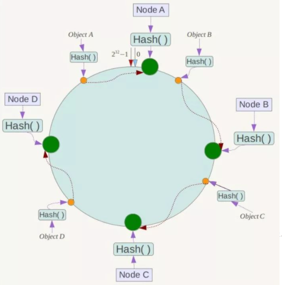
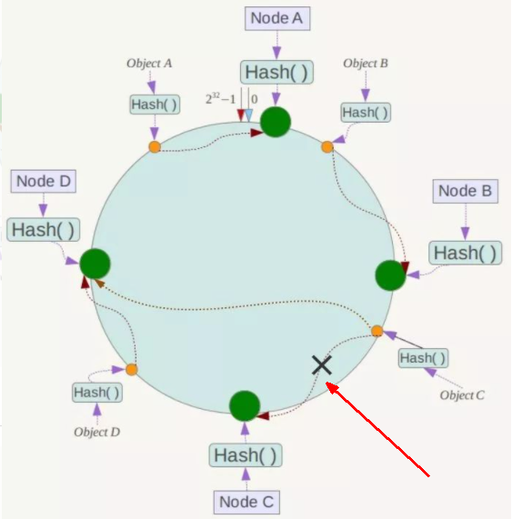
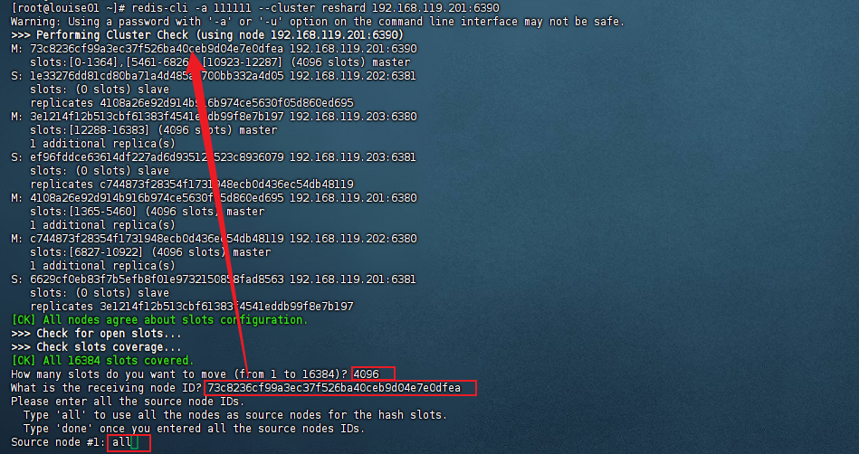
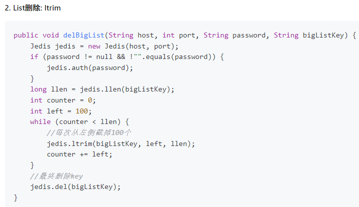

# Redis是什么？

[Redis](https://redis.io/)是一个基于 C 语言开发的开源数据库（遵守BSD协议），数据存储在**内存**中（内存数据库），读写速度非常快，被广泛应用于缓存方向。并且，Redis 存储的是 **KV 键值对数据**。

为了满足不同的业务场景，Redis 内置了多种数据类型实现（比如 **String、List、Hash、Set、Sorted Set、Bitmap、HyperLogLog、GEO**）。

它内置了**复制（Replication）**、**LUA 脚本（Lua scripting）**、**LRU 缓存淘汰（LRU eviction）**、**事务（Transactions）**、**发布/订阅**、**流技术**和不同级别的**磁盘持久化**（persistence）功能。

并提供了**主从模式**、 **Redis Sentinel**（哨兵）和 **Redis Cluster**（集群）保证缓存的高可用性（High availability）。

[英文官网 https://redis.io/](https://redis.io/)

[中文网站 https://redis.com.cn/documentation.html](https://redis.com.cn/documentation.html)

[官网下载地址 https://redis.io/download/](https://redis.io/download/)

[源码地址 https://github.com/redis/redis](https://github.com/redis/redis)

[在线测试 https://try.redis.io/](https://try.redis.io/)

[命令参考 http://doc.redisfans.com/](http://doc.redisfans.com/)

# Redis能干嘛？

## Redis用途

1. 分布式缓存，挡在mysql之前的带刀护卫。
2. 内存存储和持久化（RDB+AOF），redis支持异步将内存中的数据写到硬盘上，同时不影响继续服务
3. 高可用架构（单机、主从、哨兵、集群）
4. 缓存穿透、击穿、雪崩
5. 分布式锁
6. 队列
7. 排行榜+点赞
8. 。。。。。。

## Redis优势

1. 性能极高，redis读取速度110000次/秒，写的速度81000次/秒
2. redis数据类型丰富，不仅仅支持简单的key-value类型的数据，同时还提供list、set、zset、hash等数据结构
3. redis支持数据的持久化，可以将内存的数据持久化到磁盘中，重启的时候再次加载使用
4. redis支持数据的备份，即master-slave模式的数据备份

# Redis迭代演化


[历史版本源码 https://download.redis.io/releases/](https://download.redis.io/releases/) 版本号如果第二位是奇数，则为非稳定版本如2.7、2.9

[历史版本新特性 https://github.com/redis/redis/releases](https://github.com/redis/redis/releases)

## Redis7.0新特性todo


# Redis安装与卸载

**Redis安装**

```
0、gcc编译环境确认
gcc是linux下的一个编译程序，是C程序的编译工具。
查看gcc版本 gcc -v
安装gcc yum -y install gcc-c++


1、下载redis到/opt目录下
cd /opt
wget https://download.redis.io/releases/redis-7.0.0.tar.gz

2、解压
tar -zxvf redis-7.0.0.tar.gz

3、进入目录
cd redis-7.0.0

4、执行make命令
make && make install

5、查看默认安装目录 /usr/local/bin  /usr/local类似于windows系统中的C:\Program Files
redis-benchmark：性能测试工具
redis-check-aof：修复有问题的AOF文件
redis-check-dump：修复有问题的dump.rdb文件
redis-cli：客户端
redis-sentinel：redis集群使用
redis-server：redis服务启动命令

6、修改redis.conf配置文件
vim /opt/redis-7.0.0/redis.conf
默认daemonize no      改为  daemonize yes  通过后台启动
默认protected-mode  yes      改为  protected-mode no  安全模式，开启外部无法连接
默认bind 127.0.0.1      改为  直接注释掉或改成本机IP地址，否则影响远程IP连接
添加redis密码      改为 requirepass 你自己设置的密码

7、启动服务
cd /usr/local/bin
redis-server /opt/redis-7.0.0/redis.conf

8、连接服务
redis-cli -a password 或 redis-cli 登录后 auth password
如果出现中文乱码可以使用 redis-cli --raw

9、校验是否启动成功
127.0.0.1:6379> ping
PONG

10、关闭服务
redis-cli -a password shutdown
```

**Redis卸载**

```
1、关闭服务
redis-cli -a password shutdown

2、删除/usr/local/lib下关于redis的文件
ls -l /usr/local/bin/redis-*
rm -rf /usr/local/bin/redis-*
```

# Redis 为什么这么快？

1. **基于内存操作**：Redis 的所有数据都存在内存中，因此所有的运算都是内存级别的，所以他的性能比较高。
2. **数据结构简单**：Redis 的数据结构是专门设计的，而这些简单的数据结构的查找和操作的时间大部分复杂度都是 O(1)，因此性能比较高；
3. **避免上下文切换**：因为工作线程是单线程模型，避免了不必要的上下文切换和多线程竞争，这就省去了多线程切换带来的时间和性能上的消耗，而且单线程不会导致死锁问题的发生
4. **IO多路复用和非阻塞 I/O**：Redis使用 I/O多路复用，**一个线程监视多个文件句柄**，**通过 select、poll、epoll 等机制来同时监听多个文件描述符**。
5. Redis 基于 Reactor 模式设计开发了一套高效的事件处理模型，主要是**单线程事件循环**(单线程的话就能避免多线程的频繁上下文切换问题)和 **非阻塞的IO多路复用**。
6. 对于Redis系统来说，主要的性能瓶颈是内存或者网络带宽而并非 CPU。


# 为什么要用 Redis/为什么要用缓存？

**1、高性能**
假如用户第一次访问数据库中的某些数据的话，这个过程是比较慢，毕竟是从硬盘中读取的。但是，如果说，用户访问的数据属于高频数据并且不会经常改变的话，那么我们就可以很放心地将该用户访问的数据存在缓存中。
这样有什么好处呢？ 那就是保证用户下一次再访问这些数据的时候就可以直接从缓存中获取了。操作缓存就是直接操作内存，所以速度相当快。

**2、高并发**

一般像 MySQL 这类的数据库的 QPS 大概都在 1w 左右（4 核 8g） ，但是使用 Redis 缓存之后很容易达到 10w+，甚至最高能达到 30w+（就单机 Redis 的情况，Redis 集群的话会更高）。

> QPS（Query Per Second）：服务器每秒可以执行的查询次数；

由此可见，直接操作缓存能够承受的数据库请求数量是远远大于直接访问数据库的，所以我们可以考虑把数据库中的部分数据转移到缓存中去，这样用户的一部分请求会直接到缓存这里而不用经过数据库。进而，我们也就提高了系统整体的并发。

# 基本数据结构

[Redis 数据类型](https://redis.io/docs/data-types/)

`help @数据类型` 查看帮助

Redis 共有 5 种基本数据结构：String（字符串）、List（列表）、Set（集合）、Hash（散列）、Zset（有序集合）。

这 5 种数据结构是直接提供给用户使用的，是数据的保存形式，其底层实现主要依赖这 8 种数据结构：简单动态字符串（SDS）、LinkedList（双向链表）、Dict（哈希表/字典）、SkipList（跳跃表）、Intset（整数集合）、ZipList（压缩列表）、QuickList（快速列表）。

| String | List                         | Hash          | Set          | Zset              |
| :----- | :--------------------------- | :------------ | :----------- | :---------------- |
| SDS    | LinkedList/ZipList/QuickList | Dict、ZipList | Dict、Intset | ZipList、SkipList |

Redis 3.2 之前，List 底层实现是 LinkedList 或者 ZipList。 Redis 3.2 之后，引入了 LinkedList 和 ZipList 的结合 QuickList，List 的底层实现变为 QuickList。从 Redis 7.0 开始， ZipList 被 ListPack 取代。

可以在 Redis 官网上找到 Redis 数据结构非常详细的介绍：

- [Redis Data Structures](https://redis.com/redis-enterprise/data-structures/)
- [Redis Data types tutorial](https://redis.io/docs/manual/data-types/data-types-tutorial/)

## String（字符串）

String 是 Redis 中最简单同时也是最常用的一个数据结构。

String 是一种二进制安全的数据结构，可以用来存储任何类型的数据比如字符串、整数、浮点数、图片（图片的 base64 编码或者解码或者图片的路径）、序列化后的对象。Redis中字符串value最多可以是**512M**。

虽然 Redis 是用 C 语言写的，但是 Redis 并没有使用 C 的字符串表示，而是自己构建了一种 **简单动态字符串**（Simple Dynamic String，**SDS**）。相比于 C 的原生字符串，Redis 的 SDS 不光可以保存文本数据还可以保存二进制数据，并且获取字符串长度复杂度为 O(1)（C 字符串为 O(N)）,除此之外，Redis 的 SDS API 是安全的，不会造成缓冲区溢出。

### **常用命令**

https://redis.io/commands/?group=string

| 命令                             | 介绍                                              |
| :------------------------------- | :------------------------------------------------ |
| SET key value                    | 设置指定 key 的值                                 |
| SETNX key value                  | 只有在 key 不存在时设置 key 的值 set if not exist |
| SETEX key seconds value          | 设置指定 key 的值并设置过期时间 set with expire   |
| GET key                          | 获取指定 key 的值                                 |
| MSET key1 value1 key2 value2 …   | 设置一个或多个指定 key 的值                       |
| MSETNX key1 value1 key2 value2 … | 只有在都不存在时，设置一个或多个指定 key 的值     |
| MGET key1 key2 ...               | 获取一个或多个指定 key 的值                       |
| STRLEN key                       | 返回 key 所储存的字符串值的长度                   |
| APPEND key str                   | 在指定key后追加str                                |
| INCR key                         | 将 key 中储存的数字值增一                         |
| INCRBY key increment             | 将 key 所储存的值加上给定的增量值（increment）    |
| DECR key                         | 将 key 中储存的数字值减一                         |
| DECRBY key decrement             | key 所储存的值减去给定的减量值（decrement）       |
| GETSET key value                 | 设置指定 key 的值，并返回之前的值                 |
| EXISTS key（通用）               | 判断指定 key 是否存在                             |
| DEL key（通用）                  | 删除指定的 key                                    |
| EXPIRE key seconds（通用）       | 给指定 key 设置过期时间                           |

### 命令详解

**SET**

SET key value [NX | XX] [GET] [EX seconds | PX milliseconds | EXAT unix-time-seconds | PXAT unix-time-milliseconds | KEEPTTL]

- `EX` *seconds*：设置指定过期时间，单位为秒
- `PX` *milliseconds*：设置指定过期时间，单位为毫秒
- `EXAT` *timestamp-seconds*：设置指定unix时间戳作为过期时间，单位为秒 `System.currentTimeMillis()/1000`
- `PXAT` timestamp-milliseconds：设置指定unix时间戳作为过期时间，单位为毫秒
- `NX`：仅在key不存在的情况下设置value
- `XX`：仅在key存在的情况下设置value
- `KEEPTTL`：保留设置前指定的生存时间
- `GET`：返回以 key 存储的旧字符串，如果 key 不存在，返回 nil。如果键上存储的值不是字符串，则返回错误并中止 SET。

### **应用场景**

**需要存储常规数据的场景**

- 举例：缓存 session、token、图片地址、序列化后的对象(相比较于 Hash 存储更节省内存)。
- 相关命令：`SET`、`GET`。

**需要计数的场景**

- 举例：用户单位时间的请求数（简单限流可以用到）、页面单位时间的访问数。
- 相关命令：`SET`、`GET`、 `INCR`、`DECR` 。

**分布式锁**

利用 `SETNX key value` 命令可以实现一个最简易的分布式锁（存在一些缺陷，通常不建议这样实现分布式锁）。

## List（列表）

Redis 的 List 的实现为一个 **双向链表**，容量是**2的32次方-1**，即可以支持反向查找和遍历，更方便操作，不过带来了部分额外的内存开销。

### **常用命令**

https://redis.io/commands/?group=list

| **命令**                                   | **介绍**                                        |
| :----------------------------------------- | ----------------------------------------------- |
| RPUSH key value1 value2 ...                | 在指定列表的尾部（右边）添加一个或多个元素      |
| LPUSH key value1 value2 ...                | 在指定列表的头部（左边）添加一个或多个元素      |
| LSET key index value                       | 将指定列表索引 index 位置的值设置为 value       |
| LPOP key                                   | 移除并获取指定列表的第一个元素(最左边)          |
| RPOP key                                   | 移除并获取指定列表的最后一个元素(最右边)        |
| LINDEX key index                           | 按照索引下标获取元素                            |
| LLEN key                                   | 获取列表元素数量                                |
| LRANGE key start end                       | 获取列表 start 和 end 之间 的元素 0到-1代表所有 |
| LREM key num value                         | 删除指定key中num个value值                       |
| LTRIM key sindex eindex                    | 截取指定范围key并赋值给该key                    |
| RPOPLPUSH key1 key2                        | 从key1右端弹出插入到key2左端                    |
| LINSERT key before/after 已有值 插入的新值 | 在指定key的已有值的前/后插入新值                |


### 应用场景

**信息流展示**

- 举例：最新文章、最新动态。
- 相关命令：`LPUSH`、`LRANGE`。

将文章/动态id存入redis，可以利用`LRANGE`进行分页查询

**消息队列**

Redis List 数据结构可以用来做消息队列，只是功能过于简单且存在很多缺陷，不建议这样做。

相对来说，Redis 5.0 新增加的一个数据结构 `Stream` 更适合做消息队列一些，只是功能依然非常简陋。和专业的消息队列相比，还是有很多欠缺的地方比如消息丢失和堆积问题不好解决。

**流量削峰**

## Hash（哈希）

Redis 中的 Hash 是一个 String 类型的 field-value（键值对） 的映射表，特别适合用于存储对象，后续操作的时候，你可以直接修改这个对象中的某些字段的值。

Hash 类似于 JDK1.8 前的 `HashMap`，内部实现也差不多(数组 + 链表)。不过，Redis 的 Hash 做了更多优化。

### 常用命令

https://redis.io/commands/?group=hash

| 命令                                      | 介绍                                                         |
| ----------------------------------------- | ------------------------------------------------------------ |
| HSET key field value                      | 设置指定哈希表中指定字段的值                                 |
| HGET key field                            | 获取指定哈希表中指定字段的值                                 |
| HSETNX key field value                    | 只有指定字段不存在时设置指定字段的值                         |
| HMSET key field1 value1 field2 value2 ... | 同时将一个或多个 field-value (域-值)对设置到指定哈希表中     |
| HMGET key field1 field2 ...               | 获取指定哈希表中一个或者多个指定字段的值                     |
| HGETALL key                               | 获取指定哈希表中所有的键值对                                 |
| HDEL key field1 field2 ...                | 删除一个或多个哈希表字段                                     |
| HEXISTS key field                         | 查看指定哈希表中指定的字段是否存在                           |
| HKEYS key                                 | 获取指定哈希表所有field                                      |
| HVALS key                                 | 获取指定哈希表所有value                                      |
| HLEN key                                  | 获取指定哈希表中字段的数量                                   |
| HINCRBY key field increment               | 对指定哈希中的指定字段做运算操作（正数为加，负数为减）       |
| HINCRBYFLOAT key field increment          | 对指定哈希中的指定字段做浮点数运算操作（正数为加，负数为减） |

**HINCRBY**

```
> HSET key n1 100
(integer) 1
> HINCRBY key n1 200
(integer) 300
> HGET key n1
"300"
```

### 应用场景

**对象数据存储场景**

- 举例：用户信息、商品信息、文章信息、购物车信息。
- 相关命令：`HSET` （设置单个字段的值）、`HMSET`（设置多个字段的值）、`HGET`（获取单个字段的值）、`HMGET`（获取多个字段的值）。

## Set（集合）

Redis 中的 Set 类型是一种**无序集合**，集合中的元素没有先后顺序但都**唯一**，有点类似于 Java 中的 `HashSet` 。当你需要存储一个列表数据，又不希望出现重复数据时，Set 是一个很好的选择，并且 Set 提供了**判断某个元素是否在**一个 Set 集合内的重要接口，这个也是 List 所不能提供的。Set集合是通过哈希表实现的，所以添加、删除、查找的复杂度都是**O(1)**。

可以基于 Set 轻易实现**交集、并集、差集**的操作，比如你可以将一个用户所有的关注人存在一个集合中，将其所有粉丝存在一个集合。这样的话，Set 可以非常方便的实现如共同关注、共同粉丝、共同喜好等功能。这个过程也就是求交集的过程。

### 常用命令

https://redis.io/commands/?group=set

| 命令                                  | 介绍                                         |
| ------------------------------------- | -------------------------------------------- |
| SADD key member1 member2 ...          | 向指定集合添加一个或多个元素                 |
| SMEMBERS key                          | 获取指定集合中的所有元素                     |
| SISMEMBER key member                  | 判断指定元素是否在指定集合中                 |
| SCARD key                             | 获取指定集合的元素数量                       |
| SREM key member1 member2 ...          | 删除指定集合中的元素                         |
| SPOP key [count]                      | 随机移除并获取指定集合中一个或多个元素，删除 |
| SRANDMEMBER key [count]               | 随机获取指定集合中指定数量的元素，不删除     |
| SMOVE key1 key2 k1value               | 将key1中已存在的某个值迁移到key2中           |
|                                       |                                              |
| SINTER key1 key2 ...                  | 获取给定所有集合的交集(我有你也有)           |
| SINTERSTORE destination key1 key2 ... | 将给定所有集合的交集存储在 destination 中    |
| SUNION key1 key2 ...                  | 获取给定所有集合的并集(我有加你有)           |
| SUNIONSTORE destination key1 key2 ... | 将给定所有集合的并集存储在 destination 中    |
| SDIFF key1 key2 ...                   | 获取给定所有集合的差集(我有你没有)           |
| SDIFFSTORE destination key1 key2 ...  | 将给定所有集合的差集存储在 destination 中    |

### 应用场景

**需要存放的数据不能重复的场景**

- 举例：网站 UV 统计（数据量巨大的场景还是 `HyperLogLog`更适合一些）、文章点赞、动态点赞等场景。
- 相关命令：`SCARD`（获取集合数量）。

**需要获取多个数据源交集、并集和差集的场景**

举例：共同好友(交集)、共同粉丝(交集)、共同关注(交集)、好友推荐（差集）、音乐推荐（差集）、订阅号推荐（差集+交集） 等场景。

相关命令：`SINTER`（交集）、`SINTERSTORE` （交集）、`SUNION` （并集）、`SUNIONSTORE`（并集）、`SDIFF`（差集）、`SDIFFSTORE` （差集）。

**需要随机获取数据源中的元素的场景**

- 举例：抽奖系统、随机点名等场景。
- 相关命令：`SPOP`（随机获取集合中的元素并移除，适合不允许重复中奖的场景）、`SRANDMEMBER`（随机获取集合中的元素，适合允许重复中奖的场景）。

## Zset（有序集合）

Sorted Set 类似于 Set，但和 Set 相比，Sorted Set 增加了一个权重参数 `score`，使得集合中的元素能够按 `score` 进行有序排列，还可以通过 `score` 的范围来获取元素的列表。有点像是 Java 中 `HashMap` 和 `TreeSet` 的结合体。Zset集合是通过哈希表实现的，所以添加、删除、查找的复杂度都是**O(1)**。

### **常用命令**

https://redis.io/commands/?group=sorted-set

| 命令                                                        | 介绍                                                         |
| ----------------------------------------------------------- | ------------------------------------------------------------ |
| ZADD key score1 member1 score2 member2 ...                  | 向指定有序集合添加一个或多个元素                             |
| ZRANGE key start end [WITHSCORES]                           | 获取指定有序集合 start 和 end 之间的元素（score 从低到高）   |
| ZREVRANGE key start end [WITHSCORES]                        | 获取指定有序集合 start 和 end 之间的元素（score 从高到底）   |
| ZRANGEBYSCORE key min max [WITHSCORES] [limit offset count] | 获取指定分数范围内的元素，(代表不包含                        |
| ZCARD KEY                                                   | 获取指定有序集合的元素数量                                   |
| ZSCORE key member                                           | 获取指定有序集合中指定元素的 score 值                        |
| ZREM key member1 member2 ...                                | 删除有序集合中的元素                                         |
| ZINCRBY key increment member                                | 指定key中的member增加分数                                    |
| ZCOUNT key min max                                          | 获取指定分数范围内的元素个数                                 |
| ZRANK key member                                            | 获取指定有序集合中指定元素的排名(score 从小到大排序)         |
| ZREVRANK key member                                         | 获取指定有序集合中指定元素的排名(score 从大到小排序)         |
|                                                             |                                                              |
| ZINTERSTORE destination numkeys key1 key2 ...               | 将给定所有有序集合的交集存储在 destination 中，对相同元素对应的 score 值进行 SUM 聚合操作，numkeys 为集合数量 |
| ZUNIONSTORE destination numkeys key1 key2 ...               | 求并集，其它和 ZINTERSTORE 类似                              |
| ZDIFFSTORE destination numkeys key1 key2 ...                | 求差集，其它和 ZINTERSTORE 类似                              |

**ZRANGEBYSCORE**

```
> zadd z 1 a 2 b 3 c
(integer) 3
> zrangebyscore z 1 3
a b c
> zrangebyscore z 1 (3
a b
> zrangebyscore z (1 3
b c
> zrangebyscore z 1 3 limit 1 1
b
```

### 应用场景

**需要随机获取数据源中的元素根据某个权重进行排序的场景**

举例：各种排行榜比如直播间送礼物的排行榜、朋友圈的微信步数排行榜、王者荣耀中的段位排行榜、话题热度排行榜等等。

相关命令：`ZRANGE` (从小到大排序)、 `ZREVRANGE` （从大到小排序）、`ZREVRANK` (指定元素排名)。

**需要存储的数据有优先级或者重要程度的场景** 比如优先级任务队列。

- 举例：优先级任务队列。
- 相关命令：`ZRANGE` (从小到大排序)、 `ZREVRANGE` （从大到小排序）、`ZREVRANK` (指定元素排名)。

# 特殊数据结构

除了 5 种基本的数据结构之外，Redis 还支持 3 种特殊的数据结构：Bitmap、HyperLogLog、GEO。

## Bitmap（位图）

Bitmap 存储的是连续的二进制数字（0 和 1），通过 Bitmap, 只需要一个 bit 位来表示某个元素对应的值或者状态，key 就是对应元素本身 。我们知道 8 个 bit 可以组成一个 byte，所以 Bitmap 本身会极大的节省储存空间。**用String类型作为底层数据结构实现的一种统计二值状态的数据结构，位图的本质是数组**，最大支持位数是**2的32次方**位，使用512M内存就可以存储多大42.9亿的字节信息

可以将 Bitmap 看作是一个存储二进制数字（0 和 1）的数组，数组中每个元素的下标叫做 offset（偏移量）。


### **常用命令**

| 命令                                  | 介绍                                                         |
| ------------------------------------- | ------------------------------------------------------------ |
| SETBIT key offset value               | 设置指定 offset 位置的值                                     |
| GETBIT key offset                     | 获取指定 offset 位置的值                                     |
| STRLEN key                            | 获取指定 key 占用的字节数                                    |
| BITCOUNT key start end                | 获取 start 和 end 之前值为 1 的元素个数                      |
| BITOP operation destkey key1 key2 ... | 对一个或多个 Bitmap 进行运算，可用运算符operation有 AND, OR, XOR 以及 NOT，destkey为输出的key |

**基础操作**

```
> SETBIT mykey 7 1
(integer) 0
> SETBIT mykey 7 0
(integer) 1
> GETBIT mykey 7
(integer) 0
> SETBIT mykey 6 1
(integer) 0
> SETBIT mykey 8 1
(integer) 0
> BITCOUNT mykey
(integer) 2
```

### 应用场景

**需要保存状态信息（0/1 即可表示）的场景**

- 举例：用户签到情况、活跃用户情况、用户行为统计（比如是否点赞过某个视频）。记录用户一年的签到情况。
- 相关命令：`SETBIT`、`GETBIT`、`BITCOUNT`、`BITOP`。

## HyperLogLog（基数统计）

HyperLogLog 是一种有名的**基数计数**概率算法 ，基于 LogLog Counting(LLC)优化改进得来，并不是 Redis 特有的，Redis 只是实现了这个算法并提供了一些开箱即用的 API。

Redis 提供的 HyperLogLog 占用空间非常非常小，只需要 12k 的空间就能存储接近`2^64`个不同元素。并且，Redis 对 HyperLogLog 的存储结构做了优化，采用两种方式计数：

- **稀疏矩阵**：计数较少的时候，占用空间很小。
- **稠密矩阵**：计数达到某个阈值的时候，占用 12k 的空间。

基数计数概率算法为了节省内存并不会直接存储元数据，而是通过一定的概率统计方法预估基数值（集合中包含元素的个数）。因此， HyperLogLog 的计数结果并不是一个精确值，存在一定的误差（标准误差为 `0.81%` ）。


HyperLogLog 的使用非常简单，但原理非常复杂。HyperLogLog 的原理以及在 Redis 中的实现可以看这篇文章：[HyperLogLog 算法的原理讲解以及 Redis 是如何应用它的open in new window](https://juejin.cn/post/6844903785744056333) 。

再推荐一个可以帮助理解 HyperLogLog 原理的工具：[Sketch of the Day: HyperLogLog — Cornerstone of a Big Data Infrastructureopen in new window](http://content.research.neustar.biz/blog/hll.html) 。

### 常用命令

| 命令                                      | 介绍                                                         |
| ----------------------------------------- | ------------------------------------------------------------ |
| PFADD key element1 element2 ...           | 添加一个或多个元素到 HyperLogLog 中                          |
| PFCOUNT key1 key2                         | 获取一个或者多个 HyperLogLog 的唯一计数。                    |
| PFMERGE destkey sourcekey1 sourcekey2 ... | 将多个 HyperLogLog 合并到 destkey 中，destkey 会结合多个源，算出对应的唯一计数。 |

**基础操作**

```
> PFADD hll foo bar zap
(integer) 1
> PFADD hll zap zap zap
(integer) 0
> PFADD hll foo bar
(integer) 0
> PFCOUNT hll
(integer) 3
> PFADD some-other-hll 1 2 3
(integer) 1
> PFCOUNT hll some-other-hll
(integer) 6
> PFMERGE desthll hll some-other-hll
"OK"
> PFCOUNT desthll
(integer) 6
```

### 应用场景

**数量量巨大（百万、千万级别以上）的计数场景**

- 举例：热门网站每日/每周/每月访问 ip 数统计、热门帖子 uv（独立访客） 统计、
- 相关命令：`PFADD`、`PFCOUNT` 。

## Geospatial（地理位置）

Geospatial index（地理空间索引，简称 GEO） 主要用于**存储地理位置信息**，基于 Sorted Set 实现。

通过 GEO 我们可以轻松实现两个位置距离的计算、获取指定位置附近的元素等功能。


### **常用命令**

| 命令                                            | 介绍                                                         |
| ----------------------------------------------- | ------------------------------------------------------------ |
| GEOADD key longitude1 latitude1 member1 ...     | 添加一个或多个元素对应的经纬度信息到 GEO 中                  |
| GEOPOS key member1 member2 ...                  | 返回给定元素的经纬度信息                                     |
| GEOHASH key member1 member2 ...                 | geohash算法生成的base32编码值                                |
| GEODIST key member1 member2 M/KM/FT/MI          | 返回两个给定元素之间的距离                                   |
| GEORADIUS key longitude latitude 半径M/KM/FT/MI | 获取指定位置附近 distance 范围内的其他元素，支持 ASC(由近到远)、DESC（由远到近）、Count(数量) 等参数 |
| GEORADIUSBYMEMBER key member 半径 M/KM/FT/MI    | 类似于 GEORADIUS 命令，只是参照的中心点是 GEO 中的元素       |

**基础操作**

```
> GEOADD personLocation 116.33 39.89 user1 116.34 39.90 user2 116.35 39.88 user3
3
> GEOPOS personLocation user1
116.3299986720085144
39.89000061669732844
> GEODIST personLocation user1 user2 km
1.4018
```

GEO 中存储的地理位置信息的经纬度数据通过 GeoHash 算法转换成了一个整数，这个整数作为 Sorted Set 的 score(权重参数)使用。


**获取指定位置范围内的其他元素**：

GEORADIUS

```
GEORADIUS key longitude latitude radius <M | KM | FT | MI>
  [WITHCOORD] [WITHDIST] [WITHHASH] [COUNT count [ANY]] [ASC | DESC]
  [STORE key | STOREDIST key]
  
radius：半径
WITHDIST：在返回位置元素的同时， 将位置元素与中心之间的距离也一并返回。 距离的单位和用户给定的范围单位保持一致。
WITHCOORD：将位置元素的经度和维度也一并返回。
WITHHASH：以 52 位有符号整数的形式， 返回位置元素经过原始 geohash 编码的有序集合分值。 这个选项主要用于底层应用或者调试， 实际中的作用并不大
COUNT：限定返回的记录数
STORE key：将返回结果的地理位置信息保存到指定 key，以Geo数据类型
STOREDIST key：将返回结果离中心点的距离保存到指定 Key，以Zseto数据类型
```

```
> GEORADIUS personLocation 116.33 39.87 3 km
user3
user1
> GEORADIUS personLocation 116.33 39.87 2 km
> GEORADIUS personLocation 116.33 39.87 5 km
user3
user1
user2
> GEORADIUSBYMEMBER personLocation user1 5 km
user3
user1
user2
> GEORADIUSBYMEMBER personLocation user1 2 km
user1
user2
```

`GEORADIUS` 命令的底层原理解析可以看看阿里的这篇文章：[Redis 到底是怎么实现“附近的人”这个功能的呢？](https://juejin.cn/post/6844903966061363207) 。

**移除元素**：

GEO 底层是 Sorted Set ，你可以对 GEO 使用 Sorted Set 相关的命令。

```
> ZREM personLocation user1
1
> ZRANGE personLocation 0 -1
user3
user2
> ZSCORE personLocation user2
4069879562983946
```

### 应用场景

**需要管理使用地理空间数据的场景**

- 举例：附近的人。
- 相关命令: `GEOADD`、`GEORADIUS`、`GEORADIUSBYMEMBER` 。

## Stream（消息队列）

Redis在5.0版本后推出的类似Mq的消息队列，在5.0版本之前可以用List来实现点对点、用发布订阅来实现广播模式，但是发布订阅无法持久化。Stream是用来实现**消息队列**，它**支持消息的持久化、支持自动生成全局唯一ID、支持ACK确认消息的模式、支持消费组模式**等，让消息队列更加可靠。


- Message Content：消息内容
- Consumer group： 消费组，通过XGROUP CREATE 命令创建，同一个消费组可以有多个消费者
-  Last_delivered_id：游标，每个消费组会有个游标 last_delivered_id，任意一个消费者读取了消息都会使游标 last_delivered_id 往前移动。
-  Consumer：消费者，消费组中的消费者
-  Pending_ids：消费者会有一个状态变量，用于记录被当前消费已读取但未ack的消息Id，如果客户端没有ack，这个变量里面的消息ID会越来越多，一旦某个消息被ack它就开始减少。这个pending_ids变量在Redis官方被称之为 PEL(Pending Entries List)，记录了当前已经被客户端读取的消息，但是还没有 ack (Acknowledge character：确认字符），它用来确保客户端至少消费了消息一次，而不会在网络传输的中途丢失了没处理

### 常用命令

**一些特殊符号**

- `-`：最小可能出现的ID
- `+`：最大可能出现的ID
- `$`：当前流中最大的ID
- `>`：用于XREADGROUP，表示迄今还没有发送给组内使用者的信息，会更新消费组的最后ID
- `*`：用于XADD，让系统自动生成ID

**生产者**

| 命令                                                         | 介绍                                                         |
| ------------------------------------------------------------ | ------------------------------------------------------------ |
| XADD key id\|* field1 value1 field2 value2...                | 向队列中添加消息，*表示自动生成自增 MessageID，后续ID不能小于前一个ID。返回值为millisecondsTime-自增id |
| XRANGE key start end [COUNT count]                           | 用于获取消息队列，start -代表最小值，end +代表最大值         |
| XREVRANGE key end start [COUNT count]                        | 与XRANGE获取元素的方向相反                                   |
| XDEL key ID [ID ...]                                         | 删除指定消息队列中的元素                                     |
| XLEN key                                                     | 获取指定消息队列的元素个数                                   |
| XTRIM key MAXLEN\|MINID count\|id                            | 截取指定消息队列，MAXLEN指最大数量，MINID指最小id            |
| XREAD [COUNT count] [BLOCK milliseconds] STREAMS key [key ...] ID [ID ...] | 用于获取消息队列，只返回大于指定ID的消息。ID可以为$代表特殊ID，表示以当前队列中最大ID。ID也可为0/00/000，代表获取全部信息。BLOCK可以为0表示读取到为止 |

**生产者基础操作**

```
> xadd s *  k1 v1 m1 n1
1708834869189-0
> xadd s *  k2 v2 m2 n2
1708834875959-0
> xrange s - +
1708834869189-0
k1
v1
m1
n1
1708834875959-0
k2
v2
m2
n2
> xadd s *  k3 v3 m3 n3
1708834914335-0
> xtrim s maxlen 2
1
> xrange s  - +
1708834875959-0
k2
v2
m2
n2
1708834914335-0
k3
v3
m3
n3
> xtrim s minid 1708834914335
1
> xrange s  - +
1708834914335-0
k3
v3
m3
n3
> XREAD STREAMS s 0
s
1708834914335-0
k3
v3
m3
n3
```

**消费者**

| 命令                                                         | 介绍                                                         |
| ------------------------------------------------------------ | ------------------------------------------------------------ |
| XGROUP CREATE key groupname id-or-$                          | 用于创建消费组，$表示从Stream尾部开始消费，0表示从Stream头部开始消费 |
| XREADGROUP GROUP groupname consumer [COUNT count] [BLOCK milliseconds] [NOACK] STREAMS key [key ...] ID [ID ...] | 消费组指定消费者进行消费。ID可以为>，表示从第一条尚未被消费的消息开始读取 |
| XPENDING key group [start end count] [consumer]              | 1.查询每个消费组内所有消费者[已读取但尚未确认]的消息2.查询某个消费者具体消费了哪些数据 |
| XACK key group ID                                            | 向消息队列确认消息处理完成                                   |

**基于 Stream 实现的消息队列，如何保证消费者在发生故障或宕机再次重启后，仍然可以读取未处理完的消息？**

- Streams 会自动使用内部队列（也称为 PENDING List）留存消费组里每个消费者读取的消息保底措施，直到消费者使用 XACK 命令通知 Streams“消息已经处理完成”。
- 消费确认增加了消息的可靠性，一般在业务处理完成之后，需要执行 XACK 命令确认消息已经被消费完成

**消费组基础操作**

```
> XGROUP CREATE s g1 0
OK
> XREADGROUP GROUP g1 c1 STREAMS s >
s
1708834914335-0
k3
v3
m3
n3
1708836178358-0
k1
v1
1708836183725-0
k1
v1
m1
n2

> XREADGROUP GROUP g1 c1 STREAMS s >
null
> XREADGROUP GROUP g1 c2 STREAMS s >
null

> XREADGROUP GROUP g2 c1 STREAMS s >
NOGROUP No such key 's' or consumer group 'g2' in XREADGROUP with GROUP option

> XPENDING s g1
3
1708834914335-0 所有消费组读取的最小ID
1708836183725-0 所有消费组读取的最大ID
c1
3

> xpending s g1 - + 10 c1
1708834914335-0
c1
760156
1
1708836178358-0
c1
760156
1
1708836183725-0
c1
760156
1

> XACK s g1 1708834914335
1

> xpending s g1 - + 10 c1
1708836178358-0
c1
883091
1
1708836183725-0
c1
883091
1

> XPENDING s g1
2
1708836178358-0
1708836183725-0
c1
2
```

## **Bitfield（位域）**

将一个Redis字符串看作是一个由**二进制位组成的数组**并能对变长位宽和任意没有字节对齐的指定整型位域进行**寻址和修改**。可以对字符串进行位域修改和溢出控制

### 常用命令

| 命令                                                         | 介绍                          |
| ------------------------------------------------------------ | ----------------------------- |
| BITFIELD key [GET type offset] [OVERFLOW WRAP\|SAT\|FAIL]    | 对指定key的位域进行访问       |
| BITFIELD key [SET type offset value] [OVERFLOW WRAP\|SAT\|FAIL] | 对指定key的位域进行修改       |
| BITFIELD key [INCRBY type offset increment] [OVERFLOW WRAP\|SAT\|FAIL] | 对指定key的位域进行自增或自减 |

**type**

有符号的整型在位数前加i，无符号的在位数前加u。例如，i8是8位有符号整型，u16是16位无符号整型

**OVERFLOW 溢出控制** 

- WRAP：使用回绕（wrap around），有符号超过最大值从负数开始，无符号超过最大值从0开始
- SAT：使用饱和计算（saturation arithmetic）方法处理溢出，下溢计算的结果为最小的整数值，上溢计算的结果为最大的整数值
- FAIL：命令将拒绝执行那些会导致上溢或者下溢情况出现的计算，并向用户返回空值表示计算未被执行

**基础操作**

```
> set k hello
OK
> BITFIELD k get i8 0
104
> BITFIELD k get i8 8
101
> BITFIELD k get i8 16
108
> BITFIELD k get i8 24
108
> BITFIELD k get i8 32
111
> BITFIELD k set i8 8 120
101
> get k
hxllo
> BITFIELD k incrby i8 32 1
112
> get k
hxllp
```

# 通用命令

| 命令                   | 介绍                                                         |
| ---------------------- | ------------------------------------------------------------ |
| KEYS *                 | 查询当去数据库下所有的key                                    |
| DEL key                | 删除指定key                                                  |
| UNLINK key             | 非阻塞删除，仅仅将key从keyspace元数据中删除，真正的删除会后续异步操作 |
| TYPE key               | 查看指定key的类型                                            |
| EXISTS key             | 查看指定key是否存在当前数据库中                              |
| TTL key                | 查看指定key多少秒过期，-1表示永不过期                        |
| EXPIRE key seconds     | 给指定key设置过期时间                                        |
| MOVE key dbindex[0-15] | 将当前数据库的key移动到指定数据库                            |
| SELECT dbindex[0-15]   | 选中数据库，默认为0                                          |
| DBSIZE                 | 查看当前数据库key的数量                                      |
| FLUSHDB                | 清除当前数据库中所有的内容                                   |
| FLUSHALL               | 清除当前实例中所有数据库中的内容                             |

# Redis持久化

[Redis持久化 https://redis.io/docs/manual/persistence/](https://redis.io/docs/manual/persistence/)


## RDB（Redis DataBase）

RDB 持久性以**指定的时间间隔**执行数据集的时间点**快照**。Redis的数据都在内存中，保存备份时它执行的是**全量快照**，这个快照文件就称为RDB文件(dump.rdb)，其中，RDB就是Redis DataBase的缩写。

`vim /opt/redis-7.0.0/redis.conf`

**修改保存间隔**


save 60 3：每隔30秒，如果有三个key发生变化，就写一份新的RDB文件

**修改dump文件路径**


**修改dump文件名称**


**重启服务**

`redis-cli -a password shutdown`

`redis-server /opt/redis-7.0.0/redis.conf`

**恢复数据**

redis会自动从dump文件路径下找到rdb文件进行恢复。

```
//模拟宕机
cd /opt/redisDump
mv myRedis.rdb myRedis.rdb.1
ps -ef | grep redis
kill -9 xxx
//此时重启服务后数据为空
redis-server /opt/redis-7.0.0/redis.conf
redis-cli -a password shutdown
mv myRedis.rdb.1 myRedis.rdb
//此时数据全部恢复
redis-server /opt/redis-7.0.0/redis.conf
```

**手动触发RDB**

`save`：在主程序中执⾏会阻塞当前redis服务器，直到持久化工作完成，执行save命令期间，Redis不能处理其他命令，**线上禁止使用**。

`bgsave`：Redis会在**后台异步进行快照**操作，不阻塞，快照同时还可以响应客户端请求,该触发方式会fork一个子进程由子进程复制持久化过程。

`LASTSAVE`：可以通过lastsave命令获取最后一次成功执行快照的时间戳，linux中执行`date -d @时间戳`可查看时间

**如何检查恢复dump.rdb文件**

`cd /usr/local/bin`

`redis-check-rdb /opt/redisDump/myRedis.rdb`

**何时会触发RDB快照**

- 配置文件中默认的快照配置
- 手动save/bgsave命令
- 执行flushall/flushdb命令也会产生dump.rdb文件，但里面是空的，无意义
- 执行shutdown且没有设置开启AOF持久化
- 主从复制时，主节点自动触发

**如何禁用快照**

1. 动态所有停止RDB保存规则的方法：redis-cli config set save ""
2. 配置文件中 save ""

**RDB其他配置项**

- **stop-writes-on-bgsave-error**：默认yes，如果配置成no，表示你不在乎数据不一致或者有其他的手段发现和控制这种不一致，那么在快照写入失败时，也能确保redis继续接受新的写请求。
- **rdbcompression**：默认yes，对于存储到磁盘中的快照，可以设置是否进行压缩存储。如果是的话，redis会采用LZF算法进行压缩。如果你不想消耗CPU来进行压缩的话，可以设置为关闭此功能。
- **rdbchecksum**：默认yes，在存储快照后，还可以让redis使用CRC64算法来进行数据校验，但是这样做会增加大约10%的性能消耗，如果希望获取到最大的性能提升，可以关闭此功能。
- **rdb-del-sync-files**：默认no，在没有持久性的情况下删除复制中使用的RDB文件启用。

### 优点

- 适合大规模的数据恢复
- 按照业务定时备份
- 对数据完整性和一致性要求不高
- RDB 文件在内存中的加载速度要比 AOF 快得多

### 缺点

- 在一定间隔时间做一次备份，所以如果redis意外down掉的话，就会丢失从当前至最近一次快照期间的数据，快照之间的数据会丢失
- 内存数据的全量同步，如果数据量太大会导致I/0严重影响服务器性能
- RDB依赖于主进程的fork，在更大的数据集中，这可能会导致服务请求的瞬间延迟。fork的时候内存中的数据被克隆了一份，大致2倍的膨胀性，需要考虑

## AOF（Append Only File）

**以日志的形式**来记录每个写操作，将Redis执行过的所有写指令记录下来（读操作不记录），只许追加文件但不可以改写文件，redis启动之初会读取该文件重新构建数据，换言之，redis重启的话就根据日志文件的内容将写指令从前到后执行一次以完成数据的恢复工作。

默认情况下，redis是没有开启AOF(append only file)的。开启AOF功能需要设置配置：**appendonly yes**。

Aof保存的是**appendonly.aof**文件。

**AOF持久化工作流程**


1. Client作为命令的来源，会有多个源头以及源源不断的请求命令。
2. 在这些命令到达Redis Server 以后并不是直接写入AOF文件，会将其这些命令先放入AOF缓存中进行保存。这里的AOF缓冲区实际上是内存中的一片区域，存在的目的是当这些命令达到一定量以后再写入磁盘，避免频繁的磁盘IO操作。
3. AOF缓冲会根据AOF缓冲区**同步文件的三种写回策略**将命令写入磁盘上的AOF文件。
4. 随着写入AOF内容的增加为避免文件膨胀，会根据规则进行命令的合并(又称**AOF重写**)，从而起到AOF文件压缩的目的。
5. 当Redis Server 服务器重启的时候会从AOF文件载入数据。

**AOF缓冲区三种写回策略**

- **Always**：同步写回，每个写命令执行完立刻同步地将日志写回磁盘。优点：可靠性高，数据基本不会丢失。缺点：每个写命令都要落盘，性能影响很大。
- **everysec**：每秒写回，每个写命令执行完，只是先把日志写到AOF文件的内存缓冲区，每隔1秒把缓冲区中的内容写入磁盘。优点：性能适中。缺点：宕机时丢失一秒内的数据。
- **no**：操作系统控制的写回，每个写命令执行完，只是先把日志写到AOF文件的内存缓冲区，由操作系统决定何时将缓冲区内容写回磁盘。优点：性能好。缺点：宕机时丢失数据较多。

**开启AOF**

appendonly yes


**修改AOF回写策略**

appendfsync everysec


**修改AOF文件存储路径**

appenddirname "appendonlydir"

最终保存路径为rdb中配置的dir+appenddirname


**修改AOF文件名**

Redis7之前：只有一个aof文件

Redis7之后：生成三个aof文件，Multi Part Aof

- BASE文件：表示基础AOF，它一般由子进程通过重写产生，该文件最多只有一个。
- INCR文件：表示增量AOF，它一般会在AOFRW（AOF重写）开始执行时被创建，该文件可能存在多个。
- HISTORY文件：表示历史AOF，它由BASE和INCR变化而来，每次AOFRW成功完成后时，本次AOFRW之前对应的BASE和INCR都将变成HISTORY，HISTORY类型的AOF会被Redis自动删除。为了管理这些AOF文件，引入了manifest（清单）文件来跟踪、管理这些AOF。同时，为了便于AOF备份和拷贝，将所有的AOF文件和manifest文件放入一个单独的文件夹中，目录名由appenddirname配置。


**AOF数据恢复**

redis会自动读取AOF存储路径中的文件进行数据加载。

注意flushdb也会被写入到AOF文件中。

```
cd /opt/redisDump
//修改完配置文件后进行重启
redis-cli -a password shutdown
redis-server /opt/redis-7.0.0/redis.conf

//清空数据进行重新模拟
> set k5 v5
> set k6 v6
redis-cli -a password shutdown

//删除rdb文件,重启服务发现数据是完整的
rm myRedis.rdb
redis-server /opt/redis-7.0.0/redis.conf
```

**AOF异常恢复**

`redis-check-aof  --fix filename` 对AOF文件进行恢复

### **AOF重写机制**

当AOF文件越来越大时，触发阈值时，启动AOF文件的内容压缩，只保留可以恢复数据的最小指令集。

`auto-aof-rewrite-percentage 100`：根据上次重写后的aof大小，判断当前aof大小是不是增长了1倍

`auto-aof-rewrite-min-size 64mb`：重写时满足的文件大小

两个参数都满足的时候会**自动触发**重写，也可以使用`bgrewriteaof`来**手动触发**重写。

**AOF文件重写并不是对原文件进行重新整理，而是直接读取服务器现有的键值对，然后用一条命令去代替之前记录这个键值对的多条命令，生成一个新的文件去替换原有的AOF文件。**


```
//模拟测试重写机制 将size改为1kb
auto-aof-rewrite-percentage 100
auto-aof-rewrite-min-size 1kb

//模拟单独测试aof 关闭rbd和aof混合
aof-use-rdb-preamble no

//删除之前的rdb与aof文件
redis-cli -a password shutdown
cd /opt/redisDump
rm myRedis.rdb
rm -rf appendonlydir/*
redis-server /opt/redis-7.0.0/redis.conf

//此时对key进行操作直到incr文件超过1kb进行重写
> set k1 v1
> set k2 v2
> set k1 v11
...
```

重写前


重写后，会将incr文件重写到base文件中


**重写执行流程**

1. 在重写开始前，redis会创建一个“重写子进程”，这个子进程会读取现有的AOF文件，并将其包含的指令进行分析压缩并写入到一个临时文件中。
2. 与此同时，主进程会将新接收到的写指令一边累积到内存缓冲区中，一边继续写入到原有的AOF文件中，这样做是保证原有的AOF文件的可用性，避免在重写过程中出现意外。
3. 当“重写子进程”完成重写工作后，它会给父进程发一个信号，父进程收到信号后就会将内存中缓存的写指令追加到新AOF文件中。
4. 当追加结束后，redis就会用新AOF文件来代替旧AOF文件，之后再有新的写指令，就都会追加到新的AOF文件中。
5. **重写aof文件的操作，并没有读取旧的aof文件，而是将整个内存中的数据库内容用命令的方式重写了一个新的aof文件**，这点和快照有点类似。

### 优点

- 更好的保护数据不丢失 、性能高、可做紧急恢复

### 缺点

- 相同数据集的数据而言aof文件要远大于rdb文件，**恢复速度慢**于rdb
- aof运行效率要慢于rdb,每秒同步策略效率较好，不同步效率和rdb相同

## RDB+AOF

`aof-use-rdb-preamble yes`：开启RDB与AOF的混合使用

在这种情况下，**当redis重启的时候会优先载入AOF文件来恢复原始的数据**，因为在通常情况下AOF文件保存的数据集要比RDB文件保存的数据集要完整。

RDB的数据不实时，同时使用两者时服务器重启也只会找AOF文件。那要不要只使用AOF呢？作者建议不要，因为RDB更适合用于备份数据库(AOF在不断变化不好备份)，留着rdb作为一个万一的手段。


开启混合模式后，**base文件会从aof文件变成rdb文件**，实际AOF恢复数据时是RDB+AOF来进行恢复的。

## 纯内存模式

同时关闭RDB和AOF。

`save ""`：禁用rdb持久化模式下，我们仍然可以使用命令save、bgsave生成rdb文件。

`appendonly no`：禁用aof持久化模式下，我们仍然可以使用命令bgrewriteaof生成aof文件。

# **Redis事务**

[Redis事务 https://redis.io/docs/manual/transactions/](https://redis.io/docs/manual/transactions/)

可以一次执行多个命令，本质是一组命令的集合。一个事务中的所有命令都会序列化，**按顺序地串行化执行而不会被其它命令插入，不许加塞**。

**Redis事务的特点**

- 单独的隔离操作：Redis的事务**仅仅是保证事务里的操作会被连续独占的执行**，redis命令执行是单线程架构，在执行完事务内所有指令前是不可能再去同时执行其他客户端的请求的
- 没有隔离级别的概念：因为事务提交前任何指令都不会被实际执行，也就不存在”事务内的查询要看到事务里的更新，在事务外查询不能看到”这种问题了
- 不保证原子性：Redis的事务**不保证原子性**，也就是不保证所有指令同时成功或同时失败，只有决定是否开始执行全部指令的能力，没有执行到一半进行回滚的能力
- 排它性：Redis会保证一个事务内的命令依次执行，而不会被其它命令插入

**常用命令**

| 命令                   | 介绍                                                         |
| ---------------------- | ------------------------------------------------------------ |
| **MULTI**              | 标记一个事务块的开始                                         |
| **EXEC**               | 执行所有事务块内的命令                                       |
| **DISCARD**            | 取消事务，放弃执行所有事务块内的命令                         |
| **WATCH** key [key...] | 监视一个或多个key，如果在事务执行之前这些key被其他命令所改动，那么事务将被打断 |
| **UNWATCH**            | 取消WATCH命令内对所有key的监视                               |

**正常执行**

```
> MULTI
OK
> set k1 v1
QUEUED
> set k2 v2
QUEUED
> EXEC
OK
OK
> get k1
v1
> get k2
v2
```

**放弃事务**

```
> MULTI
OK
> set k1 v11
QUEUED
> DISCARD
OK
> get k1
v1
```

**编译错误**

如果命令块中有编译出错的命令，整个事务将不会执行

```
> MULTI
OK
> set k1 v11
QUEUED
> set k2
ERR wrong number of arguments for 'set' command
> EXEC
EXECABORT Transaction discarded because of previous errors.
> get k1
v1
```

**执行错误**

如果命令块中未出现编译错误，而是在执行的时候有错误，其他代码块将正常执行

```
> MULTI
OK
> set k1 v11
QUEUED
> incr k2
QUEUED
> EXEC
OK
> get k1
v11
> get k2
v2
```

**WATCH监控**

Redis使用WATCH来提供乐观锁定，在监视的多个key中，如果至少有一个key在执行EXEC命令之前被改变，EXEC命令会返回Null并通知事务中断。

```
//client1中
> get k1
v11
> get k2
v2
> WATCH k1
OK
> MULTI
OK
> set k1 v111
QUEUED
> set k2 v222
QUEUED

//client2中
set k1 xxx

//回到client1中继续输入
> EXEC
null
> get k1
xxx
> get k2
v2
```

**UNWATCH**

在MULTI的途中进行UNWATCH是没有生效的，只能WATCH后紧跟UNWATCH才可以

```
//重置k1 k2
> set k1 v1
OK
> set k2 v2
OK

//client1中
> WATCH k1
OK
> MULTI
OK
> set k1 v11
QUEUED
> set k2 v22
QUEUED
> UNWATCH
QUEUED

//client2中
set k1 xxx

//client1中
> EXEC
null
> get k1
xxx
> get k2
v2
```

测试紧跟UNWATCH

```
//重置k1 k2
> set k1 v1
OK
> set k2 v2
OK

//client1中
> WATCH k1
OK
> get k1
v1

//client2中
set k1 xxx

//client1中
> UNWATCH
OK
> MULTI
OK
> get k1
QUEUED
> set k1 v11
QUEUED
> set k2 v22
QUEUED
> get k1
QUEUED
> EXEC
xxx
OK
OK
v11
> get k1
v11
> get k2
v22
```

# Redis管道（Pipeline）

[Redis管道 https://redis.io/docs/manual/pipelining/](https://redis.io/docs/manual/pipelining/)

**问题：如何优化频繁命令往返造成的性能瓶颈？**

Redis是一种基于客户端-服务端模型以及请求/响应协议的TCP服务。一个请求会遵循以下步骤：

1 客户端向服务端发送命令分四步(发送命令→命令排队→命令执行→返回结果)，并监听Socket返回，通常以阻塞模式等待服务端响应。

2 服务端处理命令，并将结果返回给客户端。

上述两步称为：Round Trip Time(简称**RTT**,数据包往返于两端的时间)


如果同时需要执行大量的命令，那么就要等待上一条命令应答后再执行，这中间不仅仅多了RTT（Round Time Trip），而且还频繁调用系统IO，发送网络请求，同时需要redis调用多次read()和write()系统方法，系统方法会将数据从用户态转移到内核态，这样就会对进程上下文有比较大的影响了，性能不太好。

**管道是什么**

Pipeline是为了解决RTT往返回时，仅仅是将命令打包一次性发送，对整个Redis的执行不造成其它任何影响。批处理命令变种优化措施，类似Redis的原生批命令(mget和mset)。

**管道使用**

```
//新建文件pip.txt
set k1 x1
set k2 x2
hset h1 mn

//服务器上执行
cat pip.txt | redis-cli -a password -pipe

//执行查询
> get k1
x1
> get k2
x2
> hgetall h1
m
n
```

**Pipeline与事务对比**

- 事务具有原子性，管道不具有原子性
- 管道一次性将多条命令发送到服务器，事务是一条一条的发，事务只有在接收到exec命令后才会执行，管道不会
- 执行事务时会**阻塞**其他命令的执行，而执行管道中的命令时不会

**注意事项**

- pipeline缓冲的指令只是会依次执行，不保证原子性，如果执行中指令发生异常，将会继续执行后续的指令
- 使用pipeline组装的命令个数不能太多，不然数据量过大客户端阻塞的时间可能过久，同时服务端此时也被迫回复一个队列答复，占用很多内存

# **Redis发布订阅（了解）**

[Redis发布订阅 https://redis.io/docs/manual/pubsub/](https://redis.io/docs/manual/pubsub/)

是一种消息通信模式：发送者(PUBLISH)发送消息，订阅者(SUBSCRIBE)接收消息，可以实现进程间的消息传递。Redis可以实现消息中间件MQ的功能，通过发布订阅实现消息的引导和分流。仅代表我个人，不推荐使用该功能，专业的事情交给专业的中间件处理，redis就做好分布式缓存功能。

| 命令                                  | 介绍                                                         |
| ------------------------------------- | ------------------------------------------------------------ |
| SUBSCRIBE channel [channel ...]       | 订阅给定的一个或多个频道的信息，推荐先执行订阅后再发布，订阅成功之前发布的消息是收不到的 |
| PUBLISH channel message               | 发布消息到指定的频道                                         |
| PSUBSCRIBE pattern [pattern ...]      | 按照模式批量订阅，订阅一个或多个符合给定模式(支持*号?号之类的)的频道 |
| PUBSUB CHANNELS                       | 由活跃频道组成的列表                                         |
| PUBSUB NUMSUB [channel [channel ...]] | 某个频道有几个订阅者                                         |
| PUBSUB NUMPAT                         | 只统计使用PSUBSCRIBE命令执行的，返回客户端订阅的唯一模式的数量 |
| UNSUBSCRIBE [channel [channel ...]]   | 取消订阅                                                     |
| PUNSUBSCRIBE [pattern [pattern ...]]  | 退订所有给定模式的频道                                       |

**缺点**

- 发布的消息在Redis系统中不能持久化，因此，必须先执行订阅，再等待消息发布。如果先发布了消息，那么该消息由于没有订阅者，消息将被直接丢弃
- 消息只管发送对于发布者而言消息是即发即失的，不管接收，也没有ACK机制，无法保证消息的消费成功。
- 以上的缺点导致Redis的Pub/Sub模式就像个小玩具，在生产环境中几乎无用武之地，为此Redis5.0版本新增了Stream数据结构，不但支持多播，还支持数据持久化，相比Pub/Sub更加的强大

# Redis复制（replica）

[Redis复制 https://redis.io/docs/management/replication/](https://redis.io/docs/management/replication/)

就是主从复制，**master以写为主，Slave以读为主**。当master数据变化的时候，自动将新的数据异步同步到其它slave数据库。

**作用**

可以进行读写分离、容灾恢复、数据备份、水平扩容支撑高并发。

**常用命令**

| 命令                    | 介绍                                                         |
| ----------------------- | ------------------------------------------------------------ |
| info replication        | 可以查看复制节点的主从关系和配置信息                         |
| slaveof 主库IP 主库端口 | 在运行期间修改slave节点的信息，如果已有主库还是会更换到新的主库，重启后将失效 |
| slaveof no one          | 使当前数据库停止与其他数据库的同步，转成主数据库，自立为王   |

**配置文件修改**

现在配置了三台机器，192.168.119.201，192.168.119.202，192.168.119.203。

**配从不配主**，标记（从）的为从库配置，其余为公共配置。

可以配置为201主，202和203为201的从。

也可以201主，202为201的从，203为202的从，减轻201复制压力。

1. daemonize yes
2. 注释掉bind 127.0.0.1
3. protected-mode no
4. requirepass password
5. dbfilename myRedis.rdb
6. appendonly yes
7. appenddirname “appendonlydir”
8. aof-use-rdb-preamble yes
9. **masterauth password**（从）：从库用来配置master密码
10. **replicaof 主库IP 主库端口**（从）：从库用来配置主库ip和端口
11. 检查主从库的防火墙
12. 随后先启动master，后启动slave

**Q&A**

- 从机可以执行写命令吗？：不可以，会报错
- 主机down后，从机会上位吗？：不会，从机不动等待主机启动，不影响查询
- 主机down后重连，主从关系还在吗？：还在，可以正常同步数据
- 后台从机down后，重启后还能跟上大部队吗？：从机重连后会先进行一次全量复制，后续正常同步

**主从复制工作流程**

1. slave启动成功连接到master后会发送一个sync命令
2. slave首次全新连接master,一次完全同步（全量复制)将被自动执行，**slave自身原有数据会被master数据覆盖清除**
3. master节点收到sync命令后会开始在后台保存快照(即RDB持久化，主从复制时会触发RDB)，同时收集所有接收到的用于修改数据集命令缓存起来，master节点执行RDB持久化完后，master将rdb快照文件和所有缓存的命令发送到所有slave,以完成一次完全同步
4. 而slave服务在接收到数据库文件数据后，将其存盘并加载到内存中，从而完成复制初始化
5. repl-ping-replica-period 10 master会周期的向slave发送ping包
6. MASTER继续将新的所有收集到的修改命令自动依次传给slave，完成同步
7. MASTER会检查backlog里面的offset，master和slave都会保存一个复制的offset还有一个masterId，offset是保存在backlog中的。Master只会把已经复制的offset后面的数据复制给Slave，类似断点续传。

## 缺点

- **复制延时，信号衰减**：由于所有的写操作都是先在Master上操作，然后同步更新到Slave上，所以从Master同步到Slave机器有一定的延迟，当系统很繁忙的时候，延迟问题会更加严重，Slave机器数量的增加也会使这个问题更加严重。
- **MASTER挂了如何办？**：主从情况下，Slave节点只会等待主库上线，需要人工干预

# **Redis哨兵（sentinel）**

[Redis哨兵 https://redis.io/docs/manual/sentinel/](https://redis.io/docs/manual/sentinel/)

吹哨人巡查监控后台master主机是否故障，如果故障了**根据投票数自动**将某一个从库转换为新主库，继续对外服务。实现无人值守运维。

**作用**

- 主从监控：监控主从redis库运行是否正常
- 消息通知：哨兵可以将故障转移的结果发送给客户端
- 故障转移：如果Master异常，则会进行主从切换，将其中一个Slave作为新Master
- 配置中心：客户端通过连接哨兵来获得当前Redis服务的主节点地址

**Sentinel架构**

3个哨兵，自动监控和维护集群，不存放数据。1主2从，用于数据读取和存放。


- bind：服务监听地址，用于客户端连接，默认本机地址
- daemonize：是否以后台daemon方式运行
- protected-mode：安全保护模式
- port：端口
- logfile：日志存储路径
- pidfile：pid文件路径
- dir：工作目录
- **sentinel monitor [master-name] [ip] [redis-port] [quorum]**：设置要监控的master服务器，quorum表示最少有几个哨兵认可客观下线，同意故障迁移的法定票数。可以监听多个master，一行一个。
- **sentinel auth-pass [master-name] [password]**：master设置了密码，连接master服务的密码
- sentinel down-after-milliseconds [master-name] [milliseconds]：指定多少毫秒之后，主节点没有应答哨兵，此时哨兵主观上认为主节点下线
- sentinel parallel-syncs [master-name] [nums]：表示允许并行同步的slave个数，当Master挂了后，哨兵会选出新的Master，此时，剩余的slave会向新的master发起同步数据
- sentinel failover-timeout [master-name] [milliseconds]：故障转移的超时时间，进行故障转移时，如果超过设置的毫秒，表示故障转移失败
- sentinel notification-script [master-name] [script-path] ：配置当某一事件发生时所需要执行的脚本
- sentinel client-reconfig-script [master-name] [script-path]：客户端重新配置主节点参数脚本

现在配置了三台机器，192.168.119.201，192.168.119.202，192.168.119.203。201为主，202和203为从。

`vi /opt/redis-7.0.0/sentinel.conf`，三台机器都修改配置文件，注意这里201虽然为主，但是`redis.cof`需要配置masterauth。

```
bind 0.0.0.0
daemonize yes
protected-mode no
port 26379
logfile "/opt/redis-7.0.0/sentinel/sentinel.log"
pidfile "/var/run/redis-sentinel.pid"
dir "/opt/redis-7.0.0/sentinel"
sentinel monitor mymaster 192.168.119.201 6379 2
sentinel auth-pass mymaster 159753
```

`redis-sentinel /opt/redis-7.0.0/sentinel.conf --sentinel`，三台机器分别启动哨兵。

**故障模拟**

现在在201机器中关闭redis，`redis-cli -a password shutdown`

在202机器中查看sentinel日志，`vi /opt/redis-7.0.0/sentinel/sentinel.log`

```
126139:X 02 Mar 2024 23:14:33.742 * Sentinel new configuration saved on disk
126139:X 02 Mar 2024 23:14:33.742 # Sentinel ID is c0cff57a5e40ed979f523cee019a0b6e3c8fec72
126139:X 02 Mar 2024 23:14:33.742 # +monitor master mymaster 192.168.119.201 6379 quorum 2
126139:X 02 Mar 2024 23:14:33.744 * +slave slave 192.168.119.202:6379 192.168.119.202 6379 @ mymaster 192.168.119.201 6379
126139:X 02 Mar 2024 23:14:33.745 * Sentinel new configuration saved on disk
126139:X 02 Mar 2024 23:14:33.745 * +slave slave 192.168.119.203:6379 192.168.119.203 6379 @ mymaster 192.168.119.201 6379
126139:X 02 Mar 2024 23:14:33.746 * Sentinel new configuration saved on disk
126139:X 02 Mar 2024 23:14:35.154 * +sentinel sentinel 7e3f53516a446e417bd9623775c54870955b6ebe 192.168.119.203 26379 @ mymaster 192.168.119.201 6379
126139:X 02 Mar 2024 23:14:35.155 * Sentinel new configuration saved on disk
126139:X 02 Mar 2024 23:14:38.621 * +sentinel sentinel e74b9fd39ab83715e0e0860b9469ec60621d75f7 192.168.119.201 26379 @ mymaster 192.168.119.201 6379
126139:X 02 Mar 2024 23:14:38.623 * Sentinel new configuration saved on disk
//这里开始监听到201挂掉，选举202为最新master
126139:X 02 Mar 2024 23:16:43.239 # +sdown master mymaster 192.168.119.201 6379
126139:X 02 Mar 2024 23:16:43.294 * Sentinel new configuration saved on disk
126139:X 02 Mar 2024 23:16:43.294 # +new-epoch 1
126139:X 02 Mar 2024 23:16:43.296 * Sentinel new configuration saved on disk
126139:X 02 Mar 2024 23:16:43.296 # +vote-for-leader e74b9fd39ab83715e0e0860b9469ec60621d75f7 1
126139:X 02 Mar 2024 23:16:43.317 # +odown master mymaster 192.168.119.201 6379 #quorum 3/2
126139:X 02 Mar 2024 23:16:43.317 # Next failover delay: I will not start a failover before Sat Mar  2 23:22:43 2024
126139:X 02 Mar 2024 23:16:43.929 # +config-update-from sentinel e74b9fd39ab83715e0e0860b9469ec60621d75f7 192.168.119.201 26379 @ mymaster 192.168.119.201 6379
126139:X 02 Mar 2024 23:16:43.929 # +switch-master mymaster 192.168.119.201 6379 192.168.119.202 6379
126139:X 02 Mar 2024 23:16:43.929 * +slave slave 192.168.119.203:6379 192.168.119.203 6379 @ mymaster 192.168.119.202 6379
126139:X 02 Mar 2024 23:16:43.929 * +slave slave 192.168.119.201:6379 192.168.119.201 6379 @ mymaster 192.168.119.202 6379
126139:X 02 Mar 2024 23:16:43.931 * Sentinel new configuration saved on disk
```

此时，查看三台主机中的`sentinel.conf`和`redis.conf`，文件均发生改变。

```
//sentinel.conf中修改了 sentinel monito
sentinel monitor mymaster 192.168.119.202 6379 2
sentinel auth-pass mymaster 159753

//redis.conf中修改了 replicaof 主库ip 主库端口
201中添加了 replicaof 192.168.119.202 6379
202中删除了 replicaof 192.168.119.201 6379
```

## 哨兵运行流程和选举原理

当一个主从配置中的master失效之后，sentinel可以选举出一个新的master用于自动接替原master的工作，主从配置中的其他redis服务器自动指向新的master同步数据。一般建议sentinel采取**奇数台**，防止某一台sentinel无法连接到master导致误切换。

1. **SDown主观下线(Subjectively Down)**

所谓主观下线（Subjectively Down， 简称 SDOWN）指的是**单个Sentinel实例**对服务器做出的下线判断，即单个sentinel认为某个服务下线（有可能是接收不到订阅，之间的网络不通等等原因）。主观下线就是说如果服务器在[**sentinel down-after-milliseconds**]给定的毫秒数之内没有回应PING命令或者返回一个错误消息， 那么这个Sentinel会主观的(单方面的)认为这个master不可以用了。

2. **ODown客观下线(Objectively Down)**

ODOWN需要一定数量的sentinel，**多个哨兵达成一致意见**才能认为一个master客观上已经宕掉。

**sentinel monitor [master-name] [ip] [redis-port] [quorum]**，**quorum这个参数是进行客观下线的一个依据**，法定人数/法定票数。意思是至少有quorum个sentinel认为这个master有故障才会对这个master进行下线以及故障转移。因为有的时候，某个sentinel节点可能因为自身网络原因导致无法连接master，而此时master并没有出现故障，所以这就需要多个sentinel都一致认为该master有问题，才可以进行下一步操作，这就保证了公平性和高可用。


3. **选举出领导者哨兵(哨兵中选出兵王)**

当主节点被判断客观下线以后，各个哨兵节点会进行协商，先**选举出一个领导者哨兵节点（兵王）**并由该领导者节点，也即被选举出的兵王进行failover（故障迁移）。

Raft算法


监视该主节点的所有哨兵都有可能被选为领导者，选举使用的算法是Raft算法；Raft算法的基本思路**是先到先得**：即在一轮选举中，哨兵A向B发送成为领导者的申请，如果B没有同意过其他哨兵，则会同意A成为领导者。

4. **由兵王开始推动故障切换流程并选出一个新master**

**Sentinel leader根据规则选择某个Slave成为新的Master。**

redis.conf文件中，优先级slave-priority或者replica-priority最高的从节点(数字越小优先级越高 )。

复制偏移位置offset最大的从节点。

最小Run ID的从节点，字典顺序，ASCII码。


**其他Slave节点更换Master**

Sentinel leader会对选举出的新master执行slaveof no one操作，将其提升为master节点。

Sentinel leader向其它slave发送命令，让剩余的slave成为新的master节点的slave。

将之前已下线的老master设置为新选出的新master的从节点，当老master重新上线后，它会成为新master的从节点。

## 哨兵使用建议

- 哨兵节点的数量应为多个，哨兵本身应该集群，保证高可用
- 哨兵节点的数量应该是奇数
- 各个哨兵节点的配置应一致
- 如果哨兵节点部署在Docker等容器里面，尤其要注意端口的正确映射
- 哨兵集群+主从复制，并不能保证数据零丢失（在Master挂掉后，之后的操作可能有数十秒，会导致丢失数据）：**承上启下引出集群**

# Redis集群（cluster）

[Redis集群 https://redis.io/docs/reference/cluster-spec/](https://redis.io/docs/reference/cluster-spec/)

Redis集群是一个提供在多个Redis节点间共享数据的程序集，Redis集群可以支持多个Master。

Redis集群**不保证强一致性**，这意味着在特定的条件下，Redis集群可能会丢掉一些被系统收到的写入请求命令。因为某个Master宕机时候，选取其Slave上位也需要花费一定时间。


**作用**

- Redis集群支持多个Master，每个Master又可以挂载多个Slave：读写分离，支持数据的高可用，支持海量数据的读写存储操作
- 由于Cluster自带Sentinel的故障转移机制，内置了高可用的支持，无需再去使用哨兵功能
- 客户端与Redis的节点连接，不再需要连接集群中所有的节点，只需要任意连接集群中的一个可用节点即可
- **槽位slot**负责分配到各个物理服务节点，由对应的集群来负责维护节点、插槽和数据之间的关系

## 集群算法-分片-槽位slot


**Redis集群的槽位slot**

Redis集群没有使用一致性hash，而是引入了**哈希槽**的概念。

Redis集群有16384个哈希槽，每个key通过CRC16校验后对16384取模来决定放置哪个槽，集群的每个节点负责一部分hash槽。


**Redis集群的分片**

分片：使用Redis集群时我们会将存储的数据分散到多台redis机器上，这称为分片。简言之，集群中的每个Redis实例都被认为是整个数据的一个分片。

如何找到给定key的分片：为了找到给定key的分片，我们对key进行CRC16(key)算法处理并通过对总分片数量取模。然后，使用确定性哈希函数，这意味着给定的key将多次始终映射到同一个分片，我们可以推断将来读取特定key的位置。

**槽位slot与分片的优势**

方便扩缩容和数据分派查找。

这种结构很容易添加或者删除节点，比如我们想再添加一个节点D，我们需要从ABC中获取部分槽到该节点上。如果想移除节点A，需要将A中的槽移动到BC节点上。无论添加和删除或者改变某个节点的哈希槽的数量都不会造成集群不可用状态。

**slot槽位映射，一般业界有三种解决方案**

---

**哈希取余分区**


缺点是：原来规划好的节点，进行扩容或者缩容就比较麻烦了额，不管扩缩，每次数据变动导致节点有变动，映射关系需要重新进行计算，在服务器个数固定不变时没有问题，如果需要弹性扩容或故障停机的情况下，原来的取模公式就会发生变化：Hash(key)/3会变成Hash(key) /?。此时地址经过取余运算的结果将发生很大变化，根据公式获取的服务器也会变得不可控。

某个redis机器宕机了，由于台数数量变化，会导致hash取余全部数据重新洗牌。

---

**一致性哈希算法分区**

一致性哈希算法在1997年由麻省理工学院中提出的，设计目标是为了解决**分布式缓存数据变动和映射问题**，某个机器宕机了，分母数量改变了，自然取余数不OK了。

提出一致性Hash解决方案。目的是当服务器个数发生变动时，尽量减少影响客户端到服务器的映射关系。

**算法构建一致性哈希环**

一致性哈希算法必然有个hash函数并按照算法产生hash值，这个算法的所有可能哈希值会构成一个全量集，这个集合可以成为一个hash空间[0,2^32-1]，这个是一个线性空间，但是在算法中，我们通过适当的逻辑控制将它首尾相连(0 = 2^32),这样让它逻辑上形成了一个环形空间。

它也是按照使用取模的方法，前面笔记介绍的节点取模法是对节点（服务器）的数量进行取模。而**一致性Hash算法是对2^32取模**，简单来说，**一致性Hash算法将整个哈希值空间组织成一个虚拟的圆环**，如假设某哈希函数H的值空间为0-2^32-1（即哈希值是一个32位无符号整形），整个哈希环如下图：**整个空间按顺时针方向组织**，圆环的正上方的点代表0，0点右侧的第一个点代表1，以此类推，2、3、4、……直到2^32-1，也就是说0点左侧的第一个点代表2^32-1， 0和2^32-1在零点中方向重合，我们把这个由2^32个点组成的圆环称为Hash环。


**redis服务器IP节点映射**

将集群中各个IP节点映射到环上的某一个位置。将各个服务器使用Hash进行一个哈希，具体可以选择服务器的IP或主机名作为关键字进行哈希，这样每台机器就能确定其在哈希环上的位置。假如4个节点NodeA、B、C、D，经过IP地址的哈希函数计算(hash(ip))，使用IP地址哈希后在环空间的位置如下：  


**key落到服务器的落键规则**

当我们需要存储一个kv键值对时，首先计算key的hash值，hash(key)，将这个key使用相同的函数Hash计算出哈希值并确定此数据在环上的位置，**从此位置沿环顺时针“行走”**，第一台遇到的服务器就是其应该定位到的服务器，并将该键值对存储在该节点上。

如我们有Object A、Object B、Object C、Object D四个数据对象，经过哈希计算后，在环空间上的位置如下：根据一致性Hash算法，数据A会被定为到Node A上，B被定为到Node B上，C被定为到Node C上，D被定为到Node D上。



**优点**

**容错性**：假设Node C宕机，可以看到此时对象A、B、D不会受到影响。一般的，在一致性Hash算法中，如果一台服务器不可用，则受影响的数据仅仅是此服务器到其环空间中前一台服务器（即沿着逆时针方向行走遇到的第一台服务器）之间数据，其它不会受到影响。简单说，就是C挂了，受到影响的只是B、C之间的数据且这些数据会转移到D进行存储。



**扩展性**：数据量增加了，需要增加一台节点NodeX，X的位置在A和B之间，那收到影响的也就是A到X之间的数据，重新把A到X的数据录入到X上即可，不会导致hash取余全部数据重新洗牌。


**缺点**

**数据倾斜问题**：一致性Hash算法在服务节点太少时，容易因为节点分布不均匀而造成数据倾斜（被缓存的对象大部分集中缓存在某一台服务器上）问题。


---

**哈希槽分区**

`HASH_SLOT = CRC16(key) mod 16384`

Redis 集群中内置了 **16384 个哈希槽**，redis 会根据节点数量大致均等的将哈希槽映射到不同的节点。当需要在 Redis 集群中放置一个 key-value时，redis先对key使用crc16算法算出一个结果然后用结果对16384求余数[ CRC16(key) % 16384]，这样每个 key 都会对应一个编号在 0-16383 之间的哈希槽，也就是映射到某个节点上。如下代码，key之A 、B在Node2， key之C落在Node3上

**为什么Redis集群的最大槽数是16387（2^14）个？**

CRC16算法产生的hash值有16bit，该算法可以产生2^16=65536个值。

换句话说值是分布在0~65535之间，有更大的65536不用为什么只用16384就够？

作者在做mod运算的时候，为什么不mod65536，而选择mod16384？


**正常的心跳数据包**带有节点的完整配置，可以用幂等方式用旧的节点替换旧节点，以便更新旧的配置。这意味着它们包含原始节点的插槽配置，该节点使用2k的空间和16k的插槽，但是会使用8k的空间（使用65k的插槽）。同时，由于其他设计折衷，Redis集群不太可能扩展到1000个以上的主节点。因此16k处于正确的范围内，以确保每个主机具有足够的插槽，最多可容纳1000个矩阵，但数量足够少，可以轻松地将插槽配置作为原始位图传播。请注意，在小型群集中，位图将难以压缩，因为当N较小时，位图将设置的slot / N位占设置位的很大百分比。


1. 如果槽位为65536，发送心跳信息的消息头达8k，发送的心跳包过于庞大。

在消息头中最占空间的是myslots[CLUSTER_SLOTS/8]。 当槽位为65536时，这块的大小是: 65536÷8÷1024=8kb 

在消息头中最占空间的是myslots[CLUSTER_SLOTS/8]。 当槽位为16384时，这块的大小是: 16384÷8÷1024=2kb 

因为每秒钟，redis节点需要发送一定数量的ping消息作为心跳包，如果槽位为65536，这个ping消息的消息头太大了，浪费带宽。

2. redis的集群主节点数量基本不可能超过1000个。

集群节点越多，心跳包的消息体内携带的数据越多。如果节点过1000个，也会导致网络拥堵。因此redis作者不建议redis cluster节点数量超过1000个。 那么，对于节点数在1000以内的redis cluster集群，16384个槽位够用了。没有必要拓展到65536个。

3. 槽位越小，节点少的情况下，压缩比高，容易传输

Redis主节点的配置信息中它所负责的哈希槽是通过一张bitmap的形式来保存的，在传输过程中会对bitmap进行压缩，但是如果bitmap的填充率slots / N很高的话(N表示节点数)，bitmap的压缩率就很低。 如果节点数很少，而哈希槽数量很多的话，bitmap的压缩率就很低。 

## 集群搭建

**3主3从集群配置**

现有三台虚拟机ip分别为：192.168.119.201，192.168.119.202，192.168.119.203。

分别新建文件夹`mkdir -p /myredis/cluster`

`vim /myredis/cluster/redisCluster6380.conf`

```
bind 0.0.0.0
daemonize yes
protected-mode no
port 6380
logfile "/myredis/cluster/cluster6380.log"
pidfile /myredis/cluster6380.pid
dir /myredis/cluster
dbfilename dump6380.rdb
appendonly yes
appendfilename "appendonly6380.aof"
requirepass 111111
masterauth 111111
 
cluster-enabled yes
cluster-config-file nodes-6380.conf
cluster-node-timeout 5000
```

`vim /myredis/cluster/redisCluster6381.conf`

```
bind 0.0.0.0
daemonize yes
protected-mode no
port 6381
logfile "/myredis/cluster/cluster6381.log"
pidfile /myredis/cluster6381.pid
dir /myredis/cluster
dbfilename dump6381.rdb
appendonly yes
appendfilename "appendonly6381.aof"
requirepass 111111
masterauth 111111
 
cluster-enabled yes
cluster-config-file nodes-6381.conf
cluster-node-timeout 5000
```

`redis-server /myredis/cluster/redisCluster6380.conf`

`redis-server /myredis/cluster/redisCluster6381.conf`

**构建主从关系**

其中一台服务器中执行`redis-cli -a 111111 --cluster create --cluster-replicas 1 192.168.119.201:6380 192.168.119.201:6381 192.168.119.202:6380 192.168.119.202:6381 192.168.119.203:6380 192.168.119.203:6381 `

```
//获取到反馈
M: 4108a26e92d914b916b974ce5630f05d860ed695 192.168.119.201:6380
   slots:[0-5460] (5461 slots) master
   1 additional replica(s)
M: c744873f28354f1731948ecb0d436ec54db48119 192.168.119.202:6380
   slots:[5461-10922] (5462 slots) master
   1 additional replica(s)
M: 3e1214f12b513cbf61383f4541eddb99f8e7b197 192.168.119.203:6380
   slots:[10923-16383] (5461 slots) master
   1 additional replica(s)
S: ef96fddce63614df227ad6d935128523c8936079 192.168.119.203:6381
   slots: (0 slots) slave
   replicates c744873f28354f1731948ecb0d436ec54db48119
S: 6629cf0eb83f7b5efb8f01e9732150858fad8563 192.168.119.201:6381
   slots: (0 slots) slave
   replicates 3e1214f12b513cbf61383f4541eddb99f8e7b197
S: 1e33276dd81cd80ba71a4d485aa700bb332a4d05 192.168.119.202:6381
   slots: (0 slots) slave
   replicates 4108a26e92d914b916b974ce5630f05d860ed695
//其中匹配为
201:6380 主 202:6381从
202:6380 主 203:6381从
203:6380 主 201:6381从
```

**集群命令**

在201机器中输入命令。

`info replication`

```
127.0.0.1:6380> info replication
# Replication
role:master
connected_slaves:1
slave0:ip=192.168.119.202,port=6381,state=online,offset=196,lag=1
master_failover_state:no-failover
master_replid:ab2c9a03a6e7107015f3e3922871439c61667122
master_replid2:0000000000000000000000000000000000000000
master_repl_offset:196
second_repl_offset:-1
repl_backlog_active:1
repl_backlog_size:1048576
repl_backlog_first_byte_offset:1
repl_backlog_histlen:196
```

`cluster info`

```
127.0.0.1:6380> cluster info
cluster_state:ok
cluster_slots_assigned:16384
cluster_slots_ok:16384
cluster_slots_pfail:0
cluster_slots_fail:0
cluster_known_nodes:6
cluster_size:3
cluster_current_epoch:6
cluster_my_epoch:1
cluster_stats_messages_ping_sent:660
cluster_stats_messages_pong_sent:672
cluster_stats_messages_sent:1332
cluster_stats_messages_ping_received:667
cluster_stats_messages_pong_received:660
cluster_stats_messages_meet_received:5
cluster_stats_messages_received:1332
total_cluster_links_buffer_limit_exceeded:0
```

`cluster nodes`

```
127.0.0.1:6380> cluster nodes
c744873f28354f1731948ecb0d436ec54db48119 192.168.119.202:6380@16380 master - 0 1709462646109 3 connected 5461-10922
3e1214f12b513cbf61383f4541eddb99f8e7b197 192.168.119.203:6380@16380 master - 0 1709462646000 5 connected 10923-16383
4108a26e92d914b916b974ce5630f05d860ed695 192.168.119.201:6380@16380 myself,master - 0 1709462645000 1 connected 0-5460
ef96fddce63614df227ad6d935128523c8936079 192.168.119.203:6381@16381 slave c744873f28354f1731948ecb0d436ec54db48119 0 1709462646614 3 connected
6629cf0eb83f7b5efb8f01e9732150858fad8563 192.168.119.201:6381@16381 slave 3e1214f12b513cbf61383f4541eddb99f8e7b197 0 1709462646614 5 connected
1e33276dd81cd80ba71a4d485aa700bb332a4d05 192.168.119.202:6381@16381 slave 4108a26e92d914b916b974ce5630f05d860ed695 0 1709462645103 1 connected
```

## 集群读写

在201机器中输入命令。

`redis-cli -a 111111 -p 6380`

```
127.0.0.1:6380> set k1 v1
(error) MOVED 12706 192.168.119.203:6380
127.0.0.1:6380> set k2 k2
OK
127.0.0.1:6380> get k1
(error) MOVED 12706 192.168.119.203:6380
127.0.0.1:6380> get k2
"k2"
```

防止路由失效加参数-c，`redis-cli -a 111111 -p 6380 -c`

```
127.0.0.1:6380> set k1 v1
-> Redirected to slot [12706] located at 192.168.119.203:6380
OK
192.168.119.203:6380> set k2 v2
-> Redirected to slot [449] located at 192.168.119.201:6380
OK
192.168.119.201:6380> get k1
-> Redirected to slot [12706] located at 192.168.119.203:6380
"v1"
192.168.119.203:6380> get k2
-> Redirected to slot [449] located at 192.168.119.201:6380
"v2"
```

`CLUSTER KEYSLOT 键名称`：查看某个key该属于对应的槽位值

## 主从容错切换迁移

**在201机器中，关掉6380这个master**

`redis-cli -a 111111 -p 6380  shutdown`

**找到刚才201对应的slave，202:6381中执行**

`redis-cli -a 111111 -p 6381 -c`

发现202:6381已经晋升为Master

```
127.0.0.1:6381> cluster nodes
3e1214f12b513cbf61383f4541eddb99f8e7b197 192.168.119.203:6380@16380 master - 0 1709463233000 5 connected 10923-16383
ef96fddce63614df227ad6d935128523c8936079 192.168.119.203:6381@16381 slave c744873f28354f1731948ecb0d436ec54db48119 0 1709463233386 3 connected
1e33276dd81cd80ba71a4d485aa700bb332a4d05 192.168.119.202:6381@16381 myself,master - 0 1709463231000 7 connected 0-5460
4108a26e92d914b916b974ce5630f05d860ed695 192.168.119.201:6380@16380 master,fail - 1709463095599 1709463093000 1 disconnected
c744873f28354f1731948ecb0d436ec54db48119 192.168.119.202:6380@16380 master - 0 1709463234000 3 connected 5461-10922
6629cf0eb83f7b5efb8f01e9732150858fad8563 192.168.119.201:6381@16381 slave 3e1214f12b513cbf61383f4541eddb99f8e7b197 0 1709463234395 5 connected

127.0.0.1:6381> info replication
# Replication
role:master
connected_slaves:0
master_failover_state:no-failover
master_replid:ad0ca1ceff1ce7470354e608d9aa7fb363a80acb
master_replid2:ab2c9a03a6e7107015f3e3922871439c61667122
master_repl_offset:1299
second_repl_offset:1300
repl_backlog_active:1
repl_backlog_size:1048576
repl_backlog_first_byte_offset:15
repl_backlog_histlen:1285
```

**再次回到201机器，恢复201:6380**

`redis-server /myredis/cluster/redisCluster6380.conf`

`redis-cli -a 111111 -p 6380 -c`

连接上后发现201:6380变成了从库。

```
127.0.0.1:6380> cluster nodes
4108a26e92d914b916b974ce5630f05d860ed695 192.168.119.201:6380@16380 myself,slave 1e33276dd81cd80ba71a4d485aa700bb332a4d05 0 1709463428000 7 connected
ef96fddce63614df227ad6d935128523c8936079 192.168.119.203:6381@16381 slave c744873f28354f1731948ecb0d436ec54db48119 0 1709463430000 3 connected
1e33276dd81cd80ba71a4d485aa700bb332a4d05 192.168.119.202:6381@16381 master - 0 1709463430000 7 connected 0-5460
c744873f28354f1731948ecb0d436ec54db48119 192.168.119.202:6380@16380 master - 0 1709463430975 3 connected 5461-10922
3e1214f12b513cbf61383f4541eddb99f8e7b197 192.168.119.203:6380@16380 master - 0 1709463429566 5 connected 10923-16383
6629cf0eb83f7b5efb8f01e9732150858fad8563 192.168.119.201:6381@16381 slave 3e1214f12b513cbf61383f4541eddb99f8e7b197 0 1709463430000 5 connected
```

**将201:6380重新变为Master**

在201:6380中执行命令`CLUSTER FAILOVER`，随后发现201:6380重新变为了Master，202:6381变为其Slave

```
127.0.0.1:6380> CLUSTER FAILOVER
OK
127.0.0.1:6380> cluster nodes
4108a26e92d914b916b974ce5630f05d860ed695 192.168.119.201:6380@16380 myself,master - 0 1709463492000 8 connected 0-5460
ef96fddce63614df227ad6d935128523c8936079 192.168.119.203:6381@16381 slave c744873f28354f1731948ecb0d436ec54db48119 0 1709463493000 3 connected
1e33276dd81cd80ba71a4d485aa700bb332a4d05 192.168.119.202:6381@16381 slave 4108a26e92d914b916b974ce5630f05d860ed695 0 1709463493949 8 connected
c744873f28354f1731948ecb0d436ec54db48119 192.168.119.202:6380@16380 master - 0 1709463492537 3 connected 5461-10922
3e1214f12b513cbf61383f4541eddb99f8e7b197 192.168.119.203:6380@16380 master - 0 1709463493446 5 connected 10923-16383
6629cf0eb83f7b5efb8f01e9732150858fad8563 192.168.119.201:6381@16381 slave 3e1214f12b513cbf61383f4541eddb99f8e7b197 0 1709463492436 5 connected
```

## 主从扩容

**现在对Redis集群进行扩容，在201中再增加两个端口6390和6391**

`vim /myredis/cluster/redisCluster6390.conf`

```
bind 0.0.0.0
daemonize yes
protected-mode no
port 6390
logfile "/myredis/cluster/cluster6390.log"
pidfile /myredis/cluster6390.pid
dir /myredis/cluster
dbfilename dump6390.rdb
appendonly yes
appendfilename "appendonly6390.aof"
requirepass 111111
masterauth 111111
 
cluster-enabled yes
cluster-config-file nodes-6390.conf
cluster-node-timeout 5000
```

`vim /myredis/cluster/redisCluster6391.conf`

```
bind 0.0.0.0
daemonize yes
protected-mode no
port 6391
logfile "/myredis/cluster/cluster6391.log"
pidfile /myredis/cluster6391.pid
dir /myredis/cluster
dbfilename dump6391.rdb
appendonly yes
appendfilename "appendonly6391.aof"
requirepass 111111
masterauth 111111
 
cluster-enabled yes
cluster-config-file nodes-6391.conf
cluster-node-timeout 5000
```

`redis-server /myredis/cluster/redisCluster6390.conf`

`redis-server /myredis/cluster/redisCluster6391.conf`

**将新增的6390节点（空槽号）作为Master节点加入原集群**

`redis-cli -a 密码 --cluster add-node 新成员IP地址:6390 集群节点IP地址:6380`

6390 就是将要作为master新增节点

6380 就是原来集群节点里面的领路人，相当于6390拜拜6380的码头从而找到组织加入集群

`redis-cli -a 111111 --cluster add-node 192.168.119.201:6390 192.168.119.201:6380`

```
[root@louise01 ~]# redis-cli -a 111111 --cluster add-node 192.168.119.201:6390 192.168.119.201:6380
Warning: Using a password with '-a' or '-u' option on the command line interface may not be safe.
>>> Adding node 192.168.119.201:6390 to cluster 192.168.119.201:6380
>>> Performing Cluster Check (using node 192.168.119.201:6380)
M: 4108a26e92d914b916b974ce5630f05d860ed695 192.168.119.201:6380
   slots:[0-5460] (5461 slots) master
   1 additional replica(s)
S: ef96fddce63614df227ad6d935128523c8936079 192.168.119.203:6381
   slots: (0 slots) slave
   replicates c744873f28354f1731948ecb0d436ec54db48119
S: 1e33276dd81cd80ba71a4d485aa700bb332a4d05 192.168.119.202:6381
   slots: (0 slots) slave
   replicates 4108a26e92d914b916b974ce5630f05d860ed695
M: c744873f28354f1731948ecb0d436ec54db48119 192.168.119.202:6380
   slots:[5461-10922] (5462 slots) master
   1 additional replica(s)
M: 3e1214f12b513cbf61383f4541eddb99f8e7b197 192.168.119.203:6380
   slots:[10923-16383] (5461 slots) master
   1 additional replica(s)
S: 6629cf0eb83f7b5efb8f01e9732150858fad8563 192.168.119.201:6381
   slots: (0 slots) slave
   replicates 3e1214f12b513cbf61383f4541eddb99f8e7b197
[OK] All nodes agree about slots configuration.
>>> Check for open slots...
>>> Check slots coverage...
[OK] All 16384 slots covered.
>>> Getting functions from cluster
>>> Send FUNCTION LIST to 192.168.119.201:6390 to verify there is no functions in it
>>> Send FUNCTION RESTORE to 192.168.119.201:6390
>>> Send CLUSTER MEET to node 192.168.119.201:6390 to make it join the cluster.
[OK] New node added correctly.
```

**查看6390节点情况**

`redis-cli -a 111111 --cluster check 192.168.119.201:6390`

```
[root@louise01 ~]# redis-cli -a 111111 --cluster check 192.168.119.201:6390
Warning: Using a password with '-a' or '-u' option on the command line interface may not be safe.
192.168.119.201:6390 (73c8236c...) -> 0 keys | 0 slots | 0 slaves.
192.168.119.203:6380 (3e1214f1...) -> 1 keys | 5461 slots | 1 slaves.
192.168.119.201:6380 (4108a26e...) -> 1 keys | 5461 slots | 1 slaves.
192.168.119.202:6380 (c744873f...) -> 0 keys | 5462 slots | 1 slaves.
[OK] 2 keys in 4 masters.
0.00 keys per slot on average.
>>> Performing Cluster Check (using node 192.168.119.201:6390)
M: 73c8236cf99a3ec37f526ba40ceb9d04e7e0dfea 192.168.119.201:6390
   slots: (0 slots) master
S: 1e33276dd81cd80ba71a4d485aa700bb332a4d05 192.168.119.202:6381
   slots: (0 slots) slave
   replicates 4108a26e92d914b916b974ce5630f05d860ed695
M: 3e1214f12b513cbf61383f4541eddb99f8e7b197 192.168.119.203:6380
   slots:[10923-16383] (5461 slots) master
   1 additional replica(s)
S: ef96fddce63614df227ad6d935128523c8936079 192.168.119.203:6381
   slots: (0 slots) slave
   replicates c744873f28354f1731948ecb0d436ec54db48119
M: 4108a26e92d914b916b974ce5630f05d860ed695 192.168.119.201:6380
   slots:[0-5460] (5461 slots) master
   1 additional replica(s)
M: c744873f28354f1731948ecb0d436ec54db48119 192.168.119.202:6380
   slots:[5461-10922] (5462 slots) master
   1 additional replica(s)
S: 6629cf0eb83f7b5efb8f01e9732150858fad8563 192.168.119.201:6381
   slots: (0 slots) slave
   replicates 3e1214f12b513cbf61383f4541eddb99f8e7b197
[OK] All nodes agree about slots configuration.
>>> Check for open slots...
>>> Check slots coverage...
[OK] All 16384 slots covered.
```

**重新分配槽位（reshard）**

`redis-cli -a 密码 --cluster reshard IP地址:端口号`

`redis-cli -a 111111 --cluster reshard 192.168.119.201:6390`

该截图为分配好以后的，之前的没有截上。



`redis-cli -a 111111 --cluster check 192.168.119.201:6390`，查看集群状况

这里可以看到6390被分配了，[0-1364]，[5461-6826]，[10923-12287]的哈希槽。

如果重新分配的话成本过高，所以之前的三个Master都匀出来一部分。

```
[root@louise01 ~]# redis-cli -a 111111 --cluster check 192.168.119.201:6390
Warning: Using a password with '-a' or '-u' option on the command line interface may not be safe.
192.168.119.201:6390 (73c8236c...) -> 1 keys | 4096 slots | 0 slaves.
192.168.119.203:6380 (3e1214f1...) -> 1 keys | 4096 slots | 1 slaves.
192.168.119.201:6380 (4108a26e...) -> 0 keys | 4096 slots | 1 slaves.
192.168.119.202:6380 (c744873f...) -> 0 keys | 4096 slots | 1 slaves.
[OK] 2 keys in 4 masters.
0.00 keys per slot on average.
>>> Performing Cluster Check (using node 192.168.119.201:6390)
M: 73c8236cf99a3ec37f526ba40ceb9d04e7e0dfea 192.168.119.201:6390
   slots:[0-1364],[5461-6826],[10923-12287] (4096 slots) master
S: 1e33276dd81cd80ba71a4d485aa700bb332a4d05 192.168.119.202:6381
   slots: (0 slots) slave
   replicates 4108a26e92d914b916b974ce5630f05d860ed695
M: 3e1214f12b513cbf61383f4541eddb99f8e7b197 192.168.119.203:6380
   slots:[12288-16383] (4096 slots) master
   1 additional replica(s)
S: ef96fddce63614df227ad6d935128523c8936079 192.168.119.203:6381
   slots: (0 slots) slave
   replicates c744873f28354f1731948ecb0d436ec54db48119
M: 4108a26e92d914b916b974ce5630f05d860ed695 192.168.119.201:6380
   slots:[1365-5460] (4096 slots) master
   1 additional replica(s)
M: c744873f28354f1731948ecb0d436ec54db48119 192.168.119.202:6380
   slots:[6827-10922] (4096 slots) master
   1 additional replica(s)
S: 6629cf0eb83f7b5efb8f01e9732150858fad8563 192.168.119.201:6381
   slots: (0 slots) slave
   replicates 3e1214f12b513cbf61383f4541eddb99f8e7b197
[OK] All nodes agree about slots configuration.
>>> Check for open slots...
>>> Check slots coverage...
[OK] All 16384 slots covered.
```

**将6391作为6390的Slave节点添加进集群**

`redis-cli -a 密码 --cluster add-node ip:新slave端口 ip:新master端口 --cluster-slave --cluster-master-id 新主机节点ID`

`redis-cli -a 111111 --cluster add-node 192.168.119.201:6391 192.168.119.201:6390 --cluster-slave --cluster-master-id 73c8236cf99a3ec37f526ba40ceb9d04e7e0dfea`

`redis-cli -a 111111 --cluster check 192.168.119.201:6390`：再次查看集群情况

```
[root@louise01 ~]# redis-cli -a 111111 --cluster check 192.168.119.201:6390
Warning: Using a password with '-a' or '-u' option on the command line interface may not be safe.
192.168.119.201:6390 (73c8236c...) -> 1 keys | 4096 slots | 1 slaves.
192.168.119.203:6380 (3e1214f1...) -> 1 keys | 4096 slots | 1 slaves.
192.168.119.201:6380 (4108a26e...) -> 0 keys | 4096 slots | 1 slaves.
192.168.119.202:6380 (c744873f...) -> 0 keys | 4096 slots | 1 slaves.
[OK] 2 keys in 4 masters.
0.00 keys per slot on average.
>>> Performing Cluster Check (using node 192.168.119.201:6390)
M: 73c8236cf99a3ec37f526ba40ceb9d04e7e0dfea 192.168.119.201:6390
   slots:[0-1364],[5461-6826],[10923-12287] (4096 slots) master
   1 additional replica(s)
S: 1e33276dd81cd80ba71a4d485aa700bb332a4d05 192.168.119.202:6381
   slots: (0 slots) slave
   replicates 4108a26e92d914b916b974ce5630f05d860ed695
M: 3e1214f12b513cbf61383f4541eddb99f8e7b197 192.168.119.203:6380
   slots:[12288-16383] (4096 slots) master
   1 additional replica(s)
S: 5a355fd817922535c14fe858adef76b98c8986c1 192.168.119.201:6391
   slots: (0 slots) slave
   replicates 73c8236cf99a3ec37f526ba40ceb9d04e7e0dfea
S: ef96fddce63614df227ad6d935128523c8936079 192.168.119.203:6381
   slots: (0 slots) slave
   replicates c744873f28354f1731948ecb0d436ec54db48119
M: 4108a26e92d914b916b974ce5630f05d860ed695 192.168.119.201:6380
   slots:[1365-5460] (4096 slots) master
   1 additional replica(s)
M: c744873f28354f1731948ecb0d436ec54db48119 192.168.119.202:6380
   slots:[6827-10922] (4096 slots) master
   1 additional replica(s)
S: 6629cf0eb83f7b5efb8f01e9732150858fad8563 192.168.119.201:6381
   slots: (0 slots) slave
   replicates 3e1214f12b513cbf61383f4541eddb99f8e7b197
```

## 主从缩容

**将201中6391节点删除**

`redis-cli -a 密码 --cluster del-node ip:端口 节点ID`

`redis-cli -a 111111 --cluster del-node 192.168.119.201:6391 5a355fd817922535c14fe858adef76b98c8986c1`

`redis-cli -a 111111 --cluster check 192.168.119.201:6390`，可以看到6391已经被删除。

```
[root@louise01 ~]# redis-cli -a 111111 --cluster check 192.168.119.201:6390
Warning: Using a password with '-a' or '-u' option on the command line interface may not be safe.
192.168.119.201:6390 (73c8236c...) -> 1 keys | 4096 slots | 0 slaves.
192.168.119.203:6380 (3e1214f1...) -> 1 keys | 4096 slots | 1 slaves.
192.168.119.201:6380 (4108a26e...) -> 0 keys | 4096 slots | 1 slaves.
192.168.119.202:6380 (c744873f...) -> 0 keys | 4096 slots | 1 slaves.
[OK] 2 keys in 4 masters.
0.00 keys per slot on average.
>>> Performing Cluster Check (using node 192.168.119.201:6390)
M: 73c8236cf99a3ec37f526ba40ceb9d04e7e0dfea 192.168.119.201:6390
   slots:[0-1364],[5461-6826],[10923-12287] (4096 slots) master
S: 1e33276dd81cd80ba71a4d485aa700bb332a4d05 192.168.119.202:6381
   slots: (0 slots) slave
   replicates 4108a26e92d914b916b974ce5630f05d860ed695
M: 3e1214f12b513cbf61383f4541eddb99f8e7b197 192.168.119.203:6380
   slots:[12288-16383] (4096 slots) master
   1 additional replica(s)
S: ef96fddce63614df227ad6d935128523c8936079 192.168.119.203:6381
   slots: (0 slots) slave
   replicates c744873f28354f1731948ecb0d436ec54db48119
M: 4108a26e92d914b916b974ce5630f05d860ed695 192.168.119.201:6380
   slots:[1365-5460] (4096 slots) master
   1 additional replica(s)
M: c744873f28354f1731948ecb0d436ec54db48119 192.168.119.202:6380
   slots:[6827-10922] (4096 slots) master
   1 additional replica(s)
S: 6629cf0eb83f7b5efb8f01e9732150858fad8563 192.168.119.201:6381
   slots: (0 slots) slave
   replicates 3e1214f12b513cbf61383f4541eddb99f8e7b197
```

**将201:6390的槽位清空**

`redis-cli -a 密码 --cluster reshard IP地址:端口号`

`redis-cli -a 111111 --cluster reshard 192.168.119.201:6380`

本次案例中将201:6390中的所有哈希槽都归还给201:6380。


**检查集群情况**

`redis-cli -a 111111 --cluster check 192.168.119.201:6380`

发现201:6390变为了201:6380的Slave

```
[root@louise01 ~]# redis-cli -a 111111 --cluster check 192.168.119.201:6380
Warning: Using a password with '-a' or '-u' option on the command line interface may not be safe.
192.168.119.201:6380 (4108a26e...) -> 1 keys | 8192 slots | 2 slaves.
192.168.119.202:6380 (c744873f...) -> 0 keys | 4096 slots | 1 slaves.
192.168.119.203:6380 (3e1214f1...) -> 1 keys | 4096 slots | 1 slaves.
[OK] 2 keys in 3 masters.
0.00 keys per slot on average.
>>> Performing Cluster Check (using node 192.168.119.201:6380)
M: 4108a26e92d914b916b974ce5630f05d860ed695 192.168.119.201:6380
   slots:[0-6826],[10923-12287] (8192 slots) master
   2 additional replica(s)
S: ef96fddce63614df227ad6d935128523c8936079 192.168.119.203:6381
   slots: (0 slots) slave
   replicates c744873f28354f1731948ecb0d436ec54db48119
S: 73c8236cf99a3ec37f526ba40ceb9d04e7e0dfea 192.168.119.201:6390
   slots: (0 slots) slave
   replicates 4108a26e92d914b916b974ce5630f05d860ed695
S: 1e33276dd81cd80ba71a4d485aa700bb332a4d05 192.168.119.202:6381
   slots: (0 slots) slave
   replicates 4108a26e92d914b916b974ce5630f05d860ed695
M: c744873f28354f1731948ecb0d436ec54db48119 192.168.119.202:6380
   slots:[6827-10922] (4096 slots) master
   1 additional replica(s)
M: 3e1214f12b513cbf61383f4541eddb99f8e7b197 192.168.119.203:6380
   slots:[12288-16383] (4096 slots) master
   1 additional replica(s)
S: 6629cf0eb83f7b5efb8f01e9732150858fad8563 192.168.119.201:6381
   slots: (0 slots) slave
   replicates 3e1214f12b513cbf61383f4541eddb99f8e7b197
```

**删除201:6390节点**

`redis-cli -a 密码 --cluster del-node ip:端口 节点ID`

`redis-cli -a 111111 --cluster del-node 192.168.119.201:6390 73c8236cf99a3ec37f526ba40ceb9d04e7e0dfea`

`redis-cli -a 111111 --cluster check 192.168.119.201:6380`

```
[root@louise01 ~]# redis-cli -a 111111 --cluster check 192.168.119.201:6380
Warning: Using a password with '-a' or '-u' option on the command line interface may not be safe.
192.168.119.201:6380 (4108a26e...) -> 1 keys | 8192 slots | 1 slaves.
192.168.119.202:6380 (c744873f...) -> 0 keys | 4096 slots | 1 slaves.
192.168.119.203:6380 (3e1214f1...) -> 1 keys | 4096 slots | 1 slaves.
[OK] 2 keys in 3 masters.
0.00 keys per slot on average.
>>> Performing Cluster Check (using node 192.168.119.201:6380)
M: 4108a26e92d914b916b974ce5630f05d860ed695 192.168.119.201:6380
   slots:[0-6826],[10923-12287] (8192 slots) master
   1 additional replica(s)
S: ef96fddce63614df227ad6d935128523c8936079 192.168.119.203:6381
   slots: (0 slots) slave
   replicates c744873f28354f1731948ecb0d436ec54db48119
S: 1e33276dd81cd80ba71a4d485aa700bb332a4d05 192.168.119.202:6381
   slots: (0 slots) slave
   replicates 4108a26e92d914b916b974ce5630f05d860ed695
M: c744873f28354f1731948ecb0d436ec54db48119 192.168.119.202:6380
   slots:[6827-10922] (4096 slots) master
   1 additional replica(s)
M: 3e1214f12b513cbf61383f4541eddb99f8e7b197 192.168.119.203:6380
   slots:[12288-16383] (4096 slots) master
   1 additional replica(s)
S: 6629cf0eb83f7b5efb8f01e9732150858fad8563 192.168.119.201:6381
   slots: (0 slots) slave
   replicates 3e1214f12b513cbf61383f4541eddb99f8e7b197
```

## 集群常用操作命令和CRC16算法分析

**不在同一个slot槽位下的多键操作支持不好，通识占位符登场**

```
//不在同一个slot槽位下的键值无法使用mset、mget等多键操作
[root@louise01 ~]# redis-cli -a 111111 -p 6380 -c
Warning: Using a password with '-a' or '-u' option on the command line interface may not be safe.
127.0.0.1:6380> set k1 v1
-> Redirected to slot [12706] located at 192.168.119.203:6380
OK
192.168.119.203:6380> set k2 v2
-> Redirected to slot [449] located at 192.168.119.201:6380
OK
192.168.119.201:6380> set k3 v3
OK
192.168.119.201:6380> mget k1 k2 k3
(error) CROSSSLOT Keys in request don't hash to the same slot
192.168.119.201:6380> mset k1 v11 k2 v22 k3 v33
(error) CROSSSLOT Keys in request don't hash to the same slot

//可以通过{}来定义同一个组的概念，使key中{}内相同内容的键值对放到一个slot槽位去，类似k1k2k3都映射为x，自然槽位一样
192.168.119.201:6380> mset k1{x} v11 k2{x} v22 k3{x} v33
-> Redirected to slot [16287] located at 192.168.119.203:6380
OK
192.168.119.203:6380> mget k1{x} k2{x} k3{x}
1) "v11"
2) "v22"
3) "v33"
```

**CRC16算法**


**常用命令**
cluster-require-full-coverage 配置： 默认值 yes , 即需要集群完整性，方可对外提供服务 通常情况，如果这3个小集群中，任何一个（1主1从）挂了，你这个集群对外可提供的数据只有2/3了， 整个集群是不完整的， redis 默认在这种情况下，是不会对外提供服务的。

CLUSTER KEYSLOT 键名称：该键应该存在哪个槽位上

CLUSTER COUNTKEYSINSLOT 槽位数字编号：1，该槽位被占用。0，该槽位没占用。

# **Redis配置文件小结**

| 配置                             | 介绍                                                         |
| -------------------------------- | ------------------------------------------------------------ |
| daemonize yes                    | 通过后台启动                                                 |
| protected-mode no                | 安全模式，开启外部无法连接                                   |
| bind 127.0.0.1                   | 直接注释掉或改成本机IP地址，否则影响远程IP连接               |
| requirepass password             | 设置redis密码                                                |
| pidfile /var/run/redis_6379.pid  | pid文件路径                                                  |
| logfile "/opt/redis-7.0.0/logs"  | 日志文件路径                                                 |
|                                  |                                                              |
| save 3600 10                     | RDB保存间隔，每隔3600秒，如果有10个key发生变化，就写一份新的RDB文件 |
| dir /opt/redisDump/              | RDB文件路径                                                  |
| dbfilename myRedis.rdb           | RDB文件名名称                                                |
|                                  |                                                              |
| appendonly yes                   | 开启AOF                                                      |
| appendfsync always\|everysec\|no | AOF回写策略                                                  |
| appenddirname “appendonlydir”    | AOF存储文件夹名称，实际路径为 dir+appenddirname              |
| appendfilename "appendonly.aof"  | AOF文件名称                                                  |
| auto-aof-rewrite-percentage 100  | AOF，根据上次重写后的aof大小，判断当前aof大小是否增长了的百分比 |
| auto-aof-rewrite-min-size 64mb   | AOF，重写时满足的文件大小                                    |
| aof-use-rdb-preamble yes         | 开启AOF与RDB混合使用                                         |
|                                  |                                                              |
| masterauth passwrod              | 主从模式，从库用来配置master密码                             |
| replicaof 主库ip 主库端口        | 主从模式，从库用来配置主库ip和端口                           |
| repl-ping-replica-period 10      | 主从模式，master发送ping包的周期                             |

# SpringBoot集成Redis

## **Jedis**

Jedis Client是Redis官网推荐的一个面向java客户端，库文件实现了对各类API进行封装调用。

```
<!--web启动依赖-->
<dependency>
    <groupId>org.springframework.boot</groupId>
    <artifactId>spring-boot-starter-web</artifactId>
</dependency>

<!-- test -->
<dependency>
    <groupId>org.springframework.boot</groupId>
    <artifactId>spring-boot-starter-test</artifactId>
</dependency>

<!-- lombok -->
<dependency>
    <groupId>org.projectlombok</groupId>
    <artifactId>lombok</artifactId>
</dependency>

<dependency>
    <groupId>redis.clients</groupId>
    <artifactId>jedis</artifactId>
    <version>4.3.1</version>
</dependency>
```

```
import lombok.extern.slf4j.Slf4j;
import redis.clients.jedis.Jedis;

import java.util.List;
import java.util.Map;
import java.util.Set;

@Slf4j
public class JedisTest {
    public static void main(String[] args) {
        Jedis jedis = new Jedis("192.168.119.202", 6379);
        jedis.auth("159753");

        //string
        jedis.set("k1", "v1");
        System.out.println(jedis.get("k1"));

        //list
        System.out.println();
        jedis.lpush("l1", "l1", "l2");
        List<String> l1 = jedis.lrange("l1", 0, -1);
        for (String value : l1) {
            System.out.println(value);
        }

        //hash
        System.out.println();
        jedis.hset("h1", "m", "n");
        jedis.hset("h1", "k", "v");
        Map<String, String> h1 = jedis.hgetAll("h1");
        for (Map.Entry<String, String> entry : h1.entrySet()) {
            System.out.println(entry.getKey() + ":" + entry.getValue());
        }

        //set
        System.out.println();
        jedis.sadd("s1", "v1", "v2", "v3");
        System.out.println(jedis.spop("s1"));

        //zSet
        System.out.println();
        jedis.zadd("z1", 100, "v1");
        List<String> z1 = jedis.zrange("z1", 0, -1);
        for (String value : z1) {
            System.out.println(value);
        }

        System.out.println();
        Set<String> keys = jedis.keys("*");
        for (String key : keys) {
            System.out.println(key);
        }
    }
}
```

## **Lettuce**

Lettuce是一个Redis的Java驱动包。

SpringBoot2.0之后默认使用的是Lettuce这个客户端连接Redis。Jedis客户端连接Redis服务器的时候，每个线程都要拿自己创建的Jedis实例去连接Redis，反复创建Jedis连接，而且线程也是不安全的。

Lettuce底层使用的是Netty，当有多个线程都需要连接Redis的时候，可以保证只创建一个Lettuce连接，所有线程共享使用一个连接，并且线程是安全的。

```
<dependency>
    <groupId>io.lettuce</groupId>
    <artifactId>lettuce-core</artifactId>
    <version>6.2.1.RELEASE</version>
</dependency>
```

```
import io.lettuce.core.RedisClient;
import io.lettuce.core.RedisURI;
import io.lettuce.core.api.StatefulRedisConnection;
import io.lettuce.core.api.sync.RedisCommands;
import lombok.extern.slf4j.Slf4j;

import java.util.List;

@Slf4j
public class LettuceTest {
    public static void main(String[] args) {
        //使用构建器 RedisURI.builder
        RedisURI uri = RedisURI.Builder
                .redis("192.168.119.202")
                .withPort(6379)
                .withAuthentication("default", "159753")
                .build();
        //创建连接客户端
        RedisClient client = RedisClient.create(uri);
        StatefulRedisConnection<String, String> conn = client.connect();
        //操作命令api
        RedisCommands<String, String> commands = conn.sync();

        //string
        commands.set("k1", "v1");
        System.out.println(commands.get("k1"));

        //keys
        List<String> list = commands.keys("*");
        for (String s : list) {
            log.info("key:{}", s);
        }

        //关闭
        conn.close();
        client.shutdown();
    }
}
```

## **RedisTemplate**

**单机**

pom

```
<!--SpringBoot与Redis整合依赖-->
<dependency>
    <groupId>org.springframework.boot</groupId>
    <artifactId>spring-boot-starter-data-redis</artifactId>
</dependency>
```

config

```
import org.springframework.boot.autoconfigure.SpringBootApplication;
import org.springframework.context.annotation.Bean;
import org.springframework.data.redis.connection.lettuce.LettuceConnectionFactory;
import org.springframework.data.redis.core.RedisTemplate;
import org.springframework.data.redis.serializer.GenericJackson2JsonRedisSerializer;
import org.springframework.data.redis.serializer.StringRedisSerializer;

@SpringBootApplication
public class RedisConfig {

    @Bean
    public RedisTemplate<String, Object> redisTemplate(LettuceConnectionFactory lettuceConnectionFactory)
    {
        RedisTemplate<String,Object> redisTemplate = new RedisTemplate<>();

        redisTemplate.setConnectionFactory(lettuceConnectionFactory);
        //设置key序列化方式string
        redisTemplate.setKeySerializer(new StringRedisSerializer());
        //设置value的序列化方式json，使用GenericJackson2JsonRedisSerializer替换默认序列化
        redisTemplate.setValueSerializer(new GenericJackson2JsonRedisSerializer());

        redisTemplate.setHashKeySerializer(new StringRedisSerializer());
        redisTemplate.setHashValueSerializer(new GenericJackson2JsonRedisSerializer());

        redisTemplate.afterPropertiesSet();

        return redisTemplate;
    }
}
```

controller

```
import org.springframework.web.bind.annotation.GetMapping;
import org.springframework.web.bind.annotation.RestController;

import javax.annotation.Resource;

@RestController
public class TestController {
    @Resource
    TestService testService;

    @GetMapping("test")
    public String test(){
        return testService.setAndGet();
    }
}
```

service

```
import org.springframework.data.redis.core.RedisTemplate;
import org.springframework.data.redis.core.ValueOperations;
import org.springframework.stereotype.Service;

import javax.annotation.Resource;

@Service
public class TestService {

    @Resource
    RedisTemplate<String, String> redisTemplate;

    public String setAndGet() {
        ValueOperations<String, String> forValue = redisTemplate.opsForValue();
        forValue.set("k1","v11");
        return forValue.get("k1");
    }
}

```

**集群**

yml

```
spring:
  redis:
    password: 111111
    lettuce:
      pool:
        max-active: 8
        max-idle: 8
        min-idle: 0
        max-wait: -1ms
      cluster:
      	#支持集群拓扑动态感应刷新,自适应拓扑刷新是否使用所有可用的更新，默认false关闭
        refresh:
          adaptive: true
          period: 2000
    cluster:
      nodes: 192.168.119.201:6380,192.168.119.201:6381,192.168.119.202:6380,192.168.119.202:6381,192.168.119.203:6380,192.168.119.203:6381
```


# String 还是 Hash 存储对象数据更好呢？

- String 存储的是序列化后的对象数据，存放的是整个对象。Hash 是对对象的每个字段单独存储，可以获取部分字段的信息，也可以修改或者添加部分字段，节省网络流量。如果对象中某些字段需要经常变动或者经常需要单独查询对象中的个别字段信息，Hash 就非常适合。
- String 存储相对来说更加节省内存，缓存相同数量的对象数据，String 消耗的内存约是 Hash 的一半。并且，存储具有多层嵌套的对象时也方便很多。如果系统对性能和资源消耗非常敏感的话，String 就非常适合。

在绝大部分情况，我们建议使用 **String** 来存储对象数据即可

# Redis单线程VS多线程

## **面试题**

- Redis到底是单线程还是多线程？
- IO多路复用是什么？
- Redis为什么这么快？

## Redis为什么选择单线程？

这种问法其实并不严谨，为啥这么说呢?

版本3.x ，最早版本，也就是大家口口相传的redis是单线程。

版本4.x，严格意义来说也不是单线程，而是负责处理客户端请求的线程是单线程，但是开始加了点多线程的东西(异步删除)。

2020年5月版本的6.0.x后及2022年出的7.0版本后，告别了大家印象中的单线程，用一种全新的多线程来解决问题。


**Redis哪方面是单线程的**

主要是指Redis的网络IO和键值对读写是由一个线程来完成的，Redis在处理客户端的请求时包括获取 (socket 读)、解析、执行、内容返回 (socket 写) 等都由一个顺序串行的主线程处理，这就是所谓的“单线程”。这也是Redis对外提供键值存储服务的主要流程。

但Redis的其他功能，比如**持久化RDB、AOF、异步删除、集群数据同步等等**，其实是由额外的线程执行的。

Redis**命令工作线程是单线程的**，但是，**整个Redis来说，是多线程的**；


## Redis3.x版本单线程依旧很快的原因

- **基于内存操作**：Redis 的所有数据都存在内存中，因此所有的运算都是内存级别的，所以他的性能比较高；
- **数据结构简单**：Redis 的数据结构是专门设计的，而这些简单的数据结构的查找和操作的时间大部分复杂度都是 O(1)，因此性能比较高；
- **多路复用和非阻塞 I/O**：Redis使用 I/O多路复用功能来监听多个 socket连接客户端，这样就可以使用一个线程连接来处理多个请求，减少线程切换带来的开销，同时也避免了 I/O 阻塞操作
- **避免上下文切换**：因为是单线程模型，因此就避免了不必要的上下文切换和多线程竞争，这就省去了多线程切换带来的时间和性能上的消耗，而且单线程不会导致死锁问题的发生
- 对于Redis系统来说，主要的性能瓶颈是内存或者网络带宽而并非 CPU。

## 为什么逐渐引入多线程特性？

1. **大key删除问题**

正常情况下使用 del 指令可以很快的删除数据，而当被删除的 key 是一个非常大的对象时，例如时包含了成千上万个元素的 hash 集合时，那么 del 指令就会造成 Redis 主线程卡顿。

Redis4.0中新增了多线程模块，使得key可以进行**惰性删除**。

`unlink key`：异步删除指定key

`flushdb async`：异步删除当前库

`flushall async`：异步删除整个库

2. **解决网络带宽问题**

Redis6/7版本中，采用多个IO线程来处理网络请求，提高网络请求处理的并行度。

## redis6/7的多线程特性

在Redis6/7中，非常受关注的第一个新特性就是多线程。

这是因为，Redis一直被大家熟知的就是它的单线程架构，虽然有些命令操作可以用后台线程或子进程执行（比如数据删除、快照生成、AOF重写）。但是，从网络IO处理到实际的读写命令处理，都是由单个线程完成的。

随着网络硬件的性能提升，Redis的性能瓶颈有时会出现在网络IO的处理上，也就是说，单个主线程处理网络请求的速度跟不上底层网络硬件的速度。

为了应对这个问题，**采用多个IO线程来处理网络请求，提高网络请求处理的并行度**，Redis6/7就是采用的这种方法。

但是，Redis的多IO线程只是用来处理网络请求的，**对于读写操作命令Redis仍然使用单线程来处理**。这是因为，Redis处理请求时，网络处理经常是瓶颈，通过多个IO线程并行处理网络操作，可以提升实例的整体处理性能。而继续使用单线程执行命令操作，就不用为了保证Lua脚本、事务的原子性，额外开发多线程互斥加锁机制了(不管加锁操作处理)。

---

I/O 的读和写本身是堵塞的，比如当 socket 中有数据时，Redis 会通过调用先将数据从内核态空间拷贝到用户态空间，再交给 Redis 调用，而这个拷贝的过程就是阻塞的，当数据量越大时拷贝所需要的时间就越多，而这些操作都是基于单线程完成的。

从Redis6开始，就新增了多线程的功能来提高 I/O 的读写性能，他的主要实现思路是**将主线程的 IO 读写任务拆分给一组独立的线程去执行**，这样就可以使多个 socket 的读写可以并行化了，**采用多路 I/O 复用技术可以让单个线程高效的处理多个连接请求**（尽量减少网络IO的时间消耗），将最耗时的Socket的读取、请求解析、写入单独外包出去，剩下的命令执行仍然由主线程串行执行并和内存的数据交互。


## IO多路复用是什么

**文件描述符**（File descriptor）是计算机科学中的一个术语，是一个用于表述指向文件的引用的抽象化概念。文件描述符在形式上是一个非负整数。实际上，它是一个索引值，指向内核为每一个进程所维护的该进程打开文件的记录表。当程序打开一个现有文件或者创建一个新文件时，内核向进程返回一个文件描述符。在程序设计中，文件描述符这一概念往往只适用于UNIX、Linux这样的操作系统。

**IO多路复用**是一种同步的IO模型，实现**一个线程监视多个文件句柄**，**通过 select、poll、epoll 等机制来同时监听多个文件描述符**的可读、可写、异常等事件的技术。一旦某个文件句柄就绪**操作系统通知程序可以进行相应的IO操作**，**没有文件句柄就绪时就会阻塞**应用程序，**从而释放CPU资源**。

**I/O** ：网络 I/O，尤其在操作系统层面指数据在内核态和用户态之间的读写操作。

**多路**：多个客户端连接（连接就是套接字描述符，即 socket 或者 channel）

**复用**：复用一个或几个线程。

**IO多路复用**：也就是说一个或一组线程处理多个TCP连接，使用单进程就能够实现同时处理多个客户端的连接，无需创建或者维护过多的进程/线程。

实现IO多路复用的模型有3种：可以分**select->poll->epoll**三个阶段来描述。

---

**epoll**

将用户socket对应的文件描述符(FileDescriptor)注册进epoll，然后epoll帮你监听哪些socket上有消息到达，这样就避免了大量的无用操作。此时的socket应该采用**非阻塞模式**。这样，整个过程只在调用select、poll、epoll这些调用的时候才会阻塞，收发客户消息是不会阻塞的，整个进程或者线程就被充分利用起来，这就是事件驱动，所谓的reactor反应模式。


在**单个线程通过记录跟踪每一个Sockek(I/O流)的状态来同时管理多个I/O流**， 一个服务端进程可以同时处理多个套接字描述符。

目的是尽量多的提高服务器的吞吐能力。

大家都用过nginx，nginx使用epoll接收请求，ngnix会有很多链接进来， epoll会把他们都监视起来，然后像拨开关一样，谁有数据就拨向谁，然后调用相应的代码处理。redis类似同理，这就是IO多路复用原理，有请求就响应，没请求不打扰。

## Redis为什么这么快？

- 基于内存操作
- 数据结构简单，是专门设计的，大部分复杂度都是 O(1)
- IO多路复用+epoll函数使用，非阻塞I/O
- 工作线程为单线程，避免了不必要的线程上下文切换

## Redis7是否默认开启了多线程？

在Redis6.0及7后，多线程机制**默认是关闭的**，如果需要使用多线程功能，需要在redis.conf中完成两个设置

`io-threads 4`：设置线程个数。关于线程数的设置，官方的建议是如果为 4 核的 CPU，建议线程数设置为 2 或 3，如果为 8 核 CPU 建议线程数设置为 6，线程数一定要小于机器核数，线程数并不是越大越好。

`io-threads-do-reads yes`：配置为yes，表示启动多线程。

# BigKey问题

## 面试题

- 海量数据里查询某一固定前缀的key
- 如何生产上限制keys */flushdb/flushall等危险命令以防止误删误用？
- MEMORY USAGE 命令你用过吗？
- BigKey问题，多大算big？你如何发现？如何删除？如何处理？
- BigKey你做过调优吗？惰性释放lazyfree了解过吗?
- Morekey问题，生产上redis数据库有1000W记录，你如何遍历？keys *可以吗?

## Morekey

**大批量往redis里面插入1000W测试数据key**

```
# 生成100W条redis批量设置kv的语句(key=kn,value=vn)写入到/tmp目录下的redisTest.txt文件中
for((i=1;i<=100*10000;i++)); do echo "set k$i v$i" >> /tmp/redisTest.txt ;done;

# 通过redis提供的管道--pipe命令插入100W大批量数据
cat /tmp/redisTest.txt | redis-cli -h 127.0.0.1 -p 6379 -a 111111 --pipe
```

使用keys *遍历这些key，时间长达十几秒甚至更久。

**生产上限制keys */flushdb/flushall等危险命令以防止误删误用**

在配置文件中进行配置，这样这些命令就不可执行。


## BigKey

**多大算Big**

在阿里云Redis开发规范中：

string的value，最大512MB但是≥**10KB**就是bigkey。

list、hash、set和zset，个数超过**5000**就是bigkey。

**有哪些危害**

内存不均，集群迁移困难。

超时删除，大key删除作梗。

网络流量阻塞。

**如何发现BigKey**

`redis-cli --bigkeys`：给出每种数据结构Top 1 bigkey，同时给出每种数据类型的键值个数+平均大小。

`MEMORY USAGE key`：计算每个键值的字节数

**如何删除BigKey**

非字符串的bigkey，不要使用del删除，使用hscan、sscan、zscan方式进行**渐进式删除**，同时要注意防止bigkey过期时间自动删除问题（例如一个200万的zset设置1小的过期，会触发del操作，造成阻塞，而且该操作不会出现在慢查询中（latency））

**String删除**

一般用del，如果过于庞大使用unlink

**hash删除**

使用hscan每次获取少量field-value，再使用hdel删除每个field。

`HSCAN key cursor [MATCH pattern] [COUNT count]`


**list删除**

使用ltrim渐进式逐步删除，直到全部删除完成。



**set删除**

使用sscan每次获取部分元素，再使用srem命令删除每个元素。


**zset删除**

使用zscan每次获取部分元素，再使用ZREMRANGEBYRANK命令删除每个元素。


## BigKey生产调优

redis.conf配置文件LAZY FREEING相关说明


# 缓存双写一致性之更新策略探讨TODO

## 面试题

- 你只要用缓存，就可能会涉及到redis缓存与数据库双存储双写，你只要是双写，就一定会有数据一致性的问题，那么你如何解决一致性问题？
- 双写一致性，你先动缓存redis还是数据库mysql哪一个？why？
- **延时双删**，你做过吗？会有哪些问题？
- 有这么一种情况，微服务查询redis无mysql有，为保证数据双写一致性回写redis你需要注意什么？**双检加锁**策略你了解过吗？如何尽量避免缓存击穿？
- redis和mysql双写100%会出纰漏，做不到强一致性，你如何保证**最终一致性**？

# 案例落地实战bitmap/hyperloglog/GEO

## 面试题

- 抖音电商直播，主播介绍的商品有评论，1个商品对应了1系列的评论，排序+展现+取前10条记录
- 用户在手机App上的签到打卡信息：1天对应1系列用户的签到记录，新浪微博、钉钉打卡签到，来没来如何统计？
- 应用网站上的网页访问信息：1个网页对应1系列的访问点击，淘宝网首页，每天有多少人浏览首页？
- 你们公司系统上线后，说一下UV、PV、DAU分别是多少？
- 在移动应用中，需要统计每天的新增用户数和第2天的留存用户数
- 在电商网站的商品评论中，需要统计评论列表中的最新评论
- 在签到打卡中，需要统计一个月内连续打卡的用户数
- 在网页访问记录中，需要统计独立访客（Unique Visitor，UV）量

---

**统计的类型有哪些？**

**聚合统计**

统计多个集合元素的聚合结果，交差并等集合统计，使用set类型。

**排序统计**

抖音短视频最新评论留言的场景，请你设计一个展现列表。考察你的数据结构和设计思路。

使用zset的`zadd`，`zrange`等命令进行操作

**二值统计**

集合元素的取值就只有0和1两种。在钉钉上班签到打卡的场景中，我们只用记录有签到(1)或没签到(0)。

使用bitmap来实现

**基数统计**

指统计⼀个集合中**不重复的元素个数**。

使用hyperloglog实现

## Hyperloglog

什么是UV：Unique Visitor，独立访客，一般理解为客户端IP，一般需要考虑去重

什么是PV：Page View，页面浏览量，一般不考虑去重

什么是DAU：Daily Active User，日活跃用户量

什么是MAU：MonthIy Active User，月活跃用户量

**淘宝网站首页亿级UV的Redis统计方案**

```
//后台运行一个线程来模拟页面点击
new Thread(() -> {
            String ip = null;
            for (int i = 1; i <=200; i++) {
                Random r = new Random();
                ip = r.nextInt(256) + "." + r.nextInt(256) + "." + r.nextInt(256) + "." + r.nextInt(256);

                Long hll = redisTemplate.opsForHyperLogLog().add("hll", ip);
                log.info("ip={},该ip地址访问首页的次数={}",ip,hll);
                //暂停几秒钟线程
                try { TimeUnit.SECONDS.sleep(3); } catch (InterruptedException e) { e.printStackTrace(); }
            }
        },"t1").start();
        
//使用接口调用
redisTemplate.opsForHyperLogLog().size("hll");
```

## Geo

**美团地图位置附近的酒店推送**

```
public static final String CITY ="city";

//初始化
Map<String, Point> map= new HashMap<>();
map.put("天安门",new Point(116.403963,39.915119));
map.put("故宫",new Point(116.403414 ,39.924091));
map.put("长城" ,new Point(116.024067,40.362639));
redisTemplate.opsForGeo().add(CITY,map);

//获取两个给定位置之间的距离
Distance distance= this.redisTemplate.opsForGeo().distance(CITY,member1,member2, RedisGeoCommands.DistanceUnit.KILOMETERS);

//通过经度，纬度查找附近的,北京王府井位置116.418017,39.914402 返回50条
Circle circle = new Circle(116.418017, 39.914402, Metrics.KILOMETERS.getMultiplier());
RedisGeoCommands.GeoRadiusCommandArgs args = RedisGeoCommands.GeoRadiusCommandArgs.newGeoRadiusArgs().includeDistance().includeCoordinates().sortAscending().limit(50);
GeoResults<RedisGeoCommands.GeoLocation<String>> geoResults= this.redisTemplate.opsForGeo().radius(CITY,circle, args);

//通过地方查找附近 返回50条 半径10公里内
String member="天安门";
RedisGeoCommands.GeoRadiusCommandArgs args = RedisGeoCommands.GeoRadiusCommandArgs.newGeoRadiusArgs().includeDistance().includeCoordinates().sortAscending().limit(50);
Distance distance = new Distance(10, Metrics.KILOMETERS);
GeoResults<RedisGeoCommands.GeoLocation<String>> geoResults= this.redisTemplate.opsForGeo().radius(CITY,member, distance,args);
```

## Bitmap

日活统计

连续签到打卡

最近一周的活跃用户

统计指定用户一年之中的登陆天数

某用户按照一年365天，哪几天登陆过？哪几天没有登陆？全年中登录的天数共计多少？

# 布隆过滤器BloomFilter

## 面试题

- 现有50亿个电话号码，现有10万个电话号码，如何要快速准确的判断这些电话号码**是否已经存在**

判断在50亿记录中有没有，不用存储。如果全部存储到Redis中，50亿*8字节大约40G，内存占用过大。

- 判断是否存在，布隆过滤器了解过吗？
- 安全连接网址，全球数10亿的网址判断
- 黑名单校验，识别垃圾邮件
- 白名单校验，识别出合法用户进行后续处理

## 是什么


布隆过滤器（英语：Bloom Filter）是 1970 年由布隆提出的。

是一种类似于set的数据结构，它实际上是一个很长的二进制数组(00000000)+一系列随机hash算法映射函数，主要用于判断一个元素是否在集合中。

## 能干嘛

高效地插入和查询，占用空间少，但是返回的结果是不完美的。

一个元素如果**判断结果存在时，元素不一定存在**。但是**判断结果为不存在时，则一定不存在**。

布隆过滤器可以添加元素，但是**不能删除元素**，由于涉及hashcode判断依据，删掉元素会导致误判率增加。

## 原理


实质就是一个**大型位数组和几个不同的无偏hash函数(**无偏表示分布均匀)。由一个初值都为零的bit数组和多个个哈希函数构成，用来快速判断某个数据是否存在。但是跟 HyperLogLog 一样，它也一样有那么一点点不精确，也存在一定的误判概率。

**添加key时**

使用多个hash函数对key进行hash运算得到一个整数索引值，对位数组长度进行取模运算得到一个位置，每个hash函数都会得到一个不同的位置，将这几个位置都置1就完成了add操作。

**查询key时**

只要有其中一位是零就表示这个key不存在，但如果都是1，则不一定存在对应的key。

**为什么不应该删除呢？**

很有可能多个元素共享某个bit，如果删除会影响其他数据的判断。

---

使用时最好不要让实际元素数量远大于初始化数量，一次给够避免扩容。

当实际元素数量超过初始化数量时，应该对布隆过滤器进行重建，重新分配一个 size 更大的过滤器，再将所有的历史元素批量 add 进行。

正是基于布隆过滤器的快速检测特性，我们可以在把数据写入数据库时，使用布隆过滤器做个标记。当缓存缺失后，应用查询数据库时，可以通过查询布隆过滤器快速判断数据库是否存在。如果不存在，就不用再去数据库查询了。这样一来，即使发生缓存穿透了，大量的请求只会查询Redis和布隆过滤器，而不会积压到数据库中。布隆过滤器可以使用Redis实现，本身就能承担较大的并发访问压力。

## 使用场景

- 解决缓存穿透的问题，和redis结合bitmap使用


**缓存穿透**：一般情况下，先查询缓存redis是否有该条数据，缓存中没有时，再查询数据库。当数据库也不存在该条数据时，每次查询都要访问数据库，这就是缓存穿透。缓存透带来的问题是，当有大量请求查询数据库不存在的数据时，就会给数据库带来压力，甚至会拖垮数据库。

把已存在数据的key存在布隆过滤器中，相当于redis前面挡着一个布隆过滤器。

当有新的请求时，先到布隆过滤器中查询是否存在：

如果布隆过滤器中不存在该条数据则直接返回；如果布隆过滤器中已存在，才去查询缓存redis，如果redis里没查询到则再查询Mysql数据库。

- 黑名单校验，识别垃圾邮件

发现存在黑名单中的，就执行特定操作。比如：识别垃圾邮件，只要是邮箱在黑名单中的邮件，就识别为垃圾邮件。

假设黑名单的数量是数以亿计的，存放起来就是非常耗费存储空间的，布隆过滤器则是一个较好的解决方案。

- 安全连接网址，全球上10亿的网址判断

## 布隆过滤器代码

```
<dependency>
    <groupId>com.google.guava</groupId>
    <artifactId>guava</artifactId>
    <version>27.0.1-jre</version>
</dependency>


//预估数据量1w，错误率需要减小到万分之一
public static void main(String[] args) {
    // 1.创建符合条件的布隆过滤器
    // 预期数据量10000，错误率0.0001
    BloomFilter<CharSequence> bloomFilter =
            BloomFilter.create(Funnels.stringFunnel(
                    Charset.forName("utf-8")),10000, 0.0001);
    // 2.将一部分数据添加进去
    for (int i = 0; i < 5000; i++) {
        bloomFilter.put("" + i);
    }
    System.out.println("数据写入完毕");
    // 3.测试结果
    for (int i = 0; i < 10000; i++) {
        if (bloomFilter.mightContain("" + i)) {
            System.out.println(i + "存在");
        } else {
            System.out.println(i + "不存在");
        }
    }
}
```

## 优缺点

**优点**

- 高效地插入和查询，内存占用bit空间少

**缺点**

- 不能删除元素。因为删掉元素会导致误判率增加，因为hash冲突同一个位置可能存的东西是多个共有的，你删除一个元素的同时可能也把其它的删除了。
- 存在误判，不能精准过滤。有，是很可能有。无，是100%无。

## 布谷鸟过滤器

为了解决布隆过滤器不能删除元素的问题，布谷鸟过滤器横空出世。

[论文《Cuckoo Filter：Better Than Bloom》](https://www.cs.cmu.edu/~binfan/papers/conext14_cuckoofilter.pdf#:~:text=Cuckoo%20%EF%AC%81lters%20support%20adding%20and%20removing%20items%20dynamically,have%20lower%20space%20overhead%20than%20space-optimized%20Bloom%20%EF%AC%81lters.)

目前用的比较多比较成熟的就是布隆过滤器。

# 缓存预热、缓存雪崩、缓存击穿、缓存穿透


## 面试题

- 缓存预热、雪崩、穿透、击穿分别是什么？你遇到过那几个情况？
- 缓存预热你是怎么做的？
- 如何避免或者减少缓存雪崩？
- 穿透和击穿有什么区别？他两是一个意思还是截然不同？
- 穿透和击穿你有什么解决方案？如何避免？
- 假如出现了缓存不一致，你有哪些修补方案？

## 缓存预热

@PostConstruct 初始化白名单数据

## 缓存雪崩

**是什么**

redis主机挂了，Redis 全盘崩溃，偏硬件运维。

redis中有大量key同时过期大面积失效，偏软件开发。

**解决**

redis中key设置为永不过期 or 过期时间错开。

redis缓存集群实现高可用。

多缓存结合预防雪崩：ehcache本地缓存 + redis缓存。

服务降级：Hystrix或者阿里sentinel限流&降级。

阿里云-云数据库Redis版：https://www.aliyun.com/product/kvstore?spm=5176.54432.J_3207526240.15.2a3818a5iG19IE

## 缓存穿透

**是什么**

请求去查询一条记录，先查redis无，后查mysql无，**都查询不到该条记录**，但是请求每次都会打到数据库上面去，导致后台数据库压力暴增，这种现象我们称为缓存穿透，这个redis变成了一个摆设。

**解决**

**方案1：空对象缓存或者缺省值。**

如果发生了缓存穿透，我们可以针对要查询的数据，在Redis里存一个和业务部门商量后确定的缺省值(比如，零、负数、defaultNull等)。

比如，第一次来查询uid:abcdxxx，redis和mysql都没有，返回null给调用者，但是增强回写后第二次来查uid:abcdxxx，此时redis就有值了。

后续可以直接从Redis中读取default缺省值返回给业务应用程序，避免了把大量请求发送给mysql处理，打爆mysql。

但是此方法解决不了恶意攻击，**只能解决key相同的情况**。

**方案2：Google布隆过滤器Guava解决缓存穿透**

[布隆过滤器](#布隆过滤器代码)

## 缓存击穿

**是什么**

大量的请求同时查询一个 key 时，此时这个key正好失效了，就会导致大量的请求都打到数据库上面去。

简单说就是**热点key突然失效**了，暴打mysql。

**解决**

**方案1：差异失效时间，对于访问频繁的热点key，干脆就不设置过期时间。**

**方案2：互斥更新，采用双检加锁策略。**

多个线程同时去查询数据库的这条数据，那么我们可以在第一个查询数据的请求上使用一个 互斥锁来锁住它。

```
public String get(String key) {
    //查询缓存
    String value = redis.get(key);
    if (value != null) {
        return value;
    } else {
        //缓存不存在则加锁
        synchronized (Test.class) {
            //再次查询redis 因为可能有其他线程提前进来查询了数据库
            value = redis.get(key);
            if (value == null) {
                //二次查询redis 查询不到说明是首次进入查询数据库操作
                value = dao.get(key);
                //数据缓存
                redis.setnx(key, value, time);
            }
            return value;
        }
    }
}
```

# 手写Redis分布式锁

## 面试题

- Redis除了拿来做缓存，你还见过基于Redis的什么用法？

数据共享，分布式Session。

分布式锁

全局ID：string自增

位统计：bitmap

购物车：string，hash

轻量级消息队列：list，stream

抽奖：set

点赞、签到、打卡：bitmap

差集交集并集，用户关注、可能认识的人，推荐模型：set

热点新闻、热搜排行榜：zset

- Redis 做分布式锁的时候有需要注意的问题？
- 你们公司自己实现的分布式锁是否用的setnx命令实现？这个是最合适的吗？你如何考虑分布式锁的可重入问题？
- 如果是 Redis 是单点部署的，会带来什么问题？那你准备怎么解决单点问题呢？
- Redis集群模式下，比如主从模式，CAP方面有没有什么问题呢？
- 那你简单的介绍一下 Redlock 吧？你简历上写redisson，你谈谈
- Redis分布式锁如何续期？看门狗知道吗？

## 靠谱的分布式锁具备的特性

**独占性**：OnlyOne，任何时刻只能有且仅有一个线程持有

**高可用**：若redis集群环境下，不能因为某一个节点挂了而出现获取锁和释放锁失败的情况。高并发请求下，依旧性能OK

防死锁：杜绝死锁，必须有超时控制机制或者撤销操作，有个兜底终止跳出方案

不乱抢：防止张冠李戴，不能私下unlock别人的锁，只能自己加锁自己释放，自己约的锁含着泪也要自己解

**重入性**：同一个节点的同一个线程如果获得锁之后，它也可以再次获取这个锁。

## 手写分布式锁

核心命令 set NX

`set key value [EX seconds] [PX milliseconds] [NX|XX]`

EX：过期时间，单位秒

PX：过期时间，单位毫秒

NX：当key不存在的时候才能创建key，效果等同于setnx

XX：当key存在时，覆盖

---

如果我们要手写一个Redis分布式，需要经过一些思考。

### **V1使用递归来实现重试机制**

```
    public String v1(){

        String key = "redisLock";

        //uuid 用来作为自己调用的唯一标识
        String uuid = UUID.randomUUID().toString();

        //set nx
        Boolean ifAbsent = stringRedisTemplate.opsForValue().setIfAbsent(key, uuid);
        while (Boolean.FALSE.equals(ifAbsent)){
            v1();
        }

        try {
            //do something
        } finally {
            stringRedisTemplate.delete(key);
        }

        return "success";
    }
```

存在问题：容易StackOverflowError，再进一步改善。

### **V2使用循环来实现重试机制**

```
    public String v2(){

        String key = "redisLock";

        //uuid 用来作为自己调用的唯一标识
        String uuid = UUID.randomUUID().toString();

        //set nx
        while(Boolean.FALSE.equals(stringRedisTemplate.opsForValue().setIfAbsent(key, uuid))){
            try {
                //使用while来实现 类似CAS自旋
                Thread.sleep(20);
            } catch (InterruptedException e) {
                e.printStackTrace();
            }
        }

        try {
            //do something
        } finally {
            stringRedisTemplate.delete(key);
        }

        return "success";
    }
```

存在问题：如果宕机等原因，导致不会走到delete，会导致一直锁住

### **V3添加超时时长**

`stringRedisTemplate.opsForValue().setIfAbsent(key, uuid,30L, TimeUnit.SECONDS)`

存在问题：实际业务中处理时间如果超过了默认的过期时间，就会导致删除别人的锁。

### **V4防止key误删除**

判断如果是自己的key再进行删除

```
        try {
            //do something
        } finally {
        	//自己只能删除自己的锁，不误删他人的
            if(uuid.equals(stringRedisTemplate.opsForValue().get(key))){
                stringRedisTemplate.delete(key);
            }
        }
```

存在问题：if的判断与delete不是原子性操作。

### Lua脚本

[Lua脚本 https://redis.io/docs/reference/patterns/distributed-locks/](https://redis.io/docs/reference/patterns/distributed-locks/)


Redis调用Lua脚本通过eval命令保证代码执行的**原子性**，直接用return返回脚本执行后的结果值。

语法：`eval luascript numkeys [key [key ...]] [arg [arg ...]]`

**Lua脚本入门**

hello lua

```
> EVAL "return 'hello lua'" 0
hello lua
```

set k1 v1 get k1

```
> EVAL " redis.call('set','k1','v1')  return redis.call('get','k1') " 0
v1
```

mset

```
> EVAL " return redis.call('mset',KEYS[1],ARGV[1],KEYS[2],ARGV[2]) " 2 k2 k3 v2 v3
OK
> get k2
v2
> get k3
v3
```

条件判断语句

```
if 布尔条件 then 业务代码
elseif 布尔条件 then 业务代码
else 业务代码
end

> EVAL "if redis.call('get','k1') == 'v1' then return 1 else return 0 end" 0
1
```

模拟分布式锁

```
> set redisLock 112233
OK
> get redisLock
112233
> EVAL " if redis.call('get',KEYS[1]) == ARGV[1] then return redis.call('del',KEYS[1]) else return 0 end " 1 redisLock 112233
1
> EVAL " if redis.call('get',KEYS[1]) == ARGV[1] then return redis.call('del',KEYS[1]) else return 0 end " 1 redisLock 112233
0
```

### **V5使用Lua脚本保证原子性**

```
String luaScript = "if redis.call('get',KEYS[1]) == ARGV[1] then return redis.call('del',KEYS[1]) else return 0 end";
stringRedisTemplate.execute(new DefaultRedisScript<>(luaScript,Boolean.class), Collections.singletonList(key),uuid);
```

存在问题：锁不可重入。

### **V6可重入锁**

可重入锁：一个线程中的多个流程可以获取同一把锁，持有这把同步锁可以再次进入。

**Synchronized可重入**

默认是可重入锁。

每个锁对象拥有一个锁计数器和一个指向持有该锁的线程的指针。

当执行monitorenter时，如果目标锁对象的计数器为零，那么说明它没有被其他线程所持有，Java虚拟机会将该锁对象的持有线程设置为当前线程，并且将其计数器加1。

在目标锁对象的计数器不为零的情况下，如果锁对象的持有线程是当前线程，那么 Java 虚拟机可以将其计数器加1，否则需要等待，直至持有线程释放该锁。

当执行monitorexit时，Java虚拟机则需将锁对象的计数器减1。计数器为零代表锁已被释放。

**Lock可重入**

使用ReentrantLock，可重入lock多少次就要unlock多少次。

**Redis实现可重入**

如果要添加次数来记录，String类型已经不满足需求，需要用Hash来实现。

加锁

```
//如果redis中没有锁 或 自己持有锁 进行自增
if redis.call('exists',KEYS[1]) == 0 or redis.call('hexists',KEYS[1],ARGV[1]) == 1 then
 redis.call('hincrby',KEYS[1],ARGV[1],1)
 redis.call('expire',KEYS[1],30)
 return 1
else
 return 0
end
```

释放锁

```
if redis.call('hexists',KEYS[1],ARGV[1]) == 0 then
 return nil
elseif redis.call('hincrby',KEYS[1],ARGV[1],-1) == 0 then
 return redis.call('del',KEYS[1])
else
 return 0
end
```

**架构设计**

使用redisLockFactory来获取锁，redisLock来加锁

```
    @Resource
    RedisLockFactory redisLockFactory;

    @GetMapping("v6")
    public String v6() throws InterruptedException {
        RedisLock redisLock = redisLockFactory.getRedisLock("redisLock");

        redisLock.lock();

        redisLock.lock();

        Thread.sleep(3000);

        redisLock.unlock();

        redisLock.unlock();
        return "success";
    }
```

RedisLockFactory

```
@Component
public class RedisLockFactory {

    @Resource
    StringRedisTemplate stringRedisTemplate;

    static final ThreadLocal<String> REDIS_LOCAL = new ThreadLocal<>();

    public RedisLock getRedisLock(String key) {
        if (REDIS_LOCAL.get() == null) {
            REDIS_LOCAL.set(UUID.randomUUID().toString() + ":" + Thread.currentThread().getId());
        }
        return new RedisLock(key, stringRedisTemplate, REDIS_LOCAL);
    }
}
```

RedisLock

```
import org.springframework.data.redis.core.StringRedisTemplate;
import org.springframework.data.redis.core.script.DefaultRedisScript;

import java.util.Collections;
import java.util.concurrent.TimeUnit;
import java.util.concurrent.locks.Condition;
import java.util.concurrent.locks.Lock;

public class RedisLock implements Lock {

    private final String key;

    private final StringRedisTemplate stringRedisTemplate;

    private final ThreadLocal<String> REDIS_LOCAL;

    private final long expireTime = 30L;

    public RedisLock(String key, StringRedisTemplate stringRedisTemplate, ThreadLocal<String> REDIS_LOCAL) {
        this.key = key;
        this.stringRedisTemplate = stringRedisTemplate;
        this.REDIS_LOCAL = REDIS_LOCAL;
    }

    @Override
    public void lock() {
        tryLock();
    }

    @Override
    public boolean tryLock() {
        return tryLock(expireTime, TimeUnit.SECONDS);
    }

    @Override
    public boolean tryLock(long time, TimeUnit unit) {
        //案例都默认用秒
        String lockScript = "if redis.call('exists',KEYS[1]) == 0 or redis.call('hexists',KEYS[1],ARGV[1]) == 1 then " +
                "redis.call('hincrby',KEYS[1],ARGV[1],1) " +
                "redis.call('expire',KEYS[1],ARGV[2]) " +
                "return 1 " +
                "else " +
                "return 0 " +
                "end";
        while (Boolean.FALSE.equals(stringRedisTemplate.execute(new DefaultRedisScript<>(lockScript, Boolean.class), Collections.singletonList(key), REDIS_LOCAL.get(), String.valueOf(time)))) {
            try {
                Thread.sleep(20);
            } catch (InterruptedException e) {
                e.printStackTrace();
            }
        }
        System.out.println(REDIS_LOCAL.get() + " lock");
        return true;
    }

    @Override
    public void unlock() {
        String unlockScript =
                "if redis.call('HEXISTS',KEYS[1],ARGV[1]) == 0 then " +
                        "return nil " +
                        "elseif redis.call('HINCRBY',KEYS[1],ARGV[1],-1) == 0 then " +
                        "return redis.call('del',KEYS[1]) " +
                        "else " +
                        "return 0 " +
                        "end";
        Long execute = stringRedisTemplate.execute(new DefaultRedisScript<>(unlockScript, Long.class), Collections.singletonList(key), REDIS_LOCAL.get());
        if(execute == null){
            return;
        }
        System.out.println(REDIS_LOCAL.get() + " unlock");
        if(execute == 1){
            REDIS_LOCAL.remove();
        }
    }

	//案例中暂时用不到
    @Override
    public void lockInterruptibly() throws InterruptedException {

    }

	//案例中暂时用不到
    @Override
    public Condition newCondition() {
        return null;
    }
}
```

### V7自动续费

使用lua脚本加钟

```
if redis.call('HEXISTS',KEYS[1],ARGV[1]) == 1 then
  return redis.call('expire',KEYS[1],ARGV[2])
else
  return 0
end
```

代码实现

在进行lock方法后，新起一个定时器来增加时长

```
    @Override
    public boolean tryLock(long time, TimeUnit unit) {
        //案例都默认用秒
        String lockScript = "if redis.call('exists',KEYS[1]) == 0 or redis.call('hexists',KEYS[1],ARGV[1]) == 1 then " +
                "redis.call('hincrby',KEYS[1],ARGV[1],1) " +
                "redis.call('expire',KEYS[1],ARGV[2]) " +
                "return 1 " +
                "else " +
                "return 0 " +
                "end";
        while (Boolean.FALSE.equals(stringRedisTemplate.execute(new DefaultRedisScript<>(lockScript, Boolean.class), Collections.singletonList(key), REDIS_LOCAL.get(), String.valueOf(time)))) {
            try {
                Thread.sleep(20);
            } catch (InterruptedException e) {
                e.printStackTrace();
            }
        }
        System.out.println(REDIS_LOCAL.get() + " lock");
        //加钟
        addTime(REDIS_LOCAL.get());
        return true;
    }
    
    private void addTime(String uuid) {
        new Timer().schedule(new TimerTask() {
            @Override
            public void run() {
                String addTimeScript = "if redis.call('HEXISTS',KEYS[1],ARGV[1]) == 1 then " +
                        "return redis.call('expire',KEYS[1],ARGV[2]) " +
                        "else " +
                        "return 0 " +
                        "end";

                if (Boolean.TRUE.equals(stringRedisTemplate.execute(new DefaultRedisScript<>(addTimeScript, Boolean.class), Collections.singletonList(key), uuid, String.valueOf(expireTime)))) {
                    System.out.println(uuid + " add time");
                    addTime(uuid);
                }
            }
        }, (expireTime * 1000) / 3);
    }
```

进行测试

在其中睡眠100秒，测试是否自动续时

```
    @GetMapping("v7")
    public String v7() throws InterruptedException {
        RedisLock redisLock = redisLockFactory.getRedisLock("redisLock");

        redisLock.lock();

        redisLock.lock();

        Thread.sleep(100000);

        redisLock.unlock();

        redisLock.unlock();
        return "success";
    }
```

### 考点总结

1. 按照 JUC 里面的 java.util.concurrent.locks.Lock 接口规范来写
2. lock() 加锁关键逻辑

加锁：使用 Hash 数据结构给指定 key 的指定 value 自增加一，**value 采用 uuid:线程id**。为避免死锁，**给定超时时间**。

自旋：如果锁存在，就进入自旋等待直到获取锁。

续期：在后台起一个定时线程来实现看门狗机制，**超时时间/3**，判断自己的 key 是否还存在，如果存在进行续期。

3. unlock() 解锁关键逻辑

解锁：每次解锁对自己的 key 进行自减，如果自减到0将key进行删除。

# Redlock算法和底层源码分析

为什么会引入Redlock算法呢？

上面手写的Redis分布式锁，会出现**单点故障问题**。

集群模式使用前面手写的分布式锁，如果向某台 Master 进行写入操作，如果 **Master 宕机**，因为**Redis的复制是异步的**，Slave有概率会出现**还没有同步分布式锁**。

## Redlock算法

https://redis.io/docs/manual/patterns/distributed-locks/

Redlock算法，用来实现**基于多个实例的**分布式锁。

锁变量**由多个Master实例维护**，即使有实例发生了故障，锁变量仍然是存在的，客户端还是可以完成锁操作。

Redlock算法是实现高可靠分布式锁的一种有效解决方案，可以在实际开发中使用。


该方案也是基于（set 加锁、Lua 脚本解锁）进行改良的，所以redis之父antirez 只描述了差异的地方，大致方案如下。

假设我们有N个Redis主节点，例如 N = 5这些节点是完全独立的，我们不使用复制或任何其他隐式协调系统，为了取到锁客户端执行以下操作：

1. 获取当前时间，以毫秒为单位；
2. 依次尝试从5个实例，使用相同的 key 和随机值（例如 UUID）获取锁。当向Redis 请求获取锁时，客户端应该设置一个超时时间，这个超时时间应该小于锁的失效时间。例如你的锁自动失效时间为 10 秒，则超时时间应该在 5-50 毫秒之间。这样可以防止客户端在试图与一个宕机的 Redis 节点对话时长时间处于阻塞状态。如果一个实例不可用，客户端应该尽快尝试去另外一个 Redis 实例请求获取锁；
3. 客户端通过当前时间减去步骤 1 记录的时间来计算获取锁使用的时间。当且仅当从大多数（N/2+1，这里是 3 个节点）的 Redis 节点都取到锁，并且获取锁使用的时间小于锁失效时间时，锁才算获取成功；
4. 如果取到了锁，其真正有效时间等于初始有效时间减去获取锁所使用的时间（步骤 3 计算的结果）。
5. 如果由于某些原因未能获得锁（无法在至少 N/2 + 1 个 Redis 实例获取锁、或获取锁的时间超过了有效时间），客户端应该在所有的 Redis 实例上进行解锁（即便某些Redis实例根本就没有加锁成功，防止某些节点获取到锁但是客户端没有得到响应而导致接下来的一段时间不能被重新获取锁）。

---

该方案为了解决数据不一致的问题，**直接舍弃了异步复制只使用 Master 节点**，同时由于**舍弃了 Slave**，为了保证可用性，引入了 N 个节点，官方建议是 5。

客户端只有在满足下面的这两个条件时，才能认为是加锁成功。

条件1：客户端从**超过半数**（大于等于N/2+1）**的Redis实例上成功获取到了锁**；

条件2：客户端获取锁的总耗时没有超过锁的有效时间。

---

**容错公式**

C：Consistency（一致性）

A：Availability（可用性）

P：Partition tolerance（分区容忍性）

Redis只支持AP，为了解决CP的风险，采用N个节点，N为奇数。

为什么是奇数？ N = 2X + 1  (N是最终部署机器数，X是容错机器数)

**什么是容错？**

失败了多少个机器实例后我还是可以容忍的，所谓的容忍就是数据一致性还是可以Ok的，CP数据一致性还是可以满足。

在集群环境中，redis失败1台，可接受。2X+1 = 2 * 1+1 =3，部署3台，死了1个剩下2个可以正常工作，那就部署3台。

在集群环境中，redis失败2台，可接受。2X+1 = 2 * 2+1 =5，部署5台，死了2个剩下3个可以正常工作，那就部署5台。

**为什么是奇数？**

最少的机器，最多的产出效果

在集群环境中，redis失败1台，可接受。2N+2= 2 * 1+2 =4，部署4台。

在集群环境中，redis失败2台，可接受。2N+2 = 2 * 2+2 =6，部署6台

## Redisson

Redlock的落地实现方案，Redisson。

[Redisson 官网 https://redisson.org/](https://redisson.org/)

[Redisson Github](https://github.com/redisson/redisson/wiki/%E7%9B%AE%E5%BD%95)

[Redisson 解决分布式锁 ](https://github.com/redisson/redisson/wiki/8.-Distributed-locks-and-synchronizers)

[Redisson 使用 ](https://github.com/redisson/redisson/wiki/8.-%E5%88%86%E5%B8%83%E5%BC%8F%E9%94%81%E5%92%8C%E5%90%8C%E6%AD%A5%E5%99%A8#81-%E5%8F%AF%E9%87%8D%E5%85%A5%E9%94%81reentrant-lock)

## Redisson单机版


添加依赖

```
<dependency>
    <groupId>org.redisson</groupId>
    <artifactId>redisson</artifactId>
    <version>3.19.1</version>
</dependency>
```

配置文件

```
    //单Redis节点模式
    @Bean
    public Redisson redisson() {
        Config config = new Config();
        config.useSingleServer().setAddress("redis://192.168.119.202:6379").setDatabase(0).setPassword("159753");
        return (Redisson) Redisson.create(config);
    }
```

代码示例

```
    @Resource
    Redisson redisson;

    @GetMapping("v7")
    public String v7(){

        String key = "redisLock";

        RLock lock = redisson.getLock(key);

        lock.lock();

        try {
            //do something
        } finally {
            lock.unlock();
        }
        return "success";
    }
    
 //并发情况特别多的情况下 解锁
 if (lock.isLocked() && lock.isHeldByCurrentThread()) {
 	lock.unlock();
 }
```

## Redisson多机版


在后续版本中RedLock被废除，使用MultiLock。


配置文件

```
    @Bean
    RedissonClient redissonClient1() {
        Config config = new Config();
        SingleServerConfig serverConfig = config.useSingleServer()
                .setAddress("redis://192.168.119.201:6379")
                .setTimeout(3000)
                .setConnectionPoolSize(10)
                .setConnectionMinimumIdleSize(1)
                .setPassword("159753");
        return Redisson.create(config);
    }

    @Bean
    RedissonClient redissonClient2() {
        Config config = new Config();
        SingleServerConfig serverConfig = config.useSingleServer()
                .setAddress("redis://192.168.119.202:6379")
                .setTimeout(3000)
                .setConnectionPoolSize(10)
                .setConnectionMinimumIdleSize(1)
                .setPassword("159753");
        return Redisson.create(config);
    }

    @Bean
    RedissonClient redissonClient3() {
        Config config = new Config();
        SingleServerConfig serverConfig = config.useSingleServer()
                .setAddress("redis://192.168.119.203:6379")
                .setTimeout(3000)
                .setConnectionPoolSize(10)
                .setConnectionMinimumIdleSize(1)
                .setPassword("159753");
        return Redisson.create(config);
```

示例

```
    @Resource
    RedissonClient redissonClient1;

    @Resource
    RedissonClient redissonClient2;

    @Resource
    RedissonClient redissonClient3;

    @GetMapping("v8")
    public String v8(){

        String key = "redisLock";

        RLock lock1 = redissonClient1.getLock(key);
        RLock lock2 = redissonClient2.getLock(key);
        RLock lock3 = redissonClient3.getLock(key);

        RedissonMultiLock lock = new RedissonMultiLock(lock1, lock2, lock3);

        lock.lock();

        try {
            //do something
        } finally {
            lock.unlock();
        }
        return "success";
    }
```

## Redisson源码解析

RedissonLock

**Lock**

找到 lock 方法


尝试获取锁，如果获取不到进行自旋


找到进行 lock 的 lua 脚本

如果不存在 key 或 当前所持有的 key 是自己的

对 key 进行自增

对 key 设置过期时间


**UnLock**


找到 unlock 对应的 lua 脚本

如果对应的 key 不存在，直接返回

对对应的 key 进行自减

如果对应的 value 大于0，对该 key 设置过期时间

如果对应的 value 小于0，对该 key 进行删除，并发布解锁消息


**WathDog**

在之前的 lock 代码中，如果加锁成功的话发布线程。


这里的 internalLockLeaseTime，是配置中设置的看门狗超时时间。

每 internalLockLeaseTime/3 的时间，执行一次续时。


继续跟进找到看门狗机制的 lua 脚本。

判断该当前所持有的 key 是否是自己的

如果是，对该 key 进行续时，时间为配置中的 internalLockLeaseTime。

如果不是，返回0。

